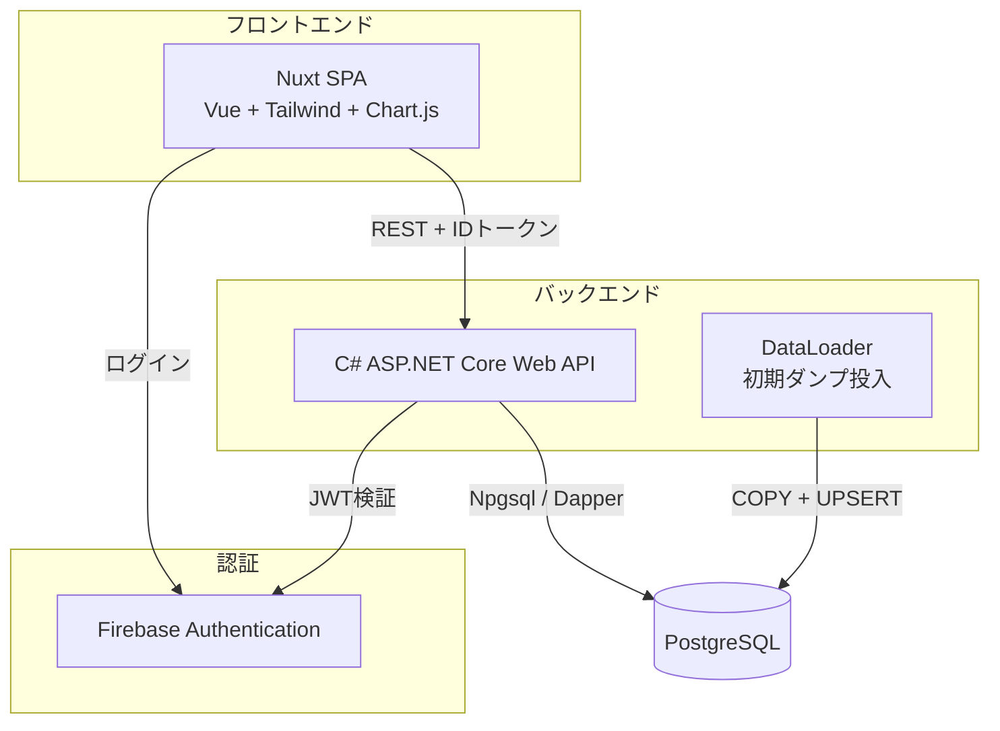
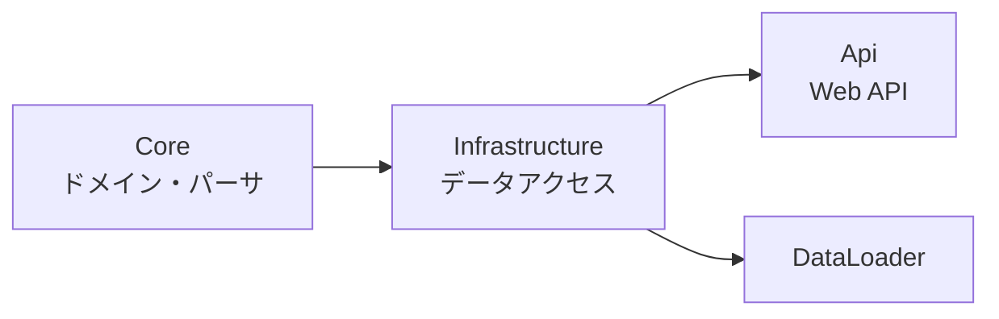
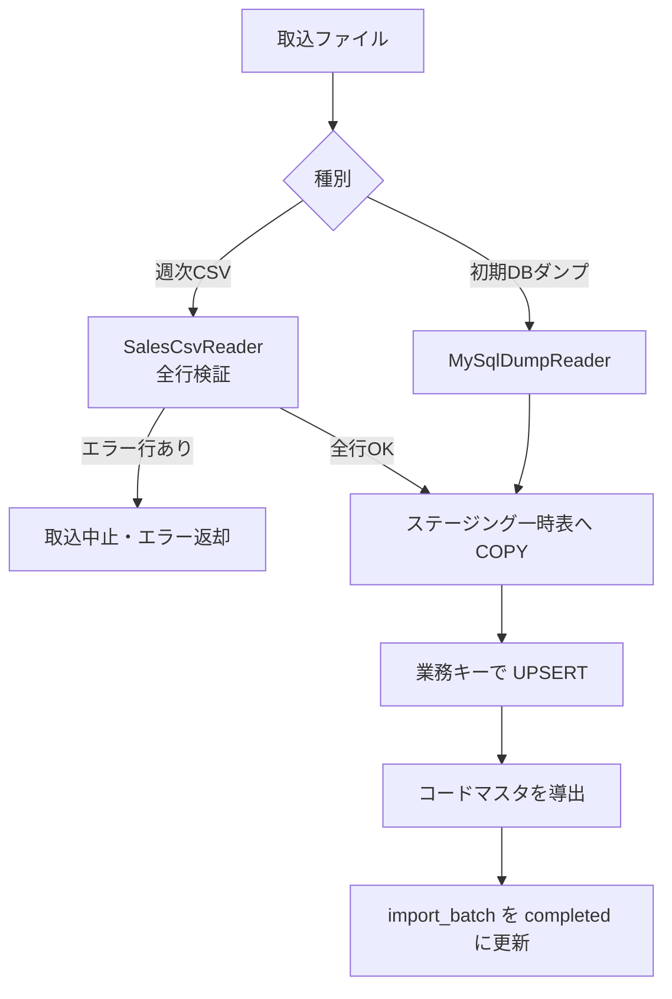

# UndeuxSales 売上参照スイート — 設計ドキュメント

小売から提供される週次売上参照データを PostgreSQL に格納し、売上を可視化する
アプリケーションの設計をまとめる。

## 1. 概要

- 小売（取引先）から週次で提供される売上参照ファイルを取り込み、蓄積する。
- 全社サマリー・売上分析・商品別分析・在庫発注分析の4観点で可視化する。
- 初期データは提供済みの蓄積DBダンプ（MariaDB 形式、約160万行 / 2018-01〜2026-05）。

## 2. アーキテクチャ

レイヤー構成（バックエンド）:

## 3. 技術スタック

| 層 | 技術 |
|----|------|
| フロントエンド | Nuxt 4 / Vue 3 / TypeScript / Tailwind CSS v4 / lucide / Chart.js |
| バックエンド | C# (.NET 8 / ASP.NET Core) / Npgsql / Dapper |
| データベース | PostgreSQL 16 |
| 認証 | Firebase Authentication（IDトークン = JWT） |
| インフラ | Firebase Hosting（フロント） / AWS EC2（API） / AWS RDS（DB） |

## 4. データモデル

### 4.1 売上参照ファイルの週次日付ロジック

- 取込日（`import_date`）は**月曜日**。
- ファイルには取込日の前日（日曜）を基準に特定した1週間（月〜日）のデータが含まれる。
- 日次列 `toshu_uriage_count1`〜`7` は取込日の**前週 月〜日**に対応する。

| 日次列 | 対応する実日付 |
|--------|--------------|
| `toshu_uriage_count1`（月） | `import_date − 7` |
| `toshu_uriage_count7`（日） | `import_date − 1` |

例: `import_date = 2026-05-18` → 列1〜7 = `2026-05-11` 〜 `2026-05-17`。

このロジックは `WeekCalendar`（Core）と日次トレンドクエリ（Infrastructure）で同一に実装する。

### 4.2 テーブル構成

| テーブル | 役割 |
|----------|------|
| `sales_weekly` | 売上参照ファクト。週次スナップショット（取込日 × 店舗 × 商品単品） |
| `import_batch` | 取込バッチ履歴（追記専用）。取込済みデータの SoT |
| `department` / `customer` / `business_type` / `season` | コードマスタ（取込時に自動導出） |

- ファクトテーブルの主キーは意味を持たない代理キー（`bigint` 採番）。
- 業務複合キー（取込日・取引先・業態・品番・単品・商品記号・導入日）は冪等な
  UPSERT のための UNIQUE 制約に限定し、リレーションには用いない。

### 4.3 Source of Truth（SoT）

| データ | SoT | キャッシュ／派生 |
|--------|-----|----------------|
| 売上参照ファクト | 取込ファイル（ダンプ / 週次CSV） | `sales_weekly` |
| 取込履歴 | `import_batch` | — |
| コードマスタ | 売上参照ファクト | `department` 他（取込時に同一トランザクションで導出） |

## 5. データフロー（取込）

- 取込はトランザクション内で実行し、冪等（再取込は SoT による訂正とみなし測定値を更新）。
- 週次CSVはエラー行が1件でもあれば全体を中止する（部分取込による不整合を避ける）。

## 6. API 仕様

すべて `/api` 配下。`/api/health*`・`/api/error-codes` 以外は Firebase IDトークン（Bearer）必須。

| メソッド | パス | 説明 |
|---------|------|------|
| GET | `/api/health` `/api/health/ready` | 稼働・準備状態 |
| GET | `/api/filters` | フィルタ選択肢（部門・取引先・業態・季節・取込週） |
| GET | `/api/summary` | 全社サマリー（KPI + 週次トレンド） |
| GET | `/api/sales/trend` | 売上トレンド（`granularity=daily\|weekly`） |
| GET | `/api/sales/breakdown` | 集計軸別ランキング（`dimension`・`metric`・`order`・`limit`） |
| GET | `/api/inventory` | 在庫・発注分析（最新週基準） |
| GET | `/api/products` | 商品別一覧（`sort`・`order`・`page`・`pageSize`） |
| GET | `/api/imports` | 取込バッチ履歴 |
| POST | `/api/imports` | 週次CSV取込（multipart）。**取込権限ロール（`role=admin` クレーム）必須** |
| GET | `/api/error-codes` | エラーコード一覧 |

共通フィルタ（クエリ）: `from`・`to`（取込週）、`departments`・`customers`・`businessTypes`・`seasons`（複数可）。

### 認可

- 参照系エンドポイントは Firebase 認証済みであれば利用可能。
- データ更新操作（`POST /api/imports`）は Firebase カスタムクレーム `role=admin` を持つ
  利用者に限定する（取込権限のないユーザーが売上データを改変できないようにするため）。
  カスタムクレームは Firebase Admin SDK で管理者アカウントに付与する。

## 7. 主要な設計判断

- **ステージング + UPSERT:** 大量行（初期160万行）の冪等取込のため、一時表へ
  バイナリ COPY し、業務キーで `INSERT ... ON CONFLICT DO UPDATE` する。
- **在庫・累計指標は最新週スナップショット基準:** `zaikosu`・`ruikei_*` 等は
  時点値のため、期間内の各週で合算せず「期間内の最新取込週」の値を用いる。
  一方、売上数量・金額・粗利はフロー値のため期間内で合算する。
- **消化率:** 累計売上数 ÷ 累計納品数（分母0は0）。
- **パフォーマンス:** 約160万行に対する集計を実用速度に収めるため次の最適化を行う。
  - フローKPI（数量・金額・粗利）は週次トレンドの合算で算出し専用クエリを省く。
  - 商品数は `COUNT(DISTINCT)` を避け、`DISTINCT` サブクエリの行数を数える
    （`(hinban_code, tanpin_code)` インデックス利用。約8秒→約0.25秒）。
  - 日次トレンドは縦展開前に取込日単位で集計してから日次7列を展開する（約1.75秒→約0.4秒）。
  - サマリーは上記最適化により3クエリ計でも約0.5秒に収まるため、1リクエスト1接続で
    逐次実行する（接続プール消費を抑える）。残る体感遅延はフロントのスケルトン表示で補償する。
- **同時取込の直列化:** 取込トランザクションは PostgreSQL の advisory lock で直列化し、
  同一週の並行取込による取込履歴の不整合を防ぐ。
- **配信のセキュリティ:** SPA配信に `X-Frame-Options`・`X-Content-Type-Options`・
  `Referrer-Policy`・`Strict-Transport-Security` を付与する（nginx / Firebase Hosting 双方）。

## 8. エラーコード

形式 `UNDX-{領域}-{連番}`。一覧は `GET /api/error-codes` または `ErrorCodes`（Core）参照。

| 領域 | 例 | 内容 |
|------|-----|------|
| AUTH | `UNDX-AUTH-001` | 認証エラー |
| REQ | `UNDX-REQ-001`〜`003` | リクエスト検証エラー |
| IMP | `UNDX-IMP-001`〜`005` | 取込処理エラー |
| DATA / SYS | `UNDX-DATA-001` / `UNDX-SYS-001` | データ層 / 想定外エラー |

## 9. 検証状況

- バックエンド: ユニット・統合テスト 69 件がパス。初期DBダンプ（約160万行）の投入を確認。
- フロントエンド: ビルド・静的生成・型チェックがパス。
