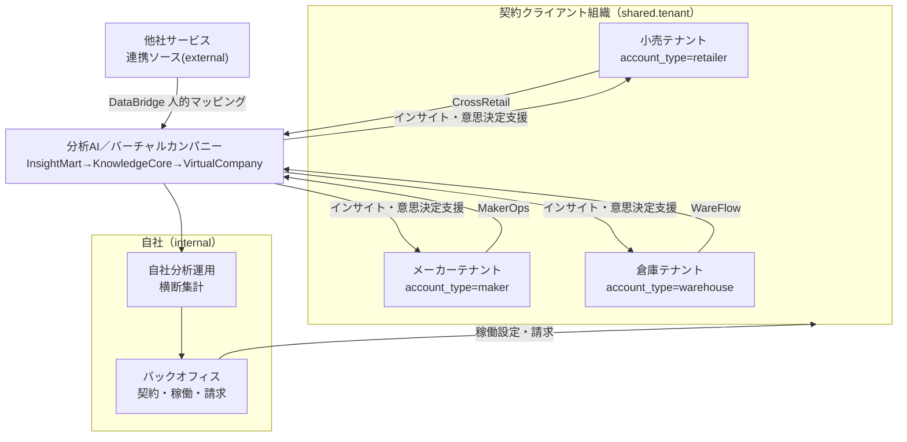
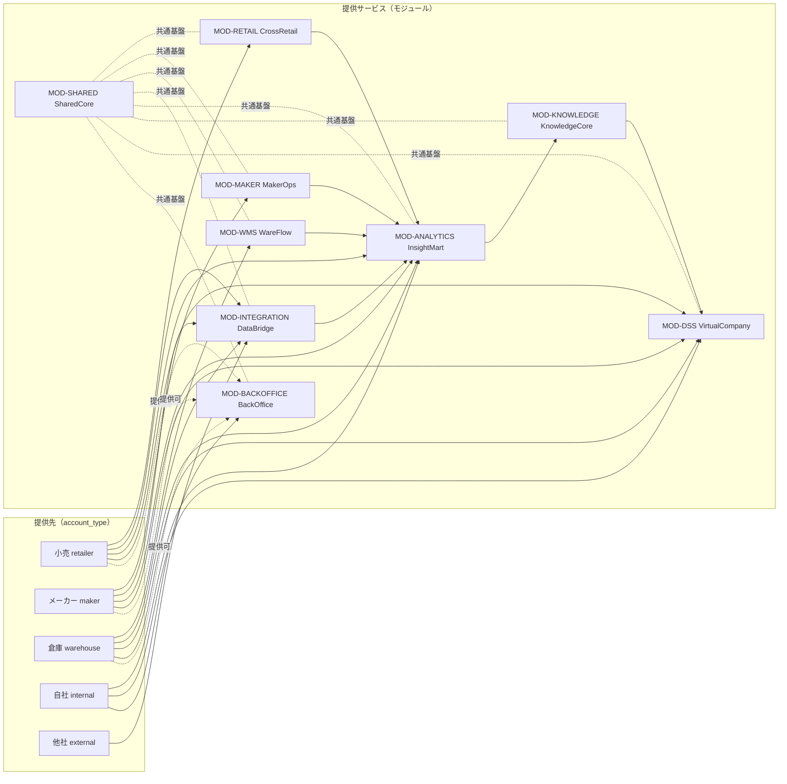
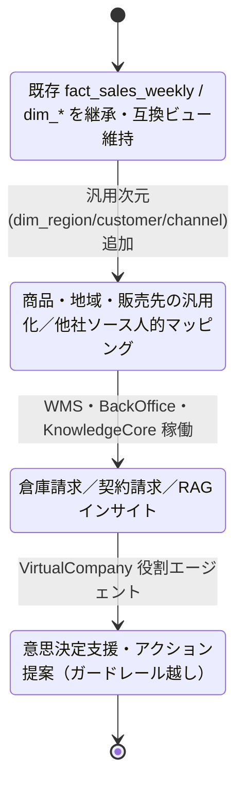

# 00 ビジョン・スコープ — Undeux Platform（UCP）構想定義

> **ステータス:** ドラフト（レビュー前）
> **版:** v1.0
> **最終更新:** 2026-07-04
> **関連ドキュメント:** [正準設計ブループリント v1.0]（全ドキュメント共通契約）／ [用語集](./glossary.md) ／ [意思決定ログ（ADR）](./decision-log.md) ／ [BD-01 アーキテクチャ概観](./basic-design/BD-01-architecture-overview.md) ／ [BD-03 分析・AIプラットフォーム](./basic-design/BD-03-analytics-ai-platform.md) ／ [DD-01 正準データモデル](./detailed-design/DD-01-canonical-data-model.md) ／ [DB-05 分析スタースキーマ](./database/DB-05-analytics-star-schema.md) ／ 継承元 [docs/design.md](../design.md)・[docs/star-schema-design.md](../star-schema-design.md)

---

本ドキュメントは Undeux Platform（略称 **UCP**、プロダクト系統コード `UNDX`）の**最上位設計ドキュメント**である。プラットフォーム全体の構想・スコープ・提供価値・差別化戦略を定義し、後続の基本設計（BD-01〜06）・詳細設計（DD-01〜06）・DB設計（DB-01〜08）・用語集・ADR が参照する起点となる。名称・ID・SoT・命名規約はすべて正準設計ブループリント v1.0 が SoT であり、本書はその範囲内で「何を・誰に・なぜ」を確定する。

---

## 1. 構想サマリー（何を・誰に・なぜ）

### 1.1 一行定義

Undeux Platform は、**小売・メーカー・倉庫の業務アプリ（自社開発 SaaS 群）と他社サービスからの連携データを、正準データモデルと人的フィールドマッピングを介してコンフォームド・スタースキーマ（mart）へ自動集約し、AI/RAG による集計・分類・ベクター化でインサイトを生成する SCM＋分析プラットフォーム**である。

### 1.2 何を（What）

現行プロダクト UndeuxSales は「単一小売（しまむら）から週次提供される売上参照データを PostgreSQL に蓄積し、メーカー視点で売上・在庫を可視化する Web アプリ」であり、分析画面は mart スキーマ（スタースキーマ）から集計している。UCP はこの既存資産を土台に、単一小売×単一メーカーの閉じた可視化から、**小売・メーカー・倉庫を横断し他社データも取り込む一般化されたサプライチェーン分析基盤**へ拡張する。

分析軸の基本は一貫して「**商品・地域・販売先**」であり、地域粒度は都道府県／市区町村をクライアント規模に応じ動的に切替える（`shared.tenant.region_granularity`）。

### 1.3 誰に（Who）

- **小売**（`account_type = retailer`）: `MOD-RETAIL` CrossRetail を提供。
- **メーカー**（`account_type = maker`）: `MOD-MAKER` MakerOps を提供。
- **倉庫**（`account_type = warehouse`）: `MOD-WMS` WareFlow を提供。
- **自社**（`account_type = internal`）: `MOD-BACKOFFICE` BackOffice で契約・稼働・請求を運用し、分析・可視化を自社利用する。
- **エコシステム（他社サービス）**: `MOD-INTEGRATION` DataBridge 経由でデータ連携する事業者。

### 1.4 なぜ（Why）

各業務アプリの OLTP を **SoT（Source of Truth）**、mart を **派生キャッシュ** とする一貫したデータフローにより、業種・規模の異なるクライアントを単一の正準モデルへ収れんさせ、以下の価値を提供する。

- 業務データがそのまま分析へ流れる「**分析サービスへの連携難易度の低さ**」（自社アプリは最初からスタースキーマ連携前提スキーマ）。
- 業界／クライアント別ドメイン知識を蓄積した RAG により、**各分析機能の実現性**を高める。
- 役割エージェント群（VirtualCompany）による意思決定支援。

> **継承の明示:** 本構想は継承元 [docs/design.md](../design.md)・[docs/star-schema-design.md](../star-schema-design.md) の設計思想（SoT→mart 派生・汎用バリアント2軸・SCD1・jsonb+生成列・企業集約次元・互換ビュー段階移行・冪等 rebuild）を継承し一般化したものである。

---

## 2. ステークホルダーとサービス提供先

UCP のステークホルダーは「**テナント（契約クライアント組織）** = `shared.tenant`」を分離単位とし、`account_type ∈ {retailer, maker, warehouse, internal}` で区別する。他社サービスはテナントではなく **連携ソース**（`mapping.source_system.system_type = 'external'`）として位置づける。

| ステークホルダー | 区分（account_type） | 主に利用するモジュール | 本プラットフォームでの役割 |
|---|---|---|---|
| 小売 | `retailer` | CrossRetail / InsightMart / VirtualCompany | 店舗・EC の商品/売上/在庫を管理し分析する |
| メーカー | `maker` | MakerOps / InsightMart / VirtualCompany | 生産・発注・納品・売上・在庫を管理し分析する |
| 倉庫 | `warehouse` | WareFlow / InsightMart | 入出庫・在庫・帳票・荷主請求を管理する |
| 自社（バックオフィス） | `internal` | BackOffice / InsightMart / KnowledgeCore | 契約・稼働・請求を束ね、分析を自社運用する |
| エコシステム（他社サービス） | （テナント外・連携ソース） | DataBridge | 他社アプリのデータを正準モデルへ連携する |

上図は、各業種テナントと他社連携ソースが分析AIへデータを供給し、分析結果（インサイト・意思決定支援）が各テナントへ還流する双方向の関係を示す。バックオフィスは全テナントの稼働設定・請求を束ね、自社分析運用は横断集計を通じて計測・請求へ接続する。

---

## 3. 提供サービス一覧と各サービスの価値提案

提供サービスは正準設計ブループリント §2 のモジュールカタログに厳密に従う。以下は各モジュールの提供先と価値提案の要約であり、詳細責務は各 BD/DD/DB が定義する。

| モジュールID | 正準名称 | 日本語名称 | 提供先 | 価値提案（要約） |
|---|---|---|---|---|
| `MOD-SHARED` | SharedCore | 共通基盤 | 共通 | 認証・共通参照マスタ・テナント管理・地域/通貨/単位/カレンダー・エラーコード基盤を最下層で提供 |
| `MOD-RETAIL` | CrossRetail | クロスリテーラーサービス | 小売 | 店舗経営＋EC を横断する商品マスタ・商取引・売上/在庫の管理と分析 |
| `MOD-MAKER` | MakerOps | メーカーサービス | メーカー | 生産・発注・納品・売上・在庫のトランザクション管理と分析 |
| `MOD-WMS` | WareFlow | 倉庫WMS | 倉庫 | SKUマスタ・入出庫・在庫・出荷帳票・荷主請求 |
| `MOD-INTEGRATION` | DataBridge | 連携/変換基盤 | 共通 | ソース登録・フィールドマッピング・変換・ジョブ実行・データ品質・ステージング取込 |
| `MOD-ANALYTICS` | InsightMart | 分析・可視化アプリ | 小売/メーカー/倉庫/自社 | コンフォームド次元/ファクトの自動スタースキーマ化・KPI/クロス集計/ランキング/在庫健全性/散布図・回帰 |
| `MOD-KNOWLEDGE` | KnowledgeCore | ドメイン知識/AI基盤 | 共通 | 業界/クライアント別知識ストア・ベクター化・RAG・インサイト生成・ガードレール |
| `MOD-DSS` | VirtualCompany | 意思決定支援 | 小売/メーカー/倉庫/自社 | 役割エージェント群による意思決定支援・シミュレーション・アクション提案 |
| `MOD-BACKOFFICE` | BackOffice | バックオフィス | 自社/共通（クライアント提供可） | 契約・稼働設定・使用量計測・請求。自社運用＋クライアント提供可 |

### 3.1 サービス提供先マッピング

上図は「誰が」「どのサービスを」利用するかの対応関係を示す。各業種は自社向け業務アプリ（CrossRetail/MakerOps/WareFlow）を主軸に利用し、全業種・他社が DataBridge を通じて InsightMart へ集約される。KnowledgeCore と VirtualCompany は分析の上位に積み上がる。SharedCore は全モジュールの共通最下層である。BackOffice は自社運用が主だがクライアントへも提供可能（点線）。

### 3.2 各サービスの価値提案（詳細）

- **クロスリテーラー（CrossRetail）:** `retail.product_master` / `retail.sales_transaction` / `retail.inventory_snapshot` 等を SoT とし、店舗経営とEC を単一商品マスタ（汎用バリアント2軸）で横断管理。売上・在庫が即座に分析可能な形へ流れる点が価値。
- **メーカー（MakerOps）:** `maker.production_order` / `maker.delivery` / `maker.sales_order` / `maker.inventory_snapshot` を SoT とし、生産計画から納品・売上・在庫までを一気通貫で可視化。消化率・在日・OTB を分析指標へ接続。
- **倉庫WMS（WareFlow）:** `wms.inbound` / `wms.outbound` / `wms.inventory_snapshot` を SoT とし、出荷帳票（`wms.shipping_document`）出力と荷主請求（`wms.shipper_billing`）を提供。荷主（shipper）を請求先とする点が特徴。
- **分析可視化（InsightMart）:** 各アプリの OLTP をコンフォームド次元/ファクト（`dim_*` / `fact_*`）へ自動スタースキーマ化。KPI・クロス集計・ランキング・在庫健全性・散布図（スイッチ温度）・回帰を提供。
- **意思決定支援（VirtualCompany）:** `agent.cmo` / `agent.cfo` / `agent.merchandiser` / `agent.supply_planner` / `agent.analyst` の役割エージェント群がシミュレーションとアクション提案を行う。実行系書込はガードレール越しのみ（ADR-010）。
- **バックオフィス（BackOffice）:** `backoffice.contract` / `service_activation`（設定系）を SoT に、`usage_metering`（記録系・巻戻し禁止）で計測し `billing_invoice` を発行。自社運用に加えクライアントへも提供可能。

---

## 4. 差別化戦略

自社サービス利用と他社サービス連携の差別化軸は「**分析サービスへの連携難易度の低さ**」と「**各分析機能の実現性**」である。

### 4.1 分析連携の容易さ（自社直結 vs 他社人的マッピング）

自社アプリ（retail/maker/wms）は最初からスタースキーマ連携を前提としたスキーマ定義を持つため、`mapping.source_system.system_type = 'self'` の恒等マッピング（`field_mapping.resolved_by = 'auto'`）で人的解決を省略し mart へ直結する。他社ソースは `system_type = 'external'` / `resolved_by = 'human'` として人が正準ターゲット（`mapping.canonical_target`）へ紐付ける（ADR-002）。この非対称性が「自社利用のほうが圧倒的に連携が容易」という価値を生む。

### 4.2 分析機能の実現性（正準モデル＋知識層）

全業種を「商品・地域・販売先」の共通分析軸へ収れんさせ、業種差は `attributes jsonb`＋生成列（ADR-007）と汎用バリアント2軸（ADR-008）で吸収する。これにより DDL 変更なしに業種横断の集計機能を提供でき、機能の実現性が高い。さらに業界／クライアント別ドメイン知識（`knowledge.domain_document`、industry/client 二層）を RAG で活用し、単純集計を超えた示唆（`knowledge.insight`）を生成する。

### 4.3 比較（自社直結 / 他社連携 / 汎用BIツール）

| 観点 | 自社アプリ直結 | 他社サービス連携 | 一般的な汎用BI（参考比較） |
|---|---|---|---|
| 連携難易度 | 最低（恒等マッピング自動） | 中（人的フィールドマッピング要） | 高（都度ETL設計） |
| 分析モデル | 正準スタースキーマ即時 | 正準ターゲットへ写像後に mart 化 | 個別設計・非共有次元になりがち |
| ドメイン知識活用 | KnowledgeCore で標準提供 | 同左（クライアント知識を蓄積） | 外付け・属人的 |
| 意思決定支援 | VirtualCompany 標準 | 同左 | 別途構築 |
| データ品質保証 | 自動（スキーマ制約） | `data_quality_rule` で検証 | 個別実装 |

> 汎用BI列はブループリント未定義の**参考比較（拡張提案）**であり、契約上の機能約束ではない。

---

## 5. スコープ境界

### 5.1 本設計に含む

- 正準設計ブループリント §1〜§12 で確定した 9 モジュール（`MOD-SHARED` 〜 `MOD-BACKOFFICE`）の構想・スコープ・提供価値・差別化。
- SoT → mart 派生の一貫したデータフロー方針と SoT 全体宣言サマリー（§7）。
- 分析軸「商品・地域・販売先」と地域粒度動的化の方針。
- マルチテナント方式（OLTP=RLS＋論理列、mart=スキーマ分離のハイブリッド、ADR-001）。

### 5.2 本設計に含まない（他ドキュメントへ委譲）

- 物理スキーマの CREATE TABLE 詳細 → 各 DB 設計書（[DB-01](./database/DB-01-schema-strategy.md) 〜 DB-08）。本書は代表 DDL を提示しない（DB設計書が SoT）。
- API リソース・契約・エラー詳細 → [DD-02](./detailed-design/DD-02-api-interface-design.md)。
- マッピング/変換エンジンの実装詳細 → [DD-03](./detailed-design/DD-03-mapping-transform-engine.md)。
- AI/RAG/エージェントの実装詳細 → [DD-04](./detailed-design/DD-04-ai-rag-agent-design.md)。
- 画面/UX/SI カスタマイズ戦略 → [DD-05](./detailed-design/DD-05-screen-ux-si-strategy.md)。
- 認証/認可/テナント分離の実装 → [DD-06](./detailed-design/DD-06-security-authz-tenancy.md)。

### 5.3 段階リリースの考え方

継承元 UndeuxSales（メーカー視点・単一小売由来の週次売上参照）を出発点とし、既存の `fact_sales_weekly` / `dim_*` を**そのまま継承**しつつ、互換ビューで旧API契約を維持したまま段階移行する（ADR-006・ADR-013）。他社由来のしまむら週次データは移行期に `staging.raw_record` / `staging.import_batch` を SoT として再配置する（ブループリント §3.3 注）。ビッグバン移行は採らず、ロールバック容易性とフロント無改修を優先する。

上図は段階リリースの状態遷移を示す。各段は前段の互換ビューを壊さず積み増す。移行の各段は冪等な `mart.rebuild()`（ADR-009）で再構築でき、記録系（`job_run` / `usage_metering` / `agent_run`）は巻き戻さない。

---

## 6. 全体像（システムコンテキスト）とドメイン間データの流れ

### 6.1 システムコンテキスト

UCP は最下層に SharedCore（認証・共通参照マスタ）、その上に業種別 OLTP（CrossRetail/MakerOps/WareFlow）と連携基盤（DataBridge）、さらに上に分析（InsightMart）・知識/AI（KnowledgeCore）・意思決定支援（VirtualCompany）、横断でバックオフィス（BackOffice）を配置する。データは常に **業務OLTP（SoT）→ DataBridge → mart（派生）→ 知識/AI → 意思決定支援** の一方向に流れ、分析結果が各テナントへ還流する。

```mermaid
graph TD
    subgraph SoT層["SoT層（業務OLTP / ステージング）"]
        SC[MOD-SHARED SharedCore<br/>shared.*]
        RT[MOD-RETAIL CrossRetail<br/>retail.*]
        MK[MOD-MAKER MakerOps<br/>maker.*]
        WM[MOD-WMS WareFlow<br/>wms.*]
        ST[staging.raw_record<br/>他社連携SoT]
    end
    subgraph 連携["連携・変換（DataBridge）"]
        IN[MOD-INTEGRATION<br/>mapping.* / staging.*]
    end
    subgraph 派生["派生キャッシュ（分析mart）"]
        AN[MOD-ANALYTICS InsightMart<br/>mart_&#123;tenant_code&#125;]
    end
    subgraph 知識支援["知識・意思決定支援"]
        KN[MOD-KNOWLEDGE KnowledgeCore<br/>knowledge.*]
        DS[MOD-DSS VirtualCompany<br/>役割エージェント]
    end
    BO[MOD-BACKOFFICE BackOffice<br/>backoffice.*]
    EXT[他社サービス]

    SC --> RT & MK & WM & IN & BO
    RT & MK & WM -->|恒等マッピング self| IN
    EXT -->|人的マッピング external| ST --> IN
    IN -->|rebuild 冪等再構築| AN
    AN --> KN --> DS
    AN --> BO
    AN --> DS
    DS -.アクション提案（ガードレール越し）.-> RT & MK & WM
```

上図は 9 モジュールのデータ流とレイヤ関係を示す。SharedCore が全モジュールへ共通基盤を供給し、業務3アプリと他社データは DataBridge に集まり、InsightMart で mart 化され、KnowledgeCore → VirtualCompany へ積み上がる。BackOffice は分析結果（使用量計測の基礎）を受け取り請求へ用いる。VirtualCompany の業務更新提案はガードレールを介してのみ SoT 側へ戻る（点線、ADR-010）。

### 6.2 ドメイン間データの流れ（要点）

- **書込順序:** SoT（OLTP／staging）への書込が先、mart 更新が後。逆順は不整合の原因（ブループリント §7 確定事項）。
- **自社直結:** retail/maker/wms は `system_type='self'` の恒等マッピングで mart へ直結。
- **他社連携:** `staging.raw_record`（SoT）→ 正準OLTP相当 → mart。回復パスはジョブ再実行（`mapping.job_run`）→ `mart.rebuild()`。
- **再構築:** mart は advisory lock 直列化・`SET LOCAL statement_timeout=0`・非同期実行で冪等再構築（ADR-009）。

---

## 7. SoT 全体宣言サマリー

各データ領域の SoT・派生・回復パスは正準設計ブループリント §7 が SoT である。以下はその要約（詳細および全領域は各 DB 設計書へ委譲）。

| データ領域 | SoT | 派生／キャッシュ | 回復パス |
|---|---|---|---|
| 自社小売業務（売上/在庫/発注） | `retail.*`（OLTP） | `mart_{tenant_code}` の `dim/fact` | `mart.rebuild()` |
| 自社メーカー業務 | `maker.*`（OLTP） | `mart_{tenant_code}` | `mart.rebuild()` |
| 倉庫業務（入出庫/在庫/請求） | `wms.*`（OLTP） | `mart_*` / `fact_billing` | `mart.rebuild()` |
| 他社連携データ | `staging.raw_record` / `staging.import_batch` | 正準OLTP相当 → `mart_*` | ジョブ再実行 `mapping.job_run` → rebuild |
| 分析集計・KPI | 各ファクト `fact_*` | 集約マテビュー・静的スナップショット | マテビュー REFRESH / スナップショット再生成 |
| ベクター/インデックス | `knowledge.domain_document` | `document_chunk` / `embedding` | `EmbeddingPipeline` 再実行 |
| 契約/稼働/請求 | `backoffice.contract` / `service_activation`（設定系） | `usage_metering`（記録系・巻戻し禁止） | 計測は追記のみ・請求は期締めで再計算 |
| 在庫アクションフラグ（ユーザー判断） | `retail.inventory_action_flag`（public/自然キー） | なし | mart 再構築の影響を受けない（原則2） |
| テナント/認証 | Firebase Auth ＋ `shared.tenant` | `shared.user_account` | Firebase Admin SDK 再同期 |

**確定事項:** 分析 mart は常に派生。自社アプリは OLTP が SoT、他社連携は取込ステージングが SoT。SoT 書込→キャッシュ更新の順序を全モジュールで厳守する。詳細は [DD-01 正準データモデル](./detailed-design/DD-01-canonical-data-model.md)・[DB-05 分析スタースキーマ](./database/DB-05-analytics-star-schema.md) を参照。

---

## 8. 主要な設計原則（方法論・CLAUDE.md 継承）

本プラットフォームは `.ai-native/methodology/` と `CLAUDE.md` の実装原則を継承する。担当領域（構想・スコープ）に関係する事項を以下に明示する。

- **SoT と書込順序:** 各データの SoT を §7 で宣言。SoT 書込を先、派生（mart）更新を後にし、回復パス（`rebuild()` / ジョブ再実行 / 再同期）を必ず用意する（原則6）。
- **冪等性と状態保護:** `mart.rebuild()` は冪等。記録系（`job_run` / `usage_metering` / `agent_run` / `import_batch`）は再実行で巻き戻さない。設定系（`service_activation`）のみ更新（原則2、ADR-009/014）。
- **下位互換性とデータ保護:** 既存 `fact_sales_weekly` / `dim_*` を継承し、互換ビューで旧API契約を維持したまま段階移行する。I/F 変更時はデータ更新パッチと影響評価を伴う（原則7、ADR-006/013）。
- **グレースフルデグラデーション（非ブロッキング）:** 補助処理（ラベル作成・データ品質検証・ベクター化・帳票出力等）の失敗が主要フローを止めない。致命的失敗のみ例外（原則4）。
- **エラーコード（UNDX-*）:** 想定エラーは `UNDX-{領域}-{連番}` で一元管理（`shared.error_code` ＋ Core の `ErrorCodes` が SoT、`GET /api/error-codes` で公開）。領域は `AUTH/REQ/IMP/DATA/SYS/TENANT/MAP/DQ/RTL/MKR/WMS/ANL/AI/BILL`（ブループリント §9）。
- **レスポンシブ対応:** InsightMart 等 UI を持つモジュールは、PC=表／モバイル=カード型のレスポンシブを必須とする（Nuxt 4 / Tailwind CSS v4、ブループリント §8.5、原則8）。
- **API 設計:** 1API=1責務、一覧/詳細分離、レスポンスに別リソース非混在（詳細は [DD-02](./detailed-design/DD-02-api-interface-design.md)）。
- **反復レビュー:** 独立ロール（コードレビュアー・システム監査官）による指摘ゼロまでのイテレーションを前提とする（原則9）。

---

## 9. 前提・未決事項

### 9.1 前提（想定）

- 名称・ID・SoT・命名規約は正準設計ブループリント v1.0 が不変の SoT であり、本書は新規テーブル・次元・モジュールを追加しない（追加時は「拡張提案」と明記し、ブループリントを先に改訂する）。
- テナント＝契約クライアント組織であり、他社サービスはテナントではなく連携ソース（`system_type='external'`）として扱う。
- 継承元 [docs/design.md](../design.md)・[docs/star-schema-design.md](../star-schema-design.md) の設計思想を土台とし、既存 mart 資産を継承する。
- 技術スタックはブループリント §8.5 を継承（Nuxt 4 / .NET 8 / PostgreSQL 16 / Firebase Auth / Firebase Hosting・AWS EC2・RDS）。
- §4.3 の汎用BI比較列、および将来の AWS マネージド構成は**拡張提案**であり契約約束ではない。

### 9.2 未決事項

- **他社連携のリアルタイム性:** 現状の継承は週次バッチ（しまむら週次）。準リアルタイム連携（Webhook/ストリーム）の要否と `mapping_job.schedule` の粒度は未決（[DD-03](./detailed-design/DD-03-mapping-transform-engine.md) で判断）。
- **ベクターストアの外部化しきい値:** pgvector 既定から外部ベクターストアへ切替える規模基準は未確定（ADR-011、[DB-08](./database/DB-08-knowledge-vector-snapshot-schema.md) で定義）。
- **BackOffice のクライアント提供モデル:** バックオフィスをクライアントへ提供する際の課金・稼働境界は未決（[BD-05](./basic-design/BD-05-backoffice.md) で確定）。
- **VirtualCompany の実行系書込範囲:** ガードレール越しに許容する業務更新アクションの具体的スコープは未決（ADR-010、[DD-04](./detailed-design/DD-04-ai-rag-agent-design.md) で確定）。
- **自社横断集計の経路:** mart スキーマ分離（`mart_{tenant_code}`）下での自社横断集計の物理経路は「別経路」とのみ確定（ブループリント §8.3）。具体設計は [DB-05](./database/DB-05-analytics-star-schema.md) で定義。
- **地域粒度切替の運用:** `region_granularity` を稼働後に変更した場合の既存 mart 再構築影響は未評価（下位互換・原則7、[DB-01](./database/DB-01-schema-strategy.md) で評価）。
