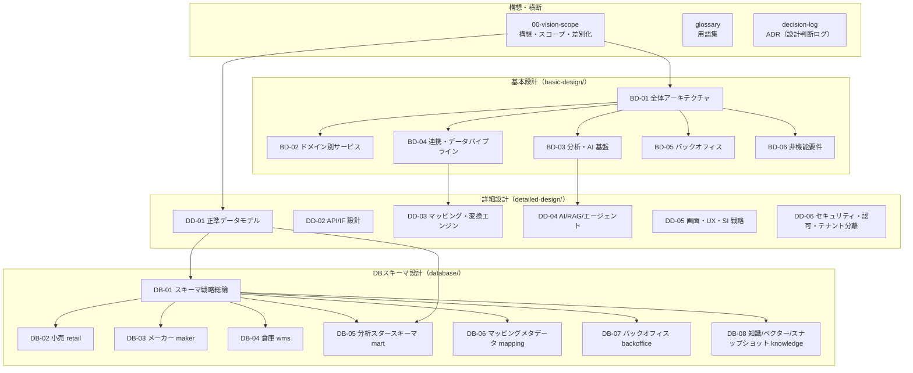

# Undeux Platform（UCP）— プラットフォーム設計ドキュメント

> **ステータス:** 設計ドラフト v1.0（基本設計・詳細設計・DBスキーマ設計の初版）
> **版:** v1.0
> **最終更新:** 2026-07-04
> **対象:** 小売・メーカー・倉庫を繋ぐサプライチェーンマネジメント＋分析プラットフォームの構想設計

本ディレクトリは、既存プロダクト **UndeuxSales**（単一小売の売上参照＋分析 `mart` スタースキーマ）を土台に、
小売・メーカー・倉庫の自社 SaaS 群と他社連携データを、正準データモデルと人的フィールドマッピングを介して
**コンフォームド・スタースキーマ**へ自動集約し、AI/RAG でインサイトを生成する SCM＋分析プラットフォーム
**Undeux Platform（略称 UCP、系統コード `UNDX`）** の設計書群である。

継承元: [`../design.md`](../design.md)（現行アプリ設計）／[`../star-schema-design.md`](../star-schema-design.md)（分析mart設計）。
本設計群はその設計思想（SoT→mart 派生・汎用バリアント2軸・SCD1・jsonb＋生成列・企業集約次元・互換ビュー段階移行・冪等 rebuild）を継承し一般化する。

---

## ドキュメントマップ

上図は本設計群の依存関係の俯瞰である。総論（構想・用語・ADR）を起点に、基本設計 → 詳細設計 → DBスキーマ設計へ具体化が進む。
名称・SoT・命名規約は全ドキュメントで不変（詳細は各ドキュメント冒頭の関連ドキュメント欄）。

---

## 読み方（推奨順）

1. **全体像を掴む:** [00-vision-scope](./00-vision-scope.md) → [basic-design/BD-01 全体アーキテクチャ](./basic-design/BD-01-architecture-overview.md)
2. **ドメインを知る:** [BD-02 ドメイン別サービス](./basic-design/BD-02-domain-services.md)
3. **分析・AI 構想:** [BD-03 分析・AI 基盤](./basic-design/BD-03-analytics-ai-platform.md) → [BD-04 連携・データパイプライン](./basic-design/BD-04-integration-data-pipeline.md)
4. **データモデルを押さえる:** [detailed-design/DD-01 正準データモデル](./detailed-design/DD-01-canonical-data-model.md) → [database/DB-01 スキーマ戦略](./database/DB-01-schema-strategy.md) → [DB-05 分析スタースキーマ](./database/DB-05-analytics-star-schema.md)
5. **必要に応じて各詳細へ:** API・マッピング・AI・UX・セキュリティ（DD-02〜06）、各ドメインスキーマ（DB-02〜04・06〜08）
6. **判断の背景:** [decision-log（ADR）](./decision-log.md)、用語は [glossary](./glossary.md)

---

## ドキュメント一覧

### 総論・横断

| ドキュメント | 内容 |
|---|---|
| [00-vision-scope.md](./00-vision-scope.md) | 構想・スコープ・提供サービス・差別化戦略・ステークホルダー・SoT 全体宣言 |
| [glossary.md](./glossary.md) | 用語集（ドメイン／分析／AI／プラットフォーム固有／略語） |
| [decision-log.md](./decision-log.md) | ADR 形式の主要設計判断ログ |

### 基本設計（basic-design/）

| ドキュメント | 内容 |
|---|---|
| [BD-01-architecture-overview.md](./basic-design/BD-01-architecture-overview.md) | 全体アーキテクチャ（論理・物理/デプロイ・マルチテナント・技術スタック） |
| [BD-02-domain-services.md](./basic-design/BD-02-domain-services.md) | ドメイン別サービス基本設計（小売 CrossRetail／メーカー MakerOps／倉庫 WareFlow） |
| [BD-03-analytics-ai-platform.md](./basic-design/BD-03-analytics-ai-platform.md) | 分析・可視化・AI 基盤（スタースキーマ変換・AI・意思決定支援・バーチャルカンパニー） |
| [BD-04-integration-data-pipeline.md](./basic-design/BD-04-integration-data-pipeline.md) | 連携・データパイプライン（自社/他社連携・マッピング→スター化・スナップショット） |
| [BD-05-backoffice.md](./basic-design/BD-05-backoffice.md) | バックオフィス基本設計（契約・稼働設定・請求） |
| [BD-06-non-functional.md](./basic-design/BD-06-non-functional.md) | 非機能要件（性能・可用性・拡張性・運用監視・エラーコード・コスト） |

### 詳細設計（detailed-design/）

| ドキュメント | 内容 |
|---|---|
| [DD-01-canonical-data-model.md](./detailed-design/DD-01-canonical-data-model.md) | 共通正準ドメインモデル（コア/拡張分離・商品/地域/販売先の汎用化・EC/店舗両対応） |
| [DD-02-api-interface-design.md](./detailed-design/DD-02-api-interface-design.md) | API/IF 設計（ドメイン/分析/連携/バックオフィス API・認可・エラーコード・共通規約） |
| [DD-03-mapping-transform-engine.md](./detailed-design/DD-03-mapping-transform-engine.md) | 項目マッピング・変換エンジン（メタモデル・人的解決運用・変換ジョブ・データ品質） |
| [DD-04-ai-rag-agent-design.md](./detailed-design/DD-04-ai-rag-agent-design.md) | AI/RAG/エージェント（知識RAG・インデックス/ベクター化・インサイト・バーチャルカンパニー） |
| [DD-05-screen-ux-si-strategy.md](./detailed-design/DD-05-screen-ux-si-strategy.md) | 画面・UX・SI 戦略（サイトマップ・共通UI・カスタマイズ・レスポンシブ） |
| [DD-06-security-authz-tenancy.md](./detailed-design/DD-06-security-authz-tenancy.md) | セキュリティ・認証認可・テナント分離 |

### DBスキーマ設計（database/）

| ドキュメント | 内容 |
|---|---|
| [DB-01-schema-strategy.md](./database/DB-01-schema-strategy.md) | スキーマ戦略総論（多層データストア・SoT・命名規約・マルチテナント・キー設計） |
| [DB-02-operational-schema-retail.md](./database/DB-02-operational-schema-retail.md) | 小売（CrossRetail）業務スキーマ `retail`（商品/商取引/売上/在庫・店舗+EC） |
| [DB-03-operational-schema-maker.md](./database/DB-03-operational-schema-maker.md) | メーカー（MakerOps）業務スキーマ `maker`（商品/生産/発注/納品/売上/在庫） |
| [DB-04-operational-schema-wms.md](./database/DB-04-operational-schema-wms.md) | 倉庫（WareFlow）業務スキーマ `wms`（SKU/入出庫/在庫/帳票/荷主請求） |
| [DB-05-analytics-star-schema.md](./database/DB-05-analytics-star-schema.md) | 分析スタースキーマ `mart`（コンフォームド次元・ファクト家族・SCD・継承） |
| [DB-06-mapping-metadata-schema.md](./database/DB-06-mapping-metadata-schema.md) | マッピング・変換メタデータ `mapping`（ソース/マッピング/ジョブ/品質/名寄せ） |
| [DB-07-backoffice-schema.md](./database/DB-07-backoffice-schema.md) | バックオフィス `backoffice`（テナント/契約/稼働設定/計測/請求） |
| [DB-08-knowledge-vector-snapshot-schema.md](./database/DB-08-knowledge-vector-snapshot-schema.md) | 知識/ベクター/スナップショット `knowledge`（RAG・エンベディング・静的ファイル） |

---

## 設計の要（全ドキュメント共通の契約）

- **モジュール:** `MOD-SHARED`（共通基盤）／`MOD-RETAIL`（CrossRetail）／`MOD-MAKER`（MakerOps）／`MOD-WMS`（WareFlow）／`MOD-INTEGRATION`（DataBridge）／`MOD-ANALYTICS`（InsightMart）／`MOD-KNOWLEDGE`（KnowledgeCore）／`MOD-DSS`（VirtualCompany）／`MOD-BACKOFFICE`（BackOffice）
- **スキーマ（物理）:** `shared` / `retail` / `maker` / `wms` / `mapping` / `staging` / `backoffice` / `knowledge` / `mart_{tenant_code}`（分析）
- **キー設計:** サロゲート PK（業務 OLTP `{entity}_id`／分析 `{entity}_key`、いずれも bigint IDENTITY）。自然キーは UNIQUE 制約に限定しリレーションに使わない。
- **SoT:** 業務 OLTP／他社連携 `staging` が SoT、分析 `mart` は派生キャッシュ（`rebuild()` で冪等再構築）。SoT→キャッシュの順序を厳守。
- **分析軸:** 商品・地域（都道府県/市区町村の動的粒度）・販売先＋チャネル（店舗/EC）。クライアント固有軸は `attributes jsonb`＋生成列で吸収。
- **マルチテナント:** 業務 OLTP は `tenant_id`＋RLS（`SET LOCAL app.tenant_id` 必須）、分析は `mart_{tenant_code}` スキーマ分離。
- **エラーコード:** `UNDX-{領域}-{連番}`（AUTH/REQ/IMP/MAP/DQ/TENANT/RTL/MKR/WMS/ANL/BILL/AI/DATA/SYS）。SoT は `shared.error_code`＋Core `ErrorCodes`、`GET /api/error-codes` で公開。

---

## 品質プロセス（本設計群の作成方法）

本設計群は AI ネイティブ開発方法論（[`../../.ai-native/methodology/`](../../.ai-native/methodology/)）に基づき、ナビゲーターが各設計ロールを招集して作成した。

1. **ブループリント確定:** 全ドキュメント共通の正準契約（名称・次元・SoT・命名規約）を先に固定
2. **並行執筆:** ロール別に基本設計6・詳細設計6・DBスキーマ8を並行生成
3. **独立レビュー→反復修正:** 命名整合性・方法論準拠・要件網羅の3観点で独立レビューを行い、検出した指摘（R1〜R12）を各ドキュメントへ反映（原則9：改修後の反復レビュー）

> 主要な整合裁定（R1〜R12）は各ドキュメント本文および [decision-log.md](./decision-log.md) に記録している。
> 本設計は構想段階のドラフトであり、各ドキュメント末尾の「未決事項」は実装フェーズで確定する。
