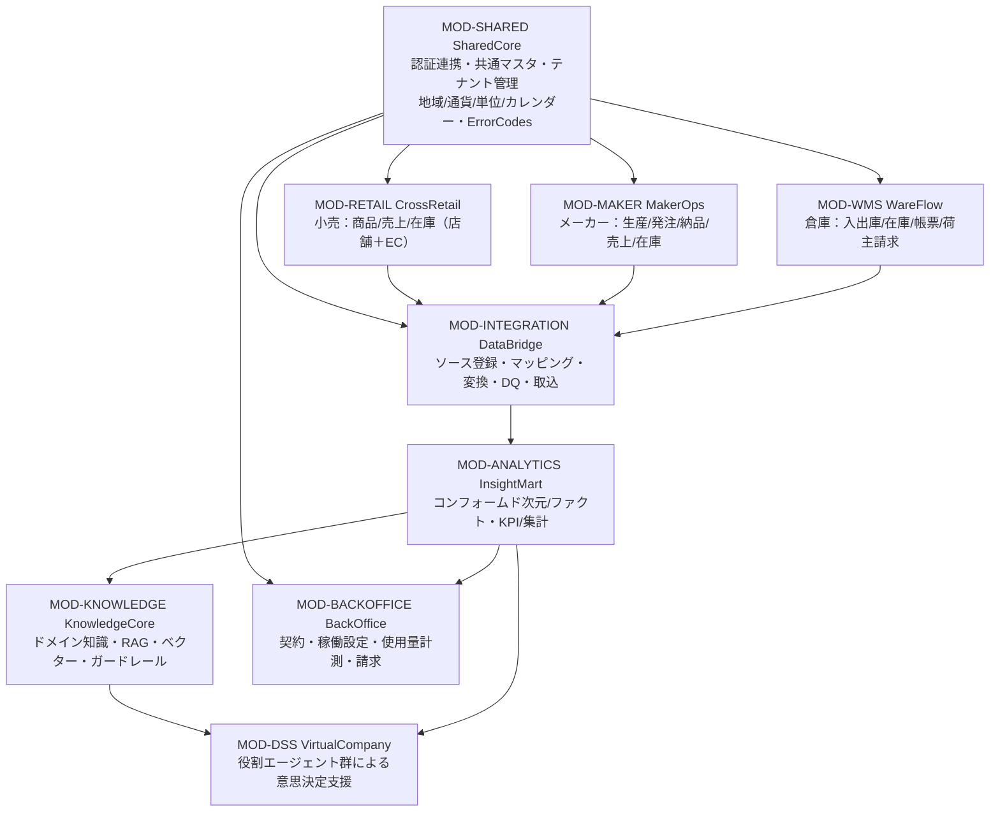
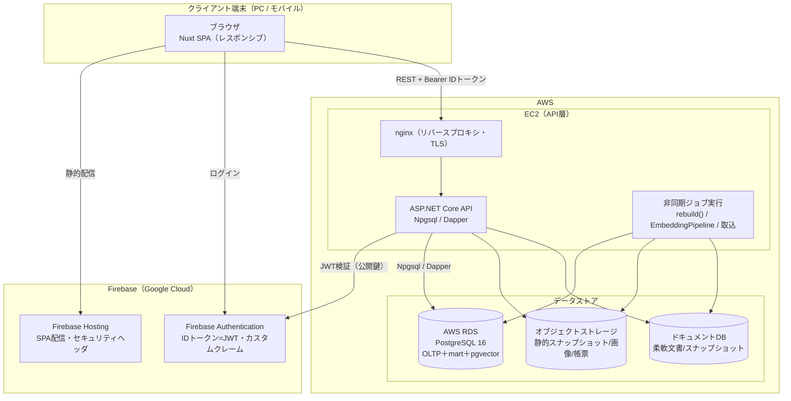

# BD-01 アーキテクチャ概観 — Undeux Platform（UCP）全体アーキテクチャ基本設計

> **ステータス:** ドラフト（レビュー前）
> **版:** v1.0
> **最終更新:** 2026-07-04
> **関連ドキュメント:** [正準設計ブループリント v1.0]（全ドキュメント共通契約）／ [00 ビジョン・スコープ](../00-vision-scope.md) ／ [用語集](../glossary.md) ／ [意思決定ログ（ADR）](../decision-log.md) ／ [BD-02 業務ドメインサービス](./BD-02-domain-services.md) ／ [BD-03 分析・AIプラットフォーム](./BD-03-analytics-ai-platform.md) ／ [BD-04 連携・データパイプライン](./BD-04-integration-data-pipeline.md) ／ [BD-05 バックオフィス](./BD-05-backoffice.md) ／ [BD-06 非機能設計](./BD-06-non-functional.md) ／ [DD-01 正準データモデル](../detailed-design/DD-01-canonical-data-model.md) ／ [DD-06 認証・認可・テナンシー](../detailed-design/DD-06-security-authz-tenancy.md) ／ [DB-01 スキーマ戦略](../database/DB-01-schema-strategy.md) ／ [DB-05 分析スタースキーマ](../database/DB-05-analytics-star-schema.md) ／ 継承元 [docs/design.md](../../design.md)・[docs/star-schema-design.md](../../star-schema-design.md)

---

本ドキュメントは Undeux Platform（略称 **UCP**、プロダクト系統コード `UNDX`）の**全体アーキテクチャ基本設計**である。論理構成・コンポーネント関係・物理/デプロイ構成・マルチテナント方式・データストア構成・技術スタックと選定理由・非機能の全体方針を定義し、後続の各基本設計（BD-02〜06）・詳細設計（DD-01〜06）・DB設計（DB-01〜08）が参照する骨格を与える。名称・ID・SoT・命名規約はすべて正準設計ブループリント v1.0（以下「ブループリント」）が SoT であり、本書はその範囲内で「どう組むか（構造）」を確定する。非機能要件の詳細（性能目標値・可用性設計・セキュリティ実装）は [BD-06](./BD-06-non-functional.md) が owner であり、本書は全体方針の提示に留める。

---

## 0. 前提

本書は以下を前提とする。前提が崩れる場合は「未決事項」（§10）と ADR（[decision-log.md](../decision-log.md)）で再検討する。

- **継承の前提:** 現行 UndeuxSales（[docs/design.md](../../design.md) / [docs/star-schema-design.md](../../star-schema-design.md)）の設計思想（SoT→mart 派生・汎用バリアント2軸・SCD1・jsonb+生成列・企業集約次元・互換ビュー段階移行・冪等 `rebuild()`）を継承・一般化する。現行の3層バックエンド（Core / Infrastructure / Api＋DataLoader）を、モジュール分割された基盤へ発展させる。
- **技術スタックの前提:** ブループリント §8.5 で確定した構成（Nuxt 4 / .NET 8 / PostgreSQL 16 / Firebase Auth / Firebase Hosting＋AWS EC2＋AWS RDS）を初期構成とする。マネージド化・スケール構成は「拡張提案」として明示する。
- **マルチテナントの前提:** テナント＝契約クライアント組織（`shared.tenant`）。分離方式は OLTP=RLS＋論理列 `tenant_id`、mart=スキーマ分離 `mart_{tenant_code}` のハイブリッド（ADR-001）。
- **範囲の前提:** 本書はアーキテクチャの「構造」を確定する。各業務ドメインの機能設計は BD-02、分析/AI は BD-03、連携は BD-04、請求は BD-05、非機能詳細は BD-06 が owner。

---

## 1. アーキテクチャ原則

UCP のアーキテクチャは、ブループリントおよび `.ai-native/methodology/` の最上位原則を、全体構造レベルで具体化した以下の原則に従う。

| # | 原則 | 内容 | 関連 |
|---|---|---|---|
| AP-1 | **SoT ファースト** | 各データの SoT を明示宣言し、書込は SoT が先・派生（mart/キャッシュ/ベクター）は後。SoT からの回復パス（再同期）を必ず用意する。 | §7 SoT宣言（ブループリント §7） |
| AP-2 | **業務 OLTP と分析 mart の分離** | 業務は正規化 OLTP、分析は非正規化スタースキーマ mart。mart は常に派生キャッシュで、`rebuild()` により冪等再構築（advisory lock 直列化・`SET LOCAL statement_timeout=0`・非同期）。 | §6, ADR-009 |
| AP-3 | **モジュール単方向依存** | 依存は「共通基盤 → 業務 → 連携 → 分析 → 知識/AI → 意思決定支援」の一方向。循環依存を作らない（`MOD-SHARED` は最下層・無依存）。 | §3 |
| AP-4 | **コアと拡張の分離** | 業種非依存のコア構造＋`attributes jsonb`＋生成列で業種差を吸収。DDL 変更なしにクライアント固有事情へ SI で追随する。 | §5, ADR-007 |
| AP-5 | **人的マッピングと自社直結の二経路** | 他社連携は人的フィールドマッピング（`resolved_by='human'`）、自社アプリはスタースキーマ連携前提の恒等自動マッピング（`system_type='self'`）。 | §3, ADR-002 |
| AP-6 | **多層防御のテナント境界** | Firebase カスタムクレーム（`role`/`accountType`）＋ PostgreSQL RLS（`app.tenant_id`）＋ mart スキーマ分離＋ AI ガードレールを重ねる。 | §5, ADR-015 |
| AP-7 | **グレースフルデグラデーション** | 補助処理（ベクター化・ラベル作成・Webhook・帳票生成・スナップショット生成）の失敗は主要フローを止めない。致命的失敗のみ例外を投げる。想定エラーは `UNDX-*` を付与（§9）。 | §8, ブループリント §9 |
| AP-8 | **下位互換と段階移行** | 既存 I/F・データ構造の変更は互換ビューで段階移行し、旧 API 契約を維持する。変更時はデータ更新パッチとオペレーター向け説明を用意する。 | §8, ADR-013 |
| AP-9 | **レスポンシブ必須** | UI を持つ全モジュールは PC=表/リスト、モバイル=カード型等の可読形式を両立する。「PC で動く」を完了としない。 | §8, §7技術スタック |

---

## 2. 論理アーキテクチャ（レイヤ構成）

UCP は責務を **プレゼンテーション / API / ドメイン / データ / 連携 / AI** の6レイヤに分離する。各レイヤは直下のレイヤにのみ依存し（AP-3）、上位から下位への単方向データフローを基本とする。分析・AI レイヤは「SoT（業務 OLTP／staging）→ mart 派生 → ベクター/インサイト派生」の派生連鎖として構成され、逆流（AI からの業務書込）はガードレール越しの限定経路のみとする（ADR-010）。

```mermaid
graph TD
    subgraph P["プレゼンテーション層"]
        WEB["Nuxt 4 / Vue 3 SPA<br/>Tailwind v4・Chart.js・lucide<br/>レスポンシブ（PC=表 / モバイル=カード）"]
    end
    subgraph A["API層（ASP.NET Core）"]
        REST["REST API<br/>1API=1責務・一覧/詳細分離"]
        AUTHZ["認可ミドルウェア<br/>Firebase JWT検証＋クレーム→RLS"]
        ERR["ErrorCodes（UNDX-*）<br/>GET /api/error-codes"]
    end
    subgraph D["ドメイン層（モジュール群）"]
        DSHARED["MOD-SHARED SharedCore"]
        DRETAIL["MOD-RETAIL CrossRetail"]
        DMAKER["MOD-MAKER MakerOps"]
        DWMS["MOD-WMS WareFlow"]
        DBO["MOD-BACKOFFICE BackOffice"]
    end
    subgraph DATA["データ層"]
        OLTP[("業務OLTP<br/>shared/retail/maker/wms/backoffice<br/>RLS by tenant_id")]
        MART[("分析mart<br/>mart_&#123;tenant_code&#125;<br/>スキーマ分離")]
        DOC[("ドキュメントDB<br/>スナップショット/柔軟文書")]
        VEC[("ベクターストア<br/>pgvector / 外部")]
        OBJ[("オブジェクトストレージ<br/>静的ファイル/画像/帳票")]
    end
    subgraph INTG["連携層（DataBridge）"]
        MAP["MOD-INTEGRATION<br/>source_system→field_mapping→transform_rule"]
        STG[("staging<br/>raw_record / import_batch<br/>他社連携SoT")]
    end
    subgraph AILAYER["分析・AI層"]
        AN["MOD-ANALYTICS InsightMart<br/>次元/ファクト自動化・KPI・rebuild()"]
        KN["MOD-KNOWLEDGE KnowledgeCore<br/>RAG・EmbeddingPipeline・Guardrail"]
        DS["MOD-DSS VirtualCompany<br/>役割エージェント群"]
    end

    WEB --> REST
    REST --> AUTHZ
    AUTHZ --> DSHARED & DRETAIL & DMAKER & DWMS & DBO
    DRETAIL & DMAKER & DWMS & DBO --> OLTP
    DSHARED --> OLTP
    OLTP --> MAP
    MAP --> STG
    STG --> AN
    OLTP --> AN
    AN --> MART
    AN --> KN
    KN --> VEC
    KN --> DOC
    KN --> DS
    AN --> OBJ
    KN --> OBJ
```



**図の要約:** プレゼン層（Nuxt SPA）は API 層（ASP.NET Core）にのみアクセスし、認可ミドルウェアが Firebase JWT を検証してカスタムクレームを RLS セッション変数（`app.tenant_id`）へ橋渡しする。ドメイン層の各モジュールは業務 OLTP に書込み（SoT）、連携層 DataBridge が他社ソースを `staging` に着地させる（他社連携 SoT）。分析・AI 層は OLTP と staging を入力に mart を冪等再構築し、KnowledgeCore がベクター/ドキュメント/オブジェクトストレージへ派生を生成、VirtualCompany が意思決定支援を返す。データフローは常に SoT→派生の一方向（AP-1/AP-2）。

---

## 3. コンポーネント構成（モジュール関係）

UCP は9モジュール（ブループリント §2）で構成される。`MOD-SHARED` を最下層とし、依存は単方向（AP-3）。各アプリ（retail/maker/wms）は独立して価値提供でき、連携基盤 DataBridge を介して分析基盤 InsightMart に集約される。KnowledgeCore・VirtualCompany が AI インサイト・意思決定支援を担い、BackOffice が契約・稼働・請求を束ねる。



**図の要約:** `MOD-SHARED` が認証（Firebase 連携）・共通参照マスタ（region/unit/currency/calendar_date）・テナント管理・エラーコード基盤を全モジュールへ供給する。業務3モジュール（CrossRetail / MakerOps / WareFlow）は DataBridge へ流し、DataBridge が InsightMart へ集約する。InsightMart は KnowledgeCore（RAG・ベクター）と BackOffice（使用量・請求の分析）へ供給し、KnowledgeCore は VirtualCompany（役割エージェント）へ知識を供給する。この関係はブループリント §2 のモジュール依存図と一致する（名称・依存方向を不変で踏襲）。

### 3.1 各モジュールの責務と提供先

| モジュールID | 正準名称 | 責務（要約） | 主 API リソース例 | 主データ領域 |
|---|---|---|---|---|
| `MOD-SHARED` | SharedCore | 認証連携・共通マスタ・テナント管理・ErrorCodes | `GET /api/error-codes`・共通マスタ参照 | `shared` |
| `MOD-RETAIL` | CrossRetail | 小売の商品マスタ＋商取引＋売上/在庫管理・分析 | 商品マスタ・売上・在庫・発注 | `retail` |
| `MOD-MAKER` | MakerOps | メーカーの生産/発注/納品/売上/在庫 | 生産・発注・納品・売上・在庫 | `maker` |
| `MOD-WMS` | WareFlow | SKU マスタ＋入出庫/在庫＋帳票＋荷主請求 | 入出庫・在庫・帳票・荷主請求 | `wms` |
| `MOD-INTEGRATION` | DataBridge | ソース登録・マッピング・変換・ジョブ・DQ・取込 | ソース/マッピング/ジョブ | `mapping`・`staging` |
| `MOD-ANALYTICS` | InsightMart | コンフォームド化・KPI/クロス集計/ランキング/在庫健全性 | `GET /api/mart/*` | `mart_{tenant_code}` |
| `MOD-KNOWLEDGE` | KnowledgeCore | 知識ストア・ベクター化・RAG・インサイト・ガードレール | 知識/インサイト/エージェント | `knowledge`・ベクター |
| `MOD-DSS` | VirtualCompany | 役割エージェント群による意思決定支援 | エージェント実行 | `knowledge`（agent_*） |
| `MOD-BACKOFFICE` | BackOffice | 契約・稼働設定・使用量計測・請求 | 契約/稼働/請求 | `backoffice` |

> **API 設計の全体方針（詳細は [DD-02](../detailed-design/DD-02-api-interface-design.md)）:** 1API=1責務、一覧と詳細を分離、レスポンスに別リソースを混在させない、集約・加工の責務をクライアントへ押し付けない。現行 UndeuxSales の「集計素材はサーバ・表示射影はフロント」（ランキング順位/ABC・回帰係数・在庫アクション語彙）を UCP 全体の指針として継承する。

---

## 4. 物理/デプロイ構成（AWS/Firebase・環境分離）

初期構成はブループリント §8.5 に従い、フロントを Firebase Hosting、API を AWS EC2、DB を AWS RDS（PostgreSQL 16）に配置する。認証は Firebase Authentication。ベクター/ドキュメント/オブジェクトの各ストアは用途別に配置する（§6）。将来のスケールに応じたマネージド化は「拡張提案」として明記する。



**図の要約:** ブラウザは Firebase Hosting から SPA を取得し、Firebase Authentication でログインして ID トークン（JWT）を得る。API 呼び出しは nginx（TLS 終端・リバースプロキシ・セキュリティヘッダ付与）を経て ASP.NET Core に届き、Firebase 公開鍵で JWT を検証する。DB アクセスは Npgsql/Dapper 経由で RDS（PostgreSQL 16、OLTP＋mart＋pgvector を同居）へ。長時間処理（mart `rebuild()`・EmbeddingPipeline・取込）は API リクエストと別の非同期ジョブとして実行し、リクエストのタイムアウトから切り離す（ADR-009）。静的スナップショット・画像・帳票はオブジェクトストレージ、柔軟文書はドキュメントDB に置く。

### 4.1 環境分離

| 環境 | 用途 | Firebase プロジェクト | AWS | DB |
|---|---|---|---|---|
| Development | 開発・単体/結合試験 | dev プロジェクト | 開発 EC2/コンテナ | RDS（dev）または ローカル PG16 |
| Staging | 受入・SI検証・移行リハーサル | staging プロジェクト | staging EC2 | RDS（staging） |
| Production | 本番 | prod プロジェクト | 本番 EC2 | RDS（prod・自動バックアップ/PITR） |

- 環境別設定は接続文字列・Firebase プロジェクト ID・ストレージバケットを環境変数/シークレットで注入し、コードは同一（`appsettings.{Environment}.json` のオーバーライド順序に留意）。
- テナントの `mart_{tenant_code}` スキーマは環境ごとに独立。移行リハーサルは staging で本番同等データを用いる。

> **拡張提案（マネージド化）:** 将来のスケールに応じ、EC2 → ECS/Fargate または App Runner、非同期ジョブ → SQS＋ワーカー、ベクター規模拡大 → 外部ベクターストア（ADR-011）、静的配信 → CloudFront 併用、を段階導入する。初期はコスト/運用簡素性を優先し EC2＋RDS 構成とする（ブループリント §8.5 の「将来は AWS マネージド構成へ拡張提案可」に準拠）。

---

## 5. マルチテナント方式（テナント境界・分離戦略）

テナント＝契約クライアント組織（`shared.tenant`）。`account_type ∈ {retailer, maker, warehouse, internal}`。分離方式は **OLTP=RLS＋論理列、mart=スキーマ分離のハイブリッド**（ADR-001）。shared 参照マスタのうち非テナント資源（region/unit/currency/calendar_date）はグローバル、テナント所有資源（product/sku/trading_partner）は RLS 対象とする。

```mermaid
flowchart TD
    JWT["Firebase IDトークン（JWT）<br/>クレーム: role / accountType / tenant"] --> MW["API認可ミドルウェア"]
    MW -->|SET app.tenant_id = tenant| SESS["DBセッション（tenant_id 束縛）"]
    MW -->|クレーム検証失敗| ERRT["UNDX-TENANT-*<br/>境界違反として拒否"]

    SESS --> OLTP{"アクセス先"}
    OLTP -->|業務OLTP| RLS["共有テーブル＋RLS<br/>USING (tenant_id = current_setting('app.tenant_id'))"]
    OLTP -->|分析mart| SCH["スキーマ分離<br/>mart_&#123;tenant_code&#125; を検索パスで選択"]
    OLTP -->|共通参照マスタ| GLB["グローバル参照<br/>region/unit/currency/calendar_date（非テナント）"]

    RLS --> ROW["行単位フィルタ済み結果"]
    SCH --> ROW
    GLB --> ROW
    ROW --> GUARD["AIガードレール<br/>PII/テナント越境/出典必須（KnowledgeCore）"]
```



**図の要約:** クライアントの JWT からミドルウェアがテナントを解決し、DB セッションに `app.tenant_id` を設定する（クレーム検証失敗は `UNDX-TENANT-*` で拒否）。業務 OLTP は共有テーブル＋RLS ポリシー（`tenant_id = current_setting('app.tenant_id')`）で行単位分離、分析 mart はテナント別スキーマ `mart_{tenant_code}` を検索パスで選択して物理分離、共通参照マスタ（非テナント）はグローバル共有とする。AI 層はさらにガードレール（PII・テナント越境・出典必須）を重ね、多層防御（AP-6）を構成する。

### 5.1 RLS と search_path の使い分け（設計判断）

| 対象 | 分離方式 | 実装手段 | 選定理由 |
|---|---|---|---|
| 業務 OLTP（`retail`/`maker`/`wms`/`mapping`/`backoffice`/`knowledge`） | 行単位分離 | PostgreSQL RLS＋論理列 `tenant_id`。接続時 `SET app.tenant_id`（`current_setting('app.tenant_id')` を RLS `USING`/`WITH CHECK` で参照） | テナント数が多く、テーブル/スキーマ増殖の運用コストを避けたい。共有テーブルで DDL 一元管理（ADR-001） |
| 分析 mart（`mart_{tenant_code}`） | スキーマ分離 | テナント別スキーマ。接続時 `search_path` を `mart_{tenant_code}` に設定 | 継承元のメーカー単位スキーマ分離を一般化。大規模集約・`rebuild()`（TRUNCATE/再構築）をテナント間で干渉させない。分析クエリの物理分離で性能/安全性を両立（ADR-001/ADR-009） |
| 共通参照マスタ（`shared.region`/`unit`/`currency`/`calendar_date`） | グローバル（非分離） | RLS 非対象。全テナント共有 | 静的・非テナント資源。重複保持を避ける（ブループリント §8.3） |
| テナント所有 shared（`shared.product`/`sku`/`trading_partner`/`store` 等） | 行単位分離 | RLS＋`tenant_id` | 論理は shared だがテナント所有のため OLTP と同一方式 |

- **`search_path` の運用:** mart アクセス時は `SET search_path = mart_{tenant_code}, mart, shared`（テンプレート定義は `mart` に置き、実体はテナントスキーマ、共通参照は `shared`）。テナント解決後にのみ設定し、未解決状態での mart アクセスは `UNDX-TENANT-*` で拒否する。
- **RLS の注意（Firestore ではなく PostgreSQL RLS）:** ポリシーは `SELECT`/`INSERT`/`UPDATE`/`DELETE` それぞれに `USING`（既存行の可視性）と `WITH CHECK`（書込む行の妥当性）を設定し、`tenant_id` 未設定セッションでは全行不可視（fail-closed）とする。接続プール利用時はセッション変数のリークを防ぐため、リクエスト境界で `RESET`/再設定を徹底する（詳細は [DD-06](../detailed-design/DD-06-security-authz-tenancy.md)）。
- **横断集計（自社運用）:** 自社（`internal`）が全テナント横断で分析する経路は、テナント別 mart を跨ぐ別経路として設計する（テナントの RLS/スキーマ境界を迂回する特権経路であり、監査・ガードレール対象。BD-03/DD-06 で詳細化）。

---

## 6. データストア構成（役割分担）

UCP は用途別に5種のストアを持つ。SoT は常に業務 OLTP（自社）または `staging`（他社連携）であり、それ以外は派生（AP-1/AP-2）。物理的には OLTP・mart・pgvector を PostgreSQL 16（RDS）に同居させ、ドキュメントDB とオブジェクトストレージを別系統に置く。

| ストア | 実体（初期構成） | 役割 | SoT/派生 | 回復パス |
|---|---|---|---|---|
| **OLTP** | PostgreSQL 16（`shared`/`retail`/`maker`/`wms`/`mapping`/`backoffice`/`knowledge`） | 業務トランザクションの正。正規化・RLS 分離 | **SoT**（自社業務） | 通常のバックアップ/PITR |
| **staging** | PostgreSQL 16（`staging.raw_record`/`import_batch`） | 他社連携データの生着地層 | **SoT**（他社連携） | ジョブ再実行（`mapping.job_run`） |
| **分析 mart** | PostgreSQL 16（`mart_{tenant_code}`） | コンフォームド次元/ファクト。KPI/集計 | 派生キャッシュ | `mart.rebuild()`（冪等・非同期） |
| **ベクターストア** | pgvector（既定）／規模により外部（拡張提案） | チャンクの埋め込み・ベクター検索 | 派生（再生成可） | `EmbeddingPipeline` 再実行（ADR-011/012） |
| **ドキュメントDB** | ドキュメントDB | 柔軟文書・スナップショット（半構造） | 派生/一部 SoT（`domain_document` 本体は knowledge、本文実体は object） | スナップショット再生成 |
| **オブジェクトストレージ** | S3 等 | 静的ファイル・画像・帳票・スナップショット実体 | 派生（帳票/スナップショット）／一部原本（アップロード画像） | 再生成（帳票/スナップショット）・原本は保全 |

**役割分担の要点:**
- **OLTP↔mart:** OLTP が SoT、mart は `rebuild()` で冪等再構築される派生。SoT 書込→mart 反映の順序を全モジュールで厳守する。mart 再構築（TRUNCATE を伴う）に対し、ユーザー判断データ（在庫アクションフラグ等）は mart 外（public/自然キー）に保持して非依存化する（ADR-014、原則2の状態保護）。
- **staging の位置づけ:** 他社連携は `staging.raw_record`（生ペイロード jsonb）が SoT。ここから正準 OLTP 相当へ変換し mart へ派生する。取込履歴 `import_batch` は追記専用・巻戻し禁止（記録系）。
- **ベクター/ドキュメント:** `knowledge.domain_document` を SoT とし、`document_chunk`→`embedding` は派生（モデル更新で再生成可、ADR-012）。スナップショットは `knowledge.snapshot_manifest` が索引、実体はオブジェクトストレージ。
- **金額の型方針:** 全ストアで金額は最小通貨単位の整数 `bigint`（`currency.minor_unit` で桁解釈）。丸め誤差回避（ADR-005）。

> **代表 DDL（テナント境界の要となる `shared.tenant`）:** 本書は DB スキーマ設計書ではないため物理 DDL の owner は [DB-01](../database/DB-01-schema-strategy.md)/[DB-02〜08] だが、マルチテナント方式（§5）の根拠となる中核テーブルの形状を参考として示す（PK=サロゲート・自然キー=UNIQUE・監査列・`mart_schema` 保持）。

```sql
-- 参考（正は DB-01 / DD-01）: テナント境界の中核。mart スキーマ名を保持し search_path 解決に用いる。
CREATE TABLE shared.tenant (
    tenant_id           bigint GENERATED ALWAYS AS IDENTITY PRIMARY KEY,  -- サロゲートPK
    tenant_code         text        NOT NULL,                            -- 自然キー（mart_{tenant_code} に使用）
    account_type        text        NOT NULL,                            -- retailer/maker/warehouse/internal
    name                text        NOT NULL,
    region_granularity  text        NOT NULL DEFAULT 'prefecture',       -- prefecture/municipality（地域粒度動的化）
    mart_schema         text        NOT NULL,                            -- 例: mart_acme（search_path 選択に使用）
    status              text        NOT NULL DEFAULT 'active',
    created_at          timestamptz NOT NULL DEFAULT now(),
    updated_at          timestamptz NOT NULL DEFAULT now(),
    created_by          text,
    updated_by          text,
    CONSTRAINT uq_tenant_code    UNIQUE (tenant_code),        -- 自然キーは UNIQUE に限定（リレーションはサロゲートFK）
    CONSTRAINT ck_account_type   CHECK (account_type IN ('retailer','maker','warehouse','internal')),
    CONSTRAINT ck_region_gran    CHECK (region_granularity IN ('prefecture','municipality'))
);
CREATE INDEX ix_tenant_account_type ON shared.tenant (account_type);
```

上記は §5 の分離方式を成立させるための最小形状であり、`tenant_code`→`mart_{tenant_code}` の対応と `region_granularity` による地域粒度動的化（ADR-003）を保持する。物理詳細（他テーブル・SCD・生成列・jsonb 索引）は DB 設計書群が owner。

---

## 7. 技術スタックと選定理由

ブループリント §8.5 で確定した構成を採用する。選定理由は継承（現行資産の活用）と方法論原則の両立を軸とする。

| 層 | 技術 | 選定理由 |
|---|---|---|
| フロントエンド | Nuxt 4 / Vue 3 / TypeScript / Tailwind CSS v4 / lucide / Chart.js | 現行 UndeuxSales の継承。SPA でレスポンシブ（PC=表/モバイル=カード、AP-9）を実現。Chart.js で KPI/散布図/回帰可視化。TypeScript で型安全 |
| バックエンド | C#（.NET 8 / ASP.NET Core）/ Npgsql / Dapper | 現行継承。Dapper で SQL を明示制御し集計性能を担保（現行の集計最適化資産）。ミドルウェアパイプライン（認証→認可→エンドポイント）で RLS セッション束縛を実装 |
| DB（OLTP＋mart） | PostgreSQL 16 | 現行継承。RLS でテナント分離、スキーマ分離で mart 隔離、生成列＋jsonb で拡張、advisory lock で `rebuild()` 直列化。1エンジンで OLTP/mart/ベクター（pgvector）を賄い初期構成を簡素化 |
| ベクターストア | pgvector（既定）／外部（規模により拡張提案） | 初期は PG 同居で構成簡素化、規模拡大時に外部へ（ADR-011）。派生のため移行時も `EmbeddingPipeline` 再実行で復元可 |
| ドキュメントDB | ドキュメントDB | 半構造の柔軟文書・スナップショットの受け皿。スタースキーマに載せにくい可変構造を吸収 |
| オブジェクトストレージ | S3 等 | 静的スナップショット・画像・帳票の実体。高パフォーマンス配信（静的ファイル生成方針の継承） |
| 認証 | Firebase Authentication（IDトークン=JWT、カスタムクレーム `role`/`accountType`） | 現行継承。マネージド認証で運用コスト削減、カスタムクレーム＋RLS で多層認可（ADR-015） |
| インフラ | Firebase Hosting / AWS EC2 / AWS RDS | 現行継承。初期はコスト/運用簡素性優先。マネージド化は拡張提案（§4.1） |

**選定の一貫性（AP 準拠）:** いずれも現行 UndeuxSales からの継承を基本とし、新規要素（ベクターストア・ドキュメントDB・モジュール分割）はブループリントで確定済みの範囲に限る。ブループリントに無い新規技術の追加は本書では行わない（必要時は「拡張提案」＋ ADR 起票）。

---

## 8. 非機能の全体方針（詳細は BD-06）

非機能要件の詳細設計は [BD-06](./BD-06-non-functional.md) が owner。本書は全体方針を提示する。

| 観点 | 全体方針 | 詳細 owner |
|---|---|---|
| **性能** | 分析は mart 事前計算＋生成列＋インデックスで実用速度。長時間集約は非同期 `rebuild()`（`statement_timeout=0`）でリクエストから分離。表示射影（順位/回帰）はフロント算出でサーバ往復を削減（現行継承） | BD-06 |
| **可用性** | API はステートレス（RLS セッションはリクエスト境界で束縛/解放）で水平展開余地。RDS 自動バックアップ/PITR。補助処理失敗は主要フローを止めない（AP-7 グレースフルデグラデーション） | BD-06 |
| **セキュリティ** | 多層防御（Firebase クレーム＋RLS＋mart スキーマ分離＋AI ガードレール、AP-6）。SPA 配信にセキュリティヘッダ（`X-Frame-Options`/`X-Content-Type-Options`/`Referrer-Policy`/`Strict-Transport-Security`、現行継承）。参照系は認証必須、更新系はロールクレーム限定 | BD-06 / DD-06 |
| **冪等性・状態保護** | 取込・`rebuild()`・フラグ登録は冪等。記録系（`job_run`/`import_batch`/`usage_metering`/`agent_run`）は追記・巻戻し禁止。設定系のみ更新（原則2） | BD-06 |
| **下位互換** | I/F 変更は互換ビューで段階移行、旧 API 契約維持（AP-8/ADR-013）。既存データ影響時はデータ更新パッチ＋オペレーター説明 | BD-06 / DD-01 |
| **エラーハンドリング** | 想定エラーに `UNDX-{領域}-{連番}` を付与し `shared.error_code`＋Core `ErrorCodes` で一元管理、`GET /api/error-codes` で公開（§9） | BD-06 / DD-02 |
| **レスポンシブ** | UI を持つ全モジュールで PC=表/モバイル=カード等を両立（AP-9）。「PC で動く」を完了としない | BD-06 / DD-05 |
| **可観測性** | ジョブ実行（`job_run`）・DQ 結果（`data_quality_result`）・エージェント実行（`agent_run`）を記録系として保持し、運用監査に供する | BD-06 |

### 8.1 エラーコード領域（全体像・詳細は §9 owner=DD-02/BD-06）

エラーコードはプロダクト系統 `UNDX` の下、領域別に採番する（ブループリント §9）。既存領域（`AUTH`/`REQ`/`IMP`/`DATA`/`SYS`）を継承し、UCP で `TENANT`/`MAP`/`DQ`/`RTL`/`MKR`/`WMS`/`ANL`/`AI`/`BILL` を新設する。本書に関係する主な横断領域を以下に示す（連番は領域内 001 から採番。SoT はコード内 `ErrorCodes`）。

| 領域 | 用途 | 本書での関係箇所 |
|---|---|---|
| `AUTH` | 認証（JWT 検証失敗等） | §4（JWT 検証）・§5 |
| `TENANT` | テナント境界/RLS/権限スコープ違反 | §5（テナント未解決・越境） |
| `ANL` | 分析/mart（`rebuild`・集計） | §6（mart 再構築） |
| `AI` | AI/RAG/エージェント/ガードレール | §2/§5（ガードレール） |
| `SYS` | 想定外システムエラー | 全体 |

---

## 9. エラーコード運用の全体方針

- **形式:** `UNDX-{領域}-{連番}`（例 `UNDX-TENANT-001`）。領域はブループリント §9 で確定。
- **SoT:** コード内定義（Core の `ErrorCodes`）が SoT。`shared.error_code` テーブルへ同期し、`GET /api/error-codes` で公開する（現行継承）。
- **一貫性:** 想定エラーには必ずコードを付与し、補助処理の失敗はグレースフルに（主要フローを止めず、結果を報告）扱う（AP-7）。致命的失敗のみ例外送出。
- **owner:** 領域別コードの具体採番・メッセージ・HTTP ステータスは [DD-02](../detailed-design/DD-02-api-interface-design.md)／各 BD が owner。本書は横断方針のみ定義する。

---

## 10. 未決事項

以下は本書時点で未確定。ADR（[decision-log.md](../decision-log.md)）で決定し、確定後に本書へ反映する。推測で断定しない。

| # | 未決事項 | 論点 | 一次検討先 |
|---|---|---|---|
| Q-1 | 非同期ジョブ実行基盤の具体 | 初期は EC2 内プロセス/ホステッドサービスか、早期に SQS＋ワーカー（拡張提案）へ寄せるか。`rebuild()`/EmbeddingPipeline/取込の同時実行制御と可観測性 | BD-06 / BD-04 |
| Q-2 | ドキュメントDB の製品選定 | DynamoDB / Firestore / MongoDB 系のいずれか。スナップショットのアクセスパターン・整合性要件・コスト | BD-03 / DB-08 |
| Q-3 | ベクターストア外部化の閾値 | pgvector から外部（拡張提案）へ切替える規模・レイテンシ基準（ADR-011） | BD-03 / DD-04 |
| Q-4 | 自社横断集計の物理経路 | テナント別 mart を跨ぐ集計を、専用の集約スキーマに再ロールアップするか、mart 群への横断クエリで行うか（RLS/スキーマ境界の特権経路の設計） | BD-03 / DD-06 |
| Q-5 | 接続プールと RLS セッション束縛 | プール返却時のセッション変数リセット保証と、テナント別 `search_path` 切替のプール戦略（テナント多数時の接続効率） | DD-06 / BD-06 |
| Q-6 | マネージド化の移行トリガー | EC2→ECS/Fargate 等へ移行する負荷/運用指標。移行時の無停止性と互換ビュー整合 | BD-06 |
| Q-7 | Firebase→AWS 認証の将来整合 | 認証は Firebase 継続だが、インフラ主軸が AWS のため Cognito 等への将来移行可能性を残すか（現時点は Firebase 継続＝ADR-015） | DD-06 |

---

> **本書の位置づけ（相互参照）:** 本書はブループリント §2/§7/§8 を構造化した全体アーキの起点である。業務ドメインの機能設計は [BD-02](./BD-02-domain-services.md)、分析・AI は [BD-03](./BD-03-analytics-ai-platform.md)、連携パイプラインは [BD-04](./BD-04-integration-data-pipeline.md)、バックオフィスは [BD-05](./BD-05-backoffice.md)、非機能詳細は [BD-06](./BD-06-non-functional.md) が引き継ぐ。データモデルの論理設計は [DD-01](../detailed-design/DD-01-canonical-data-model.md)、物理スキーマは [DB-01](../database/DB-01-schema-strategy.md) 以降が owner。名称・SoT・命名規約はすべてブループリント v1.0 を不変の SoT とする。
