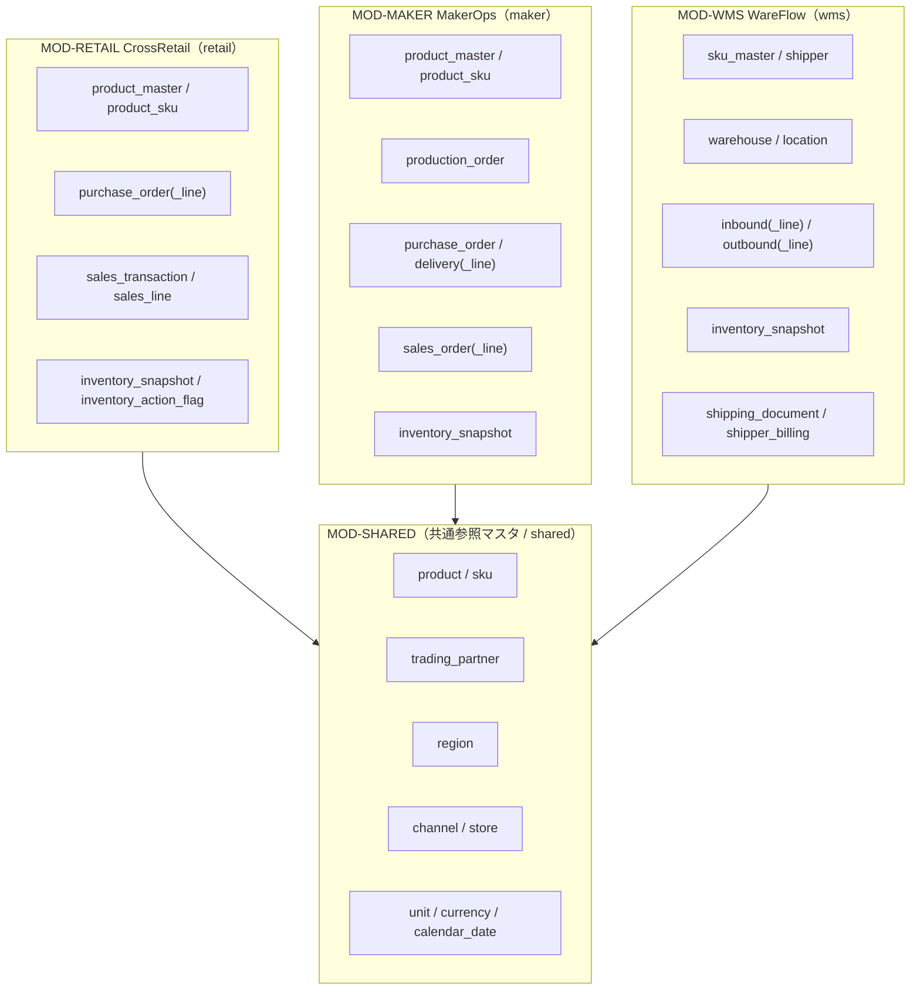

# BD-02 業務ドメインサービス — 小売 / メーカー / 倉庫WMS 基本設計

> **ステータス:** ドラフト（レビュー前）
> **版:** v1.0
> **最終更新:** 2026-07-04
> **関連ドキュメント:** [正準設計ブループリント v1.0]（全ドキュメント共通契約）／ [00 ビジョン・スコープ](../00-vision-scope.md) ／ [用語集](../glossary.md) ／ [意思決定ログ（ADR）](../decision-log.md) ／ [BD-01 アーキテクチャ概観](./BD-01-architecture-overview.md) ／ [BD-03 分析・AIプラットフォーム](./BD-03-analytics-ai-platform.md) ／ [BD-04 連携・データパイプライン](./BD-04-integration-data-pipeline.md) ／ [BD-05 バックオフィス](./BD-05-backoffice.md) ／ [BD-06 非機能設計](./BD-06-non-functional.md) ／ [DD-01 正準データモデル](../detailed-design/DD-01-canonical-data-model.md) ／ [DD-02 API設計](../detailed-design/DD-02-api-interface-design.md) ／ [DD-05 画面・UX・SI戦略](../detailed-design/DD-05-screen-ux-si-strategy.md) ／ [DB-02 retail物理スキーマ](../database/DB-02-operational-schema-retail.md) ／ [DB-03 maker物理スキーマ](../database/DB-03-operational-schema-maker.md) ／ [DB-04 wms物理スキーマ](../database/DB-04-operational-schema-wms.md) ／ [DB-05 分析スタースキーマ](../database/DB-05-analytics-star-schema.md) ／ 継承元 [docs/design.md](../../design.md)・[docs/star-schema-design.md](../../star-schema-design.md)

---

本ドキュメントは Undeux Platform（略称 **UCP**、プロダクト系統コード `UNDX`）の**業務ドメインサービス基本設計**である。対象は 3 つの自社開発業務アプリ、すなわち **`MOD-RETAIL` CrossRetail（小売クロスリテーラー）**・**`MOD-MAKER` MakerOps（メーカー）**・**`MOD-WMS` WareFlow（倉庫WMS）** である。各ドメインの機能一覧・サービス境界・主要ユースケース・入出力・データ責務（SoT）を確定し、ドメイン間のイベント連携（発注→納品→入出庫→売上→在庫）を定義する。

名称・ID・SoT・命名規約はすべて正準設計ブループリント v1.0（以下「ブループリント」）が SoT であり、本書はブループリント §2（モジュールカタログ）・§3.2〜3.4（retail / maker / wms エンティティ）・§7（SoT 宣言）の範囲内で「各ドメインが何を担い、どう連携するか」を確定する。OLTP 物理スキーマの詳細（DDL・インデックス・制約）は [DB-02](../database/DB-02-operational-schema-retail.md)/[DB-03](../database/DB-03-operational-schema-maker.md)/[DB-04](../database/DB-04-operational-schema-wms.md) が owner、分析 mart 設計は [DB-05](../database/DB-05-analytics-star-schema.md)、画面/SI カスタマイズは [DD-05](../detailed-design/DD-05-screen-ux-si-strategy.md) が owner であり、本書は業務機能の観点に留める。

---

## 0. 前提

本書は以下を前提とする。前提が崩れる場合は「未決事項」（§8）と ADR（[decision-log.md](../decision-log.md)）で再検討する。

- **継承の前提:** 現行 UndeuxSales（[docs/design.md](../../design.md) / [docs/star-schema-design.md](../../star-schema-design.md)）はメーカー視点の売上・在庫可視化アプリであり、その商品マスタ・売上・在庫の構造を `MOD-MAKER` / `MOD-RETAIL` の商品マスタ・トランザクション設計へ一般化・継承する。しまむら週次売上参照データは「他社由来」であり、`staging`（ブループリント §3.5）が SoT である点を維持する。
- **スキーマ境界の前提:** 業務 OLTP は用途別スキーマ `retail` / `maker` / `wms` に分離し、共通参照マスタは `shared`（`tenant` / `trading_partner` / `region` / `channel` / `store` / `unit` / `currency` / `calendar_date` 等）を参照する。商品親子（`shared.product` / `shared.sku`）の扱いは §6・§8 で整理する。
- **テナントの前提:** テナント＝契約クライアント組織（`shared.tenant`）。`account_type ∈ {retailer, maker, warehouse, internal}`。OLTP は共有テーブル＋ PostgreSQL RLS（論理列 `tenant_id`、セッション変数 `app.tenant_id`）で分離する（ADR-001 / [DD-06](../detailed-design/DD-06-security-authz-tenancy.md)）。
- **SoT の前提:** 各業務 OLTP（`retail.*` / `maker.*` / `wms.*`）が自ドメインデータの SoT であり、分析 mart（`mart_{tenant_code}`）は常に派生キャッシュである。SoT 書込→mart 反映（`rebuild()`）の順序を厳守する（AP-1 / ADR-009）。
- **金額・型の前提:** 金額は最小通貨単位の整数 `bigint`（`shared.currency.minor_unit` で桁解釈）、数量は `int`、業種固有属性は `attributes jsonb`＋生成列で吸収する（ブループリント §8.4 / ADR-005 / ADR-007）。
- **範囲の前提:** 本書は業務ドメインの機能・境界・連携を確定する。分析/AI は [BD-03](./BD-03-analytics-ai-platform.md)、他社連携/変換は [BD-04](./BD-04-integration-data-pipeline.md)、契約/請求のバックオフィスは [BD-05](./BD-05-backoffice.md) が owner。倉庫の荷主請求（`wms.shipper_billing`）は本書が業務観点、請求の共通基盤は BD-05 と分担する。

---

## 1. 3ドメインの関係とバリューチェーン上の位置づけ

UCP が対象とする 3 業務ドメインは、サプライチェーン（バリューチェーン）上で **メーカー（生産・供給）→ 倉庫（保管・物流）→ 小売（販売）→ 消費者** の順に連なる。各ドメインは自社開発 SaaS として独立した業務アプリでありながら、`MOD-SHARED` SharedCore の共通参照マスタを土台として共有し、業務イベント（発注・納品・入出庫・売上）を介して相互に連携する。連携された全トランザクションは `MOD-INTEGRATION` DataBridge を経て `MOD-ANALYTICS` InsightMart の mart へ集約され、横断分析の対象となる。

各ドメインの主担当・提供先・SoT スキーマは以下の通り。分析軸の基本「商品・地域・販売先」（ブループリント §1）は 3 ドメイン共通で、地域粒度はテナントの `region_granularity`（`prefecture` / `municipality`）で動的に切替える。

| ドメイン | モジュール | 正準名 | 提供先 `account_type` | SoT スキーマ | バリューチェーン上の位置 | 主な業務イベント（送出/受入） |
|---|---|---|---|---|---|---|
| 小売クロスリテーラー | `MOD-RETAIL` | CrossRetail | `retailer` | `retail.*` | 川下（販売・EC/店舗） | 発注を**送出**、売上を**確定** |
| メーカー | `MOD-MAKER` | MakerOps | `maker` | `maker.*` | 川上（生産・供給） | 発注を**受入**、生産・納品を**送出** |
| 倉庫WMS | `MOD-WMS` | WareFlow | `warehouse` | `wms.*` | 中流（保管・物流） | 納品を入庫として**受入**、出荷を**送出** |

以下のバリューチェーン図は、商流（発注・売上）と物流（生産・納品・入出庫・出荷）が 3 ドメインをどう貫くかを示す。実線は物・注文の流れ、破線は全ドメインから DataBridge を介した mart への分析データ供給を示す。図の後に各ドメインの責務境界を要約する。

```mermaid
flowchart LR
    subgraph 川上["川上：供給"]
        MK["メーカー<br/>MakerOps（maker）<br/>生産・発注・納品・売上・在庫"]
    end
    subgraph 中流["中流：物流"]
        WM["倉庫WMS<br/>WareFlow（wms）<br/>入出庫・在庫・出荷帳票・荷主請求"]
    end
    subgraph 川下["川下：販売"]
        RT["小売クロスリテーラー<br/>CrossRetail（retail）<br/>商品マスタ・商取引・売上・在庫・EC/店舗"]
    end
    CO["消費者 / 店舗・EC顧客"]

    RT -->|発注（purchase_order）| MK
    MK -->|生産（production_order）| MK
    MK -->|納品（delivery）| WM
    WM -->|入庫（inbound）| WM
    WM -->|出荷（outbound）＋出荷帳票| RT
    RT -->|売上（sales_transaction）| CO

    RT -.->|retail.* 連携| BR["DataBridge<br/>（MOD-INTEGRATION）"]
    MK -.->|maker.* 連携| BR
    WM -.->|wms.* 連携| BR
    BR -.->|恒等マッピング→rebuild| MART[("mart_&#123;tenant_code&#125;<br/>InsightMart")]
```

**責務境界の要約:** メーカーは「作って供給する」（生産・在庫・出荷元の売上）、倉庫は「預かって動かす」（荷主の在庫を物理的に入出庫し請求する）、小売は「売る」（店舗/EC で消費者へ販売し、その補充を発注する）。各ドメインは自スキーマの SoT のみを更新し、他ドメインへの影響は業務イベント（§5）を介して非同期・冪等に伝播する。SoT を跨ぐ直接書込は行わない（AP-1）。

---

## 2. 小売クロスリテーラー（`MOD-RETAIL` CrossRetail）

### 2.1 サービス概要と境界

CrossRetail は小売事業者向けの「商品マスタ管理＋商取引トランザクション＋売上・在庫の管理/分析」サービスであり、店舗経営と EC の双方に対応する（ブループリント §2）。チャネル（`shared.channel.channel_type ∈ {store, ec}`）と個店（`shared.store`）を軸に、複数業態（`channel_code`、例: しまむら/アベイル）を跨いだ「クロスリテーラー」分析を可能にする。SoT は `retail.*`。境界外（生産・物流・荷主請求）は本ドメインの責務ではなく、メーカー/倉庫ドメインへ委譲する。

### 2.2 機能一覧

| 機能グループ | 機能 | 主エンティティ（SoT） | 種別 | 概要 |
|---|---|---|---|---|
| 商品マスタ | 商品（親）管理 | `retail.product_master` | 動的マスタ CRUD | 業態×記号×品番の自然キー、部門/ブランド/担当/区分 |
| 商品マスタ | SKU（単品）管理 | `retail.product_sku` | 動的マスタ CRUD | 汎用バリアント2軸・定価 `list_price bigint`・画像 |
| 商取引トランザクション | 発注（PO）管理 | `retail.purchase_order` / `retail.purchase_order_line` | トランザクション | 仕入先（`supplier_partner_id`）への発注・先付数量 |
| 売上 | 売上取引記録 | `retail.sales_transaction` / `retail.sales_line` | トランザクション | チャネル/店舗別の売上ヘッダ＋明細（実売価/原価/金額） |
| 在庫 | 在庫スナップショット | `retail.inventory_snapshot` | スナップショット（記録系） | 週次×チャネル×店舗×SKU の在庫数・在日・消化率 |
| 在庫 | 在庫アクションフラグ | `retail.inventory_action_flag`（public/自然キー・継承） | ユーザー判断（設定系） | 滞留/不動へのユーザー判断。mart 再構築非依存（ADR-014） |
| EC・店舗 | チャネル/店舗運用 | `shared.channel` / `shared.store`（参照） | 参照/構成 | 業態・個店の登録。企業集約分析時は個店未使用可 |

> **継承ノート:** 現行 UndeuxSales の在庫マネジメント（滞留・不動の自動抽出とアクション提示）を継承する。ユーザー判断である在庫アクションフラグは `mart` 内に置かず public スキーマで自然キー保持し、mart 再構築（TRUNCATE を伴う `rebuild()`）の影響を受けない（原則2＝状態保護 / ADR-014）。

### 2.3 主要ユースケースと入出力

| UC-ID | ユースケース | アクター | 入力 | 出力 | 冪等性 / 備考 |
|---|---|---|---|---|---|
| RTL-UC-01 | 商品・SKU マスタ登録/更新 | 小売MD担当 | 商品/SKU 属性（`attributes jsonb` 含む） | 登録済マスタ、mart `dim_product`/`dim_sku` 反映 | 自然キー UPSERT で冪等 |
| RTL-UC-02 | 仕入先への発注 | 小売バイヤー | SKU・数量・先付数量・仕入先 | `purchase_order`＋明細、メーカーへ発注イベント | `(tenant_id, po_no)` で冪等 |
| RTL-UC-03 | 売上取引の記録/取込 | POS/EC 連携 | チャネル/店舗・SKU・数量・実売価/原価 | `sales_transaction`＋明細、`fact_sales_weekly` 反映 | `(tenant_id, txn_no)` で冪等 |
| RTL-UC-04 | 在庫スナップショット更新 | バッチ | 週次×店舗×SKU 在庫数 | `inventory_snapshot`、在日/消化率算出 | 自然キー UPSERT（記録系は巻戻し禁止） |
| RTL-UC-05 | 滞留/不動抽出とアクション | 小売MD担当 | 在庫健全性 KPI | 抽出リスト、`inventory_action_flag` | フラグは設定系・状態保護 |

**入出力の共通事項:** 入力は Firebase JWT（`role`/`accountType`）で認可され、書込は RLS（`app.tenant_id`）でテナント境界内に限定される。想定エラーは `UNDX-RTL-*`（小売業務）／`UNDX-REQ-*`（検証）／`UNDX-TENANT-*`（境界違反）を付与する（§7・ブループリント §9）。売上取込などの補助的な mart 反映失敗は主要フロー（SoT 書込）を止めず、後続の `rebuild()` で回復する（グレースフルデグラデーション）。

---

## 3. メーカー（`MOD-MAKER` MakerOps）

### 3.1 サービス概要と境界

MakerOps はメーカー事業者向けの「商品マスタ管理＋生産・発注・納品・売上・在庫のトランザクション管理/分析」サービスである（ブループリント §2）。現行 UndeuxSales のメーカー視点売上・在庫可視化を継承・一般化し、供給側の全業務イベント（生産計画・原材料/部材発注・出荷先への納品・受注/売上・在庫）を扱う。SoT は `maker.*`。小売からの発注を「受注」として受け入れ、倉庫/小売への納品を送出する。

### 3.2 機能一覧

| 機能グループ | 機能 | 主エンティティ（SoT） | 種別 | 概要 |
|---|---|---|---|---|
| 商品マスタ | 商品（親）管理 | `maker.product_master` | 動的マスタ CRUD | 記号×品番の自然キー、部門/ブランド/担当/区分 |
| 商品マスタ | SKU（単品）管理 | `maker.product_sku` | 動的マスタ CRUD | 汎用バリアント2軸・定価 `list_price bigint`・画像 |
| 生産 | 生産オーダー管理 | `maker.production_order` | トランザクション | 計画数量/実績数量・計画日・ステータス |
| 発注 | 部材/原材料発注 | `maker.purchase_order` | トランザクション | 仕入先（`supplier_partner_id`）への発注 |
| 納品 | 納品管理 | `maker.delivery` / `maker.delivery_line` | トランザクション | 納品先（`customer_partner_id`）別の納品ヘッダ＋明細 |
| 売上 | 受注/売上管理 | `maker.sales_order` / `maker.sales_order_line` | トランザクション | 得意先受注・実売価/原価 |
| 在庫 | 在庫スナップショット | `maker.inventory_snapshot` | スナップショット（記録系） | 在庫数・累計売上/納品・発注/先付・在日・消化率 |

> **継承ノート（既存 UndeuxSales の位置づけ）:** 小売しまむらから週次提供される「他社由来」の売上参照データは `staging`（ブループリント §3.5）が SoT である。継承した `sales_weekly` / `import_batch` / 商品マスタ（`m_product` / `m_product_sku`）は移行期において `staging.retail_sales_weekly` 相当＋ maker テナント配下のマスタとして再配置し、mart はそこから派生する。すなわち MakerOps の自社入力トランザクションと、他社連携由来の売上参照は SoT が異なる点に注意する（§7）。

### 3.3 主要ユースケース

| UC-ID | ユースケース | アクター | 入力 | 出力 | 冪等性 / 備考 |
|---|---|---|---|---|---|
| MKR-UC-01 | 商品・SKU マスタ登録/更新 | メーカーMD | 商品/SKU 属性 | 登録済マスタ、mart `dim_product`/`dim_sku` 反映 | 自然キー UPSERT で冪等 |
| MKR-UC-02 | 生産計画/実績登録 | 生産管理 | SKU・計画数量・計画日・実績 | `production_order`、`fact_production` 反映 | `(tenant_id, production_no)` で冪等 |
| MKR-UC-03 | 小売発注の受注化 | 受注担当 | 小売からの発注イベント（§5） | `sales_order`＋明細 | `(tenant_id, so_no)` で冪等・イベント再送に耐える |
| MKR-UC-04 | 納品指示/実績 | 出荷担当 | 納品先・SKU・数量・単価 | `delivery`＋明細、倉庫へ入庫イベント、`fact_delivery` 反映 | `(tenant_id, delivery_no)` で冪等 |
| MKR-UC-05 | 在庫スナップショット更新 | バッチ | 在庫数・累計売上/納品・発注/先付 | `inventory_snapshot`、在日/消化率算出 | 自然キー UPSERT（記録系は巻戻し禁止） |

**入出力の共通事項:** 認可・RLS・グレースフルデグラデーションの扱いは §2.3 と同様。想定エラーは `UNDX-MKR-*` を付与する。生産→納品→売上のステータス遷移は §5 のイベント連携で下流ドメインへ伝播し、mart 反映（`fact_production` / `fact_delivery`）は SoT 書込後に非同期で行う。

---

## 4. 倉庫WMS（`MOD-WMS` WareFlow）

### 4.1 サービス概要と境界

WareFlow は倉庫事業者向けの「SKUマスタ管理＋入出庫・在庫トランザクション＋出荷作業用帳票出力＋荷主（shipper）請求」サービスである（ブループリント §2）。倉庫は自ら商品を所有せず、荷主（在庫の所有者）から預かった在庫を物理ロケーション（`wms.location`）で管理し、入庫・出庫・在庫の各トランザクションを記録し、出荷帳票を出力し、荷主へ保管/作業料を請求する。SoT は `wms.*`。荷主請求（`wms.shipper_billing`）は本ドメインが業務観点の owner、請求の共通基盤/エラー領域は BD-05（BackOffice）と分担する。

> **拡張提案:** WareFlow の SKU は `wms.sku_master`（`tenant_id, sku_code`）として倉庫内で独立管理される。荷主の商品マスタ（`shared.product`/`shared.sku` や各ドメインの `product_sku`）との対応付けは、荷主が自社アプリを併用する場合に DataBridge の恒等/人的マッピングで解決する。この荷主SKU↔正準SKUの突合定義は本ブループリントに明示エンティティが無いため「拡張提案」として §8 未決事項に挙げる。

### 4.2 機能一覧

| 機能グループ | 機能 | 主エンティティ（SoT） | 種別 | 概要 |
|---|---|---|---|---|
| SKUマスタ | 倉庫SKU管理 | `wms.sku_master` | 動的マスタ CRUD | 倉庫内 SKU コード・汎用バリアント2軸・`attributes jsonb` |
| 荷主 | 荷主管理 | `wms.shipper` | 動的マスタ CRUD | `trading_partner` 参照・請求条件（`billing_terms`） |
| 拠点 | 倉庫/ロケーション管理 | `wms.warehouse` / `wms.location` | 動的マスタ CRUD | 倉庫（地域参照）・ゾーン/棚（`bin_code`） |
| 入出庫 | 入庫管理 | `wms.inbound` / `wms.inbound_line` | トランザクション | 荷主別入庫・ロケーション別数量 |
| 入出庫 | 出庫/出荷管理 | `wms.outbound` / `wms.outbound_line` | トランザクション | 荷主別出庫・ロケーション別数量 |
| 在庫 | 在庫スナップショット | `wms.inventory_snapshot` | スナップショット（記録系） | 倉庫×SKU×時点の在庫数 |
| 出荷帳票 | 帳票出力 | `wms.shipping_document` | 帳票（派生・生成物） | 出庫単位の帳票種別・生成URI（`rendered_uri`） |
| 荷主請求 | 荷主請求管理 | `wms.shipper_billing` | 請求（期締め再計算可） | 荷主×期間×金額 `bigint`・ステータス |

### 4.3 主要ユースケース

| UC-ID | ユースケース | アクター | 入力 | 出力 | 冪等性 / 備考 |
|---|---|---|---|---|---|
| WMS-UC-01 | 倉庫SKU/荷主/拠点登録 | 倉庫管理者 | SKU/荷主/倉庫/ロケーション属性 | 登録済マスタ | 自然キー UPSERT で冪等 |
| WMS-UC-02 | 入庫処理 | 入庫作業者 | 荷主・SKU・数量・ロケーション（メーカー納品イベント） | `inbound`＋明細、`fact_warehouse_movement`(in) 反映 | `(tenant_id, inbound_no)` で冪等・イベント再送耐性 |
| WMS-UC-03 | 出庫/出荷処理 | 出荷作業者 | 荷主・SKU・数量・ロケーション | `outbound`＋明細、`fact_warehouse_movement`(out) 反映、下流へ出荷イベント | `(tenant_id, outbound_no)` で冪等 |
| WMS-UC-04 | 出荷帳票出力 | 出荷作業者 | 出庫ID・帳票種別 | `shipping_document`（PDF等の `rendered_uri`） | 補助処理・失敗は主要フローを止めない（`UNDX-WMS-*`） |
| WMS-UC-05 | 在庫スナップショット更新 | バッチ | 倉庫×SKU 在庫数 | `inventory_snapshot` | 自然キー UPSERT（記録系は巻戻し禁止） |
| WMS-UC-06 | 荷主請求の期締め算出 | 倉庫経理 | 期間・保管/作業実績・`billing_terms` | `shipper_billing`、`fact_billing` 反映 | 期締めで再計算（記録系メータは追記のみ） |

**入出力の共通事項:** 出荷帳票生成（`shipping_document`）は補助処理であり、生成失敗が入出庫の主要フローを止めてはならない（グレースフルデグラデーション、`UNDX-WMS-*`）。帳票 `rendered_uri` はオブジェクトストレージ上の派生物であり、SoT（`outbound`）から再生成可能とする。荷主請求は期締めで再計算するが、使用量メータ相当の記録系（入出庫実績）は追記のみで巻戻さない（原則2）。

以下は 3 ドメインの機能俯瞰図。各ドメインが `shared` の共通参照マスタ（商品/SKU/取引先/地域/チャネル）に依存しつつ、自スキーマの SoT を持つ構造を示す。図の後に共通依存を要約する。

**共通依存の要約:** 3 ドメインはいずれも `MOD-SHARED` を最下層依存とし（AP-3 単方向依存）、テナント・取引先・地域・通貨/単位/カレンダーを共有する。商品/SKU の正準表現（`shared.product`/`shared.sku`）と各ドメイン固有の `product_master`/`product_sku` の関係は §6・§8 で整理する。ドメイン間に直接の相互依存は無く、連携は §5 のイベントで疎結合に行う。

---

## 5. ドメイン間連携（発注→納品→入出庫→売上→在庫 のイベント連携）

3 ドメインは SoT を跨ぐ直接書込を行わず、**業務イベント**を介して疎結合に連携する。各イベントは受信側で冪等に処理され（自然キーによる UPSERT・重複受信の吸収）、補助的な mart 反映の失敗は主要フローを止めない（グレースフルデグラデーション）。イベント受信ハンドラ（Webhook 等）と手動回復パス（再同期）の両方を用意し、片方の欠落を許容しない（ブループリント §6 の変更時必須確認2）。

### 5.1 連携イベント一覧

| イベント | 送出ドメイン | 受入ドメイン | 送出契機（SoT 書込） | 受入結果（SoT 書込） | mart 反映 | 冪等キー |
|---|---|---|---|---|---|---|
| 発注 `purchase_order.placed` | 小売（retail） | メーカー（maker） | `retail.purchase_order` 確定 | `maker.sales_order`（受注化） | `fact_orders` | `(tenant_id, po_no)` → `(tenant_id, so_no)` |
| 生産 `production.completed` | メーカー（maker） | メーカー（maker・自ドメイン） | `maker.production_order` 実績確定 | 在庫スナップショット更新 | `fact_production` | `(tenant_id, production_no)` |
| 納品 `delivery.shipped` | メーカー（maker） | 倉庫（wms） | `maker.delivery` 確定 | `wms.inbound`（入庫） | `fact_delivery` / `fact_warehouse_movement`(in) | `(tenant_id, delivery_no)` → `(tenant_id, inbound_no)` |
| 出荷 `outbound.shipped` | 倉庫（wms） | 小売（retail） | `wms.outbound` 確定＋出荷帳票 | 入荷→販売可能在庫反映 | `fact_warehouse_movement`(out) | `(tenant_id, outbound_no)` |
| 売上 `sales.recorded` | 小売（retail） | 小売（retail・自ドメイン） | `retail.sales_transaction` 確定 | `retail.inventory_snapshot` 減算 | `fact_sales_weekly` | `(tenant_id, txn_no)` |

### 5.2 連携シーケンス

以下のシーケンス図は、発注起点でメーカー・倉庫・小売を貫く連携（発注→受注→生産→納品→入庫→出庫→売上→在庫）を示す。各ステップは SoT 書込を先、mart 反映を後（AP-1）とし、イベント配送は冪等キーで重複を吸収する。図の後に順序と回復パスを要約する。

```mermaid
sequenceDiagram
    autonumber
    participant RT as 小売 CrossRetail（retail）
    participant MK as メーカー MakerOps（maker）
    participant WM as 倉庫 WareFlow（wms）
    participant BR as DataBridge（連携）
    participant MT as mart_&#123;tenant_code&#125;

    RT->>RT: purchase_order 確定（SoT書込）
    RT->>MK: 発注イベント purchase_order.placed
    MK->>MK: sales_order 受注化（冪等: so_no）
    MK->>MK: production_order 実績確定
    MK->>WM: 納品イベント delivery.shipped
    WM->>WM: inbound 入庫（冪等: inbound_no）
    WM->>WM: outbound 出庫＋shipping_document 生成
    Note over WM: 帳票生成失敗は主要フローを止めない<br/>（グレースフルデグラデーション / UNDX-WMS-*）
    WM->>RT: 出荷イベント outbound.shipped
    RT->>RT: 販売可能在庫へ反映
    RT->>RT: sales_transaction 確定（売上）
    RT->>RT: inventory_snapshot 更新（在庫減算）
    RT-->>BR: retail.* 連携（恒等マッピング）
    MK-->>BR: maker.* 連携（恒等マッピング）
    WM-->>BR: wms.* 連携（恒等マッピング）
    BR-->>MT: rebuild() で fact_* / dim_* を冪等再構築
```

**順序と回復パスの要約:** 全連携は「①各ドメインが自 SoT を先に確定 → ②業務イベントを下流へ送出 → ③下流が冪等に受入 SoT を更新 → ④DataBridge 経由で mart を非同期 `rebuild()`」の順で流れる。イベントを取りこぼした場合の回復は、(a) 受信ハンドラの再送（冪等キーで安全に再適用）、(b) `mapping.job_run` の再実行（他社連携経路）、(c) `mart.rebuild()`（派生の再構築）で行う。mart 反映は常に派生であり、SoT からいつでも再構築できる（ブループリント §7 回復パス）。ユーザー判断である `retail.inventory_action_flag` は再構築の影響を受けない（ADR-014）。

---

## 6. 汎用データ構造とSIカスタマイズ点（詳細は DD-05）

3 ドメインは「業種非依存のコア構造＋クライアント固有事情の SI 追随」を原則とする（AP-4 コアと拡張の分離）。共通化できる部分は `shared` と汎用構造で共通化し、クライアント固有のみを SI で反映する。カスタマイズは DDL 変更を伴わない拡張（`attributes jsonb`＋生成列・バリアント軸ラベル）を第一選択とし、UI/UX・オプション機能・データ項目追加の詳細戦略は [DD-05](../detailed-design/DD-05-screen-ux-si-strategy.md) が owner。

| 汎用化ポイント | 仕組み | ドメイン適用例 | SI カスタマイズ点 |
|---|---|---|---|
| 商品バリアント | 汎用バリアント2軸（`variant_axis1_label/value`, `variant_axis2_label/value`） | 小売/メーカー=色/サイズ・容量/味、倉庫=倉庫内区分 | 軸ラベルのテナント別メタデータ（ADR-008：3軸目は設計見直し） |
| 業種固有属性 | `attributes jsonb`＋主要軸は生成列（`GENERATED ALWAYS AS ... STORED`） | 季節（`season`）・棚割・帳票区分 | 追加属性の項目定義とインデックス方針（DDL 変更不要） |
| 地域粒度 | `shared.region` 自己参照階層＋テナント `region_granularity` | 3 ドメイン共通（販売先/倉庫の地域） | `prefecture` / `municipality` の動的切替 |
| 販売先/取引先 | `shared.trading_partner`（`partner_type` で区別） | retailer/supplier/customer/carrier を統一 | 取引先区分・取引先固有項目 |
| チャネル | `shared.channel`（`store`/`ec`）＋`shared.store` | 小売の店舗/EC、業態（`channel_code`） | 個店有無（企業集約時は未使用可） |

> **原則（コアと拡張の分離）:** クライアント固有データ項目の追加は原則 `attributes jsonb`＋生成列で吸収し、コアスキーマの破壊的変更を避ける。やむを得ずコア列を変更する場合は下位互換性を評価し、互換ビューでの段階移行（ADR-013）とデータ更新パッチ、オペレーター向け説明を用意する（原則7・AP-8）。レスポンシブ要件は 3 ドメインの全 UI に適用し、PC=表/リスト・モバイル=カード型等の可読形式を両立する（AP-9・ブループリント §8.5）。

---

## 7. 各ドメインのSoTとOLTPスキーマ責務（詳細は DB-02/03/04）

各業務 OLTP が自ドメインデータの SoT であり、分析 mart（`mart_{tenant_code}`）は派生キャッシュである。SoT 書込を先、mart 反映を後（`rebuild()`）とする順序を全ドメインで厳守する（AP-1 / ADR-009）。物理スキーマ（DDL・制約・インデックス）の owner は [DB-02](../database/DB-02-operational-schema-retail.md)（retail）/[DB-03](../database/DB-03-operational-schema-maker.md)（maker）/[DB-04](../database/DB-04-operational-schema-wms.md)（wms）、mart は [DB-05](../database/DB-05-analytics-star-schema.md)。本書は業務観点の SoT 責務境界を確定する。

### 7.1 SoT 宣言（本書担当領域の抜粋。全体はブループリント §7）

| データ領域 | SoT | 派生（mart 等） | 回復パス |
|---|---|---|---|
| 小売業務（商品/発注/売上/在庫） | `retail.*`（OLTP） | `fact_sales_weekly` / `fact_orders` / `fact_inventory_snapshot` | `mart.rebuild()` |
| メーカー業務（商品/生産/発注/納品/売上/在庫） | `maker.*`（OLTP） | `fact_production` / `fact_delivery` / `fact_orders` / `fact_sales_weekly` / `fact_inventory_snapshot` | `mart.rebuild()` |
| 倉庫業務（入出庫/在庫/請求） | `wms.*`（OLTP） | `fact_warehouse_movement` / `fact_inventory_snapshot` / `fact_billing` | `mart.rebuild()` |
| 他社連携由来の売上参照（例: しまむら週次） | `staging.raw_record` / `staging.import_batch` | 正準 OLTP 相当 → mart | ジョブ再実行 `mapping.job_run` → rebuild |
| 在庫アクションフラグ（ユーザー判断） | `retail.inventory_action_flag`（public/自然キー） | なし | mart 再構築の影響を受けない（ADR-014） |
| 出荷帳票 | `wms.outbound`（帳票は派生生成物） | `wms.shipping_document.rendered_uri`（オブジェクトストレージ） | SoT から再生成 |

### 7.2 OLTP スキーマ責務の要点

- **キー設計:** 全業務テーブルは無意味サロゲート PK `{entity}_id`（bigint）。自然キー（例 `(tenant_id, txn_no)` / `(tenant_id, delivery_no)` / `(tenant_id, inbound_no)`）は UNIQUE 制約に限定し冪等 UPSERT に用いる。リレーションはサロゲート FK のみ（ブループリント §8.2）。
- **テナント境界:** 全業務テーブルに論理列 `tenant_id`＋監査列（`created_at`/`updated_at`/`created_by`/`updated_by`）。RLS（`app.tenant_id`）でテナント分離（[DD-06](../detailed-design/DD-06-security-authz-tenancy.md)）。境界違反は `UNDX-TENANT-*`。
- **金額型:** `total_amount` / `sale_price` / `cost_price` / `unit_price` / `list_price` / `amount` はすべて `bigint`（最小通貨単位）。`currency_id` で通貨解釈（ADR-005）。
- **記録系の保護:** `*.inventory_snapshot`・入出庫実績・請求メータは記録系であり、再実行で巻き戻さない（原則2）。設定系（マスタ・稼働設定）のみ更新可。

### 7.3 エラーコード領域（本書担当）

想定エラーは `UNDX-{領域}-{連番}` で一元管理する（SoT は `shared.error_code`＋Core の `ErrorCodes`、`GET /api/error-codes` で公開。ブループリント §9）。本書 3 ドメインの主担当領域は以下。

| 領域コード | 意味 | 代表シナリオ |
|---|---|---|
| `RTL` | クロスリテーラー業務 | 商品/発注/売上/在庫の検証・状態不整合 |
| `MKR` | メーカー業務 | 生産/発注/納品/受注の検証・状態不整合 |
| `WMS` | 倉庫業務 | 入出庫/在庫/帳票/荷主請求の検証・状態不整合 |
| `BILL` | 荷主請求（BackOffice と分担） | 期締め・請求金額算出（`wms.shipper_billing`） |
| `TENANT` | テナント境界/RLS | 越境アクセス・スコープ外操作 |
| `REQ` | リクエスト検証 | 必須項目欠落・型不一致 |

> 連番は領域内で 001 から採番する。具体的なコード付与は各ドメイン実装時に確定し、`shared.error_code` へ登録する（本書では領域割当のみ確定）。

---

## 8. 未決事項

以下は本書時点で未確定の事項。ブループリント改訂と ADR（[decision-log.md](../decision-log.md)）で決定してから各設計へ波及させる。推測で断定せず、決定まで保留する。

| # | 未決事項 | 論点 | 暫定方針 / 参照 |
|---|---|---|---|
| Q-01 | 各ドメイン `product_master`/`product_sku` と `shared.product`/`shared.sku` の関係 | ブループリント §3 は両方を定義（`shared.product` の SoT は「所有モジュールの product_master」）。物理的に別テーブルか、shared がビュー/射影か | DB-01/DD-01 で正準化ルールを確定。本書は「ドメイン OLTP が SoT、shared は正準参照」と整理 |
| Q-02 | 倉庫SKU（`wms.sku_master`）と正準SKU（`shared.sku`/荷主の `product_sku`）の突合定義 | 荷主SKU↔倉庫SKU のマッピングを保持するエンティティがブループリントに未定義 | **拡張提案:** DataBridge の恒等/人的マッピングで解決。専用突合テーブルの要否を DD-03 で検討 |
| Q-03 | ドメイン間イベントの配送基盤 | Webhook / メッセージキュー / DB ポーリングのいずれか。§5 の冪等前提は共通だが実装機構は未確定 | BD-04/DD-02 で確定。本書は冪等キーと回復パスのみ規定 |
| Q-04 | 小売の発注→メーカー受注化の粒度 | `retail.purchase_order_line` と `maker.sales_order_line` の明細対応（分割納品・部分受注） | DD-01/DD-02 で明細マッピングを確定 |
| Q-05 | 出荷イベントから小売販売可能在庫への反映経路 | 倉庫出庫→小売入荷の在庫反映を、イベント直結か在庫スナップショット経由か | §5 は概念フロー。物理経路は DD-01 で確定 |
| Q-06 | 荷主請求の算定ロジックの所在 | `wms.shipper_billing`（本書業務）と BackOffice 請求基盤（BD-05）の責務分界 | BD-05 と本書で `BILL` 領域を分担。算定式は DD 段階で確定 |
| Q-07 | EC チャネルの外部プラットフォーム連携 | EC（`channel_type='ec'`）が外部モール/カートと連携する場合の取込経路 | 他社連携として BD-04（DataBridge）で扱う想定 |

---

## 付録A. 前提（本書で置いた想定の明示）

- 3 ドメインはいずれも自社開発 SaaS であり、DataBridge へは `system_type='self'`・`resolved_by='auto'` の恒等マッピングで直結する（ブループリント §3.5）。他社開発サービスからの連携は人的マッピング経路（BD-04）で扱う。
- 本書のユースケース ID（`RTL-UC-*` / `MKR-UC-*` / `WMS-UC-*`）は本書内の参照用識別子であり、正式なテスト ID 体系は DD 段階で確定する（拡張提案）。
- `fact_orders` / `fact_production` / `fact_delivery` / `fact_warehouse_movement` / `fact_billing` はブループリント §4.2 で「新規」と定義されたファクトであり、本書はそれらへの業務データ供給元（SoT）を確定する立場で参照する。物理定義は [DB-05](../database/DB-05-analytics-star-schema.md) が owner。
