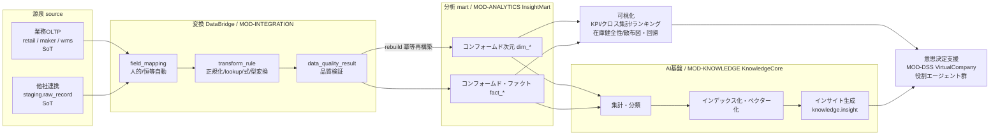
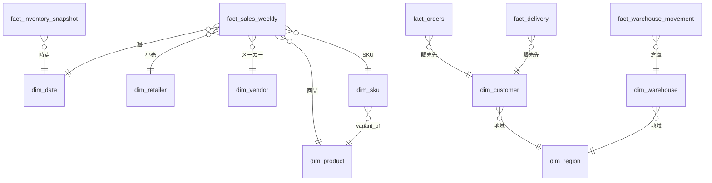
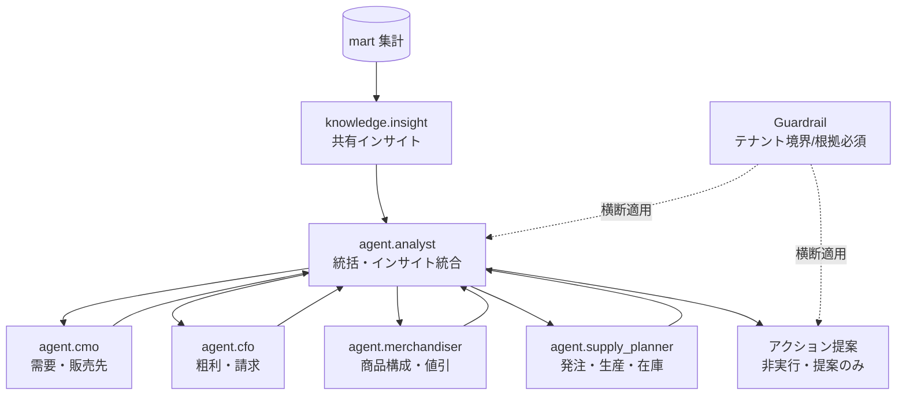

# BD-03 分析・AIプラットフォーム — Undeux Platform（UCP）分析・可視化・AI基盤 基本設計

> **ステータス:** ドラフト（レビュー前）
> **版:** v1.0
> **最終更新:** 2026-07-04
> **関連ドキュメント:** [正準設計ブループリント v1.0]（全ドキュメント共通契約）／ [00 ビジョン・スコープ](../00-vision-scope.md) ／ [用語集](../glossary.md) ／ [意思決定ログ（ADR）](../decision-log.md) ／ [BD-01 アーキテクチャ概観](./BD-01-architecture-overview.md) ／ [BD-02 業務ドメインサービス](./BD-02-domain-services.md) ／ [BD-04 連携・データパイプライン](./BD-04-integration-data-pipeline.md) ／ [BD-05 バックオフィス](./BD-05-backoffice.md) ／ [BD-06 非機能設計](./BD-06-non-functional.md) ／ [DD-04 AI・RAG・エージェント設計](../detailed-design/DD-04-ai-rag-agent-design.md) ／ [DD-03 マッピング・変換エンジン](../detailed-design/DD-03-mapping-transform-engine.md) ／ [DB-05 分析スタースキーマ](../database/DB-05-analytics-star-schema.md) ／ [DB-08 ナレッジ・ベクター・スナップショット](../database/DB-08-knowledge-vector-snapshot-schema.md) ／ 継承元 [docs/design.md](../../design.md)・[docs/star-schema-design.md](../../star-schema-design.md)

---

本ドキュメントは Undeux Platform（略称 **UCP**、プロダクト系統コード `UNDX`）の**分析・可視化・AI 基盤の基本設計**である。業務 OLTP から派生するコンフォームド・スタースキーマ（`mart`、`MOD-ANALYTICS` InsightMart）を土台に、その上の AI/RAG 基盤（`MOD-KNOWLEDGE` KnowledgeCore）と意思決定支援（`MOD-DSS` VirtualCompany）までの「分析価値レイヤ」全体の構造・責務分界・データフローを確定する。

名称・ID・SoT・命名規約はすべてブループリント v1.0（以下「ブループリント」）が SoT である。本書は分析・AI 領域について「どう組むか（構造）」と「どの範囲まで基本設計で確定するか」を定め、物理次元/ファクト定義は [DB-05](../database/DB-05-analytics-star-schema.md)、AI/RAG/エージェントの実装詳細は [DD-04](../detailed-design/DD-04-ai-rag-agent-design.md)、`knowledge` 物理スキーマ・ベクター・スナップショットは [DB-08](../database/DB-08-knowledge-vector-snapshot-schema.md) が owner として詳細化する。本書は骨格提示に留め、テーブル DDL は各 DB 設計書に委ねる（本書は DB スキーマ設計書ではないため CREATE TABLE は示さない）。

---

## 0. 前提

本書は以下を前提とする。前提が崩れる場合は「未決事項」（§9）と ADR（[decision-log.md](../decision-log.md)）で再検討する。

- **継承の前提:** 現行 UndeuxSales（[docs/star-schema-design.md](../../star-schema-design.md)）の分析 mart 設計思想（SoT→mart 派生・全次元 SCD1・サロゲート `{entity}_key`・自然キー属性保持・`attributes jsonb`＋生成列・企業集約次元 `dim_retailer`・互換ビュー段階移行・冪等 `rebuild()`）を継承・一般化する。既存 `fact_sales_weekly`／`dim_*` はそのまま継承しファクト家族へ拡張する（ADR-006）。
- **SoT の前提:** 分析 mart は**常に派生キャッシュ**であり SoT にならない（§7・ブループリント §7）。自社アプリは OLTP（`retail`/`maker`/`wms`）が SoT、他社連携は `staging.raw_record`／`staging.import_batch` が SoT。AI が生成するチャンク・ベクター・インサイトも派生であり `knowledge.domain_document` 等の SoT から再生成可能（ADR-012）。
- **AI 範囲の前提:** AI 組込範囲は「集計・分類・インデックス化・ベクター化・インサイト生成＋エージェント支援」に限定し、業務実行系への書込は**ガードレール越しのアクション提案**に留める（ADR-010）。AI が業務トランザクションを直接更新することはしない。
- **技術スタックの前提:** ブループリント §8.5 の確定構成（Nuxt 4 / Vue 3 / TypeScript / Tailwind CSS v4 / Chart.js / .NET 8 / PostgreSQL 16 ＋ pgvector ＋ ドキュメントDB ＋ オブジェクトストレージ / Firebase Auth）を初期構成とする。外部ベクターストア・マネージド化は「拡張提案」として明示する。
- **マルチテナントの前提:** OLTP=RLS＋論理列 `tenant_id`、分析 mart=スキーマ分離 `mart_{tenant_code}`（ADR-001）。`knowledge` は OLTP 系として RLS で分離しつつ、`scope='industry'` の業界知識は非テナント（グローバル）参照とする（§5）。

---

## 1. 分析プラットフォームの全体像

分析価値レイヤは「業務 OLTP（SoT）→ 変換（DataBridge）→ コンフォームド mart → 可視化 → AI（集計/分類/インデックス/ベクター/インサイト）→ 意思決定支援（バーチャルカンパニー）」の一方向パイプラインである。各段は前段の出力のみに依存し、書込方向は常に SoT → 派生の順序を厳守する。

- **源泉（source）:** 自社アプリ OLTP（`retail`/`maker`/`wms`）と他社連携（`staging`）。前者は最初からスタースキーマ連携前提スキーマで恒等マッピング直結（`resolved_by='auto'`）、後者は人的フィールドマッピング（`resolved_by='human'`）を経る（[BD-04](./BD-04-integration-data-pipeline.md)・[DD-03](../detailed-design/DD-03-mapping-transform-engine.md)）。
- **変換（transform）:** `MOD-INTEGRATION` DataBridge が `mapping.transform_rule` を適用し、正準ターゲット（`mapping.canonical_target`）へ整形する。品質検証（`data_quality_result`）を通過したデータのみ mart 反映対象とする。
- **mart（コンフォームド・スタースキーマ）:** `MOD-ANALYTICS` InsightMart が `mart_{tenant_code}` にコンフォームド次元/ファクトを構築（詳細は [DB-05](../database/DB-05-analytics-star-schema.md)）。`rebuild()` により冪等再構築する（advisory lock 直列化・`SET LOCAL statement_timeout=0`・非同期実行）。
- **可視化:** InsightMart の KPI／クロス集計／ランキング／在庫健全性／散布図・回帰を Nuxt 4 ＋ Chart.js でレンダリング。PC=表、モバイル=カードのレスポンシブ表示（§8・ブループリント §8.5）。
- **AI:** `MOD-KNOWLEDGE` KnowledgeCore が mart とドメイン知識を入力に、集計・分類・インデックス化・ベクター化・インサイト生成を行う（§4）。
- **意思決定支援:** `MOD-DSS` VirtualCompany が役割エージェント群でシミュレーション・アクション提案を行う（§6）。

上図は分析価値レイヤの一方向データフローである。源泉から mart までは [BD-04](./BD-04-integration-data-pipeline.md)/[DD-03](../detailed-design/DD-03-mapping-transform-engine.md)が、mart から先を本書と [DD-04](../detailed-design/DD-04-ai-rag-agent-design.md) が担う。全ての矢印は SoT→派生の書込順序に従い、逆流（AI 出力が mart や OLTP を直接更新する経路）は存在しない。

---

## 2. スタースキーマ採用理由と定型化方針

### 2.1 採用理由

分析層にディメンショナルモデル（コンフォームド・スタースキーマ）を採用する理由は次の通り。既存 UndeuxSales で実証済みの方針（[docs/star-schema-design.md](../../star-schema-design.md)）を継承する。

| 論点 | 採用 | 根拠 |
|---|---|---|
| モデル形状 | スタースキーマ（次元 `dim_*`＋ファクト `fact_*`） | 集計・ドリルダウン・クロス集計の高性能化。BI／可視化との親和性。多クライアントで**ほぼ定型化**でき SI コストを抑制 |
| 事前計算 | ファクトに `amount`／`gross_profit` を事前計算列で保持 | read 偏重の分析用途で集計コストを削減（非正規化の明確な根拠。mart のみで許容・ブループリント §8.2） |
| 加算性の分離 | フロー（売上）とストック（在庫スナップショット）をファクト分割 | セミアディティブな在庫を時間非加算として一元管理（`fact_inventory_snapshot`） |
| SCD 方針 | 全次元 SCD1（上書き） | 定価ほぼ不変・過去台帳なし・移行後を正（ADR-004・YAGNI） |
| 派生位置づけ | mart は SoT からの派生キャッシュ・`rebuild()` 冪等再構築 | 大規模集約のタイムアウト回避と記録系の状態保護（ADR-009） |

### 2.2 定型化方針（コンフォームド・テンプレート）

「分析軸の基本＝商品・地域・販売先」を全クライアント共通の**コンフォームド・テンプレート**として定義し、クライアント差分は §3 の汎用化機構（`attributes jsonb`＋生成列＋汎用バリアント2軸＋オプション軸）で吸収する。これにより新規クライアント導入時は「ほぼ定型のスタースキーマ＋人的フィールドマッピング」で立ち上がり、SI は差分カスタマイズのみに集中できる。

物理配置はテナント別スキーマ分離 `mart_{tenant_code}`（ブループリント §8.3）。詳細な次元/ファクト定義（グレイン・サロゲートキー・自然キー・メジャー・加算性）は [DB-05](../database/DB-05-analytics-star-schema.md) が SoT。本書では骨格として、コンフォームド次元は `dim_date`／`dim_region`／`dim_product`／`dim_sku`／`dim_customer`／`dim_channel`／`dim_retailer`／`dim_vendor`／`dim_warehouse`／`dim_climate`、コンフォームド・ファクトは `fact_sales_weekly`／`fact_sales_daily`／`fact_inventory_snapshot`／`fact_orders`／`fact_production`／`fact_delivery`／`fact_warehouse_movement`／`fact_billing`（ブループリント §4）である旨のみ確定する。

上図はコンフォームド・スタースキーマの骨格（ブループリント §4 の再掲）である。商品（`dim_product`→`dim_sku`）・地域（`dim_region`）・販売先（`dim_customer`）が全ファクトを貫く共有次元となり、複数ファクトを同一次元で横断集計できる。物理定義・インデックス方針・SCD・生成列は [DB-05](../database/DB-05-analytics-star-schema.md) を参照。

---

## 3. 分析軸と地域粒度の動的化

### 3.1 基本3軸とクライアント固有オプション軸

分析軸の基本は**商品・地域・販売先**である。この3軸をコンフォームド・テンプレートの必須軸とし、クライアント固有の有効データはオプション軸として取り込む。

| 軸 | mart 上の次元 | OLTP 源泉（SoT） | 汎用化機構 |
|---|---|---|---|
| 商品 | `dim_product`（親）／`dim_sku`（単品） | `shared.product`／`shared.sku`（所有モジュールの `product_master`/`product_sku`） | 汎用バリアント2軸（`variant_axis1/2_label/value`）＋`attributes jsonb`＋生成列 `season` |
| 地域 | `dim_region`（自己参照階層） | `shared.region`（`parent_region_id`, `level`） | 粒度動的化（§3.2） |
| 販売先 | `dim_customer` | `shared.trading_partner`（`partner_type`）の射影 | `partner_type` で retailer/supplier/customer/carrier を区別 |
| チャネル（店舗/EC） | `dim_channel` | `shared.channel`（store/ec） | 店舗経営／EC 両対応。**売上ファクトのグレインに `channel_key` を持たせ分析層まで貫通（R3）** |
| クライアント固有オプション軸 | `attributes jsonb`＋生成列 | 各 OLTP の `attributes jsonb` | 業種・クライアント差を DDL 変更なしで吸収（ADR-007） |

クライアント固有軸（例: アパレルの棚割区分、食品の温度帯、独自の販促区分）は、業種別拡張テーブルを新設せず `attributes jsonb` に格納し、集計に多用する軸のみ生成列（`GENERATED ALWAYS AS ... STORED`）＋索引で性能を担保する（ブループリント §8.4）。これにより新クライアント導入時のスキーマ変更を不要にし、下位互換を保つ。

> **店舗＋EC 横断分析の貫通（R3）:** 「店舗経営はもちろん EC にも対応」という要件を分析層まで一貫させるため、`dim_channel`（`channel_type ∈ {store, ec}`）を確定コンフォームド次元とし、**売上ファクト `fact_sales_weekly`／`fact_sales_daily` のグレインに `channel_key`（NOT NULL・欠損時は不明メンバー）を含める**（[DB-05](../database/DB-05-analytics-star-schema.md) §4.2）。これにより店舗 vs EC の比較集計・チャネル別 KPI・チャネル別ランキングが表現でき、分析画面（[DD-05](../detailed-design/DD-05-screen-ux-si-strategy.md) §5 の軸候補）にチャネル軸が現れる導線まで一貫する。なお本「チャネル（販売経路 store/ec）」は「小売業態（`dim_retailer.channel_code`）」とは別概念である（用語集の channel 注記参照）。

> **拡張提案:** オプション軸の可視化選択肢（どの `attributes` キーを分析画面の軸ドロップダウンに出すか）を、テナント別メタデータ（軸ラベルのテナント別定義）として `MOD-SHARED` の参照マスタに持たせ、SI 設定で切替える構成を提案する。これはブループリント未定義のため拡張提案として明示し、確定は [DD-05](../detailed-design/DD-05-screen-ux-si-strategy.md) に委ねる。

### 3.2 地域粒度の動的化

地域粒度はクライアントの商売規模に応じて都道府県レベル／市区町村レベルを動的に切替える（ADR-003）。`shared.region` を国 > 都道府県 > 市区町村の自己参照階層（`parent_region_id`, `level`）で表現し、テナントの `shared.tenant.region_granularity`（`prefecture` / `municipality`）で分析の既定粒度を決める。`dim_region` は SCD1 でこの階層を保持し、粒度切替は「どの `level` までを既定ドリル対象とするか」の設定差として扱う（1構造で両粒度に対応）。

- **冪等性:** 粒度設定を変更しても `dim_region` の階層自体は不変であり、`rebuild()` は冪等に再構築される。既存の分析ログ・インサイト（記録系）は巻き戻さない（原則2）。
- **下位互換:** 粒度を `prefecture` から `municipality` へ細分化しても、上位（都道府県）集計は階層ロールアップで維持され、既存の都道府県ベース可視化は破壊されない。逆方向（細→粗）も上位集計は保たれる。
- **グレースフルデグラデーション:** 市区町村コードが欠損・未マッピングの行は、品質検証（`data_quality_result`）で検出しつつ、上位の都道府県粒度へフォールバック集計する。地域解決の失敗は主要な集計フローを止めない（欠損は `UNDX-DQ-*`／`UNDX-ANL-*` で記録・§9 のエラーコード領域参照）。

---

## 4. AI 組込のレイヤ

AI 基盤（`MOD-KNOWLEDGE` KnowledgeCore）は mart とドメイン知識を入力に、**集計 → 分類 → インデックス化 → ベクター化 → AI 分析 → インサイト生成**の段階的レイヤで構成する。構成要素名はブループリント §6 で確定済みであり、本書は骨格提示に留め、プロンプト設計・モデル選定・パイプライン実装は [DD-04](../detailed-design/DD-04-ai-rag-agent-design.md) が owner。

| レイヤ | 正準名（ブループリント §6） | 入力 | 出力／実体 | 位置づけ |
|---|---|---|---|---|
| 集計・分類 | `AnalyticsAgentFlow` | mart（`fact_*`/`dim_*`） | 集計結果・分類ラベル＋`knowledge.agent_run` | 派生（mart 参照） |
| インデックス化 | `EmbeddingPipeline`（前段） | `knowledge.domain_document` | `knowledge.document_chunk` | 派生・再生成可 |
| ベクター化 | `EmbeddingPipeline`（後段） | `document_chunk` | `knowledge.embedding`（pgvector 既定／規模で外部） | 派生・再生成可（ADR-011/012） |
| AI 分析（RAG） | `AnalyticsAgentFlow`＋`KnowledgeStore` | mart 集計＋ベクター検索結果 | 根拠付き分析（RAG） | 派生 |
| インサイト生成 | `InsightGenerator` | AI 分析結果 | `knowledge.insight`（`summary`, `confidence`, `source_query`） | 記録系 |
| ガードレール | `Guardrail` | 全 AI 出力 | PII/テナント境界/根拠必須の検査結果 | ポリシー層（横断） |

```mermaid
graph TD
    MART[(mart_&#123;tenant_code&#125;<br/>dim_* / fact_*)]
    KDOC[knowledge.domain_document<br/>ドメイン知識 SoT]

    subgraph KC[MOD-KNOWLEDGE KnowledgeCore]
        AGG[集計・分類<br/>AnalyticsAgentFlow]
        CHUNK[インデックス化<br/>document_chunk]
        EMB[ベクター化<br/>embedding pgvector]
        RAG[AI分析 RAG<br/>KnowledgeStore検索]
        INS[インサイト生成<br/>InsightGenerator → knowledge.insight]
        GR[ガードレール Guardrail<br/>PII/テナント境界/出典必須]
    end

    MART --> AGG
    KDOC --> CHUNK --> EMB
    AGG --> RAG
    EMB --> RAG
    RAG --> INS
    GR -.横断適用.-> AGG
    GR -.横断適用.-> RAG
    GR -.横断適用.-> INS
    INS --> OUT[インサイト配信<br/>可視化 / 意思決定支援へ]
```

上図は AI レイヤの構成である。左から mart 集計とドメイン知識のベクター化が合流して RAG による根拠付き分析となり、`InsightGenerator` がインサイトを生成する。`Guardrail` は全レイヤに横断適用され、PII 混入・テナント越境・出典欠落を検査する。ベクター・チャンク・インサイトはいずれも派生であり、SoT（`knowledge.domain_document`／mart）から `EmbeddingPipeline` 再実行・`rebuild()` で再生成できる（ADR-012）。

- **SoT／冪等性:** チャンク・ベクターは派生・再生成可。インサイト（`knowledge.insight`）・エージェント実行ログ（`agent_run`/`agent_message`）は記録系で巻き戻し禁止（原則2）。モデル更新時はベクターを再生成し、過去インサイトは履歴として保持する。
- **グレースフルデグラデーション:** ベクターストア不達・埋め込み失敗時は、RAG を伴わない mart 集計のみのインサイト（`confidence` を下げて出典注記）にフォールバックし、可視化・意思決定支援を止めない。失敗は `UNDX-AI-*` として記録する。
- **エラーコード:** AI/RAG/エージェント/ガードレール領域は `UNDX-AI-*`（ブループリント §9）。分析 mart（rebuild・集計）は `UNDX-ANL-*`。想定エラーは `shared.error_code` に一元登録し `GET /api/error-codes` で公開。

---

## 5. ドメイン知識の蓄積と RAG／学習活用

ドメイン知識ストア `KnowledgeStore` は**業界別（industry）とクライアント別（client）の二層**で蓄積する（`knowledge.domain_document.scope ∈ {industry, client}`）。

| スコープ | 対象 | テナント境界 | 例 |
|---|---|---|---|
| `industry` | 業界共通知識 | 非テナント（グローバル参照・`tenant_id` は null） | アパレルの季節指数、食品の温度帯常識、SCM の一般定石（OTB・消化率・在日の解釈） |
| `client` | クライアント固有知識 | テナント所有（RLS で分離・`tenant_id` 必須） | 特定クライアントの販促カレンダー、独自区分定義、過去の意思決定文脈 |

- **RAG 活用:** 分析クエリに対し `EmbeddingPipeline` で生成した `knowledge.embedding` をベクター検索し、業界層＋当該クライアント層の関連チャンクを取得して LLM 生成を根拠付ける（RAG）。生成物には必ず出典（`document_chunk` 参照）を付与する（ガードレールの「根拠必須」）。
- **学習 vs RAG:** 既定は RAG（再現性・モデル更新追随・テナント境界制御が容易）。ファインチューニング等の「学習」活用は、業界層のみ・PII を含まない汎用知識に限定した拡張オプションとする。クライアント固有データを学習に混ぜてテナント境界を越えることは禁止（`Guardrail` のテナント境界制約）。
- **テナント境界（重要）:** ベクター検索は必ず「グローバル業界層 ＋ 呼び出しテナントの client 層」に限定する。他テナントの client 知識が検索・生成に混入しないことを RLS ＋ プロンプト制約 ＋ 出典検査の多層で担保する（違反は `UNDX-TENANT-*`／`UNDX-AI-*`）。
- **SoT／回復パス:** 知識の SoT は `knowledge.domain_document`＋オブジェクトストレージ（本文実体）。`document_chunk`／`embedding` は派生で、`EmbeddingPipeline` 再実行で SoT から再構築できる（ブループリント §7）。

分類体系は `knowledge.taxonomy_term`（`scheme`＋`synonyms jsonb`）で管理し、AI の分類レイヤ（§4）の語彙を安定させる。詳細は [DD-04](../detailed-design/DD-04-ai-rag-agent-design.md)・[DB-08](../database/DB-08-knowledge-vector-snapshot-schema.md)。

---

## 6. 意思決定支援アプリとバーチャルカンパニー

意思決定支援 `MOD-DSS` VirtualCompany は、役割別 AI エージェント群（`knowledge.agent_definition.role_code`）で意思決定を支援する構想である。各エージェントは KnowledgeCore のインサイト・mart 集計・ドメイン知識を共有コンテキストとし、シミュレーションとアクション提案を行う。エージェント構成の概要のみ本書で確定し、ツール定義・オーケストレーション・プロンプトは [DD-04](../detailed-design/DD-04-ai-rag-agent-design.md) が owner。

| `role_code` | 役割 | 主関心 | 主参照 |
|---|---|---|---|
| `agent.cmo` | マーケティング責任者 | 販売先・商品・地域別の売上/需要 | `fact_sales_weekly`／`dim_customer`／`dim_region` |
| `agent.cfo` | 財務責任者 | 粗利・請求・稼働コスト | `fact_sales_weekly`（gross_profit）／`fact_billing` |
| `agent.merchandiser` | マーチャンダイザー | 商品構成・値引・季節 | `dim_product`／`dim_sku`／生成列 `season` |
| `agent.supply_planner` | 供給計画 | 発注・生産・在庫健全性・OTB | `fact_orders`／`fact_production`／`fact_inventory_snapshot` |
| `agent.analyst` | アナリスト（統括） | 集計・インサイト統合・出典整合 | `knowledge.insight`／`agent_run` |

上図はバーチャルカンパニーの役割エージェント関係である。`agent.analyst` が統括役として共有インサイトを配り、各役割エージェントの検討結果を集約してアクション提案にまとめる。全エージェントの入出力にガードレールが横断適用され、テナント境界と根拠必須を強制する。

- **AI 範囲の限定（ADR-010）:** エージェントの出力は**アクション提案（非実行）**に限る。業務実行系（発注確定・在庫調整等）への反映は、ユーザー承認を経て各業務モジュール（`MOD-RETAIL`/`MOD-MAKER`/`MOD-WMS`）の正規 API 経由でのみ行い、AI が OLTP を直接更新しない。これによりテナント境界と監査可能性を確保する。
- **記録系・冪等性:** `agent_run`／`agent_message` は記録系で巻き戻し禁止。同一シミュレーションの再実行は新規 `agent_run` として追記し、過去実行を上書きしない（原則2）。
- **在庫アクションフラグとの関係:** ユーザー判断由来の在庫アクションフラグ（`retail.inventory_action_flag`、public/自然キー保持）は mart 再構築の影響を受けない（ADR-014）。エージェントの提案はこのフラグの参照・提案に留め、フラグ確定はユーザー操作が SoT。

---

## 7. スナップショット静的ファイル／ドキュメントDB の活用方針

高パフォーマンス化のため、mart 集計結果や AI 生成物を**スナップショット（静的ファイル生成・ドキュメントDB活用）**として物化する。方針の骨格のみ本書で確定し、`snapshot_manifest` 物理スキーマ・保存形式は [DB-08](../database/DB-08-knowledge-vector-snapshot-schema.md) が owner。

| 用途 | 実体 | 位置づけ | 更新方式 |
|---|---|---|---|
| 集計スナップショット | 集約マテビュー／静的ファイル（オブジェクトストレージ） | 派生（`fact_*` から） | マテビュー `REFRESH`／スナップショット再生成 |
| インサイト配信スナップショット | 静的 JSON／ドキュメントDB | 派生（`knowledge.insight` から） | 再生成 |
| 柔軟文書 | ドキュメントDB | 半構造データの受け皿 | 冪等 upsert |
| マニフェスト | `knowledge.snapshot_manifest`（`snapshot_type`, `object_uri`, `built_at`, `source_version`） | スナップショットの索引（SoT） | 追記（`built_at` で版管理） |

- **SoT／派生:** スナップショットは常に派生。`snapshot_manifest` が「どの `source_version` から何を生成したか」を保持し、SoT（mart／`knowledge`）から再生成できる（ブループリント §7）。スナップショット単体を SoT 扱いしない。
- **冪等性・状態保護:** 再生成は新 `built_at` として追記し、過去マニフェストを破壊しない。参照側は最新 `built_at` を解決する。生成失敗時は旧スナップショットを配信継続（グレースフルデグラデーション）。
- **下位互換:** スナップショット形式変更時は `snapshot_type` の版で並行提供し、旧形式参照を段階移行（互換ビューと同思想・ADR-013）。
- **レスポンシブ:** 静的スナップショットは PC=表／モバイル=カードの双方が読める中立データ形状（正規化 JSON）で生成し、レンダリング側（Nuxt 4）で表示形態を切替える。

---

## 8. 自社利用とバックオフィス連携

分析・可視化は自社（`account_type='internal'`）でも利用する。自社利用では横断集計（全クライアント横断の稼働・利用状況）が必要になるため、テナント別スキーマ分離 `mart_{tenant_code}` とは別経路の自社運用集計を設ける（ブループリント §8.3「横断集計が必要な自社運用は別経路」）。

- **バックオフィス連携:** `MOD-ANALYTICS` は `MOD-BACKOFFICE` BackOffice へ集計を供給する（ブループリント §2 モジュール依存 `AN → BO`）。使用量計測（`backoffice.usage_metering`、記録系・巻き戻し禁止）と請求（`fact_billing`）の集計を分析基盤で束ねる。BackOffice 自体もクライアントへ提供可能なため、クライアント向けには当該テナントの `mart_{tenant_code}` に閉じ、自社運用のみ横断経路を使う。
- **SoT 順序:** 契約・稼働は `backoffice.contract`／`service_activation`（設定系）が SoT、計測は `usage_metering`（記録系・追記のみ）。分析は常にこれらの派生で、請求 `fact_billing` は期締めで再計算する（ブループリント §7）。
- **稼働設定連動:** `backoffice.service_activation`（テナント別モジュール有効化）に応じて、分析画面・AI 機能・エージェントの提供範囲を切替える。無効モジュール由来のファクト/軸は当該テナントの可視化・エージェント参照から除外する（グレースフルデグラデーション）。
- **レスポンシブ:** 自社バックオフィス画面も PC=表／モバイル=カードのレスポンシブ必須（ブループリント §8.5）。

詳細な契約・稼働・請求設計は [BD-05](./BD-05-backoffice.md) が owner。

---

## 9. 未決事項

推測で断定せず、以下を未決事項として明示する。確定は各 owner ドキュメントおよび ADR で行う。

| # | 未決事項 | 影響領域 | 確定先（想定） |
|---|---|---|---|
| 1 | ベクターストアの pgvector 継続閾値（規模で外部ストアへ切替える具体基準） | §4 EmbeddingPipeline | ADR-011／[DD-04](../detailed-design/DD-04-ai-rag-agent-design.md)／[BD-06](./BD-06-non-functional.md) |
| 2 | インサイトの `confidence` 算出方法と閾値（配信/非配信の境界） | §4 InsightGenerator | [DD-04](../detailed-design/DD-04-ai-rag-agent-design.md) |
| 3 | ドキュメントDB の具体プロダクト選定（スナップショット/柔軟文書の受け皿） | §7 | [DB-08](../database/DB-08-knowledge-vector-snapshot-schema.md)／[BD-06](./BD-06-non-functional.md) |
| 4 | クライアント固有オプション軸のメタデータ管理方式（§3.1 拡張提案の採否） | §3 分析軸 | [DD-05](../detailed-design/DD-05-screen-ux-si-strategy.md) |
| 5 | 自社横断集計の物理実装（別 mart スキーマか別集計層か） | §8 自社利用 | [DB-05](../database/DB-05-analytics-star-schema.md)／[BD-05](./BD-05-backoffice.md) |
| 6 | エージェントのアクション提案から業務 API への受け渡し I/F（承認フロー） | §6 VirtualCompany | [DD-04](../detailed-design/DD-04-ai-rag-agent-design.md)／[DD-02](../detailed-design/DD-02-api-interface-design.md) |
| 7 | ドメイン知識「学習（ファインチューニング）」活用の採否と範囲 | §5 RAG/学習 | ADR 追加検討／[DD-04](../detailed-design/DD-04-ai-rag-agent-design.md) |
| 8 | 地域粒度切替時の既存インサイト/スナップショットの再生成トリガ設計 | §3.2／§7 | [DD-04](../detailed-design/DD-04-ai-rag-agent-design.md) |

---

> **本書の責務分界（再掲）:** 本書（BD-03）は分析・AI プラットフォームの**構造と方針**を確定する。物理次元/ファクト DDL は [DB-05](../database/DB-05-analytics-star-schema.md)、AI/RAG/エージェント実装は [DD-04](../detailed-design/DD-04-ai-rag-agent-design.md)、`knowledge`＋ベクター＋スナップショット物理は [DB-08](../database/DB-08-knowledge-vector-snapshot-schema.md)、連携・変換パイプラインは [BD-04](./BD-04-integration-data-pipeline.md)/[DD-03](../detailed-design/DD-03-mapping-transform-engine.md) が owner。名称・SoT・命名規約はブループリント v1.0 が不変の SoT。
