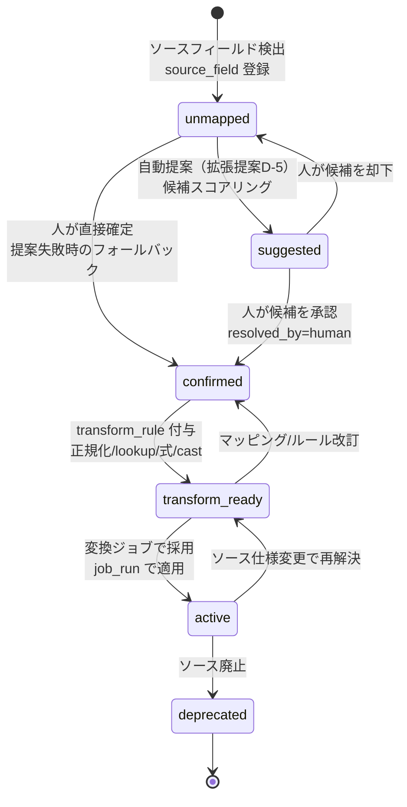

# BD-04 連携・データパイプライン 基本設計 — DataBridge（`MOD-INTEGRATION`）

> **ステータス:** ドラフト（レビュー前）
> **版:** v1.0
> **最終更新:** 2026-07-04
> **関連ドキュメント:** [正準設計ブループリント v1.0]（全ドキュメント共通契約）／ [00 ビジョン・スコープ](../00-vision-scope.md) ／ [用語集](../glossary.md) ／ [意思決定ログ（ADR）](../decision-log.md) ／ [BD-01 アーキテクチャ概観](./BD-01-architecture-overview.md) ／ [BD-02 業務ドメインサービス](./BD-02-domain-services.md) ／ [BD-03 分析・AIプラットフォーム](./BD-03-analytics-ai-platform.md) ／ [BD-05 バックオフィス](./BD-05-backoffice.md) ／ [BD-06 非機能設計](./BD-06-non-functional.md) ／ [DD-01 正準データモデル](../detailed-design/DD-01-canonical-data-model.md) ／ [DD-02 API設計](../detailed-design/DD-02-api-interface-design.md) ／ [DD-03 マッピング/変換エンジン](../detailed-design/DD-03-mapping-transform-engine.md) ／ [DD-06 認証/認可/テナント分離](../detailed-design/DD-06-security-authz-tenancy.md) ／ [DB-05 分析スタースキーマ](../database/DB-05-analytics-star-schema.md) ／ [DB-06 マッピング/ステージング物理スキーマ](../database/DB-06-mapping-metadata-schema.md) ／ [DB-08 knowledge/ベクター/スナップショット](../database/DB-08-knowledge-vector-snapshot-schema.md) ／ 継承元 [docs/design.md](../../design.md)・[docs/star-schema-design.md](../../star-schema-design.md)

---

本ドキュメントは Undeux Platform（略称 **UCP**、プロダクト系統コード `UNDX`）の**連携・データパイプライン基本設計**であり、対象モジュールは **`MOD-INTEGRATION` DataBridge（連携/変換基盤）** である。DataBridge は、自社開発業務アプリ（`MOD-RETAIL` CrossRetail / `MOD-MAKER` MakerOps / `MOD-WMS` WareFlow）と、他社開発サービスからの連携データを、**正準ターゲット（`mapping.canonical_target`）** と**人的フィールドマッピング**を介して **`MOD-ANALYTICS` InsightMart** のコンフォームド・スタースキーマ（`mart_{tenant_code}`）へ自動集約する。

名称・ID・SoT・命名規約はすべて正準設計ブループリント v1.0（以下「ブループリント」）が SoT である。本書はブループリント §3.5（`mapping` + `staging`）・§4（`mart` コンフォームドモデル）・§5（マッピング/変換メタモデルの骨子）・§7（SoT 宣言マップ）の範囲内で、「連携がどう成立し、取込→変換→mart までデータがどう流れるか」を基本設計として確定する。**マッピング/変換メタモデルの詳細（テーブル DDL・生成列）は [DB-06](../database/DB-06-mapping-metadata-schema.md) が owner、変換エンジンの実装（ルール評価・ジョブ実行系）は [DD-03](../detailed-design/DD-03-mapping-transform-engine.md) が owner** であり、本書はそれらへの入出力契約と全体像に留める。

---

## 0. 前提

本書は以下を前提とする。前提が崩れる場合は「§9 未決事項」と ADR（[decision-log.md](../decision-log.md)）で再検討する。

- **継承の前提:** 現行 UndeuxSales（[docs/design.md](../../design.md)）は、小売しまむらから週次提供される CSV を `import_batch` 管理で取込み `sales_weekly` に蓄積、`mart.rebuild()` で mart を派生する構造を持つ。本書はこの「他社由来データ＝取込ファイル/`import_batch` が SoT」「mart は SoT からの冪等派生」という設計思想（[docs/star-schema-design.md](../../star-schema-design.md) §0）を継承し、単一小売固定から**任意ソース×人的マッピング**へ一般化する。
- **ソース区分の前提:** ソースは `mapping.source_system.system_type ∈ {self, external}` の 2 系統。`self`（自社アプリ）は最初からスタースキーマ連携前提スキーマのため**恒等マッピングで直結**、`external`（他社サービス）は**取込→ステージング→人的マッピング→変換**の経路を通る（ブループリント §3.5 末尾・ADR-002）。
- **SoT の前提:** 他社連携データの SoT は `staging.raw_record`（生ペイロード）／取込履歴は `staging.import_batch`。自社アプリは各業務 OLTP（`retail.*` / `maker.*` / `wms.*`）が SoT。分析 mart（`mart_{tenant_code}`）は常に派生キャッシュであり、SoT 書込→mart 反映（`rebuild()`）の順序を厳守する（ブループリント §7・ADR-009）。
- **正準ターゲットの前提:** フィールドマッピングの宛先 `mapping.canonical_target`（`target_schema` / `target_table` / `target_column`）の SoT は本ブループリント §4（コンフォームドモデル）。DataBridge はこれを参照テーブルとして保持するがスキーマ定義自体は生成しない。
- **テナントの前提:** テナント＝契約クライアント組織（`shared.tenant`）。`mapping` / `staging` の全業務テーブルは共有テーブル＋ PostgreSQL RLS（論理列 `tenant_id`、セッション変数 `app.tenant_id`）で分離する（ADR-001 / [DD-06](../detailed-design/DD-06-security-authz-tenancy.md)）。テナント越境は `UNDX-TENANT-*` で拒否する。
- **型・金額の前提:** 金額は最小通貨単位の整数 `bigint`（`shared.currency.minor_unit` で桁解釈）、数量は `int`、業種固有属性は `attributes jsonb`＋生成列で吸収（ブループリント §8.4 / ADR-005 / ADR-007）。
- **範囲の前提:** 本書は連携・取込・マッピング解決・変換・スナップショットの基本設計を確定する。分析次元/ファクトの論理設計は [BD-03](./BD-03-analytics-ai-platform.md)・[DB-05](../database/DB-05-analytics-star-schema.md)、AI/RAG/エージェントは [BD-03](./BD-03-analytics-ai-platform.md)・[DD-04](../detailed-design/DD-04-ai-rag-agent-design.md) が owner。

---

## 1. 連携の全体像

DataBridge は「あらゆるソースの生データ」を「単一のコンフォームド・スタースキーマ」へ収束させる**収束ハブ**である。ソースの性質により 2 つの経路を持つが、両者は最終的に同じ正準ターゲット（`mapping.canonical_target`）と同じ mart 反映（`rebuild()`）に合流する。この「経路は 2 本だが宛先は 1 つ」という構造が、後述する差別化（§2 連携の容易さ）と一貫性（SoT 一元管理）を同時に成立させる。

| 経路 | ソース `system_type` | フロー | マッピング解決 | SoT |
|---|---|---|---|---|
| **自社アプリ直結** | `self` | 業務 OLTP（`retail`/`maker`/`wms`）→ 恒等マッピング → mart | `resolved_by='auto'`（恒等・人手不要） | 各業務 OLTP |
| **他社サービス取込** | `external` | 取込 → `staging.raw_record` → 人的マッピング → 変換 → mart | `resolved_by='human'`（人が正準ターゲットへ紐付け） | `staging.raw_record` / `staging.import_batch` |

両経路とも、実行系は `mapping.mapping_job → mapping.job_run` で駆動し、`job_run` の結果（`row_count` / `error_code`）を記録した上で mart の該当テナントスキーマを `rebuild()` する。以下のパイプライン図は、ソース登録から mart 反映までのデータの流れ（取込→変換→mart）を示す。左の 2 経路が中央の変換段で合流し、`job_run` を経て右の mart へ至る点が全体像の要である。

```mermaid
flowchart LR
    subgraph SELF[自社アプリ 直結経路 self]
        OLTP[(retail / maker / wms<br/>業務OLTP=SoT)]
    end
    subgraph EXT[他社サービス 取込経路 external]
        SRC[他社ソース<br/>CSV / API / Webhook / ファイル]
        RAW[(staging.raw_record<br/>他社連携SoT)]
        IB[(staging.import_batch<br/>取込履歴・追記専用)]
        SRC --> RAW
        SRC --> IB
    end
    subgraph MAP[マッピング・変換 DataBridge]
        FM[field_mapping<br/>人的/自動 解決]
        TR[transform_rule<br/>正規化/lookup/式/型変換]
        CT[canonical_target<br/>正準ターゲット §4]
        DQ[data_quality_rule<br/>検証]
        FM --> TR
        CT --> FM
        CT --> DQ
    end
    JR[(mapping.job_run<br/>記録系・巻戻し禁止)]
    MART[(mart_&#123;tenant_code&#125;<br/>派生キャッシュ)]
    SNAP[SnapshotStore<br/>静的ファイル/ドキュメントDB]

    OLTP -->|恒等マッピング auto| FM
    RAW -->|人的マッピング human| FM
    TR --> JR
    DQ --> JR
    JR -->|rebuild 冪等再構築| MART
    MART --> SNAP
```

**図の要約:** 自社経路（`self`）は OLTP を SoT として恒等マッピングで直結し、他社経路（`external`）は取込で `staging.raw_record` に着地させた上で人的マッピングを介する。両経路は `field_mapping`→`transform_rule` で合流し、`data_quality_rule` の検証結果とともに `job_run`（記録系・巻戻し禁止）に集約され、mart の該当テナントスキーマを冪等に `rebuild()` する。mart はさらに `SnapshotStore` へ静的化される（§7）。この依存方向・名称はブループリント §5 のメタモデル骨子図と一致する。

---

## 2. 差別化としての「連携の容易さ」の実現方式

本プラットフォームの競争優位は「**分析サービスへの連携難易度の低さ**」と「各分析機能の実現性」である（共有コンテキスト／ブループリント §1）。DataBridge はこの「連携の容易さ」を、以下の 5 つの設計方針で実現する。いずれもブループリント確定要素の組合せであり、新規抽象を追加していない（CLAUDE.md 原則3: 既存パターンの再利用）。

| # | 方針 | 実現手段（ブループリント根拠） | 連携容易さへの寄与 |
|---|---|---|---|
| D-1 | **自社アプリはゼロマッピング** | `system_type='self'` は恒等マッピング（`resolved_by='auto'`）で人的解決を省略（§3.5・ADR-002） | 自社アプリ利用者は設定なしで即分析可能 |
| D-2 | **他社は「項目対応の宣言」だけ** | 人は `source_field → canonical_target` の対応を選ぶのみ。変換ロジックは `transform_rule`（正規化/lookup/式/型変換）が吸収（§5） | 他社データの物理差異を人がコードで埋めない |
| D-3 | **単一の正準ターゲットへ収束** | 宛先はブループリント §4 のコンフォームド次元/ファクトに固定。ソースが増えても宛先スキーマは不変 | 新ソース追加が既存 mart を壊さない（下位互換） |
| D-4 | **業種差は構造で吸収** | 商品=汎用バリアント2軸＋`attributes jsonb`＋生成列、地域=自己参照階層 `dim_region`（動的粒度）、販売先=`dim_customer`（§4・ADR-003/007/008） | アパレル/食品/雑貨を DDL 変更なしで受入 |
| D-5 | **マッピング候補の自動提案（拡張提案）** | `source_field.sample` と `canonical_target.semantic` を突合し初期候補を提示。最終確定は人（`resolved_by='human'`）が担保 | 人的解決の工数を削減しつつ精度を確保 |

> **拡張提案（D-5）:** マッピング候補の自動提案は、`source_field.field_name` / `data_type` / `sample` と `canonical_target.semantic` の類似度でスコアリングし上位候補を UI に提示する機能である。ブループリント未定義のため拡張提案とし、実装可否・スコアリング方式は [DD-03](../detailed-design/DD-03-mapping-transform-engine.md) で確定する。**自動提案は候補提示に限り、確定は必ず人が行う**（誤マッピングによる分析汚染の防止・ガードレール思想の継承 ADR-010）。この提案が失敗しても人的マッピング自体は継続可能とする（グレースフルデグラデーション）。

これらにより、他社サービスの導入クライアントは「CSV/API の項目名を正準ターゲットに対応づける」作業のみで分析基盤に載る。物理変換・スキーマ整合・mart 構築はすべてプラットフォーム側が引き受ける。

---

## 3. 取込方式と冪等取込

### 3.1 取込方式（取込チャネル）

他社ソース（`system_type='external'`）は `mapping.source_system.protocol` により取込方式を宣言する。方式は 4 種を基本とし、いずれも着地点は `staging.raw_record`（生ペイロード＝SoT）と `staging.import_batch`（取込履歴）で共通化する。現行 UndeuxSales の「週次 CSV バッチ + `import_batch`」（[docs/design.md](../../design.md)）はこの「バッチCSV」方式の特殊ケースとして継承される。

| 方式 | `protocol` 例 | 起動契機 | 主な用途 | 冪等キー（`import_batch.batch_key`）の例 |
|---|---|---|---|---|
| **バッチCSV** | `csv_batch` | スケジュール（`mapping_job.schedule`）／手動 | 週次売上・在庫参照データ | ファイルハッシュ or 提供期間キー |
| **API（プル）** | `rest_pull` | スケジュール／手動 | 他社 SaaS の定期同期 | エンドポイント×取得区間キー |
| **Webhook（プッシュ）** | `webhook` | 他社イベント受信 | 準リアルタイム更新通知 | イベントID（他社発行） |
| **ファイル** | `file_drop` | オブジェクトストレージ着信 | 大容量・不定形ファイル | オブジェクトキー（バケット×パス×版） |

**API 設計原則の踏襲:** 取込 API は 1API=1責務（[DD-02](../detailed-design/DD-02-api-interface-design.md) owner）。取込トリガと状態照会（`job_run` ポーリング）は分離し、`mart.rebuild()` と同様に**非同期＋ポーリング**とする（大容量取込が共有プロキシのタイムアウトを超えないため。[docs/design.md](../../design.md) の rebuild 非同期設計を継承）。

### 3.2 冪等取込

取込は再実行され得る（リトライ・重複配信・手動再取込）。CLAUDE.md 原則2（冪等性と状態保護）に従い、**再実行で記録系（`import_batch` / `job_run` / `raw_record`）が巻き戻らない**ことを保証する。

- **バッチ単位の冪等:** `staging.import_batch` の自然キー `(source_dataset_id, batch_key)` を UNIQUE とし、同一 `batch_key` の再取込は UPSERT で**既存バッチを二重生成しない**。`status`（pending/completed/failed）は前進のみ許し、`completed` の再取込は no-op（またはオペレーター明示の再取込フラグ時のみ再処理）。
- **レコード単位の冪等:** `staging.raw_record` は `(source_dataset_id, job_run_id)` と生ペイロード内の自然キーで重複排除。SoT である生ペイロードは**追記保存**し上書きしない。
- **Webhook の冪等:** 他社発行イベントIDを `batch_key` に採用し、重複配信を UNIQUE で吸収。イベント受信ハンドラ（Webhook）と手動回復パス（再取込・再同期）の**両方**を用意する（CLAUDE.md データフロー整合性の変更時確認2）。
- **記録系の保護:** `job_run` は追記のみ（`row_count` / `started_at` / `finished_at` / `error_code` を確定記録）。再実行は新しい `job_run` 行を作り、過去の実行記録を書き換えない。

**エラーハンドリング（非ブロッキング）:** 取込は「取れたところまで進めて結果を記録する」グレースフルデグラデーションを原則とする。1レコードのパース失敗が取込バッチ全体を止めない（該当行を `error_code` 付きで隔離し、正常行は先へ進める）。想定エラーには `UNDX-IMP-*`（取込処理・[docs/design.md](../../design.md) から継承）を付与する。取込方式別の代表エラー例:

| エラーコード | 意味 |
|---|---|
| `UNDX-IMP-001` | 取込ファイル/ペイロードの形式不正（パース不能） |
| `UNDX-IMP-002` | 必須データセット/フィールド欠落 |
| `UNDX-IMP-003` | 取込ソース未登録（`source_system`/`source_dataset` 不明） |
| `UNDX-MAP-001` | 未解決マッピング（`active` な `field_mapping` 無し・正準ターゲット未紐付け） |
| `UNDX-MAP-004` | 変換式エラー（式評価失敗・金額 cast の桁/丸め未宣言） |

> **注:** `UNDX-IMP-*` の連番・メッセージの SoT はコード内 `ErrorCodes`（ブループリント §9 / `shared.error_code`）。**`UNDX-MAP-*`／`UNDX-DQ-*` の各番号の「意味」は [DD-03 §7](../detailed-design/DD-03-mapping-transform-engine.md)（マッピング/変換エンジンが SoT）と一致させる（R8。同一番号を別意味に用いない）。** 上表は本書での代表例であり、確定採番・メッセージは [DD-02 §8.5](../detailed-design/DD-02-api-interface-design.md)（`shared.error_code`）に従う。

---

## 4. 項目マッピングの人的解決フローと変換ジョブ

### 4.1 人的解決フロー（状態遷移）

他社ソースのフィールドマッピングは人が確定する（`mapping.field_mapping.resolved_by='human'`）。マッピングは「未提案 → 提案済 → 確定 → 変換適用可」と段階を踏み、各 `field_mapping.status` で状態を管理する。次の状態遷移図は、1 つのソースフィールドが正準ターゲットへ紐付き、変換ジョブで利用可能になるまでのライフサイクルを示す。破線の自動提案（D-5 拡張提案）が失敗しても、人手による直接確定の経路（`unmapped → confirmed`）が常に残る点がグレースフルデグラデーションである。

**図の要約:** ソースフィールドは検出時 `unmapped`。自動提案（拡張提案）で `suggested` になり人の承認で `confirmed`、または提案を経ず人が直接 `confirmed` へ進める。`transform_rule` 付与で `transform_ready`、変換ジョブ採用で `active`。ソース仕様変更・廃止時は `transform_ready`/`deprecated` へ戻る。状態は `field_mapping.status` が保持し、確定操作は常に人（`resolved_by='human'`）が担う。マッピング改訂は下位互換のため**旧マッピングを即時削除せず** `deprecated` へ退避し、過去 `job_run` の再現性を保つ（CLAUDE.md 原則7）。

### 4.2 変換ジョブ

確定したマッピング＋変換ルールは、変換ジョブ（`mapping.mapping_job → mapping.job_run`）が実行する。ジョブは「ステージングの生レコード（または自社 OLTP）を読み、`field_mapping` で正準ターゲット列へ射影し、`transform_rule` を適用し、`data_quality_rule` で検証し、正準 OLTP 相当へ反映して mart を再構築する」までを 1 実行単位とする。

- **変換ルール種別（`transform_rule.rule_type`）:** `normalize`（表記ゆれ正規化）／`lookup`（コード変換・`shared` 参照マスタ引き当て）／`expr`（式評価）／`cast`（型変換）。ルール本体は `expression jsonb` で保持（ブループリント §3.5）。エンジン実装は [DD-03](../detailed-design/DD-03-mapping-transform-engine.md) が owner。
- **ジョブ実行の非同期性:** 大規模変換＋mart 再構築は非同期実行し、`job_run.status` をポーリングで監視する（rebuild 継承）。
- **記録系の巻戻し禁止:** `mapping.job_run` / `mapping.data_quality_result` は記録系。再実行は新規行を追加し、過去実行を破壊しない（CLAUDE.md 原則2）。
- **自社直結ジョブ:** `system_type='self'` の `mapping_job` は恒等マッピングを持ち、OLTP 変更を検知して mart を再構築する（人的解決フローを経ない）。

---

## 5. スタースキーマ化の自動変換パイプライン（既存 `rebuild()` の一般化）

### 5.1 一般化の方針

現行 UndeuxSales の `mart.rebuild()` は「`sales_weekly` ＋ 商品マスタ → `dim_*` / `fact_sales_weekly` / `fact_inventory_snapshot` を冪等全再構築（advisory lock 直列化・`SET LOCAL statement_timeout=0`・非同期）」する関数である（[docs/star-schema-design.md](../../star-schema-design.md) / [docs/design.md](../../design.md)）。本書はこれを**任意ソース × 任意テナントスキーマ**へ一般化する。

- **入力の一般化:** 単一小売固定 → 変換ジョブが正準ターゲットへ射影した正準 OLTP 相当（自社は `retail/maker/wms`、他社は `staging` 由来）を入力とする。
- **出力の一般化:** 単一 mart → テナント別スキーマ `mart_{tenant_code}`（ブループリント §8.3）。`SET search_path = mart_{tenant_code}, mart, shared` で対象を選択（[BD-01](./BD-01-architecture-overview.md) の search_path 運用を継承）。
- **ファクト家族の一般化:** `fact_sales_weekly` 中心 → `fact_orders` / `fact_production` / `fact_delivery` / `fact_warehouse_movement` / `fact_billing` を含むファクト家族（ブループリント §4.2・ADR-006）。次元は `dim_region` / `dim_customer` / `dim_channel` / `dim_warehouse` を追加。
- **冪等性・状態保護の継承:** advisory lock による直列化、`statement_timeout=0`、非同期実行、`build_info.status`（idle/running/completed/failed）ポーリング、45分超の `running` を stale とみなす再実行許可を踏襲。代表行選択の決定的 tie-break（[docs/design.md](../../design.md)）も継承。

### 5.2 パイプライン段階

自動変換は「①取込 → ②ステージング → ③マッピング適用 → ④品質検証 → ⑤正準OLTP相当反映 → ⑥mart再構築」の 6 段で構成する。①〜②は他社経路のみ、自社経路は③から入る。各段は前段の SoT を読み後段の派生を書く（SoT→派生の順序厳守）。mart 再構築（⑥）は SoT 反映（⑤）が完了してから起動する。

- **③マッピング適用:** `field_mapping`（確定済）で `source_field` → `canonical_target` へ射影。
- **④品質検証:** `data_quality_rule` を適用し `data_quality_result` に記録（§6）。`severity` により後続を止めるか隔離して進めるかを分岐。
- **⑤正準OLTP相当反映:** 変換結果を正準形へ UPSERT（自然キーで冪等）。SoT（自社=OLTP、他社=staging）は変更しない。
- **⑥mart再構築:** `rebuild()` を該当テナントスキーマで非同期実行。集約は有界で必ず終了する。

**エラーコード:** mart 再構築系の想定エラーには `UNDX-ANL-*`（分析/mart・ブループリント §9 新設）を付与する（例 `UNDX-ANL-001` 再構築中の二重起動拒否、`UNDX-ANL-002` テナントスキーマ未解決）。補助段（品質検証の一部・スナップショット生成）の失敗は主要フロー（mart 反映）を止めない（グレースフルデグラデーション）。

---

## 6. データ品質・検証・エラーハンドリング

### 6.1 検証モデル

データ品質は `mapping.data_quality_rule`（正準ターゲット単位のルール定義・設定系）と `mapping.data_quality_result`（`job_run` 単位の検証結果・記録系）で管理する（ブループリント §3.5）。ルールは `rule_type` と `severity`、`params jsonb` を持ち、変換ジョブ（§4.2）の④段で評価される。

| `rule_type` 例 | 検証内容 | 代表 `severity` |
|---|---|---|
| `not_null` | 必須項目の非NULL | error |
| `range` | 数量・金額の値域（負数禁止等） | error/warning |
| `referential` | `lookup` 先が `shared` 参照マスタに存在 | error |
| `unique` | 自然キーの一意性（冪等UPSERTの前提） | error |
| `format` | コード書式・日付書式 | warning |
| `freshness` | 取込データの鮮度（期待周期内か） | warning |

### 6.2 severity とハンドリング

`severity` により主要フローへの影響を分岐させ、非ブロッキングを担保する（CLAUDE.md 原則4）。

- **`error`:** 該当レコードを隔離し `data_quality_result` に `passed=false` と `sample jsonb` を記録。正常レコードは変換を継続（部分成功）。バッチ全体を止めるのは、正準ターゲットの整合が全域で崩れる致命ケースのみ。
- **`warning`:** 記録のみ行い変換は継続。オペレーターへ後追い通知。
- **結果の記録系保護:** `data_quality_result` は追記のみ。再検証は新しい `job_run` の結果として追加し過去を上書きしない。

**エラーコード:** データ品質違反には `UNDX-DQ-*`（データ品質検証・ブループリント §9 新設）を付与する。代表例:

| エラーコード | 意味 |
|---|---|
| `UNDX-DQ-001` | 必須項目欠落（required / not_null 違反） |
| `UNDX-DQ-002` | 型不適合（正準型へ cast 不能。[DD-03 §7](../detailed-design/DD-03-mapping-transform-engine.md) と一致） |
| `UNDX-DQ-003` | 参照整合性違反（lookup 先マスタ未解決） |
| `UNDX-DQ-004` | コード表記揺れ（正規化補正済み・非ブロッキング。[DD-03 §7](../detailed-design/DD-03-mapping-transform-engine.md) と一致） |
| `UNDX-DQ-005` | 値域違反（range 違反・負の数量/金額等） |
| `UNDX-DQ-006` | 自然キー重複（unique 違反） |

> `UNDX-DQ-*` / `UNDX-MAP-*` の**各番号の意味は [DD-03 §7](../detailed-design/DD-03-mapping-transform-engine.md)（変換/DQ エンジンが意味の SoT）と一致**させる（R8）。連番・メッセージ・`http_status` の確定 SoT はコード内 `ErrorCodes`（`shared.error_code` 経由 `GET /api/error-codes` 公開・[DD-02 §8.5](../detailed-design/DD-02-api-interface-design.md)）。UI では違反サマリを、PC＝一覧テーブル、モバイル＝カード型で表示する（CLAUDE.md 原則8 レスポンシブ・違反明細は件数と代表サンプルを可読形式で提示）。

### 6.3 検証結果の可視化とレスポンシブ

品質検証結果・マッピング未解決一覧・取込履歴は運用画面で提示する。PC ではテーブル（`job_run` × `dq_rule` の格子）、モバイルでは 1 検証 1 カード（ルール名・severity・違反件数・サンプル）で表示し、可読性を確保する（[DD-05](../detailed-design/DD-05-screen-ux-si-strategy.md) が UI owner）。

---

## 7. スナップショット静的ファイル生成とドキュメントDB活用

高パフォーマンス要件に対し、mart 集計結果を**スナップショット（静的ファイル/ドキュメントDB）**として物理化する（共有コンテキスト／ブループリント §6 `SnapshotStore`）。マニフェストは `knowledge.snapshot_manifest`（`snapshot_type` / `object_uri` / `built_at` / `source_version`）が管理し、実体はオブジェクトストレージ（静的JSON/画像/帳票）およびドキュメントDB（柔軟文書・準構造化集計）に置く。

- **用途:** 全社サマリー・ランキング・クロス集計など「読み取り主体・再計算コスト大」の集計を事前生成し、フロント（Nuxt/Chart.js）は静的取得で即描画する。柔軟な半構造化文書（インサイト・レポート）はドキュメントDBに格納する。
- **SoT と派生の関係:** スナップショットは**常に派生**。SoT は mart（さらに遡れば各 OLTP / staging）。`source_version`（mart のビルド版）を持たせ、どの mart 状態から生成したかを追跡可能にする。
- **冪等生成・状態保護:** スナップショット再生成は冪等（同一 `source_version` から同一成果物）。`snapshot_manifest` は追記管理し、旧版を即時削除せず世代管理（下位互換・ロールバック容易）。生成失敗は主要フロー（mart 反映）を止めない（グレースフルデグラデーション）。
- **回復パス:** スナップショット破損・欠落時は、mart から再生成（`source_version` 指定）で復元する。SoT からの回復パスが常に存在する（CLAUDE.md 原則6）。

### 7.1 他社連携の取込シーケンス（スナップショットまで）

以下のシーケンス図は、他社サービスからの 1 回の取込が、ステージング着地 → マッピング適用 → 品質検証 → mart 再構築 → スナップショット生成まで、どのコンポーネント間でやり取りされるかを示す。SoT（`staging.raw_record`）への書込が先、mart・スナップショットという派生の更新が後、という順序が保たれている点が要点である。

```mermaid
sequenceDiagram
    autonumber
    participant SRC as 他社ソース
    participant ING as 取込サービス<br/>DataBridge
    participant STG as staging<br/>raw_record / import_batch（SoT）
    participant JOB as 変換ジョブ<br/>mapping_job / job_run
    participant DQ as データ品質<br/>data_quality_result
    participant MART as mart_&#123;tenant_code&#125;<br/>rebuild（派生）
    participant SNAP as SnapshotStore<br/>snapshot_manifest（派生）

    SRC->>ING: CSV/API/Webhook/ファイル 送信
    ING->>STG: import_batch UPSERT（batch_key で冪等）
    ING->>STG: raw_record 追記保存（生ペイロード=SoT）
    Note over ING,STG: 重複配信は UNIQUE で吸収（冪等取込 §3.2）
    ING-->>SRC: 受領応答（非同期・job_run 参照）
    JOB->>STG: 生レコード読取
    JOB->>JOB: field_mapping 射影 + transform_rule 適用
    JOB->>DQ: data_quality_rule 検証 → 結果追記
    alt severity=error（致命）
        DQ-->>JOB: 隔離 + UNDX-DQ-*
        JOB->>JOB: 正常行のみ継続（部分成功・非ブロッキング）
    end
    JOB->>MART: 正準OLTP相当 UPSERT → rebuild 起動（非同期）
    Note over MART: advisory lock 直列化 / statement_timeout=0
    MART-->>JOB: build_info.status ポーリングで完了確認
    MART->>SNAP: 集計をスナップショット化（source_version 付与）
    SNAP-->>SNAP: snapshot_manifest 追記（世代管理）
```

**図の要約:** 取込サービスは `import_batch` を冪等 UPSERT し `raw_record` に生ペイロードを追記保存（SoT）した上で非同期の受領応答を返す。変換ジョブがステージングを読み、マッピング射影・変換・品質検証（致命は隔離して部分成功）を経て正準OLTP相当へ UPSERT し、mart を非同期 `rebuild()`。完了後に集計をスナップショット化し `snapshot_manifest` を世代管理で追記する。SoT 書込（`raw_record`）が先、派生（mart / snapshot）が後という順序が全経路で保たれる。

---

## 8. SoT と回復パス（再同期）

DataBridge が扱うデータ領域の SoT・派生・回復パスを以下に確定する（ブループリント §7 の該当行を本書の担当範囲で具体化。SoT 宣言自体の SoT はブループリント §7）。

| データ領域 | SoT | キャッシュ／派生 | 回復パス（再同期） |
|---|---|---|---|
| 他社連携データ | `staging.raw_record` / `staging.import_batch` | 正準OLTP相当 → `mart_{tenant_code}` | 変換ジョブ再実行（`mapping.job_run`）→ `rebuild()` |
| 自社連携データ | `retail.*` / `maker.*` / `wms.*`（OLTP） | `mart_{tenant_code}` | `mart.rebuild()`（恒等マッピング経由） |
| フィールドマッピング定義 | `mapping.field_mapping` / `mapping.transform_rule`（設定系・更新可） | なし | 定義は版管理（`deprecated` 退避で再現性保持） |
| 取込・変換の実行記録 | `mapping.job_run` / `staging.import_batch`（記録系・巻戻し禁止） | なし | 追記のみ・過去実行は不変 |
| データ品質結果 | `mapping.data_quality_result`（記録系） | なし | 再検証は新 `job_run` で追記 |
| 分析集計スナップショット | `mart_{tenant_code}` の各 `fact_*` | 静的ファイル/ドキュメントDB（`snapshot_manifest`） | mart から再生成（`source_version` 指定） |

**確定事項（本書担当範囲）:**
- 他社連携は `staging` が SoT、自社連携は OLTP が SoT。**mart は常に派生**であり、DataBridge は SoT を破壊せずに派生を再構築する。
- **回復パスの二重化:** イベント受信ハンドラ（Webhook）と手動回復パス（再取込・変換ジョブ再実行・`rebuild()`）の両方を常に備える（CLAUDE.md データフロー整合性）。
- **順序保証:** 全経路で「SoT 書込 → 品質検証 → 正準OLTP相当反映 → mart 再構築 → スナップショット生成」の順を厳守。逆順（派生を先に更新）を禁じる。
- **下位互換:** 正準ターゲット（§4）は不変を原則とし、やむを得ない変更時は互換ビューで段階移行（ADR-013）・データ更新パッチとオペレーター手順を用意する（CLAUDE.md 原則7）。

---

## 9. 未決事項

以下は本書時点で未確定であり、記載の owner ドキュメント／ADR で確定する。推測で断定せず、確定後に本書へ波及させる。

| # | 未決事項 | 論点 | 確定 owner |
|---|---|---|---|
| Q-1 | マッピング自動提案（D-5 拡張提案）の採否とスコアリング方式 | 類似度アルゴリズム・提案精度・UI 提示方法。誤提案リスクの許容範囲 | [DD-03](../detailed-design/DD-03-mapping-transform-engine.md) / ADR 追加 |
| Q-2 | Webhook 受信のリアルタイム変換 vs マイクロバッチ束ね | 準リアルタイム更新時の `rebuild()` 頻度と負荷。差分再構築の要否 | [DD-03](../detailed-design/DD-03-mapping-transform-engine.md) / [BD-06](./BD-06-non-functional.md) |
| Q-3 | mart 再構築の全再構築 vs 差分（増分）再構築 | 現行は全再構築（冪等・単純）。ソース増でコスト増時の増分化判断 | [DB-05](../database/DB-05-analytics-star-schema.md) / ADR 追加 |
| Q-4 | ドキュメントDB の製品選定 | スナップショット/柔軟文書の格納先（PostgreSQL jsonb で代替可能か含む） | [BD-06](./BD-06-non-functional.md) / [DB-08](../database/DB-08-knowledge-vector-snapshot-schema.md) |
| Q-5 | `transform_rule.expression jsonb` の DSL/式言語 | 表現力とサンドボックス安全性（任意式評価のガードレール） | [DD-03](../detailed-design/DD-03-mapping-transform-engine.md) |
| Q-6 | `UNDX-MAP-*` / `UNDX-DQ-*` / `UNDX-ANL-*` の連番確定 | 領域内 001 からの採番・メッセージ・http_status | [DD-02](../detailed-design/DD-02-api-interface-design.md) / [BD-06](./BD-06-non-functional.md) |
| Q-7 | 大容量ファイル取込のストリーミング要件 | メモリ有界処理・分割取込の閾値 | [BD-06](./BD-06-non-functional.md) |

---

> 本書はブループリント §5・§7 を owner 範囲として、連携・取込・マッピング・変換・スナップショットの基本設計を確定した。メタモデル物理設計は [DB-06](../database/DB-06-mapping-metadata-schema.md)、変換エンジン実装は [DD-03](../detailed-design/DD-03-mapping-transform-engine.md)、mart 物理設計は [DB-05](../database/DB-05-analytics-star-schema.md) が owner であり、詳細はそれらに委譲する。名称・SoT・命名規約はブループリントを不変で踏襲した。
