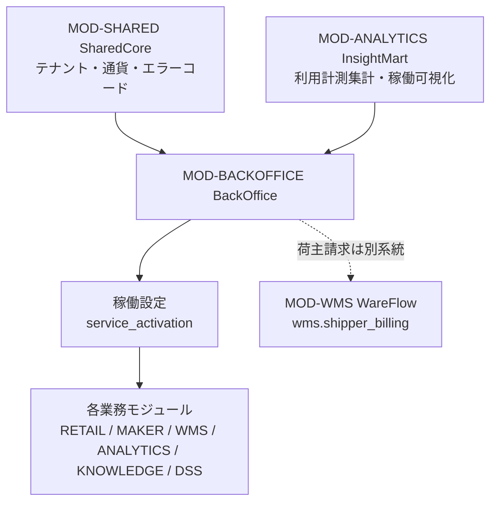
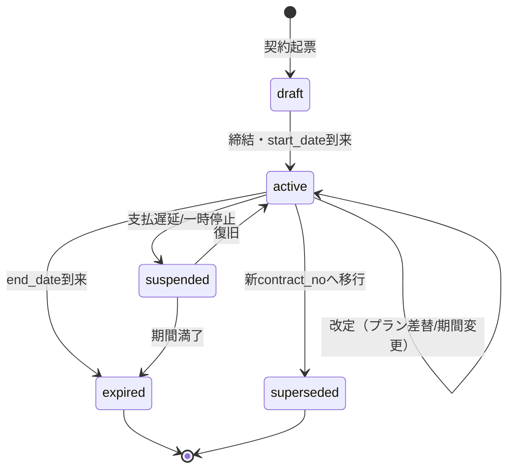
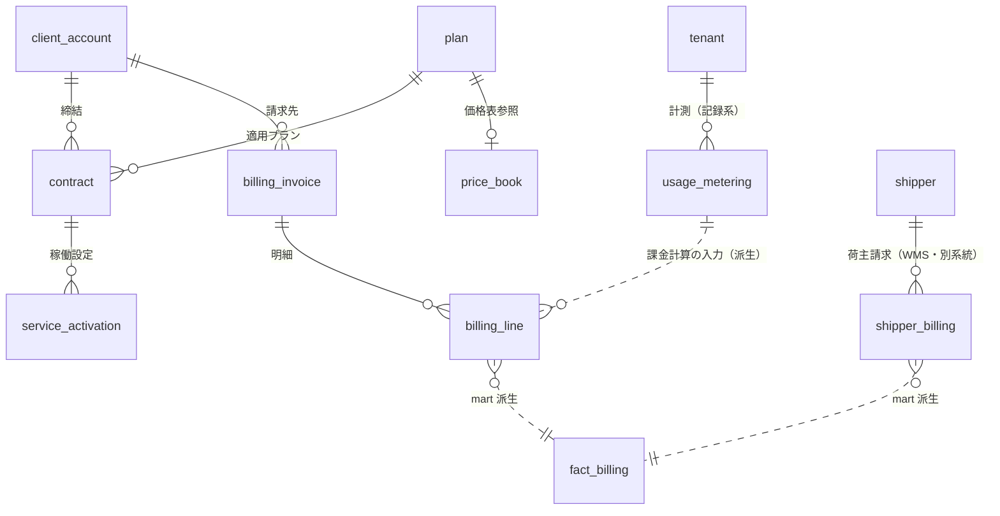

# BD-05 バックオフィス — Undeux Platform（UCP）契約・稼働設定・利用計測・請求 基本設計

> **ステータス:** ドラフト（レビュー前）
> **版:** v1.0
> **最終更新:** 2026-07-04
> **関連ドキュメント:** [正準設計ブループリント v1.0]（全ドキュメント共通契約）／ [00 ビジョン・スコープ](../00-vision-scope.md) ／ [用語集](../glossary.md) ／ [意思決定ログ（ADR）](../decision-log.md) ／ [BD-01 アーキテクチャ概観](./BD-01-architecture-overview.md) ／ [BD-02 業務ドメインサービス](./BD-02-domain-services.md) ／ [BD-03 分析・AIプラットフォーム](./BD-03-analytics-ai-platform.md) ／ [BD-04 連携・データパイプライン](./BD-04-integration-data-pipeline.md) ／ [BD-06 非機能設計](./BD-06-non-functional.md) ／ [DD-02 API・インターフェース設計](../detailed-design/DD-02-api-interface-design.md) ／ [DD-05 画面・UX・SI戦略](../detailed-design/DD-05-screen-ux-si-strategy.md) ／ [DD-06 セキュリティ・認可・テナンシー](../detailed-design/DD-06-security-authz-tenancy.md) ／ [DB-07 バックオフィス物理スキーマ](../database/DB-07-backoffice-schema.md) ／ [DB-04 倉庫WMS物理スキーマ](../database/DB-04-operational-schema-wms.md) ／ [DB-05 分析スタースキーマ](../database/DB-05-analytics-star-schema.md) ／ 継承元 [docs/design.md](../../design.md)・[docs/star-schema-design.md](../../star-schema-design.md)

---

本ドキュメントは Undeux Platform（略称 **UCP**、プロダクト系統コード `UNDX`）の**バックオフィス（`MOD-BACKOFFICE` BackOffice）基本設計**である。契約管理・テナント/稼働設定（プロビジョニング）・利用計測・請求の 4 領域と、それらを束ねる SoT・データフローを確定する。バックオフィスは**自社の基幹業務**であると同時に、**クライアントへ提供可能なサービス**でもある（ブループリント §2、提供先「自社/共通（クライアント提供可）」）。

名称・ID・SoT・命名規約はすべてブループリント v1.0（以下「ブループリント」）が SoT である。本書は「どう組むか（構造・責務分界）」と「どこまで基本設計で確定するか」を定める。`backoffice` の物理スキーマ・テーブル DDL は [DB-07](../database/DB-07-backoffice-schema.md)、API リソース契約は [DD-02](../detailed-design/DD-02-api-interface-design.md)、稼働設定に連動する画面・SI カスタマイズは [DD-05](../detailed-design/DD-05-screen-ux-si-strategy.md) が owner として詳細化する。本書は基本設計であり、代表テーブルの論理骨子は示すが、確定 DDL は [DB-07](../database/DB-07-backoffice-schema.md) に委ねる。

---

## 0. 前提

本書は以下を前提とする。前提が崩れる場合は「未決事項」（§7）と ADR（[decision-log.md](../decision-log.md)）で再検討する。

- **エンティティの前提:** バックオフィスの正準エンティティはブループリント §3.6 で確定済みの 7 表（`backoffice.client_account` / `contract` / `plan` / `service_activation` / `usage_metering` / `billing_invoice` / `billing_line`）である。本書はこれらを不変で用い、追加が必要な要素は「拡張提案」と明記する。
- **SoT の前提:** 契約・稼働は `backoffice.contract`／`service_activation`（設定系・更新可）が SoT、利用計測は `usage_metering`（記録系・巻き戻し禁止・追記のみ）、請求は `billing_invoice`／`billing_line`（期締めで再計算）が SoT（ブループリント §7）。分析 mart の `fact_billing` は常にこれらからの派生キャッシュである。
- **テナントの前提:** テナント＝契約クライアント組織（`shared.tenant`、`account_type ∈ {retailer, maker, warehouse, internal}`）。バックオフィスは OLTP 系として PostgreSQL Row-Level Security（`tenant_id` 論理列）で分離する（ADR-001）。自社運用（`account_type='internal'`）は全クライアント横断の稼働・利用集計が必要なため、別経路の横断集計を用いる（ブループリント §8.3、[BD-03](./BD-03-analytics-ai-platform.md) §8）。
- **請求の二層構造の前提:** 本プラットフォームには請求が 2 系統存在する。(1) **プラットフォーム利用料**＝バックオフィスがクライアントへ請求する `backoffice.billing_invoice`。(2) **倉庫WMS の荷主請求**＝倉庫テナントがその荷主（shipper）へ請求する `wms.shipper_billing`。両者は請求元・請求先・SoT が異なる別事象であり、混同しない（§4.4 で整理）。
- **技術スタックの前提:** ブループリント §8.5 の確定構成（Nuxt 4 / Vue 3 / TypeScript / Tailwind CSS v4 / Chart.js / .NET 8 ／ PostgreSQL 16 ／ Firebase Auth）を初期構成とする。金額は最小通貨単位の整数 `bigint`（`shared.currency.minor_unit` で桁解釈）で保持する（ADR-005）。
- **エラーコードの前提:** バックオフィス領域のエラーは `UNDX-BILL-{連番}`（契約/稼働/請求。BackOffice/荷主請求）に一元管理する（ブループリント §9）。テナント境界侵害は `UNDX-TENANT-*` を用いる。

---

## 1. バックオフィスの役割と提供モデル

バックオフィス（`MOD-BACKOFFICE` BackOffice）は、プラットフォームの**商流（契約→稼働→計測→請求）を束ねる基幹モジュール**である。依存関係はブループリント §2 の通り `MOD-SHARED`（テナント・通貨・エラーコード基盤）と `MOD-ANALYTICS`（利用計測・稼働の可視化供給）に依存する（`SC → BO`、`AN → BO`）。

### 1.1 二重の提供モデル

| 提供モデル | 利用者 | テナント | 説明 |
|---|---|---|---|
| 自社基幹（internal） | 自社オペレーター | `account_type='internal'` | 全クライアントの契約・稼働・計測・請求を横断運用する自社バックオフィス。 |
| クライアント提供（オプション） | クライアント自身 | 各クライアントの `tenant_id` | 自社のクライアントに対しバックオフィス機能を SaaS として提供。自テナントに閉じた契約・稼働・請求管理を行う。 |

両モデルは**同一のスキーマ・同一のロジック**を共有し、RLS（`tenant_id`）と権限スコープ（Firebase カスタムクレーム `role` / `accountType`、[DD-06](../detailed-design/DD-06-security-authz-tenancy.md)）で見える範囲を切替える。自社運用のみ横断集計の別経路を許可し、クライアント提供時は当該 `tenant_id` に閉じる（グレースフルデグラデーション：越境参照は `UNDX-TENANT-*` で拒否）。



上図は、バックオフィスが SharedCore と InsightMart に依存しつつ、稼働設定（`service_activation`）を通じて各業務モジュールの提供範囲を制御する関係を示す。倉庫WMS の荷主請求は破線で示す通り、バックオフィスのプラットフォーム請求とは別系統である（§4.4）。

### 1.2 責務分界

- **バックオフィスが持つ責務:** 契約ライフサイクル、プラン/提供機能定義、テナントのプロビジョニングと機能フラグ、利用量の計測、課金計算、請求書生成。
- **バックオフィスが持たない責務:** 認証そのもの（`MOD-SHARED`＋Firebase Auth が SoT）、業務トランザクション（各ドメインモジュールが SoT）、分析集計の実体（`MOD-ANALYTICS` が派生を生成し供給）。

---

## 2. 契約管理（契約・プラン・提供機能SKU・改定履歴）

### 2.1 エンティティと役割

| エンティティ | ブループリント表 | 役割 | SoT |
|---|---|---|---|
| クライアント口座 | `backoffice.client_account` | 契約主体（法人格）。`tenant_id` に 1:1 対応（自然キー `(tenant_id)`）。 | `backoffice.client_account` |
| 契約 | `backoffice.contract` | クライアントとプランの結合。`start_date`/`end_date`/`status`。自然キー `(client_account_id, contract_no)`。 | `backoffice.contract` |
| プラン | `backoffice.plan` | 提供内容のパッケージ。`module_scope jsonb`（対象モジュール集合）＋`price_book_id`。自然キー `plan_code`。 | `backoffice.plan` |

### 2.2 提供機能SKU（＝プランの `module_scope`）

本プラットフォームにおける「提供機能 SKU」＝**契約が有効化しうる提供機能の最小単位**は、専用テーブルを新設せず、`backoffice.plan.module_scope jsonb`（モジュールID `MOD-*` の集合と機能フラグ）で表現する。これはブループリント §3.6 の確定構造に一致する。

> **命名の注意:** ブループリントで `sku` はプロダクトの単品（`shared.sku` / `dim_sku`）を指す確定名称である。バックオフィスの「提供機能 SKU」は業務語（提供単位）であって物理テーブル名ではない。物理的には `plan.module_scope jsonb` ＋（稼働時に）`service_activation.module_id` として実体化する。別名テーブルは新設しない。

`module_scope` の論理骨子（値の意味）:

| jsonb キー | 意味 | 例 |
|---|---|---|
| `modules` | 有効化可能なモジュールID配列 | `["MOD-RETAIL","MOD-ANALYTICS"]` |
| `features` | モジュール別の機能フラグ | `{"MOD-ANALYTICS":{"ai_insight":true,"agent":false}}` |
| `limits` | 計測メトリクスの上限（超過は従量） | `{"active_users":50,"mart_rebuild":30}` |

> **拡張提案（提供機能SKUの正規化）:** 将来プランをまたいで提供機能を再利用・単価管理したい場合、`backoffice.feature_sku`（`feature_sku_id` PK、自然キー `feature_code`、`module_id`、`metric_code`、`unit_price bigint`）と `plan_feature_sku`（多対多）への正規化を「拡張提案」とする。初期は YAGNI により `module_scope jsonb` を採用（ADR-007 の jsonb 吸収方針を継承）。採否は [DB-07](../database/DB-07-backoffice-schema.md) が確定する。

### 2.3 改定履歴

契約・プランの改定履歴は、既存の監査列（`created_at/updated_at/created_by/updated_by`、ブループリント §3 共通）だけでは「いつ何がどう変わったか」の系列を復元できない。**下位互換とデータ保護（原則7）**および**状態保護（原則2）**の観点から、改定を追記専用の履歴として保持する必要がある。

- **契約改定:** 契約の `status` 遷移・期間変更・プラン差し替えは `backoffice.contract` を上書き更新（設定系・SoT）しつつ、`contract_no` を版管理キーとして新契約行で改定を表現する（旧契約を `status='superseded'` に更新し、新 `contract_no` を発番）。これにより過去の契約条件が破壊されない。
- **プラン改定:** `plan_code` 単位に版を持たせ、価格・`module_scope` の変更は新 `plan` 行として追加する（SCD1 上書きではなく追記）。既存契約は改定前プランを参照し続け、次回契約更新で新プランへ移行する（互換維持・段階移行、ADR-013 の思想を継承）。

> **拡張提案（明示的な改定履歴表）:** 契約条件の逐次差分監査が要件化する場合、`backoffice.contract_revision`（`contract_revision_id` PK、`contract_id`、`revision_no`、`effective_date`、`change_type`、`snapshot jsonb`、追記専用・記録系・巻き戻し禁止）を「拡張提案」とする。SCD の考え方はプラン側の版管理と整合させる。採否は [DB-07](../database/DB-07-backoffice-schema.md)。



上図は契約 `status` の状態遷移を示す。`active → active` の自己遷移が改定（旧条件を破壊しない版管理）を表し、`suspended`（稼働は停止するが記録・計測データは保持）と `superseded`/`expired`（終端）を区別する。停止・終了は計測データ（記録系）を巻き戻さない（原則2）。

---

## 3. テナント/稼働設定（プロビジョニング・機能フラグ・SIオプション有効化）

### 3.1 稼働設定エンティティ

稼働設定は `backoffice.service_activation`（自然キー `(contract_id, module_id)`、`enabled`、`config jsonb`）が SoT である。**設定系・更新可**であり、契約が有効化したモジュールごとに 1 行を持つ。

| 属性 | 意味 |
|---|---|
| `module_id` | 有効化対象モジュール（`MOD-RETAIL` 等）。プランの `module_scope.modules` の部分集合。 |
| `enabled` | 稼働 ON/OFF。契約停止時は `false` に更新（計測・請求データは保持）。 |
| `config jsonb` | 機能フラグ・SIオプション・テナント別構成（地域粒度、UIオプション、追加データ項目の有効化等）。 |

### 3.2 プロビジョニング・フロー

プロビジョニングは「契約締結 → プラン `module_scope` 解決 → `service_activation` 生成 → 各モジュールへ稼働反映」の順に進む。**SoT 書込を先、反映を後**とし、補助反映の失敗は主要フローを止めない（グレースフルデグラデーション）。

```mermaid
flowchart LR
    C[backoffice.contract<br/>契約締結（SoT・先）] --> P[backoffice.plan<br/>module_scope 解決]
    P --> SA[backoffice.service_activation<br/>稼働設定生成（SoT・設定系）]
    SA --> FLAG[機能フラグ/SIオプション<br/>config jsonb 反映]
    FLAG --> MODS[各モジュールへ稼働反映<br/>RETAIL/MAKER/WMS/ANALYTICS/KNOWLEDGE/DSS]
    MODS --> MET[backoffice.usage_metering<br/>利用計測（記録系・追記のみ）]
    MET --> CALC[課金計算<br/>price_book × quantity]
    CALC --> INV[backoffice.billing_invoice<br/>+ billing_line（SoT）]
    INV --> FB[(mart: fact_billing<br/>派生キャッシュ)]
```



上図は契約からプロビジョニング、利用計測、課金計算、請求書生成、分析派生までの一方向フローを示す。SoT（`contract`→`service_activation`→`usage_metering`→`billing_invoice`）への書込が先で、分析 mart の `fact_billing` は最後に派生する（ブループリント §7・§4.2）。

### 3.3 冪等性・機能フラグ・SIオプション

- **冪等プロビジョニング:** `service_activation` は `(contract_id, module_id)` の UNIQUE で UPSERT する。再実行しても行が重複せず、既存 `config` を保護しつつ設定系のみ更新する（原則2・原則3）。手動セットアップ手順を残さず、契約締結イベントからコードで完結させる（原則1）。
- **機能フラグ:** `config.features` によりモジュール内機能を細粒度で ON/OFF する。無効機能由来の画面・API・エージェントは当該テナントで非表示化（[BD-03](./BD-03-analytics-ai-platform.md) §8 のグレースフルデグラデーションと整合）。
- **SIオプション有効化:** クライアント固有の UI/UX・オプション機能・追加データ項目は `config jsonb` のオプションキーで有効化し、SI カスタマイズを反映する（共有コンテキスト「汎用化・SI 戦略」）。オプションの具体カタログと画面反映は [DD-05](../detailed-design/DD-05-screen-ux-si-strategy.md) が owner。
- **非ブロッキング反映:** モジュールへの稼働反映（機能フラグ配信・Webhook 通知等）が一部失敗しても、`service_activation`（SoT）は確定させ「できたところまで反映し結果を報告」する（原則4）。失敗は `UNDX-BILL-*`（稼働反映失敗）で記録し、再同期パス（手動再プロビジョニング）で回復する。

---

## 4. 請求管理（利用計測→課金計算→請求書）

### 4.1 利用計測（usage_metering）

利用計測 `backoffice.usage_metering`（自然キー `(tenant_id, metric_code, period)`）は**記録系・巻き戻し禁止**（ブループリント §7）。`metric_code`（計測メトリクス）×`period`（課金期間）で `quantity` を追記する。

| 例: `metric_code` | 意味 | 計測供給元 |
|---|---|---|
| `active_users` | 期内アクティブユーザー数 | `shared.user_account` 稼働集計 |
| `mart_rebuild` | 分析 mart の `rebuild()` 実行回数 | `MOD-ANALYTICS`（`AN → BO`） |
| `ai_insight` | インサイト生成回数 | `MOD-KNOWLEDGE`（`knowledge.insight`） |
| `agent_run` | エージェント実行回数 | `MOD-KNOWLEDGE`（`knowledge.agent_run`） |
| `ingest_rows` | 取込行数 | `MOD-INTEGRATION`（`mapping.job_run.row_count`） |

計測は各モジュールから**追記のみ**で集約する。同一 `(tenant_id, metric_code, period)` への再計測は UPSERT で `quantity` を確定値に更新するが、確定済み過去 `period` は巻き戻さない（原則2）。計測供給元（分析基盤）の集計は [BD-03](./BD-03-analytics-ai-platform.md) が束ねる。

### 4.2 課金計算

課金計算は `plan.price_book_id` が指す価格表と `usage_metering.quantity` から、期（`period`）ごとに `billing_line` を算出する。

- **計算式（論理）:** `billing_line.amount = unit_price(bigint) × quantity`。`billing_invoice.amount = Σ billing_line.amount`。金額は最小通貨単位 `bigint`、通貨は `currency_id`（`minor_unit` で桁解釈、ADR-005）。
- **定額＋従量:** プラン定額分と、`plan.module_scope.limits` 超過分の従量課金を `billing_line` の別行として分離する（1行=1メトリクス）。
- **冪等な期締め:** 請求は**期締めで再計算**する（ブループリント §7）。同一 `(client_account_id, period)` の `billing_invoice` は UNIQUE で、締め処理は再実行可能。ただし `status='issued'`（発行済）以降は金額を固定し、訂正は新規の訂正行/クレジットノート（拡張提案）で行い、発行済請求書を破壊しない（原則7・下位互換）。

### 4.3 請求書生成

`backoffice.billing_invoice`（自然キー `(client_account_id, period)`）＋`billing_line`（自然キー `(billing_invoice_id, line_no)`）が請求の SoT。`status`（例: `draft`/`issued`/`paid`/`void`）で状態管理する。

- **状態保護:** `draft` は再計算で上書き可、`issued` 以降は記録系として保護。
- **グレースフルデグラデーション:** PDF 帳票生成・外部会計連携等の補助処理が失敗しても、`billing_invoice`（SoT）の確定は止めない（原則4）。失敗は `UNDX-BILL-*` で記録し再実行で回復。

### 4.4 倉庫WMS 荷主請求との関係整理

プラットフォームには**請求が 2 系統**あり、SoT・請求元・請求先・課金対象が異なる。混同するとデータフロー不整合の温床になるため明確に分離する（原則6）。

| 観点 | プラットフォーム利用料 | 倉庫WMS 荷主請求 |
|---|---|---|
| モジュール | `MOD-BACKOFFICE` | `MOD-WMS` WareFlow |
| SoT テーブル | `backoffice.billing_invoice` / `billing_line` | `wms.shipper_billing`（自然キー `(tenant_id, shipper_id, period)`） |
| 請求元 | Undeux（自社） | 倉庫テナント（クライアント） |
| 請求先 | 契約クライアント（`client_account`） | 荷主（`wms.shipper`＝在庫の所有者） |
| 課金対象 | プラットフォーム利用（プラン＋従量） | 倉庫保管・入出庫作業（`billing_terms`） |
| エラー領域 | `UNDX-BILL-*` | `UNDX-BILL-*`（同領域だが別事象） |

両系統は独立に SoT を持つが、**分析上は同一ファクト `fact_billing`（グレイン=期×クライアント/荷主×metric、次元キー `date`/`customer(or shipper)_key`、`amount bigint`）に射影**して統合可視化する（ブループリント §4.2、`fact_billing` は「BackOffice/WMS 請求」由来と明記）。`fact_billing` は両 SoT からの派生キャッシュであり、SoT を書き換えない。



上図は契約・請求の主要エンティティ関係の概要である。実線は SoT 内のリレーション（サロゲート FK）、破線は SoT から `fact_billing` への派生および計測から課金計算への入力を示す。`price_book` はプラン価格表への参照（物理実体は [DB-07](../database/DB-07-backoffice-schema.md) で確定）、`wms.shipper_billing` は別系統ながら `fact_billing` へ統合される点を表す。

### 4.5 代表テーブルの論理骨子

本書は基本設計であり確定 DDL は [DB-07](../database/DB-07-backoffice-schema.md) が owner だが、SoT・キー方針・型の整合確認のため代表 2 表の論理骨子を参考として示す（PK=サロゲート `bigint`、自然キー=UNIQUE、金額=`bigint`、共通の `tenant_id`＋監査列は省略）。

```sql
-- 参考骨子（確定DDLはDB-07が owner）
CREATE TABLE backoffice.billing_invoice (
    billing_invoice_id bigint GENERATED ALWAYS AS IDENTITY PRIMARY KEY,
    tenant_id          bigint NOT NULL,               -- RLS 論理列
    client_account_id  bigint NOT NULL REFERENCES backoffice.client_account,
    period             text   NOT NULL,               -- 課金期間（例 2026-06）
    amount             bigint NOT NULL DEFAULT 0,      -- 最小通貨単位（ADR-005）
    currency_id        bigint NOT NULL REFERENCES shared.currency,
    status             text   NOT NULL DEFAULT 'draft',-- draft/issued/paid/void
    UNIQUE (client_account_id, period)                 -- 期締め冪等の自然キー
);

CREATE TABLE backoffice.billing_line (
    billing_line_id    bigint GENERATED ALWAYS AS IDENTITY PRIMARY KEY,
    tenant_id          bigint NOT NULL,
    billing_invoice_id bigint NOT NULL REFERENCES backoffice.billing_invoice,
    metric_code        text   NOT NULL,               -- usage_metering と対応
    quantity           numeric NOT NULL DEFAULT 0,
    unit_price         bigint  NOT NULL DEFAULT 0,     -- 最小通貨単位
    amount             bigint  NOT NULL DEFAULT 0,     -- quantity×unit_price（事前計算）
    line_no            int     NOT NULL,
    UNIQUE (billing_invoice_id, line_no)
);
-- インデックス方針: RLS 用に tenant_id 先頭の複合索引、
-- 明細は billing_invoice_id、計測突合は (tenant_id, metric_code, period) を想定。
```

---

## 5. 分析/可視化との連携（自社KPI・稼働の可視化）

バックオフィスは分析基盤（`MOD-ANALYTICS`）と双方向に連携する。**上流（AN → BO）** で利用計測の集計を受け取り、**下流** で契約・稼働・請求を分析 mart（`fact_billing`）へ派生させる。

- **自社KPI:** 自社運用（`account_type='internal'`）では、MRR/ARR 相当・契約数・解約・モジュール別稼働率・メトリクス別利用量などを、全クライアント横断で可視化する。横断集計はテナント別スキーマ分離 `mart_{tenant_code}` とは別経路の自社運用集計を用いる（ブループリント §8.3、[BD-03](./BD-03-analytics-ai-platform.md) §8）。
- **稼働の可視化:** `service_activation.enabled`＋`config.features` と `usage_metering` を突合し、契約が有効化したモジュールの実利用状況（プロビジョニング済だが未使用、上限超過が近い等）を可視化する。
- **クライアント提供時:** バックオフィスをクライアントへ提供する場合、可視化は当該テナントの `mart_{tenant_code}` に閉じ、横断経路は自社運用のみに限定する（テナント境界、`UNDX-TENANT-*`）。
- **SoT 順序:** 可視化は常に SoT（`contract`/`service_activation`/`usage_metering`/`billing_invoice`）からの派生であり、`fact_billing` の再構築は `mart.rebuild()` の冪等再構築（advisory lock 直列化・`statement_timeout=0`・非同期）に従う（ADR-009）。可視化の欠損は再構築で回復し、SoT を書き換えない。
- **レスポンシブ:** 自社バックオフィス画面・クライアント向け画面ともに PC=表／モバイル=カードのレスポンシブ必須（ブループリント §8.5、原則8）。契約一覧・請求明細・稼働状況の各テーブルはモバイルでカード型へ切替える。

分析・可視化の実装詳細（メトリクス集計・供給 I/F）は [BD-03](./BD-03-analytics-ai-platform.md)、物理ファクト `fact_billing` は [DB-05](../database/DB-05-analytics-star-schema.md) が owner。

---

## 6. SoT 宣言と他ドメインへの反映

契約・請求の SoT はバックオフィスである（ブループリント §7）。本書が確定する SoT マップと反映方向を再掲・具体化する。

| データ領域 | SoT | 種別 | キャッシュ／派生 | 回復パス（再同期） |
|---|---|---|---|---|
| クライアント口座 | `backoffice.client_account` | 設定系 | — | `shared.tenant` と 1:1 再突合 |
| 契約・プラン | `backoffice.contract` / `plan` | 設定系（更新可） | — | 版管理された行から復元 |
| 稼働設定 | `backoffice.service_activation` | 設定系（更新可） | 各モジュールの機能フラグ配信 | 手動再プロビジョニング（冪等 UPSERT） |
| 利用計測 | `backoffice.usage_metering` | 記録系（巻き戻し禁止） | `fact_billing` の quantity | 供給元（AN/KN/INTEGRATION）から再集計・追記 |
| 請求 | `backoffice.billing_invoice` / `billing_line` | 記録系（発行後固定）＋期締め再計算 | `fact_billing` の amount | 期締めで再計算（発行済は保護） |
| 荷主請求（別系統） | `wms.shipper_billing` | 記録系 | `fact_billing`（統合） | WMS 側で再計算 |

**他ドメインへの反映（SoT → 派生の一方向）:**

1. **稼働設定 → 各業務モジュール:** `service_activation` を SoT として機能フラグ・SIオプションを配信。反映失敗は非ブロッキング、再同期で回復（原則4・6）。
2. **利用計測 ← 各業務モジュール:** 各モジュールが自らの記録（`mapping.job_run`、`knowledge.insight`/`agent_run` 等）を SoT とし、バックオフィスは計測結果を**追記で集約**する。バックオフィスは業務記録の SoT を書き換えない。
3. **契約・請求 → 分析 mart:** `fact_billing` は SoT からの派生キャッシュ。SoT 書込を先、mart 反映を後（`rebuild()`）の順序を厳守。
4. **下位互換:** 請求書形式・計測メトリクス定義の変更は既存発行済データ・既存クライアントを破壊しないこと。やむを得ない変更はデータ更新パッチを用意し、互換ビュー/新メトリクスコードの並行提供で段階移行する（ADR-013・原則7）。

---

## 7. 未決事項

推測で断定せず、以下を未決事項として明示する。確定は各 owner ドキュメントおよび ADR で行う。

| # | 未決事項 | 影響領域 | 確定先（想定） |
|---|---|---|---|
| 1 | 提供機能SKUの正規化（`feature_sku`/`plan_feature_sku`）採否と `module_scope jsonb` 継続の閾値 | §2.2 | [DB-07](../database/DB-07-backoffice-schema.md)／ADR 追加検討 |
| 2 | 明示的な契約改定履歴表 `contract_revision`（拡張提案）の採否 | §2.3 | [DB-07](../database/DB-07-backoffice-schema.md) |
| 3 | 価格表（`price_book`）の物理モデル（定額/従量/段階/通貨別）の詳細構造 | §4.2 | [DB-07](../database/DB-07-backoffice-schema.md) |
| 4 | 請求訂正（クレジットノート/訂正行）の具体方式と発行済請求書の保護境界 | §4.2／§4.3 | [DB-07](../database/DB-07-backoffice-schema.md)／[DD-02](../detailed-design/DD-02-api-interface-design.md) |
| 5 | 自社横断集計の物理実装（別 mart スキーマか別集計層か。BD-03 §8 と共通） | §5 | [DB-05](../database/DB-05-analytics-star-schema.md)／[BD-03](./BD-03-analytics-ai-platform.md) |
| 6 | 計測メトリクスの正規カタログ（`metric_code` 一覧・単位・計測タイミング） | §4.1 | [DD-02](../detailed-design/DD-02-api-interface-design.md)／[DB-07](../database/DB-07-backoffice-schema.md) |
| 7 | 外部会計/決済システム連携（請求書エクスポート・入金消込）の I/F | §4.3 | [DD-02](../detailed-design/DD-02-api-interface-design.md)／[BD-04](./BD-04-integration-data-pipeline.md) |
| 8 | クライアント提供時のバックオフィス権限モデル（自テナント内のロール階層） | §1.1／§5 | [DD-06](../detailed-design/DD-06-security-authz-tenancy.md) |
| 9 | 荷主請求とプラットフォーム請求の `fact_billing` 統合時の `customer`/`shipper` キー正規化 | §4.4 | [DB-05](../database/DB-05-analytics-star-schema.md)／[DB-04](../database/DB-04-operational-schema-wms.md) |

---

> **本書の責務分界（再掲）:** 本書（BD-05）はバックオフィス（契約・稼働設定・利用計測・請求）の**構造と方針**を確定する。`backoffice` 物理スキーマ・DDL は [DB-07](../database/DB-07-backoffice-schema.md)、API リソース契約は [DD-02](../detailed-design/DD-02-api-interface-design.md)、稼働連動の画面・SI カスタマイズは [DD-05](../detailed-design/DD-05-screen-ux-si-strategy.md)、テナント権限は [DD-06](../detailed-design/DD-06-security-authz-tenancy.md)、荷主請求の業務詳細は [BD-02](./BD-02-domain-services.md)／[DB-04](../database/DB-04-operational-schema-wms.md)、分析 `fact_billing` は [DB-05](../database/DB-05-analytics-star-schema.md) が owner。名称・SoT・命名規約はブループリント v1.0 が不変の SoT。
