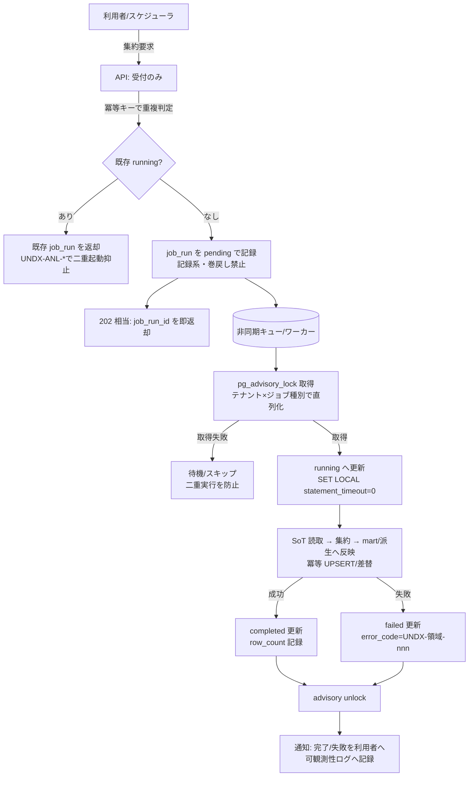
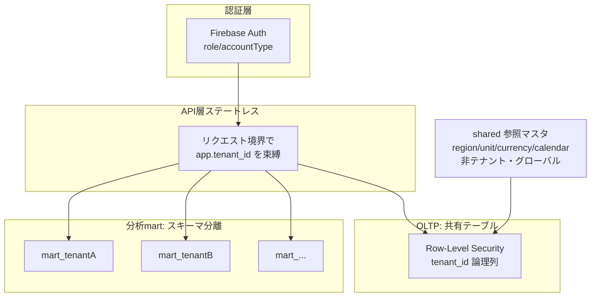
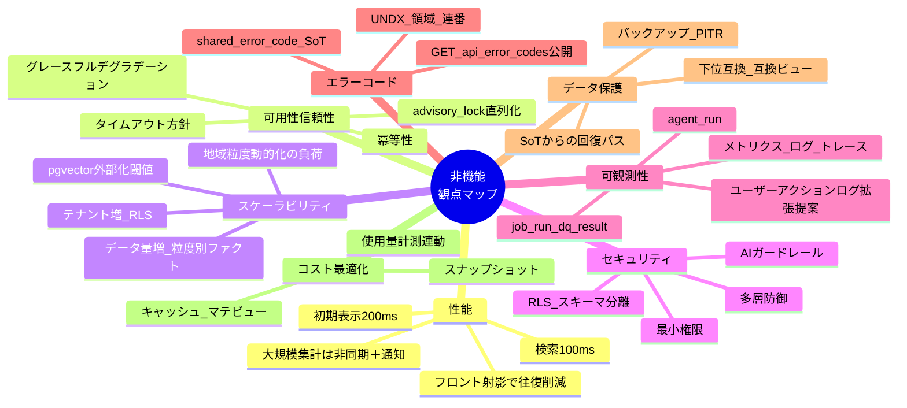

# BD-06 非機能設計 — Undeux Platform（UCP）性能・可用性・スケーラビリティ・セキュリティ概要・運用監視・エラーコード 基本設計

> **ステータス:** ドラフト（レビュー前）
> **版:** v1.0
> **最終更新:** 2026-07-04
> **関連ドキュメント:** [正準設計ブループリント v1.0]（全ドキュメント共通契約）／ [00 ビジョン・スコープ](../00-vision-scope.md) ／ [用語集](../glossary.md) ／ [意思決定ログ（ADR）](../decision-log.md) ／ [BD-01 アーキテクチャ概観](./BD-01-architecture-overview.md) ／ [BD-02 業務ドメインサービス](./BD-02-domain-services.md) ／ [BD-03 分析・AIプラットフォーム](./BD-03-analytics-ai-platform.md) ／ [BD-04 連携・データパイプライン](./BD-04-integration-data-pipeline.md) ／ [BD-05 バックオフィス](./BD-05-backoffice.md) ／ [DD-02 API・インターフェース設計](../detailed-design/DD-02-api-interface-design.md) ／ [DD-05 画面・UX・SI戦略](../detailed-design/DD-05-screen-ux-si-strategy.md) ／ [DD-06 セキュリティ・認可・テナンシー](../detailed-design/DD-06-security-authz-tenancy.md) ／ [DB-01 スキーマ戦略](../database/DB-01-schema-strategy.md) ／ [DB-05 分析スタースキーマ](../database/DB-05-analytics-star-schema.md) ／ [DB-06 マッピング/ステージング物理スキーマ](../database/DB-06-mapping-metadata-schema.md) ／ 継承元 [docs/design.md](../../design.md)・[docs/star-schema-design.md](../../star-schema-design.md)

---

本ドキュメントは Undeux Platform（略称 **UCP**、プロダクト系統コード `UNDX`）の**非機能要件の基本設計**である。性能・可用性・スケーラビリティ・セキュリティ概要・マルチテナントのリソース分離・運用監視/可観測性・エラーコード体系・データ保護/下位互換/バックアップ・コスト最適化を横断的に確定する。名称・ID・SoT・命名規約はすべて正準設計ブループリント v1.0（以下「ブループリント」）が SoT であり、本書はその範囲内で「どの水準を、どの構造で担保するか」を定める。

非機能の**全体方針の骨子**は [BD-01 §8](./BD-01-architecture-overview.md) が提示済みであり、本書がその **owner** としてこれを具体化する。セキュリティの**実装詳細**（認証フロー・RLS ポリシー・ガードレール）は [DD-06](../detailed-design/DD-06-security-authz-tenancy.md) が owner であり、本書は概要と分界のみ扱う。API の具体的なエラーメッセージ・HTTP ステータスは [DD-02](../detailed-design/DD-02-api-interface-design.md) が owner。本書は基本設計であり、確定 DDL は各 DB 設計書に委ねる。

---

## 0. 前提

本書は以下を前提とする。前提が崩れる場合は「未決事項」（§10）と ADR（[decision-log.md](../decision-log.md)）で再検討する。推測で断定しない。

- **技術スタックの前提:** ブループリント §8.5 の確定構成（フロント: Nuxt 4 / Vue 3 / TypeScript / Tailwind CSS v4 / lucide / Chart.js、バックエンド: C#（.NET 8 / ASP.NET Core）/ Npgsql / Dapper、DB: PostgreSQL 16（OLTP＋mart）＋ pgvector ＋ ドキュメントDB ＋ オブジェクトストレージ、認証: Firebase Authentication、インフラ: Firebase Hosting / AWS EC2 / AWS RDS）を初期構成とする。将来の AWS マネージド化は拡張提案として扱う。
- **SoT の前提:** 全業務 OLTP（`retail` / `maker` / `wms` / `mapping` / `backoffice` / `knowledge`）と `staging`（他社連携）が SoT、分析 `mart_{tenant_code}` は常に派生キャッシュである（ブループリント §7）。非機能設計はこの「SoT 書込が先、派生更新が後」の順序を破壊しないことを制約とする。
- **性能基準の前提:** 現行 UndeuxSales の実用速度を継承の下限とする。数値目標（§1）は本プラットフォームで新設する**設計目標値**であり、正式な SLO はローンチ前の負荷試験で確定する（§10 Q-1）。本書の値は断定ではなく設計の狙いである。
- **マルチテナント方式の前提:** OLTP は共有テーブル＋ PostgreSQL Row-Level Security（`tenant_id` 論理列）、分析 mart はスキーマ分離 `mart_{tenant_code}`（ADR-001）。接続時にセッション変数 `app.tenant_id` を設定する。
- **エラーコードの前提:** 想定エラーは `UNDX-{領域}-{連番}` で一元管理する（ブループリント §9）。SoT はコード内定義（Core の `ErrorCodes`）で、`shared.error_code` テーブルへ同期し `GET /api/error-codes` で公開する。
- **非同期処理の前提:** 大規模集約（mart の `rebuild()`、EmbeddingPipeline、他社取込ジョブ）はリクエスト応答から分離した非同期実行とする（ADR-009）。冪等・advisory lock 直列化・`SET LOCAL statement_timeout=0` を継承する。

---

## 1. 性能要件

### 1.1 応答時間の設計目標値

現行 UndeuxSales の「mart 事前計算＋生成列＋インデックス＋フロント射影」の速度特性（[BD-01 §8](./BD-01-architecture-overview.md)）を継承し、UCP としての設計目標値を次の通り置く。値はサーバ処理時間（ネットワーク往復・クライアント描画を除く、p95）を基準とする。

| 区分 | 対象 | 設計目標（p95） | 実現手段 |
|---|---|---|---|
| 初期表示 | 画面初期ロードのメインデータ取得（一覧/ダッシュボードの初期射影） | **200ms 以内** | mart 事前計算値・生成列参照、初期表示は集約済み行の読取に限定、別リソースは遅延取得（1API=1責務） |
| 検索/フィルタ | 一覧の絞込・並べ替え・ページング | **100ms 以内** | 次元キー/自然キーのインデックス、フィルタ条件の被覆索引、順位/回帰などの表示射影はフロント算出（現行継承） |
| 詳細取得 | 単一エンティティの詳細（get） | 200ms 以内（目安） | サロゲート PK 直引き、別リソース非混在 |
| 大規模集計 | mart `rebuild()`・全期間クロス集計・全社ランキング再計算 | 同期 SLA を課さない（**非同期＋通知**） | §1.3 の非同期パターンへ委譲 |

- **1API=1責務の徹底:** 初期表示 200ms を守るため、一覧 API は集約済みの表示用射影のみを返し、詳細・別リソース（画像・関連明細）を混在させない（ブループリント §8.5 API 設計原則）。集約・加工の責務をクライアントへ押し付けない一方で、**順位付け・回帰直線・散布のような表示専用の派生はフロントで算出**しサーバ往復を削減する（現行継承）。
- **金額計算の性能:** 金額は最小通貨単位の整数 `bigint` 保持（ADR-005）で、`amount` / `gross_profit` は mart で事前計算（退化的な非正規化列、ブループリント §8.2 の明示的例外）。集計時の丸め・キャストコストを回避する。

### 1.2 レスポンシブと知覚性能

UI を持つ全モジュールは PC=表／モバイル=カードを両立する（AP-9、ブループリント §8.5、詳細は [DD-05](../detailed-design/DD-05-screen-ux-si-strategy.md)）。知覚性能の観点で以下を非機能要件に含める。

- モバイルはカード型で**初期表示件数を抑え**、追加はページング/無限スクロールで遅延ロードする（200ms 目標の維持）。
- 大規模集計の待機中はスケルトン/プレースホルダを表示し、**「PC で動く」を完了としない**（AP-9）。ブロッキングな全画面ローダーは避け、部分更新でグレースフルに描画する。

### 1.3 大規模集計の非同期処理設計（既存 rebuild の一般化）

現行の mart `rebuild()`（advisory lock 直列化・`statement_timeout=0`・非同期実行）を、UCP の**全ての長時間集約の一般パターン**へ拡張する（ADR-009）。対象は mart 再構築・他社取込ジョブ（`mapping.job_run`）・EmbeddingPipeline（`knowledge.embedding` 再生成）・請求の期締め再計算などである。

原則は「**リクエストは受付のみで即応答（202 相当）、実処理は非同期ワーカー、結果は記録系テーブル＋通知で返す**」。同期リクエスト内で重い集約を完結させない。以下にフローを示す。

上図の要点は、(1) 受付と実処理の分離により初期表示・検索の応答時間予算を長時間集約が侵食しない、(2) `job_run` を先に `pending` で記録してから応答するため**進捗が SoT として追跡可能**、(3) advisory lock で同一テナント×同一ジョブ種別の二重実行を防ぎ冪等性を担保、(4) 失敗時も `error_code` を残し主要フローをブロックしない（グレースフルデグラデーション）、という 4 点である。ワーカー実行基盤の物理選定（EC2 内プロセスか SQS＋ワーカーか）は未決（§10 Q-1）。

- **冪等性:** 同一入力の再実行で mart の内容は同一に収束し、記録系（`job_run` / `import_batch` / `usage_metering`）は巻き戻らない（原則2、ADR-014）。集約は「全差替 or 冪等 UPSERT」で構成し、途中失敗しても再実行で回復する。
- **通知:** 完了/失敗はユーザーへ非同期通知（§6 の可観測性ログと連動）。同期待ちを強制しない。

---

## 2. 可用性・信頼性

### 2.1 可用性の設計方針

| 観点 | 方針 |
|---|---|
| API 層 | **ステートレス**。RLS セッション変数（`app.tenant_id`）はリクエスト境界で束縛/解放し、状態をプロセスに残さない。水平展開（EC2 複数台＋ロードバランサ）の余地を確保（[BD-01 §8](./BD-01-architecture-overview.md)）。 |
| DB 層 | AWS RDS の自動バックアップ＋ PITR（§8）。将来はリードレプリカで分析読取をオフロード（拡張提案）。 |
| フロント | Firebase Hosting の CDN 配信で静的資産を冗長化。SPA は API 障害時も**部分的にグレースフルに劣化**（取得済み範囲は表示継続）。 |
| 補助処理 | ラベル作成・Webhook 登録・通知・スナップショット生成などの補助処理の失敗は主要フローを止めない（AP-7、原則4）。致命的失敗のみ例外送出。 |

### 2.2 信頼性を支える3本柱（冪等・advisory lock・タイムアウト）

- **冪等性（idempotent）:** 取込・`rebuild()`・在庫アクションフラグ登録・請求期締めは何度実行しても記録系が巻き戻らない（原則2）。冪等 UPSERT には自然キー UNIQUE 制約（ブループリント §3 の各表）を用いる。強制リレーションには使わない（ブループリント §8.2）。
- **advisory lock による直列化:** mart `rebuild()` と長時間集約は `pg_advisory_lock` で**テナント×ジョブ種別**を直列化し、同時多重実行による不整合・ロック競合を防ぐ（ADR-009 継承）。ロック未取得時は待機/スキップし例外にしない。
- **タイムアウト方針:** 通常のオンライン API は**短いタイムアウト**（例: 数秒）で fail-fast し、応答時間予算（§1.1）を守る。一方、非同期集約ワーカー内の集約 SQL は `SET LOCAL statement_timeout=0`（無制限）でトランザクション境界内に限定して用いる（現行継承）。オンライン経路に `statement_timeout=0` を持ち込まない。外部連携（他社ソース取得・AI 推論）は接続/読取タイムアウトを設定し、超過は `UNDX-{領域}-*` で失敗記録する。

### 2.3 状態保護と回復パス

各データ領域には SoT からの回復パス（再同期）が定義されている（ブループリント §7）。非機能の観点では、**イベント受信（正常系）と手動回復（再同期）の両パスが存在すること**を必須とする（原則6）。

| 領域 | 障害時の回復 |
|---|---|
| mart（派生） | SoT（OLTP/staging）から `mart.rebuild()` で冪等再構築。TRUNCATE 影響を受ける在庫アクションフラグは public/自然キー保持で mart 非依存（ADR-014、原則2）。 |
| 他社連携 | `mapping.job_run` 再実行 → staging → mart 反映。取込履歴（`import_batch`）は追記専用で巻き戻さない。 |
| ベクター/インデックス | `EmbeddingPipeline` を SoT `knowledge.domain_document` から再実行（ADR-012）。 |
| 認証/テナント | Firebase Admin SDK で `shared.user_account` を再同期。 |

---

## 3. スケーラビリティ

### 3.1 スケール軸と対応

| スケール軸 | 増加要因 | 対応方針 |
|---|---|---|
| テナント数増 | クライアント契約の増加 | OLTP は RLS 共有テーブルで**テーブル数を増やさず**行で吸収。mart は `mart_{tenant_code}` スキーマ増設。稼働は `backoffice.service_activation` で制御。 |
| データ量増（行数） | トランザクション蓄積・履歴長期化 | 週次/日次の粒度別ファクト（`fact_sales_weekly` / `fact_sales_daily`）、`dim_date` による期間パーティション余地、集約マテビュー、古い期のスナップショット化（§9）。 |
| 同時実行増 | 利用者/ジョブ同時実行 | API ステートレス水平展開、非同期ジョブのキュー化（§1.3）、advisory lock による集約の直列化。 |
| 分析クエリ複雑化 | クロス集計/散布/回帰 | mart 事前計算＋生成列、リードレプリカ（拡張提案）、静的スナップショット配信。 |
| ベクター規模増 | 知識文書/チャンク増 | pgvector 既定、閾値超で外部ベクターストアへ切替（ADR-011、閾値は §10 Q-3）。 |

### 3.2 地域粒度動的化の負荷影響

分析軸「商品・地域・販売先」のうち**地域粒度**は、テナントの `region_granularity`（`prefecture` / `municipality`）で動的に切替える（ブループリント §3.0、ADR-003）。`shared.region` は国 > 都道府県 > 市区町村の自己参照階層（`parent_region_id`, `level`）で表現され、`dim_region` は SCD1 で mart へ射影される。

負荷の観点では、**市区町村粒度はカーディナリティが都道府県の 1〜2 桁大きく**、`fact_*` × `dim_region` の集約行数・インデックスサイズ・クロス集計の組合せ爆発が粒度に比例して増える。設計方針は次の通り。

- 粒度はテナント単位のメタデータで固定的に決まり、リクエストごとに切替えない（集約の再計算爆発を防止）。粒度変更は `rebuild()` を要する構成変更として扱う。
- 市区町村粒度テナントの mart は集約行数を見積り、必要に応じ**上位粒度（都道府県）のロールアップ・マテビュー**を併設して初期表示 200ms を維持する（拡張提案：ロールアップ次第で§9 のスナップショットと連動）。
- 横断（自社 internal）集計は粒度が混在するため、共通の上位粒度へ正規化してから集約する（経路は §10 Q-4、[BD-03](./BD-03-analytics-ai-platform.md)）。

### 3.3 スケールアウトの段階

初期は EC2＋RDS の単純構成。負荷指標（CPU/接続数/ジョブ滞留/p95 応答）が閾値を超えた段階で、(1) API 水平展開、(2) リードレプリカ、(3) 非同期ワーカーの分離（SQS＋ワーカー）、(4) AWS マネージド化（ECS/Fargate 等、拡張提案）へ段階移行する。移行トリガーは未決（§10 Q-2）。段階移行は**無停止性と互換ビュー整合**（ADR-013）を要件とする。

---

## 4. セキュリティ方針（概要）

> セキュリティの実装詳細（認証フロー・RLS ポリシー定義・ガードレール実装）は [DD-06](../detailed-design/DD-06-security-authz-tenancy.md) が owner。本節は非機能としての**方針と多層防御の全体像**のみを扱う。

### 4.1 多層防御（AP-6）

| 層 | 手段 | 責務 |
|---|---|---|
| 認証 | Firebase Authentication（ID トークン=JWT、カスタムクレーム `role` / `accountType`） | 本人性の確認。参照系は認証必須。 |
| 認可 | カスタムクレーム（`role` / `accountType`）＋ API のロール制限 | 更新系はロールクレーム限定。1API=1責務で権限境界を明確化。 |
| テナント分離 | OLTP: PostgreSQL RLS（`tenant_id` 論理列、`app.tenant_id`）／ mart: スキーマ分離 `mart_{tenant_code}`（ADR-001） | 越境参照/更新の遮断（`UNDX-TENANT-*`）。 |
| AI ガードレール | `Guardrail`（PII/テナント境界/根拠必須、ブループリント §6、ADR-010） | AI 出力の安全境界。実行系書込はガードレール越しのみ。 |
| 配信 | セキュリティヘッダ（`X-Frame-Options` / `X-Content-Type-Options` / `Referrer-Policy` / `Strict-Transport-Security`、現行継承）＋ HTTPS | クリックジャッキング/MIME スニッフィング対策。 |

### 4.2 非機能としてのセキュリティ要件

- **テナント境界侵害はグレースフルに拒否**し、`UNDX-TENANT-*` を付与（主要フローの他テナントへ波及させない）。
- **監査可能性:** ユーザーアクション・ジョブ・エージェント実行を記録系として保持（§6）。AI 出力は出典必須（ADR-010）。
- **最小権限:** AWS IAM・RDS 接続・オブジェクトストレージのアクセスは最小権限。RLS セッションはリクエスト境界で束縛/解放し、接続プール返却時のリセットを保証する（§10 Q-5）。
- **秘匿情報:** Firebase 秘密鍵・DB 認証情報・API キーは環境変数/シークレットストアで管理し、コード/ログに残さない。

---

## 5. マルチテナント時のリソース分離とキャパシティ

### 5.1 分離方式（確定・ブループリント §8.3）

上図の通り、OLTP は 1 セットの共有テーブルを RLS（`tenant_id`）で論理分離し、分析 mart は物理スキーマ `mart_{tenant_code}` で分離する。`shared` の静的参照マスタ（region/unit/currency/calendar_date）は非テナントのグローバル資源、`product`/`sku`/`trading_partner` はテナント所有である（ブループリント §8.3）。この非対称性の狙いは、OLTP は運用コスト（テーブル爆発回避）、mart は継承資産と分析分離（大規模集約の隔離）の両立である（ADR-001）。

### 5.2 リソース分離とキャパシティ管理

| リソース | 分離/上限の考え方 |
|---|---|
| DB 接続 | 接続プール共有。RLS セッションはリクエスト境界で束縛/解放（プール返却時リセット保証、§10 Q-5）。テナント多数時の接続効率は要検討。 |
| 集約ジョブ | テナント×ジョブ種別で advisory lock 直列化。1 テナントの重い `rebuild()` が他テナントのオンライン応答を枯渇させない（ワーカー分離で隔離、§1.3）。 |
| ストレージ | mart スキーマ分離で容量をテナント別に可視化。オブジェクトストレージ（画像/帳票/スナップショット）はテナント別プレフィックスで区画化。 |
| 計測/課金連動 | `backoffice.usage_metering`（記録系・巻戻し禁止）で API 呼数・ジョブ実行・ストレージ量を計測し、キャパシティとコスト（§9）へ接続（[BD-05](./BD-05-backoffice.md)）。 |
| ノイジーネイバー抑止 | 稼働設定（`backoffice.service_activation`）でモジュール/機能単位の有効化・レート方針を制御（拡張提案：テナント別レートリミット）。 |

- **公平性:** 大規模テナント（市区町村粒度・多店舗）の負荷が小規模テナントの応答を劣化させないよう、非同期ジョブの隔離・優先度制御を設計目標とする。具体のレートリミット/クォータは拡張提案。

---

## 6. 運用監視・可観測性

### 6.1 3本の柱（メトリクス/ログ/トレース）＋ 記録系テーブル

UCP の可観測性は、汎用の APM（メトリクス/ログ/分散トレース）に加え、**業務・ジョブの記録系テーブルを一次可観測データとして活用**する点が特徴である（ブループリント §7、[BD-01 §8](./BD-01-architecture-overview.md)）。

| 種別 | 対象 | 実体/保持先 |
|---|---|---|
| メトリクス | p95 応答時間、ジョブ滞留数、DB 接続数、エラー率（`UNDX-*` 別）、mart 鮮度（最終 rebuild 時刻） | APM/監視（初期は基本メトリクス、拡張提案で強化） |
| ログ（アプリ） | リクエスト/エラー（`error_code` 付与）、補助処理の劣化 | 構造化ログ（`tenant_id` / `error_code` を必須フィールド化） |
| ジョブ実行記録 | 取込・集約・請求ジョブ | `mapping.job_run`（status/started_at/finished_at/row_count/error_code、記録系・巻戻し禁止） |
| データ品質記録 | 取込データの検証結果 | `mapping.data_quality_result`（passed/violation_count/sample、記録系） |
| エージェント実行記録 | AI エージェント実行 | `knowledge.agent_run` / `agent_message`（記録系） |
| 利用計測 | API/ジョブ/ストレージ使用量 | `backoffice.usage_metering`（記録系・巻戻し禁止） |

### 6.2 ユーザーアクションログ（拡張提案）

現行にない要素として、監査・行動分析・課金根拠のために**ユーザーアクションログ**の導入を拡張提案する。ブループリントに定義がないため新規要素であることを明記する。

- 位置づけ: **記録系（追記専用・巻戻し禁止）**、`tenant_id` を必須列とし RLS で分離。SoT はこのログ自身（派生ではない）。
- 内容: 誰が（`user_id`）・いつ・どのテナントで・どの操作（更新系/エクスポート/AI 問合せ等）を行ったか。PII は最小化しガードレール方針（ADR-010）に従う。
- 用途: セキュリティ監査（越境試行 `UNDX-TENANT-*` の追跡）、利用計測（`usage_metering` の裏付け）、UX 改善。
- 物理配置候補: 高頻度・スキーマ柔軟のためドキュメントDB（§10 Q-6）またはオブジェクトストレージへの追記ログ。確定は DD-06 と調整。

### 6.3 監視の観点マップ

非機能の観点と可観測性の対応を俯瞰する。

上のマインドマップは、本書の各節（§1〜§9）を非機能の 8 観点に整理したものである。各観点は独立ではなく、たとえば「非同期集約（性能）」は「advisory lock（可用性）」「job_run（可観測性）」「UNDX-ANL（エラーコード）」と連動する。図はテキストの補完であり、詳細は各節を参照する。

---

## 7. エラーコード体系（UNDX-{領域} 一元管理）

### 7.1 形式と SoT

- **形式:** `UNDX-{領域}-{連番}`（例 `UNDX-ANL-001`）。連番は領域内 001 から採番（ブループリント §9）。
- **SoT:** コード内定義（Core の `ErrorCodes`）が SoT。`shared.error_code`（`code` / `domain` / `message` / `http_status`）テーブルへ同期し、`GET /api/error-codes` で公開する（現行継承、[DD-02](../detailed-design/DD-02-api-interface-design.md) が API owner）。SoT はコード側であり、テーブルは配布用キャッシュである（SoT→キャッシュの順序を厳守）。
- **一貫性:** 想定エラーには必ずコードを付与。補助処理の失敗はグレースフルに扱い主要フローを止めない（AP-7）。致命的失敗のみ例外送出。

### 7.2 領域割当（ブループリント §9 と本書での主関係）

| 領域コード | 意味 | 継承/新規 | 本書での主な関係箇所 |
|---|---|---|---|
| `AUTH` | 認証 | 継承 | §4（JWT 検証） |
| `REQ` | リクエスト検証 | 継承 | §1（入力検証で fail-fast） |
| `IMP` | 取込処理 | 継承 | §1.3 / §6（取込ジョブ） |
| `DATA` | データ層（未登録/未存在含む） | 継承 | 全体 |
| `SYS` | 想定外システムエラー | 継承 | 全体（致命的失敗） |
| `TENANT` | テナント境界/RLS/権限スコープ | 新規 | §4 / §5（越境拒否） |
| `MAP` | マッピング/変換（DataBridge） | 新規 | §1.3 / §6（変換ジョブ） |
| `DQ` | データ品質検証 | 新規 | §6（`data_quality_result`） |
| `RTL` | クロスリテーラー業務 | 新規 | §2（業務更新） |
| `MKR` | メーカー業務 | 新規 | §2（業務更新） |
| `WMS` | 倉庫業務 | 新規 | §2 / §9（荷主請求） |
| `ANL` | 分析/mart（rebuild・集計） | 新規 | §1.3 / §2（`rebuild` 二重起動抑止・タイムアウト） |
| `AI` | AI/RAG/エージェント/ガードレール | 新規 | §4（ガードレール） |
| `BILL` | 契約/稼働/請求（BackOffice/荷主請求） | 新規 | §5 / §9（計測・期締め） |

- **非同期ジョブのエラー返却:** 非同期集約（§1.3）は同期例外ではなく `job_run.error_code` へ `UNDX-{領域}-*` を記録し、通知でユーザーへ返す（グレースフルデグラデーション）。オンライン API は HTTP ステータス＋コードで返す。
- **HTTP ステータス対応:** `http_status` は `shared.error_code` に保持し、`AUTH`=401、`TENANT`=403、`DATA`=404、`REQ`/`DQ`=400/422、`SYS`=500 等を目安とする（正式割当は [DD-02](../detailed-design/DD-02-api-interface-design.md) owner）。

---

## 8. データ保護・下位互換・バックアップ/リストア

### 8.1 下位互換とデータ保護（原則7）

- **I/F 変更は互換ビューで段階移行**し、旧 API 契約を維持する（ADR-013、AP-8）。フロント無改修でのロールバック容易性を継承する。
- 既存データに影響する変更は**影響評価＋データ更新パッチ**を生成し、変更内容と操作手順をオペレーターへ説明する（原則7）。「壊れない」だけでなく「既存の利用者が困らない」ことを確認する。
- **スキーマ変更時の必須確認:** 新データストア書込の SoT 判定、外部連携のイベント受信＋手動回復パスの両立、イベントトリガーの冪等性、新エンティティの型定義/アクセス制御/SoT 宣言の同時更新（原則6）。

### 8.2 バックアップ/リストア

| 対象 | バックアップ | リストア/回復 |
|---|---|---|
| OLTP（SoT） | AWS RDS 自動バックアップ＋ PITR（Point-In-Time Recovery） | RDS スナップショット/PITR で復元。**SoT を復元すれば mart は `rebuild()` で再生成可能**なため、SoT の保護を最優先とする。 |
| 分析 mart（派生） | 原則バックアップ不要（SoT から再構築可） | `mart.rebuild()`（冪等）。バックアップより再構築が一次回復パス。 |
| 他社連携 staging（SoT） | RDS バックアップに含む（`raw_record` / `import_batch` は他社連携の SoT） | 取込再実行より復元を優先（他社データは再取得困難な場合がある）。 |
| ベクター/インデックス（派生） | 再生成前提でバックアップ任意 | `EmbeddingPipeline` を `domain_document` から再実行（ADR-012）。 |
| オブジェクトストレージ | バージョニング/レプリケーション（画像・帳票・スナップショット） | ストレージ側の復元。帳票（`wms.shipping_document`）は再レンダリング可否を区別。 |
| 在庫アクションフラグ（ユーザー判断） | RDS バックアップに含む（public/自然キー保持） | mart 再構築の影響を受けない（ADR-014、原則2）。SoT から復元不能な人的判断のため保護対象。 |

- **原則:** 「派生は再構築、SoT は復元」。SoT から復元できないデータ（人的判断＝在庫アクションフラグ、他社取込の生データ）は明示的に保護対象として文書化する（原則6）。
- **冪等リストアの検証:** リストア後は `rebuild()` の冪等性で mart 整合を回復し、記録系（`job_run` / `usage_metering`）が巻き戻らないことを確認する（原則2）。

---

## 9. コスト最適化

コストとパフォーマンスはトレードオフであり、UCP は**「事前計算・キャッシュ・スナップショットで読取を安くし、書込/再計算を非同期に寄せる」**方針でバランスを取る（ブループリント 共有コンテキスト「スナップショット活用」）。

| 手段 | 内容 | コスト効果 |
|---|---|---|
| mart 事前計算＋生成列 | `amount`/`gross_profit` 等を事前計算し集約 SQL を軽量化 | 読取 CPU 削減。オンライン応答予算（§1）を安く維持。 |
| 集約マテビュー | 高頻度クロス集計/ランキングを REFRESH 型で保持 | 毎回の全走査を回避。REFRESH は非同期（§1.3）。 |
| 静的スナップショット | 変化の遅い集計・レポートをオブジェクトストレージへ静的ファイル化（`knowledge.snapshot_manifest` で版管理） | DB 負荷/接続を配信から切り離し、CDN 配信で安価にスケール。 |
| ドキュメントDB 活用 | 柔軟文書・スナップショット・高頻度ログの受け皿 | RDS の書込/容量圧を分散（製品選定は §10 Q-6）。 |
| 古い期のロールアップ | 期間経過データを上位粒度へ集約し明細を退避 | ストレージ/インデックスコスト削減。 |
| pgvector 既定・外部化は閾値超のみ | 初期は pgvector で構成簡素化、規模で外部ストア（ADR-011） | 初期コスト最小化とスケール余地の両立。 |
| 使用量計測連動 | `usage_metering`（記録系）でテナント別コストを可視化 | 課金（[BD-05](./BD-05-backoffice.md)）とキャパシティ計画の根拠。 |
| インフラ段階拡張 | 初期 EC2/RDS、負荷でマネージド化（拡張提案） | 需要に応じた段階投資（過剰プロビジョニング回避）。 |

- **スナップショット/キャッシュの整合:** スナップショット・マテビュー・mart はすべて**派生キャッシュ**であり SoT ではない。再生成で常に SoT へ収束させ、鮮度（最終生成時刻）を可観測性（§6）で監視する。SoT→キャッシュの順序を破らない。

---

## 10. 未決事項

以下は本書時点で未確定。ADR（[decision-log.md](../decision-log.md)）で決定し、確定後に本書へ反映する。推測で断定しない。

| # | 未決事項 | 論点 | 一次検討先 |
|---|---|---|---|
| Q-1 | 性能 SLO の正式値 | 200ms/100ms は設計目標。正式 SLO（p95/p99・対象範囲・除外条件）を負荷試験で確定 | BD-06 / DD-05 |
| Q-2 | 非同期ジョブ実行基盤とスケール移行トリガー | 初期は EC2 内プロセスか、早期に SQS＋ワーカー（拡張提案）か。EC2→ECS/Fargate 移行の負荷/運用指標と無停止性 | BD-06 / BD-04 |
| Q-3 | ベクターストア外部化の閾値 | pgvector から外部へ切替える規模・レイテンシ基準（ADR-011） | BD-03 / DD-04 |
| Q-4 | 自社横断集計の物理経路 | テナント別 mart を跨ぐ集計を専用集約スキーマに再ロールアップするか横断クエリか。地域粒度混在の正規化 | BD-03 / DD-06 |
| Q-5 | 接続プールと RLS セッション束縛 | プール返却時のセッション変数リセット保証、テナント別 `search_path` 切替のプール戦略（多テナント時の接続効率） | DD-06 / BD-06 |
| Q-6 | ドキュメントDB 製品選定 | ユーザーアクションログ/スナップショット/柔軟文書の受け皿（DynamoDB / Firestore / MongoDB 系）。アクセスパターン・整合性・コスト | BD-03 / DB-08 |
| Q-7 | ユーザーアクションログの正式仕様 | 本書で拡張提案した記録系ログのスキーマ・保持期間・PII 最小化・課金/監査連携の確定 | DD-06 / BD-05 |
| Q-8 | テナント別レートリミット/クォータ | ノイジーネイバー抑止の具体（レート/優先度/クォータ）と稼働設定連動 | BD-06 / BD-05 |
| Q-9 | 市区町村粒度テナントのロールアップ設計 | 地域粒度動的化に伴う上位粒度マテビュー/スナップショット併設の要否と自動化 | BD-03 / DB-05 |

---

> **本書の位置づけ（相互参照）:** 本書はブループリント §8/§9 と [BD-01 §8](./BD-01-architecture-overview.md) の非機能全体方針を owner として具体化した基本設計である。セキュリティ実装は [DD-06](../detailed-design/DD-06-security-authz-tenancy.md)、API エラー契約は [DD-02](../detailed-design/DD-02-api-interface-design.md)、mart 物理と rebuild は [DB-05](../database/DB-05-analytics-star-schema.md)、取込/DQ 物理は [DB-06](../database/DB-06-mapping-metadata-schema.md) が引き継ぐ。名称・SoT・命名規約・エラーコード領域はすべてブループリント v1.0 を不変の SoT とする。
