# DB-01 スキーマ戦略総論 — Undeux Platform（UCP）データベース設計

> **ステータス:** ドラフト（レビュー前）
> **版:** v1.0
> **最終更新:** 2026-07-04
> **関連ドキュメント:** [正準設計ブループリント v1.0]（全ドキュメント共通契約）／ [00 ビジョン・スコープ](../00-vision-scope.md) ／ [用語集](../glossary.md) ／ [意思決定ログ（ADR）](../decision-log.md) ／ [DD-01 正準データモデル](../detailed-design/DD-01-canonical-data-model.md) ／ [DD-06 セキュリティ・認可・テナンシー](../detailed-design/DD-06-security-authz-tenancy.md) ／ [DB-02 retail 物理スキーマ](./DB-02-operational-schema-retail.md) ／ [DB-03 maker 物理スキーマ](./DB-03-operational-schema-maker.md) ／ [DB-04 wms 物理スキーマ](./DB-04-operational-schema-wms.md) ／ [DB-05 分析スタースキーマ](./DB-05-analytics-star-schema.md) ／ [DB-06 マッピングメタデータスキーマ](./DB-06-mapping-metadata-schema.md) ／ [DB-07 backoffice スキーマ](./DB-07-backoffice-schema.md) ／ [DB-08 knowledge/ベクター/スナップショットスキーマ](./DB-08-knowledge-vector-snapshot-schema.md) ／ 継承元: [現行アプリ設計](../../design.md)・[分析mart設計](../../star-schema-design.md)

---

本ドキュメントは Undeux Platform（略称 **UCP**、プロダクト系統コード `UNDX`）のデータベース設計群（DB-01〜08）の**総則**である。多層データストアの分類、スキーマ一覧と責務、命名規約、キー設計、マルチテナント物理配置、型方針、拡張方針、マイグレーション運用、SoT とキャッシュの書込順序を確定し、後続の物理スキーマ設計書（DB-02〜08）が共有する規約を定める。

名称・ID・SoT・命名規約はすべて **正準設計ブループリント v1.0** が SoT であり、本書はブループリント §3（正準エンティティカタログ）・§4（分析モデル）・§7（SoT 宣言マップ）・§8（命名規約・キー設計・マルチテナント方式・型方針）を DB 物理設計の観点から総則化する。本書とブループリントに矛盾がある場合はブループリントを優先する。ブループリントに無い要素を補う場合は「**（拡張提案）**」と明記する。

---

## 0. 本書の位置づけと前提

### 0.1 本書が定義するもの（他 DB 設計書への総則）

| 本書が確定する事項 | 参照する後続ドキュメント |
|---|---|
| データストア分類・役割分担（§1） | DB-05（mart）・DB-08（vector/snapshot） |
| スキーマ一覧と責務（§2） | DB-02〜08 各物理スキーマ |
| 命名規約・キー設計（§3, §4） | DB-02〜08 全テーブル DDL |
| マルチテナント物理配置・RLS・search_path（§5） | [DD-06](../detailed-design/DD-06-security-authz-tenancy.md) |
| 型方針（金額/数量/日付/列挙）（§6） | DB-02〜08 全カラム型 |
| 拡張方針（jsonb + 生成列 + 索引）（§7） | DB-02〜05 |
| マイグレーション運用（§8） | DB-02〜08 の変更手順 |
| SoT → キャッシュ書込順序（§9） | DB-05（rebuild）・DB-06（取込） |

### 0.2 前提

- 対象 RDBMS は **PostgreSQL 16**（OLTP＋mart を同一クラスタ内スキーマで運用）。加えてベクターストア（pgvector 既定）・ドキュメントDB（スナップショット/柔軟文書）・オブジェクトストレージ（静的ファイル/画像/帳票）を用途別に併用する（ブループリント §8.5）。
- 継承元 [docs/design.md](../../design.md)・[docs/star-schema-design.md](../../star-schema-design.md) の設計思想（SoT→mart 派生・汎用バリアント2軸・SCD1・jsonb+生成列・企業集約次元・互換ビュー段階移行・冪等 rebuild）を継承・一般化する。
- 記述言語は日本語、テーブル名・カラム名・型名・コード識別子は英数字 snake_case。
- 想定エラーは `UNDX-{領域}-{連番}` 形式で一元管理する（ブループリント §9）。DB 総則に関係する主要領域は `TENANT`（テナント境界/RLS）・`DATA`（データ層）・`SYS`（想定外）・`ANL`（mart rebuild）・`MAP`/`DQ`（取込/品質）である。

---

## 1. データストア分類と役割

UCP は単一の RDBMS に閉じず、データの性質（構造・アクセスパターン・更新頻度・SoT 性）に応じて **多層データストア** を用途別に使い分ける。各層の SoT/派生の区分を明確にし、派生層は SoT から常に再構築可能に保つ。

| 層 | 実体 | 主な内容 | SoT/派生 | 回復パス |
|---|---|---|---|---|
| **OLTP（業務トランザクション）** | PostgreSQL 16 用途別スキーマ（`retail`/`maker`/`wms`/`mapping`/`backoffice`/`knowledge` の記録系） | 商品/取引/在庫/発注/契約等の業務データ | **SoT**（自社業務） | アプリ経由の再入力・監査ログ |
| **ステージング（連携着地）** | PostgreSQL `staging` スキーマ | 他社連携データの生レコード・取込バッチ | **SoT**（他社連携） | ジョブ再実行（`mapping.job_run`） |
| **分析 mart** | PostgreSQL `mart_{tenant_code}` スキーマ | コンフォームド次元/ファクト・集約マテビュー | **派生キャッシュ** | `mart.rebuild()`（冪等） |
| **ベクターストア** | pgvector（既定）／規模により外部ベクターストア | `knowledge.embedding`（意味ベクトル） | **派生**（再生成可） | `EmbeddingPipeline` 再実行 |
| **ドキュメントDB** | 外部 DocDB（スナップショット/柔軟文書） | 静的スナップショット・非定型ドキュメント | **派生**（`snapshot_manifest` が索引） | スナップショット再生成 |
| **オブジェクトストレージ** | S3 等 | 画像/帳票/静的ファイル/知識原本 | **原本 or 派生**（用途別） | 業務による再アップロード or 再生成 |

各データ領域の SoT・派生・回復パスの完全な対応はブループリント §7「SoT 宣言マップ」を SoT とする。本書はその物理配置を確定する。

```mermaid
flowchart LR
    subgraph SOT["SoT 層（正規の出所）"]
        OLTP[("OLTP<br/>retail/maker/wms/<br/>mapping/backoffice/knowledge")]
        STG[("staging<br/>他社連携着地")]
        DOC[("knowledge.domain_document<br/>知識原本")]
    end
    subgraph DERIV["派生キャッシュ層"]
        MART[("mart_&#123;tenant_code&#125;<br/>次元/ファクト")]
        VEC[("ベクターストア<br/>embedding")]
        SNAP[("DocDB/オブジェクト<br/>スナップショット")]
    end
    OLTP -->|rebuild| MART
    STG -->|変換適用→rebuild| MART
    MART -->|集約| SNAP
    DOC -->|EmbeddingPipeline| VEC
    DOC -->|チャンク化| SNAP
```



上図は SoT 層（OLTP・staging・知識原本）から派生キャッシュ層（mart・ベクター・スナップショット）への一方向のデータフローを示す。派生層はいずれも SoT からの再構築で回復でき、書込は必ず SoT→派生の順で行う（§9）。図は本文の補完であり、各層の具体的責務は以降の各節が定義する。

---

## 2. スキーマ一覧と責務

物理スキーマは snake_case で命名し、業務ドメイン・連携・分析・知識を明確に分離する。すべてブループリント §3・§8.1 で確定した名称であり、本書で別名を新設しない。

| 物理スキーマ | 対応モジュール | 責務 | テナント方式 | 主な参照 DB 設計書 |
|---|---|---|---|---|
| `shared` | MOD-SHARED SharedCore | 共通参照マスタ（tenant/user/partner/product/sku/region/channel/store/calendar/unit/currency/error_code） | RLS（テナント所有）＋グローバル（静的マスタ） | 本書・[DD-01](../detailed-design/DD-01-canonical-data-model.md) |
| `retail` | MOD-RETAIL CrossRetail | 小売の商品マスタ＋売上/在庫/発注トランザクション | RLS | [DB-02](./DB-02-operational-schema-retail.md) |
| `maker` | MOD-MAKER MakerOps | メーカーの商品マスタ＋生産/発注/納品/売上/在庫 | RLS | [DB-03](./DB-03-operational-schema-maker.md) |
| `wms` | MOD-WMS WareFlow | SKUマスタ＋入出庫/在庫/出荷帳票/荷主請求 | RLS | [DB-04](./DB-04-operational-schema-wms.md) |
| `mapping` | MOD-INTEGRATION DataBridge | ソース登録/フィールドマッピング/変換ルール/ジョブ/データ品質 | RLS | [DB-06](./DB-06-mapping-metadata-schema.md) |
| `staging` | MOD-INTEGRATION DataBridge | 他社連携データの生着地層（SoT）・取込バッチ | RLS | [DB-06](./DB-06-mapping-metadata-schema.md) |
| `backoffice` | MOD-BACKOFFICE BackOffice | 契約/稼働設定/使用量計測/請求 | RLS | [DB-07](./DB-07-backoffice-schema.md) |
| `knowledge` | MOD-KNOWLEDGE KnowledgeCore | ドメイン知識/チャンク/ベクター/分類/インサイト/エージェント | RLS（tenant所有）＋グローバル（industry知識） | [DB-08](./DB-08-knowledge-vector-snapshot-schema.md) |
| `mart_{tenant_code}` | MOD-ANALYTICS InsightMart | コンフォームド次元/ファクト（テナント別スキーマ分離） | スキーマ分離 | [DB-05](./DB-05-analytics-star-schema.md) |

> **注:** ブループリント §3 の物理スキーマ命名では `staging` を独立スキーマとして列挙している。本書もこれに従い `mapping`（メタデータ・設定/記録系）と `staging`（連携データ着地・SoT）を物理的に分離する。両者は MOD-INTEGRATION が束ね、DB-06 が物理設計を担う。

```mermaid
graph TD
    SHARED["shared<br/>共通参照マスタ"]
    RETAIL["retail<br/>小売OLTP"]
    MAKER["maker<br/>メーカーOLTP"]
    WMS["wms<br/>倉庫OLTP"]
    MAPPING["mapping<br/>連携メタデータ"]
    STAGING["staging<br/>連携着地(SoT)"]
    BACKOFFICE["backoffice<br/>契約/請求"]
    KNOWLEDGE["knowledge<br/>知識/AI"]
    MART["mart_&#123;tenant_code&#125;<br/>分析(派生)"]

    SHARED --> RETAIL
    SHARED --> MAKER
    SHARED --> WMS
    SHARED --> MAPPING
    SHARED --> STAGING
    SHARED --> BACKOFFICE
    SHARED --> KNOWLEDGE
    RETAIL --> MAPPING
    MAKER --> MAPPING
    WMS --> MAPPING
    STAGING --> MAPPING
    MAPPING --> MART
    RETAIL -.SoT→派生.-> MART
    MAKER -.SoT→派生.-> MART
    WMS -.SoT→派生.-> MART
    MART --> KNOWLEDGE
    MART --> BACKOFFICE
```



上図はスキーマ間の依存/参照関係を示す。`shared` は最下層の共通基盤で全スキーマが FK 参照する。業務 OLTP（`retail`/`maker`/`wms`）と `staging` は `mapping` の変換を経て `mart_{tenant_code}` へ派生する。`mart` は `knowledge`（AI/RAG の集計対象）と `backoffice`（使用量計測・請求根拠）へ供給される。実線は構造依存（FK/参照）、点線は SoT→派生のデータフローである。図は依存関係の俯瞰であり、各スキーマ内のテーブル定義は各 DB 設計書が担う。

---

## 3. 命名規約

物理オブジェクトの命名はブループリント §8.1 を SoT とし、本書で DB 物理レベルの詳細規約を定める。命名は一貫性・予測可能性・マイグレーション自動化の容易さを目的とする。

### 3.1 命名規約一覧

| 対象 | 規約 | 例 |
|---|---|---|
| スキーマ | snake_case・ドメイン単位 | `retail`, `mart_shimamura` |
| テーブル（OLTP） | snake_case・単数形・業務名詞 | `retail.sales_transaction` |
| テーブル（分析次元） | `dim_` 接頭辞 | `dim_product`, `dim_region` |
| テーブル（分析ファクト） | `fact_` 接頭辞 | `fact_sales_weekly` |
| カラム | snake_case | `total_amount`, `as_of_date` |
| サロゲートPK（OLTP） | `{entity}_id`（bigint） | `sales_transaction_id` |
| サロゲートPK（分析） | `{entity}_key`（bigint） | `product_key` |
| 外部キー列 | 参照先PK名を踏襲 | `product_sku_id`, `region_id` |
| 自然キー UNIQUE制約 | `uq_{table}_{cols}` | `uq_sales_transaction_txn_no` |
| 主キー制約 | `pk_{table}` | `pk_sales_transaction` |
| 外部キー制約 | `fk_{table}_{ref}` | `fk_sales_line_transaction` |
| CHECK制約 | `ck_{table}_{rule}` | `ck_sku_list_price_nonneg` |
| 通常インデックス | `ix_{table}_{cols}` | `ix_sales_transaction_txn_date` |
| 部分インデックス | `ix_{table}_{cols}_partial` | `ix_product_active_partial` |
| GINインデックス（jsonb） | `gin_{table}_{col}` | `gin_product_attributes` |
| 生成列 | 意味を表す名詞 | `season`（product） |
| ビュー（互換） | `v_{legacy_name}` | `v_sales_weekly` |
| マテビュー | `mv_{purpose}` | `mv_sales_weekly_by_region` |

### 3.2 命名の原則

- **予約語回避:** PostgreSQL 予約語（`user`, `order` 等）はテーブル/カラム名に用いない。業務上「order」が必要な場合は `purchase_order` / `sales_order` のように用途を接頭する（ブループリントも `purchase_order` 等で統一済み）。
- **業態依存語の排除:** コアスキーマの列名は業種非依存語を用い、業種固有属性は `attributes jsonb` へ寄せる（§7）。
- **列挙のコード化:** 区分値は `*_type` / `*_code` / `*_cd` で表し、値は英小文字スネークまたは業務コード文字列で保持する（§6.4）。
- **監査列の統一:** 全業務テーブルに `created_at` / `updated_at`（`timestamptz`）・`created_by` / `updated_by`（`user_id` 参照）を持つ。カタログ表では省略表記だが物理では必須（ブループリント §3 冒頭）。

---

## 4. キー設計

キー設計はブループリント §8.2 を SoT とする。**サロゲートキーをリレーションの唯一の手段**とし、自然キー・複合キーは制約と冪等 UPSERT のためだけに用いる。

### 4.1 キー設計の原則

1. **サロゲートPK:** 全テーブルに意味を持たない `bigint` サロゲート PK を持つ。OLTP は `{entity}_id`、分析は `{entity}_key`。採番は `GENERATED ALWAYS AS IDENTITY`（OLTP）を既定とし、分析サロゲートは rebuild 時にビルド側で採番する。
2. **リレーションはサロゲートFKのみ:** 外部キーは常に参照先のサロゲート PK を指す。自然キー・業務コードを FK に用いない（業務コードは可変・重複リスクがあり結合を不安定にするため）。
3. **自然キーは UNIQUE 制約に限定:** 業務上の識別子（`txn_no`, `product_code` 等）は `UNIQUE` 制約で一意性を保証するが、リレーションには使わない。多くは `(tenant_id, 業務コード)` の複合 UNIQUE となる。
4. **複合キーで強い制約を作らない:** 複合キーは UNIQUE 制約と冪等 UPSERT（`ON CONFLICT`）の対象としてのみ用い、複合 PK・複合 FK による強制リレーションは作らない。これによりスキーマ進化時の破壊的変更を避ける。
5. **外部システムID の相互参照（xref）:** 他社連携で外部システムの識別子を保持する必要がある場合、業務テーブルの自然キーに混ぜず、`staging.raw_record.payload jsonb` に原本を保持し、正準側では `mapping.field_mapping` を介して正準キーへ解決する。外部IDと正準IDの対応が恒久的に必要な場合は **xref テーブル**（`{schema}.{entity}_xref`：`{entity}_id`＋`source_system_id`＋`external_id` の UNIQUE、**拡張提案**）を設け、業務テーブル本体を汚さない。

### 4.2 自然キーの xref 分離パターン（`mapping.entity_xref`）

外部システムIDを業務テーブルに直接列追加すると、複数ソース連携時に列が増殖しスキーマが不安定化する。これを避けるため、正準エンティティと外部IDの対応は専用 xref テーブル **`mapping.entity_xref`** へ外出しする（外部連携＝`mapping` スキーマの責務。R6 一本化。旧称 `shared.entity_xref` は用いない）。

> **物理定義の正（R6）:** `mapping.entity_xref` の**正規の列・自然キー・索引・RLS の権威は [DB-06 §3.5](./DB-06-mapping-metadata-schema.md)** とする。本節の DDL は戦略総論としての**パターン例**であり（キー設計の考え方を示すもの）、列名・自然キーの確定版は DB-06 §3.5 に従う。[DD-01 §9.2](../detailed-design/DD-01-canonical-data-model.md) も本テーブルを概念参照する。

```sql
-- パターン例（正規の列・自然キーは DB-06 §3.5）: 外部システムID相互参照テーブル
CREATE TABLE mapping.entity_xref (
    entity_xref_id    bigint GENERATED ALWAYS AS IDENTITY,
    tenant_id         bigint NOT NULL,
    target_schema     text   NOT NULL,   -- 例: 'shared'
    target_table      text   NOT NULL,   -- 例: 'sku'
    target_id         bigint NOT NULL,   -- 正準サロゲートPK
    source_system_id  bigint NOT NULL,   -- mapping.source_system
    external_id       text   NOT NULL,   -- 外部システムの識別子（原本）
    created_at        timestamptz NOT NULL DEFAULT now(),
    updated_at        timestamptz NOT NULL DEFAULT now(),
    CONSTRAINT pk_entity_xref PRIMARY KEY (entity_xref_id),
    CONSTRAINT fk_entity_xref_source
        FOREIGN KEY (source_system_id) REFERENCES mapping.source_system (source_system_id),
    -- 同一ソース内で外部IDは一意。正準IDへの多対一を許容
    CONSTRAINT uq_entity_xref_source_external
        UNIQUE (source_system_id, target_schema, target_table, external_id)
);
```

xref は「外部ID → 正準ID」の解決に用い、`external_id` は `UNIQUE` で冪等取込を担保する。正準側の結合は常に `target_id`（サロゲート）で行う。

---

## 5. マルチテナント物理配置

テナント方式はブループリント §8.3・ADR-001 を SoT とし、**OLTP=RLS＋論理列 / mart=スキーマ分離** のハイブリッドを採る。詳細な認可設計は [DD-06](../detailed-design/DD-06-security-authz-tenancy.md) が担う。本書は物理配置と接続時運用を確定する。

### 5.1 テナントの定義と分離単位

- テナント＝契約クライアント組織（`shared.tenant`）。`account_type ∈ {retailer, maker, warehouse, internal}`。
- OLTP は全業務テーブルに論理列 `tenant_id`（bigint、`shared.tenant` を参照）を持ち、行単位で分離する。
- mart は `shared.tenant.mart_schema`（＝`mart_{tenant_code}`）で示す**テナント専用スキーマ**に物理分離する（継承: メーカー単位スキーマ分離の一般化）。

### 5.2 RLS とスキーマ分離の使い分け

| 判断軸 | OLTP → RLS＋論理列 | mart → スキーマ分離 |
|---|---|---|
| 更新頻度 | 高（トランザクション） | 低（rebuild でバッチ再構築） |
| 運用コスト | 1スキーマで DDL 一元管理 | テナント数だけスキーマ複製 |
| 分離強度 | 行レベル（ポリシー依存） | スキーマレベル（物理分離） |
| 横断集計 | 自社運用は別経路で越境可 | テナント内で完結（越境は別途） |
| 採用理由 | 運用コスト最小（ADR-001） | 継承資産＋分析分離の両立（ADR-001） |

RLS は「既定方式」であり、`shared` のテナント所有マスタ（`product`/`sku`/`trading_partner`/`channel`/`store`）と全業務スキーマ（`retail`/`maker`/`wms`/`mapping`/`staging`/`backoffice`/`knowledge` の tenant 所有表）に適用する。`shared` の静的マスタ（`region`/`unit`/`currency`/`calendar_date`）は非テナントの**グローバル参照**で RLS を適用しない。

### 5.3 search_path 運用と接続時のテナント設定

mart がテナント別スキーマに分離されるため、接続セッションは「どのテナントとして・どの mart を見るか」を確定する必要がある。以下を接続確立直後に設定する。

- **RLS 用セッション変数:** テナントスコープは **`SET LOCAL app.tenant_id = '<tenant_id>'` を必須**とする（トランザクション単位で設定。セッション全体への `SET` は禁止）。理由: 接続プール環境ではセッション `SET` した変数が接続返却後も残留し、次に借用した別テナントのリクエストへ**越境リーク**する。`SET LOCAL` はトランザクション終了時に自動リセットされるため残留しない（[DD-06 §3.3](../detailed-design/DD-06-security-authz-tenancy.md) の規定と一致・R10）。RLS ポリシーは `current_setting('app.tenant_id')::bigint = tenant_id` で行を絞る。`app.tenant_id` 未設定時はポリシーが 0 行に絞る（フェイルクローズ、`UNDX-TENANT-*`）。
- **search_path:** OLTP アクセスは `SET search_path = "$user", shared, retail;` のように **業務スキーマ＋shared** を通す。mart アクセスは `SET search_path = mart_<tenant_code>, shared;` としテナント mart を先頭に置く。テナント越境防止のため search_path に他テナント mart を混在させない。
- **接続の責務分離:** アプリ接続ロールと mart rebuild ロールを分ける。rebuild ロールのみ `mart_*` スキーマへ DDL/TRUNCATE 権限を持ち、アプリ接続ロールは `mart_*` を SELECT のみとする（グレースフルデグラデーション: mart 再構築中もアプリ読取は旧データで継続可能にする、§8.4）。

```mermaid
flowchart TD
    CONN["アプリ接続<br/>（Firebaseクレーム: role/accountType）"]
    CONN --> SETVAR["SET LOCAL app.tenant_id = &lt;tenant_id&gt;"]
    SETVAR --> ROUTE{"アクセス対象"}
    ROUTE -->|業務データ| OLTP_PATH["search_path = shared, retail/maker/wms<br/>RLS: tenant_id で行分離"]
    ROUTE -->|分析データ| MART_PATH["search_path = mart_&#123;tenant_code&#125;, shared<br/>スキーマ分離で物理分離"]
    ROUTE -->|静的マスタ| GLOBAL["shared.region/unit/currency/calendar<br/>RLSなし（グローバル）"]
    OLTP_PATH --> GUARD["越境防止: 他テナントmartをsearch_pathに混在させない"]
    MART_PATH --> GUARD
```



上図はテナント分離の物理配置フローである。接続確立後にセッション変数 `app.tenant_id` を設定し、アクセス対象に応じて OLTP（RLS）・mart（スキーマ分離）・グローバル静的マスタへ経路を分ける。テナント境界違反は `UNDX-TENANT-*`（例 `UNDX-TENANT-001` 越境アクセス拒否）で表す。図は運用フローの補完であり、ポリシー DDL の詳細は DD-06 が定義する。

### 5.4 新規テナントのプロビジョニング（冪等）

新規テナント作成時は「手動ステップを残さない」原則に従い、`shared.tenant` への 1 行 INSERT を起点に mart スキーマ生成までコード側で完結させる。処理は冪等（`CREATE SCHEMA IF NOT EXISTS mart_{tenant_code}` 等）とし、再実行で既存 mart データを破壊しない。プロビジョニングの補助処理（初期マスタ投入等）の失敗は主要フロー（テナント作成）を止めず、結果を記録して継続する（グレースフルデグラデーション）。

---

## 6. 型方針

型方針はブループリント §8.4 を SoT とする。金額・数量・日付・タイムゾーン・列挙の各方針を DB 物理レベルで確定する。

### 6.1 金額（最小通貨単位の整数 `bigint`）

- 金額は必ず**最小通貨単位の整数 `bigint`** で保持し、桁解釈は `shared.currency.minor_unit`（小数桁）で行う（ADR-005、継承）。float/numeric による通貨保持は丸め誤差を招くため禁止。
- 金額列は必ず `currency_id`（`shared.currency` 参照）とセットで持つ。多通貨対応と将来の通貨換算を型で担保する。
- 事前計算金額列（`amount`/`gross_profit` 等の非正規化）は **mart のみ**で許容し、OLTP は原則正規化する（ブループリント §8.2）。

### 6.2 数量

- 整数数量は `int`。測定値・比率で小数を要するもの（`stock_days`, `sell_through_rate` 等）は `numeric` を用いる。
- 消化率等は「分母0は0」の業務規約（用語集）に従い、算出時に 0 除算を回避する。

### 6.3 日付・タイムゾーン

- 業務日付は `date`（週＝月曜基準を継承。`dim_date.week_monday` / `calendar_date.week_monday`）。
- 監査列・イベント時刻は `timestamptz`（UTC 保存、表示層でローカル変換）。ナイーブな `timestamp` は用いない。
- 週粒度の分析は ISO 週（`iso_year` / `iso_week`）を採用（継承）。

### 6.4 列挙のコード化

- 区分値（`account_type`, `partner_type`, `channel_type`, `status` 等）は **文字列コード**で保持し、DB の `enum` 型は用いない（enum 型は値追加時に DDL 変更・ロック・下位互換問題を招くため）。
- 取り得る値は `CHECK` 制約または参照マスタ（`shared` のコードマスタ）で拘束する。値追加は CHECK 制約の差し替え or マスタ INSERT で下位互換に行う。
- コードマスタ（部門/業態/季節等）の SoT は各所有 OLTP のファクト/マスタであり、取込時に同一トランザクションで導出する（ブループリント §7）。

---

## 7. 拡張方針（attributes jsonb ＋ 生成列 ＋ 索引）

業種差・クライアント固有属性は「コアと拡張の分離」原則に従い、コア列を業種非依存に保ちつつ `attributes jsonb` で拡張する（ADR-007、継承）。DDL 変更なしに属性を追加でき、集計性能は生成列で担保する。

### 7.1 拡張パターン

1. **コア列:** 業種非依存の必須属性は通常列で持つ。
2. **`attributes jsonb`:** 業種固有・クライアント固有属性を jsonb に格納。スキーマレス拡張（DDL 不要）。
3. **生成列（`GENERATED ALWAYS AS ... STORED`）:** jsonb から頻用軸を物理列へ抽出し集計性能を担保（例: `product.season`）。
4. **索引:** 生成列には B-tree、jsonb 全体には GIN、フィルタ頻度の高い条件には部分インデックスを付与。

### 7.2 代表 DDL（`shared.product` — 拡張方針の具体化）

以下は拡張方針・キー設計・型方針・命名規約を統合した代表テーブルの DDL である。`shared.product`（ブループリント §3.1）を例に示す。PK＝サロゲート、自然キー＝複合 UNIQUE、金額なし（product は名寄せマスタ）、jsonb＋生成列＋索引を具体化する。

```sql
CREATE TABLE shared.product (
    product_id        bigint GENERATED ALWAYS AS IDENTITY,
    tenant_id         bigint NOT NULL,                 -- RLS 論理列
    -- 自然キー構成列（(tenant_id, channel_code, product_sign, product_code) が UNIQUE）
    channel_code      text   NOT NULL,
    product_sign      text   NOT NULL,
    product_code      text   NOT NULL,
    -- コア属性（業種非依存）
    product_name      text   NOT NULL,
    department_code   text,
    department_name   text,
    brand             text,
    manager           text,
    category          text,
    -- 拡張属性（業種固有・クライアント固有）
    attributes        jsonb  NOT NULL DEFAULT '{}'::jsonb,
    -- 生成列: jsonb の頻用軸を物理列化（集計性能担保）
    season            text GENERATED ALWAYS AS (attributes ->> 'season') STORED,
    -- 監査列（全業務テーブル共通）
    created_at        timestamptz NOT NULL DEFAULT now(),
    updated_at        timestamptz NOT NULL DEFAULT now(),
    created_by        bigint,
    updated_by        bigint,
    CONSTRAINT pk_product PRIMARY KEY (product_id),
    -- 自然キーは UNIQUE に限定（リレーションには使わない）
    CONSTRAINT uq_product_natural
        UNIQUE (tenant_id, channel_code, product_sign, product_code),
    CONSTRAINT fk_product_tenant
        FOREIGN KEY (tenant_id) REFERENCES shared.tenant (tenant_id)
);

-- 生成列インデックス（季節別集計の高速化）
CREATE INDEX ix_product_season ON shared.product (tenant_id, season);
-- jsonb 全体 GIN（任意属性フィルタ）
CREATE INDEX gin_product_attributes ON shared.product USING gin (attributes);
-- 部分インデックス（有効レコードのみ・カテゴリ絞込頻度が高い場合）
CREATE INDEX ix_product_category_partial
    ON shared.product (tenant_id, category)
    WHERE category IS NOT NULL;

-- RLS: tenant_id による行分離
ALTER TABLE shared.product ENABLE ROW LEVEL SECURITY;
CREATE POLICY p_product_tenant_isolation ON shared.product
    USING (tenant_id = current_setting('app.tenant_id')::bigint);
```

上 DDL は本総則の全規約を体現する: サロゲート PK（`product_id`）でリレーション、自然キーは複合 UNIQUE（`uq_product_natural`）で強制リレーションに使わず、`attributes jsonb` ＋ 生成列 `season` ＋ GIN/部分インデックスで拡張と性能を両立、`tenant_id` ＋ RLS でテナント分離する。各業務スキーマの物理テーブルは DB-02〜08 が同パターンで具体化する。

### 7.3 SCD 方針（分析側）

分析次元は全て **SCD1（上書き）** とする（ADR-004、継承）。定価はほぼ不変・履歴台帳を持たない前提で、`dim_sku.list_price` 等の属性変化は上書きし、履歴は保持しない。SCD の詳細と rebuild は DB-05 が担う。SCD2 が必要になった場合は ADR を先に改訂する（本書 §10 未決事項）。

---

## 8. マイグレーション運用

スキーマ変更は「手動ステップを残さない」「冪等性と状態保護」「下位互換性とデータ保護」の各原則（CLAUDE.md 開発原則 1・2・7）に従う。

### 8.1 マイグレーションの原則

1. **バージョン管理された前進マイグレーション:** 連番付きマイグレーションファイル（例 `V0001__init_shared.sql`）で管理し、適用済みバージョンを管理表（`shared.schema_migration`、**拡張提案**）で追跡する。
2. **全テナント適用:** OLTP は RLS 共有テーブルのため 1 回の DDL で全テナントに反映される。**mart はテナント別スキーマのため、全 `mart_{tenant_code}` へループ適用**する。適用は冪等（`IF NOT EXISTS` / `IF EXISTS`）とし、一部テナントで失敗しても他テナントの適用を止めず、失敗を記録して継続する（グレースフルデグラデーション）。失敗テナントは `UNDX-ANL-*` 等で記録し再適用可能にする。
3. **冪等・再実行安全:** 各マイグレーションは再実行しても同一結果になるよう記述する。記録系データ（`job_run`/`usage_metering`/`agent_run` 等の履歴）を巻き戻す DDL/DML を含めない（原則2）。
4. **下位互換・段階移行:** 既存 I/F・データ構造を変更する場合は影響を評価し、**互換ビュー**（`v_*`）で旧形状を維持して段階移行する（ADR-013、継承）。破壊的変更（列削除・型変更）は「追加→両書き→切替→旧削除」の多段で行い、各段で下位互換を保つ。
5. **データ更新パッチ:** 既存データに影響する変更は、変更 DDL とセットで**データ更新パッチ**（バックフィル DML）を用意し、変更内容と操作手順をオペレーターへ説明する（原則7）。

### 8.2 mart 全テナント適用の運用

mart スキーマは `shared.tenant` の全 `mart_schema` に対して同一テンプレート DDL を適用する。テンプレートと各テナントスキーマの差分は検証し、乖離があれば `UNDX-ANL-*` で検出する（コードとドキュメント/物理の一貫性、原則5）。rebuild とマイグレーションの順序は、DDL 適用 → `rebuild()` の順とする（構造変更後にデータ再構築）。

### 8.3 マイグレーション状態遷移

```mermaid
stateDiagram-v2
    [*] --> pending: マイグレーション追加
    pending --> applying_oltp: 適用開始（OLTP先）
    applying_oltp --> applying_mart: OLTP適用成功
    applying_oltp --> failed: 失敗（UNDX-SYS/ANL）
    applying_mart --> backfill: 全mart_&#123;tenant&#125;適用
    applying_mart --> partial: 一部テナント失敗（継続）
    partial --> backfill: 失敗テナント再適用後
    backfill --> compat_view: データ更新パッチ適用
    compat_view --> done: 互換ビュー切替・検証OK
    failed --> pending: 修正して再実行（冪等）
    partial --> pending: 冪等再適用
    done --> [*]
```



上図はマイグレーションの状態遷移である。OLTP（RLS 共有）を先に適用し、続いて全 `mart_{tenant}` へループ適用する。一部テナント失敗は `partial` で他を止めず継続し、冪等再適用で回復する。データ更新パッチ（バックフィル）と互換ビュー切替を経て完了する。`failed`/`partial` からは冪等性により再実行で安全に復帰できる。図は運用手順の補完であり、各段の具体 DDL は各 DB 設計書が示す。

---

## 9. SoT とキャッシュの書込順序

データフロー整合性（CLAUDE.md 開発原則 6）に従い、**SoT への書込を先、キャッシュ/派生の更新を後**とする。逆順は不整合の温床となる。SoT 宣言の完全版はブループリント §7 が SoT。

### 9.1 書込順序の原則

1. **自社業務:** OLTP（`retail`/`maker`/`wms` 等）が SoT。業務トランザクションを OLTP へコミット → 非同期で `mart.rebuild()` により派生反映。mart はアプリの主要フローをブロックしない（rebuild 失敗はアプリ更新を巻き戻さない）。
2. **他社連携:** `staging.raw_record` / `staging.import_batch` が SoT。取込 → `mapping.transform_rule` 適用 → 正準相当へ変換 → mart 反映。取込履歴（`job_run`/`import_batch`）は記録系で巻き戻し禁止。
3. **知識/ベクター:** `knowledge.domain_document` が SoT。原本登録 → `document_chunk` → `embedding` の順に派生。ベクター/チャンクは再生成可（ADR-012）。
4. **契約/請求:** `backoffice.contract` / `service_activation`（設定系・更新可）が SoT。`usage_metering`（記録系・巻き戻し禁止）は追記のみ。請求は期締めで再計算。

### 9.2 rebuild の冪等性と回復

mart の `rebuild()` は SoT からの冪等再構築であり、advisory lock で直列化・`SET LOCAL statement_timeout=0`・非同期実行する（ADR-009、継承）。再実行しても記録系（`job_run` 等）を巻き戻さず、ユーザー判断データ（在庫アクションフラグ）は mart 外の public/自然キー保持で TRUNCATE 影響を受けない（ADR-014、原則2）。rebuild 失敗は `UNDX-ANL-*` で記録し、再実行で回復する。

```mermaid
sequenceDiagram
    participant App as 業務アプリ
    participant OLTP as OLTP (SoT)
    participant Job as rebuild ジョブ
    participant Mart as mart_&#123;tenant&#125; (派生)
    App->>OLTP: 1. 業務トランザクションcommit（SoT書込・先）
    OLTP-->>App: commit成功（主要フロー完了）
    App-)Job: 2. rebuild要求（非同期・非ブロッキング）
    Job->>Job: advisory lock取得（直列化）
    Job->>OLTP: 3. SoTから読取
    Job->>Mart: 4. 次元/ファクト再構築（冪等）
    Note over Mart: 失敗時 UNDX-ANL-* 記録<br/>SoTは巻き戻さない
    Job-->>App: 再構築完了通知
```



上図は SoT→キャッシュの書込順序を時系列で示す。業務トランザクションはまず OLTP（SoT）へコミットして主要フローを完了し、mart 再構築は非同期・非ブロッキングで後続する。rebuild は advisory lock で直列化し冪等に実行するため、失敗しても SoT は無傷で、再実行により回復する。図は §9.1 の原則の補完である。

---

## 10. 未決事項

以下は本総則の範囲で確定できず、後続ドキュメントまたは ADR 改訂で解決すべき事項である。推測で断定せず、決定を保留する。

| # | 未決事項 | 影響範囲 | 解決予定 |
|---|---|---|---|
| Q-1 | マイグレーション管理表 `shared.schema_migration`（拡張提案）の採否・スキーマ | 全 DB 設計書の運用 | DB 全体レビュー・ADR 追加 |
| Q-2 | 外部システムID相互参照 `mapping.entity_xref`（拡張提案）の採否と粒度 | 他社連携（DB-06） | [DB-06](./DB-06-mapping-metadata-schema.md) |
| Q-3 | ベクター規模が pgvector の実用域を超える閾値と外部ベクターストア移行基準 | 知識層物理（DB-08） | [DB-08](./DB-08-knowledge-vector-snapshot-schema.md)・ADR-011 詳細化 |
| Q-4 | 自社運用の横断集計（テナント越境分析）の物理経路（別 mart／集約スキーマ） | 分析層（DB-05）・テナンシー | [DB-05](./DB-05-analytics-star-schema.md)・[DD-06](../detailed-design/DD-06-security-authz-tenancy.md) |
| Q-5 | テナント数増加時の `mart_{tenant_code}` スキーマ数上限・パーティション/シャーディング要否 | 分析層スケール | 非機能設計 [BD-06](../basic-design/BD-06-non-functional.md) |
| Q-6 | SCD1 から SCD2 への将来移行が必要な次元の有無（現状は全 SCD1） | 分析層（DB-05） | ADR-004 再評価 |
| Q-7 | 監査列 `created_by`/`updated_by` の非ユーザー起点（バッチ/システム）値の表現方法 | 全業務スキーマ | DB-02〜08 共通・DD-01 |
| Q-8 | `staging` を独立スキーマとするか `mapping` 配下に統合するかの最終確定（本書は独立） | 連携層（DB-06） | [DB-06](./DB-06-mapping-metadata-schema.md) |

---

## 付録: 本書が参照/確定する主要エンティティ

- **定義（本書で総則化）:** 物理スキーマ配置（`shared`/`retail`/`maker`/`wms`/`mapping`/`staging`/`backoffice`/`knowledge`/`mart_{tenant_code}`）、命名規約、キー設計規約、マルチテナント物理配置、型方針、拡張方針、マイグレーション運用、SoT 書込順序。
- **参照（他ドキュメント定義）:** 各テーブルの列定義（ブループリント §3・DB-02〜08）、コンフォームド次元/ファクト（[DB-05](./DB-05-analytics-star-schema.md)）、マッピングメタモデル（[DB-06](./DB-06-mapping-metadata-schema.md)）、認可/RLS ポリシー詳細（[DD-06](../detailed-design/DD-06-security-authz-tenancy.md)）、ADR（[decision-log.md](../decision-log.md)）。
