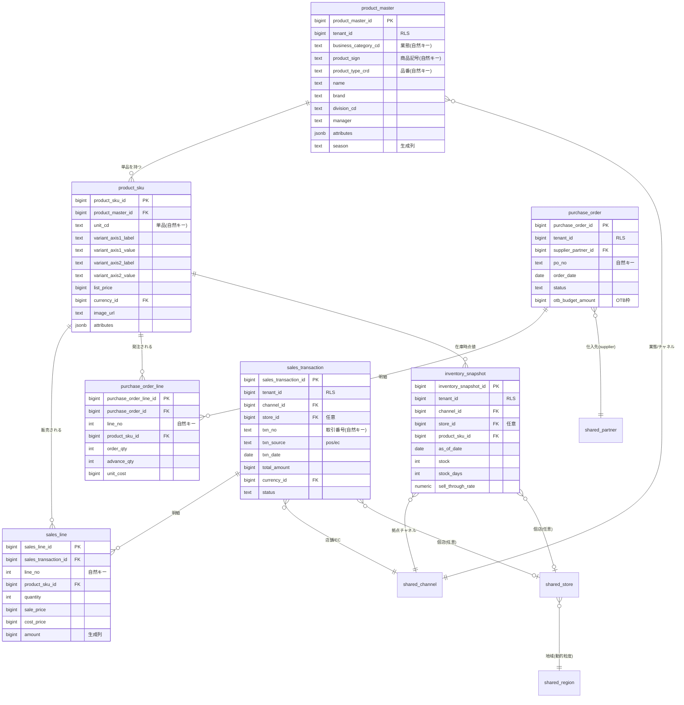
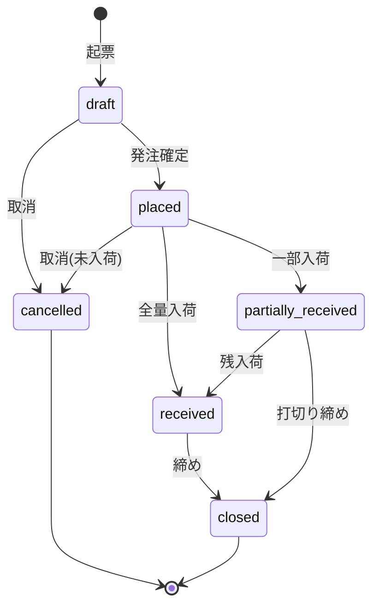

# DB-02 業務OLTPスキーマ設計 — `retail`（CrossRetail / クロスリテーラーサービス）

> ステータス: ドラフト（正準設計ブループリント v1.0 準拠）
> 版: 0.1
> 最終更新: 2026-07-04
> 関連ドキュメント:
> - ../database/DB-01-schema-strategy.md（スキーマ戦略・命名・キー・マルチテナント物理）
> - ../database/DB-03-operational-schema-maker.md（`maker` スキーマ。構造の対比）
> - ../database/DB-05-analytics-star-schema.md（`mart_{tenant}` 供給先の次元/ファクト）
> - ../database/DB-06-mapping-metadata-schema.md（`mapping`+`staging`。自社直結の恒等マッピング）
> - ../detailed-design/DD-01-canonical-data-model.md（正準データモデル OLTP+mart 論理）
> - ../detailed-design/DD-02-api-interface-design.md（API リソース・契約・エラー）
> - ../basic-design/BD-02-domain-services.md（小売業務サービス設計）
> - 継承元: ../../design.md（現行アプリ設計）／../../star-schema-design.md（分析mart設計）

---

## 1. スキーマ概要と SoT

`retail` スキーマは、モジュール `MOD-RETAIL`（CrossRetail / クロスリテーラーサービス）の業務 OLTP を担う。責務は「小売の商品マスタ管理＋商取引トランザクション（仕入/発注/OTB・販売取引）＋売上・在庫の管理」であり、**店舗経営（POS）と EC の両方**を単一スキーマで扱う。分析・可視化は本スキーマを SoT として `mart_{tenant_code}`（../database/DB-05-analytics-star-schema.md）へ派生させる。

### 1.1 位置づけ（SoT 宣言）

本プラットフォームの SoT マップ（ブループリント §7）における `retail` の担当領域は以下のとおり。**`retail.*`（OLTP）が SoT、`mart_*` は派生キャッシュ**である。書込は必ず SoT（`retail.*`）が先、`mart` は `mart.rebuild()` による事後の冪等再構築で反映する。逆順（mart 先行更新）は禁止する。

| データ領域 | SoT | 派生/キャッシュ | 回復パス（再同期） |
|---|---|---|---|
| 小売の商品マスタ | `retail.product_master` / `retail.product_sku` | `shared.product` / `shared.sku`（正準射影）→ `mart.dim_product` / `dim_sku` | 恒等マッピング再実行 → `mart.rebuild()` |
| 販売取引（店舗POS/EC注文） | `retail.sales_transaction` / `retail.sales_line` | `mart.fact_sales_weekly` / `fact_sales_daily`（`channel_key`＝店舗/EC・`vendor_key`＝商品マスタ経由解決／不明メンバー・R3） | `mart.rebuild()` |
| 在庫時点値（店舗/EC） | `retail.inventory_snapshot` | `mart.fact_inventory_snapshot`（`location_type='retailer'`＋`retailer_key`・R4） | `mart.rebuild()` |
| 仕入/発注/OTB | `retail.purchase_order` / `retail.purchase_order_line` | `mart.fact_orders`（`order_direction='purchase'`＋`vendor_key`＝仕入先・R5） | `mart.rebuild()` |
| 在庫アクションフラグ（ユーザー判断） | `retail.inventory_action_flag`（public/自然キー・継承） | なし（mart 非依存。明細表示時に自然キー結合） | mart 再構築の影響を受けない（原則2） |

> **継承元との対応:** 現行 UndeuxSales は「小売しまむらから週次提供される他社由来の売上参照データ」を扱う単一ファクト `sales_weekly` であり、その SoT は取込ファイル＝`staging`（../database/DB-06-mapping-metadata-schema.md）側にある。本 `retail` スキーマは、それとは別に **CrossRetail を自社導入した小売テナントが自らの POS/EC 業務を記録する OLTP** を定義する。他社連携の週次参照データは `staging.raw_record` が SoT であり、本スキーマの範囲外である（両者は `mapping` 経由で同じ mart へコンフォームする）。

### 1.2 前提

- **テナント境界:** `account_type='retailer'` の `shared.tenant`。OLTP は共有テーブル＋ PostgreSQL RLS（`tenant_id` 論理列）で分離（ブループリント §8.3、../detailed-design/DD-06-security-authz-tenancy.md）。接続時にセッション変数 `app.tenant_id` を設定する。
- **地域粒度:** テナントの `shared.tenant.region_granularity`（`prefecture` / `municipality`）で動的切替。店舗・販売先は `shared.region`（自己参照階層）へ FK で紐付く。
- **金額型:** 最小通貨単位の整数 `bigint`（`shared.currency.minor_unit` で桁解釈）。数量は `int`、測定値で小数を要するものは `numeric`。
- **店舗軸の扱い:** 現行の継承資産（しまむら）は企業集約（個店なし）だが、CrossRetail は**店舗経営を明示対象**とするため `shared.store` を実体として持つ。企業集約のみのテナントは `store_id` を NULL 許容とし個店を持たない運用も可能とする（下位互換）。
- 本書は物理スキーマの SoT。論理モデルの正規定義は ../detailed-design/DD-01-canonical-data-model.md、命名・キー・マルチテナント物理方針は ../database/DB-01-schema-strategy.md が SoT。

---

## 2. ERD（`retail` スキーマ）

`retail` スキーマの中核は「商品マスタ（`product_master` → `product_sku`）」「販売取引（`sales_transaction` → `sales_line`）」「在庫（`inventory_snapshot`）」「発注（`purchase_order` → `purchase_order_line`）」の4系統である。すべての明細（`*_line`）は `product_sku` を参照し、SKU が売上・在庫・発注を横断して結ぶ単一の粒度になる。取引ヘッダは `shared.channel`（店舗/EC）・`shared.store`・`shared.trading_partner`（仕入先）へ FK で接続する。以下の ERD は主要 FK と自然キーを示す（監査列 `created_at/updated_at/created_by/updated_by` と `tenant_id` は全業務テーブル共通のため省略）。



> 上図のとおり、`product_sku` が売上・発注・在庫の3ファクト系を束ねる中心エンティティである。取引ヘッダは `shared` 参照マスタ（channel/store/partner/region）へ接続し、`retail` は業務トランザクションに専念する。ブループリント §3.2 のテーブル定義に対し、店舗/EC 両対応のため `sales_transaction.txn_source`（pos/ec）と `store_id`（任意）、OTB のため `purchase_order.otb_budget_amount` を**拡張提案**として加えている（詳細は §4・§8）。

---

## 3. 商品マスタ（正準商品/SKU との対応・小売固有属性）

### 3.1 テーブルと自然キー

| テーブル | PK | 自然キー(UNIQUE) | 主要属性 | SoT |
|---|---|---|---|---|
| `retail.product_master` | `product_master_id` | `(tenant_id, business_category_cd, product_sign, product_type_crd)` | `name`, `brand`, `division_cd`, `manager`, `product_type_crd`, `attributes jsonb`, 生成列 `season` | `retail.product_master` |
| `retail.product_sku` | `product_sku_id` | `(product_master_id, unit_cd)` | `variant_axis1/2_label/value`, `list_price bigint`, `currency_id`, `image_url`, `attributes jsonb` | `retail.product_sku` |

小売固有の自然キーは継承資産（現行 `m_product` / `m_product_sku`、../../design.md §9.2）を踏襲する。すなわち**業態（`business_category_cd`）× 商品記号（`product_sign`）× 品番（`product_type_crd`）**で親商品を、**単品コード（`unit_cd`）**で SKU を一意識別する。リレーションはサロゲート FK（`product_master_id` / `product_sku_id`）のみで張り、自然キーは UNIQUE 制約と冪等 UPSERT にのみ用いる（ブループリント §8.2）。

### 3.2 正準商品/SKU（`shared.product` / `shared.sku`）との対応

`retail.product_master` / `retail.product_sku` は所有モジュールの product_master であり、正準商品 `shared.product` / `shared.sku`（ブループリント §3.1）の **SoT** である。正準側へは以下の対応で射影する。この射影は自社アプリ直結のため `mapping.field_mapping.resolved_by='auto'`・`system_type='self'` の恒等マッピング（../database/DB-06-mapping-metadata-schema.md）で行い、人的解決を要しない。

| `retail`（SoT） | `shared`（正準射影） | `mart`（派生・DB-05） |
|---|---|---|
| `product_master.business_category_cd` | `product.channel_code` | `dim_product` 自然キー（業態） |
| `product_master.product_sign` | `product.product_sign` | `dim_product` 自然キー |
| `product_master.product_type_crd` | `product.product_code` | `dim_product` 自然キー（品番） |
| `product_master.name` | `product.product_name` | `dim_product.product_name` |
| `product_master.division_cd` | `product.department_code` | `dim_product.department_code` |
| `product_master.attributes->>'season'`（生成列） | `product.season`（生成列） | `dim_product` 生成列 `season` |
| `product_sku.unit_cd` | `sku.unit_code` | `dim_sku` 自然キー（単品） |
| `product_sku.variant_axis1/2_*` | `sku.variant_axis1/2_*` | `dim_sku.variant_axis1/2_*` |
| `product_sku.list_price` | `sku.list_price` | `dim_sku.list_price`（SCD1） |

### 3.3 小売固有属性の吸収（コア/拡張の分離）

業種差（アパレル=色/サイズ、食品=容量/味）は**汎用バリアント2軸**（`variant_axis1_label/value`, `variant_axis2_label/value`）で吸収する（ブループリント §3.0、ADR-008）。軸ラベルはテナント別メタデータで解決する。その他の小売固有属性（季節・棚割・帳票区分・導入日など、継承資産の `kisetsu`/`tanawari`/`chohyo_kubun`/`donyu_date`）は `attributes jsonb` に格納し、集計・フィルタに多用する軸のみ生成列（`GENERATED ALWAYS AS (attributes->>'...') STORED`）＋インデックスで性能を担保する（ADR-007）。これにより業種追加時に DDL 変更を要しない。

- `season`（生成列）: `attributes->>'season'` を物理列化。クロス集計・フィルタで多用するため索引化。
- 棚割 `tanawari1/2`、導入日 `donyu` 等は `attributes jsonb` に保持（生成列化は利用頻度で判断）。

---

## 4. 商取引トランザクション（仕入/発注/OTB・販売取引）

`retail` の商取引は「調達側（仕入/発注/OTB）」と「販売側（販売取引）」に大別される。

### 4.1 仕入/発注/OTB

| テーブル | PK | 自然キー(UNIQUE) | 主要属性 | SoT |
|---|---|---|---|---|
| `retail.purchase_order` | `purchase_order_id` | `(tenant_id, po_no)` | `supplier_partner_id`, `order_date`, `status`, `otb_budget_amount bigint`（拡張提案） | `retail.purchase_order` |
| `retail.purchase_order_line` | `purchase_order_line_id` | `(purchase_order_id, line_no)` | `product_sku_id`, `order_qty`, `advance_qty`, `unit_cost bigint` | `retail.purchase_order_line` |

- **仕入先**は `shared.trading_partner`（`partner_type='supplier'`）を `supplier_partner_id` で参照する（ブループリント §3.0 の販売先/取引先統一方針）。
- **mart 供給（R5）:** `retail.purchase_order`/`purchase_order_line`（調達発注）は mart の `fact_orders` へ **`order_direction='purchase'`** で供給し、反対側取引先である仕入先（メーカー/サプライヤ）を **`vendor_key`** に射影する（`customer_key` は不明メンバー `=0`）。メーカーの受注（`order_direction='sales'`）とは同一 `fact_orders` に方向属性で共存し、集計時は必ず `order_direction` でフィルタする（DB-05 §4.2・DB-03 §と整合。両者が逆向きに割れないための統一規約）。
- **発注ヘッダ**は `status`（例: draft/placed/partially_received/closed/cancelled）で状態遷移を持つ。状態遷移は §後述の stateDiagram を参照。
- **OTB（Open-To-Buy / 在庫予算枠）**は用語集シード（ブループリント §10）に従い「発注可能残額」を管理する指標である。ブループリントの `purchase_order` 定義には OTB 列が無いため、`otb_budget_amount`（発注枠の上限、bigint）を**拡張提案**として発注ヘッダに保持する。実際の発注残額 = `otb_budget_amount − Σ(order_qty × unit_cost)` は導出値であり列として持たず、集計時に算出する（非正規化の回避）。OTB の期間・部門単位の予算計画自体を管理する必要が生じた場合は、`retail.otb_plan`（期×部門×チャネルのグレイン）を別テーブルとして追加する余地を残す（本書時点では未決事項 §11）。

> **入荷（仕入計上）の扱い:** ブループリントの `retail` 定義には独立した入荷（receiving）テーブルは無い。入荷実績は当面 `purchase_order_line.advance_qty`（先付/入荷予定）と発注 `status` で表現し、実在庫は `inventory_snapshot` の時点値で捕捉する方針とする。明示的な入荷トランザクションが要件化した場合は `retail.goods_receipt` を拡張提案として追加する（未決事項 §11）。

### 4.2 販売取引（店舗POS/EC）

| テーブル | PK | 自然キー(UNIQUE) | 主要属性 | SoT |
|---|---|---|---|---|
| `retail.sales_transaction` | `sales_transaction_id` | `(tenant_id, txn_no)` | `channel_id`, `store_id`（任意）, `txn_source`（pos/ec, 拡張提案）, `txn_date`, `total_amount bigint`, `currency_id`, `status` | `retail.sales_transaction` |
| `retail.sales_line` | `sales_line_id` | `(sales_transaction_id, line_no)` | `product_sku_id`, `quantity`, `sale_price bigint`, `cost_price bigint`, `amount bigint`（生成列） | `retail.sales_line` |

- 販売取引は**店舗POS（1レシート＝1トランザクション）**と**EC注文（1オーダー＝1トランザクション）**を単一構造で扱う。区別は `channel.channel_type`（store/ec）と `txn_source`（pos/ec、拡張提案の退化属性）で行う。
- `total_amount` はヘッダの合計金額（bigint）。明細 `sales_line.amount` は `quantity × sale_price` を生成列で保持し、ヘッダ合計との整合はアプリ層/バッチで検証する（DQ ルール、../database/DB-06-mapping-metadata-schema.md）。
- `sale_price`・`cost_price` は測定値（bigint）。粗利は `quantity × (sale_price − cost_price)` として mart 側で `gross_profit` を事前計算する（OLTP では持たない。非正規化は mart のみで許容＝ブループリント §8.2）。

### 4.3 発注ステータスの状態遷移

発注ヘッダ `retail.purchase_order.status` の代表的な状態遷移を示す。記録系（発注実績）であり、`cancelled`/`closed` への到達後に過去の遷移履歴を巻き戻さない（原則2 冪等性と状態保護）。



> 状態遷移はアプリ層（../detailed-design/DD-02-api-interface-design.md）で強制し、不正遷移は `UNDX-RTL-*`（クロスリテーラー業務エラー、§9）を返す。DB 層では `status` を CHECK 制約で許容値に限定し、遷移の順序自体はトリガではなくアプリで担保する（グレースフルデグラデーション: 補助的な整合チェック失敗が主要な受注/入荷フローを止めない設計）。

---

## 5. 売上（店舗POS/EC注文の正準化。グレインと集計元）

### 5.1 OLTP グレインと正準化

`retail` OLTP における売上の最小グレインは **1販売明細（`sales_line`）= 1トランザクション × 1SKU × 明細行**である。店舗POS と EC注文は発生源が異なるが、`sales_transaction`（ヘッダ）＋ `sales_line`（明細）へ正準化して同一構造に落とす。

| 発生源 | ヘッダ（`sales_transaction`） | 明細（`sales_line`） | チャネル判定 |
|---|---|---|---|
| 店舗POS | 1レシート | レシート内の商品行 | `channel_type='store'`, `txn_source='pos'`, `store_id`=個店 |
| EC注文 | 1オーダー | オーダー内の商品行 | `channel_type='ec'`, `txn_source='ec'`, `store_id`=NULL（またはEC拠点） |

### 5.2 mart への集計元グレイン

分析 mart（../database/DB-05-analytics-star-schema.md）のファクトは継承資産に合わせ**週次グレイン**である。`retail` OLTP（明細/日次）から mart（週次）への集約は `mart.rebuild()` が担う。

| mart ファクト | mart グレイン | 集計元（`retail` OLTP） | 主なメジャー |
|---|---|---|---|
| `fact_sales_weekly` | 週×小売×メーカー×**チャネル**×商品×SKU | `sales_line` を `sales_transaction.txn_date` の週（月曜起点）で集約。`channel_id`→`dim_channel` を **`channel_key`** として供給（店舗/EC 横断分析・R3） | quantity, amount, gross_profit（事前計算）, sale_price, cost_price |
| `fact_sales_daily` | 日×小売×**チャネル**×商品×SKU | `sales_line` を `txn_date`（実日付）で集約（派生・未実装継承）。`channel_key` を供給 | quantity, day_of_week |

> **`channel_key`／`vendor_key` の供給（R3）:** `fact_sales_weekly`/`fact_sales_daily` のグレインは `channel_key`（→ `dim_channel`）を含み、`channel.channel_type`（store/ec）を分析層まで貫通させて店舗＋EC 横断分析を可能にする（DB-05 §4.2）。`vendor_key` は NOT NULL であり（DB-05 §3.0）、`retail` はメーカー軸を直接持たないため、**商品（`product_sku`→`shared.sku`→`shared.product` に紐づくメーカー）経由で `vendor_key` を解決**する。解決不能な商品は **`dim_vendor` の不明メンバー（`vendor_key=0`）** へ、チャネル未判定の明細は `dim_channel` の不明メンバーへ射影して FK 整合を保ち、件数を `rebuild` サマリー（`UNDX-ANL-004`）に計上する（NULL 許容化はしない）。

> **継承との整合:** 現行の週次参照データ（しまむら）は最初から週次スナップショットで到来するが、CrossRetail は明細/日次で発生するため、mart への集約時に週=月曜へ丸める。日付次元の週定義（`week_monday`）は `shared.calendar_date` / `mart.dim_date` が SoT（../database/DB-05-analytics-star-schema.md）であり、`retail` 側で週を持たず `txn_date`（`date`）のみを持つことで二重定義を避ける。

---

## 6. 在庫（店舗在庫/EC在庫/スナップショット）

### 6.1 テーブルとグレイン

| テーブル | PK | 自然キー(UNIQUE) | グレイン | SoT |
|---|---|---|---|---|
| `retail.inventory_snapshot` | `inventory_snapshot_id` | `(tenant_id, channel_id, store_id, product_sku_id, as_of_date)` | 1時点 × チャネル × 個店（任意）× SKU | `retail.inventory_snapshot` |

主要メジャー: `stock`（在庫数, int）, `stock_days`（在日, 平均集計）, `sell_through_rate`（消化率, numeric・分母0は0）。継承資産（`fact_inventory_snapshot`）に合わせ、累計売上/納品・発注/先付などの時点値も `attributes jsonb` もしくは追加列で保持可能とする（拡張提案）。

### 6.2 店舗在庫/EC在庫の区別と加算性

- 在庫は**チャネル（store/ec）× 個店（`store_id`）**で拠点を区別する。企業集約テナントは `store_id=NULL`＋`channel_id` のみで拠点を表現する（下位互換: 継承資産は店舗軸を持たず `zaikosu` を店頭在庫として扱う。../../design.md §11.4 と同一判断）。
- 在庫は**セミアディティブ**（時間方向に非加算、SKU・拠点方向に加算可、ブループリント §10 用語）。「期間内は最新スナップショット週の値を用いる」ロジックは継承資産と同じく mart の `fact_inventory_snapshot` 参照に一元化する（../../design.md §7 の「最新週スナップショット基準」）。
- **mart 供給（R4）:** `retail.inventory_snapshot` は mart の `fact_inventory_snapshot` へ **`location_type='retailer'` ＋ `retailer_key`（企業集約）** で供給する（DB-05 §4.2・§8.2b の CHECK 制約 `ck_fact_inv_location` を満たす）。倉庫在庫（`location_type='warehouse'`）・メーカー自社在庫（`location_type='vendor'`）とは同一ファクト内で拠点タイプにより排他共存する。個店 `store_id` は mart 供給時に企業集約され、`retailer_key` へ射影する。
- 自然キーに `as_of_date` を含めることで、同一 SKU×拠点×時点の重複を UNIQUE 制約で禁止し、冪等 UPSERT を保証する。

### 6.3 在庫アクションフラグ（mart 非依存・状態保護）

滞留・不動などユーザー判断の記録（発注停止候補・値下げ候補・対応状況）は、継承資産の設計（../../design.md §7.x）を踏襲し **`retail.inventory_action_flag`（public 相当・自然キー保持）** に置く。これは mart 再構築（TRUNCATE）の影響を受けないよう自然キーで保持し、明細表示時に LEFT JOIN で additive に載せる（ブループリント §7・ADR-014、原則2）。一括登録は `ON CONFLICT DO NOTHING` の冪等動作とし、**再実行が既存フラグの対応状況を巻き戻さない**。

---

## 7. 販売先・チャネル・店舗マスタ（地域紐付け）

`retail` の取引が接続する参照マスタは `shared` スキーマ（グローバル/テナント所有）が SoT であり、`retail` は FK 参照のみを持つ（ブループリント §3.1・§8.3）。

| 参照マスタ | スキーマ | 役割 | 地域紐付け | SoT |
|---|---|---|---|---|
| `shared.trading_partner` | shared | 仕入先/販売先/得意先/運送（`partner_type`） | `region_id` | `shared.trading_partner` |
| `shared.channel` | shared | チャネル（`channel_type` = store/ec） | — | `shared.channel` |
| `shared.store` | shared | 個店（企業集約時は未使用可） | `region_id` | `shared.store` |
| `shared.region` | shared | 国>都道府県>市区町村の自己参照階層 | 自己参照（`parent_region_id`, `level`） | `shared.region` |

- **販売先軸:** `retail` の販売取引は不特定多数の消費者（B2C）を主対象とするため、取引ヘッダに個別販売先を持たないのが基本。B2B（卸）取引が要件化した場合は `sales_transaction.customer_partner_id`（`partner_type='customer'`）を拡張提案として追加する。分析上の「販売先」軸は `mart.dim_customer` に射影する（ブループリント §4.1）。
- **チャネル軸:** `channel.channel_type`（store/ec）が店舗/EC 両対応の基点。mart では `dim_channel`（新規次元）へ射影する。
- **店舗と地域:** `store.region_id` → `region` の階層で、地域粒度はテナントの `region_granularity` に応じ都道府県/市区町村を動的切替（ADR-003）。mart では `dim_region`（`region_key`）へ射影し、店舗は `dim_warehouse` ではなく販売拠点として `dim_channel`/`dim_retailer` 経由で地域に接続する。
- **企業集約次元:** 継承資産の `dim_retailer`（企業集約・`channel_code`=業態）は mart 側で保持する。`retail` OLTP は個店 `store` を持てるが、mart 供給時に企業集約する経路（ブループリント §4.1 `dim_retailer`）と個店を保つ経路（`dim_channel`＋地域）を両立させる。

---

## 8. 代表テーブル DDL（sql）

以下は PostgreSQL 16 を前提とした代表テーブルの DDL（`retail` スキーマ）。PK はサロゲート `bigint`（`GENERATED ALWAYS AS IDENTITY`）、自然キーは UNIQUE 制約、金額は `bigint`、業種固有属性は `jsonb`＋生成列とする。監査列・`tenant_id` は全テーブル共通のため `product_master` に代表して記載する（他テーブルも同様に持つ）。

```sql
-- 商品マスタ（親）: 業態×商品記号×品番の自然キー、季節は生成列
CREATE TABLE retail.product_master (
    product_master_id      bigint GENERATED ALWAYS AS IDENTITY PRIMARY KEY,
    tenant_id              bigint NOT NULL,                       -- RLS 論理列
    business_category_cd   text   NOT NULL,                       -- 業態（自然キー構成）
    product_sign           text   NOT NULL,                       -- 商品記号（自然キー構成）
    product_type_crd       text   NOT NULL,                       -- 品番（自然キー構成）
    name                   text   NOT NULL,
    brand                  text,
    division_cd            text,                                  -- 部門
    manager                text,
    attributes             jsonb  NOT NULL DEFAULT '{}'::jsonb,   -- 季節/棚割/帳票区分等
    season                 text   GENERATED ALWAYS AS (attributes->>'season') STORED,
    created_at             timestamptz NOT NULL DEFAULT now(),
    updated_at             timestamptz NOT NULL DEFAULT now(),
    created_by             bigint,
    updated_by             bigint,
    CONSTRAINT uq_retail_product_master_natural
        UNIQUE (tenant_id, business_category_cd, product_sign, product_type_crd)
);

-- SKU（単品）: 汎用バリアント2軸、定価は最小通貨単位 bigint
CREATE TABLE retail.product_sku (
    product_sku_id      bigint GENERATED ALWAYS AS IDENTITY PRIMARY KEY,
    tenant_id           bigint NOT NULL,
    product_master_id   bigint NOT NULL REFERENCES retail.product_master(product_master_id),
    unit_cd             text   NOT NULL,                          -- 単品コード（自然キー構成）
    variant_axis1_label text,                                     -- 例: カラー / 容量
    variant_axis1_value text,
    variant_axis2_label text,                                     -- 例: サイズ / 味
    variant_axis2_value text,
    list_price          bigint,                                   -- 定価（SCD1相当・現在値）
    currency_id         bigint REFERENCES shared.currency(currency_id),
    image_url           text,
    attributes          jsonb  NOT NULL DEFAULT '{}'::jsonb,
    created_at          timestamptz NOT NULL DEFAULT now(),
    updated_at          timestamptz NOT NULL DEFAULT now(),
    CONSTRAINT uq_retail_product_sku_natural UNIQUE (product_master_id, unit_cd)
);

-- 販売取引ヘッダ: 店舗POS/EC を単一構造で、取引番号が自然キー
CREATE TABLE retail.sales_transaction (
    sales_transaction_id bigint GENERATED ALWAYS AS IDENTITY PRIMARY KEY,
    tenant_id            bigint NOT NULL,
    channel_id           bigint NOT NULL REFERENCES shared.channel(channel_id),
    store_id             bigint REFERENCES shared.store(store_id),   -- 企業集約時は NULL 可
    txn_no               text   NOT NULL,                           -- レシート/オーダー番号（自然キー）
    txn_source           text   NOT NULL DEFAULT 'pos'
        CHECK (txn_source IN ('pos','ec')),                         -- 拡張提案（退化属性）
    txn_date             date   NOT NULL,                           -- 週丸めは mart 側
    total_amount         bigint NOT NULL DEFAULT 0,                 -- 最小通貨単位
    currency_id          bigint NOT NULL REFERENCES shared.currency(currency_id),
    status               text   NOT NULL DEFAULT 'confirmed'
        CHECK (status IN ('draft','confirmed','void','returned')),
    created_at           timestamptz NOT NULL DEFAULT now(),
    updated_at           timestamptz NOT NULL DEFAULT now(),
    CONSTRAINT uq_retail_sales_txn_natural UNIQUE (tenant_id, txn_no)
);

-- 販売明細: 1トランザクション×SKU、金額は生成列（quantity × sale_price）
CREATE TABLE retail.sales_line (
    sales_line_id        bigint GENERATED ALWAYS AS IDENTITY PRIMARY KEY,
    sales_transaction_id bigint NOT NULL
        REFERENCES retail.sales_transaction(sales_transaction_id) ON DELETE CASCADE,
    line_no              int    NOT NULL,
    product_sku_id       bigint NOT NULL REFERENCES retail.product_sku(product_sku_id),
    quantity             int    NOT NULL,
    sale_price           bigint NOT NULL,                           -- 実売価（測定値）
    cost_price           bigint NOT NULL,                           -- 原価（測定値）
    amount               bigint GENERATED ALWAYS AS (quantity * sale_price) STORED,
    CONSTRAINT uq_retail_sales_line_natural UNIQUE (sales_transaction_id, line_no)
);

-- 在庫スナップショット: 時点×チャネル×個店(任意)×SKU が自然キー
CREATE TABLE retail.inventory_snapshot (
    inventory_snapshot_id bigint GENERATED ALWAYS AS IDENTITY PRIMARY KEY,
    tenant_id             bigint NOT NULL,
    channel_id            bigint NOT NULL REFERENCES shared.channel(channel_id),
    store_id              bigint REFERENCES shared.store(store_id),
    product_sku_id        bigint NOT NULL REFERENCES retail.product_sku(product_sku_id),
    as_of_date            date   NOT NULL,
    stock                 int    NOT NULL DEFAULT 0,
    stock_days            int,                                       -- 在日（平均集計）
    sell_through_rate     numeric,                                   -- 消化率（分母0は0）
    attributes            jsonb  NOT NULL DEFAULT '{}'::jsonb,       -- 累計売上/納品・発注/先付等
    created_at            timestamptz NOT NULL DEFAULT now(),
    updated_at            timestamptz NOT NULL DEFAULT now(),
    CONSTRAINT uq_retail_inventory_snapshot_natural
        UNIQUE (tenant_id, channel_id, store_id, product_sku_id, as_of_date)
);

-- 発注ヘッダ: OTB 予算枠を保持（拡張提案）
CREATE TABLE retail.purchase_order (
    purchase_order_id   bigint GENERATED ALWAYS AS IDENTITY PRIMARY KEY,
    tenant_id           bigint NOT NULL,
    supplier_partner_id bigint NOT NULL REFERENCES shared.trading_partner(partner_id),
    po_no               text   NOT NULL,
    order_date          date   NOT NULL,
    status              text   NOT NULL DEFAULT 'draft'
        CHECK (status IN ('draft','placed','partially_received','received','closed','cancelled')),
    otb_budget_amount   bigint,                                     -- OTB 発注枠（拡張提案）
    created_at          timestamptz NOT NULL DEFAULT now(),
    updated_at          timestamptz NOT NULL DEFAULT now(),
    CONSTRAINT uq_retail_purchase_order_natural UNIQUE (tenant_id, po_no)
);

-- 発注明細
CREATE TABLE retail.purchase_order_line (
    purchase_order_line_id bigint GENERATED ALWAYS AS IDENTITY PRIMARY KEY,
    purchase_order_id      bigint NOT NULL
        REFERENCES retail.purchase_order(purchase_order_id) ON DELETE CASCADE,
    line_no                int    NOT NULL,
    product_sku_id         bigint NOT NULL REFERENCES retail.product_sku(product_sku_id),
    order_qty              int    NOT NULL,
    advance_qty            int    NOT NULL DEFAULT 0,                -- 先付/入荷予定
    unit_cost              bigint NOT NULL,                         -- 最小通貨単位
    CONSTRAINT uq_retail_po_line_natural UNIQUE (purchase_order_id, line_no)
);
```

> `store_id` を UNIQUE 制約に含む `inventory_snapshot` では、`store_id` が NULL の行（企業集約）が PostgreSQL の既定で重複可能になる点に注意する。企業集約テナントでの一意性を厳密に担保するには、`COALESCE(store_id, 0)` を用いた式インデックス、または `NULLS NOT DISTINCT`（PostgreSQL 15+）を採用する（§9 参照）。

---

## 9. インデックス・制約・冪等 UPSERT

### 9.1 インデックス方針

| 対象 | インデックス | 目的 |
|---|---|---|
| 全 FK 列（`product_master_id`, `product_sku_id`, `channel_id`, `store_id`, `supplier_partner_id` 等） | B-tree | JOIN 性能・参照整合の検査 |
| `sales_transaction(tenant_id, txn_date)` | B-tree（複合） | テナント内の期間集計（mart 集約元） |
| `sales_transaction(txn_date)` | BRIN | 時系列昇順の性質を活用（大量行の範囲走査、継承 §11） |
| `sales_line(product_sku_id)` | B-tree | SKU 別売上集計 |
| `inventory_snapshot(tenant_id, as_of_date)` | B-tree | 最新スナップショット週の抽出 |
| `product_master(season)`（生成列） | B-tree | 季節フィルタ・クロス集計軸 |
| `attributes` の多用キー | GIN もしくは式インデックス | jsonb 属性でのフィルタ |

### 9.2 制約

- **PK:** 全テーブルにサロゲート `bigint`（IDENTITY）。リレーションはサロゲート FK のみ（自然キーをリレーションに使わない、ブループリント §8.2）。
- **UNIQUE（自然キー）:** §3–§8 の各自然キー。冪等 UPSERT の競合ターゲットに用いる。
- **CHECK:** `status`・`txn_source` 等の区分値を許容集合に限定。
- **NULL 一意性:** `inventory_snapshot` の企業集約行（`store_id IS NULL`）は `UNIQUE (...) NULLS NOT DISTINCT`（PostgreSQL 15+）または `COALESCE` 式インデックスで重複を防ぐ。
- **RLS:** 全業務テーブルに `tenant_id` を持ち、`ENABLE ROW LEVEL SECURITY` ＋ `USING (tenant_id = current_setting('app.tenant_id')::bigint)` のポリシーを付す（../detailed-design/DD-06-security-authz-tenancy.md、`UNDX-TENANT-*`）。

### 9.3 冪等 UPSERT

取込・同期は自然キーを競合ターゲットに `INSERT ... ON CONFLICT ... DO UPDATE`（設定系・測定値）／`DO NOTHING`（記録系）で行う。記録系（フラグの対応状況・取込履歴）は再実行で巻き戻さない（原則2）。

```sql
-- 販売取引ヘッダの冪等 UPSERT（測定値は上書き＝SoT による訂正）
INSERT INTO retail.sales_transaction
    (tenant_id, channel_id, store_id, txn_no, txn_source, txn_date, total_amount, currency_id, status)
VALUES (@tenant_id, @channel_id, @store_id, @txn_no, @txn_source, @txn_date, @total_amount, @currency_id, @status)
ON CONFLICT (tenant_id, txn_no) DO UPDATE
SET total_amount = EXCLUDED.total_amount,
    status       = EXCLUDED.status,
    txn_date     = EXCLUDED.txn_date,
    updated_at   = now();

-- 在庫スナップショットの冪等 UPSERT（同一時点は最新値で訂正）
INSERT INTO retail.inventory_snapshot
    (tenant_id, channel_id, store_id, product_sku_id, as_of_date, stock, stock_days, sell_through_rate)
VALUES (@tenant_id, @channel_id, @store_id, @product_sku_id, @as_of_date, @stock, @stock_days, @rate)
ON CONFLICT (tenant_id, channel_id, store_id, product_sku_id, as_of_date) DO UPDATE
SET stock             = EXCLUDED.stock,
    stock_days        = EXCLUDED.stock_days,
    sell_through_rate = EXCLUDED.sell_through_rate,
    updated_at        = now();
```

> **同時実行の直列化:** 大量取込やバッチ同期は継承資産と同じく PostgreSQL の advisory lock で直列化し、同一テナント/期間の並行書込による不整合を防ぐ（../../design.md §7）。UPSERT 失敗などの想定エラーには `UNDX-RTL-*` / `UNDX-IMP-*`（§後述・ブループリント §9）を付与し、補助処理（フラグ導出等）の失敗が主要な取込フローを止めない（グレースフルデグラデーション、原則4）。

---

## 10. 分析 mart への供給（DB-05 へのマッピング観点）

`retail`（SoT）→ `mart_{tenant_code}`（派生）の供給は自社アプリ直結のため恒等マッピング（`resolved_by='auto'`）で行い、`mart.rebuild()`（冪等・advisory lock 直列化・`SET LOCAL statement_timeout=0`・非同期実行、ADR-009）で再構築する。各テーブルの供給先は下表（詳細は ../database/DB-05-analytics-star-schema.md）。

| `retail`（SoT） | 供給先 mart | グレイン変換 | 備考 |
|---|---|---|---|
| `product_master` | `dim_product`（SCD1） | 1親商品 | 自然キー=業態×記号×品番、生成列 season |
| `product_sku` | `dim_sku`（SCD1） | 1単品 | 汎用バリアント2軸、list_price（SCD1） |
| `sales_line`＋`sales_transaction` | `fact_sales_weekly` | 明細→週×小売×商品×SKU | amount/gross_profit を事前計算（mart のみ非正規化） |
| `sales_line`＋`sales_transaction` | `fact_sales_daily` | 明細→日 | 派生・未実装継承 |
| `inventory_snapshot` | `fact_inventory_snapshot` | 時点→週×拠点×SKU | セミアディティブ・最新週基準 |
| `purchase_order_line`＋`purchase_order` | `fact_orders` | 発注明細→週×販売先×SKU | order_qty/advance_qty/order_amount |
| `channel` / `store` / `region` | `dim_channel` / `dim_retailer` / `dim_region` | 参照射影 | 企業集約と個店の両経路 |

以下のフローは、店舗POS/EC で発生した売上・在庫データが `retail` OLTP（SoT）に記録され、恒等マッピングを経て mart へ集約され、最終的に分析・AI・意思決定支援に至るまでの流れを示す。SoT 書込が先、mart 反映が後の順序を厳守する。

```mermaid
flowchart TD
    POS[店舗POS<br/>レシート] --> TXN[retail.sales_transaction<br/>+ sales_line]
    EC[EC注文<br/>オーダー] --> TXN
    STK[店舗/EC 在庫時点値] --> INV[retail.inventory_snapshot]
    PO[仕入/発注/OTB] --> POT[retail.purchase_order<br/>+ purchase_order_line]

    subgraph SoT["retail（OLTP = SoT）"]
        TXN
        INV
        POT
    end

    TXN -->|恒等マッピング resolved_by=auto| MAP[mapping.mapping_job<br/>system_type=self]
    INV --> MAP
    POT --> MAP
    MAP -->|mart.rebuild 冪等・非同期| MART[(mart_&#123;tenant_code&#125;<br/>fact_sales_weekly / fact_inventory_snapshot / fact_orders)]
    MART --> ANL[InsightMart<br/>KPI/クロス集計/在庫健全性]
    ANL --> AI[KnowledgeCore / VirtualCompany<br/>インサイト・意思決定支援]

    FLAG[retail.inventory_action_flag<br/>public/自然キー] -. mart非依存・明細結合 .-> ANL
```



> 図のとおり、在庫アクションフラグ（ユーザー判断）は mart を経由せず、明細表示時に自然キーで結合される（mart 再構築の TRUNCATE 影響を受けない、ADR-014・原則2）。他社連携の週次参照データは本フローとは別に `staging`（../database/DB-06-mapping-metadata-schema.md）を SoT として同じ mart へコンフォームする。

---

## 11. 未決事項

- **OTB 予算計画テーブルの要否:** 本書は OTB 枠を発注ヘッダ `otb_budget_amount`（拡張提案）で表現するが、期×部門×チャネル単位の予算計画（`retail.otb_plan`）を独立管理する必要があるかは未確定。要件化時に ADR を起票する。
- **明示的入荷（goods_receipt）テーブルの要否:** 入荷実績を発注 `status`＋`advance_qty` で表すか、独立トランザクション `retail.goods_receipt` を設けるか未確定。
- **B2B（卸）販売先の保持:** `sales_transaction` に `customer_partner_id` を持たせるか（B2B 要件化時）。現状は B2C 前提でヘッダに個別販売先を持たない。
- **`txn_source` / `store_id` の正式採用:** 店舗POS/EC 区別のための `txn_source`・個店 `store_id` はブループリント §3.2 定義に無い拡張提案。ブループリント改訂（§本書冒頭の変更手順）と decision-log への記録が必要。
- **在庫時点値の追加メジャー:** 累計売上/納品・発注/先付を `inventory_snapshot` の独立列にするか `attributes jsonb` に留めるか（継承 `fact_inventory_snapshot` の列構成との整合）。
- **EC 固有属性:** 受注ステータス（出荷前キャンセル/返品）・配送先地域など EC 固有の分析軸を `attributes jsonb` で吸収するか専用列にするか。
- **返品/値引きの表現:** 返品は負数明細か独立トランザクション（`status='returned'`）か。粗利・消化率の集計定義への影響を要検討。
- **RLS ポリシーの詳細:** `app.tenant_id` セッション変数の設定経路とバイパスロール（自社運用横断集計）の扱いは ../detailed-design/DD-06-security-authz-tenancy.md 側の確定に従う。

### 前提（本書で置いた仮定）

- CrossRetail のテナントは自社導入小売であり、POS/EC 明細を自らの OLTP として記録する（他社週次参照データの取込＝継承資産 UndeuxSales とは別経路）。
- mart のグレイン（週次）と次元構成は継承資産をそのまま踏襲し、`retail` OLTP からの集約で満たす。
- 金額は単一通貨（`currency_id` で解釈）を明細内で混在させない前提（多通貨取引は未対応、要件化時に検討）。
