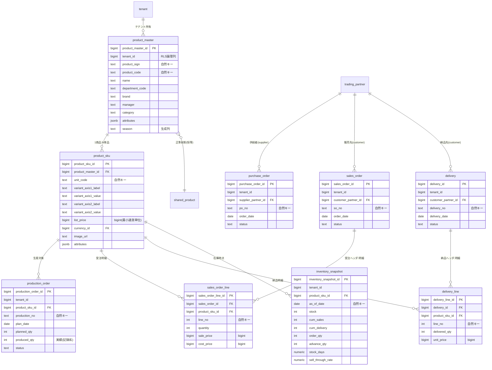
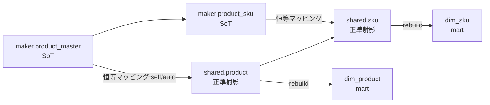
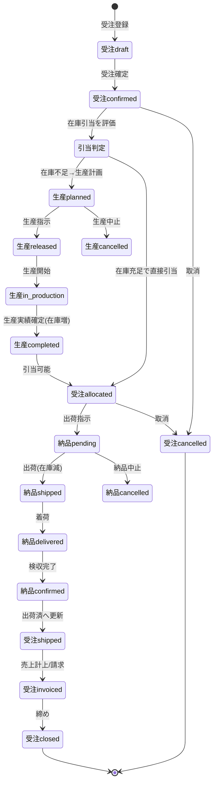

# DB-03 メーカー業務スキーマ（`maker`）物理設計 — Undeux Platform（UCP）

> **ステータス:** ドラフト（レビュー前）
> **版:** v1.0
> **最終更新:** 2026-07-04
> **関連ドキュメント:** [正準設計ブループリント v1.0]（全ドキュメント共通契約）／ [DB-01 スキーマ戦略総論](./DB-01-schema-strategy.md) ／ [DB-02 retail 物理スキーマ](./DB-02-operational-schema-retail.md) ／ [DB-04 wms 物理スキーマ](./DB-04-operational-schema-wms.md) ／ [DB-05 分析スタースキーマ](./DB-05-analytics-star-schema.md) ／ [DB-06 マッピングメタデータスキーマ](./DB-06-mapping-metadata-schema.md) ／ [DD-01 正準データモデル](../detailed-design/DD-01-canonical-data-model.md) ／ [DD-06 セキュリティ・認可・テナンシー](../detailed-design/DD-06-security-authz-tenancy.md) ／ 継承元: [現行アプリ設計](../../design.md)・[分析mart設計](../../star-schema-design.md)

---

本ドキュメントは **MakerOps（`MOD-MAKER`）** の業務 OLTP スキーマ `maker` の物理設計書である。メーカー（自社ブランドの商品を製造・供給する事業者）の**商品マスタ・生産・発注（調達）・受注・納品・売上・在庫**の各トランザクションを PostgreSQL 16 上に定義する。

名称・ID・SoT・命名規約はすべて **正準設計ブループリント v1.0**（以下ブループリント）§3.3 が SoT であり、本書はそれを DB 物理設計の観点から具体化する。総則（命名・キー・型・RLS・拡張・マイグレーション・SoT 書込順序）は [DB-01](./DB-01-schema-strategy.md) に従い、本書では重複を避けて `maker` 固有の設計に集中する。ブループリントに無い要素を補う場合は「**（拡張提案）**」と明記する。両者に矛盾がある場合はブループリントを優先する。

---

## 0. 前提

- 対象 RDBMS は **PostgreSQL 16**。`maker` は OLTP（記録系）スキーマであり、その全データはメーカーテナントにとっての **SoT**。分析 mart（`mart_{tenant_code}`）はここからの派生キャッシュである（DB-01 §9）。
- 全業務テーブルは論理列 `tenant_id`（RLS 用）と監査列 `created_at / updated_at / created_by / updated_by` を持つ（以下の DDL・表では明示するもの以外は省略）。
- サロゲート PK は `{entity}_id`（bigint, `GENERATED ALWAYS AS IDENTITY`）。自然キーは複合 UNIQUE に限定しリレーションには使わない（DB-01 §4、ブループリント §8.2）。
- 金額は最小通貨単位の整数 `bigint`（`shared.currency.minor_unit` で桁解釈）、数量は `int`、測定値のうち率・日数は `numeric`、日付は `date`（週＝月曜基準を継承）（DB-01 §6、ブループリント §8.4）。
- メーカーテナントは `shared.tenant.account_type = 'maker'`。分析上のメーカー境界は `dim_vendor`（テナント境界＝1メーカー）に射影される（ブループリント §4.1）。
- 想定エラーは `UNDX-{領域}-{連番}` で一元管理する（ブループリント §9）。本スキーマ主管の領域は **`MKR`（メーカー業務）**。境界・データ・分析に関わる `TENANT` / `DATA` / `ANL` も併用する。

---

## 1. スキーマ概要と SoT

`maker` スキーマは、メーカーの「作る・調達する・売る・届ける・数える」の各業務イベントを記録する。ブループリント §3.3 の 9 テーブルを物理化し、加えて記録系保護のためのステータス履歴（拡張提案）を持つ。

| テーブル | 区分 | 役割 | SoT |
|---|---|---|---|
| `maker.product_master` | マスタ（動的） | 商品（親）マスタ。名寄せ・部門・ブランド・担当・カテゴリ | `maker.product_master` |
| `maker.product_sku` | マスタ（動的） | 単品（SKU）。汎用バリアント2軸・定価・画像 | `maker.product_sku` |
| `maker.production_order` | トランザクション（記録系） | 生産計画・生産実績 | `maker.production_order` |
| `maker.purchase_order` | トランザクション（記録系） | **対サプライヤー**調達発注 | `maker.purchase_order` |
| `maker.sales_order` | トランザクション（記録系） | **対小売/対倉庫**の受注ヘッダ | `maker.sales_order` |
| `maker.sales_order_line` | トランザクション（記録系） | 受注明細・売上計上の測定値 | `maker.sales_order_line` |
| `maker.delivery` | トランザクション（記録系） | 納品ヘッダ（メーカー→小売/倉庫） | `maker.delivery` |
| `maker.delivery_line` | トランザクション（記録系） | 納品明細 | `maker.delivery_line` |
| `maker.inventory_snapshot` | トランザクション（記録系・時点） | 在庫スナップショット（数量・累計・率） | `maker.inventory_snapshot` |

### 1.1 SoT の原則（本スキーマでの適用）

- **`maker.*`（OLTP）が SoT。** 分析 mart（`fact_orders` / `fact_production` / `fact_delivery` / `fact_sales_weekly` / `fact_inventory_snapshot`）はここからの派生であり、`mart.rebuild()` により冪等再構築される（DB-01 §9.2、ADR-009）。書込は **SoT（`maker`）が先、mart 派生が後**。逆順にしない。
- **自社アプリ直結（恒等マッピング）。** MakerOps は最初からスタースキーマ連携前提のスキーマであるため、`mapping.mapping_job` は `system_type='self'` / `resolved_by='auto'` の恒等マッピングで `maker.*` を正準ターゲットへ直結する（ブループリント §3.5、ADR-002）。人的フィールドマッピング（`resolved_by='human'`）は他社連携（`staging`）にのみ用いる。
- **回復パス。** mart 側の欠落・破損は `mart.rebuild()` で `maker.*` から常に再構築可能。`maker.*` 自体はアプリ経由の再入力・監査ログが回復パス（DB-01 §1）。
- **記録系の保護。** 生産実績・納品実績・売上・在庫スナップショットは記録系であり、再実行・再取込で既存の実績値やステータス進捗を巻き戻さない（原則2、§9 で詳述）。

### 1.2 グレースフルデグラデーション

補助処理（mart への rebuild 通知、在庫スナップショットの派生集計、ステータス履歴の追記など）の失敗は、主要フロー（受注・生産・納品・売上の OLTP コミット）を止めない（原則4）。mart 再構築中もアプリ読取は旧 mart データで継続する（DB-01 §5.2）。致命的でない失敗は `UNDX-MKR-*` / `UNDX-ANL-*` で記録し、再実行で回復する。

---

## 2. ERD（`maker` スキーマ）

以下は `maker` スキーマの主要エンティティと `shared` 参照マスタとの関係を示す ERD である。商品（親）→SKU の1:N、各トランザクションヘッダ→明細の1:N、`shared.trading_partner`（取引先）への参照（`partner_type` で供給者/販売先を区別）、`shared.product` への正準射影を表す。リレーションはすべてサロゲート FK（`{entity}_id`）で張る。



上図の要点: (1) 商品は親 `product_master` と単品 `product_sku` の2階層で、SKU 固有属性は汎用バリアント2軸＋`attributes jsonb`＋生成列で吸収する。(2) 取引先は `shared.trading_partner` に統一され、`purchase_order` は供給者（`partner_type='supplier'`）、`sales_order` / `delivery` は販売先（`partner_type='customer'`、小売・倉庫を含む）を参照する。(3) `maker.product_master` は `shared.product`（正準）へ恒等射影され、そこから `dim_product` が派生する。図は関係構造の補完であり、列の完全定義は §8 の DDL を SoT とする。

---

## 3. 商品マスタ

### 3.1 正準商品／SKU との対応

メーカーの商品マスタは2階層で構成する（ブループリント §3.0 の全 OLTP 共通方針を継承）。

- **親＝`maker.product_master`**：商品を名寄せする単位。自然キー `(tenant_id, product_sign, product_code)`。部門・ブランド・担当・カテゴリのコア属性と `attributes jsonb`＋生成列 `season` を持つ。
- **単品＝`maker.product_sku`**：発注・生産・納品・売上・在庫のリレーション先となる最小単位。自然キー `(product_master_id, unit_code)`。汎用バリアント2軸（`variant_axis1_label/value`, `variant_axis2_label/value`）で業種差（アパレル＝色/サイズ、食品＝容量/味）を吸収し、`list_price bigint`（定価）・`currency_id`・`image_url`・`attributes jsonb` を持つ。

正準（`shared`）との対応は**恒等マッピング**で結ぶ。`maker.product_master` → `shared.product`、`maker.product_sku` → `shared.sku` の SoT はいずれも「所有モジュールの product_master / product_sku」＝ `maker.*` 側であり（ブループリント §3.1 の SoT 列）、`shared.product` / `shared.sku` は分析・横断参照のための正準射影である。したがって書込順序は `maker.product_master` → `shared.product` → `dim_product` の一方向を厳守する。



上図はメーカー商品マスタの SoT→正準→分析の一方向データフローである。`maker.*` が SoT、`shared.*` が正準射影、`dim_*` が mart 派生であり、いずれも SoT 側書込を先に行う（原則6）。図はフローの補完であり、SoT 宣言の完全版はブループリント §7 を参照。

### 3.2 原価・定価の扱い

- **定価（`list_price`）** は `maker.product_sku` にマスタ値として持つ（`bigint`・最小通貨単位）。分析側 `dim_sku.list_price` は **SCD1（上書き）** で継承する（ADR-004）。定価はほぼ不変・過去台帳を持たない前提のため履歴は保持しない。
- **原価（`cost_price`）／実売価（`sale_price`）** は取引ごとに変動しうる測定値であり、**マスタではなくトランザクション明細（`maker.sales_order_line`）に測定値として保持**する。これにより粗利（`sale_price − cost_price`）は全期間正確に算定できる（継承元 star-schema-design.md の値引き率・粗利の切り分けに準拠）。標準原価をマスタで持ちたい場合は `product_sku.attributes` に `standard_cost` を格納する（拡張提案・分析の主原価はあくまで明細測定値）。

### 3.3 BOM／構成（部品表）の扱いの是非

ブループリント §3.3 に BOM（Bill of Materials／製品構成）テーブルは**存在しない**。本 v1.0 では以下の判断とする。

- **結論（v1.0）:** BOM／製品構成の正規化テーブル（`maker.bom_component` 等）は**スコープ外**とする。本プラットフォームの分析軸は「商品・地域・販売先」であり（ブループリント §1）、生産は SKU 単位の計画/実績（`production_order`）で捕捉できるため、部品展開・所要量計算（MRP）は現時点の要件に含まれない（YAGNI）。
- **軽量表現（許容）:** キット品・セット品など単純な構成が必要な場合は、`product_sku.attributes jsonb` に構成情報（`{"bom":[{"component_sku":"...","qty":n}]}`）を格納する軽量表現を許容する（DDL 変更不要・ADR-007 の拡張方針に整合）。
- **将来拡張（拡張提案）:** 原材料所要・複数階層 BOM・工程別歩留まりを扱う要件が出た場合は、`maker.bom_component`（親 `product_sku_id` × 子 `component_sku_id` × `qty` × `scrap_rate`、自己参照で階層）を新設する。導入時はブループリント §3.3 と本書を先に改訂し、`decision-log.md` に ADR を追加する（§11 未決事項）。

---

## 4. 生産トランザクション（生産計画／実績）

`maker.production_order` が生産計画と生産実績を1レコードで表す（計画→実績の追記更新）。

| 列 | 型 | 意味 |
|---|---|---|
| `production_order_id` | bigint PK | サロゲート |
| `tenant_id` | bigint | RLS 論理列 |
| `product_sku_id` | bigint FK | 生産対象 SKU |
| `production_no` | text | 生産番号（自然キー `(tenant_id, production_no)`） |
| `plan_date` | date | 生産計画日（週＝月曜基準で集計） |
| `planned_qty` | int | 計画数量 |
| `produced_qty` | int | **生産実績数量（記録系・巻戻し禁止）** |
| `status` | text | ステータス（§5.3 の遷移に従う） |

- **計画と実績の分離:** `planned_qty`（設定系・修正可）と `produced_qty`（記録系・実績追記）を同一行に持つ。`produced_qty` は実績報告のたびに**単調増加**で更新し、再取込・再実行で減算・巻戻ししない（原則2）。`produced_qty > planned_qty` の超過は許容するが `UNDX-MKR-002`（生産実績が計画を超過）で警告記録する（グレースフルデグラデーション・ブロックしない）。
- **在庫への反映:** 生産完了（`status='completed'`）は自社在庫を増やす事象であり、`maker.inventory_snapshot.stock` の増分要因となる（§7）。反映は SoT（`production_order`）書込後に派生集計する。
- **分析供給:** 生産は `fact_production`（グレイン＝週×SKU、メジャー `planned_qty` / `produced_qty` / `produced_amount`）へ供給する（§10）。

---

## 5. 発注・納品トランザクション

メーカーの取引方向は2系統ある。混同を避けるため、方向を明示する。

| トランザクション | テーブル | 相手（`trading_partner`） | 方向 |
|---|---|---|---|
| **調達発注** | `maker.purchase_order` | 供給者 `supplier_partner_id`（`partner_type='supplier'`） | メーカー → サプライヤー（原材料・資材を発注） |
| **受注** | `maker.sales_order` / `_line` | 販売先 `customer_partner_id`（`partner_type='customer'`、小売・倉庫を含む） | 小売/倉庫 → メーカー（メーカーが受注） |
| **納品** | `maker.delivery` / `_line` | 納品先 `customer_partner_id` | メーカー → 小売/倉庫（メーカーが納品） |

> **注:** ブループリント §3.3 では `maker.purchase_order` に明細テーブルが定義されていない（`retail.purchase_order_line` は存在するが maker 側は未定義）。調達明細が必要な場合は `maker.purchase_order_line`（`purchase_order_id` × `product_sku_id` or 原材料 × `order_qty` × `unit_cost bigint`、自然キー `(purchase_order_id, line_no)`）を新設する（**拡張提案**）。本 v1.0 ではヘッダのみを物理化し、明細要否は §11 未決事項とする。調達発注は分析主軸（商品・地域・販売先）の対象外のため、`fact_orders` へは供給しない（拡張提案として供給する場合は方向属性で区別する）。

### 5.1 対小売/対倉庫の受注（`sales_order`）

- ヘッダ `maker.sales_order`（`customer_partner_id`, `order_date`, `status`、自然キー `(tenant_id, so_no)`）＋明細 `maker.sales_order_line`（`product_sku_id`, `quantity`, `sale_price bigint`, `cost_price bigint`、自然キー `(sales_order_id, line_no)`）。
- 受注明細は分析上「発注（受注）」として `fact_orders` に **`order_direction='sales'`**（販売先＝`customer_key`、売り手メーカーは `vendor_key` or 不明メンバー）で供給する（メジャー `order_qty` ← `quantity`、`order_amount` ← `quantity × sale_price`、`advance_qty` は先付分がある場合）。小売の調達発注（`order_direction='purchase'`・DB-02 §4.1）とは同一 `fact_orders` に方向属性で共存し、両者が逆向きに割れない統一規約とする（R5・DB-05 §4.2）。同時に売上計上の基礎測定値（`sale_price` / `cost_price`）として `fact_sales_weekly` へも供給する（§6・§10）。

### 5.2 対小売/対倉庫の納品（`delivery`）

- ヘッダ `maker.delivery`（`customer_partner_id`, `delivery_date`, `status`、自然キー `(tenant_id, delivery_no)`）＋明細 `maker.delivery_line`（`product_sku_id`, `delivered_qty`, `unit_price bigint`、自然キー `(delivery_id, line_no)`）。
- 納品は自社在庫の減少事象であり（§7）、`maker.inventory_snapshot.cum_delivery` の増分要因。分析は `fact_delivery`（週×販売先×SKU、メジャー `delivered_qty` / `delivered_amount`）へ供給する（§10）。

### 5.3 ステータス遷移

各トランザクションのステータス値を以下に確定する。ステータスは `CHECK` 制約で許容値を限定し、遷移はアプリ層＋ DB 側のガード（§9.4）で保護する。

| エンティティ | ステータス系列 |
|---|---|
| `sales_order.status`（受注） | `draft` → `confirmed` → `allocated` → `shipped` → `invoiced` → `closed`（任意段階から `cancelled`） |
| `production_order.status`（生産） | `planned` → `released` → `in_production` → `completed` → `closed`（`cancelled`） |
| `delivery.status`（納品） | `pending` → `shipped` → `delivered` → `confirmed`（`cancelled`） |
| `purchase_order.status`（調達） | `draft` → `ordered` → `partially_received` → `received` → `closed`（`cancelled`） |

以下は「受注 → 生産 → 納品 → 売上（計上）」を跨ぐ主要フローの状態遷移である。受注確定を起点に、引当のための生産、出荷・納品、売上計上（請求）へ至る。取消はいずれの段階からも `cancelled` へ遷移しうる（記録系の実績は保持したまま論理取消、§9）。



上図は受注起点のクロスエンティティ状態遷移である。受注確定後に在庫引当を評価し、不足時は生産（`production_order`）を経由して在庫を補充してから引当・出荷・納品・売上計上へ進む。実績（`produced_qty` / `delivered_qty` / 売上）は記録系であり、`cancelled` は実績値を消さずステータスのみを論理取消する（§9.3）。図はフローの補完であり、各ステータスの許容値・遷移ガードは §8 DDL・§9.4 を SoT とする。

---

## 6. 売上トランザクション

メーカーの「売上」は、受注（`maker.sales_order` / `_line`）の計上（`status='invoiced'` 到達）をもって確定する。売上専用のヘッダは持たず、受注明細の測定値（`sale_price` / `cost_price` / `quantity`）を売上の基礎とする（1エンティティ1責務・非正規化の回避、ブループリント §8.2）。

- **測定値の出自:** `sale_price`（実売価）・`cost_price`（原価）はいずれも `maker.sales_order_line` の**測定値**として保持し、粗利＝`quantity × (sale_price − cost_price)` は全期間正確に算定できる（§3.2）。金額は `bigint`（最小通貨単位）。
- **売上金額の事前計算は mart のみ:** OLTP `maker.sales_order_line` は正規化を保ち、`amount` / `gross_profit` の事前計算列は持たない。事前計算はブループリント §8.2 に従い **mart（`fact_sales_weekly`）でのみ**許容する（読取性能の明確な根拠がある例外措置）。
- **販売先軸:** メーカー売上の販売先は `shared.trading_partner`（`partner_type='customer'`、小売・倉庫を含む）。分析射影先を `dim_customer`（販売先の一般化）とするか、企業集約 `dim_retailer` とするかは継承元 `fact_sales_weekly`（小売×メーカー粒度）との整合に関わる論点であり、§11 未決事項とする。

---

## 7. 在庫トランザクション（自社在庫／預託在庫／倉庫在庫の別）

`maker.inventory_snapshot` は**時点スナップショット**（グレイン＝テナント×SKU×`as_of_date`、自然キー `(tenant_id, product_sku_id, as_of_date)`）である。在庫はセミアディティブ（時間方向に非加算・最新時点を基準に評価）。

| 列 | 型 | 意味 |
|---|---|---|
| `stock` | int | 在庫数量（時点） |
| `cum_sales` | int | 累計売上数 |
| `cum_delivery` | int | 累計納品数 |
| `order_qty` | int | 発注（受注）残 |
| `advance_qty` | int | 先付（先行）数 |
| `stock_days` | numeric | 在日（在庫が売り切れるまでの平均日数） |
| `sell_through_rate` | numeric | 消化率＝`cum_sales ÷ cum_delivery`（分母0は0） |

### 7.1 在庫の所有区分（自社／預託／倉庫）

ブループリント §3.3 の `maker.inventory_snapshot` は所有区分列を持たない。在庫の所有・所在の別は以下で扱う。

- **自社在庫（own）:** メーカー自社拠点の在庫。`maker.inventory_snapshot` が SoT。生産完了で増加、納品出荷で減少。分析では `fact_inventory_snapshot` に **`location_type='vendor'` ＋ `vendor_key`（当該メーカー＝テナント境界）** で供給する（DB-05 §4.2・§8.2b の CHECK。R4。メーカー自社在庫の格納先が物理ファクトに存在することを保証）。
- **倉庫在庫（warehouse）:** メーカーが荷主（`shipper`）として倉庫（WMS）に預ける在庫は **`wms.inventory_snapshot` が SoT**（荷主＝当該メーカー、[DB-04](./DB-04-operational-schema-wms.md)）。`maker` 側では重複保持せず、分析時に `fact_inventory_snapshot` の **`location_type='warehouse'` ＋ `warehouse_key`** で統合する（ブループリント §4.2・R4）。自社在庫（`vendor`）と倉庫在庫（`warehouse`）は同一ファクト内で `location_type` により排他共存する（CHECK 制約 `ck_fact_inv_location`）。
- **預託在庫（consignment）:** 小売店頭等に預けた未消化在庫。継承元 UndeuxSales の在庫スナップショット（`cum_delivery − cum_sales` の残）に相当し、`maker.inventory_snapshot` で `cum_delivery` / `cum_sales` の差として捕捉する。
- **所有区分の明示（拡張提案）:** 単一 `maker.inventory_snapshot` で自社/預託を区別したい場合は、生成列ではなくコア列 `stock_ownership text CHECK (stock_ownership IN ('own','consignment'))` を追加し、自然キーを `(tenant_id, product_sku_id, stock_ownership, as_of_date)` に拡張する（**拡張提案**・要 ADR）。倉庫在庫は `wms` が SoT のため本区分には含めない。区分導入は既存データへの影響評価とバックフィルパッチを伴う（原則7）。本 v1.0 の既定は所有区分なし（自社＋預託を合算した自社視点スナップショット）とし、§11 未決事項とする。

### 7.2 記録系としての在庫

在庫スナップショットは記録系（時点の事実）であり、同一 `as_of_date` の再取込は冪等 UPSERT（§9.3）で最新値へ更新するが、過去日付のスナップショットは巻き戻さない（原則2）。分析は `fact_inventory_snapshot`（セミアディティブ）へ供給する（§10）。

---

## 8. 代表テーブル DDL

以下は `maker` の代表テーブルの DDL である。DB-01 §4・§6・§7 の全規約（サロゲート PK＝`GENERATED ALWAYS AS IDENTITY`、自然キー＝複合 UNIQUE、金額＝`bigint`、`attributes jsonb`＋生成列＋索引、`tenant_id`＋RLS）を体現する。監査列は全テーブル共通のため代表 1 テーブルで明示し、他は同パターンとして省略する。

### 8.1 商品マスタ（`maker.product_master` / `maker.product_sku`）

```sql
CREATE TABLE maker.product_master (
    product_master_id bigint GENERATED ALWAYS AS IDENTITY,
    tenant_id         bigint NOT NULL,                 -- RLS 論理列
    -- 自然キー構成列（(tenant_id, product_sign, product_code) が UNIQUE）
    product_sign      text   NOT NULL,
    product_code      text   NOT NULL,
    -- コア属性（業種非依存）
    name              text   NOT NULL,
    department_code   text,
    department_name   text,
    brand             text,
    manager           text,
    category          text,
    -- 拡張属性（業種固有・クライアント固有）
    attributes        jsonb  NOT NULL DEFAULT '{}'::jsonb,
    -- 生成列: jsonb の頻用軸を物理列化（集計性能担保）
    season            text GENERATED ALWAYS AS (attributes ->> 'season') STORED,
    -- 監査列（全業務テーブル共通・以降のテーブルでは省略）
    created_at        timestamptz NOT NULL DEFAULT now(),
    updated_at        timestamptz NOT NULL DEFAULT now(),
    created_by        bigint,
    updated_by        bigint,
    CONSTRAINT pk_maker_product_master PRIMARY KEY (product_master_id),
    CONSTRAINT uq_maker_product_master_natural
        UNIQUE (tenant_id, product_sign, product_code),
    CONSTRAINT fk_maker_product_master_tenant
        FOREIGN KEY (tenant_id) REFERENCES shared.tenant (tenant_id)
);
CREATE INDEX ix_maker_product_master_season
    ON maker.product_master (tenant_id, season);
CREATE INDEX gin_maker_product_master_attributes
    ON maker.product_master USING gin (attributes);
ALTER TABLE maker.product_master ENABLE ROW LEVEL SECURITY;
CREATE POLICY p_maker_product_master_tenant ON maker.product_master
    USING (tenant_id = current_setting('app.tenant_id')::bigint);

CREATE TABLE maker.product_sku (
    product_sku_id      bigint GENERATED ALWAYS AS IDENTITY,
    tenant_id           bigint NOT NULL,               -- RLS（結合性能・分離のため冗長保持）
    product_master_id   bigint NOT NULL,
    unit_code           text   NOT NULL,
    -- 汎用バリアント2軸（色/サイズ・容量/味…を軸名＋値で吸収）
    variant_axis1_label text,
    variant_axis1_value text,
    variant_axis2_label text,
    variant_axis2_value text,
    list_price          bigint,                        -- 定価: 最小通貨単位の整数
    currency_id         bigint,
    image_url           text,
    attributes          jsonb  NOT NULL DEFAULT '{}'::jsonb,
    CONSTRAINT pk_maker_product_sku PRIMARY KEY (product_sku_id),
    CONSTRAINT uq_maker_product_sku_natural
        UNIQUE (product_master_id, unit_code),
    CONSTRAINT fk_maker_product_sku_master
        FOREIGN KEY (product_master_id) REFERENCES maker.product_master (product_master_id),
    CONSTRAINT fk_maker_product_sku_currency
        FOREIGN KEY (currency_id) REFERENCES shared.currency (currency_id),
    CONSTRAINT ck_maker_product_sku_list_price CHECK (list_price IS NULL OR list_price >= 0)
);
CREATE INDEX ix_maker_product_sku_master ON maker.product_sku (product_master_id);
CREATE INDEX gin_maker_product_sku_attributes ON maker.product_sku USING gin (attributes);
ALTER TABLE maker.product_sku ENABLE ROW LEVEL SECURITY;
CREATE POLICY p_maker_product_sku_tenant ON maker.product_sku
    USING (tenant_id = current_setting('app.tenant_id')::bigint);
```

### 8.2 生産（`maker.production_order`）

```sql
CREATE TABLE maker.production_order (
    production_order_id bigint GENERATED ALWAYS AS IDENTITY,
    tenant_id           bigint NOT NULL,
    product_sku_id      bigint NOT NULL,
    production_no       text   NOT NULL,               -- 自然キー
    plan_date           date   NOT NULL,
    planned_qty         int    NOT NULL DEFAULT 0,     -- 計画（設定系・修正可）
    produced_qty        int    NOT NULL DEFAULT 0,     -- 実績（記録系・巻戻し禁止）
    status              text   NOT NULL DEFAULT 'planned',
    attributes          jsonb  NOT NULL DEFAULT '{}'::jsonb,
    CONSTRAINT pk_maker_production_order PRIMARY KEY (production_order_id),
    CONSTRAINT uq_maker_production_order_natural
        UNIQUE (tenant_id, production_no),
    CONSTRAINT fk_maker_production_order_sku
        FOREIGN KEY (product_sku_id) REFERENCES maker.product_sku (product_sku_id),
    CONSTRAINT ck_maker_production_qty CHECK (planned_qty >= 0 AND produced_qty >= 0),
    CONSTRAINT ck_maker_production_status
        CHECK (status IN ('planned','released','in_production','completed','closed','cancelled'))
);
CREATE INDEX ix_maker_production_sku_week
    ON maker.production_order (tenant_id, product_sku_id, plan_date);
CREATE INDEX ix_maker_production_status
    ON maker.production_order (tenant_id, status) WHERE status <> 'closed';
ALTER TABLE maker.production_order ENABLE ROW LEVEL SECURITY;
CREATE POLICY p_maker_production_order_tenant ON maker.production_order
    USING (tenant_id = current_setting('app.tenant_id')::bigint);
```

### 8.3 受注（`maker.sales_order` / `maker.sales_order_line`）

```sql
CREATE TABLE maker.sales_order (
    sales_order_id      bigint GENERATED ALWAYS AS IDENTITY,
    tenant_id           bigint NOT NULL,
    customer_partner_id bigint NOT NULL,               -- shared.trading_partner (partner_type='customer')
    so_no               text   NOT NULL,               -- 自然キー
    order_date          date   NOT NULL,
    status              text   NOT NULL DEFAULT 'draft',
    attributes          jsonb  NOT NULL DEFAULT '{}'::jsonb,
    CONSTRAINT pk_maker_sales_order PRIMARY KEY (sales_order_id),
    CONSTRAINT uq_maker_sales_order_natural UNIQUE (tenant_id, so_no),
    CONSTRAINT fk_maker_sales_order_customer
        FOREIGN KEY (customer_partner_id) REFERENCES shared.trading_partner (partner_id),
    CONSTRAINT ck_maker_sales_order_status
        CHECK (status IN ('draft','confirmed','allocated','shipped','invoiced','closed','cancelled'))
);
CREATE INDEX ix_maker_sales_order_customer_date
    ON maker.sales_order (tenant_id, customer_partner_id, order_date);
ALTER TABLE maker.sales_order ENABLE ROW LEVEL SECURITY;
CREATE POLICY p_maker_sales_order_tenant ON maker.sales_order
    USING (tenant_id = current_setting('app.tenant_id')::bigint);

CREATE TABLE maker.sales_order_line (
    sales_order_line_id bigint GENERATED ALWAYS AS IDENTITY,
    tenant_id           bigint NOT NULL,               -- RLS（親から冗長保持）
    sales_order_id      bigint NOT NULL,
    line_no             int    NOT NULL,               -- 自然キー構成
    product_sku_id      bigint NOT NULL,
    quantity            int    NOT NULL DEFAULT 0,
    sale_price          bigint NOT NULL DEFAULT 0,     -- 実売価（測定値・最小通貨単位）
    cost_price          bigint NOT NULL DEFAULT 0,     -- 原価（測定値・最小通貨単位）
    advance_qty         int    NOT NULL DEFAULT 0,     -- 先付数（fact_orders 供給用）
    CONSTRAINT pk_maker_sales_order_line PRIMARY KEY (sales_order_line_id),
    CONSTRAINT uq_maker_sales_order_line_natural UNIQUE (sales_order_id, line_no),
    CONSTRAINT fk_maker_sales_order_line_order
        FOREIGN KEY (sales_order_id) REFERENCES maker.sales_order (sales_order_id),
    CONSTRAINT fk_maker_sales_order_line_sku
        FOREIGN KEY (product_sku_id) REFERENCES maker.product_sku (product_sku_id),
    CONSTRAINT ck_maker_sales_order_line_qty
        CHECK (quantity >= 0 AND advance_qty >= 0 AND sale_price >= 0 AND cost_price >= 0)
);
CREATE INDEX ix_maker_sales_order_line_sku
    ON maker.sales_order_line (tenant_id, product_sku_id);
ALTER TABLE maker.sales_order_line ENABLE ROW LEVEL SECURITY;
CREATE POLICY p_maker_sales_order_line_tenant ON maker.sales_order_line
    USING (tenant_id = current_setting('app.tenant_id')::bigint);
```

### 8.4 納品（`maker.delivery` / `maker.delivery_line`）

```sql
CREATE TABLE maker.delivery (
    delivery_id         bigint GENERATED ALWAYS AS IDENTITY,
    tenant_id           bigint NOT NULL,
    customer_partner_id bigint NOT NULL,               -- 納品先（小売/倉庫）
    delivery_no         text   NOT NULL,               -- 自然キー
    delivery_date       date   NOT NULL,
    status              text   NOT NULL DEFAULT 'pending',
    attributes          jsonb  NOT NULL DEFAULT '{}'::jsonb,
    CONSTRAINT pk_maker_delivery PRIMARY KEY (delivery_id),
    CONSTRAINT uq_maker_delivery_natural UNIQUE (tenant_id, delivery_no),
    CONSTRAINT fk_maker_delivery_customer
        FOREIGN KEY (customer_partner_id) REFERENCES shared.trading_partner (partner_id),
    CONSTRAINT ck_maker_delivery_status
        CHECK (status IN ('pending','shipped','delivered','confirmed','cancelled'))
);
CREATE INDEX ix_maker_delivery_customer_date
    ON maker.delivery (tenant_id, customer_partner_id, delivery_date);
ALTER TABLE maker.delivery ENABLE ROW LEVEL SECURITY;
CREATE POLICY p_maker_delivery_tenant ON maker.delivery
    USING (tenant_id = current_setting('app.tenant_id')::bigint);

CREATE TABLE maker.delivery_line (
    delivery_line_id bigint GENERATED ALWAYS AS IDENTITY,
    tenant_id        bigint NOT NULL,
    delivery_id      bigint NOT NULL,
    line_no          int    NOT NULL,
    product_sku_id   bigint NOT NULL,
    delivered_qty    int    NOT NULL DEFAULT 0,
    unit_price       bigint NOT NULL DEFAULT 0,        -- 納品単価（最小通貨単位）
    CONSTRAINT pk_maker_delivery_line PRIMARY KEY (delivery_line_id),
    CONSTRAINT uq_maker_delivery_line_natural UNIQUE (delivery_id, line_no),
    CONSTRAINT fk_maker_delivery_line_delivery
        FOREIGN KEY (delivery_id) REFERENCES maker.delivery (delivery_id),
    CONSTRAINT fk_maker_delivery_line_sku
        FOREIGN KEY (product_sku_id) REFERENCES maker.product_sku (product_sku_id),
    CONSTRAINT ck_maker_delivery_line_qty CHECK (delivered_qty >= 0 AND unit_price >= 0)
);
CREATE INDEX ix_maker_delivery_line_sku ON maker.delivery_line (tenant_id, product_sku_id);
ALTER TABLE maker.delivery_line ENABLE ROW LEVEL SECURITY;
CREATE POLICY p_maker_delivery_line_tenant ON maker.delivery_line
    USING (tenant_id = current_setting('app.tenant_id')::bigint);
```

### 8.5 在庫スナップショット（`maker.inventory_snapshot`）

```sql
CREATE TABLE maker.inventory_snapshot (
    inventory_snapshot_id bigint GENERATED ALWAYS AS IDENTITY,
    tenant_id             bigint NOT NULL,
    product_sku_id        bigint NOT NULL,
    as_of_date            date   NOT NULL,             -- 時点（週=月曜基準で集計）
    stock                 int    NOT NULL DEFAULT 0,
    cum_sales             int    NOT NULL DEFAULT 0,
    cum_delivery          int    NOT NULL DEFAULT 0,
    order_qty             int    NOT NULL DEFAULT 0,
    advance_qty           int    NOT NULL DEFAULT 0,
    -- 率・日数は小数を要するため numeric。消化率の分母0は 0 とする（用語集）
    stock_days            numeric,
    sell_through_rate     numeric,
    CONSTRAINT pk_maker_inventory_snapshot PRIMARY KEY (inventory_snapshot_id),
    CONSTRAINT uq_maker_inventory_snapshot_natural
        UNIQUE (tenant_id, product_sku_id, as_of_date),
    CONSTRAINT fk_maker_inventory_snapshot_sku
        FOREIGN KEY (product_sku_id) REFERENCES maker.product_sku (product_sku_id),
    CONSTRAINT ck_maker_inventory_snapshot_nonneg
        CHECK (stock >= 0 AND cum_sales >= 0 AND cum_delivery >= 0
               AND order_qty >= 0 AND advance_qty >= 0)
);
CREATE INDEX ix_maker_inventory_snapshot_sku_date
    ON maker.inventory_snapshot (tenant_id, product_sku_id, as_of_date DESC);
ALTER TABLE maker.inventory_snapshot ENABLE ROW LEVEL SECURITY;
CREATE POLICY p_maker_inventory_snapshot_tenant ON maker.inventory_snapshot
    USING (tenant_id = current_setting('app.tenant_id')::bigint);
```

---

## 9. インデックス・制約・冪等 UPSERT・ステータス遷移の記録系保護

### 9.1 インデックス方針

- **自然キー UNIQUE:** 各テーブルの `uq_*_natural` は一意性保証＋冪等 UPSERT の対象。強制リレーションには用いない（DB-01 §4）。
- **FK 索引:** 子→親の結合（`sales_order_line → sales_order`, `delivery_line → delivery`, 各明細 `→ product_sku`）は FK 列に索引を付与し JOIN を高速化。
- **分析集計軸:** 生産・受注・納品は `(tenant_id, product_sku_id, {plan_date|order_date|delivery_date})` の複合索引で週次集計（mart rebuild）を高速化。在庫は `(tenant_id, product_sku_id, as_of_date DESC)` で最新時点抽出を高速化。
- **部分索引:** 進行中トランザクションのみを対象とする `WHERE status <> 'closed'` 等の部分索引でアクティブ集合を絞る。
- **jsonb GIN:** マスタの `attributes` に GIN 索引を付与し任意属性フィルタに対応（ADR-007）。

### 9.2 制約

- `CHECK` によるステータス許容値限定・数量/金額の非負制約（`>= 0`）。
- 金額は `bigint`（最小通貨単位）、数量は `int`、率・日数は `numeric`（DB-01 §6）。
- FK はサロゲート参照のみ。`shared.trading_partner`（取引先）・`shared.currency`・`maker.product_sku` を参照。

### 9.3 冪等 UPSERT

自社アプリ経由・再取込のいずれでも冪等になるよう、自然キーで `ON CONFLICT` する。記録系の実績列（`produced_qty` / `cum_*` 等）は**巻き戻さない**方向でのみ更新する。

```sql
-- 生産実績の冪等 UPSERT（実績は単調増加・巻戻し禁止＝原則2）
INSERT INTO maker.production_order
    (tenant_id, product_sku_id, production_no, plan_date, planned_qty, produced_qty, status)
VALUES (:tenant_id, :sku_id, :production_no, :plan_date, :planned_qty, :produced_qty, :status)
ON CONFLICT (tenant_id, production_no) DO UPDATE SET
    planned_qty  = EXCLUDED.planned_qty,                              -- 計画は設定系（上書き可）
    produced_qty = GREATEST(maker.production_order.produced_qty,      -- 実績は巻き戻さない
                            EXCLUDED.produced_qty),
    plan_date    = EXCLUDED.plan_date,
    updated_at   = now();

-- 在庫スナップショットの冪等 UPSERT（同一時点は最新値へ更新・過去日付は別行で保護）
INSERT INTO maker.inventory_snapshot
    (tenant_id, product_sku_id, as_of_date, stock, cum_sales, cum_delivery,
     order_qty, advance_qty, stock_days, sell_through_rate)
VALUES (:tenant_id, :sku_id, :as_of, :stock, :cum_sales, :cum_delivery,
        :order_qty, :advance_qty, :stock_days, :str)
ON CONFLICT (tenant_id, product_sku_id, as_of_date) DO UPDATE SET
    stock             = EXCLUDED.stock,
    cum_sales         = EXCLUDED.cum_sales,
    cum_delivery      = EXCLUDED.cum_delivery,
    order_qty         = EXCLUDED.order_qty,
    advance_qty       = EXCLUDED.advance_qty,
    stock_days        = EXCLUDED.stock_days,
    sell_through_rate = EXCLUDED.sell_through_rate,
    updated_at        = now();
```

### 9.4 ステータス遷移の記録系保護

- **論理取消（物理削除しない）:** `cancelled` への遷移はステータス列のみを更新し、`produced_qty` / `delivered_qty` / 売上測定値などの実績を保持する。実績を消す物理削除は行わない（原則2・原則7）。
- **不正遷移のガード:** §5.3 の系列を外れる遷移（例: `closed` → `draft`）はアプリ層で拒否し、`UNDX-MKR-005`（不正なステータス遷移）を返す。DB 側は許容値を `CHECK` で保証し、遷移順の厳格な保護が必要な場合はステータス履歴テーブル（下記）＋トリガで担保する（拡張提案）。
- **ステータス履歴（拡張提案）:** 監査・巻戻し防止を強化する場合、`maker.order_status_history`（`entity_type`, `entity_id`, `from_status`, `to_status`, `changed_at`, `changed_by`、追記専用）を新設する。記録系のため巻き戻し禁止（原則2）。
- **エラーコード（`UNDX-MKR-*`）:** 想定エラーはコードを付与し `shared.error_code` で一元管理する（ブループリント §9）。

| コード | 意味 | 挙動 |
|---|---|---|
| `UNDX-MKR-001` | 受注・明細の整合性違反（存在しない SKU 等） | 明細登録を拒否 |
| `UNDX-MKR-002` | 生産実績が計画を超過 | 記録は許容・警告ログ（非ブロッキング） |
| `UNDX-MKR-003` | 納品数量が受注残を超過 | 業務ルール次第で拒否 or 警告 |
| `UNDX-MKR-004` | 在庫数量が負になる更新 | `CHECK` 違反で拒否 |
| `UNDX-MKR-005` | 不正なステータス遷移 | 遷移を拒否 |

> 補助処理（ステータス履歴追記・mart rebuild 通知）の失敗は主要フロー（受注・生産・納品の OLTP コミット）を止めない（原則4・グレースフルデグラデーション）。

---

## 10. 分析 mart への供給

`maker.*`（SoT）から `mart_{tenant_code}` のファクトへ、恒等マッピング（`self`/`auto`）＋ `mart.rebuild()`（冪等・非同期・advisory lock 直列化）で派生する（ブループリント §4.2・§7、DB-01 §9）。次元は全 SCD1。週次集計は `plan_date` / `order_date` / `delivery_date` / `as_of_date` を `dim_date.week_monday` に丸めて行う。

| mart ファクト | グレイン | 供給元（`maker`） | メジャー写像 | 次元キー |
|---|---|---|---|---|
| `fact_orders` | 週×取引先×商品×SKU（`order_direction=sales`） | `sales_order` + `sales_order_line` | `order_qty` ← `quantity`／`advance_qty` ← `advance_qty`／`order_amount` ← `Σ quantity×sale_price` | date / customer(販売先) / product / sku ＋ `order_direction='sales'`（`vendor_key`=売り手メーカー or 不明メンバー・R5） |
| `fact_production` | 週×SKU | `production_order` | `planned_qty` / `produced_qty`／`produced_amount` ← `Σ produced_qty×原価` | date / vendor / product / sku |
| `fact_delivery` | 週×販売先×SKU | `delivery` + `delivery_line` | `delivered_qty` ← `delivered_qty`／`delivered_amount` ← `Σ delivered_qty×unit_price` | date / customer / product / sku |
| `fact_sales_weekly` | 週×小売×メーカー×チャネル×商品×SKU | `sales_order_line`（`invoiced` 計上分） | `quantity` / `sale_price` / `cost_price`／`amount`・`gross_profit`（mart 事前計算） | date / retailer / vendor / channel / product / sku（`channel_key`＝販売経路。単一なら不明メンバー・R3） |
| `fact_inventory_snapshot` | 週×拠点×SKU（`location_type`で区別） | `inventory_snapshot`（自社/預託＝`location_type='vendor'`）＋ `wms.inventory_snapshot`（倉庫＝`location_type='warehouse'`） | `stock` / `cum_sales` / `cum_delivery` / `order_qty` / `advance_qty` / `stock_days` / `sell_through_rate` | date / sku ＋ `location_type`＋役割別 `vendor_key`/`warehouse_key`（CHECK・R4） |

```mermaid
flowchart LR
    subgraph SoT["maker.*（SoT・OLTP）"]
        SO[sales_order + line]
        PO2[production_order]
        DL[delivery + line]
        INV[inventory_snapshot]
    end
    subgraph MART["mart_&#123;tenant&#125;（派生・SCD1）"]
        FO[fact_orders]
        FP[fact_production]
        FD[fact_delivery]
        FS[fact_sales_weekly]
        FI[fact_inventory_snapshot]
    end
    SO -->|受注| FO
    SO -->|invoiced計上| FS
    PO2 -->|生産| FP
    DL -->|納品| FD
    INV -->|自社/預託在庫| FI
    WMS[(wms.inventory_snapshot<br/>倉庫在庫SoT)] -->|倉庫拠点| FI
    SoT -.->|rebuild 冪等/非同期| MART
```



上図はメーカー業務 OLTP から分析ファクト家族への供給フローである。受注は `fact_orders`、計上分は `fact_sales_weekly` の両方へ供給し（発注/受注と売上の関心分離）、生産は `fact_production`、納品は `fact_delivery`、在庫は自社・預託（`maker`）＋倉庫（`wms`）を統合して `fact_inventory_snapshot` へ供給する。mart は常に SoT から `rebuild()` で再構築される派生キャッシュであり、rebuild 失敗は OLTP を巻き戻さない（原則2・ADR-009）。図はフローの補完であり、ファクトの列定義は [DB-05](./DB-05-analytics-star-schema.md) を SoT とする。

### 10.1 下位互換・段階移行・レスポンシブ

- **下位互換:** 既存 UndeuxSales の売上参照は継承元 `fact_sales_weekly` をそのまま継承する（ADR-006）。maker からの供給を追加してもファクト形状は変えず、旧 API 契約は互換ビュー（`v_*`）で維持する（ADR-013）。列追加等の破壊的変更は「追加→両書き→切替→旧削除」の多段で行いデータ更新パッチを添える（DB-01 §8.1、原則7）。
- **UndeuxSales の再配置:** しまむら由来の他社売上参照は `staging`（`staging.retail_sales_weekly` 相当）が SoT であり、継承マスタは maker テナント配下へ再配置して mart はそこから派生する（ブループリント §3.3 注）。
- **レスポンシブ:** 受注・納品・生産・在庫の一覧は MakerOps の UI（Nuxt 4 / Vue 3 / Tailwind v4）で PC＝表、モバイル＝カード型で表示する（原則8、ブループリント §8.5）。本 DB 設計は集計軸（`product_sku_id` / `customer_partner_id` / 週）に索引を張り、モバイルのカード表示に必要な最小取得（一覧/詳細分離）を性能面で支える。

---

## 11. 未決事項

1. **調達明細テーブルの要否:** `maker.purchase_order_line`（対サプライヤー調達明細）を新設するか。ブループリント §3.3 は maker 側に明細未定義。新設時はブループリント改訂＋ ADR 追加が必要（拡張提案）。
2. **メーカー売上の販売先軸:** `fact_sales_weekly` への供給時、販売先を企業集約 `dim_retailer` に射影するか、一般化した `dim_customer` に射影するか。継承元は小売×メーカー粒度（`dim_retailer`）。倉庫向け売上（`customer` が倉庫）の扱いと合わせて決定する（§6）。
3. **在庫の所有区分列:** `maker.inventory_snapshot` に `stock_ownership`（own/consignment）を追加し自社・預託を明示分離するか、合算スナップショットのままとするか（§7.1、拡張提案・要バックフィルパッチ）。
4. **BOM／製品構成:** キット・セット品の軽量表現（jsonb）で足りるか、`maker.bom_component`（多階層 BOM・所要量）を新設するか。MRP 要件の有無に依存（§3.3、拡張提案）。
5. **ステータス履歴・遷移トリガ:** `maker.order_status_history`＋トリガで遷移を DB 側で厳格保護するか、アプリ層ガード（`UNDX-MKR-005`）に留めるか（§9.4、拡張提案）。
6. **受注→出荷→売上計上の会計連携:** `status='invoiced'` を売上計上点とする現行案で、締め・請求（BackOffice）連携の粒度が十分か（DD-02／DB-07 と要整合）。
7. **標準原価の保持:** 標準原価を `product_sku.attributes` の軽量値とするか、原価マスタを別途持つか。分析の主原価は明細測定値（`cost_price`）とする方針は確定（§3.2）。

---

## 前提（明記）

- 本書はブループリント §3.3 のテーブル定義を SoT とし、DDL の列名・型・自然キーはこれに厳密に従う。監査列（`created_at` 他）は全テーブル共通として代表テーブルでのみ明示した。
- `shared.trading_partner` の `partner_type` で供給者（supplier）・販売先（customer）を区別する前提を置いた（ブループリント §3.0）。
- メーカー売上は受注（`sales_order`）の計上をもって確定し、売上専用ヘッダは持たない設計を前提とした（§6）。専用の売上台帳が要件化された場合は再設計する（§11-6）。
- 倉庫在庫は `wms.inventory_snapshot`（荷主＝当該メーカー）が SoT であり `maker` では重複保持しない前提を置いた（§7.1）。
