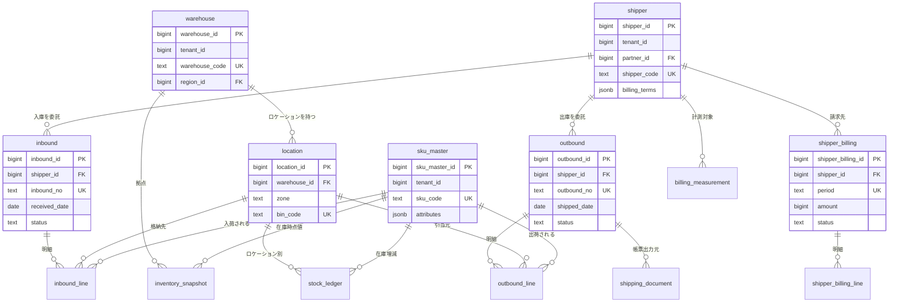
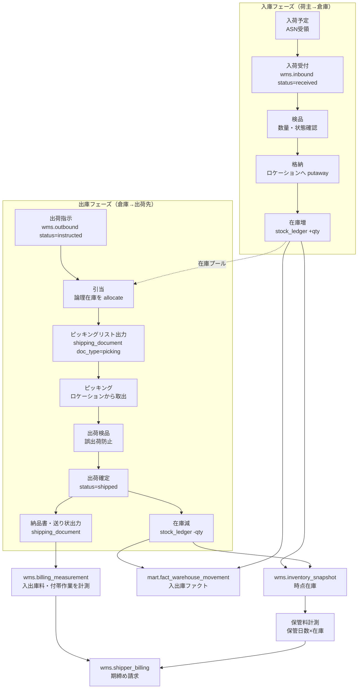
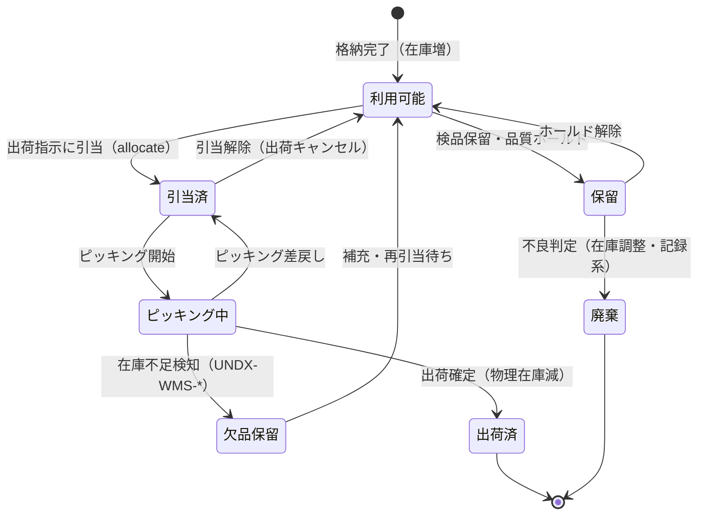
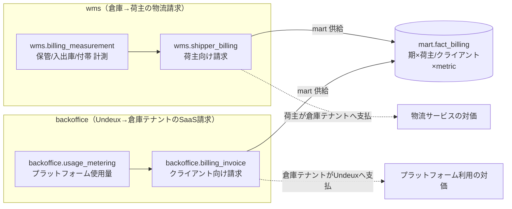

# DB-04 業務OLTPスキーマ設計 — `wms`（WareFlow / 倉庫WMS）

> ステータス: ドラフト（正準設計ブループリント v1.0 準拠）
> 版: 0.1
> 最終更新: 2026-07-04
> 関連ドキュメント:
> - ../database/DB-01-schema-strategy.md（スキーマ戦略・命名・キー・マルチテナント物理）
> - ../database/DB-02-operational-schema-retail.md（`retail` スキーマ。構造の対比）
> - ../database/DB-03-operational-schema-maker.md（`maker` スキーマ。構造の対比）
> - ../database/DB-05-analytics-star-schema.md（`mart_{tenant}` 供給先の次元/ファクト）
> - ../database/DB-06-mapping-metadata-schema.md（`mapping`+`staging`。自社直結の恒等マッピング）
> - ../database/DB-07-backoffice-schema.md（`backoffice`。荷主請求とプラットフォーム請求の関係）
> - ../detailed-design/DD-01-canonical-data-model.md（正準データモデル OLTP+mart 論理）
> - ../detailed-design/DD-02-api-interface-design.md（API リソース・契約・エラー）
> - ../detailed-design/DD-06-security-authz-tenancy.md（認証/認可/テナント分離・RLS）
> - ../basic-design/BD-02-domain-services.md（倉庫業務サービス設計）
> - 継承元: ../../design.md（現行アプリ設計）／../../star-schema-design.md（分析mart設計）

---

## 1. スキーマ概要と SoT（荷主/shipper 軸）

`wms` スキーマは、モジュール `MOD-WMS`（WareFlow / 倉庫WMS）の業務 OLTP を担う。責務は「SKUマスタ管理＋入出庫・在庫トランザクション＋出荷作業用の帳票出力＋荷主（shipper）への請求管理」であり、3PL（サードパーティ・ロジスティクス）としての倉庫オペレーションを単一スキーマで扱う。分析・可視化は本スキーマを SoT として `mart_{tenant_code}`（../database/DB-05-analytics-star-schema.md）へ派生させる。

小売（`retail`）・メーカー（`maker`）が「商品を所有し売買する主体」であるのに対し、倉庫（`wms`）の主体は**倉庫事業者（テナント）**であり、在庫の所有者は**荷主（shipper）**である。したがって本スキーマの分析軸・請求軸の中心は**荷主（shipper）**になる。荷主は倉庫に保管・出荷を委託する在庫の所有者であり、同時に請求先でもある（ブループリント §10 用語集シード）。

### 1.1 位置づけ（SoT 宣言）

本プラットフォームの SoT マップ（ブループリント §7）における `wms` の担当領域は以下のとおり。**`wms.*`（OLTP）が SoT、`mart_*` / `fact_billing` は派生キャッシュ**である。書込は必ず SoT（`wms.*`）が先、`mart` は `mart.rebuild()` による事後の冪等再構築で反映する。逆順（mart 先行更新）は禁止する（原則6・ADR-009）。

| データ領域 | SoT | 派生/キャッシュ | 回復パス（再同期） |
|---|---|---|---|
| SKUマスタ | `wms.sku_master` | `shared.sku`（正準射影・任意）→ `mart.dim_sku` | 恒等マッピング再実行 → `mart.rebuild()` |
| 荷主マスタ | `wms.shipper`（＋`shared.trading_partner`） | `mart.dim_customer`（荷主を販売先軸へ射影） | `mart.rebuild()` |
| 倉庫・ロケーションマスタ | `wms.warehouse` / `wms.location` | `mart.dim_warehouse` | `mart.rebuild()` |
| 入出庫トランザクション | `wms.inbound(_line)` / `wms.outbound(_line)` | `mart.fact_warehouse_movement` | `mart.rebuild()` |
| 在庫時点値 | `wms.inventory_snapshot`（＋`wms.stock_ledger`：拡張提案） | `mart.fact_inventory_snapshot`（`location_type='warehouse'`＋`warehouse_key`・R4） | `mart.rebuild()` |
| 出荷作業帳票 | `wms.shipping_document`（メタ）＋ オブジェクトストレージ（実体） | なし（帳票は mart 非供給・業務出力） | 帳票再レンダリング（冪等） |
| 荷主請求（計測→請求） | `wms.shipper_billing(_line)` | `mart.fact_billing`（期×荷主×metric） | `mart.rebuild()` / 期締め再計算 |

> **継承元との対応:** 現行 UndeuxSales は倉庫業務を扱わないため、`wms` スキーマは本プラットフォームの**新規スキーマ**である。ただし SKU（単品）・在庫スナップショット・汎用バリアント2軸・SCD1・`attributes jsonb`＋生成列・mart 派生といった設計思想は継承資産（../../design.md / ../../star-schema-design.md）と `retail` / `maker` から一貫して踏襲する。

### 1.2 前提

- **テナント境界:** `account_type='warehouse'` の `shared.tenant`（倉庫事業者）。OLTP は共有テーブル＋ PostgreSQL RLS（`tenant_id` 論理列）で分離（ブループリント §8.3、../detailed-design/DD-06-security-authz-tenancy.md）。接続時にセッション変数 `app.tenant_id` を設定する。
- **荷主（shipper）とテナントの区別:** テナント＝倉庫事業者、荷主＝在庫所有者（倉庫の顧客）。荷主は `shared.trading_partner`（`partner_type='customer'`）を基盤に `wms.shipper` で倉庫固有属性（請求条件）を保持する。1テナント配下に複数荷主が存在する。
- **在庫所有権:** ロケーションに置かれた在庫は物理的には倉庫にあるが、**所有権は荷主にある**。したがって在庫は「倉庫 × 荷主 × SKU × ロケーション」の粒度で識別する。荷主別在庫の分別は倉庫請求（保管料）と誤出荷防止の前提。
- **地域粒度:** テナントの `shared.tenant.region_granularity`（`prefecture` / `municipality`）で動的切替。倉庫 `wms.warehouse` は `shared.region`（自己参照階層）へ FK で紐付く。
- **金額型:** 最小通貨単位の整数 `bigint`（`shared.currency.minor_unit` で桁解釈、ADR-005）。数量は `int`、測定値で小数を要するもの（重量・容積・保管日数按分等）は `numeric`。
- 本書は物理スキーマの SoT。論理モデルの正規定義は ../detailed-design/DD-01-canonical-data-model.md、命名・キー・マルチテナント物理方針は ../database/DB-01-schema-strategy.md が SoT。

---

## 2. ERD（`wms` スキーマ）

`wms` スキーマの中核は「SKUマスタ（`sku_master`）」「拠点マスタ（`warehouse` → `location`）」「荷主マスタ（`shipper`）」「入庫（`inbound` → `inbound_line`）」「出庫（`outbound` → `outbound_line`）」「在庫（`inventory_snapshot`＋在庫台帳 `stock_ledger`）」「出荷帳票（`shipping_document`）」「荷主請求（`shipper_billing` → `shipper_billing_line`）」の8系統である。すべての入出庫明細（`*_line`）は `sku_master` と `location` を参照し、SKU × ロケーションが在庫移動を横断して結ぶ単一の粒度になる。入出庫ヘッダは `shipper`（荷主）へ FK で接続する。

以下の ERD は主要 FK と自然キーを示す（監査列 `created_at/updated_at/created_by/updated_by` と `tenant_id` は全業務テーブル共通のため省略）。図中の `stock_ledger`・`billing_measurement` は在庫台帳・請求計測の記録系として本書で提案する拡張要素であり、§9・§7 で詳述する。



上図の要点は3つである。第1に、`shipper`（荷主）が入庫・出庫・請求すべてのヘッダの基点になっており、倉庫業務の分析・請求軸が荷主であることを構造で表す。第2に、`sku_master` と `location` の交点で在庫移動が記録され、在庫が「どの SKU がどのロケーションに何個あるか」で一意に決まる。第3に、`shipping_document`（帳票）と `billing_measurement`（請求計測）は出庫トランザクションから派生する下流であり、業務出力（帳票）と課金計測（請求）を SoT トランザクションから決定的に導出する。

---

## 3. SKUマスタ・ロケーションマスタ・荷主マスタ

### 3.1 SKUマスタ（`wms.sku_master`）

倉庫WMSにおける SKU は「倉庫が物理的に取り扱う最小の保管・出荷単位」であり、荷主の商品体系に依存する。`retail.product_sku` / `maker.product_sku` が「所有者の商品マスタ」であるのに対し、`wms.sku_master` は**荷主から預かる物品の倉庫視点の台帳**である。

| 項目 | 定義 |
|---|---|
| PK | `sku_master_id`（サロゲート bigint） |
| 自然キー(UNIQUE) | `(tenant_id, sku_code)` |
| 汎用バリアント2軸 | `variant_axis1_label/value`, `variant_axis2_label/value`（アパレル=色/サイズ、食品=容量/味を1構造で吸収。ADR-008） |
| 拡張属性 | `attributes jsonb`（重量・容積・危険物区分・温度帯・ロット管理要否・シリアル管理要否等）＋主要軸は生成列 |

> **正準 SKU（`shared.sku`）との対応:** 荷主が同一プラットフォーム上の小売/メーカーテナントである場合、`wms.sku_master` は `shared.sku` へ紐付け可能（`shared_sku_id` を任意 FK として保持：拡張提案）。荷主が外部事業者の場合は `wms.sku_master` 単独で完結し、mart への供給時に `dim_sku` へ射影する。この二経路により、プラットフォーム内荷主（名寄せ可能）と外部荷主（倉庫内で自己完結）の両方をグレースフルに扱う。

### 3.2 ロケーションマスタ（`wms.warehouse` / `wms.location`）

拠点は「倉庫（`warehouse`）＞ ロケーション（`location`）」の2階層で表す。ロケーションはゾーン（`zone`：入荷/保管/出荷/返品等）とビン（`bin_code`：棚番地）で構成する。

| テーブル | PK | 自然キー(UNIQUE) | 主要属性 |
|---|---|---|---|
| `wms.warehouse` | `warehouse_id` | `(tenant_id, warehouse_code)` | `name`, `region_id`（`shared.region` 階層へ FK） |
| `wms.location` | `location_id` | `(tenant_id, warehouse_id, bin_code)` | `zone`, `bin_code`, `location_type`（拡張提案：picking/bulk/staging/quarantine） |

> ロケーションはピッキング効率・保管効率・荷主分別の基本単位。荷主別に専用ゾーンを割り当てる運用（占有保管）と、共有ロケーションに荷主混在で置く運用（フリーロケーション）の両方があるため、在庫の所有権判定はロケーション属性ではなく在庫レコード（§5）の `shipper_id` で行う。

### 3.3 荷主マスタ（`wms.shipper`）

荷主は倉庫の顧客であり請求先。`shared.trading_partner`（`partner_type='customer'`）を基盤に、倉庫固有の請求条件を `wms.shipper` で保持する。

| 項目 | 定義 |
|---|---|
| PK | `shipper_id`（サロゲート bigint） |
| 自然キー(UNIQUE) | `(tenant_id, shipper_code)` |
| `partner_id` | `shared.trading_partner` への FK（名寄せ・地域紐付けの基盤） |
| `billing_terms jsonb` | 保管料単価（保管日数按分/坪単価/パレット単価）・入出庫料単価・付帯作業単価・締め日・課金方式を保持（拡張提案：詳細な料率テーブル化は §7・§11 参照） |

---

## 4. 入庫/出庫トランザクション（入荷・検品・格納・ピッキング・出荷）

### 4.1 業務フロー（入庫→格納→ピッキング→出荷）

倉庫オペレーションは「入庫（入荷→検品→格納）」と「出庫（受注→引当→ピッキング→検品→出荷）」の2フェーズからなる。以下のフローは、荷主から預かった在庫が倉庫に入り、出荷されるまでの物理・データ両面の流れを示す。各ステップは `inbound` / `outbound` のヘッダ `status` と在庫台帳（`stock_ledger`）の増減で記録され、SoT への書込が先・mart 反映が後の順序を厳守する。



図のとおり、入庫フェーズの最終成果は「格納完了＝在庫増（`stock_ledger +qty`）」であり、出庫フェーズの起点は「出荷指示＝引当（論理在庫の allocate）」である。格納で積み上がった在庫プールが引当の対象になり、出荷確定で在庫が減る。同時に、入出庫の各作業は請求計測（`billing_measurement`）の課金イベントとして記録され、期締めで `shipper_billing` に集約される（§7）。この「作業＝課金イベント」の対応が倉庫請求の SoT である。

### 4.2 入庫トランザクション（`wms.inbound` / `wms.inbound_line`）

| テーブル | グレイン | 自然キー(UNIQUE) | 主要属性 |
|---|---|---|---|
| `wms.inbound` | 1入荷（荷主×入荷番号） | `(tenant_id, inbound_no)` | `shipper_id`, `received_date`, `status` |
| `wms.inbound_line` | 入荷明細（1入荷×SKU×格納先） | `(inbound_id, line_no)` | `sku_master_id`, `qty`, `location_id`（格納先）, `lot_no`/`serial_no`（拡張提案） |

入荷は「入荷受付 → 検品 → 格納」で進む。検品結果（良品/不良/保留）は明細の `attributes jsonb` またはステータスで保持し、格納完了時に在庫台帳（`stock_ledger`）へ増加を記録する。検品差異（予定と実績の数量差）はグレースフルに扱い、差異があっても主要フローを止めず差異レコードとして記録し `UNDX-WMS-*` を付与する（原則4）。

### 4.3 出庫トランザクション（`wms.outbound` / `wms.outbound_line`）

| テーブル | グレイン | 自然キー(UNIQUE) | 主要属性 |
|---|---|---|---|
| `wms.outbound` | 1出荷（荷主×出荷番号） | `(tenant_id, outbound_no)` | `shipper_id`, `shipped_date`, `status` |
| `wms.outbound_line` | 出荷明細（1出荷×SKU×引当元） | `(outbound_id, line_no)` | `sku_master_id`, `qty`, `location_id`（引当/ピッキング元）, `lot_no`/`serial_no`（拡張提案） |

出庫は「出荷指示 → 引当 → ピッキング → 出荷検品 → 出荷確定」で進む。引当（allocate）で論理在庫を確保し、ピッキングで物理在庫をロケーションから取り出し、出荷確定で在庫台帳へ減少を記録する。引当の状態遷移は §5.3 に示す。

---

## 5. 在庫トランザクション（ロケーション別在庫・ロット/シリアル・引当/論理在庫）

### 5.1 在庫の記録方式（台帳＋スナップショット）

在庫は2つの表現を併用する。SoT は**在庫台帳（`wms.stock_ledger`：拡張提案）**であり、入出庫・調整・棚卸のすべての在庫増減を追記専用（append-only）で記録する。**スナップショット（`wms.inventory_snapshot`）**は台帳から導出される時点在庫のキャッシュであり、mart の `fact_inventory_snapshot` への供給元となる。

| 表現 | テーブル | 性質 | SoT/派生 |
|---|---|---|---|
| 在庫台帳 | `wms.stock_ledger`（拡張提案） | 追記専用・全増減イベント | **SoT（記録系・巻戻し禁止、原則2）** |
| 時点在庫 | `wms.inventory_snapshot` | 時点集約（倉庫×荷主×SKU×時点） | 派生（台帳から冪等導出） |

> **在庫の粒度:** 在庫は「倉庫 × 荷主 × SKU × ロケーション × （ロット/シリアル）」で識別する。ブループリント §3.4 の `wms.inventory_snapshot` 自然キー `(tenant_id, warehouse_id, sku_master_id, as_of_date)` を基本とし、荷主分別・ロケーション別・ロット別の詳細は在庫台帳（`stock_ledger`）側で保持する（スナップショットは分析供給向けの集約グレイン、台帳は業務精度のグレイン）。

### 5.2 ロット/シリアル管理

ロット管理・シリアル管理は SKU 属性（`sku_master.attributes->>'lot_managed'` / `serial_managed`）で要否を切替える。管理対象 SKU では入出庫明細に `lot_no` / `serial_no`（拡張提案）を保持し、先入先出（FEFO/FIFO）引当・トレーサビリティ・リコール対応の基盤とする。非管理 SKU は数量のみで扱い、グレースフルに両方式を共存させる。

### 5.3 引当/論理在庫の状態遷移

在庫は「物理在庫（実際にロケーションにある数）」と「論理在庫（引当可能な数＝物理在庫 − 引当済 − 保留）」を区別する。出荷指示に対して引当を行うと論理在庫が減り、ピッキング・出荷確定で物理在庫が減る。以下の状態遷移は、在庫が引当を通じて出荷に至る過程と、キャンセル・欠品時の巻き戻しを示す。



図の要点は、引当（論理在庫の確保）と出荷確定（物理在庫の減算）を明確に分離している点である。引当済からの出荷キャンセルは論理在庫を戻すのみで物理在庫に影響せず、出荷確定で初めて物理在庫が減る。欠品保留・品質ホールド・廃棄は在庫台帳への調整イベントとして記録され、いずれも記録系として巻き戻さない（原則2）。不正な状態遷移（例：利用可能を経ずに出荷）はアプリ層（../detailed-design/DD-02-api-interface-design.md）で強制し、`UNDX-WMS-*` を返す。DB 層では `status` を CHECK 制約で許容値に限定する。

---

## 6. 出荷作業帳票（ピッキングリスト/納品書/送り状の出力元データ）

倉庫の出荷作業では、ピッキングリスト・納品書・送り状（配送ラベル）などの帳票を出力する。これらは出庫トランザクション（`wms.outbound` / `wms.outbound_line`）を出力元データとし、レンダリング結果（PDF 等）の実体は**オブジェクトストレージ**（ブループリント §8.5）に保存する。DB にはメタデータ（`wms.shipping_document`）のみを保持する。

| 帳票 | doc_type | 出力元データ | レンダリングタイミング |
|---|---|---|---|
| ピッキングリスト | `picking` | `outbound` + `outbound_line` + `location`（棚番地順） | 引当確定後 |
| 納品書 | `delivery_note` | `outbound` + `outbound_line` + `shipper` + 出荷先 | 出荷確定後 |
| 送り状/配送ラベル | `shipping_label` | `outbound` + 出荷先住所（`shared.region`）+ 配送業者 | 出荷確定後 |

`wms.shipping_document` は `(tenant_id, outbound_id, doc_type)` を自然キーとし、`rendered_uri`（オブジェクトストレージ上の実体参照）・`rendered_at`・`render_status` を保持する。

> **冪等な再レンダリング（グレースフルデグラデーション）:** 帳票レンダリングは補助処理であり、失敗しても主要な出荷フロー（在庫減・出荷確定）を止めない（原則4）。`shipping_document` メタは `(outbound_id, doc_type)` で UPSERT し、再出力は同一 URI を上書き（冪等）。レンダリング失敗時は `render_status='failed'` ＋ `UNDX-WMS-*` を記録し、後追いの再レンダリングで回復する。帳票実体は SoT（`outbound`）から常に再生成可能なため、オブジェクトストレージは派生キャッシュ扱い（§9・原則2）。
>
> **レスポンシブ（原則8）:** 出荷作業画面は倉庫現場でハンディターミナル・タブレットからの利用が主となるため、PC のリスト/テーブル表示に加えモバイル/ハンディではカード型・大きなタップ領域の可読形式を採用する（../detailed-design/DD-05-screen-ux-si-strategy.md）。帳票 PDF 自体は固定レイアウトだが、作業指示画面（ピッキング指示・格納指示）はモバイル前提のレイアウトを必須とする。

---

## 7. 荷主請求（保管料/入出庫料/付帯作業の計測→請求。バックオフィス請求との関係）

### 7.1 計測→請求の2段構え

荷主請求は「計測（measurement）→ 請求（billing）」の2段で構成する。計測は日々の業務イベント（在庫保管・入出庫・付帯作業）を課金メトリクスとして**追記専用**で記録し、請求は期締めで計測を集約して確定する。

| 課金項目 | 計測元 | メトリクス例 | 課金方式 |
|---|---|---|---|
| 保管料 | `wms.inventory_snapshot`（日次在庫） | 保管日数×在庫数、坪数、パレット数 | 日割按分/坪単価/パレット単価 |
| 入庫料 | `wms.inbound_line` | 入荷行数・入荷数量 | 行/個/パレット単価 |
| 出庫料 | `wms.outbound_line` | 出荷行数・出荷数量 | 行/個/オーダー単価 |
| 付帯作業料 | `wms.billing_measurement`（拡張提案） | 検品・ラベル貼付・流通加工・返品処理の作業量 | 作業単位単価 |

### 7.2 記録系の保護（原則2）

計測レコード（`wms.billing_measurement`：拡張提案）は**記録系・巻戻し禁止**とする。`backoffice.usage_metering` と同じ設計思想（追記のみ・再実行で既存計測が巻き戻らない）を倉庫請求に適用する。請求（`wms.shipper_billing`）は期（`period`）締めで**再計算可能**（設定系料率の変更を反映した期内再計算は許容するが、確定済み請求 `status='issued'` は改訂履歴を残す）。

| テーブル | 性質 | 保護方針 |
|---|---|---|
| `wms.billing_measurement`（拡張提案） | 記録系・追記専用 | 巻戻し禁止（原則2） |
| `wms.shipper_billing` | 確定系・期締め | 未確定は再計算可、確定後は改訂履歴保持（下位互換・原則7） |
| `wms.shipper_billing_line`（拡張提案） | 請求明細 | 請求ヘッダに従属 |

### 7.3 バックオフィス請求（`backoffice`）との関係

倉庫の荷主請求（`wms.shipper_billing`：倉庫→荷主の物流サービス料）と、プラットフォームのバックオフィス請求（`backoffice.billing_invoice`：Undeux→倉庫テナントの SaaS 利用料）は**別レイヤの請求**である。両者を混同しない。



図のとおり、両請求は課金の向き・主体が異なる（荷主請求＝倉庫テナントの売上、SaaS 請求＝Undeux の売上）が、分析上はどちらも `mart.fact_billing`（期×`customer`（荷主）または`customer`（クライアント）×metric）へコンフォームする。`fact_billing` の次元キーは `dim_customer`（荷主/クライアントを販売先軸へ射影）と `dim_date`（期）で共通化する（ブループリント §4.2）。詳細は ../database/DB-07-backoffice-schema.md が SoT。

---

## 8. 代表テーブル DDL（sql）

以下は PostgreSQL 16 を前提とした代表テーブルの DDL（`wms` スキーマ）。PK はサロゲート `bigint`（`GENERATED ALWAYS AS IDENTITY`）、自然キーは UNIQUE 制約、金額は `bigint`、業種固有属性は `jsonb`＋生成列とする。監査列・`tenant_id` は全テーブル共通のため `sku_master` に代表して記載する（他テーブルも同様に持つ）。`stock_ledger` / `billing_measurement` / `shipper_billing_line` はブループリント §3.4 未掲載の**拡張提案**である（在庫記録系の SoT 化・請求計測の記録系保護のため。§11 で ADR 起票要）。

```sql
-- SKUマスタ: 倉庫視点の物品台帳。sku_code が自然キー、汎用バリアント2軸
CREATE TABLE wms.sku_master (
    sku_master_id       bigint GENERATED ALWAYS AS IDENTITY PRIMARY KEY,
    tenant_id           bigint NOT NULL,                       -- RLS 論理列
    sku_code            text   NOT NULL,                       -- 倉庫内SKUコード（自然キー）
    name                text   NOT NULL,
    shared_sku_id       bigint REFERENCES shared.sku(sku_id),  -- 拡張提案: PF内荷主の正準SKU名寄せ(任意)
    variant_axis1_label text,                                  -- 例: カラー / 温度帯
    variant_axis1_value text,
    variant_axis2_label text,                                  -- 例: サイズ / 容量
    variant_axis2_value text,
    attributes          jsonb  NOT NULL DEFAULT '{}'::jsonb,   -- 重量/容積/危険物/ロット・シリアル要否等
    lot_managed         boolean GENERATED ALWAYS AS ((attributes->>'lot_managed')::boolean) STORED,
    serial_managed      boolean GENERATED ALWAYS AS ((attributes->>'serial_managed')::boolean) STORED,
    created_at          timestamptz NOT NULL DEFAULT now(),
    updated_at          timestamptz NOT NULL DEFAULT now(),
    created_by          bigint,
    updated_by          bigint,
    CONSTRAINT uq_wms_sku_master_natural UNIQUE (tenant_id, sku_code)
);

-- 倉庫マスタ: warehouse_code が自然キー、地域階層へ FK
CREATE TABLE wms.warehouse (
    warehouse_id   bigint GENERATED ALWAYS AS IDENTITY PRIMARY KEY,
    tenant_id      bigint NOT NULL,
    warehouse_code text   NOT NULL,
    name           text   NOT NULL,
    region_id      bigint REFERENCES shared.region(region_id),
    created_at     timestamptz NOT NULL DEFAULT now(),
    updated_at     timestamptz NOT NULL DEFAULT now(),
    CONSTRAINT uq_wms_warehouse_natural UNIQUE (tenant_id, warehouse_code)
);

-- ロケーションマスタ: 倉庫×棚番地が自然キー、ゾーン区分を保持
CREATE TABLE wms.location (
    location_id   bigint GENERATED ALWAYS AS IDENTITY PRIMARY KEY,
    tenant_id     bigint NOT NULL,
    warehouse_id  bigint NOT NULL REFERENCES wms.warehouse(warehouse_id),
    zone          text   NOT NULL,                              -- 入荷/保管/出荷/返品/検疫
    bin_code      text   NOT NULL,                              -- 棚番地（自然キー構成）
    location_type text   NOT NULL DEFAULT 'picking'            -- 拡張提案
        CHECK (location_type IN ('picking','bulk','staging','quarantine')),
    created_at    timestamptz NOT NULL DEFAULT now(),
    updated_at    timestamptz NOT NULL DEFAULT now(),
    CONSTRAINT uq_wms_location_natural UNIQUE (tenant_id, warehouse_id, bin_code)
);

-- 荷主マスタ: shipper_code が自然キー、trading_partner を基盤に請求条件を保持
CREATE TABLE wms.shipper (
    shipper_id     bigint GENERATED ALWAYS AS IDENTITY PRIMARY KEY,
    tenant_id      bigint NOT NULL,
    partner_id     bigint NOT NULL REFERENCES shared.trading_partner(partner_id),
    shipper_code   text   NOT NULL,
    name           text   NOT NULL,
    billing_terms  jsonb  NOT NULL DEFAULT '{}'::jsonb,         -- 保管/入出庫/付帯 料率・締め日・課金方式
    created_at     timestamptz NOT NULL DEFAULT now(),
    updated_at     timestamptz NOT NULL DEFAULT now(),
    CONSTRAINT uq_wms_shipper_natural UNIQUE (tenant_id, shipper_code)
);

-- 入庫ヘッダ: 荷主×入荷番号が自然キー、ステータスは CHECK で限定
CREATE TABLE wms.inbound (
    inbound_id    bigint GENERATED ALWAYS AS IDENTITY PRIMARY KEY,
    tenant_id     bigint NOT NULL,
    shipper_id    bigint NOT NULL REFERENCES wms.shipper(shipper_id),
    inbound_no    text   NOT NULL,
    received_date date   NOT NULL,
    status        text   NOT NULL DEFAULT 'scheduled'
        CHECK (status IN ('scheduled','received','inspected','putaway','closed','cancelled')),
    created_at    timestamptz NOT NULL DEFAULT now(),
    updated_at    timestamptz NOT NULL DEFAULT now(),
    CONSTRAINT uq_wms_inbound_natural UNIQUE (tenant_id, inbound_no)
);

-- 入庫明細: 1入荷×SKU×格納先、ロット/シリアルは拡張提案
CREATE TABLE wms.inbound_line (
    inbound_line_id bigint GENERATED ALWAYS AS IDENTITY PRIMARY KEY,
    inbound_id      bigint NOT NULL
        REFERENCES wms.inbound(inbound_id) ON DELETE CASCADE,
    line_no         int    NOT NULL,
    sku_master_id   bigint NOT NULL REFERENCES wms.sku_master(sku_master_id),
    qty             int    NOT NULL,
    inspected_qty   int,                                        -- 検品実績（予定との差異検知）
    location_id     bigint REFERENCES wms.location(location_id),-- 格納先
    lot_no          text,                                       -- 拡張提案(ロット管理SKU)
    serial_no       text,                                       -- 拡張提案(シリアル管理SKU)
    CONSTRAINT uq_wms_inbound_line_natural UNIQUE (inbound_id, line_no)
);

-- 出庫ヘッダ: 荷主×出荷番号が自然キー
CREATE TABLE wms.outbound (
    outbound_id  bigint GENERATED ALWAYS AS IDENTITY PRIMARY KEY,
    tenant_id    bigint NOT NULL,
    shipper_id   bigint NOT NULL REFERENCES wms.shipper(shipper_id),
    outbound_no  text   NOT NULL,
    shipped_date date,                                          -- 出荷確定時に設定
    status       text   NOT NULL DEFAULT 'instructed'
        CHECK (status IN ('instructed','allocated','picking','packed','shipped','cancelled')),
    created_at   timestamptz NOT NULL DEFAULT now(),
    updated_at   timestamptz NOT NULL DEFAULT now(),
    CONSTRAINT uq_wms_outbound_natural UNIQUE (tenant_id, outbound_no)
);

-- 出庫明細: 1出荷×SKU×引当元ロケーション
CREATE TABLE wms.outbound_line (
    outbound_line_id bigint GENERATED ALWAYS AS IDENTITY PRIMARY KEY,
    outbound_id      bigint NOT NULL
        REFERENCES wms.outbound(outbound_id) ON DELETE CASCADE,
    line_no          int    NOT NULL,
    sku_master_id    bigint NOT NULL REFERENCES wms.sku_master(sku_master_id),
    qty              int    NOT NULL,
    picked_qty       int,                                       -- ピッキング実績
    location_id      bigint REFERENCES wms.location(location_id),-- 引当/ピッキング元
    lot_no           text,                                      -- 拡張提案
    serial_no        text,                                      -- 拡張提案
    CONSTRAINT uq_wms_outbound_line_natural UNIQUE (outbound_id, line_no)
);

-- 在庫台帳（拡張提案・SoT・追記専用）: 全在庫増減イベントを記録
CREATE TABLE wms.stock_ledger (
    stock_ledger_id bigint GENERATED ALWAYS AS IDENTITY PRIMARY KEY,
    tenant_id       bigint NOT NULL,
    warehouse_id    bigint NOT NULL REFERENCES wms.warehouse(warehouse_id),
    shipper_id      bigint NOT NULL REFERENCES wms.shipper(shipper_id),
    sku_master_id   bigint NOT NULL REFERENCES wms.sku_master(sku_master_id),
    location_id     bigint NOT NULL REFERENCES wms.location(location_id),
    lot_no          text,
    serial_no       text,
    movement_type   text   NOT NULL
        CHECK (movement_type IN ('inbound','outbound','adjust','move','hold','release','scrap')),
    direction       text   NOT NULL CHECK (direction IN ('in','out')),
    qty             int    NOT NULL,                            -- 正の量（方向は direction）
    ref_inbound_line_id  bigint REFERENCES wms.inbound_line(inbound_line_id),
    ref_outbound_line_id bigint REFERENCES wms.outbound_line(outbound_line_id),
    occurred_at     timestamptz NOT NULL DEFAULT now(),
    created_at      timestamptz NOT NULL DEFAULT now(),
    created_by      bigint
    -- 記録系: UPDATE/DELETE 禁止（原則2）。訂正は逆仕訳（adjust）で追記
);

-- 在庫スナップショット（派生・台帳から冪等導出）: 倉庫×荷主×SKU×時点
CREATE TABLE wms.inventory_snapshot (
    inventory_snapshot_id bigint GENERATED ALWAYS AS IDENTITY PRIMARY KEY,
    tenant_id             bigint NOT NULL,
    warehouse_id          bigint NOT NULL REFERENCES wms.warehouse(warehouse_id),
    shipper_id            bigint NOT NULL REFERENCES wms.shipper(shipper_id),
    sku_master_id         bigint NOT NULL REFERENCES wms.sku_master(sku_master_id),
    as_of_date            date   NOT NULL,
    stock                 int    NOT NULL DEFAULT 0,            -- 物理在庫
    allocated             int    NOT NULL DEFAULT 0,            -- 引当済
    available             int    GENERATED ALWAYS AS (stock - allocated) STORED, -- 論理在庫
    attributes            jsonb  NOT NULL DEFAULT '{}'::jsonb,
    created_at            timestamptz NOT NULL DEFAULT now(),
    updated_at            timestamptz NOT NULL DEFAULT now(),
    CONSTRAINT uq_wms_inventory_snapshot_natural
        UNIQUE (tenant_id, warehouse_id, shipper_id, sku_master_id, as_of_date)
);

-- 出荷帳票メタ: 出荷×帳票種別が自然キー、実体はオブジェクトストレージ
CREATE TABLE wms.shipping_document (
    shipping_document_id bigint GENERATED ALWAYS AS IDENTITY PRIMARY KEY,
    tenant_id            bigint NOT NULL,
    outbound_id          bigint NOT NULL REFERENCES wms.outbound(outbound_id),
    doc_type             text   NOT NULL
        CHECK (doc_type IN ('picking','delivery_note','shipping_label')),
    rendered_uri         text,                                  -- オブジェクトストレージ参照
    render_status        text   NOT NULL DEFAULT 'pending'
        CHECK (render_status IN ('pending','rendered','failed')),
    rendered_at          timestamptz,
    created_at           timestamptz NOT NULL DEFAULT now(),
    updated_at           timestamptz NOT NULL DEFAULT now(),
    CONSTRAINT uq_wms_shipping_document_natural
        UNIQUE (tenant_id, outbound_id, doc_type)
);

-- 請求計測（拡張提案・記録系・追記専用）: 課金イベントを計測
CREATE TABLE wms.billing_measurement (
    billing_measurement_id bigint GENERATED ALWAYS AS IDENTITY PRIMARY KEY,
    tenant_id       bigint NOT NULL,
    shipper_id      bigint NOT NULL REFERENCES wms.shipper(shipper_id),
    metric_code     text   NOT NULL,                            -- storage/inbound/outbound/vas 等
    measured_date   date   NOT NULL,
    quantity        numeric NOT NULL,                           -- 保管日数×在庫・行数・作業量
    ref_type        text,                                       -- inbound_line/outbound_line/snapshot
    ref_id          bigint,
    created_at      timestamptz NOT NULL DEFAULT now()
    -- 記録系: 巻戻し禁止（原則2）。usage_metering と同思想
);

-- 荷主請求ヘッダ: 荷主×期が自然キー、金額は最小通貨単位 bigint
CREATE TABLE wms.shipper_billing (
    shipper_billing_id bigint GENERATED ALWAYS AS IDENTITY PRIMARY KEY,
    tenant_id       bigint NOT NULL,
    shipper_id      bigint NOT NULL REFERENCES wms.shipper(shipper_id),
    period          text   NOT NULL,                            -- 例: '2026-06'（月次締め）
    amount          bigint NOT NULL DEFAULT 0,                  -- 最小通貨単位
    currency_id     bigint REFERENCES shared.currency(currency_id),
    status          text   NOT NULL DEFAULT 'draft'
        CHECK (status IN ('draft','confirmed','issued','paid','void')),
    created_at      timestamptz NOT NULL DEFAULT now(),
    updated_at      timestamptz NOT NULL DEFAULT now(),
    CONSTRAINT uq_wms_shipper_billing_natural UNIQUE (tenant_id, shipper_id, period)
);

-- 荷主請求明細（拡張提案）: 請求ヘッダ×metric、単価×数量
CREATE TABLE wms.shipper_billing_line (
    shipper_billing_line_id bigint GENERATED ALWAYS AS IDENTITY PRIMARY KEY,
    shipper_billing_id bigint NOT NULL
        REFERENCES wms.shipper_billing(shipper_billing_id) ON DELETE CASCADE,
    line_no        int    NOT NULL,
    metric_code    text   NOT NULL,
    quantity       numeric NOT NULL,
    unit_price     bigint NOT NULL,                             -- 最小通貨単位
    amount         bigint NOT NULL,                             -- quantity×unit_price（丸め方針は §9）
    CONSTRAINT uq_wms_shipper_billing_line_natural UNIQUE (shipper_billing_id, line_no)
);
```

> `inventory_snapshot` の `available` は物理在庫 − 引当済の生成列（論理在庫）。金額列 `amount` は `numeric` 数量 × `bigint` 単価の結果を丸めるため生成列にせず、アプリ層で丸め規則（`shared.currency.minor_unit` 準拠）を適用して格納する（丸め誤差の一元管理、ADR-005）。

---

## 9. インデックス・制約・在庫の記録系保護（原則2）

### 9.1 インデックス方針

- **自然キー UNIQUE:** 各テーブルの自然キーに UNIQUE 制約（冪等 UPSERT の衝突キー）。
- **FK 索引:** `inbound_line(sku_master_id)` / `outbound_line(sku_master_id)` / `stock_ledger(warehouse_id, shipper_id, sku_master_id, location_id)` に索引を付し、在庫集計・SKU 横断参照を高速化。
- **在庫集計索引:** `stock_ledger` に `(tenant_id, warehouse_id, shipper_id, sku_master_id, occurred_at)` の複合索引を付し、時点在庫の台帳導出（スナップショット再構築）を効率化。
- **請求集計索引:** `billing_measurement(tenant_id, shipper_id, metric_code, measured_date)` で期締め集計を高速化。
- **生成列索引:** `sku_master.lot_managed` / `serial_managed`（jsonb 由来生成列）に部分索引を付し、ロット/シリアル管理対象の絞込を高速化（継承：jsonb+生成列+索引、ADR-007）。

### 9.2 制約

- **CHECK 制約:** 全ステータス列（`inbound.status` / `outbound.status` / `shipping_document.render_status` / `stock_ledger.movement_type,direction` / `shipper_billing.status`）を許容値に限定。状態遷移の順序自体はトリガではなくアプリ層で担保する（グレースフルデグラデーション：補助的な整合チェック失敗が主要な入出庫フローを止めない、原則4）。
- **NULL 一意性:** `inventory_snapshot` の自然キーに `shipper_id` を含めるため（荷主分別）NULL は生じない設計。ロット/シリアル別在庫を snapshot 粒度に含める場合は、`retail` と同じく `NULLS NOT DISTINCT`（PostgreSQL 15+）または `COALESCE` 式インデックスで NULL 重複を防ぐ（../database/DB-02-operational-schema-retail.md §8 注記と同方針）。
- **RLS:** 全業務テーブルに `tenant_id` を持ち、`ENABLE ROW LEVEL SECURITY` ＋ `USING (tenant_id = current_setting('app.tenant_id')::bigint)` のポリシーを付す（../detailed-design/DD-06-security-authz-tenancy.md、`UNDX-TENANT-*`）。荷主境界（同一テナント内で荷主 A の在庫を荷主 B に見せない）はアプリ層の認可スコープで担保する（RLS はテナント境界、荷主境界はアプリ認可の二層）。

### 9.3 在庫の記録系保護（原則2）と冪等 UPSERT

- **在庫台帳（SoT）は追記専用:** `wms.stock_ledger` は入出庫・調整・棚卸のすべてを追記で記録し、UPDATE/DELETE を行わない。訂正は逆仕訳（`movement_type='adjust'`）を追記する。これにより再実行・障害復旧で在庫履歴が巻き戻らない（原則2）。
- **スナップショットは台帳から冪等導出:** `wms.inventory_snapshot` は台帳の残高を `(tenant_id, warehouse_id, shipper_id, sku_master_id, as_of_date)` で UPSERT（`ON CONFLICT ... DO UPDATE`）して再構築する。何度実行しても同一結果（冪等）。スナップショットは派生キャッシュのため TRUNCATE→再構築も可能だが、台帳（SoT）は保護する。
- **請求計測（記録系）は巻戻し禁止:** `wms.billing_measurement` は追記専用（`backoffice.usage_metering` と同思想）。請求 `wms.shipper_billing` は未確定（`draft`）のみ期内再計算し、確定（`issued` 以降）は改訂履歴を残す（下位互換・データ保護、原則7）。
- **同時実行の直列化:** 大量入出庫やバッチ同期は継承資産と同じく PostgreSQL の advisory lock で直列化し、同一テナント/倉庫/期間の並行書込による在庫不整合を防ぐ（../../design.md）。UPSERT 失敗などの想定エラーには `UNDX-WMS-*` / `UNDX-IMP-*`（ブループリント §9）を付与し、補助処理（帳票レンダリング・請求計測導出等）の失敗が主要な入出庫フローを止めない（グレースフルデグラデーション、原則4）。

---

## 10. 分析 mart への供給（fact_warehouse_movement / fact_inventory_snapshot / fact_billing）

`wms`（SoT）→ `mart_{tenant_code}`（派生）の供給は自社アプリ直結のため恒等マッピング（`resolved_by='auto'`、`system_type='self'`）で行い、`mart.rebuild()`（冪等・advisory lock 直列化・`SET LOCAL statement_timeout=0`・非同期実行、ADR-009）で再構築する。各テーブルの供給先は下表（詳細は ../database/DB-05-analytics-star-schema.md）。

| `wms`（SoT） | 供給先 mart | グレイン変換 | 備考 |
|---|---|---|---|
| `sku_master` | `dim_sku`（SCD1） | 1単品 | 汎用バリアント2軸、PF内荷主は `shared.sku` 名寄せ |
| `warehouse` | `dim_warehouse`（SCD1） | 1倉庫 | `region_key`・`shipper_ref` を保持（ブループリント §4.1） |
| `shipper`（＋`trading_partner`） | `dim_customer`（SCD1） | 1荷主→販売先軸 | 荷主を販売先として射影（`partner_type`） |
| `stock_ledger`（＋`inbound_line`/`outbound_line`） | `fact_warehouse_movement` | 在庫増減→日×倉庫×SKU×方向 | `movement_qty`, `direction(in/out)`、加算可 |
| `inventory_snapshot` | `fact_inventory_snapshot` | 時点→週×拠点(倉庫)×SKU | セミアディティブ・**`location_type='warehouse'` ＋ `warehouse_key`** で供給（DB-05 §4.2・§8.2b の CHECK `ck_fact_inv_location`・R4）。小売店頭(`retailer`)・メーカー自社(`vendor`)在庫と同一ファクトに排他共存 |
| `billing_measurement`／`shipper_billing_line` | `fact_billing` | 計測/請求明細→期×荷主×metric | `amount(bigint)`, `quantity`、加算可 |

以下のフローは、荷主から預かった在庫の入出庫・保管・請求が `wms` OLTP（SoT）に記録され、恒等マッピングを経て mart へ集約され、分析・AI・意思決定支援に至るまでの流れを示す。SoT 書込が先、mart 反映が後の順序を厳守する。

```mermaid
flowchart TD
    IB[入庫<br/>wms.inbound + inbound_line] --> LDG[wms.stock_ledger<br/>在庫台帳 SoT]
    OB[出庫<br/>wms.outbound + outbound_line] --> LDG
    LDG --> SNAP[wms.inventory_snapshot<br/>時点在庫・台帳から導出]
    MEAS[wms.billing_measurement<br/>保管/入出庫/付帯 計測] --> SBILL[wms.shipper_billing<br/>期締め請求]

    subgraph SoT["wms（OLTP = SoT）"]
        LDG
        SNAP
        SBILL
    end

    LDG -->|恒等マッピング resolved_by=auto| MAP[mapping.mapping_job<br/>system_type=self]
    SNAP --> MAP
    SBILL --> MAP
    MAP -->|mart.rebuild 冪等・非同期| MART[(mart_&#123;tenant_code&#125;<br/>fact_warehouse_movement / fact_inventory_snapshot / fact_billing)]
    MART --> ANL[InsightMart<br/>在庫健全性/入出庫効率/請求分析]
    ANL --> AI[KnowledgeCore / VirtualCompany<br/>インサイト・意思決定支援]
```



> 図のとおり、在庫台帳（SoT・記録系）が全在庫移動の起点であり、時点在庫スナップショットと請求はそこから導出される。恒等マッピングで mart へ供給し、`fact_warehouse_movement`（入出庫効率）・`fact_inventory_snapshot`（在庫健全性）・`fact_billing`（請求分析）へコンフォームする。荷主請求とバックオフィス請求はともに `fact_billing` へ集約されるが SoT は別（§7.3、../database/DB-07-backoffice-schema.md）。mart 再構築の TRUNCATE は派生のみ対象で、SoT（台帳・計測）は保護される（原則2・ADR-014）。

---

## 11. 未決事項

- **在庫台帳 `wms.stock_ledger` の正式採用:** 本書は在庫増減の SoT を追記専用の台帳とし、`inventory_snapshot` をその派生とする設計を採るが、これはブループリント §3.4 に無い拡張提案。ブループリント改訂（§本書冒頭の変更手順）と decision-log への ADR 起票が必要。台帳を持たず snapshot を直接 SoT とする代替案（継承 `retail`/`maker` の snapshot 準拠）とのトレードオフ（在庫精度・トレーサビリティ vs 単純さ）を要確定。
- **請求計測 `wms.billing_measurement` / 請求明細 `wms.shipper_billing_line` の正式採用:** 計測→請求の2段構えとその記録系保護は拡張提案。ブループリント §3.4 は `shipper_billing`（ヘッダのみ）を定義するため、計測・明細の追加は ADR 起票要。
- **保管料の課金モデル:** 保管料の計測単位（保管日数按分/月末在庫/坪単価/パレット単価/温度帯別）を `billing_terms jsonb` で表すか、独立の料率テーブル（`wms.rate_card`）を設けるか未確定。荷主別・SKU 属性別（危険物/冷蔵）の料率差の扱いを含め要件化時に確定。
- **ロット/シリアルの在庫グレイン:** `inventory_snapshot` の自然キーにロット/シリアルを含めるか（在庫精度向上）、台帳のみで保持しスナップショットは SKU 集約に留めるか（mart グレイン整合）を確定する。FEFO 引当要件の有無に依存。
- **荷主境界の認可方式:** 同一テナント（倉庫事業者）内での荷主間データ分離を、アプリ認可スコープのみで担保するか、`shipper_id` を用いた追加 RLS ポリシーで二重に担保するかは ../detailed-design/DD-06-security-authz-tenancy.md 側の確定に従う。
- **出荷先（配送先）マスタ:** 送り状・納品書の出荷先住所を `shared.trading_partner`（荷主の配送先）として持つか、出荷ヘッダに都度住所を保持するか未確定。B2B（荷主→小売への横持ち）と B2C（EC フルフィルメント）で要件が異なる。
- **入荷予定（ASN）の独立テーブル化:** 入荷予定を `inbound.status='scheduled'` で表すか、独立トランザクション `wms.asn` を設けるか（EDI 連携要件時）。`retail` の goods_receipt 未決事項と対称。
- **棚卸（実地棚卸）トランザクション:** 実地棚卸による在庫調整を `stock_ledger` の `movement_type='adjust'` で表すか、独立の棚卸トランザクション（`wms.stocktake`）を設けるか未確定。
- **RLS ポリシーの詳細:** `app.tenant_id` セッション変数の設定経路とバイパスロール（自社運用横断集計）の扱いは ../detailed-design/DD-06-security-authz-tenancy.md 側の確定に従う。

### 前提（本書で置いた仮定）

- WareFlow のテナントは倉庫事業者（`account_type='warehouse'`）であり、在庫の所有者は荷主（`shipper`）である。倉庫は物流サービスの対価を荷主へ請求する（`shipper_billing`）。
- 荷主はプラットフォーム内の小売/メーカーテナントである場合（正準 SKU 名寄せ可）と、外部事業者である場合（倉庫内で自己完結）の両方があり、SKU 名寄せは任意（`shared_sku_id` NULL 許容）。
- mart のグレイン（在庫=週次、入出庫=日次）と次元構成は継承資産・ブループリント §4 を踏襲し、`wms` OLTP からの集約で満たす。倉庫在庫は `fact_inventory_snapshot` に **`location_type='warehouse'` ＋役割別 `warehouse_key`** で供給する（DB-05 §4.2・§8.2b の CHECK・R4）。継承資産の店頭在庫（`location_type='retailer'`）とメーカー自社在庫（`location_type='vendor'`）と同一ファクト内で拠点タイプにより排他共存する。なお本 `location_type`（在庫保有拠点タイプ＝retailer/warehouse/vendor）は `wms.location.location_type`（ロケーション種別＝picking/bulk/staging/quarantine・§3.2）とは別概念である。
- 金額は単一通貨（`currency_id` で解釈）を請求内で混在させない前提（多通貨請求は未対応、要件化時に検討）。
- 荷主請求（倉庫→荷主）とバックオフィス請求（Undeux→倉庫テナント）は別レイヤであり、`fact_billing` で分析上コンフォームするが SoT は各々別（`wms.shipper_billing` / `backoffice.billing_invoice`）。
