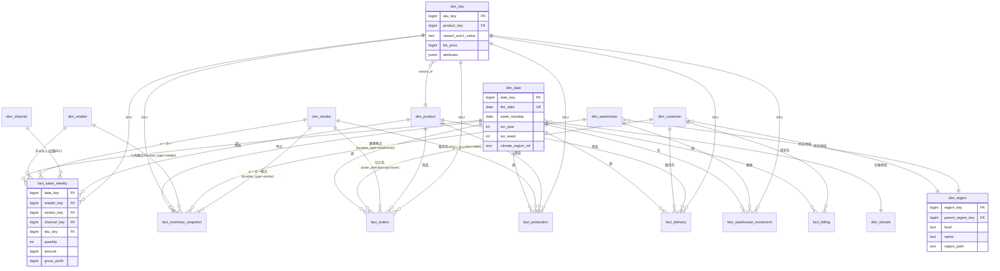
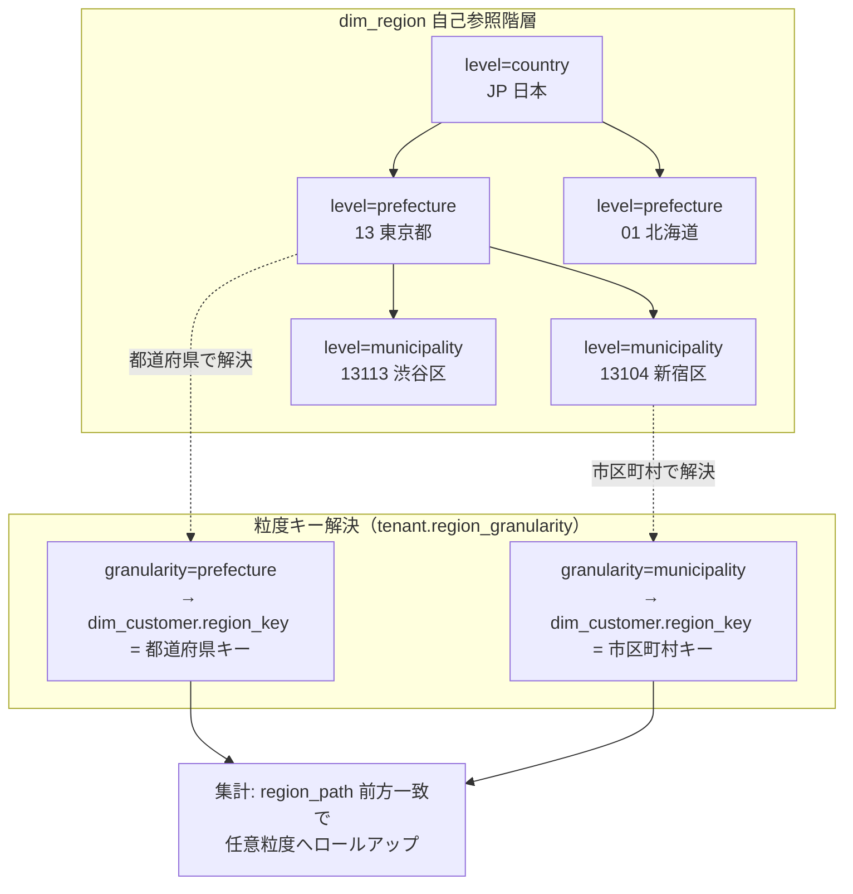
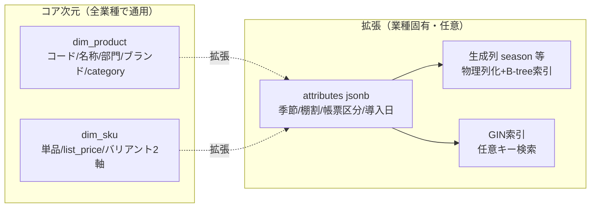
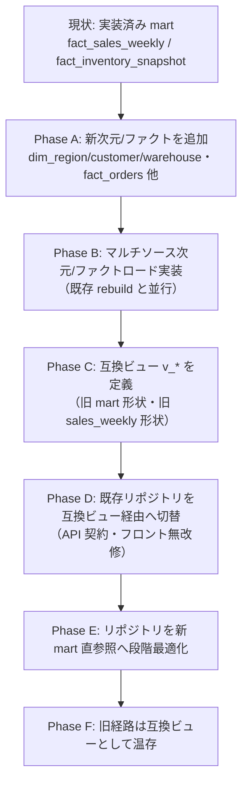

# DB-05 分析スタースキーマ（`mart_{tenant_code}`）— Undeux Platform（UCP）データベース設計

> **ステータス:** ドラフト（レビュー前）
> **版:** v1.0
> **最終更新:** 2026-07-04
> **関連ドキュメント:** [正準設計ブループリント v1.0]（全ドキュメント共通契約）／ [DB-01 スキーマ戦略総論](./DB-01-schema-strategy.md) ／ [DB-02 retail 物理スキーマ](./DB-02-operational-schema-retail.md) ／ [DB-03 maker 物理スキーマ](./DB-03-operational-schema-maker.md) ／ [DB-04 wms 物理スキーマ](./DB-04-operational-schema-wms.md) ／ [DB-06 マッピングメタデータスキーマ](./DB-06-mapping-metadata-schema.md) ／ [DB-07 backoffice スキーマ](./DB-07-backoffice-schema.md) ／ [DB-08 knowledge/ベクター/スナップショットスキーマ](./DB-08-knowledge-vector-snapshot-schema.md) ／ [DD-01 正準データモデル](../detailed-design/DD-01-canonical-data-model.md) ／ [BD-03 分析・AI プラットフォーム](../basic-design/BD-03-analytics-ai-platform.md) ／ 継承元: [現行アプリ設計](../../design.md)・[分析mart設計](../../star-schema-design.md)

---

本ドキュメントは Undeux Platform（略称 **UCP**、プロダクト系統コード `UNDX`）の**分析スタースキーマ（`mart_{tenant_code}`）**の物理設計を確定する。コンフォームド次元群・ファクト家族・グレイン・SCD・拡張（jsonb＋生成列）・既存 mart 継承・互換ビュー段階移行・冪等 `rebuild()` を定義し、プラットフォームの「分析定型スキーマの正」を成す。

名称・ID・SoT・命名規約はすべて **正準設計ブループリント v1.0**（特に §4 コンフォームド分析モデルカタログ・§7 SoT 宣言マップ・§8 命名/キー/型方針）が SoT である。本書はブループリント §4 を物理設計の観点から具体化する。ブループリントと矛盾する場合はブループリントを優先する。ブループリントに無い要素を補う場合は「**（拡張提案）**」と明記する。継承元 [docs/star-schema-design.md](../../star-schema-design.md) の実装済み mart（`dim_date`/`dim_retailer`/`dim_vendor`/`dim_product`/`dim_sku`/`dim_climate`／`fact_sales_weekly`/`fact_inventory_snapshot`）を出発点とし、それを一般化する。

---

## 0. 本書の位置づけと前提

### 0.1 本書が定義するもの

| 本書が確定する事項 | 節 | 参照/波及先 |
|---|---|---|
| 設計方針（コンフォームド・派生・一般化） | §1 | DB-01 §9、ADR-006 |
| mart 全体 ERD | §2 | DD-01 |
| コンフォームド次元定義（10次元） | §3 | ブループリント §4.1 |
| ファクト定義（7ファクト家族） | §4 | ブループリント §4.2 |
| 地域粒度の動的化 | §5 | ADR-003 |
| 汎用バリアント/拡張属性（jsonb＋生成列） | §6 | ADR-007/008、DB-01 §7 |
| 既存 mart 継承・互換ビュー移行 | §7 | ADR-006/013 |
| 代表 DDL・インデックス方針 | §8 | DB-01 §4/§6/§7 |
| マテビュー/集約とパフォーマンス | §9 | ブループリント §7 |
| ソース→mart マッピングの受け口 | §10 | [DB-06](./DB-06-mapping-metadata-schema.md) |
| 未決事項・前提 | §11/末尾 | — |

### 0.2 前提（明記）

- 物理配置は**テナント別スキーマ分離** `mart_{tenant_code}`（ブループリント §8.3、ADR-001。継承元のメーカー単位スキーマ分離を一般化）。本書の DDL は**テンプレート**であり、便宜上スキーマ修飾子を `mart` と記す。実体は各テナントの `mart_{tenant_code}` に同一形状で展開される（マイグレーションは全テナントスキーマへ適用。DB-01 §8）。
- **mart は常に派生キャッシュ**。SoT は各業務 OLTP（`retail`/`maker`/`wms`）と他社連携 `staging`（ブループリント §7）。mart への書込は SoT 書込の後に `rebuild()` で行い、逆順を作らない（DB-01 §9、原則6）。
- 全次元 **SCD1（上書き）**（ADR-004）。サロゲートキー `{entity}_key`（bigint）。自然キーは属性として保持し UNIQUE 制約に限定、リレーションはサロゲート FK のみ（ブループリント §8.2）。
- 金額は最小通貨単位の整数 `bigint`（`shared.currency.minor_unit` で桁解釈）、数量は `int`、率・日数は `numeric`、日付は `date`（週＝月曜基準を継承）（ブループリント §8.4）。
- 想定エラーは `UNDX-{領域}-{連番}`。本書の主要領域は **`ANL`**（mart rebuild・集計）であり、補助的に `DATA`（未解決 FK・欠損次元）・`TENANT`（スキーマ越境）・`SYS`（想定外）を用いる（ブループリント §9）。
- 記述言語は日本語、識別子・SQL・型名は英数字 snake_case。

---

## 1. 設計方針

継承元 [docs/star-schema-design.md](../../star-schema-design.md) §1 の壁打ち確定事項（週次グレイン・企業集約・フロー/ストック分離・汎用バリアント2軸・SCD1・jsonb＋生成列・スキーマ分離・互換ビュー移行）を**そのまま継承**し、小売単独から小売×メーカー×倉庫の**マルチソース・プラットフォーム**へ一般化する。方針の要点は次の通り。

| # | 論点 | 確定 | 継承/一般化 | 根拠 |
|---|---|---|---|---|
| 1 | 次元の共有 | 全ファクトが同一次元を共有する**コンフォームド次元** | 一般化 | 複数ソース間で集計軸を統一（用語集: コンフォームド次元） |
| 2 | 定型化 | スタースキーマは**ほぼ定型**。ソース差はマッピング（DB-06）で吸収し mart 形状は固定 | 一般化 | 自動スタースキーマ化の前提（BD-03） |
| 3 | SoT 性 | mart は**派生**。SoT は OLTP／staging。`rebuild()` で冪等再構築 | 継承 | ADR-009、原則2/6 |
| 4 | グレイン | 売上・在庫は**週×拠点×SKU** を基本。発注/納品/生産は週×販売先(またはSKU)、倉庫移動/請求は日/期 | 一般化 | 継承元は週×小売×SKU。ファクト家族へ拡張 |
| 5 | 加算性で分割 | フロー（加算）とストック（セミアディティブ）を別ファクトに分離 | 継承 | 加算性の違い・最新週ロジック一元化 |
| 6 | 地域軸 | 販売先・倉庫に **`dim_region`（自己参照階層）** を導入し粒度を動的化 | 新規（一般化の核） | ADR-003、分析軸「商品・地域・販売先」 |
| 7 | 販売先軸 | 個店を持たない企業集約 `dim_retailer` に加え、一般化した **`dim_customer`** を導入 | 一般化 | 販売先軸の汎用化 |
| 8 | 履歴方式 | 全次元 **SCD1（上書き）** | 継承 | ADR-004（定価ほぼ不変・台帳なし・移行後を正・YAGNI） |
| 9 | 拡張 | 業種固有は **`attributes jsonb`＋生成列**。バリアントは**2軸固定** | 継承 | ADR-007/008 |
| 10 | 移行 | 既存 `fact_sales_weekly`/`dim_*` を**そのまま継承**し互換ビューで段階移行 | 継承 | ADR-006/013 |

> **「SoT は派生」の徹底:** 分析 mart は KPI・クロス集計・ランキング・在庫健全性・散布図/回帰の**集計元**だが、それ自体は SoT を一切保持しない。ユーザー判断（在庫アクションフラグ等）は mart 外の `public`／OLTP 側に自然キーで保持し、mart 再構築（TRUNCATE を含む）の影響を受けない（ADR-014、原則2。継承元 §14 の在庫アクション分析を参照）。

---

## 2. 全体 ERD（mart）

mart は**コンフォームド次元を中心に複数ファクトが放射状に接続する**古典的スタースキーマである。次元は全ファクトで共有され、`dim_sku` は `dim_product` へ、`dim_customer`／`dim_warehouse` は `dim_region` へスノーフレーク的に連なるが、雪片化は最小限に留める（企業集約次元 `dim_retailer` は業態を内包し雪片化しない）。



上図の要点: (1) `dim_date`/`dim_sku` は全ファクトが共有するコンフォームド次元である。(2) 売上は週×小売×メーカー×**チャネル（`dim_channel`：店舗/EC）**×商品×SKU グレインで、`channel_key` により店舗と EC を横断分析できる（§4.2・R3）。在庫は `location_type ∈ {retailer, warehouse, vendor}` の退化属性と役割別 FK（`retailer_key`/`warehouse_key`/`vendor_key`）で小売店頭・倉庫・メーカー自社在庫を1ファクトに統合する（§4.2・R4）。(3) 発注 `fact_orders` は `order_direction ∈ {purchase, sales}` を持ち、調達発注（仕入先＝`dim_vendor`）と受注（販売先＝`dim_customer`）を方向属性で共存させる（§4.2・R5）。生産は `dim_vendor`、発注/納品/生産とも `dim_product`/`dim_sku` を持つ。(4) 地域は `dim_customer`/`dim_warehouse` から `dim_region` へ連なり粒度を動的化する（§5）。ソースが当該次元軸を持たない場合は各次元の**不明メンバー**（§3.0）へ射影して NOT NULL FK 整合を保つ。図は関係構造の補完であり、各列の完全定義は §3・§4・§8 を SoT とする。

---

## 3. コンフォームド次元定義

すべて**サロゲートキー `{entity}_key`（bigint, `GENERATED ALWAYS AS IDENTITY`）**を PK とし、自然キー（ソースコード）は属性として保持して UNIQUE 制約に限定する。履歴方式は全次元 **SCD1（上書き）**（ADR-004）。テナント境界はスキーマ分離で担保するため、mart の次元・ファクトに `tenant_id` 列は持たない（ブループリント §8.3）。

### 3.0 不明メンバー規約（Unknown / N/A メンバー）

ファクトの次元 FK は原則 **NOT NULL** とし（次元 JOIN の欠損を排除し、集計の一貫性を保つ）、**ソースが当該軸を持たない場合でも NULL を作らない**。各コンフォームド次元は、サロゲートキーの**センチネル値（`{entity}_key = 0`）を持つ「不明／該当なし（Unknown / N/A）」メンバー行**を1行だけ常設し、軸を解決できないファクト行はこの不明メンバーへ射影する（Kimball の標準手法）。

| 規約 | 内容 |
|---|---|
| センチネルキー | 各次元に `{entity}_key = 0`、自然キー `'__UNKNOWN__'`、名称「不明」の行を `rebuild()` 冒頭で冪等に INSERT（`ON CONFLICT DO NOTHING`） |
| 適用対象 | すべての NOT NULL 次元 FK。例: retail 売上で vendor を商品マスタから解決できない場合の `vendor_key`（§4.2・R3）、channel 未指定時の `channel_key`（R3）、購買/受注の反対側取引先が不明な場合の `customer_key`/`vendor_key`（§4.2・R5） |
| 集計への影響 | 不明メンバーは「不明」ラベルで集計に現れ、欠損の可視化を兼ねる。件数は `rebuild` サマリーの `UNDX-ANL-004`（未解決参照）に計上する（グレースフルデグラデーション・原則4） |
| 地域の扱い | `dim_region` は粒度動的化のため専用の `region_code='__UNKNOWN__'` プレースホルダ行を用いる（§5.2）。センチネルキー規約の地域版として同義 |

> **NULL 許容 FK との使い分け:** 「軸が構造的に排他選択される」場合（在庫の保有拠点＝`retailer`/`warehouse`/`vendor` のいずれか1つ）は、不明メンバーではなく **役割別 nullable FK＋`location_type` 退化属性＋CHECK** で表現する（§4.2・R4）。不明メンバーは「軸は常に1つ存在するが値が不明」なケース、nullable 役割 FK は「複数候補から排他的に1つが該当する」ケースに用いる。

### 3.1 次元一覧（グレイン・キー・SCD・継承）

| 次元名 | グレイン（1行の単位） | サロゲートキー | 自然キー（UNIQUE・属性保持） | 主な属性 | 生成列 | SCD | 継承関係 |
|---|---|---|---|---|---|---|---|
| `dim_date` | 1日／週=月曜 | `date_key` | `the_date` | week_monday, iso_year/iso_week, year/quarter/month, month_name, climate_region_ref | — | SCD1 | 既存を継承 |
| `dim_region` | 1地域（階層粒度動的） | `region_key` | `(country_code, region_code)` | parent_region_key, level(country/prefecture/municipality), name, region_path, climate_region_ref | `depth`（`region_path` から） | SCD1 | 新規（一般化の核） |
| `dim_product` | 1商品（親） | `product_key` | `(channel_code, product_sign, product_code)` | product_name, department_code/name, brand, manager, category, attributes | `season`（attributes→>'season'） | SCD1 | 既存を継承 |
| `dim_sku` | 1単品 | `sku_key` | 単品コード（`unit_code` を含む自然キー） | product_key, unit_code, variant_axis1/2_label/value, list_price(bigint), currency_code, image_url, attributes | `variant_pair`（軸値連結・任意） | SCD1 | 既存を継承 |
| `dim_customer` | 1販売先 | `customer_key` | `partner_code` | partner_type, name, region_key | — | SCD1 | 新規（販売先軸の一般化） |
| `dim_channel` | 1チャネル | `channel_key` | `channel_code` | channel_type(store/ec), channel_name | — | SCD1 | 新規 |
| `dim_retailer` | 1小売（企業集約） | `retailer_key` | `retailer_code` | retailer_name, channel_code(業態), channel_name | — | SCD1 | 既存を継承 |
| `dim_vendor` | 1メーカー（テナント境界） | `vendor_key` | `vendor_code` | vendor_name | — | SCD1 | 既存を継承 |
| `dim_warehouse` | 1倉庫 | `warehouse_key` | `warehouse_code` | name, region_key, shipper_ref | — | SCD1 | 新規 |
| `dim_climate` | 1日×エリア | `climate_key` | `(area_code, the_date)` | temp_avg/max/min, area_code | — | SCD1（実測上書き） | 既存を継承 |

### 3.2 個別次元の補足

- **`dim_date`（静的・継承）:** 週＝月曜（取込週）。`climate_region_ref`（標準/寒冷/温暖）で気候地域を参照し、気温実測は `dim_climate` に別管理（継承元 §4.1）。`the_date` を自然キー UNIQUE、`date_key` はサロゲート。
- **`dim_region`（新規・一般化の核）:** 国 > 都道府県 > 市区町村の**自己参照階層**（`parent_region_key`, `level`）。粒度動的化は §5。`region_path`（例 `JP/13/13104`）を materialized path として保持し、生成列 `depth` で階層深さを索引化する（拡張提案：ancestor 検索の高速化）。
- **`dim_product`（親・継承）:** 自然キー＝業態(`channel_code`)×商品記号(`product_sign`)×品番(`product_code`)。部門ドリルダウンは `department_*`。`category` は業種非依存の汎用分類、`attributes` は季節等の業種固有（生成列 `season`）。
- **`dim_sku`（単品・継承）:** 自然キー＝単品コード。`variant_axis1/2`（色/サイズ・容量/味…）で汎用化。`list_price`（定価・**SCD1**・値引き率の分母）。`currency_code` は退化属性（`shared.currency.iso_code` の値を保持。mart は SoT 参照を持たない）。
- **`dim_customer`（新規・販売先軸の一般化）:** `shared.trading_partner`（`partner_type` で retailer/supplier/customer/carrier を区別）から**販売先として射影**した次元。`region_key` で地域に連なる。企業集約 `dim_retailer` と併存し、小売以外（メーカーの得意先・倉庫の荷主等）の販売先を汎用に表現する（§4・未決事項2 と関連）。
- **`dim_channel`（新規）:** 販売形態（store/ec）。`fact_sales_weekly` では退化属性として持つ選択肢もあるが、EC 拡大に備え独立次元として定義（雪片化最小のため小規模）。
- **`dim_retailer`（企業集約・継承）:** 個店を持たず企業レベルで集約（用語集: 企業集約次元）。`channel_code` に業態（しまむら/アベイル等）を内包し雪片化を避ける。
- **`dim_vendor`（テナント境界・継承）:** スキーマ分離下では実質単一行だが、横断集計に備え次元として保持。
- **`dim_warehouse`（新規）:** `wms.warehouse` から射影。`region_key` で地域、`shipper_ref` で荷主参照（退化属性）。
- **`dim_climate`（気温・継承）:** 日×エリアの実測気温（`temp_avg/max/min`）。CSV 由来で `TRUNCATE+COPY` により冪等投入、失敗しても再構築を止めない**非ブロッキング**（継承元 §14、原則4）。散布図・重回帰の説明変数。売上週の範囲 [週月曜−7, 週月曜−1] で集計し、完全週が揃わない週は標準気候へフォールバック。

---

## 4. ファクト定義

ディメンショナルモデリングの3類型（トランザクション/ピリオディック・スナップショット/集約）に従い、**加算性で分割**する。継承元の2ファクト（`fact_sales_weekly`／`fact_inventory_snapshot`）に、プラットフォーム化で新規5ファクトを加えた**ファクト家族**を成す。

### 4.1 ファクト一覧（グレイン・メジャー・加算性・FK）

| ファクト名 | グレイン（1行の単位） | 次元キー（FK） | メジャー | 加算性 | 供給 SoT | 継承関係 |
|---|---|---|---|---|---|---|
| `fact_sales_weekly` | 週×小売×メーカー×チャネル×商品×SKU | date/retailer/vendor/**channel**/product/sku_key | quantity, amount(bigint,事前計算), gross_profit(bigint,事前計算), sale_price, cost_price | **加算可** | retail/maker 売上 | 既存を継承・チャネル軸を追加（R3） |
| `fact_sales_daily` | 日×小売×チャネル×商品×SKU | date/retailer/**channel**/product/sku_key | quantity, day_of_week | **加算可** | 週次からの派生 | 既存を継承（未実装）・チャネル軸を追加（R3） |
| `fact_inventory_snapshot` | 週×拠点×SKU（`location_type`で拠点タイプ区別） | date/sku_key＋役割別 retailer/warehouse/vendor_key＋`location_type` | stock, cum_sales, cum_delivery, order_qty, advance_qty, stock_days, sell_through_rate | **セミアディティブ**（時間非加算） | retail/maker/wms 在庫 | 既存を継承・拠点軸を一般化（R4） |
| `fact_orders` | 週×取引先×商品×SKU（発注明細を集約・`order_direction`で方向区別） | date/customer/vendor/product/sku_key＋`order_direction` | order_qty, advance_qty, order_amount(bigint) | **加算可** | retail 調達発注(purchase)／maker 受注(sales) | 新規（R5） |
| `fact_production` | 週×SKU（生産） | date/vendor/product/sku_key | planned_qty, produced_qty, produced_amount(bigint) | **加算可** | maker 生産 | 新規 |
| `fact_delivery` | 週×販売先×SKU（納品明細） | date/customer/product/sku_key | delivered_qty, delivered_amount(bigint) | **加算可** | maker 納品 | 新規 |
| `fact_warehouse_movement` | 日×倉庫×SKU×方向 | date/warehouse/sku_key | movement_qty, direction(in/out) | **加算可** | wms 入出庫 | 新規 |
| `fact_billing` | 期×クライアント/荷主×metric | date/customer(or shipper)_key | amount(bigint), quantity | **加算可** | backoffice/wms 請求 | 新規 |

### 4.2 グレインと加算性の補足

- **`fact_sales_weekly`（トランザクション/週次フロー・継承＋チャネル軸）:** 1行＝取込週×1小売×1メーカー×1**チャネル**×1SKU の売上。**`channel_key`（→ `dim_channel`, NOT NULL）** をグレインに含め、店舗（store）と EC を横断集計できる（R3・「店舗＋EC 横断分析」要件を分析層まで貫通。BD-03 と整合）。チャネル未指定のソースは不明メンバー（§3.0）へ射影する。**`vendor_key` は NOT NULL のまま**とし、小売（retail）供給時は商品マスタ（`dim_product`/`dim_sku` に紐づくメーカー）経由で vendor を解決、解決不能時は不明メンバー（§3.0）へ射影する（DB-02 §で解決規則を明記。NULL 許容化はしない＝FK 整合を維持）。`amount`＝`quantity×sale_price`、`gross_profit`＝`quantity×(sale_price−cost_price)` を**事前計算列**（bigint）で保持し実行時の式評価を排除（非正規化＝read 性能の明確な根拠がある例外措置。ブループリント §8.2）。`sale_price`/`cost_price` は週次測定値（全期間正確）。退化属性（帳票区分・棚割・導入日）は `attributes jsonb`。
- **`fact_inventory_snapshot`（ピリオディック・スナップショット・セミアディティブ・継承＋拠点一般化・R4）:** `stock` は時間方向に非加算、SKU・拠点方向に加算可。継承元は小売拠点のみだったが、**保有拠点を一般化**し **`location_type`（退化属性, 値 ∈ {retailer, warehouse, vendor}）＋役割別 nullable FK `retailer_key`/`warehouse_key`/`vendor_key`** で表現する。**CHECK 制約**により「`location_type` に対応するキーのみ非 NULL・他は NULL」を保証する（§8.2b の DDL 参照）。これにより小売店頭在庫（`retailer`）・倉庫在庫（`warehouse`）・**メーカー自社在庫（`vendor`）**を1ファクトに格納でき、継承元の店頭在庫は `location_type=retailer` として後方互換に保たれる（原則7）。倉庫在庫は `wms.inventory_snapshot`（荷主＝当該テナント）、メーカー自社在庫は `maker.inventory_*`、小売店頭在庫は `retail` 在庫を SoT とする（DB-02/03/04 §7 と整合）。「期間内最新取込週で在庫取得」ロジックを本テーブル参照に一元化（継承元 §3.3・最大の保守性改善）。
- **`fact_orders`（新規・加算可・方向属性・R5）:** **`order_direction`（退化属性, 値 ∈ {purchase, sales}）** を持ち、小売の**調達発注（purchase）**とメーカーの**受注（sales）**を単一ファクトに共存させる。反対側取引先は、`purchase` では `vendor_key`（仕入先＝メーカー/サプライヤ）で表し `customer_key` は不明メンバー、`sales` では `customer_key`（販売先）で表し `vendor_key` は売り手メーカー or 不明メンバー（両キーとも NOT NULL・§3.0）。retail は purchase を、maker は sales を供給する（DB-02/DB-03 と整合）。金額は bigint。
- **`fact_delivery`（新規・加算可）:** 販売先軸 `dim_customer` を持つ納品明細。発注（`fact_orders`）と納品を売上（`fact_sales_weekly`）と関心分離（発注/受注/納品 ≠ 計上）。金額は bigint。
- **`fact_production`（新規・MakerOps）:** 計画（`planned_qty`・設定系）と実績（`produced_qty`・記録系）を分離。実績は巻き戻さない（原則2）。
- **`fact_warehouse_movement`（新規・WareFlow）:** 日×倉庫×SKU×方向（in/out）の入出庫フロー。`direction` は退化属性。日次のため BRIN が有効（§8）。
- **`fact_billing`（新規・BackOffice/WMS 請求）:** 期×請求先×metric。荷主請求（`wms.shipper_billing`）とクライアント請求（`backoffice.billing_*`）を統合。請求先は `dim_customer`（荷主/クライアントを販売先軸に射影）。

---

## 5. 地域粒度の動的化の実装（`dim_region` 階層＋粒度キー）

分析軸「商品・地域・販売先」のうち**地域粒度**は、クライアントの商売規模に応じて**都道府県／市区町村**を動的に切替える（ブループリント §3.0、ADR-003）。継承元は小売企業集約で地域軸を持たなかったため、これは一般化の核となる新規要素である。

### 5.1 実装方式

- `dim_region` を**自己参照階層**（`parent_region_key`, `level ∈ {country, prefecture, municipality}`）で表現し、`region_path`（materialized path・例 `JP/13/13104`）を保持する。
- テナントの粒度は `shared.tenant.region_granularity ∈ {prefecture, municipality}`（OLTP・SoT）。mart 側は次の2段で吸収する。
  1. **次元ロード時（DB-06 連携）:** `dim_region` には常に**全階層**（国・都道府県・市区町村）をロードしておく。粒度を落とさないことで、後日粒度を上げても再ロード不要（下位互換・原則7）。
  2. **販売先/倉庫の粒度キー解決:** `dim_customer.region_key`／`dim_warehouse.region_key` は、テナントの `region_granularity` に対応する階層レベルの `region_key` を指す（**粒度キー**）。粒度が `prefecture` のテナントは都道府県 `region_key`、`municipality` のテナントは市区町村 `region_key` を解決する。
- 集計は `region_path` の前方一致（`LIKE 'JP/13/%'`）または `parent_region_key` の再帰 CTE で、任意粒度へロールアップ/ドリルダウンできる。



上図は、`dim_region` に全階層を保持しつつ、テナントの `region_granularity` に応じて販売先/倉庫が指す粒度キー（都道府県 or 市区町村）を切替える仕組みを示す。全階層を常時ロードするため粒度昇格時も既存データを壊さず（下位互換）、`region_path` 前方一致で1構造のまま任意粒度の集計に対応する。図は方針の補完であり、`dim_region` の列定義は §3・§8 を SoT とする。

### 5.2 エラーハンドリング

- 販売先/倉庫の地域が未解決（`region_key` が引けない）場合は、当該行を落とさず**「不明地域」プレースホルダ次元行**（`region_code='__UNKNOWN__'`）へ結合し、`ANL` 領域の警告（`UNDX-ANL-004` 未解決地域）を `rebuild` サマリーに集計する（グレースフルデグラデーション・原則4）。地域欠損で売上/在庫集計そのものは止めない。

---

## 6. 汎用バリアント／拡張属性（jsonb＋生成列）

業種横断（アパレル・食品・雑貨…）で通用させるため、**コア次元を業種非依存に保ち、業種固有は拡張で吸収**する（継承元 §5、ADR-007/008）。

- **汎用バリアント2軸:** `dim_sku.variant_axis{n}_label`（軸名）＋`variant_axis{n}_value`（値）。テナント別メタデータで軸ラベルを解決（アパレル＝色/サイズ、食品＝容量/味）。**2軸固定**。3軸目が必要になった場合は設計見直し（ADR-008・YAGNI）。
- **拡張属性 jsonb:** 季節・棚割・帳票区分・導入日などは `attributes jsonb` に格納。**業種追加で DDL 変更不要**。
- **生成列:** 集計・フィルタに多用する軸は `GENERATED ALWAYS AS (attributes ->> '...') STORED` で物理列化し索引を張る（集計性能担保）。例: `dim_product.season`、`dim_region.depth`。
- **索引:** 生成列に B-tree、`attributes` 全体に GIN（任意キー検索）。



上図は、業種非依存のコア次元に対し `attributes jsonb`＋生成列＋索引で業種固有属性を吸収する「コアと拡張の分離」を示す。DDL を変えずに業種を追加でき、多用軸は生成列で集計性能を保つ。図は方針の補完であり、具体的な列と索引は §8 を SoT とする。

---

## 7. 既存 mart（`fact_sales_weekly` 等）との継承・移行（互換ビュー）

継承元 [docs/star-schema-design.md](../../star-schema-design.md) で実装済みの mart（`dim_date`/`dim_retailer`/`dim_vendor`/`dim_product`/`dim_sku`/`dim_climate`／`fact_sales_weekly`/`fact_inventory_snapshot`）を**破壊せず継承**し、プラットフォーム次元/ファクトへ一般化する（ADR-006）。移行は**互換ビューで段階移行**し既存 API 契約・フロントを無改修に保つ（ADR-013、原則7）。

### 7.1 継承マッピング

| 継承元（実装済み mart） | プラットフォーム mart | 区分 |
|---|---|---|
| `dim_date`/`dim_retailer`/`dim_vendor`/`dim_product`/`dim_sku`/`dim_climate` | 同名で継承（列は上位互換で追加のみ） | 継承（無改修） |
| `fact_sales_weekly`（週×小売×メーカー×SKU） | 同名で**そのまま継承** | 継承（無改修） |
| `fact_inventory_snapshot`（週×小売×SKU） | 拠点軸を一般化（`location_type`＋役割別 `retailer_key`/`warehouse_key`/`vendor_key`＋CHECK・R4）。既存店頭在庫は `location_type=retailer` として無改修互換 | 継承＋列追加 |
| `fact_sales_weekly`（週×小売×メーカー×SKU） | チャネル軸を追加（`channel_key`・既定は不明メンバー key=0 で無改修互換・R3） | 継承＋列追加 |
| `dim_sku.attributes.donyu`（導入日） | 継承（商品導入管理の SoT 表現を維持） | 継承 |
| （新規） | `dim_region`/`dim_customer`/`dim_channel`/`dim_warehouse`／`fact_orders`/`fact_production`/`fact_delivery`/`fact_warehouse_movement`/`fact_billing` | 新規追加 |

### 7.2 互換ビューによる段階移行



上図は継承元 §10 の段階移行を一般化したものである。各 Phase で旧経路を残し、互換ビュー `v_*` を旧形状へ向け直せば即時ロールバック可能（下位互換・原則7）。既存 API 契約（`QueryModels`）は互換ビューで維持し、フロントは無改修とする。

- **互換ビュー命名:** `mart.v_{旧名}`（例 `mart.v_sales_weekly` が旧 `sales_weekly` 形状を再現）。
- **下位互換の注意:** 列追加は上位互換（既存 SELECT を壊さない）。破壊的変更が不可避な場合は「追加→両書き→切替→旧削除」の多段とし、**データ更新パッチ**（`rebuild` 実行手順）をオペレーターへ提示する（DB-01 §8、原則7）。
- **既存 mart データへの注意:** 新規次元/列は改修前構築済み mart に存在しないため、デプロイ後に `POST /api/mart/rebuild`（全社サマリー画面「mart を再構築」）を1回実行して反映する。mart は派生キャッシュであり、再構築で取込済みデータ・取込履歴は巻き戻らない（継承元 §14 の注記を継承・原則2）。

---

## 8. 代表 DDL とインデックス方針

代表として**次元1（`dim_sku`）**と**ファクト1（`fact_sales_weekly`）**の CREATE TABLE 相当を示す。DDL はテンプレートであり、実体は各 `mart_{tenant_code}` に同一形状で展開される（本節ではスキーマ修飾子を `mart` と記す）。監査/ビルド列（`ingested_at`・`build_version`）は代表テーブルでのみ明示する。

### 8.1 次元 DDL — `dim_sku`（SCD1・汎用バリアント2軸・jsonb＋生成列）

```sql
CREATE TABLE mart.dim_sku (
    sku_key             bigint GENERATED ALWAYS AS IDENTITY,
    product_key         bigint NOT NULL,                       -- dim_product へのサロゲート FK
    unit_code           text   NOT NULL,                       -- 自然キー構成要素（単品コード）
    -- 汎用バリアント2軸（色/サイズ・容量/味…を軸名＋値で吸収。2軸固定・ADR-008）
    variant_axis1_label text,
    variant_axis1_value text,
    variant_axis2_label text,
    variant_axis2_value text,
    list_price          bigint,                                -- 定価: 最小通貨単位の整数（SCD1・値引き率の分母）
    currency_code       text,                                  -- 退化属性（shared.currency.iso_code の値）
    image_url           text,
    attributes          jsonb  NOT NULL DEFAULT '{}'::jsonb,   -- 季節/棚割/導入日 donyu 等の業種固有
    -- 生成列: 多用軸を物理列化し索引化（集計性能担保・ADR-007）
    variant_pair        text GENERATED ALWAYS AS
                            (coalesce(variant_axis1_value,'') || '/' || coalesce(variant_axis2_value,'')) STORED,
    donyu               text GENERATED ALWAYS AS (attributes ->> 'donyu') STORED,  -- 導入日（YYYYMMDD文字列・型変換回避）
    ingested_at         timestamptz NOT NULL DEFAULT now(),
    build_version       bigint,                                -- rebuild のビルド世代（build_info 参照）
    CONSTRAINT pk_dim_sku PRIMARY KEY (sku_key),
    CONSTRAINT uq_dim_sku_natural UNIQUE (product_key, unit_code),   -- 自然キーは UNIQUE に限定（リレーション非使用）
    CONSTRAINT fk_dim_sku_product
        FOREIGN KEY (product_key) REFERENCES mart.dim_product (product_key),
    CONSTRAINT ck_dim_sku_list_price CHECK (list_price IS NULL OR list_price >= 0)
);
CREATE INDEX ix_dim_sku_product   ON mart.dim_sku (product_key);
CREATE INDEX ix_dim_sku_variant   ON mart.dim_sku (variant_axis1_value, variant_axis2_value);
CREATE INDEX ix_dim_sku_donyu     ON mart.dim_sku (donyu);
CREATE INDEX gin_dim_sku_attributes ON mart.dim_sku USING gin (attributes);
```

### 8.2 ファクト DDL — `fact_sales_weekly`（週次フロー・事前計算列・FK 群）

```sql
CREATE TABLE mart.fact_sales_weekly (
    sales_weekly_key bigint GENERATED ALWAYS AS IDENTITY,       -- サロゲート（冪等 UPSERT の対象は自然グレイン）
    date_key         bigint NOT NULL,                          -- dim_date（週=月曜）
    retailer_key     bigint NOT NULL,                          -- dim_retailer（企業集約）
    vendor_key       bigint NOT NULL,                          -- dim_vendor（NOT NULL。retail は商品マスタ経由で解決、不能時は不明メンバー key=0・§3.0/R3）
    channel_key      bigint NOT NULL DEFAULT 0,                -- dim_channel（店舗/EC。未指定は不明メンバー key=0・R3）
    product_key      bigint NOT NULL,                          -- dim_product
    sku_key          bigint NOT NULL,                          -- dim_sku
    quantity         int    NOT NULL DEFAULT 0,                -- 週合計売上数量
    amount           bigint NOT NULL DEFAULT 0,                -- 事前計算: quantity × sale_price（bigint）
    gross_profit     bigint NOT NULL DEFAULT 0,                -- 事前計算: quantity × (sale_price − cost_price)
    sale_price       bigint NOT NULL DEFAULT 0,                -- 実売価（週次測定値）
    cost_price       bigint NOT NULL DEFAULT 0,                -- 原価（週次測定値）
    attributes       jsonb  NOT NULL DEFAULT '{}'::jsonb,      -- 退化属性（帳票区分/棚割 等）
    build_version    bigint,
    CONSTRAINT pk_fact_sales_weekly PRIMARY KEY (sales_weekly_key),
    -- 自然グレインは UNIQUE（冪等 UPSERT 用途に限定・強制リレーションには使わない）
    CONSTRAINT uq_fact_sales_weekly_grain
        UNIQUE (date_key, retailer_key, vendor_key, channel_key, product_key, sku_key),
    CONSTRAINT fk_fsw_date     FOREIGN KEY (date_key)     REFERENCES mart.dim_date (date_key),
    CONSTRAINT fk_fsw_retailer FOREIGN KEY (retailer_key) REFERENCES mart.dim_retailer (retailer_key),
    CONSTRAINT fk_fsw_vendor   FOREIGN KEY (vendor_key)   REFERENCES mart.dim_vendor (vendor_key),
    CONSTRAINT fk_fsw_channel  FOREIGN KEY (channel_key)  REFERENCES mart.dim_channel (channel_key),
    CONSTRAINT fk_fsw_product  FOREIGN KEY (product_key)  REFERENCES mart.dim_product (product_key),
    CONSTRAINT fk_fsw_sku      FOREIGN KEY (sku_key)      REFERENCES mart.dim_sku (sku_key),
    CONSTRAINT ck_fsw_quantity CHECK (quantity >= 0)
);
-- FK 群の索引（次元 JOIN 高速化）
CREATE INDEX ix_fsw_date     ON mart.fact_sales_weekly (date_key);
CREATE INDEX ix_fsw_retailer ON mart.fact_sales_weekly (retailer_key);
CREATE INDEX ix_fsw_channel  ON mart.fact_sales_weekly (channel_key);
CREATE INDEX ix_fsw_product  ON mart.fact_sales_weekly (product_key);
CREATE INDEX ix_fsw_sku      ON mart.fact_sales_weekly (sku_key);
-- 日付昇順ロードの性質を活かす BRIN（週次・大規模・範囲スキャン向け）
CREATE INDEX brin_fsw_date   ON mart.fact_sales_weekly USING brin (date_key);
```

### 8.2b ファクト DDL — `fact_inventory_snapshot`（拠点タイプ＋役割別 FK＋CHECK・R4）

在庫スナップショットは保有拠点を `location_type` 退化属性＋役割別 nullable FK で表し、`location_type` に対応するキーのみ非 NULL であることを **CHECK 制約**で保証する（§4.2）。

```sql
CREATE TABLE mart.fact_inventory_snapshot (
    inventory_snapshot_key bigint GENERATED ALWAYS AS IDENTITY,
    date_key       bigint NOT NULL,                            -- dim_date（週=月曜。最新週スナップショット）
    sku_key        bigint NOT NULL,                            -- dim_sku
    location_type  text   NOT NULL,                            -- 退化属性: 'retailer' | 'warehouse' | 'vendor'
    retailer_key   bigint,                                     -- location_type='retailer' のとき非NULL（小売店頭）
    warehouse_key  bigint,                                     -- location_type='warehouse' のとき非NULL（倉庫）
    vendor_key     bigint,                                     -- location_type='vendor' のとき非NULL（メーカー自社在庫）
    stock          int    NOT NULL DEFAULT 0,                  -- 在庫数（時間非加算・拠点/SKU加算可）
    cum_sales      int    NOT NULL DEFAULT 0,                  -- 累計売上数（時点値）
    cum_delivery   int    NOT NULL DEFAULT 0,                  -- 累計納品数（時点値）
    order_qty      numeric,                                    -- 発注数
    advance_qty    int,                                        -- 先付数
    stock_days     int,                                        -- 在日（平均で集計）
    sell_through_rate numeric,                                 -- 消化率（cum_sales/cum_delivery・分母0は0）
    build_version  bigint,
    CONSTRAINT pk_fact_inv PRIMARY KEY (inventory_snapshot_key),
    -- location_type と役割別キーの整合（対応キーのみ非NULL・他はNULL）
    CONSTRAINT ck_fact_inv_location CHECK (
        (location_type = 'retailer'  AND retailer_key IS NOT NULL AND warehouse_key IS NULL AND vendor_key IS NULL)
     OR (location_type = 'warehouse' AND warehouse_key IS NOT NULL AND retailer_key IS NULL AND vendor_key IS NULL)
     OR (location_type = 'vendor'    AND vendor_key IS NOT NULL AND retailer_key IS NULL AND warehouse_key IS NULL)
    ),
    -- 自然グレインは UNIQUE（拠点タイプ＋該当拠点キーで一意。冪等 UPSERT 用途）
    CONSTRAINT uq_fact_inv_grain
        UNIQUE (date_key, sku_key, location_type, retailer_key, warehouse_key, vendor_key),
    CONSTRAINT fk_fis_date      FOREIGN KEY (date_key)      REFERENCES mart.dim_date (date_key),
    CONSTRAINT fk_fis_sku       FOREIGN KEY (sku_key)       REFERENCES mart.dim_sku (sku_key),
    CONSTRAINT fk_fis_retailer  FOREIGN KEY (retailer_key)  REFERENCES mart.dim_retailer (retailer_key),
    CONSTRAINT fk_fis_warehouse FOREIGN KEY (warehouse_key) REFERENCES mart.dim_warehouse (warehouse_key),
    CONSTRAINT fk_fis_vendor    FOREIGN KEY (vendor_key)    REFERENCES mart.dim_vendor (vendor_key)
);
CREATE INDEX ix_fis_date      ON mart.fact_inventory_snapshot (date_key);
CREATE INDEX ix_fis_sku       ON mart.fact_inventory_snapshot (sku_key);
CREATE INDEX ix_fis_retailer  ON mart.fact_inventory_snapshot (retailer_key)  WHERE retailer_key  IS NOT NULL;
CREATE INDEX ix_fis_warehouse ON mart.fact_inventory_snapshot (warehouse_key) WHERE warehouse_key IS NOT NULL;
CREATE INDEX ix_fis_vendor    ON mart.fact_inventory_snapshot (vendor_key)    WHERE vendor_key    IS NOT NULL;
```

> **`fact_orders` の方向（R5）:** `fact_orders` も同様に `order_direction text NOT NULL`（`'purchase'|'sales'`）を持ち、`customer_key`・`vendor_key` はいずれも NOT NULL（不明時は不明メンバー key=0・§3.0）。`purchase` 行は `vendor_key`＝仕入先、`sales` 行は `customer_key`＝販売先が実体で、他方は不明メンバーを指す。集計は `order_direction` で必ずフィルタする。

### 8.3 インデックス方針（横断）

| 索引種別 | 対象 | 目的 |
|---|---|---|
| B-tree（FK 群） | 全ファクトの各 `*_key` | 次元 JOIN・フィルタ |
| B-tree（自然グレイン UNIQUE） | 各ファクトのグレイン列 | 冪等 UPSERT・重複防止 |
| **BRIN** | `fact_*.date_key`（特に日次 `fact_warehouse_movement`・`fact_sales_daily`） | 日付昇順ロードの範囲スキャン（小索引） |
| B-tree（生成列） | `dim_product.season`・`dim_sku.donyu`・`dim_region.depth` | 頻出フィルタ |
| **GIN** | 全 `attributes jsonb`・`dim_region.region_path`（`text_pattern_ops`） | 任意キー検索・階層前方一致 |

> **冪等性:** ファクトの自然グレイン UNIQUE により `rebuild()` は `INSERT ... ON CONFLICT DO UPDATE`（または TRUNCATE+一括ロード）で**何度実行しても同一結果**（原則2）。記録系（OLTP/staging）は mart 再構築の影響を受けない。

---

## 9. マテビュー／集約とパフォーマンス

継承元 §11 のパフォーマンス方針を継承し、ファクト家族へ拡張する。

- **集約マテビュー:** 行数が大きいファクト（`fact_sales_daily`＝週次の約7倍、`fact_warehouse_movement`＝日次）と頻出クロス集計（部門別・週次トレンド・業態別）は**マテリアライズドビュー**で先行集計する。命名 `mart.mv_{用途}`（例 `mv_sales_weekly_by_department`）。
- **REFRESH 戦略:** マテビューは派生の派生。`rebuild()` 完了後に `REFRESH MATERIALIZED VIEW CONCURRENTLY` で更新（読み取りブロッキング回避）。REFRESH 失敗はファクトを巻き戻さず、`ANL` 警告（`UNDX-ANL-005` マテビュー更新失敗）を記録して主要フローを継続（グレースフルデグラデーション・原則4）。
- **事前計算列:** `amount`/`gross_profit`（`fact_sales_weekly`）・`sell_through_rate`（`fact_inventory_snapshot`）をファクトに保持し実行時の式評価を排除。
- **冪等・非同期 rebuild:** `mart.rebuild()` は advisory lock で直列化し、`SET LOCAL statement_timeout = 0` でデータ量に依らずタイムアウトしない。`POST /api/mart/rebuild` は即応答し `build_info.status`（idle/running/completed/failed）をポーリング（継承元 §14、ADR-009）。45 分以上滞留した `running` は stale とみなし再実行を許可。
- **単一走査での複数ファクト構築:** 同一グレイン・同一次元結合のファクト（売上と在庫スナップショット）は、ソース走査・次元結合・GROUP BY を**1回だけ**行い（CTE を1回マテリアライズ）データ変更 CTE で各ファクトへ流し込む（継承元 §14 の再構築半減策を継承・一般化）。
- **静的スナップショット:** 高頻度参照の KPI は DocDB／オブジェクトストレージへ静的スナップショット化（`knowledge.snapshot_manifest` が索引。DB-08 連携）。
- **レスポンシブ支援:** 集計軸（`sku_key`／`customer_key`／週）に索引を張り、モバイルのカード表示に必要な最小取得（一覧/詳細分離）を性能面で支える（原則8、ブループリント §8.5）。mart 自体は非 UI だが、UI 層（InsightMart）の PC＝表／モバイル＝カード切替を集計性能で担保する。

---

## 10. ソース→mart マッピングの受け口（DB-06 連携）

mart は自らソースを解釈しない。**正準ターゲット**（`mapping.canonical_target`：`target_schema='mart'`・`target_table`・`target_column`）を受け口として公開し、DataBridge（[DB-06](./DB-06-mapping-metadata-schema.md)）が変換適用後に次元/ファクトへロードする（ブループリント §5）。

```mermaid
flowchart LR
    subgraph SRC["ソース（SoT）"]
        RT["retail.* / maker.* / wms.*<br/>自社OLTP（恒等マッピング）"]
        STG["staging.raw_record<br/>他社連携（人的マッピング）"]
    end
    subgraph BRIDGE["DataBridge（DB-06）"]
        FM["field_mapping<br/>canonical_target(target_schema='mart')"]
        TR["transform_rule<br/>正規化/lookup/式/型変換"]
        JR["job_run"]
    end
    subgraph MART["mart_&#123;tenant_code&#125;（派生）"]
        DIM["dim_* ロード（次元先・FK 解決）"]
        FACT["fact_* ロード（メジャー・事前計算列）"]
    end
    RT -->|self/auto 恒等| FM
    STG -->|human 解決| FM
    FM --> TR --> JR
    JR -->|rebuild で反映| DIM
    DIM -->|サロゲートFK解決後| FACT
```



上図は、自社 OLTP（`system_type='self'`・`resolved_by='auto'` 恒等マッピング）と他社連携（`staging`・`resolved_by='human'`）が同一の正準ターゲット（`mart` 次元/ファクト列）へ収束し、変換適用後に `rebuild` で mart へロードされる受け口を示す。**次元を先にロードしサロゲート FK を解決してからファクトをロード**する（SoT→キャッシュの順序・原則6）。図は連携の補完であり、マッピング/変換メタモデルの詳細は [DB-06](./DB-06-mapping-metadata-schema.md)・[DD-03](../detailed-design/DD-03-mapping-transform-engine.md) を SoT とする。

- **受け口の原則:** mart は `canonical_target` に列挙された列のみを外部公開契約とする。ソース側の表記揺れ（前ゼロ・空白）は次元ロード前に正規化し、結合不一致（マスタ未解決）を防ぐ（継承元 §8）。
- **未解決 FK のハンドリング:** ファクトロード時に次元が未解決なら、行を落とさず**「不明」プレースホルダ次元**へ結合し `UNDX-DATA-*`／`UNDX-ANL-004` を `rebuild` サマリーに集計（グレースフルデグラデーション・原則4）。
- **回復パス:** 他社連携は `mapping.job_run` 再実行 → `rebuild`、自社は OLTP 修正 → `rebuild`（ブループリント §7 SoT 宣言マップ）。

---

## 11. 未決事項

1. **メーカー売上の販売先軸:** `fact_sales_weekly` 供給時、販売先を企業集約 `dim_retailer` に射影するか、一般化 `dim_customer` に射影するか。継承元は小売×メーカー粒度（`dim_retailer`）。倉庫向け売上（customer=倉庫）の扱いと合わせて決定（DB-03 §11-2 と共通）。
2. **`fact_sales_daily` の実装:** 曜日別・日次トレンドの mart 対応は継承元でも未実装。集約マテビュー設計と併せて着手時期を決定（継承元 §14）。
3. ~~**在庫スナップショットの拠点区分**~~ → **確定（R4）:** `location_type ∈ {retailer, warehouse, vendor}` 退化属性＋役割別 nullable FK＋CHECK で表現する（§4.2・§8.2b）。既存店頭在庫は `location_type=retailer` として無改修互換。残タスクは既存 mart への `location_type` バックフィル（`rebuild` で反映・原則7）のみ。
4. **`dim_region.region_path` の materialized path:** パス区切り・コード桁の正規化ルール、粒度昇格時の再ロード要否を確定する（§5、拡張提案）。深い階層（政令市の区）での `depth` 生成列運用の検証が必要。
5. **`fact_billing` の請求先次元:** クライアント請求（`backoffice`）と荷主請求（`wms`）を単一 `dim_customer` に統合するか、`dim_shipper`（拡張提案）を分離するか。DB-07／DB-04 と要整合。
6. ~~**EC チャネルの表現**~~ → **確定（R3）:** `dim_channel` を独立コンフォームド次元とし、`fact_sales_weekly`/`fact_sales_daily` のグレインに `channel_key`（NOT NULL・既定は不明メンバー）を持たせて店舗＋EC 横断分析を分析層まで貫通させる（§4.2・BD-03）。残タスクは既存 mart への `channel_key` バックフィル（既定=不明メンバーで無改修互換）。
7. **マテビューの粒度・本数:** 先行集計するクロス集計の組合せ（部門×週・業態×季節等）の確定。過剰なマテビューは REFRESH コストを増やすため、実測に基づき選定（§9、要 PoC）。
8. **横断集計（自社運用）:** テナント別スキーマ分離下で自社が全テナント横断 KPI を得る別経路（外部フォーリンテーブル or 集約専用スキーマ）の方式（ブループリント §8.3、拡張提案）。

---

## 前提（明記）

- 本書はブループリント §4（コンフォームド分析モデルカタログ）を SoT とし、次元名・ファクト名・グレイン・SCD・キー種別はこれに厳密に従う。DDL の列は継承元 [docs/star-schema-design.md](../../star-schema-design.md) の実装済み定義を出発点とし、プラットフォーム化での追加列は上位互換（追加のみ）とした。
- mart はテナント別スキーマ分離 `mart_{tenant_code}` に展開される前提を置き、DDL は代表としてスキーマ修飾子を `mart` と表記した。テナント境界はスキーマ分離で担保するため次元/ファクトに `tenant_id` 列を持たない（ブループリント §8.3）。
- mart は SoT（OLTP／staging）からの派生キャッシュであり、`rebuild()` で冪等再構築される前提を置いた。ユーザー判断（在庫アクションフラグ）は mart 外に自然キーで保持し再構築非依存とした（ADR-014）。
- 倉庫在庫は `wms.inventory_snapshot`（荷主＝当該テナント）を SoT とし mart で重複保持しない前提を置いた（DB-03 §7.1 と整合）。専用の売上台帳・請求次元が要件化された場合は §11 に従い再設計する。
