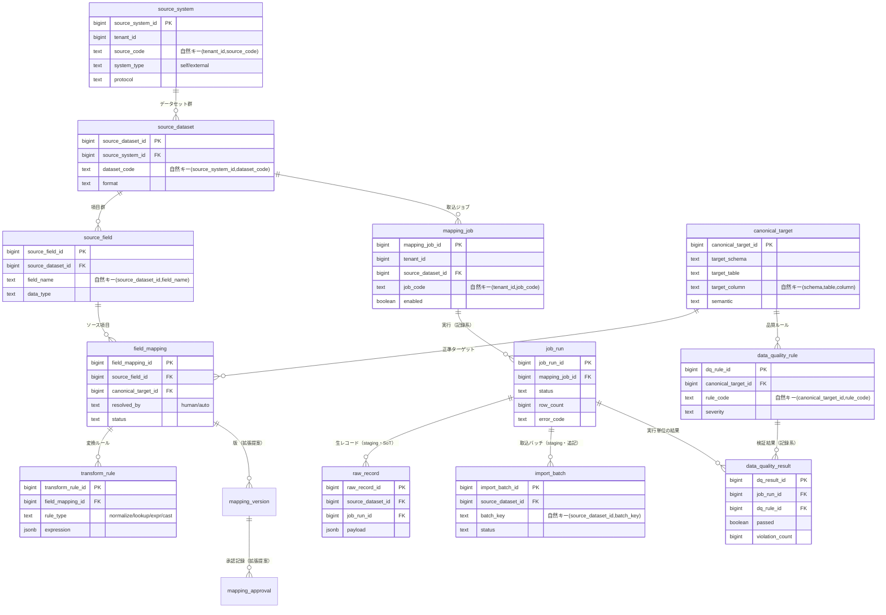
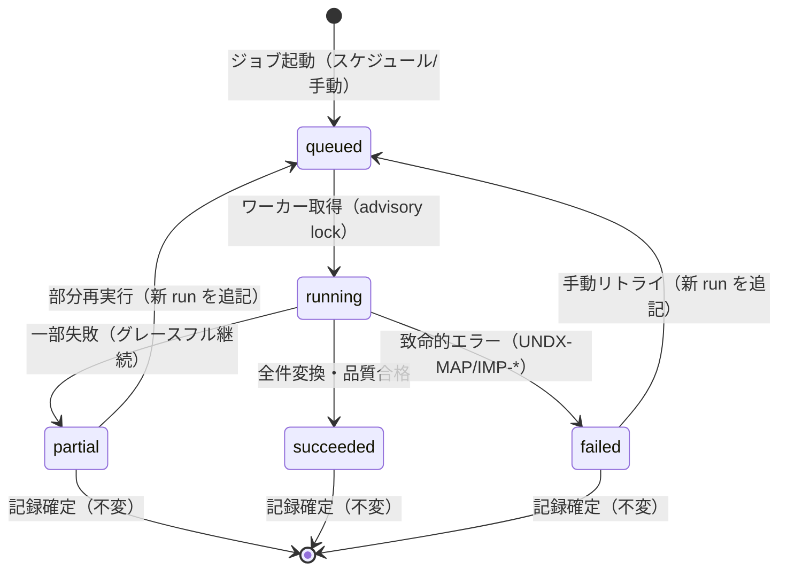
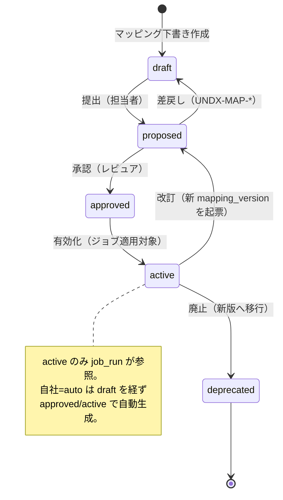

# DB-06 マッピング・変換メタデータスキーマ設計 — `mapping` ＋ `staging`（DataBridge / 連携・変換基盤）

> ステータス: ドラフト（正準設計ブループリント v1.0 準拠）
> 版: 0.1
> 最終更新: 2026-07-04
> 関連ドキュメント:
> - ../database/DB-01-schema-strategy.md（スキーマ戦略・命名・キー・マルチテナント物理）
> - ../database/DB-02-operational-schema-retail.md（`retail` スキーマ。自社直結ソース）
> - ../database/DB-03-operational-schema-maker.md（`maker` スキーマ。自社直結ソース）
> - ../database/DB-04-operational-schema-wms.md（`wms` スキーマ。自社直結ソース）
> - ../database/DB-05-analytics-star-schema.md（`mart_{tenant}` 供給先の次元/ファクト＝変換ターゲット）
> - ../database/DB-07-backoffice-schema.md（`backoffice`。取込量の計測連携）
> - ../detailed-design/DD-03-mapping-transform-engine.md（マッピング/変換エンジン詳細＝本スキーマの駆動主体）
> - ../detailed-design/DD-01-canonical-data-model.md（正準データモデル OLTP+mart 論理）
> - ../detailed-design/DD-02-api-interface-design.md（API リソース・契約・エラーコード）
> - ../detailed-design/DD-06-security-authz-tenancy.md（認証/認可/テナント分離・RLS）
> - ../basic-design/BD-04-integration-data-pipeline.md（連携・変換パイプライン全体像）
> - 継承元: ../../design.md（現行アプリ設計 / `import_batch`・週次取込）／../../star-schema-design.md（分析mart設計 / `rebuild()`）

---

## 1. スキーマ概要と SoT

`mapping` スキーマは、モジュール `MOD-INTEGRATION`（DataBridge / 連携・変換基盤）の**定義メタデータ**を格納する。責務は「ソースシステム登録・フィールドマッピング・変換ルール・変換ジョブ定義・ジョブ実行履歴・データ品質ルール/検証結果」であり、これらは詳細設計 ../detailed-design/DD-03-mapping-transform-engine.md の変換エンジンが**駆動する定義の格納先**である。実データの生着地層は `staging` スキーマ（`raw_record` / `import_batch`）が担う。

本スキーマは「定義（mapping）」と「取込データ（staging）」で SoT が分かれる。この分離が本書全体の設計の核である。

### 1.1 SoT 宣言（定義の SoT は mapping、取込データの SoT は staging/ソース）

ブループリント §7 の SoT マップにおける DataBridge の担当領域を、本書の粒度で展開する。**マッピング定義（source_system 〜 transform_rule、data_quality_rule）は `mapping` が SoT。取込データそのものは自社ソースが `retail/maker/wms`（OLTP）、他社連携は `staging.raw_record`/`staging.import_batch` が SoT。ジョブ実行履歴・品質検証結果は記録系で巻き戻し禁止**である。

| データ領域 | SoT | 派生/キャッシュ | 回復パス（再同期） |
|---|---|---|---|
| ソースシステム/データセット/項目 定義 | `mapping.source_system` / `source_dataset` / `source_field` | なし（定義そのもの） | 定義再登録・スキーマ再スキャン |
| 正準ターゲット定義 | 本ブループリント §4（`mart` 論理）＋ `mapping.canonical_target`（射影キャッシュ） | `mapping.canonical_target` | ブループリント/DD-01 からの再生成（同期ジョブ） |
| フィールドマッピング定義 | `mapping.field_mapping` | なし | 定義再登録・承認再実行 |
| 変換ルール定義 | `mapping.transform_rule` | なし | 定義再登録 |
| 変換ジョブ定義 | `mapping.mapping_job`（設定系・更新可） | なし | 定義再登録 |
| **他社連携の取込データ** | `staging.raw_record` / `staging.import_batch` | 正準OLTP相当 → `mart_*` | ジョブ再実行（`mapping.job_run`）→ `mart.rebuild()` |
| **自社アプリの取込データ** | `retail.*` / `maker.*` / `wms.*`（OLTP） | `mart_*` | 恒等マッピング再実行 → `mart.rebuild()` |
| ジョブ実行履歴 | `mapping.job_run`（記録系・巻戻し禁止） | なし | 追記のみ（過去 run は不変） |
| データ品質ルール定義 | `mapping.data_quality_rule`（設定系・更新可） | なし | 定義再登録 |
| データ品質検証結果 | `mapping.data_quality_result`（記録系・巻戻し禁止） | なし | 追記のみ（過去結果は不変） |

> **SoT 書込順序の厳守（原則6）:** 他社連携では `staging.raw_record`（SoT）へ生データを先に着地させ、変換適用後に正準 OLTP 相当へ反映し、最後に `mart.rebuild()` で派生 mart を再構築する。逆順（mart 先行・staging 後追い）は禁止。自社アプリは OLTP が SoT のため、`system_type='self'` の恒等マッピングで直結し staging を経由しない（ブループリント §3.5 の運用区別）。

### 1.2 前提

- **定義と実データの分離:** `mapping` はメタデータ（定義）専用スキーマ、`staging` は実データの生着地層。両者を分離することで、定義の更新（設定系）が取込済みデータ（記録系）を破壊しない構造を担保する（原則2・原則7）。
- **テナント境界:** テナント所有の定義（`source_system`・`mapping_job`）は `tenant_id` 論理列＋ PostgreSQL RLS で分離（ブループリント §8.3、../detailed-design/DD-06-security-authz-tenancy.md）。接続時にセッション変数 `app.tenant_id` を設定する。`canonical_target` はプラットフォーム共通定義（非テナント）である点に注意（後述 §3.4）。
- **正準ターゲットの権威:** `mapping.canonical_target` は mart の次元/ファクト列（../database/DB-05-analytics-star-schema.md、ブループリント §4）を指す射影であり、その定義の権威はブループリント §4／../detailed-design/DD-01-canonical-data-model.md にある。本テーブルは変換エンジンが参照するための実体化キャッシュとして持つ。
- **人的マッピング vs 恒等マッピング:** 他社ソースは `field_mapping.resolved_by='human'`（要人的解決・承認）、自社アプリは `resolved_by='auto'` の恒等マッピングで人的解決を省略（ADR-002）。
- **金額・数量・型:** 本スキーマ自体は業務金額を保持しないが、変換ルールの型変換（`cast`）は最小通貨単位 `bigint`（`shared.currency.minor_unit` 解釈、ADR-005）・数量 `int`・測定値 `numeric` の正準型へ寄せる。
- **エラーコード領域:** マッピング/変換は `UNDX-MAP-*`、データ品質は `UNDX-DQ-*`、取込処理は `UNDX-IMP-*`、テナント境界は `UNDX-TENANT-*`（ブループリント §9）。
- 本書は物理スキーマの SoT。論理モデルの正規定義は ../detailed-design/DD-01-canonical-data-model.md、変換エンジンの状態遷移・実行アルゴリズムは ../detailed-design/DD-03-mapping-transform-engine.md、命名・キー・マルチテナント物理は ../database/DB-01-schema-strategy.md が SoT。

---

## 2. ERD（`mapping` スキーマ）

`mapping` スキーマの中核は3系統である。（1）**ソース記述系**（`source_system` → `source_dataset` → `source_field`）、（2）**マッピング定義系**（`source_field` と `canonical_target` を `field_mapping` が結び、`transform_rule` が変換を付与）、（3）**実行・品質系**（`mapping_job` → `job_run`、`data_quality_rule` → `data_quality_result`）。`staging.raw_record` / `staging.import_batch` は `job_run` が生成する取込データの SoT である。

以下の ERD は主要 FK と自然キーを示す（監査列 `created_at/updated_at/created_by/updated_by`、および該当テーブルの `tenant_id` は共通のため省略）。図中の `mapping_version` / `mapping_approval` は、DD-03 の状態遷移に対応するバージョニング/承認を記録系として持たせる**拡張提案**であり、§7・§8 で詳述する。



ERD の要点は、定義系（上段）が「更新可の設定系」であるのに対し、実行系（`job_run`）・品質結果（`data_quality_result`）・生レコード（`raw_record`）・取込バッチ（`import_batch`）は「追記専用の記録系」である点である。定義を更新しても過去の実行履歴・検証結果・取込データは巻き戻らない（原則2、詳細は §9）。

---

## 3. ソースシステム/データセット/項目の登録（自社/他社・接続方式・スキーマ記述）

### 3.1 ソースシステム（`mapping.source_system`）

連携元システムを1行で表す。`system_type` で自社（`self`）／他社（`external`）を区別し、これが後段の解決方式（恒等/人的）と取込経路（staging 経由の有無）を決定する。`protocol` は接続方式（`file`（CSV/Excel アップロード）／`sftp`／`api`（REST/Webhook）／`db`（直結）／`internal`（自社アプリ内部呼出））を保持する。自然キーは `(tenant_id, source_code)`。

| 属性 | 型 | 説明 |
|---|---|---|
| `system_type` | text | `self`（自社アプリ）／`external`（他社サービス） |
| `protocol` | text | `file`/`sftp`/`api`/`db`/`internal` |
| `connection_config` | jsonb（拡張提案） | 接続情報の非機密メタ（機密は外部シークレットストア参照キーのみ保持。§9.4） |

> **自社ソースの扱い:** `system_type='self'` の場合、`retail`/`maker`/`wms` が SoT のため `protocol='internal'` として staging を経由せず正準ターゲットへ恒等直結する（ブループリント §3.5、ADR-002）。継承元 UndeuxSales の週次しまむらデータは他社由来のため `system_type='external'`・`protocol='file'`（週次ファイル）として登録し、`staging` が SoT となる（ブループリント §3.3 注）。

### 3.2 ソースデータセット（`mapping.source_dataset`）

1ソースシステム配下の論理データ単位（CSV/Excel の1シート、API の1エンドポイント、DB の1テーブル/ビュー）。`format` は `csv`/`tsv`/`xlsx`/`json`/`table` 等。自然キーは `(source_system_id, dataset_code)`。差分取込のためのカーソル項目（更新日時列名等）は `attributes jsonb` に保持する（§5.2）。

### 3.3 ソース項目（`mapping.source_field`）

データセットの1項目（列）を表す。`field_name`（ソース側名称）、`data_type`（ソース側の型・文字列表現）、`sample`（サンプル値、マッピング担当者の判断材料）を保持する。自然キーは `(source_dataset_id, field_name)`。スキーマ記述はアップロードファイルのヘッダ/型推定、または API スキーマ（OpenAPI/JSON Schema）から**自動スキャン**して初期登録し、以後は人が補正する（グレースフルデグラデーション：型推定失敗時も `data_type='unknown'` で登録を止めない、原則4）。

### 3.4 正準ターゲット（`mapping.canonical_target`）

マッピング先の正準項目（`mart` の次元/ファクト列、または正準 OLTP 列）を表す射影。`target_schema`・`target_table`・`target_column`・`semantic`（意味説明）を保持し、自然キーは `(target_schema, target_table, target_column)`。**このテーブルの定義の権威はブループリント §4／../detailed-design/DD-01-canonical-data-model.md にあり、`canonical_target` はエンジンが参照するための実体化キャッシュ**である（SoT→キャッシュの方向、原則6）。DD-01 の論理モデル改訂時に同期ジョブで再生成し、テナント横断で共有する（非テナント・グローバル、`tenant_id` を持たない）。

### 3.5 外部システムID相互参照（`mapping.entity_xref`）— R6 一本化

外部（他社）システムのエンティティ識別子（自然キー/コード）と、本プラットフォームの正準サロゲートID（`shared.product_id` / `shared.sku_id` / `shared.trading_partner_id` / `shared.region_id` / `wms.warehouse_id` 等）との対応を保持する**名寄せレジストリ**。外部連携（DataBridge）の責務であるため **`mapping` スキーマに一本化**する（DD-01 の概念記述・DB-01 の総則はいずれも本テーブルを参照する。旧 `shared.entity_xref` という記述は用いない。R6）。

- **役割:** 取込データ（`staging.raw_record`）内の外部コードを、フィールドマッピング適用時に正準サロゲートID へ解決（lookup）する起点。解決できないコードは `match_status='unresolved'` として記録し、人的解決（DD-03）を促す（グレースフルデグラデーション・原則4、`UNDX-MAP-*`）。
- **SoT:** 対応関係そのものの SoT は本テーブル。正準ID の実体は各正準マスタ（`shared.*` / `wms.*`）が SoT であり、`entity_xref` はその参照解決キャッシュを兼ねる（SoT→キャッシュの方向・原則6）。
- **自社アプリ:** 恒等マッピング（`resolved_by='auto'`）では外部コード＝正準コードのため `entity_xref` を経由せず直結してよい（他社連携のみ本テーブルを必須とする）。

```sql
-- 外部システムID ↔ 正準ID の相互参照レジストリ（mapping スキーマに一本化・R6）
CREATE TABLE mapping.entity_xref (
    entity_xref_id     bigint GENERATED ALWAYS AS IDENTITY PRIMARY KEY,
    tenant_id          bigint NOT NULL,                              -- RLS 論理列
    source_system_id   bigint NOT NULL
        REFERENCES mapping.source_system(source_system_id),
    entity_type        text   NOT NULL                              -- 対象エンティティ種別
        CHECK (entity_type IN ('product','sku','partner','region','warehouse','channel')),
    source_natural_key text   NOT NULL,                             -- 外部システムの自然キー/コード
    canonical_ref_type text   NOT NULL,                             -- 例: 'shared.product' / 'shared.sku' / 'wms.warehouse'
    canonical_id       bigint,                                      -- 解決済み正準サロゲートID（未解決は NULL）
    match_status       text   NOT NULL DEFAULT 'unresolved'
        CHECK (match_status IN ('auto','manual','unresolved')),
    created_at         timestamptz NOT NULL DEFAULT now(),
    updated_at         timestamptz NOT NULL DEFAULT now(),
    created_by         bigint,
    updated_by         bigint,
    -- 自然キー: 1ソースシステム×エンティティ種別×外部コード = 1対応（冪等 UPSERT・強制リレーション非使用）
    CONSTRAINT uq_entity_xref_natural
        UNIQUE (source_system_id, entity_type, source_natural_key)
);
CREATE INDEX ix_entity_xref_canonical ON mapping.entity_xref (canonical_ref_type, canonical_id);
CREATE INDEX ix_entity_xref_unresolved ON mapping.entity_xref (source_system_id, entity_type)
    WHERE match_status = 'unresolved';
ALTER TABLE mapping.entity_xref ENABLE ROW LEVEL SECURITY;
CREATE POLICY p_entity_xref_tenant ON mapping.entity_xref
    USING (tenant_id = current_setting('app.tenant_id')::bigint);
```

---

## 4. フィールドマッピング（ソース項目 → 正準ターゲット → 次元/ファクト列）

### 4.1 マッピングの構造（`mapping.field_mapping`）

`source_field`（ソース項目）を `canonical_target`（正準項目）へ対応付ける定義。1行が1つの対応を表す。自然キーは `(source_field_id, canonical_target_id)`（同一ソース項目→同一ターゲットの重複防止・冪等 UPSERT 用途）。

> **多ターゲット写像の許容（R9）:** 自然キーは `(source_field_id, canonical_target_id)` の**ペア単位**であり、`source_field_id` 単独ではない。したがって **1つのソース項目を複数の正準ターゲットへ写像できる**（例: 単一の複合コード列を `dim_product` の複数属性へ分解）。`active` な写像の一意性も同じ `(source_field_id, canonical_target_id)` 単位で扱い、DD-03 の部分ユニーク索引 `uq_field_mapping_active` はこのペア単位（`WHERE status='active'`）で定義される（「1ソース項目=1正準列」に狭めない）。DD-03 と本書の索引定義はこの一点で一致させる。

主要属性は以下。

| 属性 | 型/値域 | 説明 |
|---|---|---|
| `resolved_by` | `human` / `auto` | 他社=人的解決、自社=恒等自動（ADR-002） |
| `status` | `draft`/`review`/`approved`/`active`/`deprecated` | 承認ライフサイクル（§7。状態機械の SoT は DD-03 §2.3。値集合を DD-03 と一致） |
| `is_required` | boolean | 正準ターゲット側の必須充足に寄与するか |
| `default_expression` | jsonb（拡張提案） | ソース欠損時のデフォルト値式（§4.2） |
| `mapping_kind` | `direct`/`derived`/`constant`/`lookup`（拡張提案） | 直接対応／導出／定数／参照解決の別 |

> **正準ターゲットの型・必須の由来:** ターゲット側の「型」「必須」「次元/ファクト列」の権威は `canonical_target`（＝DD-01/ブループリント §4）にある。`field_mapping` はソース→ターゲットの対応と、そのマッピング固有のデフォルト/必須寄与を持つ。デフォルト・型・必須の3点はマッピング画面（../detailed-design/DD-05-screen-ux-si-strategy.md）で担当者に提示される。

### 4.2 変換式・デフォルト・型・必須の扱い

- **変換式:** 単純な直結を超える変換（正規化・lookup・式・型変換）は `field_mapping` に紐づく `transform_rule`（§5.1）へ分離する。`field_mapping` 自体は「どのソース項目をどのターゲットへ」の対応に専念し、「どう変換するか」は `transform_rule` が担う（1定義=1責務）。
- **デフォルト:** ソース側が欠損/NULL の場合の既定値は `default_expression jsonb` に式で保持。デフォルト適用は必須充足の一手段であり、適用有無は `job_run` 単位でトレース可能にする。
- **型:** ソース型（`source_field.data_type`）→ 正準型（`canonical_target` 側）への変換は `transform_rule.rule_type='cast'` で明示。金額は `bigint`（最小通貨単位）へ寄せる。
- **必須:** ターゲット列が NOT NULL/必須の場合、対応する `field_mapping` の欠落は**マッピング未充足**として承認をブロックし `UNDX-MAP-*` を返す（§7 の検証）。必須ターゲットに `default_expression` がある場合は充足とみなす。

### 4.3 変換ルール（`mapping.transform_rule`）

`field_mapping` に0..N 個ぶら下がる変換定義。`rule_type ∈ {normalize, lookup, expr, cast}`、`expression jsonb` に変換仕様を保持する。複数ルールは適用順（`seq`、拡張提案）で連鎖する。

| rule_type | 用途 | expression jsonb 例（構造イメージ） |
|---|---|---|
| `normalize` | 表記ゆれ正規化（全半角・トリム・大小） | `{"ops":["trim","zenkaku_to_hankaku"]}` |
| `lookup` | コード変換・名寄せ（外部辞書/`shared` 参照） | `{"table":"shared.region","match":"region_code","return":"region_id"}` |
| `expr` | 計算式・条件分岐 | `{"expr":"quantity * unit_price"}` |
| `cast` | 型変換（正準型へ） | `{"to":"bigint","scale":"minor_unit"}` |

> **`expression jsonb` の設計判断:** 変換仕様を DDL 化された固定列でなく `jsonb` で持つのは、rule_type ごとに必要なパラメータが異なり DDL 変更なしに拡張したいため（ADR-007 の思想を変換定義に適用）。頻用のキー（`rule_type` 判別、`lookup` の参照テーブル等）は生成列＋索引で検索性能を担保できる（§8 DDL）。

---

## 5. 変換ジョブ定義とジョブ実行履歴（冪等・差分/全量・ステータス・件数・エラー）

### 5.1 変換ジョブ定義（`mapping.mapping_job`）

1データセットの取込→変換→反映を1ジョブとする**設定系**。自然キーは `(tenant_id, job_code)`。`schedule`（cron 式/手動）、`enabled`（有効フラグ）を持つ。ジョブは「どのデータセットを、いつ、どのモードで取り込むか」の定義であり、実行の都度 `job_run` を1行生成する。ジョブ定義は更新可（設定系）だが、過去の `job_run` は不変（記録系）である。

| 属性 | 型/値域 | 説明 |
|---|---|---|
| `load_mode` | `full`/`incremental`（拡張提案） | 全量／差分（§5.2） |
| `schedule` | text | cron 式 or `manual` |
| `enabled` | boolean | 無効化しても過去 run は保持 |

### 5.2 差分/全量と冪等性

- **全量（full）:** データセット全体を毎回取り込み、正準ターゲットへ UPSERT（自然キーで冪等）。継承元 UndeuxSales の週次全量取込を一般化。
- **差分（incremental）:** `source_dataset.attributes` のカーソル項目（更新日時/連番）で前回以降のみ取込。カーソル位置は `mapping_job` の記録（`last_cursor`、拡張提案）で管理し、`job_run` 側は各実行のカーソル範囲を記録する。
- **冪等性（原則2）:** 同一ソース行の再取込は自然キー UPSERT で二重計上しない。`import_batch` は `(source_dataset_id, batch_key)`（例：ファイルハッシュ/期）で冪等化し、同一バッチの再取込を検知してスキップ or 上書き（記録は追記）。`job_run` の再実行は**新しい run 行を追記**するのみで、過去 run を書き換えない。

### 5.3 ジョブ実行履歴（`mapping.job_run`）— 記録系

各実行を1行で表す**記録系（巻戻し禁止）**。主要属性は `status`（`queued`/`running`/`succeeded`/`failed`/`partial`）、`started_at`/`finished_at`、`row_count`（取込/変換件数）、`error_code`（`UNDX-*`）。以下の状態遷移を持つ。



図の要点は、`failed`/`partial` からのリトライが**既存 run の書換えでなく新 run の追記**である点（原則2）。`partial` はグレースフルデグラデーション（原則4）を表し、補助的な変換（一部の非必須項目・品質 warning）が失敗しても主要な取込を止めず、失敗分を `error_code`＋`data_quality_result` に記録して完走する。致命的失敗（ソース接続不能・必須ターゲット未充足）のみ `failed` で停止する。実行の直列化は継承元の advisory lock（../../design.md）と同じく `mapping_job` 単位で行い、同一ジョブの並行二重実行を防ぐ。

### 5.4 staging への着地（他社連携の SoT）

他社ソースの `job_run` は、変換前の生データを `staging.raw_record`（`payload jsonb`・SoT）へ着地させ、取込単位を `staging.import_batch`（`(source_dataset_id, batch_key)`・追記専用）で束ねる。変換は raw_record を入力に `transform_rule` を適用して正準 OLTP 相当へ反映し、最後に `mart.rebuild()`（../database/DB-05-analytics-star-schema.md）へ波及する。raw_record が SoT のため、変換ロジック改訂時は raw_record からの再変換で mart を再生成でき、再現性を担保する（ADR-012 の思想を取込に適用）。

---

## 6. データ品質ルールと検証結果

### 6.1 データ品質ルール（`mapping.data_quality_rule`）— 設定系

正準ターゲット単位で定義する検証ルール。自然キーは `(canonical_target_id, rule_code)`。`rule_type`（`not_null`/`unique`/`range`/`regex`/`referential`/`freshness` 等）、`severity`（`error`/`warning`/`info`）、`params jsonb`（閾値・正規表現・参照先）を持つ。`severity='error'` の違反はジョブを `failed`/`partial` に落とし `UNDX-DQ-*` を付与、`warning`/`info` は記録のみで主要フローを止めない（原則4）。

### 6.2 検証結果（`mapping.data_quality_result`）— 記録系

`job_run` × `dq_rule` 単位の検証結果を1行で記録する**記録系（巻戻し禁止）**。`passed`（真偽）、`violation_count`（違反件数）、`sample jsonb`（違反サンプル・原因調査用、PII はマスキング。§9.4）。過去の検証結果は不変で、ルール定義を更新しても過去結果は書き換えない（監査可能性の担保）。

### 6.3 マッピング定義 → ジョブ実行 → 品質記録の関係

以下は本スキーマの中心的データフローで、「定義（設定系）」が「実行→品質記録（記録系）」を駆動し、最終的に mart へ波及する流れを示す。

```mermaid
flowchart LR
    subgraph 定義（設定系・更新可）
        SS[source_system] --> SD[source_dataset] --> SF[source_field]
        CT[canonical_target]
        SF --> FM[field_mapping<br/>human/auto・承認済]
        CT --> FM
        FM --> TR[transform_rule<br/>normalize/lookup/expr/cast]
        SD --> MJ[mapping_job<br/>差分/全量・schedule]
        CT --> DQR[data_quality_rule<br/>severity]
    end
    subgraph 実行・記録（記録系・追記のみ）
        MJ --> JR[job_run<br/>status/row_count/error_code]
        JR --> RAW[(staging.raw_record<br/>他社連携SoT)]
        RAW --> IB[(staging.import_batch<br/>取込バッチ)]
        JR --> DQX[data_quality_result<br/>passed/violation_count]
        DQR --> DQX
    end
    TR -->|変換適用| JR
    JR -->|正準OLTP相当へ反映| MART[(mart.rebuild<br/>派生キャッシュ)]
    DQX -.品質ゲート.-> MART
```

図の要点は3つ。（1）定義系の更新は記録系を巻き戻さない（矢印は駆動であって上書きでない）。（2）他社連携は `staging.raw_record`（SoT）を経由し、自社は恒等マッピングで直結（図では省略、`system_type='self'`）。（3）品質ゲート（`data_quality_result`）が `error` 違反を含む場合、mart 反映を止める/部分反映に留めるかはジョブポリシーで制御し、いずれも `UNDX-DQ-*` を記録する。

---

## 7. マッピングのバージョニングと承認（DD-03 の状態遷移に対応）

### 7.1 承認ライフサイクル（`field_mapping.status`）

他社連携マッピング（`resolved_by='human'`）は人的解決を要するため、承認ワークフローを持つ。`field_mapping.status` は ../detailed-design/DD-03-mapping-transform-engine.md が定義する状態遷移に対応する（DD-03 が状態機械の SoT、本書は永続化の SoT）。



図の要点は、`active` の定義のみが `job_run` の変換対象になる点である。自社アプリ（`resolved_by='auto'`）は恒等マッピングのため `draft`/`proposed` を経ずに `approved`/`active` を自動付与し、人的承認をスキップする（ADR-002・グレースフルな運用簡略化）。差戻し・却下は `UNDX-MAP-*` を付与し理由を記録する。

### 7.2 バージョニングと承認記録（拡張提案）

ブループリント §3.5 の `field_mapping` は `status` 列を持つが、**版管理と承認履歴の明示的テーブルは未掲載**である。監査可能性（誰がいつどの版を承認したか）と下位互換（過去 run が参照した版の再現）のため、以下2テーブルを**拡張提案**する（§11 で ADR 起票要）。

| テーブル（拡張提案） | PK | 主要属性 | 自然キー | 位置づけ |
|---|---|---|---|---|
| `mapping.mapping_version` | `mapping_version_id` | `field_mapping_id`, `version_no`, `snapshot jsonb`（定義スナップショット）, `status` | `(field_mapping_id, version_no)` | 記録系（版は不変） |
| `mapping.mapping_approval` | `mapping_approval_id` | `mapping_version_id`, `action`(propose/approve/reject), `actor_user_id`, `comment`, `acted_at` | — | 記録系（追記専用） |

- **下位互換（原則7）:** `job_run` は参照した `mapping_version_id` を記録し（拡張提案の FK）、変換ロジック改訂後も過去 run が「当時の版」で再現可能にする。定義更新は新 `version_no` の追記で行い、既存版を破壊しない。
- **グレースフル:** 承認テーブルが未整備の初期段階でも、`field_mapping.status` 単独で最小限のライフサイクルは回る（承認履歴が無いだけで取込は止まらない、原則4）。

---

## 8. 代表テーブル DDL（sql）

以下は PostgreSQL 16 前提の代表テーブル DDL。PK はサロゲート `bigint`（`GENERATED ALWAYS AS IDENTITY`）、自然キーは UNIQUE 制約、変換/品質仕様は `jsonb`＋生成列＋索引、記録系は追記専用とする。監査列・`tenant_id` はテナント所有テーブル（`source_system`・`mapping_job`）に代表記載し、他テーブルも監査列を持つ。`mapping_version`/`mapping_approval` はブループリント §3.5 未掲載の**拡張提案**（§7・§11 で ADR 起票要）。

```sql
-- ソースシステム: 自社/他社の連携元。(tenant_id, source_code) が自然キー
CREATE TABLE mapping.source_system (
    source_system_id  bigint GENERATED ALWAYS AS IDENTITY PRIMARY KEY,
    tenant_id         bigint NOT NULL,                          -- RLS 論理列
    source_code       text   NOT NULL,                          -- 自然キー構成
    name              text   NOT NULL,
    system_type       text   NOT NULL
        CHECK (system_type IN ('self','external')),
    protocol          text   NOT NULL DEFAULT 'file'
        CHECK (protocol IN ('file','sftp','api','db','internal')),
    connection_config jsonb  NOT NULL DEFAULT '{}'::jsonb,       -- 拡張提案: 非機密メタ+シークレット参照キー
    created_at        timestamptz NOT NULL DEFAULT now(),
    updated_at        timestamptz NOT NULL DEFAULT now(),
    created_by        bigint,
    updated_by        bigint,
    CONSTRAINT uq_source_system_natural UNIQUE (tenant_id, source_code)
);

-- ソースデータセット: 1ソース配下の論理データ単位。差分カーソルは attributes に保持
CREATE TABLE mapping.source_dataset (
    source_dataset_id bigint GENERATED ALWAYS AS IDENTITY PRIMARY KEY,
    source_system_id  bigint NOT NULL
        REFERENCES mapping.source_system(source_system_id) ON DELETE CASCADE,
    dataset_code      text   NOT NULL,
    dataset_name      text   NOT NULL,
    format            text   NOT NULL DEFAULT 'csv'
        CHECK (format IN ('csv','tsv','xlsx','json','table')),
    attributes        jsonb  NOT NULL DEFAULT '{}'::jsonb,       -- 差分カーソル列名/エンコーディング等
    cursor_field      text   GENERATED ALWAYS AS (attributes->>'cursor_field') STORED,
    created_at        timestamptz NOT NULL DEFAULT now(),
    updated_at        timestamptz NOT NULL DEFAULT now(),
    CONSTRAINT uq_source_dataset_natural UNIQUE (source_system_id, dataset_code)
);

-- ソース項目: データセットの1列。(source_dataset_id, field_name) が自然キー
CREATE TABLE mapping.source_field (
    source_field_id   bigint GENERATED ALWAYS AS IDENTITY PRIMARY KEY,
    source_dataset_id bigint NOT NULL
        REFERENCES mapping.source_dataset(source_dataset_id) ON DELETE CASCADE,
    field_name        text   NOT NULL,
    data_type         text   NOT NULL DEFAULT 'unknown',         -- 推定失敗も止めない(原則4)
    sample            text,
    created_at        timestamptz NOT NULL DEFAULT now(),
    updated_at        timestamptz NOT NULL DEFAULT now(),
    CONSTRAINT uq_source_field_natural UNIQUE (source_dataset_id, field_name)
);

-- 正準ターゲット: mart/正準OLTP 列の射影(キャッシュ)。非テナント・グローバル
CREATE TABLE mapping.canonical_target (
    canonical_target_id bigint GENERATED ALWAYS AS IDENTITY PRIMARY KEY,
    target_schema       text NOT NULL,                           -- 例: mart / retail
    target_table        text NOT NULL,                           -- 例: fact_sales_weekly
    target_column       text NOT NULL,                           -- 例: amount
    semantic            text,                                    -- 意味説明(担当者向け)
    canonical_type      text,                                    -- 正準型(bigint/int/numeric/date/text)
    is_required         boolean NOT NULL DEFAULT false,
    created_at          timestamptz NOT NULL DEFAULT now(),
    updated_at          timestamptz NOT NULL DEFAULT now(),
    CONSTRAINT uq_canonical_target_natural UNIQUE (target_schema, target_table, target_column)
);

-- フィールドマッピング: ソース項目→正準ターゲット。(source_field_id, canonical_target_id) が自然キー
CREATE TABLE mapping.field_mapping (
    field_mapping_id    bigint GENERATED ALWAYS AS IDENTITY PRIMARY KEY,
    source_field_id     bigint NOT NULL
        REFERENCES mapping.source_field(source_field_id) ON DELETE CASCADE,
    canonical_target_id bigint NOT NULL
        REFERENCES mapping.canonical_target(canonical_target_id),
    resolved_by         text   NOT NULL DEFAULT 'human'
        CHECK (resolved_by IN ('human','auto')),
    status              text   NOT NULL DEFAULT 'draft'
        CHECK (status IN ('draft','review','approved','active','deprecated')),  -- DD-03 §2.3 状態機械と一致
    mapping_kind        text   NOT NULL DEFAULT 'direct'          -- 拡張提案
        CHECK (mapping_kind IN ('direct','derived','constant','lookup')),
    is_required         boolean NOT NULL DEFAULT false,
    default_expression  jsonb,                                   -- 拡張提案: 欠損時デフォルト式
    created_at          timestamptz NOT NULL DEFAULT now(),
    updated_at          timestamptz NOT NULL DEFAULT now(),
    created_by          bigint,
    updated_by          bigint,
    CONSTRAINT uq_field_mapping_natural UNIQUE (source_field_id, canonical_target_id)
);

-- 変換ルール: field_mapping に連鎖する変換。expression は jsonb + 生成列で検索性能担保
CREATE TABLE mapping.transform_rule (
    transform_rule_id bigint GENERATED ALWAYS AS IDENTITY PRIMARY KEY,
    field_mapping_id  bigint NOT NULL
        REFERENCES mapping.field_mapping(field_mapping_id) ON DELETE CASCADE,
    seq               int    NOT NULL DEFAULT 1,                 -- 拡張提案: 適用順
    rule_type         text   NOT NULL
        CHECK (rule_type IN ('normalize','lookup','expr','cast')),
    expression        jsonb  NOT NULL DEFAULT '{}'::jsonb,
    lookup_table      text   GENERATED ALWAYS AS (expression->>'table') STORED,  -- lookup 検索用
    created_at        timestamptz NOT NULL DEFAULT now(),
    updated_at        timestamptz NOT NULL DEFAULT now(),
    CONSTRAINT uq_transform_rule_seq UNIQUE (field_mapping_id, seq)
);

-- 変換ジョブ定義(設定系): (tenant_id, job_code) が自然キー。差分/全量・スケジュール
CREATE TABLE mapping.mapping_job (
    mapping_job_id    bigint GENERATED ALWAYS AS IDENTITY PRIMARY KEY,
    tenant_id         bigint NOT NULL,
    source_dataset_id bigint NOT NULL
        REFERENCES mapping.source_dataset(source_dataset_id),
    job_code          text   NOT NULL,
    load_mode         text   NOT NULL DEFAULT 'full'             -- 拡張提案
        CHECK (load_mode IN ('full','incremental')),
    schedule          text   NOT NULL DEFAULT 'manual',          -- cron 式 or 'manual'
    enabled           boolean NOT NULL DEFAULT true,
    last_cursor       text,                                      -- 拡張提案: 差分カーソル位置
    created_at        timestamptz NOT NULL DEFAULT now(),
    updated_at        timestamptz NOT NULL DEFAULT now(),
    created_by        bigint,
    updated_by        bigint,
    CONSTRAINT uq_mapping_job_natural UNIQUE (tenant_id, job_code)
);

-- ジョブ実行履歴(記録系・巻戻し禁止): status/件数/エラーコード。過去 run は不変
CREATE TABLE mapping.job_run (
    job_run_id      bigint GENERATED ALWAYS AS IDENTITY PRIMARY KEY,
    mapping_job_id  bigint NOT NULL
        REFERENCES mapping.mapping_job(mapping_job_id),
    status          text   NOT NULL DEFAULT 'queued'
        CHECK (status IN ('queued','running','succeeded','partial','failed')),
    started_at      timestamptz,
    finished_at     timestamptz,
    row_count       bigint NOT NULL DEFAULT 0,                   -- 取込/変換件数
    error_code      text,                                       -- UNDX-MAP/IMP/DQ-*
    cursor_from     text,                                       -- 差分範囲(拡張提案)
    cursor_to       text,
    mapping_version_ref bigint,                                 -- 拡張提案: 参照した定義版(下位互換)
    created_at      timestamptz NOT NULL DEFAULT now()          -- 監査: 追記のみ、updated_at を持たない
);

-- データ品質ルール(設定系): 正準ターゲット単位。(canonical_target_id, rule_code) が自然キー
CREATE TABLE mapping.data_quality_rule (
    dq_rule_id          bigint GENERATED ALWAYS AS IDENTITY PRIMARY KEY,
    canonical_target_id bigint NOT NULL
        REFERENCES mapping.canonical_target(canonical_target_id),
    rule_code           text   NOT NULL,
    rule_type           text   NOT NULL
        CHECK (rule_type IN ('not_null','unique','range','regex','referential','freshness')),
    severity            text   NOT NULL DEFAULT 'error'
        CHECK (severity IN ('error','warning','info')),
    params              jsonb  NOT NULL DEFAULT '{}'::jsonb,      -- 閾値/正規表現/参照先
    enabled             boolean NOT NULL DEFAULT true,
    created_at          timestamptz NOT NULL DEFAULT now(),
    updated_at          timestamptz NOT NULL DEFAULT now(),
    CONSTRAINT uq_dq_rule_natural UNIQUE (canonical_target_id, rule_code)
);

-- データ品質検証結果(記録系・巻戻し禁止): job_run × rule。sample は PII マスキング
CREATE TABLE mapping.data_quality_result (
    dq_result_id    bigint GENERATED ALWAYS AS IDENTITY PRIMARY KEY,
    job_run_id      bigint NOT NULL REFERENCES mapping.job_run(job_run_id),
    dq_rule_id      bigint NOT NULL REFERENCES mapping.data_quality_rule(dq_rule_id),
    passed          boolean NOT NULL,
    violation_count bigint  NOT NULL DEFAULT 0,
    sample          jsonb,                                       -- 違反サンプル(マスキング済)
    created_at      timestamptz NOT NULL DEFAULT now(),          -- 追記のみ
    CONSTRAINT uq_dq_result_run_rule UNIQUE (job_run_id, dq_rule_id)
);

-- 【拡張提案】マッピング版(記録系): 定義スナップショット。(field_mapping_id, version_no) が自然キー
CREATE TABLE mapping.mapping_version (
    mapping_version_id bigint GENERATED ALWAYS AS IDENTITY PRIMARY KEY,
    field_mapping_id   bigint NOT NULL
        REFERENCES mapping.field_mapping(field_mapping_id),
    version_no         int    NOT NULL,
    snapshot           jsonb  NOT NULL,                          -- 当時の mapping+transform 定義
    status             text   NOT NULL DEFAULT 'proposed'
        CHECK (status IN ('proposed','approved','active','deprecated')),
    created_at         timestamptz NOT NULL DEFAULT now(),
    CONSTRAINT uq_mapping_version_natural UNIQUE (field_mapping_id, version_no)
);

-- 【拡張提案】承認記録(記録系・追記専用): 誰がいつどの版へ何をしたか
CREATE TABLE mapping.mapping_approval (
    mapping_approval_id bigint GENERATED ALWAYS AS IDENTITY PRIMARY KEY,
    mapping_version_id  bigint NOT NULL
        REFERENCES mapping.mapping_version(mapping_version_id),
    action              text   NOT NULL
        CHECK (action IN ('propose','approve','reject')),
    actor_user_id       bigint NOT NULL REFERENCES shared.user_account(user_id),
    comment             text,
    acted_at            timestamptz NOT NULL DEFAULT now()
);
```

`staging` の代表 DDL（生着地層。`raw_record` が他社連携 SoT、`import_batch` が取込履歴・追記専用）を以下に示す。

```sql
-- 他社連携の生レコード(SoT): payload を jsonb で無変換保持。再変換の入力源
CREATE TABLE staging.raw_record (
    raw_record_id     bigint GENERATED ALWAYS AS IDENTITY PRIMARY KEY,
    source_dataset_id bigint NOT NULL
        REFERENCES mapping.source_dataset(source_dataset_id),
    job_run_id        bigint NOT NULL REFERENCES mapping.job_run(job_run_id),
    import_batch_id   bigint REFERENCES staging.import_batch(import_batch_id),  -- 取込単位
    payload           jsonb  NOT NULL,                           -- ソース行の無変換スナップショット
    ingested_at       timestamptz NOT NULL DEFAULT now()         -- 追記のみ
);

-- 取込バッチ(履歴・追記専用): (source_dataset_id, batch_key) で冪等化
CREATE TABLE staging.import_batch (
    import_batch_id   bigint GENERATED ALWAYS AS IDENTITY PRIMARY KEY,
    source_dataset_id bigint NOT NULL
        REFERENCES mapping.source_dataset(source_dataset_id),
    batch_key         text   NOT NULL,                           -- ファイルハッシュ/期 等(冪等キー)
    status            text   NOT NULL DEFAULT 'pending'
        CHECK (status IN ('pending','completed','failed')),
    file_ref          text,                                      -- オブジェクトストレージ参照
    created_at        timestamptz NOT NULL DEFAULT now(),
    updated_at        timestamptz NOT NULL DEFAULT now(),
    CONSTRAINT uq_import_batch_natural UNIQUE (source_dataset_id, batch_key)
);
```

> **DDL 上の設計判断:** （1）記録系（`job_run`/`data_quality_result`/`raw_record`/`mapping_approval`）は `updated_at` を持たず追記のみ（巻戻し禁止の物理的担保、§9）。（2）`jsonb` 列（`expression`/`params`/`payload`/`snapshot`）は DDL 変更なしの拡張性を確保しつつ、頻用キーを生成列（`cursor_field`/`lookup_table`）で索引化。（3）自然キー UNIQUE で冪等 UPSERT を可能にし、複合キーは強制リレーションに使わずサロゲート FK でつなぐ（ブループリント §8.2）。

---

## 9. インデックス・制約・記録系保護（原則2）

### 9.1 インデックス方針

- **自然キー UNIQUE:** 全定義テーブルに自然キー UNIQUE（冪等 UPSERT の土台）。
- **FK 索引:** `field_mapping(canonical_target_id)`・`transform_rule(field_mapping_id)`・`job_run(mapping_job_id)`・`data_quality_result(job_run_id, dq_rule_id)`・`raw_record(job_run_id)` に索引。
- **記録系の時系列参照:** `job_run(mapping_job_id, created_at DESC)`・`data_quality_result(created_at)` で最新実行/結果の高速取得。
- **jsonb 生成列索引:** `transform_rule.lookup_table`（lookup 影響分析）・`source_dataset.cursor_field`（差分ジョブ）に B-tree 索引。`payload jsonb` は用途に応じ GIN 索引を検討（拡張提案）。
- **部分索引:** `mapping_job(tenant_id) WHERE enabled`・`field_mapping WHERE status='active'`（変換対象の絞込高速化）。

### 9.2 制約

- **CHECK:** `system_type`/`protocol`/`resolved_by`/`status`/`rule_type`/`severity`/`load_mode` を許容値に限定（DDL 参照）。不正遷移はアプリ層（../detailed-design/DD-03-mapping-transform-engine.md）で強制し `UNDX-MAP-*` を返す。
- **RLS:** テナント所有テーブル（`source_system`・`mapping_job`）に `tenant_id` を持ち `ENABLE ROW LEVEL SECURITY` ＋ `USING (tenant_id = current_setting('app.tenant_id')::bigint)` を付す（`UNDX-TENANT-*`）。`canonical_target` はグローバル（非テナント）で RLS 対象外、読取のみ広く許可し書込はプラットフォーム管理者に限定。子テーブル（`source_dataset`/`source_field`/`field_mapping`/`transform_rule`）は親の `tenant_id` を JOIN で継承し、アプリ認可スコープで境界を担保する（RLS＋アプリ認可の二層）。
- **FK ON DELETE:** 定義の親子（`source_system`→`source_dataset`→`source_field`→`field_mapping`→`transform_rule`）は `ON DELETE CASCADE`。ただし**記録系を指す FK（`job_run`/`data_quality_result`/`raw_record`）は CASCADE を付けず**、定義削除が実行履歴を巻き込まないようにする（§9.3）。

### 9.3 記録系保護（原則2）と冪等 UPSERT

- **追記専用テーブル:** `job_run`・`data_quality_result`・`raw_record`・`mapping_approval`（拡張提案）は追記のみ。`updated_at` を持たず UPDATE/DELETE をアプリ層で禁止（監査可能性・巻戻し禁止）。ジョブ再実行は新 run の追記で表現し、過去 run は不変（§5.3）。
- **設定系テーブル:** `mapping_job`・`data_quality_rule`・`field_mapping`・`canonical_target` は更新可（設定系）。ただし定義更新は記録系（過去の run/結果）を書き換えない。マッピング改訂は新 `mapping_version`（拡張提案）の追記で行い、下位互換を保つ（§7.2、原則7）。
- **冪等 UPSERT:** 定義同期・恒等マッピング生成・取込は自然キー UPSERT で二重登録しない。`import_batch(source_dataset_id, batch_key)` で同一バッチ再取込を冪等化。想定エラーには `UNDX-MAP-*`/`UNDX-DQ-*`/`UNDX-IMP-*` を付与し、補助処理（品質 warning・非必須変換）の失敗が主要な取込フローを止めない（グレースフルデグラデーション、原則4）。
- **直列化:** 同一 `mapping_job` の並行二重実行は advisory lock で直列化（継承元 ../../design.md）。mart への波及は `mart.rebuild()`（advisory lock＋`statement_timeout=0`＋非同期、ADR-009）に委譲する。

### 9.4 機密・PII の扱い

- **接続機密:** `source_system.connection_config`（拡張提案）には非機密メタと外部シークレットストアの**参照キーのみ**を保持し、認証情報の平文を DB に置かない。
- **違反サンプルのマスキング:** `data_quality_result.sample`・`raw_record.payload` に PII が含まれ得るため、サンプルはマスキング済みで格納し、閲覧はアプリ認可（ガードレール、ブループリント §6）で制限する。

### 9.5 レスポンシブ（UI 観点の補足）

本スキーマを供給先とするマッピング管理・ジョブ監視 UI（../detailed-design/DD-05-screen-ux-si-strategy.md）は、PC では「ソース項目 × 正準ターゲット」の対応表・ジョブ実行履歴テーブルで表示し、モバイルではマッピング1件/実行1件をカード型（ソース→ターゲット、status・件数・エラーコードを要約表示）に落とす（CLAUDE.md 原則8）。API は一覧（`GET /api/mappings`・`GET /api/job-runs`）と詳細を分離し、レスポンスに別リソースを混在させない（ブループリント §8.5）。

---

## 10. 分析 mart への供給と関連ドキュメント連携

`mapping`/`staging` は mart の**前段**であり、変換適用の結果を正準 OLTP 相当へ反映し、`mart.rebuild()`（../database/DB-05-analytics-star-schema.md）が dim/fact を冪等再構築する。`canonical_target` は mart の次元/ファクト列（../detailed-design/DD-01-canonical-data-model.md、ブループリント §4）を権威とする射影であり、mart 論理モデル改訂時は同期ジョブで再生成する。変換エンジンの実行アルゴリズム・状態遷移の詳細は ../detailed-design/DD-03-mapping-transform-engine.md、パイプライン全体像は ../basic-design/BD-04-integration-data-pipeline.md、取込量の使用量計測連携は ../database/DB-07-backoffice-schema.md（`usage_metering` の `metric_code`）が担う。

---

## 11. 未決事項

1. **`mapping_version` / `mapping_approval` の正式採用（拡張提案）:** ブループリント §3.5 未掲載。監査・下位互換のため提案するが、初期は `field_mapping.status` 単独運用も可。採否と `job_run.mapping_version_ref` FK 導入を ADR 起票して決定する（原則9・ADR 追補）。
2. **`load_mode`（差分/全量）と差分カーソルの永続化位置:** `mapping_job.last_cursor` に持つか、`job_run` の `cursor_from/to` のみで復元するか。差分の巻戻し安全性（原則2）と再現性の両立方式を DD-03 と確定する。
3. **`canonical_target` のテナント別拡張:** クライアント固有のオプション項目（SI 追加項目）を canonical へどう射影するか。グローバル定義＋テナント別拡張列（`attributes jsonb`）の要否を DD-01/DD-05 と調整する。
4. **品質ゲートの mart 反映ポリシー:** `severity='error'` 違反時に mart 反映を「全面ブロック」「部分反映（合格分のみ）」「反映して警告」のどれを既定にするか。ジョブ単位で選択可能にする設計案の採否。
5. **`raw_record` の保持期間とアーカイブ:** 他社連携 SoT のため長期保持が原則だが、`payload jsonb` の肥大化に対しオブジェクトストレージへのコールドアーカイブ方針（`import_batch.file_ref` との二重化）を要検討。
6. **恒等マッピングの自動生成範囲:** 自社アプリ（retail/maker/wms）の正準ターゲット全列に対する恒等 `field_mapping` を DDL 変更のたびに自動再生成する仕組みと、その冪等性・既存承認状態の保護方式。
7. **`transform_rule` の実行エンジン（DB 内 SQL / アプリ層）分担:** `lookup`（`shared` 参照）は DB 内、`expr`/`normalize` はアプリ層など、実行場所の切り分けを DD-03 と確定する。
8. **エラーコード連番の確定:** `UNDX-MAP-*` / `UNDX-DQ-*` / `UNDX-IMP-*` の具体連番は `shared.error_code`（コードが SoT、ブループリント §9）と DD-02 で採番確定する。

### 前提（本書で置いた仮定）

- **A1:** `canonical_target` はプラットフォーム共通のグローバル定義（非テナント）とし、権威は DD-01/ブループリント §4、本テーブルは実体化キャッシュ（原則6）。
- **A2:** 自社アプリ（`system_type='self'`）は `staging` を経由せず恒等マッピングで正準ターゲットへ直結（ブループリント §3.5・ADR-002）。他社連携のみ `staging.raw_record` が SoT。
- **A3:** 記録系（`job_run`/`data_quality_result`/`raw_record`/`mapping_approval`）は追記専用・`updated_at` 非保持で巻戻しを物理的に抑止（原則2）。設定系（`mapping_job`/`data_quality_rule`/`field_mapping`）は更新可だが記録系を破壊しない。
- **A4:** マッピングの状態機械（`draft→proposed→approved→active→deprecated`）の権威は DD-03、本書は永続化（`field_mapping.status`＋拡張提案の版/承認テーブル）の SoT。
- **A5:** `mapping_version` / `mapping_approval`、`field_mapping.default_expression`/`mapping_kind`、`mapping_job.load_mode`/`last_cursor`、`source_system.connection_config`、`transform_rule.seq` はブループリント §3.5 未掲載の**拡張提案**であり、§11-1 の ADR で採否を確定する。
