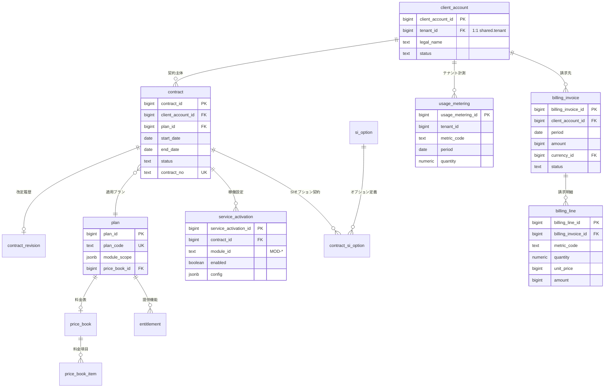
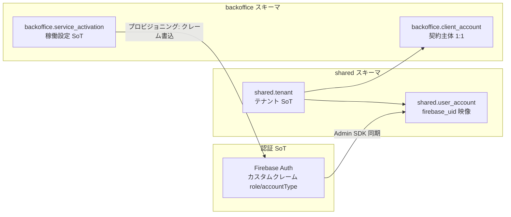
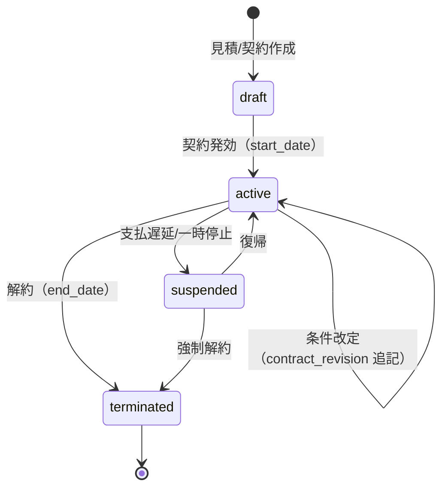
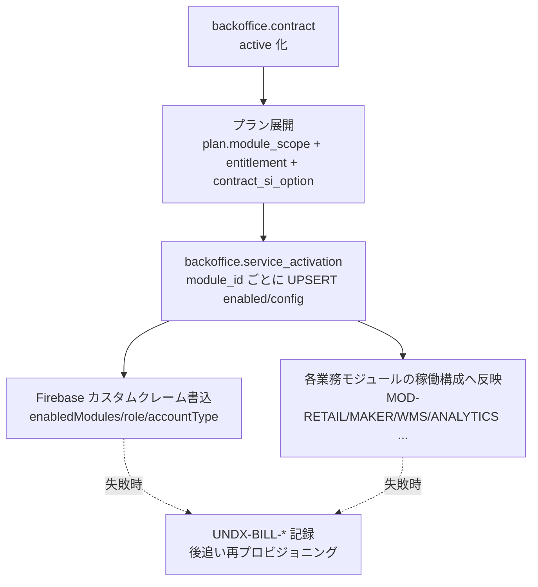
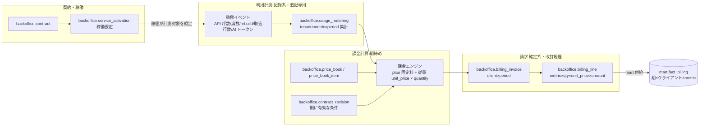
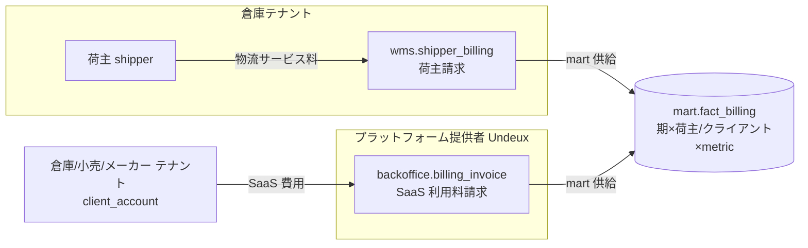

# DB-07 バックオフィススキーマ（`backoffice`）— Undeux Platform（UCP）データベース設計

> **ステータス:** ドラフト（レビュー前）
> **版:** v1.0
> **最終更新:** 2026-07-04
> **関連ドキュメント:** [正準設計ブループリント v1.0]（全ドキュメント共通契約・特に §3.6/§7/§8/§9）／ [DB-01 スキーマ戦略総論](./DB-01-schema-strategy.md) ／ [DB-04 wms 物理スキーマ](./DB-04-operational-schema-wms.md)（荷主請求の責務境界） ／ [DB-05 分析スタースキーマ](./DB-05-analytics-star-schema.md)（`fact_billing`） ／ [DB-06 マッピングメタデータスキーマ](./DB-06-mapping-metadata-schema.md)（利用計測イベントの取込） ／ [DB-08 knowledge/ベクター/スナップショットスキーマ](./DB-08-knowledge-vector-snapshot-schema.md) ／ [BD-05 バックオフィス](../basic-design/BD-05-backoffice.md) ／ [DD-01 正準データモデル](../detailed-design/DD-01-canonical-data-model.md) ／ [DD-06 認証/認可/テナント分離](../detailed-design/DD-06-security-authz-tenancy.md) ／ 継承元: [現行アプリ設計](../../design.md)・[分析mart設計](../../star-schema-design.md)

---

本ドキュメントは Undeux Platform（略称 **UCP**、プロダクト系統コード `UNDX`）の**バックオフィススキーマ（`backoffice`）**の物理設計を確定する。テナント（契約クライアント組織）・契約・プラン・提供機能（エンタイトルメント）・SI オプション・稼働設定（プロビジョニング）・利用計測（メータリング）・課金計算・請求書/明細を定義し、**プラットフォームの「契約・稼働・請求の正」**（`MOD-BACKOFFICE` BackOffice）を成す。バックオフィスは自社運用に加え、クライアントへ提供可能なサービスでもある（ブループリント §2）。

名称・ID・SoT・命名規約はすべて **正準設計ブループリント v1.0**（特に §3.6 `backoffice` エンティティカタログ・§7 SoT 宣言マップ・§8 命名/キー/型方針・§9 エラーコード領域）が SoT である。本書はブループリント §3.6 を物理設計の観点から具体化する。ブループリントと矛盾する場合はブループリントを優先する。ブループリントに無い要素を補う場合は「**（拡張提案）**」と明記し、末尾 §10 で ADR 起票対象として列挙する。

---

## 0. 本書の位置づけと前提

### 0.1 本書が定義するもの

| 本書が確定する事項 | 節 | 参照/波及先 |
|---|---|---|
| スキーマ概要・SoT 宣言（契約/請求の SoT は backoffice） | §1 | ブループリント §7、DB-01 §9 |
| `backoffice` スキーマ ERD | §2 | DD-01 |
| テナント/組織/ユーザー・アカウントと Firebase 対応 | §3 | ブループリント §3.1、DD-06 |
| 契約・プラン・エンタイトルメント・SI オプション・改定履歴 | §4 | ブループリント §3.6、ADR-004/007 |
| 稼働設定/機能フラグ（プロビジョニング） | §5 | ブループリント §3.6（`service_activation`） |
| 利用計測 → 課金計算 → 請求書/明細 | §6 | ブループリント §3.6、DB-05 §4（`fact_billing`） |
| 倉庫 WMS 荷主請求との責務境界 | §7 | [DB-04 §7](./DB-04-operational-schema-wms.md) |
| 代表テーブル DDL・インデックス方針 | §8 | DB-01 §4/§6/§7 |
| 記録系保護（請求確定・計測の追記/確定保護、設定の更新可・改定履歴保持） | §9 | 原則2/7、ADR-004 |
| 未決事項・前提 | §10/末尾 | — |

### 0.2 前提（明記）

- **物理配置:** `backoffice` は OLTP 共有スキーマであり、PostgreSQL 16 上に単一スキーマとして配置する。テナント分離は **Row-Level Security（RLS）＋論理列 `tenant_id`**（ブループリント §8.3、ADR-001）。接続時にセッション変数 `app.tenant_id` を設定し、行を分離する。ただしバックオフィスは**自社運用（`account_type='internal'`）が全テナント横断で参照/請求する**特殊性を持つため、内部運用ロールには横断参照用の別ポリシー（`app.role='internal_ops'`）を許可する（§3.4・DD-06）。
- **SoT:** 契約・プラン・稼働設定・請求書は `backoffice` が SoT。**設定系**（`contract`/`plan`/`service_activation`）は更新可、**記録系**（`usage_metering`）は追記のみ・巻戻し禁止、**確定系**（`billing_invoice`/`billing_line`）は期締めで確定し以後は改訂履歴を残す（原則2/7）。テナント/認証の SoT は **Firebase Auth＋`shared.tenant`**（ブループリント §7）であり、`backoffice.client_account` はテナントに 1:1 で従属する契約主体レコードである。
- **型:** 金額は最小通貨単位の整数 `bigint`（`shared.currency.minor_unit` で桁解釈）、数量・計測値は `numeric`（按分・従量課金で小数を要するため）、期間 `period` は月次を基本に `date`（当該期の月初日）＋区分で表現、監査列は `timestamptz`（ブループリント §8.4）。業種/プラン固有属性は `attributes jsonb`＋生成列で吸収（ADR-007）。
- **エラーコード:** 本書の主要領域は **`BILL`**（契約/稼働/請求）（ブループリント §9）。補助的に `TENANT`（テナント境界/RLS）・`DATA`（未存在）・`REQ`（検証）・`SYS`（想定外）を用いる。連番は領域内 001 から採番し `shared.error_code` が SoT（§6.5）。
- 記述言語は日本語、識別子・SQL・型名は英数字 snake_case。分析への供給先は `mart` の `fact_billing`（DB-05 §4）で、backoffice は SoT・mart は派生。

---

## 1. スキーマ概要と SoT

### 1.1 責務

`backoffice` スキーマは「**Undeux がクライアント（小売/メーカー/倉庫テナント）へ提供する SaaS の契約・稼働・請求**」を束ねる。中核は次の5系統である。

1. **契約主体（`client_account`）** — テナント（`shared.tenant`）に 1:1 で従属する法人契約レコード。請求先・与信・ステータスを持つ。
2. **契約・プラン（`contract` / `plan`）** — どのクライアントがどのプランを契約しているか。プランは提供モジュール範囲（`module_scope`）と料金表（`price_book`）を束ねる。改定は履歴として保持する。
3. **稼働設定/プロビジョニング（`service_activation`）** — 契約に紐づくモジュール（`MOD-*`）ごとの有効化フラグと構成（`config jsonb`）。設定系・更新可。
4. **利用計測（`usage_metering`）** — テナント×メトリクス×期の従量計測。記録系・追記のみ・巻戻し禁止。
5. **課金→請求（`billing_invoice` / `billing_line`）** — 期締めで計測とプラン料金から請求書を確定する。確定系・改訂履歴保持。

### 1.2 SoT 宣言（backoffice 担当領域）

ブループリント §7「契約/稼働/請求」行を物理化した SoT マップは以下のとおり。**契約・請求の SoT は `backoffice`**、テナント/認証の SoT は Firebase＋`shared.tenant`、分析集計は mart 派生である。

| データ領域 | SoT | 分類 | キャッシュ/派生 | 回復パス（再同期） |
|---|---|---|---|---|
| 契約主体・与信 | `backoffice.client_account` | 設定系 | — | — |
| 契約・改定履歴 | `backoffice.contract`＋`contract_revision`（拡張提案） | 設定系（改定は履歴保持） | — | 履歴から時点復元 |
| プラン・料金表・エンタイトルメント | `backoffice.plan` / `price_book`（拡張提案）/ `entitlement`（拡張提案） | 設定系 | プラン展開の `service_activation` | 契約時点のプランを再適用 |
| 稼働設定/機能フラグ | `backoffice.service_activation` | 設定系（更新可） | Firebase カスタムクレーム（`role`/`accountType`・§3.3） | 設定から再プロビジョニング |
| 利用計測（メータリング） | `backoffice.usage_metering` | **記録系・巻戻し禁止（原則2）** | `mart.fact_billing`（期×クライアント×metric） | 計測イベント再取込（追記のみ）→ `mart.rebuild()` |
| 請求書・明細 | `backoffice.billing_invoice` / `billing_line` | **確定系（期締め・改訂履歴保持）** | `mart.fact_billing` | 期締め再計算（未確定のみ）／確定後は改訂 |
| テナント/認証 | Firebase Auth＋`shared.tenant` | 外部 SoT | `shared.user_account`（映像）／`backoffice.client_account`（従属） | Firebase Admin SDK 再同期 |

> **書込順序（原則6）:** SoT（`backoffice.*`）への書込を先に行い、`mart.fact_billing` は `mart.rebuild()` で事後に派生させる。逆順（mart 先行）は禁止。Firebase カスタムクレームは `service_activation`（SoT）確定後にプロビジョニングで反映する（§5）。

---

## 2. `backoffice` スキーマ ERD

以下は `backoffice` スキーマの物理エンティティ関係である。**契約主体（`client_account`）を起点**に、契約（`contract`）→プラン（`plan`）→料金表（`price_book`）・エンタイトルメント（`entitlement`）が広がり、契約から稼働設定（`service_activation`）がプロビジョニングされ、テナント単位の利用計測（`usage_metering`）が期締めで請求（`billing_invoice`→`billing_line`）へ集約される。監査列・`tenant_id` は全テーブル共通のため図では省略する。`price_book`/`price_book_item`/`entitlement`/`si_option`/`contract_si_option`/`contract_revision` はブループリント §3.6 未掲載の**拡張提案**（§10 で ADR 起票要）。



図の要点は、(1) `client_account` が `shared.tenant` に 1:1 で従属する契約主体であること、(2) 課金の粒度が「契約（プラン固定料金）」と「テナント計測（従量）」の2系統に分かれ、両方が `billing_invoice`/`billing_line` へ集約されること、(3) `usage_metering` はテナント直下の記録系であり請求前段のキャッシュにならない（追記専用）ことである。

---

## 3. テナント/組織/ユーザー・アカウント（Firebase との対応）

### 3.1 テナントと契約主体の関係

**テナント（`shared.tenant`）＝契約クライアント組織**（ブループリント §8.3）であり、分離の単位である。`backoffice.client_account` はそのテナントに **1:1 で従属する契約主体（法人）レコード**で、請求先情報・与信・アカウントステータスを保持する。テナントの `account_type ∈ {retailer, maker, warehouse, internal}` は `shared.tenant` が持ち、backoffice は再定義しない（重複定義を避ける・原則3）。

- `client_account` の自然キーは `(tenant_id)`（1テナント1契約主体）。テナント削除に対しては論理削除（`status='terminated'`）とし、請求履歴の参照整合性を守る（原則7）。
- 自社運用テナント（`account_type='internal'`）自身も `client_account` を持ちうる（内部原価配賦・自社利用の可視化）。

### 3.2 組織階層（拡張提案）

ブループリント §3.6 は組織階層を明示しない。多くのクライアントは「法人＞事業部＞店舗/倉庫」の階層を持つが、**組織階層の SoT は各業務スキーマ（`shared.store`/`wms.warehouse` 等）と `shared.trading_partner`** に既にあるため、backoffice では**契約・請求に必要な単位のみ**を扱い、業務組織階層を二重に持たない（原則3・SoT 単一化）。請求単位を法人未満（事業部別請求等）に分割する要件が出た場合は `billing_account`（拡張提案・§10）を導入するが、現時点では法人＝請求単位（`client_account`）に固定する。

### 3.3 ユーザー・アカウントと Firebase の対応

認証・ユーザーの SoT は **Firebase Authentication**（IDトークン=JWT、カスタムクレーム `role`/`accountType`）であり、`shared.user_account`（自然キー `firebase_uid`）はその**映像（read model）**である（ブループリント §3.1・§7、ADR-015）。backoffice は独自のユーザーテーブルを持たず、`shared.user_account` を参照する（原則3）。

| 項目 | SoT | backoffice/shared の対応 | 同期方向 |
|---|---|---|---|
| 認証 ID・パスワード・MFA | Firebase Auth | — | Firebase が保持 |
| `role`（権限ロール） | Firebase カスタムクレーム | `shared.user_account.role`（映像） | Firebase → shared（再同期は Admin SDK） |
| `accountType` | Firebase カスタムクレーム | `shared.user_account.account_type`（映像） | Firebase → shared |
| テナント所属 | `shared.tenant`＋`shared.user_account.tenant_id` | — | shared が SoT |
| モジュール稼働可否 | `backoffice.service_activation` | Firebase カスタムクレームへ**書込**（プロビジョニング） | backoffice → Firebase（§5） |



図のとおり、`role`/`accountType` は Firebase → shared の一方向（backoffice は認証情報を書き換えない）。一方、**モジュール稼働可否だけは backoffice（`service_activation`）が SoT** で、プロビジョニング処理が Firebase カスタムクレーム（例 `enabledModules`）へ**書込む**（§5）。この書込は補助処理であり、失敗しても契約確定という主要フローは止めず、`UNDX-BILL-*` を記録して後追い再プロビジョニングで回復する（グレースフルデグラデーション・原則4）。

### 3.4 テナント境界（RLS）と内部運用ロール

`backoffice.*` は `tenant_id` 論理列＋RLS で分離する（ブループリント §8.3）。ただし自社運用（請求・契約管理）は全テナント横断参照が必須のため、`app.role='internal_ops'` を持つ接続には横断参照ポリシーを許可する。テナント越境の不正アクセスは `UNDX-TENANT-*` を返す（DD-06 が認可設計の SoT）。`plan`/`price_book`/`si_option` など**テナント非依存のカタログ系はグローバル**（`tenant_id` を持たない）で、契約（`contract`）を介してテナントに結びつく。

---

## 4. 契約・プラン・提供機能（エンタイトルメント）・SI オプション・改定履歴

### 4.1 契約（`contract`）

契約は「クライアント（`client_account`）× プラン（`plan`）× 期間（`start_date`/`end_date`）」で構成する（ブループリント §3.6）。自然キーは `(client_account_id, contract_no)`。`status ∈ {draft, active, suspended, terminated}` を CHECK 制約で限定する。1クライアントは時系列で複数契約を持ちうる（更新・乗り換え）が、**同一時点で `active` な契約は1本**をアプリ層で保証する（重複期間は `UNDX-BILL-*`）。

### 4.2 プラン（`plan`）とエンタイトルメント

`plan` は提供内容の束であり、`module_scope jsonb`（提供モジュール `MOD-*` の範囲）と `price_book_id`（料金表）を持つ（ブループリント §3.6）。**提供機能（エンタイトルメント）は 2 表現を併用する。**

- **コア表現（ブループリント準拠）:** `plan.module_scope jsonb` にモジュール/機能フラグ/上限（例 `{"MOD-ANALYTICS":{"seats":10,"maxRebuildPerDay":24}}`）を保持し、多用する軸（例 有効モジュール一覧）を**生成列**で正規化して索引する（ADR-007）。DDL 変更なしにプラン内容を拡張できる。
- **正規化表現（拡張提案 `entitlement`）:** 集計・課金・突合が必要なエンタイトルメントは `backoffice.entitlement`（`plan_id`, `feature_code`, `limit_value`, `metric_code`）に正規化する。従量課金メトリクス（`metric_code`）と提供上限を明示的に結線し、計測→課金（§6）の突合を機械可能にする。

> エンタイトルメントの評価順序: **プラン基本（`plan`/`entitlement`）→ SI オプション（`contract_si_option`）→ 稼働設定オーバーライド（`service_activation.config`）** の順に重ね、最終的な有効機能集合を決める。競合時は下位（稼働設定）が上位を上書きできるが、上限の**引き上げ**は契約（プラン/オプション）でのみ許可し、稼働設定では引き下げ（安全側）のみ許容する（原則7・安全側デフォルト）。

### 4.3 SI オプション（`si_option` / `contract_si_option`・拡張提案）

汎用サービスに対するクライアント固有の SI カスタマイズ（UI/UX 変更・オプション機能・データ項目追加。共有コンテキスト「汎用化・SI 戦略」）を課金・稼働の観点で扱うため、**SI オプションを契約アドオン**として持つ。

- `backoffice.si_option`（カタログ・グローバル）: `option_code`, `name`, `option_type`(ui/feature/data/integration), `pricing_type`(one_time/recurring/metered), `price_book_id`。
- `backoffice.contract_si_option`（契約アドオン）: `contract_id`, `si_option_id`, `params jsonb`(SI 個別設定), `status`。契約に紐づき、稼働設定（`service_activation.config`）へ展開され、請求（§6）では対応する `metric_code`/固定料金として計上される。

SI で追加されるデータ項目そのものは各業務スキーマの `attributes jsonb`＋生成列で吸収する（ADR-007）。backoffice は「どのオプションを契約し、いくら課金するか」のみを持ち、業務データ構造を二重定義しない（原則3・責務分離）。

### 4.4 改定履歴（`contract_revision`・拡張提案）

契約・プラン・価格の**改定は履歴として保持**する（原則7・下位互換）。全次元 SCD1（上書き・ADR-004）を業務マスタでは採るが、**契約・請求という金銭・法的効力を持つデータは例外的に改定履歴（追記）を保持**する。これは「請求の根拠となった契約条件を後から再現できる」ことが監査・係争対応で必須のためである（ADR-004 の適用外＝金銭記録系）。

- `backoffice.contract_revision`: `contract_id`, `revision_no`, `effective_date`, `plan_id`, `price_book_id`, `change_reason`, `snapshot jsonb`（改定時点の契約条件全体のスナップショット）, `created_by`。追記専用。
- `contract` 本体は「現在有効な条件」を保持（設定系・更新可）し、改定のたびに `contract_revision` へ旧条件＋新条件を追記する。請求計算（§6）は請求対象期の `effective_date` に有効な `contract_revision` を参照して料金を確定する（時点整合）。



契約ステータス遷移は上図のとおり。`active` 中の改定は状態を変えず `contract_revision` を追記する（金銭根拠の保全）。不正遷移（例 `terminated` からの直接 `active`）はアプリ層で禁止し `UNDX-BILL-*` を返す。DB 層では `status` を CHECK 制約で許容値に限定する。

---

## 5. 稼働設定/機能フラグ（プロビジョニング）

### 5.1 `service_activation`（設定系・更新可）

`backoffice.service_activation` は「契約（`contract`）× モジュール（`module_id`=`MOD-*`）」ごとの**有効化フラグ（`enabled`）と構成（`config jsonb`）**を持つ（ブループリント §3.6）。自然キーは `(contract_id, module_id)`。これは**設定系データであり更新可**（記録系の計測・確定系の請求とは区別）。契約プラン（`plan.module_scope`）とエンタイトルメント（§4.2）から初期プロビジョニングされ、以後は運用で更新される。

`config jsonb` には各モジュールの稼働パラメータを保持する（例 `MOD-ANALYTICS`: `region_granularity` の既定、`rebuild` スケジュール、席数）。テナント固有事情（`region_granularity` の切替。共有コンテキスト「分析軸の基本は商品・地域・販売先」）は `shared.tenant.region_granularity` が SoT で、`service_activation.config` はモジュール稼働の観点のみを持ち、二重管理しない（原則3・SoT 単一化）。

### 5.2 契約→プロビジョニングのフロー



図の要点: 契約発効を起点に、(1) プランを展開して `service_activation` を `(contract_id, module_id)` で UPSERT（冪等）、(2) Firebase クレームへ稼働モジュールを書込、(3) 各業務モジュールへ稼働構成を反映する。**(2)(3) は補助処理**であり、失敗しても `service_activation`（SoT）確定という主要フローは止めず、`UNDX-BILL-*` を記録して後追い再プロビジョニングで回復する（グレースフルデグラデーション・原則4）。再プロビジョニングは冪等で、既存の設定を巻き戻さない（原則2）。

### 5.3 冪等性

プロビジョニングは `(contract_id, module_id)` を自然キーとした UPSERT で冪等。再実行しても `service_activation` の既存 `config` はマージ更新され、運用で加えた稼働調整が巻き戻らないよう、**プラン由来のフィールドとオペレーター手動調整フィールドを `config` 内で分離**（例 `config.plan.*` と `config.override.*`）し、再プロビジョニングは `config.plan.*` のみ更新する（原則2・状態保護）。

---

## 6. 利用計測（メータリング）→ 課金計算 → 請求書/明細

### 6.1 全体フロー

契約→プロビジョニング→計測→請求の一連の流れを示す。**計測（記録系・追記）→ 課金計算（期締め）→ 請求確定（確定系・改訂履歴）** の順で、各段の SoT と巻戻し禁止境界が明確である。



図の SoT 境界: 計測（`usage_metering`）は**追記のみ・巻戻し禁止**、課金計算は計測とプラン/価格から**導出**（それ自体は SoT を持たない純関数）、請求（`billing_invoice`/`billing_line`）は期締めで**確定**し以後は改訂履歴を残す。`mart.fact_billing` は請求の派生キャッシュ（DB-05 §4）。

### 6.2 利用計測（`usage_metering`・記録系・巻戻し禁止）

`backoffice.usage_metering` は「テナント × メトリクス（`metric_code`）× 期（`period`）× 数量（`quantity`）」の従量計測（ブループリント §3.6）。自然キーは `(tenant_id, metric_code, period)`。**記録系・追記のみ・巻戻し禁止**（原則2）。計測イベント源は各モジュール（API 呼数、分析席数、`mart.rebuild()` 回数、取込行数=`mapping.job_run.row_count`、AI トークン消費=`knowledge.agent_run` 等）で、計測パイプラインが期内で**累積 UPSERT（加算）**する。

- **冪等な累積:** 同一イベントの二重計上を防ぐため、計測取込は**冪等キー**（イベント ID）で重複排除し、`quantity` は再実行で巻き戻らない（原則2）。訂正は負数の調整イベント（`adjustment`）を追記し、既存計測レコードを UPDATE/DELETE しない（`wms.billing_measurement` と同思想・DB-04 §7）。
- **計測メトリクス例:** `api_calls` / `analytics_seats` / `mart_rebuild` / `ingest_rows` / `ai_tokens` / `storage_bytes`。`metric_code` と課金単価の結線は `entitlement.metric_code`（§4.2）と `price_book_item`（§6.3）で行う。

### 6.3 料金表（`price_book` / `price_book_item`・拡張提案）

`plan.price_book_id` が指す料金表を正規化する。ブループリント §3.6 は `price_book_id` を参照するが表定義がないため**拡張提案**として明示（§10）。

- `backoffice.price_book`（グローバルカタログ）: `price_book_code`, `currency_id`, `valid_from`, `valid_to`。
- `backoffice.price_book_item`: `price_book_id`, `metric_code`（従量）または `fixed_component`（固定）, `unit_price bigint`, `tier jsonb`（段階/従量境界）, `included_quantity`（プラン内無償枠）。

課金計算は「**固定料（プラン基本＋SI 定額）＋ 従量料（Σ metric ごとの `(quantity − included_quantity) × unit_price`、段階は `tier` で解釈）**」。金額は最小通貨単位 `bigint` で計算し丸め誤差を排除（ADR-005）。

### 6.4 請求書・明細（`billing_invoice` / `billing_line`・確定系）

- `backoffice.billing_invoice`: `client_account_id`, `period`, `amount bigint`, `currency_id`, `status ∈ {draft, issued, paid, void}`。自然キー `(client_account_id, period)`（1クライアント1期1請求）。
- `backoffice.billing_line`: `billing_invoice_id`, `metric_code`（または固定料区分）, `quantity numeric`, `unit_price bigint`, `amount bigint`。自然キー `(billing_invoice_id, line_no)`。ヘッダ `amount` は明細合計と一致（生成/検証）。

**確定ライフサイクル:** `draft`（期内・再計算可）→ `issued`（確定・以後は改訂履歴保持）→ `paid`/`void`。`issued` 以降の金額変更は**元請求を `void` して訂正請求（credit/debit note）を新規発行**するか、`billing_invoice_revision`（拡張提案）に改訂を追記する（原則7・下位互換）。確定済み請求の直接 UPDATE は DB 層のトリガで禁止（§9）。

### 6.5 エラーコード（`BILL` 領域）

契約/稼働/請求の想定エラーは `UNDX-BILL-{連番}` を付与し `shared.error_code` で一元管理する（ブループリント §9）。代表例（連番は確定時に採番。以下は割当案）。

| コード（案） | 事象 | HTTP | 分類 |
|---|---|---|---|
| `UNDX-BILL-001` | プラン/契約未存在 | 404 | DATA 隣接 |
| `UNDX-BILL-002` | 契約期間の重複（同時 active） | 409 | 検証 |
| `UNDX-BILL-003` | 計測の二重計上検知（冪等キー衝突） | 409 | 記録系保護 |
| `UNDX-BILL-004` | 確定済み請求の変更試行 | 409 | 確定系保護 |
| `UNDX-BILL-005` | プロビジョニング（クレーム書込）失敗 | 502 | 補助処理・非ブロッキング |
| `UNDX-BILL-006` | 料金表/エンタイトルメント未解決 | 422 | 課金計算 |
| `UNDX-BILL-007` | テナント境界越境の請求参照 | 403 | `TENANT` 併用 |

補助処理（`UNDX-BILL-005` プロビジョニング等）は主要フローを止めず記録のみ（原則4）。記録系/確定系保護（003/004）は DB トリガと合わせて多層で防御する（§9）。

---

## 7. 倉庫 WMS の荷主請求との関係整理（責務境界）

倉庫の**荷主請求（`wms.shipper_billing`）**とプラットフォームの**バックオフィス請求（`backoffice.billing_invoice`）**は**別レイヤの請求**であり、混同しない（[DB-04 §7](./DB-04-operational-schema-wms.md) と本節を相互参照）。

| 観点 | 荷主請求（`wms.shipper_billing`） | バックオフィス請求（`backoffice.billing_invoice`） |
|---|---|---|
| 課金の主体 | 倉庫テナント（Undeux の顧客） | Undeux（プラットフォーム提供者） |
| 課金先 | 荷主（shipper、倉庫の顧客） | クライアント（`client_account`＝小売/メーカー/倉庫テナント） |
| 課金内容 | 物流サービス料（保管料/入出庫料/付帯作業） | SaaS 利用料（プラン固定＋従量計測） |
| SoT | `wms.shipper_billing`（DB-04） | `backoffice.billing_invoice`（本書） |
| 計測 | `wms.billing_measurement`（拡張提案・DB-04 §7） | `backoffice.usage_metering`（本書 §6.2） |
| 会計上の意味 | 倉庫テナントの**売上** | Undeux の**売上**／テナントの**費用** |



図の要点: 課金の向き・主体が異なる2種の請求は、**分析上はどちらも `mart.fact_billing`（期×`dim_customer`（荷主 または クライアント）×metric）へコンフォームする**（DB-05 §4）。`fact_billing` の次元キーは `dim_customer`（荷主/クライアントを販売先軸へ射影）と `dim_date`（期）で共通化する。責務境界の原則は「**倉庫の物流原価/売上は `wms`、プラットフォーム SaaS 収益は `backoffice`**」で、両者の SoT を跨いだ二重計上をしない。倉庫テナントにとってバックオフィス請求は費用、荷主請求は売上という会計的な非対称を分析側（`fact_billing` の `partner_type`/metric 区分）で識別可能にする。

---

## 8. 代表テーブル DDL（`backoffice` スキーマ）

以下は PostgreSQL 16 を前提とした代表テーブルの DDL。PK はサロゲート `bigint`（`GENERATED ALWAYS AS IDENTITY`）、自然キーは UNIQUE 制約、金額は `bigint`（最小通貨単位）、計測値は `numeric`、業種/プラン固有属性は `jsonb`＋生成列とする。監査列・`tenant_id` は全テーブル共通のため `client_account` に代表して記載する（他テーブルも同様に持つ）。`price_book`/`price_book_item`/`entitlement`/`si_option`/`contract_si_option`/`contract_revision` はブループリント §3.6 未掲載の**拡張提案**である（§10 で ADR 起票要）。

```sql
-- 契約主体: テナントに 1:1 従属。監査列・tenant_id は全 backoffice テーブル共通（代表記載）
CREATE TABLE backoffice.client_account (
    client_account_id bigint GENERATED ALWAYS AS IDENTITY PRIMARY KEY,
    tenant_id         bigint NOT NULL,                    -- RLS 論理列（shared.tenant.tenant_id）
    legal_name        text   NOT NULL,
    billing_email     text,
    credit_terms      jsonb  NOT NULL DEFAULT '{}'::jsonb, -- 支払条件・与信
    status            text   NOT NULL DEFAULT 'active'
                      CHECK (status IN ('active','suspended','terminated')),
    attributes        jsonb  NOT NULL DEFAULT '{}'::jsonb,
    -- 監査列（全テーブル共通・以降のテーブルでは省略記載）
    created_at        timestamptz NOT NULL DEFAULT now(),
    updated_at        timestamptz NOT NULL DEFAULT now(),
    created_by        bigint,
    updated_by        bigint,
    CONSTRAINT uq_bo_client_account_tenant UNIQUE (tenant_id)  -- 1テナント1契約主体
);

-- プラン（グローバルカタログ・テナント非依存）
CREATE TABLE backoffice.plan (
    plan_id       bigint GENERATED ALWAYS AS IDENTITY PRIMARY KEY,
    plan_code     text NOT NULL,
    name          text NOT NULL,
    module_scope  jsonb NOT NULL DEFAULT '{}'::jsonb,   -- 提供 MOD-* 範囲・機能フラグ・上限
    price_book_id bigint,                                -- backoffice.price_book（拡張提案）
    -- jsonb から多用軸を生成列で正規化（索引・突合用。ADR-007）
    enabled_modules text[] GENERATED ALWAYS AS
        (ARRAY(SELECT jsonb_object_keys(module_scope))) STORED,
    status        text NOT NULL DEFAULT 'active'
                  CHECK (status IN ('active','deprecated')),
    CONSTRAINT uq_bo_plan_code UNIQUE (plan_code)
);
CREATE INDEX ix_bo_plan_enabled_modules ON backoffice.plan USING gin (enabled_modules);

-- 契約: クライアント×プラン×期間。現在有効な条件を保持（設定系・更新可）
CREATE TABLE backoffice.contract (
    contract_id       bigint GENERATED ALWAYS AS IDENTITY PRIMARY KEY,
    tenant_id         bigint NOT NULL,
    client_account_id bigint NOT NULL REFERENCES backoffice.client_account(client_account_id),
    plan_id           bigint NOT NULL REFERENCES backoffice.plan(plan_id),
    contract_no       text   NOT NULL,
    start_date        date   NOT NULL,
    end_date          date,                              -- NULL=無期限（解約時に設定）
    status            text   NOT NULL DEFAULT 'draft'
                      CHECK (status IN ('draft','active','suspended','terminated')),
    attributes        jsonb  NOT NULL DEFAULT '{}'::jsonb,
    created_at        timestamptz NOT NULL DEFAULT now(),
    updated_at        timestamptz NOT NULL DEFAULT now(),
    CONSTRAINT uq_bo_contract_natural UNIQUE (client_account_id, contract_no),
    CONSTRAINT ck_bo_contract_period CHECK (end_date IS NULL OR end_date >= start_date)
);
-- 同一クライアントで active 契約が期間重複しないことは部分排他制約で担保（UNDX-BILL-002）
CREATE EXTENSION IF NOT EXISTS btree_gist;
ALTER TABLE backoffice.contract
    ADD CONSTRAINT ex_bo_contract_no_overlap
    EXCLUDE USING gist (
        client_account_id WITH =,
        daterange(start_date, COALESCE(end_date, 'infinity'::date), '[]') WITH &&
    ) WHERE (status = 'active');

-- 契約改定履歴（拡張提案・追記専用・金銭根拠の保全。ADR-004 の例外＝金銭記録系）
CREATE TABLE backoffice.contract_revision (
    contract_revision_id bigint GENERATED ALWAYS AS IDENTITY PRIMARY KEY,
    tenant_id     bigint NOT NULL,
    contract_id   bigint NOT NULL REFERENCES backoffice.contract(contract_id),
    revision_no   int    NOT NULL,
    effective_date date  NOT NULL,
    plan_id       bigint NOT NULL REFERENCES backoffice.plan(plan_id),
    price_book_id bigint,
    change_reason text,
    snapshot      jsonb  NOT NULL,                       -- 改定時点の契約条件スナップショット
    created_at    timestamptz NOT NULL DEFAULT now(),
    created_by    bigint,
    CONSTRAINT uq_bo_contract_revision UNIQUE (contract_id, revision_no)
);

-- 稼働設定/機能フラグ（設定系・更新可）: 契約×モジュール
CREATE TABLE backoffice.service_activation (
    service_activation_id bigint GENERATED ALWAYS AS IDENTITY PRIMARY KEY,
    tenant_id   bigint NOT NULL,
    contract_id bigint NOT NULL REFERENCES backoffice.contract(contract_id),
    module_id   text   NOT NULL,                         -- MOD-*（例 MOD-ANALYTICS）
    enabled     boolean NOT NULL DEFAULT false,
    config      jsonb  NOT NULL DEFAULT '{}'::jsonb,     -- config.plan.*（プラン由来）と config.override.*（手動）を分離
    updated_at  timestamptz NOT NULL DEFAULT now(),
    CONSTRAINT uq_bo_service_activation UNIQUE (contract_id, module_id),
    CONSTRAINT ck_bo_module_id CHECK (module_id ~ '^MOD-[A-Z]+$')
);

-- 利用計測（記録系・追記/累積のみ・巻戻し禁止。原則2）
CREATE TABLE backoffice.usage_metering (
    usage_metering_id bigint GENERATED ALWAYS AS IDENTITY PRIMARY KEY,
    tenant_id   bigint  NOT NULL,
    metric_code text    NOT NULL,                        -- api_calls/analytics_seats/ai_tokens ...
    period      date    NOT NULL,                        -- 当該期の月初日（月次基本）
    quantity    numeric NOT NULL DEFAULT 0,              -- 累積（従量・小数許容）
    source_ref  jsonb   NOT NULL DEFAULT '{}'::jsonb,    -- 冪等キー/イベント出所
    created_at  timestamptz NOT NULL DEFAULT now(),
    updated_at  timestamptz NOT NULL DEFAULT now(),
    CONSTRAINT uq_bo_usage_metering UNIQUE (tenant_id, metric_code, period)
);
CREATE INDEX ix_bo_usage_metering_period ON backoffice.usage_metering (period, metric_code);

-- 請求書（確定系・期締め・確定後は改訂履歴保持。原則7）
CREATE TABLE backoffice.billing_invoice (
    billing_invoice_id bigint GENERATED ALWAYS AS IDENTITY PRIMARY KEY,
    tenant_id         bigint NOT NULL,
    client_account_id bigint NOT NULL REFERENCES backoffice.client_account(client_account_id),
    period            date   NOT NULL,                   -- 請求対象期（月初日）
    amount            bigint NOT NULL DEFAULT 0,         -- 最小通貨単位・明細合計と一致
    currency_id       bigint NOT NULL,                   -- shared.currency
    status            text   NOT NULL DEFAULT 'draft'
                      CHECK (status IN ('draft','issued','paid','void')),
    issued_at         timestamptz,
    created_at        timestamptz NOT NULL DEFAULT now(),
    updated_at        timestamptz NOT NULL DEFAULT now(),
    CONSTRAINT uq_bo_billing_invoice UNIQUE (client_account_id, period)
);

-- 請求明細（請求ヘッダに従属）
CREATE TABLE backoffice.billing_line (
    billing_line_id    bigint GENERATED ALWAYS AS IDENTITY PRIMARY KEY,
    billing_invoice_id bigint NOT NULL REFERENCES backoffice.billing_invoice(billing_invoice_id),
    line_no            int    NOT NULL,
    metric_code        text,                             -- 従量。固定料は line_type で区別
    line_type          text   NOT NULL DEFAULT 'metered'
                       CHECK (line_type IN ('fixed','metered','si_option','adjustment')),
    quantity           numeric NOT NULL DEFAULT 0,
    unit_price         bigint NOT NULL DEFAULT 0,        -- 最小通貨単位
    amount             bigint NOT NULL DEFAULT 0,        -- 事前計算（quantity×unit_price、段階は課金エンジンで解釈）
    attributes         jsonb  NOT NULL DEFAULT '{}'::jsonb,
    CONSTRAINT uq_bo_billing_line UNIQUE (billing_invoice_id, line_no)
);
```

**インデックス方針:** (1) 自然キーは UNIQUE 制約（＝索引）。(2) 契約重複防止は GiST 排他制約（`ex_bo_contract_no_overlap`）。(3) `plan.enabled_modules` は生成列＋GIN でモジュール別プラン検索。(4) `usage_metering` は `(period, metric_code)` で期締めバッチのレンジスキャンを高速化。(5) RLS 前提のため各テーブルに `tenant_id` 索引（＋複合自然キーの先頭が `tenant_id` のものはそれで代替）。金額は全て `bigint`、計測は `numeric`、期は `date`（月初日）で統一する（ADR-005・§0.2）。

---

## 9. 記録系保護（請求確定・計測は追記/確定保護、設定は更新可・改定は履歴保持）

backoffice の各データを**設定系 / 記録系 / 確定系**に分類し、保護レベルを DB トリガ＋アプリ層で多層防御する（原則2/7）。

| データ | 分類 | 保護 |
|---|---|---|
| `client_account` / `plan` / `contract` / `service_activation` | 設定系 | 更新可。`contract` の金銭条件変更時は `contract_revision` へ追記（改定履歴） |
| `contract_revision`（拡張提案） | 記録系・追記専用 | UPDATE/DELETE 禁止。時点の契約条件を保全 |
| `usage_metering` | 記録系・追記/累積 | 巻戻し禁止。訂正は負数 `adjustment` を追記。二重計上は冪等キーで排除（`UNDX-BILL-003`） |
| `billing_invoice` / `billing_line` | 確定系 | `draft` のみ再計算可。`issued` 以降は金額不変、訂正は `void`＋訂正請求 or 改訂追記（`UNDX-BILL-004`） |

**確定済み請求の変更禁止トリガ（代表例）:**

```sql
-- 確定（issued 以降）の請求ヘッダ/明細の金額改変を DB 層で禁止（原則2/7）
CREATE OR REPLACE FUNCTION backoffice.guard_issued_invoice()
RETURNS trigger LANGUAGE plpgsql AS $$
BEGIN
    IF OLD.status IN ('issued','paid') AND NEW.amount IS DISTINCT FROM OLD.amount THEN
        RAISE EXCEPTION 'UNDX-BILL-004: issued invoice amount is immutable (invoice_id=%)', OLD.billing_invoice_id
            USING ERRCODE = 'raise_exception';
    END IF;
    -- status 遷移は draft→issued→paid/void のみ許容（不正遷移禁止）
    RETURN NEW;
END $$;
CREATE TRIGGER trg_bo_guard_issued_invoice
    BEFORE UPDATE ON backoffice.billing_invoice
    FOR EACH ROW EXECUTE FUNCTION backoffice.guard_issued_invoice();
```

**期締め再計算の冪等性:** 期締めバッチは対象期の `usage_metering`（追記済み確定分）と期に有効な `contract_revision` を入力に、`billing_invoice`（`draft`）を**冪等に再生成**する（`(client_account_id, period)` UPSERT＋明細洗い替え）。既に `issued` の請求は再計算対象から除外し巻き戻さない（原則2）。計測はバッチ実行後も追記され続けるため、締め時刻（`cutoff`）で計測を確定してから請求を `issued` にする（時点整合）。同時実行は継承資産と同じく PostgreSQL の advisory lock で同一クライアント×期を直列化する（[分析mart設計](../../star-schema-design.md) の `rebuild()` と同思想）。

**下位互換（原則7）:** `plan`/`price_book`/`entitlement` のスキーマ・料金改定は既存契約の請求根拠を壊さないため、契約は改定時点の条件を `contract_revision.snapshot` で保持し、請求計算は**契約時点の条件**を参照する（新料金の遡及適用をしない）。プラン廃止は `status='deprecated'` の論理削除とし、既存契約の参照整合を守る。

**レスポンシブ（原則8・共有コンテキスト）:** バックオフィスは UI を持つ（契約一覧・請求書・稼働設定画面。BD-05）。PC の請求明細テーブル/契約一覧は、モバイルでは**カード型レイアウト**（1請求＝1カード、金額と期・ステータスを主表示、明細は折り畳み）で可読性を確保する（ブループリント §8.5・PC=表/モバイル=カード）。本書は DB 層設計だが、この方針を画面設計（[DD-05](../detailed-design/DD-05-screen-ux-si-strategy.md)）へ引き継ぐ。

---

## 10. 未決事項

以下はブループリント未確定・要 ADR 起票（decision-log.md）事項。推測で断定せず列挙する。

1. **拡張提案テーブルの正式採用:** `price_book`/`price_book_item`/`entitlement`/`si_option`/`contract_si_option`/`contract_revision`/`billing_invoice_revision` はブループリント §3.6 未掲載。特に `price_book` は `plan.price_book_id` から参照されるため定義が必須だが、正規化粒度（料金表を独立テーブル化 vs `plan.module_scope jsonb` 内に内包）が未確定。ブループリント §3.6 改訂と ADR 起票が必要。
2. **契約・請求の履歴方針 vs SCD1（ADR-004）:** 業務マスタは全次元 SCD1（上書き）だが、金銭・法的効力を持つ契約/請求は改定履歴（追記）を要すると本書は判断した。この「金銭記録系は SCD1 の例外」を ADR-004 の適用外として明記する要否を確定したい。
3. **請求単位の粒度:** 現状は法人＝請求単位（`client_account`）に固定。事業部別・拠点別の分割請求要件が出た場合の `billing_account`（拡張提案）導入可否・粒度が未決。
4. **計測メトリクスの正準辞書:** `metric_code`（`api_calls`/`analytics_seats`/`ai_tokens`/`ingest_rows`/`storage_bytes` 等）の正準セットと単位・計測点（誰が・いつ・どこで計上するか）が未確定。`entitlement.metric_code` と `price_book_item.metric_code`、`mart.fact_billing` の metric との三者整合を要定義。
5. **通貨・税:** 多通貨（`shared.currency`）は型で対応するが、契約通貨の固定 vs 期ごと為替、消費税/インボイス制度対応（税区分・適格請求書番号）の要件が未定義。請求明細への税行の持ち方（`line_type='tax'` 追加等）を要確定。
6. **プロビジョニング先の網羅:** Firebase カスタムクレームへ書き込む稼働情報（`enabledModules` 等）のスキーマと、各業務モジュール（`MOD-RETAIL/MAKER/WMS/ANALYTICS`）側の稼働構成 API 契約が未定義（[DD-06](../detailed-design/DD-06-security-authz-tenancy.md)/[DD-02](../detailed-design/DD-02-api-interface-design.md) と要すり合わせ）。
7. **`fact_billing` の次元射影詳細:** 荷主請求（`wms`）とバックオフィス請求（`backoffice`）を `dim_customer` へ射影する際の `partner_type`/metric 区分の具体マッピングは [DB-05](./DB-05-analytics-star-schema.md) と要すり合わせ（本書 §7 は責務境界のみ確定）。

---

## 前提（本書で置いた想定）

- テナント＝契約クライアント組織（`shared.tenant`）であり、`backoffice.client_account` は 1:1 従属（ブループリント §8.3）。組織階層・ユーザーの SoT は shared/Firebase 側に置き、backoffice で二重定義しない（原則3）。
- 課金は「プラン固定料＋従量計測」の2系統で、期は月次を基本とする（週次・日次課金は将来オプション）。
- backoffice の UI（契約/請求/稼働設定）は自社運用に加えクライアント提供もありうる（ブループリント §2）ため、RLS＋内部運用横断ロールの両立を前提とする。
- 金額は最小通貨単位 `bigint`、計測値は `numeric`、期は `date`（月初日）で保持する（ADR-005・§0.2）。
- 本書は物理 DB 設計に限定し、課金エンジンのアルゴリズム詳細・API 契約・画面設計は BD-05/DD-02/DD-05/DD-06 に委譲する。
