# DB-08 ドメイン知識・ベクター・スナップショットスキーマ設計 — `knowledge` ＋ Vector ＋ Object ＋ DocDB（KnowledgeCore / MOD-KNOWLEDGE）

> ステータス: ドラフト（正準設計ブループリント v1.0 準拠）
> 版: 0.1
> 最終更新: 2026-07-04
> 関連ドキュメント:
> - ../database/DB-01-schema-strategy.md（スキーマ戦略・命名・キー・マルチテナント物理・RLS）
> - ../database/DB-05-analytics-star-schema.md（`mart_{tenant}` 次元/ファクト＝インデックス化・インサイトの主データ源）
> - ../database/DB-06-mapping-metadata-schema.md（`mapping`/`staging`。取込・変換ジョブ＝更新トリガの上流）
> - ../database/DB-07-backoffice-schema.md（`backoffice`。AI 使用量計測 `usage_metering` 連携）
> - ../detailed-design/DD-04-ai-rag-agent-design.md（AI/RAG/エージェント詳細＝本スキーマの駆動主体）
> - ../detailed-design/DD-01-canonical-data-model.md（正準データモデル OLTP+mart 論理）
> - ../detailed-design/DD-02-api-interface-design.md（API リソース・契約・エラーコード `GET /api/error-codes`）
> - ../detailed-design/DD-06-security-authz-tenancy.md（認証/認可/テナント分離・RLS・ガードレール）
> - ../basic-design/BD-03-analytics-ai-platform.md（分析・AI プラットフォーム構想）
> - 継承元: ../../design.md（現行アプリ設計）／../../star-schema-design.md（分析mart設計 / 冪等 `rebuild()`）

---

## 0. 本書の位置づけと前提

本書は、モジュール `MOD-KNOWLEDGE`（KnowledgeCore / ドメイン知識・AI 基盤）が用いる **4 種のストア**（`knowledge` スキーマ＝PostgreSQL、ベクターストア、オブジェクトストレージ、ドキュメントDB）の格納設計を定義する。これらは詳細設計 ../detailed-design/DD-04-ai-rag-agent-design.md の AI/RAG ワークフロー（`EmbeddingPipeline` / `AnalyticsAgentFlow` / `InsightGenerator` / `VirtualCompany` / `Guardrail` / `SnapshotStore`）が**駆動する格納先**であり、アルゴリズム・プロンプト・エージェント遷移の詳細は DD-04 が SoT である。本書は「何を・どの型で・どの SoT 制約で持つか」に限定する。

### 前提（本書で置いた仮定）

- **A1（派生の原則）:** ベクター/チャンク/インサイト等の AI 生成物はすべて**派生**であり、SoT は元データ（`knowledge.domain_document` の本文、または mart のファクト/次元）にある。生成物単体を SoT にしない（ブループリント ADR-012）。
- **A2（ベクターストア既定）:** ベクターストアは **pgvector 既定**（`knowledge.embedding.vector`）。規模・レイテンシ要件で外部専用ストア（例: マネージド Vector DB）へ切替可能な二形態を設計する（ブループリント ADR-011）。外部利用時は `knowledge.embedding` は**外部参照メタ**（`vector_ref`）を保持する。
- **A3（テナント境界）:** `knowledge` の OLTP テーブルは共有テーブル＋ RLS（`tenant_id` 論理列、ブループリント §8.3）。ただし `scope='industry'` の業界知識は**非テナント（グローバル共有）**とし、`tenant_id IS NULL` で表現する（§2 で詳述）。ベクター検索も同じ境界を跨がない（`Guardrail`）。
- **A4（記録系の保護）:** `insight` / `agent_run` / `agent_message` / `snapshot_manifest` は**記録系・追記専用**で `updated_at` を持たず巻戻しを物理的に抑止（CLAUDE.md 原則2、ブループリント §7）。設定系（`domain_document` メタ、`taxonomy_term`、`agent_definition`）は更新可。
- **A5（拡張提案の明示）:** ブループリント §3.7 に列挙が無い属性・テーブル（例: `embedding.vector_ref`、`insight.mart_ref`、`snapshot_manifest.checksum`/`cache_key`、`domain_document.freshness_policy`、`document_collection`（DocDB））は本書で**拡張提案**として導入し、§9 未決事項で ADR 起票対象とする。ブループリント確定名は不変で用いる。
- **A6（金額・数量の型方針）:** 本スキーマは金額をほぼ扱わないが、`insight` が参照する集計値はすべて mart 側（`bigint` 最小通貨単位）を権威とし、本スキーマは要約テキストと参照キーのみ保持する（二重計上を避ける）。

---

## 1. ストア分類と役割・SoT

KnowledgeCore は用途の異なる 4 ストアを組み合わせる。各ストアの役割・SoT・回復パスを以下に宣言する。ブループリント §6（AI/RAG 骨子）・§7（SoT マップ）を本書粒度に展開したものである。

| # | ストア | 物理 | 正準構成要素（§6） | 役割 | SoT | 回復パス（再同期） |
|---|---|---|---|---|---|---|
| S1 | `knowledge` スキーマ（RDB） | PostgreSQL 16 | `KnowledgeStore` のメタ／`InsightGenerator`／`VirtualCompany` | ドメイン文書メタ・チャンク・分類語彙・インサイト・エージェント定義/実行ログ・スナップショット台帳 | 文書メタ・語彙・エージェント定義・インサイト＝`knowledge.*`。ただし**本文実体はオブジェクトストレージ**、集計値は**mart** | 定義再登録／`EmbeddingPipeline` 再実行／`rebuild` 由来の再生成 |
| S2 | Vector（ベクターストア） | pgvector（既定）／外部 | `EmbeddingPipeline` | チャンクのエンベディングと近傍検索インデックス | **派生**。SoT は `knowledge.document_chunk`（さらに上流は `domain_document` 本文） | チャンク→再エンベディング（モデル差替含む） |
| S3 | Object（オブジェクトストレージ） | AWS S3 相当 | `KnowledgeStore` 本文／`SnapshotStore` | 文書本文・画像・帳票・**静的スナップショット生成物** | 文書本文＝アップロード元（`domain_document.body_uri` が指す実体）。スナップショット＝**派生**（元データは mart/knowledge） | 再アップロード／スナップショット再生成（冪等） |
| S4 | DocDB（ドキュメントDB） | ドキュメントDB（拡張提案） | `SnapshotStore` の半構造層 | 半構造・定型外・スキーマ揺れの大きい文書（エージェント中間生成、外部知識の生 JSON 等） | 用途により異なる。一次取得物は当該コレクションが SoT、加工物は派生 | 再取得／再生成 |

```mermaid
graph TD
    subgraph SoT_元データ
        DD[knowledge.domain_document<br/>文書メタ＋body_uri]
        OBJ_SRC[(Object: 文書本文実体)]
        MART[(mart_&#123;tenant&#125;<br/>fact_/dim_)]
    end
    subgraph 派生_生成物
        CH[knowledge.document_chunk<br/>チャンク]
        EMB[knowledge.embedding<br/>pgvector or 外部参照]
        INS[knowledge.insight<br/>要約/示唆]
        TAX[knowledge.taxonomy_term<br/>分類語彙]
        SNAP[(Object: スナップショット<br/>静的ファイル)]
        DOC[(DocDB: 半構造文書)]
        MAN[knowledge.snapshot_manifest<br/>世代台帳]
    end
    OBJ_SRC -->|参照| DD
    DD --> CH --> EMB
    MART --> INS
    DD -.出典.-> INS
    TAX -.分類付与.-> CH
    TAX -.分類付与.-> INS
    MART --> SNAP
    INS --> SNAP
    SNAP --> MAN
    DOC --> SNAP
    EMB -->|RAG 検索| INS
```



上図の要点は 3 点。第一に、四角（RDB エンティティ）と円柱（Object/DocDB/mart）で SoT と派生の境界を分けており、`domain_document → document_chunk → embedding` の一方向鎖と、`mart → insight → snapshot` の一方向鎖が交わる先が RAG（`embedding → insight`）である。第二に、`snapshot_manifest` はスナップショット実体（Object）の**世代台帳**であって実体そのものではない。第三に、点線（出典・分類付与）は SoT を持たない参照であり、削除しても元データは失われない（グレースフルデグラデーション）。

### 1.1 SoT 宣言（本書担当領域の詳細）

| データ領域 | SoT | 派生/キャッシュ | 回復パス |
|---|---|---|---|
| ドメイン文書メタ（scope/version/出典/鮮度） | `knowledge.domain_document`（設定系・更新可） | なし | 定義再登録 |
| 文書本文実体 | オブジェクトストレージ（`body_uri` の指す実体） | `document_chunk.text`（分割コピー＝派生） | 再アップロード＋再チャンク |
| チャンク | `knowledge.document_chunk`（派生） | なし（実体は上流本文） | `domain_document` から再分割 |
| エンベディング/ベクター | `knowledge.embedding`（派生・再生成可） | ベクターインデックス（HNSW/IVFFlat） | `EmbeddingPipeline` 再実行（モデル差替可） |
| 分類語彙（タクソノミ） | `knowledge.taxonomy_term`（設定系） | チャンク/インサイトへの付与ラベル | 定義再登録 |
| インサイト（要約/示唆） | `knowledge.insight`（記録系・追記） | スナップショット埋込 | 元 `source_query` の再実行で新版生成（旧版は保持） |
| エージェント定義 | `knowledge.agent_definition`（設定系） | なし | 定義再登録 |
| エージェント実行ログ/メッセージ | `knowledge.agent_run` / `agent_message`（記録系） | なし | 再実行は**新規** run（旧ログ不変） |
| スナップショット静的ファイル | **派生**（元＝mart/insight）。台帳＝`knowledge.snapshot_manifest`（記録系） | Object 実体＋CDN キャッシュ | 再生成（冪等）＋キャッシュ無効化 |
| 半構造文書 | DocDB コレクション（用途別、拡張提案） | スナップショット | 再取得/再生成 |

**確定原則:** SoT（文書本文・mart）への書込を先、派生（チャンク・ベクター・インサイト・スナップショット）の生成を後にする。派生は全て**冪等再生成可能**とし、TRUNCATE→再構築でも記録系（`insight`/`agent_*`/`snapshot_manifest`）は巻き戻さない（追記のみ）。

---

## 2. ドメイン知識ストア（`KnowledgeStore`：industry / client 二層）

`knowledge.domain_document` は業界知識（`scope='industry'`）とクライアント別知識（`scope='client'`）の**二層**を単一テーブルで表現する（ブループリント §6・§3.7）。層はアクセス境界・鮮度ポリシー・出典要件が異なる。

| 観点 | industry（業界知識） | client（クライアント知識） |
|---|---|---|
| `tenant_id` | `NULL`（グローバル共有・非テナント） | 当該テナント（RLS 対象） |
| 例 | 業界統計・季節性・気温感応・商習慣・OTB/消化率の定義知識 | クライアント固有の商品戦略・過去分析メモ・SI で取込んだ独自資料 |
| アクセス制御 | 全テナント read（`Guardrail` で越境なし）。書込は自社運用ロールのみ | 当該テナントのみ read/write（RLS＋クレーム `role`） |
| 出典（`source_*`） | **必須**（RAG 根拠付けのため。ADR-010 の「根拠必須」） | 推奨（社内メモは `source_type='internal'`） |
| 鮮度 | `freshness_policy` に基づき定期見直し（統計は年次等） | 取込ジョブ連動で更新 |

### 2.1 出典・鮮度・アクセス制御の格納

- **出典:** `source_type`（`external_stat`/`vendor_doc`/`internal`/`web` 等）、`source_uri`、`published_at`、`author` を保持。RAG のインサイトは必ず出典を引ける（`Guardrail` の「出典必須」を満たす。ブループリント §6）。
- **鮮度:** 拡張提案の `freshness_policy jsonb`（`{ "ttl_days": 365, "review_owner": "role.analyst" }` 等）と生成列 `is_stale`（`published_at + ttl < now()` を STORED 生成）で陳腐化を検知。陳腐でも**即時削除せず**（グレースフルデグラデーション）、RAG のスコアで減衰させる（減衰式は DD-04）。
- **アクセス制御:** RLS ポリシーは「`scope='industry'` は全テナント read、`scope='client'` は `tenant_id = app.tenant_id`」の二本立て（§2.2 DDL 参照）。ベクター検索側も同一境界を WHERE 句へ強制する（`Guardrail`）。

### 2.2 版管理

`domain_document` は SCD ではなく**明示バージョン列**（自然キーに `version` を含む）で世代を持つ。旧版は物理保持し、`is_current` フラグで最新を指す（下位互換：既存インサイトが引いた旧版 URI が失効しない）。本文差替は新 `version` 行の追加＋旧行 `is_current=false` 化で行い、UPDATE で本文を破壊しない。

---

## 3. ベクターストア（`EmbeddingPipeline`）

### 3.1 チャンク・エンベディング・メタデータ

- **チャンク（`document_chunk`）:** 本文をトークン境界で分割。`seq`（文書内順序）・`text`・`token_count`・拡張の `heading_path`（見出し階層）・`char_range int4range`（本文内オフセット）を保持。チャンクは派生であり `(domain_document_id, seq)` が自然キー。
- **エンベディング（`embedding`）:** チャンク×モデルで 1 行（`(document_chunk_id, model)` UNIQUE）。同一チャンクに複数モデルのベクターを併存させ、モデル差替時も旧ベクターを残して段階移行できる（下位互換）。`dim`（次元数）を明示保持し、pgvector の型次元と整合検証する。
- **メタデータ:** 検索フィルタ用に `tenant_id`（越境防止）・`scope`・`industry_code`・`taxonomy_term_id`（分類）・`lang` をエンベディング行に**非正規化コピー**（read 最適化の例外措置、ブループリント §8.2）。SoT は各元テーブルで、コピーは `EmbeddingPipeline` が同一トランザクションで導出。

### 3.2 pgvector 等の選択肢比較

| 観点 | pgvector（既定・ADR-011） | 外部専用ベクターストア |
|---|---|---|
| 構成 | PostgreSQL 16 拡張。OLTP/mart と同一 DB でトランザクション整合・JOIN 可 | 別サービス。運用要素が増える |
| テナント境界 | 既存 RLS をそのまま適用（`Guardrail` 実装が容易） | 別途フィルタ実装（メタデータ WHERE 相当）が必要 |
| インデックス | HNSW（既定・高再現率）／IVFFlat（低メモリ）。`vector_cosine_ops` 等 | 各サービスの ANN 実装 |
| スケール | 数百万チャンク級までは十分。超大規模でレイテンシ劣化 | 大規模・高 QPS で有利 |
| 移行 | `vector` 列に保持 | `knowledge.embedding.vector_ref`（拡張）に外部 ID 参照 |
| 判断 | **初期既定**。構成簡素・整合優先 | 規模/レイテンシ要件が閾値超過時に切替（`vector` を NULL 化し `vector_ref` へ） |

二形態を単一スキーマで吸収するため、`embedding` は `vector`（pgvector 実体・NULL 許容）と `vector_ref text`（外部 ID・拡張提案）の**排他的いずれか**を持つ（CHECK 制約で片方のみ非 NULL）。切替は SoT（チャンク）から再エンベディングで冪等に行える。

### 3.3 インデックス方針

- 既定は **HNSW**（`USING hnsw (vector vector_cosine_ops)`）。再現率とレイテンシのバランスが良い。
- メタデータ・フィルタ列（`tenant_id`, `scope`, `taxonomy_term_id`, `model`）に B-tree を張り、ベクター近傍検索の**前段フィルタ**（テナント境界強制）を効かせる。
- コサイン類似度を既定（正規化ベクター前提）。距離演算子はモデルに合わせ DD-04 で確定。

---

## 4. インデックス化対象と更新トリガ

インデックス化・ベクター化の対象は 3 系統。いずれも **SoT は元データ**で、ベクター/インサイトは派生（再生成可）。

| 系統 | 対象 SoT | 生成物 | トリガ |
|---|---|---|---|
| T1 知識文書 | `knowledge.domain_document`（本文＝Object） | `document_chunk`→`embedding` | 文書登録/版更新イベント |
| T2 分析データ（mart 派生） | `mart_{tenant}.fact_*` / `dim_*` | `insight`（要約/示唆）＋必要に応じ要約文の `embedding` | `mart.rebuild()` 完了イベント／オンデマンド分析 |
| T3 OLTP/取込 | `retail/maker/wms`（OLTP）・`staging`（他社連携） | 上流変化の検知（間接。実体化は T2 経由） | `mapping.job_run` 成功→`rebuild`→T2 |

原則: T3 の OLTP/取込は**直接**ベクター化しない。SoT→mart→（要約/分類）→ベクターの順序を守り、二重の真実を作らない（ブループリント §7）。

```mermaid
flowchart TD
    A[文書登録/版更新<br/>domain_document] -->|イベント| P1{変更検知}
    B[mapping.job_run 成功<br/>他社/自社取込] --> R[mart.rebuild&#40;&#41; 冪等]
    R -->|完了イベント| P2{mart 更新検知}
    P1 -->|新規/変更のみ| CHUNK[チャンク分割<br/>document_chunk]
    CHUNK --> EMB[エンベディング生成<br/>embedding]
    EMB --> IDX[ベクターインデックス更新<br/>HNSW]
    P2 --> INS[インサイト生成<br/>InsightGenerator]
    INS --> SNAPGEN[スナップショット再生成]
    SNAPGEN --> MAN[snapshot_manifest 追記]
    SNAPGEN --> INVAL[キャッシュ無効化<br/>cache_key 更新]
    EMB -.失敗.-> DEG[部分成功で継続<br/>UNDX-AI-004 記録]
    INS -.出典欠落.-> GRD[ガードレール棄却<br/>UNDX-AI-002]
    subgraph 冪等性
        P1
        R
    end
```



このフローの要点は 3 点。第一に、更新は**差分検知**（`content_hash` 比較）で「新規/変更のチャンクのみ」再エンベディングし、無変更チャンクの再計算を避ける（冪等かつ低コスト）。第二に、エンベディング失敗（外部モデル API エラー等）は**主要フローを止めず**、成功分だけインデックス更新し失敗を `UNDX-AI-004` として記録して後続再試行に回す（グレースフルデグラデーション、CLAUDE.md 原則4）。第三に、インサイトが出典を引けない場合は `Guardrail` が生成物を棄却（`UNDX-AI-002`）し、SoT へは何も書かない。

### 4.1 更新トリガの冪等性

- 差分キー: `document_chunk` に `content_hash`（拡張・`text` の SHA-256 生成列相当）を持ち、同一ハッシュなら再エンベディングをスキップ。
- 再実行安全: `embedding` は `(document_chunk_id, model)` UPSERT。二重実行で行が増えない。
- 記録系保護: 再インデックスで `insight`/`agent_run` は削除しない。スナップショットは新世代を**追加**（旧世代は保持し世代管理で回収）。

---

## 5. スナップショット静的ファイル（`SnapshotStore`）

高頻度参照される集計・ダッシュボード・ランキング等を、都度 mart 集計せず**静的生成物**として提供する（共有コンテキストの「臨機応変にスナップショットとして静的ファイル生成」）。生成物は**派生**であり SoT は mart/insight。

### 5.1 生成物と配置

- **生成物種別（`snapshot_type`）:** `dashboard_json`（画面初期表示用集計）、`ranking_csv`、`chart_dataset`（Chart.js 用系列）、`insight_digest`（インサイト要約の静的束）、`export_pdf`（帳票）等。
- **配置:** オブジェクトストレージ（S3 相当）。パスに世代を含める。台帳は `knowledge.snapshot_manifest`。

### 5.2 命名・世代管理

拡張提案の命名規約（`object_uri`）:

```
s3://undx-snapshots/{tenant_code}/{snapshot_type}/{source_version}/{built_at:yyyymmddHHMMSS}-{checksum8}.{ext}
```

- `source_version`: 元データ版（例 `mart.rebuild()` の版 or `domain_document.version`）。同一元版から再生成すると同一 `source_version` 配下に別 `built_at` で積む。
- 世代管理: 最新 N 世代を保持（`is_active` は 1 世代のみ true）。古い世代は保持期間経過でオブジェクトのライフサイクルポリシーで回収。台帳行は**物理削除せず** `retired_at` で論理失効（記録系保護）。
- **冪等性:** 同一 `source_version`＋同一入力から再生成した生成物は `checksum` が一致。一致時は新オブジェクトを作らず台帳の `built_at`/`is_active` のみ更新（無駄な世代増殖を防ぐ）。

### 5.3 キャッシュ無効化

- 各生成物は論理 `cache_key`（拡張、`{snapshot_type}:{tenant}:{source_version}`）を持つ。CDN/Hosting はこのキーで配信。
- mart 更新→スナップショット再生成完了時に `cache_key` を新 `source_version` へ**切替**（アトミックに `is_active` を新世代へ）。旧世代は即失効せず TTL 猶予で退役（配信中リクエストの破断回避＝下位互換）。
- 無効化失敗（CDN API エラー等）は主要フローを止めず `UNDX-AI-006` を記録し、次回再生成で回復（グレースフルデグラデーション）。

---

## 6. ドキュメントDB の活用（半構造・定型外データ）

RDB スキーマに載せると列爆発・スキーマ揺れを招く**定型外/半構造データ**をドキュメントDB（拡張提案の `document_collection` 概念）へ逃がす。用途を限定し、RDB を権威、DocDB を補助とする。

| コレクション（拡張提案） | 用途 | SoT | RDB との関係 |
|---|---|---|---|
| `agent_scratch` | エージェント中間生成・思考ログ・大きな tool_call ペイロード | 記録系（当該コレクション） | `agent_message.tool_call jsonb` が要約参照キーを持つ |
| `external_knowledge_raw` | 外部知識の生 JSON（構造がソース毎に異なる） | 一次取得物として当該コレクション | 正規化後 `domain_document` へ射影 |
| `snapshot_payload` | 大容量スナップショットの構造化本体（Object 併用時のメタ） | 派生 | `snapshot_manifest` が `object_uri` で参照 |
| `insight_evidence` | インサイトの根拠束（引用チャンク・数値・出典の集合） | 派生（元＝insight/embedding/mart） | `insight` から `evidence_ref` で参照 |

方針: DocDB は「スキーマが安定しない／JSON のまま扱う方が自然／サイズが大きい」ものに限る。安定した構造・トランザクション整合・JOIN が要るものは RDB（`knowledge`）に置く。`jsonb`（RDB 内）と DocDB の使い分けは「RDB 行の付随属性＝`jsonb`、独立ライフサイクルの大容量文書＝DocDB」で判断する。

---

## 7. AI 生成物の格納と SoT を壊さない派生扱い

AI 生成物（インサイト・要約・分類ラベル）は**すべて派生**として格納し、SoT（mart のファクト・`domain_document` 本文）を上書きしない（ブループリント ADR-010/012）。

- **インサイト（`insight`）:** `source_query jsonb`（生成の入力＝mart への集計条件）と `summary`（テキスト）、`confidence`、`generated_at` を保持。拡張の `mart_ref jsonb`（参照した fact/dim とフィルタ）で**根拠を後追い検証可能**にする（`Guardrail` 出典必須）。数値そのものは持たず mart を都度引く（二重計上回避、A6）。記録系のため過去インサイトは不変・追記のみ（意思決定監査のトレーサビリティ）。
- **分類ラベル:** `taxonomy_term`（語彙 SoT）を参照する形で、チャンク/インサイトへ**関連テーブル経由**で付与（自由文字列で持たない）。AI が新語を提案しても `taxonomy_term` への昇格は人手承認を挟む（勝手な語彙増殖の抑止）。
- **要約:** `domain_document` 本文を上書きせず、要約は別チャンク種別（`chunk_type='summary'`）または `insight` として保持。元本文は常に復元可能。
- **エージェント生成物:** `agent_run`/`agent_message` は実行の**記録**であり、業務データを直接更新しない。業務への反映（アクション実行）は必ずガードレール越しの明示 API 経由（ブループリント ADR-010）で、本スキーマは提案の履歴のみ持つ。

派生の再生成でモデルを差し替えても（ADR-012）、SoT から冪等に作り直せることを不変条件とする。生成物の削除・再構築が SoT・記録系を破壊しないことを Push 前に確認する（原則2・原則7）。

---

## 8. 代表テーブル DDL／コレクション定義

共通事項: 全テーブルに `tenant_id bigint`（RLS 用。industry 知識は NULL 許容）・監査列（`created_at/updated_at/created_by/updated_by`。記録系は `updated_*` を持たない）を持つ（以下 DDL では監査列を一部省略）。PK は無意味サロゲート、自然キーは UNIQUE、FK はサロゲート参照。金額は本スキーマでは扱わず mart 参照。

### 8.1 `knowledge.domain_document`（文書メタ・二層・版管理）

```sql
CREATE TABLE knowledge.domain_document (
    domain_document_id  bigint GENERATED ALWAYS AS IDENTITY PRIMARY KEY,
    tenant_id           bigint NULL,                          -- industry は NULL（グローバル）
    scope               text   NOT NULL CHECK (scope IN ('industry','client')),
    industry_code       text   NULL,                          -- scope=industry で必須（下記 CHECK）
    doc_code            text   NOT NULL,
    version             int    NOT NULL DEFAULT 1,
    is_current          boolean NOT NULL DEFAULT true,
    title               text   NOT NULL,
    body_uri            text   NOT NULL,                       -- 本文実体（オブジェクトストレージ）
    lang                text   NOT NULL DEFAULT 'ja',
    -- 出典（RAG 根拠付け・industry は必須）
    source_type         text   NULL CHECK (source_type IN
                          ('external_stat','vendor_doc','internal','web')),
    source_uri          text   NULL,
    author              text   NULL,
    published_at        date   NULL,
    -- 鮮度（拡張提案）
    freshness_policy    jsonb  NOT NULL DEFAULT '{}'::jsonb,
    ttl_days            int    GENERATED ALWAYS AS
                          ((freshness_policy->>'ttl_days')::int) STORED,
    is_stale            boolean GENERATED ALWAYS AS
                          (published_at IS NOT NULL
                           AND (freshness_policy->>'ttl_days') IS NOT NULL
                           AND (published_at + ((freshness_policy->>'ttl_days')::int))
                               < CURRENT_DATE) STORED,
    attributes          jsonb  NOT NULL DEFAULT '{}'::jsonb,
    created_at          timestamptz NOT NULL DEFAULT now(),
    updated_at          timestamptz NOT NULL DEFAULT now(),
    -- 自然キー（ブループリント §3.7）: scope×industry×tenant×doc×version
    CONSTRAINT uq_domain_document UNIQUE (scope, industry_code, tenant_id, doc_code, version),
    CONSTRAINT ck_industry_scope CHECK (
        (scope = 'industry' AND tenant_id IS NULL AND industry_code IS NOT NULL
         AND source_type IS NOT NULL)   -- industry は出典必須（Guardrail）
     OR (scope = 'client'   AND tenant_id IS NOT NULL))
);
-- 最新版の一意性（doc あたり is_current は 1 行）
CREATE UNIQUE INDEX uq_domain_document_current
    ON knowledge.domain_document (scope, COALESCE(industry_code,''),
                                  COALESCE(tenant_id,0), doc_code)
    WHERE is_current;
CREATE INDEX ix_domain_document_tenant ON knowledge.domain_document (tenant_id);
CREATE INDEX ix_domain_document_stale  ON knowledge.domain_document (is_stale)
    WHERE is_stale;

-- RLS（二層アクセス制御）
ALTER TABLE knowledge.domain_document ENABLE ROW LEVEL SECURITY;
CREATE POLICY p_domain_document_read ON knowledge.domain_document
    FOR SELECT USING (
        scope = 'industry'                                   -- 業界知識は全テナント read
     OR tenant_id = current_setting('app.tenant_id')::bigint -- client は自テナントのみ
    );
CREATE POLICY p_domain_document_write ON knowledge.domain_document
    FOR ALL USING (tenant_id = current_setting('app.tenant_id')::bigint)
    WITH CHECK (tenant_id = current_setting('app.tenant_id')::bigint);
```

### 8.2 `knowledge.document_chunk`（派生・差分検知）

```sql
CREATE TABLE knowledge.document_chunk (
    document_chunk_id  bigint GENERATED ALWAYS AS IDENTITY PRIMARY KEY,
    domain_document_id bigint NOT NULL REFERENCES knowledge.domain_document,
    tenant_id          bigint NULL,                    -- 上流からコピー（RLS/フィルタ用）
    seq                int    NOT NULL,
    chunk_type         text   NOT NULL DEFAULT 'body'
                         CHECK (chunk_type IN ('body','summary','heading')),
    text               text   NOT NULL,
    token_count        int    NOT NULL,
    heading_path       text   NULL,                    -- 見出し階層（拡張）
    char_range         int4range NULL,                 -- 本文内オフセット（拡張）
    content_hash       text   GENERATED ALWAYS AS (encode(sha256(text::bytea),'hex')) STORED,
    created_at         timestamptz NOT NULL DEFAULT now(),
    CONSTRAINT uq_document_chunk UNIQUE (domain_document_id, seq)
);
CREATE INDEX ix_chunk_document ON knowledge.document_chunk (domain_document_id);
CREATE INDEX ix_chunk_hash     ON knowledge.document_chunk (content_hash);
```

### 8.3 `knowledge.embedding`（ベクター・pgvector／外部の二形態）

```sql
CREATE EXTENSION IF NOT EXISTS vector;   -- pgvector（既定・ADR-011）

CREATE TABLE knowledge.embedding (
    embedding_id       bigint GENERATED ALWAYS AS IDENTITY PRIMARY KEY,
    document_chunk_id  bigint NOT NULL REFERENCES knowledge.document_chunk,
    model              text   NOT NULL,               -- 例: text-embedding-3-large
    dim                int    NOT NULL,               -- ベクター次元（型と整合検証）
    vector             vector NULL,                   -- pgvector 実体（既定）
    vector_ref         text   NULL,                   -- 外部ベクターストア ID（拡張・A2）
    -- 検索フィルタ用の非正規化メタ（read 最適化の例外・SoT は各元表）
    tenant_id          bigint NULL,
    scope              text   NOT NULL,
    industry_code      text   NULL,
    lang               text   NOT NULL DEFAULT 'ja',
    created_at         timestamptz NOT NULL DEFAULT now(),
    CONSTRAINT uq_embedding UNIQUE (document_chunk_id, model),   -- UPSERT 冪等
    CONSTRAINT ck_vector_xor CHECK (          -- pgvector か外部参照のどちらか一方
        (vector IS NOT NULL AND vector_ref IS NULL)
     OR (vector IS NULL     AND vector_ref IS NOT NULL))
);
-- ベクター近傍検索インデックス（HNSW 既定・コサイン）
CREATE INDEX ix_embedding_hnsw ON knowledge.embedding
    USING hnsw (vector vector_cosine_ops)
    WHERE vector IS NOT NULL;
-- 前段フィルタ（テナント境界強制・Guardrail）
CREATE INDEX ix_embedding_filter ON knowledge.embedding
    (tenant_id, scope, model);
```

### 8.4 `knowledge.insight`（AI 生成物・記録系・追記専用）

```sql
CREATE TABLE knowledge.insight (
    insight_id     bigint GENERATED ALWAYS AS IDENTITY PRIMARY KEY,
    tenant_id      bigint NOT NULL,
    source_query   jsonb  NOT NULL,                  -- 生成入力（mart 集計条件）
    mart_ref       jsonb  NOT NULL DEFAULT '{}'::jsonb, -- 参照 fact/dim（根拠・拡張）
    summary        text   NOT NULL,
    confidence     numeric(4,3) NULL CHECK (confidence BETWEEN 0 AND 1),
    taxonomy_term_id bigint NULL REFERENCES knowledge.taxonomy_term,
    evidence_ref   text   NULL,                       -- DocDB insight_evidence 参照（拡張）
    generated_by   text   NOT NULL DEFAULT 'InsightGenerator',
    generated_at   timestamptz NOT NULL DEFAULT now()
    -- 記録系: updated_* を持たない（巻戻し禁止・原則2）
);
CREATE INDEX ix_insight_tenant ON knowledge.insight (tenant_id, generated_at DESC);
ALTER TABLE knowledge.insight ENABLE ROW LEVEL SECURITY;
CREATE POLICY p_insight_tenant ON knowledge.insight
    USING (tenant_id = current_setting('app.tenant_id')::bigint);
```

### 8.5 `knowledge.snapshot_manifest`（スナップショット世代台帳・記録系）

```sql
CREATE TABLE knowledge.snapshot_manifest (
    snapshot_manifest_id bigint GENERATED ALWAYS AS IDENTITY PRIMARY KEY,
    tenant_id         bigint NULL,                    -- 全社横断は NULL
    snapshot_type     text   NOT NULL,               -- dashboard_json / ranking_csv 等
    object_uri        text   NOT NULL,               -- Object 実体（§5.2 命名規約）
    source_version    text   NOT NULL,               -- 元データ版（mart rebuild 版等）
    checksum          text   NOT NULL,               -- 冪等判定（拡張）
    cache_key         text   NOT NULL,               -- CDN 無効化キー（拡張）
    is_active         boolean NOT NULL DEFAULT true,  -- 現行世代は 1 行
    built_at          timestamptz NOT NULL DEFAULT now(),
    retired_at        timestamptz NULL                -- 論理失効（物理削除しない）
    -- 記録系: 追記専用（原則2）
);
CREATE UNIQUE INDEX uq_snapshot_manifest ON knowledge.snapshot_manifest
    (snapshot_type, built_at);                        -- ブループリント §3.7 自然キー
CREATE UNIQUE INDEX uq_snapshot_active ON knowledge.snapshot_manifest
    (snapshot_type, COALESCE(tenant_id,0))
    WHERE is_active AND retired_at IS NULL;           -- type×tenant で現行 1 世代
CREATE INDEX ix_snapshot_source ON knowledge.snapshot_manifest
    (snapshot_type, source_version);
```

### 8.6 エージェント系（`agent_definition` / `agent_run` / `agent_message`・要約 DDL）

```sql
CREATE TABLE knowledge.agent_definition (
    agent_definition_id bigint GENERATED ALWAYS AS IDENTITY PRIMARY KEY,
    role_code     text NOT NULL,                       -- agent.cmo / agent.cfo 等
    name          text NOT NULL,
    system_prompt text NOT NULL,
    tools         jsonb NOT NULL DEFAULT '[]'::jsonb,
    CONSTRAINT uq_agent_definition UNIQUE (role_code)  -- ブループリント §3.7
);

CREATE TABLE knowledge.agent_run (                     -- 記録系・追記専用
    agent_run_id  bigint GENERATED ALWAYS AS IDENTITY PRIMARY KEY,
    agent_definition_id bigint NOT NULL REFERENCES knowledge.agent_definition,
    tenant_id     bigint NOT NULL,
    status        text NOT NULL CHECK (status IN
                    ('running','succeeded','failed','cancelled')),
    error_code    text NULL,                           -- UNDX-AI-*（失敗時）
    started_at    timestamptz NOT NULL DEFAULT now(),
    finished_at   timestamptz NULL
);

CREATE TABLE knowledge.agent_message (                 -- 記録系・追記専用
    agent_message_id bigint GENERATED ALWAYS AS IDENTITY PRIMARY KEY,
    agent_run_id  bigint NOT NULL REFERENCES knowledge.agent_run,
    seq           int  NOT NULL,
    role          text NOT NULL CHECK (role IN ('system','user','assistant','tool')),
    content       text NOT NULL,
    tool_call     jsonb NULL,                          -- 大容量は DocDB agent_scratch 参照
    CONSTRAINT uq_agent_message UNIQUE (agent_run_id, seq)
);
```

### 8.7 DocDB コレクション定義（概念・拡張提案）

```jsonc
// collection: insight_evidence （半構造・派生。SoT は insight/embedding/mart）
{
  "_id": "ev_<uuid>",
  "insight_id": 12345,          // knowledge.insight への参照キー
  "tenant_id": 42,              // 境界フィルタ（Guardrail）
  "evidence": [
    { "kind": "chunk", "document_chunk_id": 9001, "score": 0.87,
      "source_uri": "s3://.../doc.pdf#p3", "quote": "…" },
    { "kind": "mart",  "fact": "fact_sales_weekly",
      "filter": { "date_key": "2026-W26", "retailer_key": 7 },
      "measure": "amount", "value_ref": "mart_query://…" }   // 数値は mart 権威
  ],
  "generated_at": "2026-07-04T00:00:00Z",
  "schema_version": 1           // スキーマ揺れ吸収（DocDB を選ぶ理由）
}
```

---

## 9. 未決事項

1. **外部ベクターストア切替の閾値（拡張 `vector_ref`）:** pgvector から外部専用ストアへ移す規模/レイテンシ閾値（チャンク件数・p95 検索遅延）を DD-04 と定量確定し ADR-011 を追補する。切替時の `vector`→`vector_ref` 移行手順（下位互換・無停止）も要設計。
2. **エンベディングモデルのバージョニングと再エンベディング範囲:** `embedding.model` 差替時、全チャンク一括再生成か差分かの既定方針。`content_hash` 不変でもモデル更新で再計算が要る点の運用（コスト vs 再現率）を DD-04 と確定。
3. **鮮度ポリシー（`freshness_policy`）の RAG スコア減衰式:** `is_stale` 検知後の検索スコア減衰関数・完全除外閾値を DD-04 のリランキング設計と統合。ブループリント §3.7 未掲載の拡張のため ADR 起票。
4. **DocDB 製品選定と RDB との整合境界:** `document_collection`（拡張）を採用する場合の製品（マネージド DocumentDB 系 vs PostgreSQL `jsonb` 常用）と、RDB↔DocDB の参照整合（外部キー相当の欠落検知）方針。ブループリント §8.5 の DB 構成に追記が必要。
5. **スナップショット世代保持数とアーカイブ:** `snapshot_manifest` の保持世代 N とオブジェクトのライフサイクル（コールドアーカイブ）閾値。`retired_at` 論理失効と物理回収のタイミング整合。
6. **キャッシュ無効化の CDN 連携方式:** `cache_key` ベースの無効化を Firebase Hosting／将来の AWS CDN でどう実装するか（パージ API vs バージョン付き URL）。無効化失敗時（`UNDX-AI-006`）の再試行キュー設計。
7. **ガードレールの永続化位置:** PII 検出・テナント越境・出典必須の判定結果をログ化するか（監査要件）。するなら `agent_run`/`insight` への付随か専用テーブルか。DD-06 と調整。
8. **エラーコード連番の確定:** `UNDX-AI-*`（本書で参照した -002 ガードレール棄却／-004 エンベディング失敗／-006 キャッシュ無効化失敗 は仮番）の具体連番を `shared.error_code`（コードが SoT・ブループリント §9）と ../detailed-design/DD-02-api-interface-design.md で採番確定する。
9. **`insight` の下位互換とパージ:** 記録系のため無限増加する `insight`/`agent_message` の保持・アーカイブ方針。監査可能性（ADR-010）を損なわない範囲での長期保管層への移動を要検討。

### レスポンシブ（UI 観点の補足）

本スキーマを供給先とする知識管理・インサイト閲覧 UI（../detailed-design/DD-05-screen-ux-si-strategy.md）は、PC では文書一覧・インサイト一覧・エージェント実行履歴をテーブル表示し、モバイルでは 1 文書/1 インサイト/1 実行をカード型（タイトル・出典・鮮度バッジ・confidence・status を要約）に落とす（CLAUDE.md 原則8）。API は一覧（`GET /api/insights`・`GET /api/knowledge-documents`）と詳細を分離し、レスポンスに別リソース（チャンク実体やベクター）を混在させない（ブループリント §8.5）。ベクター/本文の重量データは詳細 API で遅延取得する。
