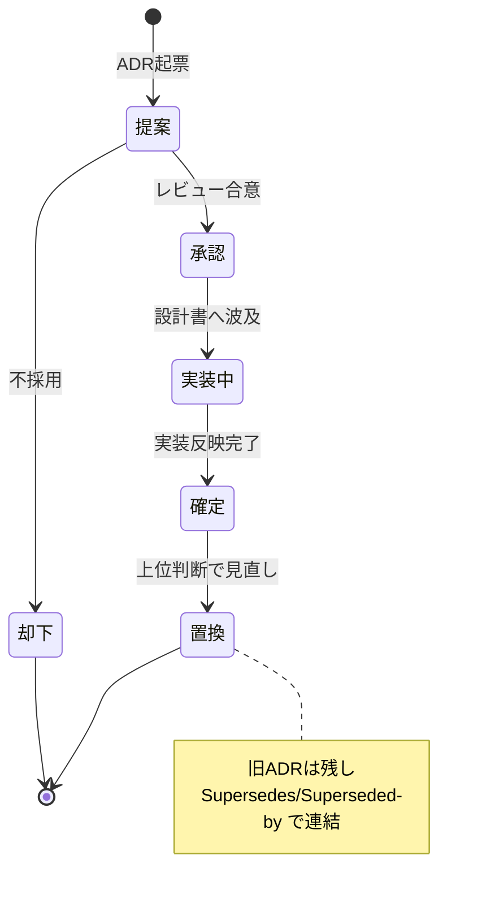
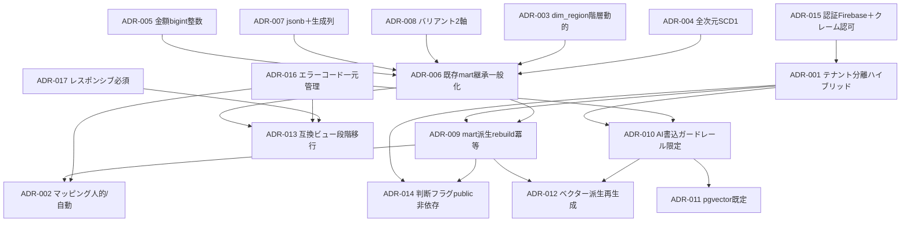

# 意思決定ログ（ADR）— Undeux Platform（UCP）主要設計判断記録

> **ステータス:** ドラフト（レビュー前）
> **版:** v1.0
> **最終更新:** 2026-07-04
> **関連ドキュメント:** [正準設計ブループリント v1.0]（全ドキュメント共通契約・SoT）／ [00 ビジョン・スコープ](./00-vision-scope.md) ／ [用語集](./glossary.md) ／ [BD-01 アーキテクチャ概観](./basic-design/BD-01-architecture-overview.md) ／ [BD-06 非機能設計](./basic-design/BD-06-non-functional.md) ／ [DD-01 正準データモデル](./detailed-design/DD-01-canonical-data-model.md) ／ [DD-06 認証・認可・テナント分離](./detailed-design/DD-06-security-authz-tenancy.md) ／ [DB-01 スキーマ戦略](./database/DB-01-schema-strategy.md) ／ [DB-05 分析スタースキーマ](./database/DB-05-analytics-star-schema.md) ／ [DB-06 マッピングメタデータスキーマ](./database/DB-06-mapping-metadata-schema.md) ／ 継承元 [docs/design.md](../design.md)・[docs/star-schema-design.md](../star-schema-design.md)

---

本ドキュメントは Undeux Platform（略称 **UCP**、プロダクト系統コード `UNDX`）の**主要設計判断を ADR（Architecture Decision Record）形式で記録するログ**である。正準設計ブループリント §11「ADR シード」を各1枚の ADR へ展開し、コンテキスト・決定・代替案・根拠・トレードオフ・影響を明示する。名称・ID・SoT・命名規約はすべて正準設計ブループリント v1.0 が SoT であり、本書はブループリントの決定を **説明・追跡** する立場にある。ブループリントと本書に矛盾が生じた場合は、ブループリントを先に改訂し、その改訂を本 ADR ログへ記録してから各設計書へ波及させる（ブループリント冒頭の改訂プロトコル）。

---

## 0. 本ログの運用方針

### 0.1 ADR のライフサイクルと状態

各 ADR は次の状態を取り、状態遷移は追記のみで記録する（過去の判断を書き換えない＝記録系の巻き戻し禁止＝原則2）。

上図は ADR の状態遷移を示す。**確定**した ADR を後から覆す場合でも旧 ADR は削除せず、新 ADR に `Supersedes:`（旧を置換）／旧 ADR に `Superseded-by:`（新に置換された）の相互リンクを追記して履歴を保全する。これは「記録系データは巻き戻さない」という原則2の ADR ログへの適用である。本 v1.0 時点では ADR-001〜ADR-017 は全て **承認** 状態（ブループリント確定事項に対応。ADR-016/017 は拡張提案の格上げを含む）とする。

### 0.2 記載フォーマット

各 ADR は「コンテキスト（背景・課題）／決定（採用した方針）／代替案（検討した選択肢）／根拠（決め手）／トレードオフ（副作用・妥協）／影響（波及先ドキュメント・エラーコード・データ）」の6要素を必ず含む。関連ドキュメントは相対パスで明記する。

---

## 1. ADR 一覧（インデックス表）

| ADR ID | タイトル | 状態 | 領域 | 主要影響先 | 関連エラーコード領域 |
|---|---|---|---|---|---|
| [ADR-001](#adr-001-テナント分離のハイブリッド方式oltprartmart) | テナント分離のハイブリッド方式（OLTP=RLS／mart=スキーマ分離） | 承認 | セキュリティ／DB | DD-06, DB-01, DB-05 | `UNDX-TENANT-*` |
| [ADR-002](#adr-002-フィールドマッピングは他社人的自社恒等自動) | フィールドマッピングは他社=人的・自社=恒等自動 | 承認 | 連携基盤 | BD-04, DD-03, DB-06 | `UNDX-MAP-*` |
| [ADR-003](#adr-003-地域を自己参照階層-dim_region-とし粒度を動的化) | 地域を自己参照階層 `dim_region` とし粒度を動的化 | 承認 | データモデル | DD-01, DB-02〜05 | `UNDX-DATA-*` |
| [ADR-004](#adr-004-全次元-scd1上書きを採用) | 全次元 SCD1（上書き）を採用 | 承認 | データモデル | DD-01, DB-05 | `UNDX-ANL-*` |
| [ADR-005](#adr-005-金額は最小通貨単位-bigint-整数で保持) | 金額は最小通貨単位 `bigint` 整数で保持 | 承認 | データモデル | DD-01, 全 DB | `UNDX-DATA-*` |
| [ADR-006](#adr-006-既存-fact_sales_weeklydim_-を継承しファクト家族へ一般化) | 既存 `fact_sales_weekly`/`dim_*` を継承しファクト家族へ一般化 | 承認 | 分析mart | DD-01, DB-05 | `UNDX-ANL-*` |
| [ADR-007](#adr-007-業種固有属性は-attributes-jsonb生成列で吸収) | 業種固有属性は `attributes jsonb`＋生成列で吸収 | 承認 | データモデル | DD-01, DB-02〜05 | `UNDX-DATA-*` |
| [ADR-008](#adr-008-汎用バリアントは2軸固定) | 汎用バリアントは2軸固定 | 承認 | データモデル | DD-01, DB-02〜05 | `UNDX-DATA-*` |
| [ADR-009](#adr-009-mart-は-sot-からの派生rebuild-冪等再構築非同期) | mart は SoT からの派生・`rebuild()` 冪等再構築（非同期） | 承認 | 分析mart | BD-03, DD-01, DB-05 | `UNDX-ANL-*` |
| [ADR-010](#adr-010-ai-の実行系書込はガードレール越しのみに限定) | AI の実行系書込はガードレール越しのみに限定 | 承認 | AI／RAG | BD-03, DD-04, DB-08 | `UNDX-AI-*` |
| [ADR-011](#adr-011-ベクターストアは-pgvector-既定規模で外部) | ベクターストアは pgvector 既定・規模で外部 | 承認 | AI／RAG | DD-04, DB-08 | `UNDX-AI-*` |
| [ADR-012](#adr-012-ベクターチャンクインサイトは派生とし-domain_document-から再生成可) | ベクター/チャンク/インサイトは派生とし `domain_document` から再生成可 | 承認 | AI／RAG | DD-04, DB-08 | `UNDX-AI-*` |
| [ADR-013](#adr-013-移行は互換ビューで段階移行旧-api-契約維持) | 移行は互換ビューで段階移行（旧 API 契約維持） | 承認 | 移行／互換 | DD-02, DB-05 | `UNDX-REQ-*` |
| [ADR-014](#adr-014-ユーザー判断フラグは-public自然キー保持で-mart-再構築非依存) | ユーザー判断フラグは public/自然キー保持で mart 再構築非依存 | 承認 | データ保護 | DD-01, DB-05 | `UNDX-ANL-*` |
| [ADR-015](#adr-015-認証は-firebase認可は-カスタムクレーム-rls-の多層防御) | 認証は Firebase・認可は カスタムクレーム＋RLS の多層防御 | 承認 | セキュリティ | DD-06, DB-01 | `UNDX-AUTH-*`, `UNDX-TENANT-*` |
| [ADR-016](#adr-016-拡張提案-エラーコードは-shared_error_code-一元管理api-公開) | 【拡張提案】エラーコードは `shared.error_code` 一元管理＋API公開 | 承認 | 横断／運用 | DD-02, BD-06 | 全 `UNDX-*` |
| [ADR-017](#adr-017-拡張提案-非機能ui-はレスポンシブpc表モバイルカードを必須契約化) | 【拡張提案】非機能：UI はレスポンシブ（PC=表／モバイル=カード）を必須契約化 | 承認 | UX／非機能 | BD-06, DD-05 | `UNDX-REQ-*` |
| [ADR-018](#adr-018-副資材チェックは-ai-画像比較コード内ルールカタログの二層構成) | 副資材チェックは AI 画像比較＋コード内ルールカタログの二層構成 | 承認 | AI／機能追加 | DD-04, design.md §13 | `UNDX-AI-*`, `UNDX-REQ-*` |

> ADR-001〜015 はブループリント §11 のシードに1対1で対応する。ADR-016・ADR-017 はシードに明示されていないが、共有コンテキストおよび CLAUDE.md 原則（エラーコード一元管理・レスポンシブ必須）から導かれる横断判断であるため **拡張提案** として追加した（ブループリント §9・§8.5 の確定事項を ADR 化）。

---

## 2. 意思決定の依存関係

各 ADR は独立ではなく、上位の基盤判断が下位判断の前提となる依存構造を持つ。下図はどの決定が他の決定に依存しているか（矢印の元が前提、先が派生）を示す。テナント分離（ADR-001）と SoT→mart 派生モデル（ADR-009）が2大基盤であり、多くの判断がここに接続する。

上図が示す通り、ADR-015（認証・認可基盤）と ADR-001（テナント分離）が最上流にあり、ADR-006（既存 mart 継承）は型・拡張・次元方針（ADR-003/004/005/007/008）の集約点として機能し、ADR-009（mart 派生 rebuild）へ接続する。エラーコード一元管理（ADR-016）は横断的に AI・マッピング・移行の各判断へ品質保証を供給する。以降、各 ADR の詳細を記す。

---

## 3. 各 ADR

### ADR-001: テナント分離のハイブリッド方式（OLTP=RLS／mart=スキーマ分離）

- **状態:** 承認
- **領域:** セキュリティ／マルチテナント（ブループリント §8.3）

**コンテキスト**
UCP は契約クライアント組織（`shared.tenant`、`account_type ∈ {retailer, maker, warehouse, internal}`）を分離単位とするマルチテナント SaaS である。業務 OLTP（`retail`/`maker`/`wms`/`mapping`/`backoffice`/`knowledge`）は書込頻度が高くテナント数の増加に対して運用オーバーヘッドを抑えたい。一方、分析 mart は継承元がメーカー単位スキーマ分離（`mart_{tenant_code}`）で実装済みであり、テナント境界を物理的に強く分けたい。両者を同一方式に揃えるとどちらかに無理が生じる。

**決定**
テナント分離を **ハイブリッド** とする。OLTP は共有テーブル＋ PostgreSQL Row-Level Security（`tenant_id` 論理列、接続時にセッション変数 `app.tenant_id` を設定）。分析 mart は **スキーマ分離** `mart_{tenant_code}`。`shared` 参照マスタのうち `region`/`unit`/`currency`/`calendar_date` はグローバル非テナント、`product`/`sku`/`trading_partner` はテナント所有とする。

**代替案**
1. 全面スキーマ分離（OLTP も mart もテナント別スキーマ）
2. 全面 RLS（mart も共有テーブル＋RLS）
3. テナント別 DB（物理データベース分離）

**根拠**
OLTP を RLS にすることでスキーマ増殖の運用コスト（マイグレーション×テナント数）を回避しつつ、`tenant_id` による行分離で境界を担保できる。mart はスキーマ分離により継承資産をそのまま活かし、テナント横断集計を「自社運用の別経路」に限定して越境リスクを構造的に排除できる。全面スキーマ分離は OLTP のマイグレーション運用が破綻し、全面 RLS は継承資産の作り直しが発生、DB 分離はコスト過大。

**トレードオフ**
2方式併存により、開発者は「どちらの層を触っているか」を常に意識する必要がある。OLTP の RLS は `app.tenant_id` 設定漏れが即座に越境事故になるため、接続層での強制設定と `UNDX-TENANT-*` による検知が必須。mart のテナント横断分析は標準経路から外れ、専用の権限付き経路を別途設計する必要がある。

**影響**
- 波及: [DD-06 認証・認可・テナント分離](./detailed-design/DD-06-security-authz-tenancy.md)、[DB-01 スキーマ戦略](./database/DB-01-schema-strategy.md)、[DB-05 分析スタースキーマ](./database/DB-05-analytics-star-schema.md)
- エラーコード: `UNDX-TENANT-*`（テナント境界／RLS／権限スコープ違反）
- SoT: テナント定義の SoT は `shared.tenant`。`mart_schema` 列がテナントと mart スキーマの対応を保持。
- 依存: ADR-015（認証・クレーム）を前提とし、ADR-009・ADR-010・ADR-014 の前提となる。

---

### ADR-002: フィールドマッピングは他社=人的・自社=恒等自動

- **状態:** 承認
- **領域:** 連携基盤 DataBridge（ブループリント §5, §3.5）

**コンテキスト**
mart へのスタースキーマ化には、各ソース項目を正準ターゲット（`mapping.canonical_target`）へ対応付ける必要がある。他社サービス由来データは項目名・粒度・型がばらばらで機械推論だけでは精度が出ない。一方、自社アプリ（`retail`/`maker`/`wms`）は最初からスタースキーマ連携前提でスキーマ設計されており、対応はほぼ自明である。

**決定**
マッピング解決を二分する。他社ソース（`mapping.source_system.system_type='external'`）は `mapping.field_mapping.resolved_by='human'` で人がマッピングを確定する。自社アプリ（`system_type='self'`）は `resolved_by='auto'` の **恒等マッピング** で人的解決を省略し直結する。

**代替案**
1. 全自動推論（LLM/ヒューリスティックで全ソースを自動マッピング）
2. 全人的（自社ソースも人が確認）

**根拠**
自社直結は恒等写像で低コスト・高信頼を得られ、初期セットアップの摩擦を最小化する（差別化ポイント「連携難易度の低さ」）。他社は人的確定で精度を確保し、誤マッピングによる分析誤りを防ぐ。全自動は他社データで誤りが混入、全人的は自社の自明な対応にまで工数を要し非効率。

**トレードオフ**
人的マッピング運用の UI・ワークフロー（提案→確認→承認）を DataBridge に実装する必要がある。恒等マッピングも「自社スキーマ＝正準ターゲット」の対応が崩れないよう、自社スキーマ変更時に恒等性を再検証するガードが必要（ドリフト検知）。

**影響**
- 波及: [BD-04 連携・変換パイプライン](./basic-design/BD-04-integration-data-pipeline.md)、[DD-03 マッピング/変換エンジン](./detailed-design/DD-03-mapping-transform-engine.md)、[DB-06 マッピングメタデータスキーマ](./database/DB-06-mapping-metadata-schema.md)
- エラーコード: `UNDX-MAP-*`（マッピング/変換）、`UNDX-DQ-*`（品質検証）
- SoT: 他社連携データの SoT は `staging.raw_record`／`staging.import_batch`。マッピング定義の SoT は `mapping.field_mapping`。
- グレースフルデグラデーション: 一部フィールドが未マッピングでも、確定済みフィールドのみで取込を進め、未解決分は `UNDX-MAP-*` で警告する（補助処理の失敗が主要フローを止めない＝原則4）。

---

### ADR-003: 地域を自己参照階層 `dim_region` とし粒度を動的化

- **状態:** 承認
- **領域:** データモデル（ブループリント §3.0, §4.1）

**コンテキスト**
分析軸の基本は「商品・地域・販売先」。クライアントの商売規模により、地域粒度は都道府県レベルで足りる場合と市区町村レベルまで必要な場合がある。粒度ごとに固定列（`prefecture` 列／`municipality` 列）を持つと、規模差ごとにスキーマが分岐し汎用化できない。

**決定**
地域を `shared.region`（OLTP）／`dim_region`（mart）として、国 > 都道府県 > 市区町村の **自己参照階層**（`parent_region_id`／`parent_region_key`、`level ∈ {country, prefecture, municipality}`）で表現する。粒度はテナントの `shared.tenant.region_granularity`（`prefecture`／`municipality`）で **動的切替** する。

**代替案**
1. 都道府県固定列（`prefecture_code`/`prefecture_name`）
2. 市区町村固定列（最も細かい粒度で固定）

**根拠**
1構造で規模差に対応でき、粒度切替をデータ（テナント設定）で制御できる。固定列方式は規模差ごとにスキーマ・クエリが分岐し、汎用 SI 戦略（共通化最大化）に反する。自己参照階層は将来の粒度追加（例: 地区・ブロック）にも構造変更なしで追随できる。

**トレードオフ**
階層クエリ（再帰 CTE や事前展開）が必要になり、集計クエリの複雑度が上がる。粒度動的化のため、mart の `dim_region` は `level` を跨ぐ結合に注意が必要（粒度の異なるファクトを混在集計しない設計上の規律が要る）。

**影響**
- 波及: [DD-01 正準データモデル](./detailed-design/DD-01-canonical-data-model.md)、[DB-02〜05 各物理スキーマ](./database/DB-05-analytics-star-schema.md)
- SoT: `shared.region`（グローバル参照マスタ）。`climate_region_ref` で気候地域（`dim_climate`）と接続。
- 依存: ADR-006（mart 一般化）の構成要素。`dim_customer`/`dim_warehouse` が `dim_region` を参照する。

---

### ADR-004: 全次元 SCD1（上書き）を採用

- **状態:** 承認
- **領域:** データモデル／分析mart（ブループリント §4, §10）

**コンテキスト**
コンフォームド次元の属性が時間とともに変化した場合の履歴方針（SCD: Slowly Changing Dimension）を決める必要がある。継承元 mart は全次元 SCD1（上書き）で実装済み。定価（`list_price`）はほぼ不変、履歴台帳の要件は現時点で存在しない。

**決定**
全次元を **SCD1（上書き）** とする。属性変化時は最新値で上書きし、変更履歴の別行を持たない。`dim_climate` のみ実測値の上書き（同一グレインの気温実測更新）として SCD1 を適用する。

**代替案**
1. SCD2（属性変化ごとに有効期間付きの新行を追加し履歴保持）
2. 次元ごとに SCD1/SCD2 を混在

**根拠**
定価はほぼ不変・履歴台帳の業務要件なし・移行後の状態を正とする方針（継承・YAGNI）。SCD2 は履歴行管理・有効期間結合・サロゲート再発行の複雑さを持ち込むが、現要件では便益が見合わない。混在は次元ごとに結合ロジックが分岐し保守負荷が高い。

**トレードオフ**
将来「価格改定履歴で過去売上を当時価格で再評価したい」等の要件が出た場合、SCD1 では過去時点の属性を復元できない。この制約は既知の未決事項として §5 に記載し、要件顕在化時に対象次元のみ SCD2 化する ADR を新規起票する（本 ADR を Superseded せず追補）。

**影響**
- 波及: [DD-01 正準データモデル](./detailed-design/DD-01-canonical-data-model.md)、[DB-05 分析スタースキーマ](./database/DB-05-analytics-star-schema.md)
- SoT: 次元の属性値の SoT は各 OLTP マスタ。mart は最新値の派生キャッシュであり `rebuild()` で最新に追随。
- 下位互換: 継承元 mart と同一方針のため互換ビュー（ADR-013）と整合。

---

### ADR-005: 金額は最小通貨単位 `bigint` 整数で保持

- **状態:** 承認
- **領域:** データモデル／型方針（ブループリント §8.4）

**コンテキスト**
売上・原価・請求など金額メジャーを多数扱う。浮動小数（float/double）は丸め誤差で集計不整合を生む。多通貨対応（`shared.currency.minor_unit` で小数桁が通貨ごとに異なる）も見据える必要がある。

**決定**
金額は **最小通貨単位の整数 `bigint`** で保持する（例: 日本円は 1 円単位、`minor_unit=0`。小数2桁通貨は最小単位=1/100）。表示時に `currency.minor_unit` で桁を解釈する。`amount`/`gross_profit`/`list_price`/`sale_price`/`cost_price`/`unit_price`/請求 `amount` 等すべての金額列に適用する。

**代替案**
1. `numeric`/`decimal`（固定小数点）
2. 円 `float`（既存簡易実装の延長）

**根拠**
整数演算は丸め誤差がなく、加算的メジャーの集計が正確。多通貨は `minor_unit` による解釈で1つの型に統一できる。`numeric` は正確だが演算コスト・ストレージが大きく、`float` は誤差で会計整合が崩れる。

**トレードオフ**
アプリ層・API 層で「最小通貨単位 ⇔ 表示単位」の変換責務が生じる。この変換を1箇所（共通フォーマッタ）に集約しないと桁ズレ事故が起きるため、フロント/バックエンド双方に通貨フォーマットユーティリティを標準化する必要がある。

**影響**
- 波及: [DD-01 正準データモデル](./detailed-design/DD-01-canonical-data-model.md)、[DD-02 API設計](./detailed-design/DD-02-api-interface-design.md)、全 DB 設計書
- SoT: 通貨定義は `shared.currency`（`iso_code`/`minor_unit`/`symbol`、静的マスタ）。
- 下位互換: 既存データが円 `float` 等で保持されている場合、`minor_unit` に基づく整数化のデータ更新パッチが必要（原則7）。移行手順は §5 未決事項に紐付く。

---

### ADR-006: 既存 `fact_sales_weekly`/`dim_*` を継承しファクト家族へ一般化

- **状態:** 承認
- **領域:** 分析mart（ブループリント §4, §11）

**コンテキスト**
継承元 `docs/star-schema-design.md` の `fact_sales_weekly` と `dim_date`/`dim_retailer`/`dim_vendor`/`dim_product`/`dim_sku`/`dim_climate` は実装・運用実績がある。UCP は小売に加えメーカー生産・発注・納品、倉庫入出庫、請求まで扱うため、ファクトを増やす必要がある。既存資産を捨てて再設計するか、継承して拡張するかを決める。

**決定**
既存 `fact_sales_weekly` と `dim_*` を **そのまま継承** し、コンフォームド次元（`dim_region`/`dim_customer`/`dim_channel`/`dim_warehouse` を追加）と **ファクト家族**（`fact_sales_daily`/`fact_inventory_snapshot`/`fact_orders`/`fact_production`/`fact_delivery`/`fact_warehouse_movement`/`fact_billing`）へ一般化する。既存ファクト・次元の名称・グレイン・メジャーは不変。

**代替案**
1. 全面再設計（新命名・新グレインでスタースキーマを作り直す）

**根拠**
実装資産と互換ビュー移行（ADR-013）を継承でき、既存分析画面を壊さずに機能拡張できる。全面再設計はフロント・クエリ・移行の作り直しコストが大きく、稼働中の分析価値を毀損する。既存を核にコンフォームド次元を共有することで、複数ファクト間の集計整合（コンフォームド次元の便益）を得る。

**トレードオフ**
既存命名を不変にするため、新ファクトも既存の命名規約・グレイン思想に合わせる制約が生じる（例: 週=月曜基準の踏襲）。日次派生 `fact_sales_daily` は継承元で未実装のため、実装タイミングを別途計画する必要がある。

**影響**
- 波及: [DD-01 正準データモデル](./detailed-design/DD-01-canonical-data-model.md)、[DB-05 分析スタースキーマ](./database/DB-05-analytics-star-schema.md)
- SoT: 各ファクトの SoT は対応する OLTP（`retail`/`maker`/`wms`）または `staging`。mart は派生。
- 依存: ADR-003/004/005/007/008 を構成要素として集約し、ADR-009（rebuild）・ADR-013（互換ビュー）へ接続。

---

### ADR-007: 業種固有属性は `attributes jsonb`＋生成列で吸収

- **状態:** 承認
- **領域:** データモデル／拡張方針（ブループリント §8.4, §3.0）

**コンテキスト**
アパレル（色/サイズ）・食品（容量/味）など業種ごとに商品属性が異なる。属性追加のたびに DDL（列追加）とマイグレーションが発生すると、SI での柔軟なクライアント対応ができない。一方、集計性能（例: `season` での絞り込み）も担保したい。

**決定**
業種固有属性は `attributes jsonb` に格納し、頻用軸は **生成列**（`GENERATED ALWAYS AS (...) STORED`）で物理化し索引を張る（例: `season` 生成列）。コア列（業種非依存）＋jsonb拡張（業種依存）の「コアと拡張の分離」を全 OLTP／mart 共通の拡張方針とする。

**代替案**
1. 業種別拡張テーブル（`product_apparel`/`product_food` 等）
2. nullable 列を業種横断で列挙（幅広テーブル）

**根拠**
DDL 変更なしで属性追加でき、SI カスタマイズの摩擦を最小化しつつ、生成列＋索引で集計性能を担保する（read/write バランスの明確な根拠がある例外的非正規化）。業種別テーブルは結合が業種で分岐し汎用性を損ない、nullable 列列挙は疎な巨大テーブルとなり保守困難。

**トレードオフ**
jsonb はスキーマレスゆえに項目の型・存在保証が弱く、データ品質検証（`mapping.data_quality_rule`／`UNDX-DQ-*`）で補う必要がある。生成列を増やしすぎると書込コストと索引肥大が生じるため、生成列化は頻用軸に限定する規律が要る。

**影響**
- 波及: [DD-01 正準データモデル](./detailed-design/DD-01-canonical-data-model.md)、[DB-02〜05 各物理スキーマ](./database/DB-05-analytics-star-schema.md)
- エラーコード: `UNDX-DQ-*`（jsonb 内項目の品質検証）
- 依存: ADR-008（バリアント2軸）と協調し、軸で表せない属性を jsonb が吸収。

---

### ADR-008: 汎用バリアントは2軸固定

- **状態:** 承認
- **領域:** データモデル（ブループリント §3.0, §10）

**コンテキスト**
SKU の差異（色/サイズ、容量/味など）を汎用表現する必要がある。継承元は `variant_axis1_label/value`・`variant_axis2_label/value` の2軸で表現している。軸数を可変 N にするか、2軸固定にするかを決める。

**決定**
汎用バリアントは **2軸固定**（`variant_axis1_label/value`, `variant_axis2_label/value`）とする。軸ラベルの意味（色/サイズ等）はテナント別メタデータで解決する。3軸目以上が必要な属性は `attributes jsonb`（ADR-007）で吸収し、それでも軸として集計必須なら **設計見直しの ADR を新規起票** する。

**代替案**
1. 可変 N 軸（軸を別テーブルで正規化し任意数を許容）
2. 業種別スキーマ（業種ごとに軸を固定列で持つ）

**根拠**
2軸は集計クエリの単純さ（固定列で GROUP BY 可能）と表現力のバランスが良い。継承元との互換を保てる。可変 N 軸は集計のたびにピボットが必要で性能・複雑度が悪化、業種別スキーマは汎用化に反する。実運用で色/サイズ・容量/味の2軸で大半をカバーできる経験則に基づく。

**トレードオフ**
3軸目を要する業種（例: 色×サイズ×素材）では、3軸目を jsonb 側に置くため軸としての集計が一段手間になる。この境界（2軸で足りるか）は SI 導入時に評価が必要で、恒常的に3軸集計が要るクライアントが増えれば ADR 見直しのトリガーとなる。

**影響**
- 波及: [DD-01 正準データモデル](./detailed-design/DD-01-canonical-data-model.md)、[DB-02〜05](./database/DB-05-analytics-star-schema.md)
- 依存: ADR-007（jsonb 拡張）が3軸目以降の逃がし先。ADR-006（mart 継承）の `dim_sku` 構造に一致。

---

### ADR-009: mart は SoT からの派生・`rebuild()` 冪等再構築（非同期）

- **状態:** 承認
- **領域:** 分析mart／データフロー（ブループリント §4, §7）

**コンテキスト**
mart は複数 OLTP／staging から集約されるコンフォームド・スタースキーマである。大規模集約は実行時間が長く、同期実行や即時トリガ更新ではタイムアウトや部分更新による不整合が起きる。再実行時に記録系（進捗・ログ）が巻き戻ってはならない。

**決定**
mart は常に **SoT（各 OLTP／`staging`）からの派生キャッシュ** とし、`mart.rebuild()` による **冪等再構築** で最新化する。実装制約は継承通り: advisory lock による直列化・`SET LOCAL statement_timeout=0`・**非同期実行**。SoT 書込 → mart 更新の順序を全モジュールで厳守する。

**代替案**
1. 同期再構築（API リクエスト内で mart を更新）
2. トリガ即時更新（OLTP 変更をトリガで mart へ即反映）

**根拠**
大規模集約のタイムアウトを回避し、冪等性で「何度実行しても結果が同一・記録系が巻き戻らない」状態保護を実現する（原則2）。同期は長時間リクエストでタイムアウト、トリガ即時はロック競合と部分更新の温床。advisory lock 直列化で二重 rebuild を防ぎ、非同期でユーザー操作をブロックしない。

**トレードオフ**
mart は SoT に対して結果整合（rebuild までのラグ）を持つ。ラグ許容範囲と rebuild スケジュール（オンデマンド／定期）の設計が必要。rebuild 失敗時は前回の mart を保持し、`UNDX-ANL-*` で失敗を記録して主要フローを止めない（グレースフルデグラデーション）。

**影響**
- 波及: [BD-03 分析・AIプラットフォーム](./basic-design/BD-03-analytics-ai-platform.md)、[DD-01 正準データモデル](./detailed-design/DD-01-canonical-data-model.md)、[DB-05 分析スタースキーマ](./database/DB-05-analytics-star-schema.md)
- エラーコード: `UNDX-ANL-*`（rebuild／集計失敗）
- SoT: §7 SoT 宣言マップに一致。回復パスは `mart.rebuild()`／`mapping.job_run` 再実行。
- 依存: ADR-001（mart スキーマ分離）・ADR-006（継承）を前提。ADR-014（判断フラグ非依存）の背景。

---

### ADR-010: AI の実行系書込はガードレール越しのみに限定

- **状態:** 承認
- **領域:** AI／RAG／エージェント（ブループリント §6, §11）

**コンテキスト**
KnowledgeCore / VirtualCompany は集計・分類・インデックス化・ベクター化・インサイト生成・意思決定支援を担う。AI が業務データ（OLTP）を直接更新できると、テナント境界越え・監査不能・誤操作のリスクが生じる。

**決定**
AI の組込範囲を **集計/分類/インデックス化/ベクター化/インサイト生成＋エージェント支援** に限定する。実行系書込（業務 OLTP の更新）は **ガードレール（`Guardrail`: PII 遮断／テナント境界／根拠必須）越しのみ** 許可し、AI が直接 OLTP を書き換えることを禁止する。エージェントの提案（`knowledge.insight`／`agent_message`）は記録系として保存し、実行は人間承認またはガードレール通過を経る。

**代替案**
1. AI に直接業務更新を許可（エージェントが OLTP を書込）

**根拠**
テナント境界と監査可能性を構造的に確保する。AI 直接更新は越境・誤更新・出典なし操作を招き、RLS（ADR-001）や監査列の意味を無効化する。ガードレール経由に限定することで、AI の出力を「提案・派生」に閉じ込め、SoT の完全性を守る。

**トレードオフ**
AI がワンステップで業務を完結できず、承認/ガードレール層の実装が必要になる（自動化度は下がるが安全性を優先）。ガードレール自体の失敗はグレースフルに扱い、`UNDX-AI-*` で記録して主要フローを止めない。

**影響**
- 波及: [BD-03 分析・AIプラットフォーム](./basic-design/BD-03-analytics-ai-platform.md)、[DD-04 AI/RAG/エージェント設計](./detailed-design/DD-04-ai-rag-agent-design.md)、[DB-08 knowledge スキーマ](./database/DB-08-knowledge-vector-snapshot-schema.md)
- エラーコード: `UNDX-AI-*`（ガードレール／エージェント）、`UNDX-TENANT-*`（越境検知）
- SoT: AI 生成物（`insight`/`agent_run`/`agent_message`）は記録系・派生。業務 SoT は各 OLTP。
- 依存: ADR-001（テナント境界）を前提、ADR-011・ADR-012 の前提。

---

### ADR-011: ベクターストアは pgvector 既定・規模で外部

- **状態:** 承認
- **領域:** AI／RAG（ブループリント §6, §8.5）

**コンテキスト**
RAG のためチャンク（`knowledge.document_chunk`）を埋め込み（`knowledge.embedding`）してベクター検索する。初期は構成をシンプルにしたいが、将来のデータ量増でスケールも見据える必要がある。

**決定**
ベクターストアは **pgvector を既定** とし、`knowledge.embedding.vector` を PostgreSQL 16 内で管理する。規模拡大時は **外部ベクターストア** へ移行する（`vector` は「pgvector or 外部参照」の両対応）。

**代替案**
1. 常時外部専用ベクターストア（初期から専用サービス）

**根拠**
初期の構成簡素化（DB を1つに集約・運用対象を減らす）とスケール余地（規模で外部化）を両立する。常時外部は初期から運用対象・コストが増え、小規模テナントには過剰。pgvector は OLTP/mart と同一 PostgreSQL で完結し、トランザクション整合も取りやすい。

**トレードオフ**
pgvector から外部ストアへの移行時に、`embedding` の格納方式・検索 API の切替が必要。`dim`（次元数）・`model` を保持し、移行時に再生成（ADR-012）で吸収できるよう設計する。移行境界（規模しきい値）は未決事項（§5）。

**影響**
- 波及: [DD-04 AI/RAG/エージェント設計](./detailed-design/DD-04-ai-rag-agent-design.md)、[DB-08 knowledge スキーマ](./database/DB-08-knowledge-vector-snapshot-schema.md)
- エラーコード: `UNDX-AI-*`
- 依存: ADR-010 を前提、ADR-012（再生成可）と協調。

---

### ADR-012: ベクター/チャンク/インサイトは派生とし `domain_document` から再生成可

- **状態:** 承認
- **領域:** AI／RAG／データフロー（ブループリント §6, §7）

**コンテキスト**
チャンク・埋め込み・インサイトは、埋め込みモデルの更新やチャンク戦略の変更で作り直しが発生する。これらを SoT 扱いにすると、モデル更新のたびに「正本」の再定義が必要になり再現性が損なわれる。

**決定**
`knowledge.document_chunk`／`knowledge.embedding`／`knowledge.insight` を **派生** とし、SoT は `knowledge.domain_document`（＋オブジェクトストレージの本文）とする。`EmbeddingPipeline` 再実行で `domain_document` から再生成可能とする。埋め込みは `(document_chunk_id, model)` UNIQUE でモデル別に併存でき、モデル更新時は新 `model` で再生成する。

**代替案**
1. 生成物（チャンク/埋め込み/インサイト）を SoT 扱い

**根拠**
再現性（同じ原本から同じパイプラインで再生成）とモデル更新への追随を確保する。生成物 SoT はモデル更新時に正本喪失・再現不能のリスク。派生扱いなら、モデル改善・チャンク戦略変更を再生成で安全に反映できる。

**トレードオフ**
再生成コスト（大量ドキュメントの再埋め込み）が発生する。`insight` は記録系でもあり、再生成で過去インサイトを消さないよう `generated_at`/バージョンで追記管理し、記録の巻き戻しを避ける（原則2）。

**影響**
- 波及: [DD-04 AI/RAG/エージェント設計](./detailed-design/DD-04-ai-rag-agent-design.md)、[DB-08 knowledge スキーマ](./database/DB-08-knowledge-vector-snapshot-schema.md)
- SoT: §7 に一致（SoT=`domain_document`、派生=`chunk`/`embedding`、回復パス=`EmbeddingPipeline` 再実行）。
- 依存: ADR-009（派生・冪等再構築の思想）と同型、ADR-011（ストア切替）と協調。

---

### ADR-013: 移行は互換ビューで段階移行（旧 API 契約維持）

- **状態:** 承認
- **領域:** 移行／下位互換（ブループリント §11, §10）

**コンテキスト**
継承元 UndeuxSales は稼働中で、既存分析画面・API が動いている。UCP への一般化でスキーマが変わると、フロントや外部利用者の API 契約が壊れる恐れがある。ビッグバン移行はロールバックが困難でリスクが高い。

**決定**
移行は **互換ビュー**（旧形状を保つビュー）で **段階移行** する。新スキーマの上に旧テーブル/旧レスポンス形状を再現するビューを置き、旧 API 契約を維持したままバックエンドを差し替える。フロント無改修で切替でき、問題時は旧経路へロールバック可能とする。

**代替案**
1. ビッグバン移行（一括でスキーマ・API を切替）

**根拠**
ロールバック容易・フロント無改修（継承済みの実績ある移行手法）。ビッグバンは切替時の全面停止・広範な同時改修・ロールバック困難というリスクを負う。互換ビューは下位互換性（原則7）を構造的に担保する。

**トレードオフ**
互換ビューの保守が一定期間必要（新旧2形状の並存）。ビューの性能が実体テーブルに劣る場合があり、移行完了後に互換ビューを段階的に廃止する計画（廃止時期・通知）が必要。

**影響**
- 波及: [DD-02 API設計](./detailed-design/DD-02-api-interface-design.md)、[DB-05 分析スタースキーマ](./database/DB-05-analytics-star-schema.md)
- エラーコード: `UNDX-REQ-*`（旧契約の検証）
- 下位互換: 本 ADR が原則7（既存 I/F・データ保護）の中核実装。データ更新パッチはオペレーターへ手順説明の上で適用。
- レスポンシブ: 互換ビューで旧画面契約を保つため、新 UI 側は ADR-017 のレスポンシブ要件を独立に満たす。

---

### ADR-014: ユーザー判断フラグは public/自然キー保持で mart 再構築非依存

- **状態:** 承認
- **領域:** データ保護（ブループリント §7, §11）

**コンテキスト**
在庫アクションフラグ等、ユーザーが手作業で付与する判断データがある。これを mart 内（`fact_*`/`dim_*`）に保持すると、`rebuild()`（ADR-009）の再構築（TRUNCATE＋再ロード）でユーザー判断が消える。記録系データの巻き戻しは原則2に反する。

**決定**
在庫アクションフラグ等のユーザー判断データは、mart の外（`public` スキーマ相当・自然キー保持）に置き、**mart 再構築の影響を受けない** 設計とする（継承の `retail.inventory_action_flag` を踏襲）。明細表示時に自然キーで mart 側と結合して表示する。

**代替案**
1. mart 内（`fact_*`）にフラグ列として保持

**根拠**
`rebuild()` の TRUNCATE 影響を回避し、ユーザーの手作業判断（記録系）を保護する（原則2・状態保護）。mart 内保持だと再構築で消えるか、消さないための例外ロジックが rebuild を複雑化する。自然キー結合により mart のサロゲートキー再発行にも影響されない。

**トレードオフ**
表示時に自然キー結合が必要（サロゲートキー結合より一段のコスト）。フラグの SoT が mart 外に分かれるため、フラグと mart 明細の整合（対象 SKU が mart から消えた場合の孤児フラグ）を扱う規律が必要。

**影響**
- 波及: [DD-01 正準データモデル](./detailed-design/DD-01-canonical-data-model.md)、[DB-05 分析スタースキーマ](./database/DB-05-analytics-star-schema.md)
- SoT: ユーザー判断フラグの SoT は `public`/自然キーテーブル（mart とは独立）。§7 の該当行に一致。
- 依存: ADR-009（rebuild）の副作用を回避するための対の判断。

---

### ADR-015: 認証は Firebase・認可は カスタムクレーム＋RLS の多層防御

- **状態:** 承認
- **領域:** セキュリティ／認証認可（ブループリント §8.3, §8.5）

**コンテキスト**
既存アプリは Firebase Authentication を利用済み（ID トークン=JWT、カスタムクレーム `role`/`accountType`）。マルチテナント（ADR-001）でテナント境界・権限スコープを堅牢に守る必要がある。認証と認可の責務配置を決める。

**決定**
認証は **Firebase Authentication**（ID トークン=JWT）を継承。認可スコープは **カスタムクレーム `role`/`accountType`** ＋ **PostgreSQL RLS（`tenant_id`）** の **多層防御** とする。`shared.user_account` は Firebase Auth（`firebase_uid`）の映像（SoT は Firebase）とし、テナント定義 SoT は `shared.tenant`。

**代替案**
1. 独自 IdP（自前で認証基盤を構築）
2. DB のみで認可（アプリ層クレームを使わず DB 権限だけ）

**根拠**
既存継承（Firebase 実績）と多層防御（アプリ層クレーム＋DB 層 RLS の二重化）でどちらか一方の漏れを他方が補う。独自 IdP は構築・運用コストと脆弱性リスク、DB のみ認可はアプリ層の early rejection ができず攻撃面が広がる。

**トレードオフ**
Firebase クレームと `shared.user_account`／`shared.tenant` の同期（`role`/`accountType` 変更時の反映）が必要。同期には Firebase Admin SDK による再同期パスを用意する（SoT=Firebase → キャッシュ=`user_account`）。クレームと RLS セッション変数（`app.tenant_id`）設定の一貫性を接続層で担保する。

**影響**
- 波及: [DD-06 認証・認可・テナント分離](./detailed-design/DD-06-security-authz-tenancy.md)、[DB-01 スキーマ戦略](./database/DB-01-schema-strategy.md)
- エラーコード: `UNDX-AUTH-*`（認証）、`UNDX-TENANT-*`（境界／スコープ）
- SoT: 認証は Firebase Auth、テナントは `shared.tenant`。回復パスは Firebase Admin SDK 再同期。
- 依存: 最上流。ADR-001（RLS）の前提。

---

### ADR-016: 【拡張提案】エラーコードは `shared.error_code` 一元管理＋API 公開

- **状態:** 承認（拡張提案）
- **領域:** 横断／運用（ブループリント §9）

**コンテキスト**
ブループリント §9 でエラーコード領域（`UNDX-{領域}-{連番}`）は確定しているが、その **一元管理方式と公開方法** は ADR シードに明示がない。CLAUDE.md 原則4・共有コンテキストは「想定エラーにエラーコードを付与し一元管理」を要求する。コードが散在すると領域割当の重複・不整合が起きる。

**決定**（拡張提案）
エラーコードは **`shared.error_code`（テーブル）＋ Core の `ErrorCodes`（コード内定義）を SoT** として一元管理し、`GET /api/error-codes` で公開する。コード内定義（`ErrorCodes`）が SoT で、`shared.error_code` はその映像。連番は領域内で 001 から採番する。新領域（`TENANT`/`MAP`/`DQ`/`RTL`/`MKR`/`WMS`/`ANL`/`AI`/`BILL`）はブループリント §9 の割当に従う。

**代替案**
1. 各モジュールでエラーコードを個別定義（分散管理）
2. DB（`shared.error_code`）を SoT とする

**根拠**
コードを SoT にすることでコンパイル時に整合を取れ（型安全・重複検知）、DB を映像にすることで API 公開・多言語メッセージ運用に対応できる。分散管理は領域割当の衝突を招く。DB を SoT にするとアプリのコード分岐が DB 依存になり不便。API 公開でフロント/外部が最新のエラー辞書を取得でき、契約の透明性が上がる。

**トレードオフ**
`ErrorCodes`（コード）→ `shared.error_code`（DB）の同期を維持する必要がある（SoT→映像の順序）。同期漏れ防止のため、起動時シード or マイグレーションで DB を更新する運用を定める。

**影響**
- 波及: [DD-02 API設計](./detailed-design/DD-02-api-interface-design.md)、[BD-06 非機能設計](./basic-design/BD-06-non-functional.md)
- エラーコード: 全 `UNDX-*` 領域（本 ADR がその管理基盤）
- SoT: `ErrorCodes`（コード内定義）が SoT、`shared.error_code` は映像、`GET /api/error-codes` で公開。
- 依存: ADR-002/010/013 等、各領域のエラー付与が本管理基盤に接続する。

---

### ADR-017: 【拡張提案】非機能：UI はレスポンシブ（PC=表／モバイル=カード）を必須契約化

- **状態:** 承認（拡張提案）
- **領域:** UX／非機能（ブループリント §8.5、CLAUDE.md 原則8）

**コンテキスト**
UCP はフロントに Nuxt 4/Vue 3/Tailwind CSS v4 を採用し、分析・業務画面を提供する。CLAUDE.md 原則8・共有コンテキストは「PC のリスト/テーブルはモバイルでカード型等の可読形式を検討」を要求するが、ADR シードには非機能の UI 契約が明示されていない。「PC で動く」だけを完了とする実装を防ぐ必要がある。

**決定**（拡張提案）
UI はレスポンシブを **必須契約** とする。PC 向けにリスト/テーブルで表示するデータは、モバイルでは **カード型レイアウト等の可読形式** を提供する。分析画面（KPI/クロス集計/ランキング/在庫健全性/散布図）およびマッピング運用 UI・バックオフィス画面すべてに適用する。「PC で動く」だけでは完了としない。

**代替案**
1. PC 優先（モバイルは将来対応）
2. 個別画面ごとに判断（横断契約にしない）

**根拠**
モバイル可読性を初期から作り込むことで後付け改修の負債を回避する（CLAUDE.md 原則8）。PC 優先はモバイル対応の技術負債を積み、個別判断は品質のばらつきを生む。横断契約化により全画面の一貫したレスポンシブ品質を担保する。

**トレードオフ**
全画面でモバイルレイアウト（カード変換等）の実装・検証工数が生じる。共通コンポーネント（テーブル⇔カード切替）を標準化しないと各画面で重複実装になるため、レスポンシブ表示の共通部品化が前提となる。

**影響**
- 波及: [BD-06 非機能設計](./basic-design/BD-06-non-functional.md)、[DD-05 画面/UX/SI戦略](./detailed-design/DD-05-screen-ux-si-strategy.md)
- エラーコード: `UNDX-REQ-*`（入力系のクライアント検証と協調）
- 依存: ADR-013（互換ビューで旧画面契約維持）と独立に、新 UI 側で本要件を満たす。

---

### ADR-018: 副資材チェックは AI 画像比較＋コード内ルールカタログの二層構成

- **状態:** 承認（現行アプリ実装判断）
- **領域:** AI／機能追加（design.md §13、CLAUDE.md 原則2・3・4）

**コンテキスト**
しまむらと取引するメーカーは副資材（タグ・下げ札・品質表示）の規定チェック義務を負う。プロトタイプ（subsidiary-materials-agent リポジトリ）は手入力フォーム＋決定的ルールエンジンだったが、実業務の入力は指示書（工程表 FAX）画像と実物タグ画像の突合であり、商品マスタには付属情報（組成・原産国・洗濯表示等）の追加が予定されている。

**決定**
入力は画像（指示書1〜3枚・タグ1〜10枚）とし、比較判定は Anthropic Claude の画像認識で行う（チェック3要素: レイアウト／順番／内容）。規定ルール（アイコン優先順位・禁止用語・表示順序・寸法）は Core `SubsidiaryCheckRuleCatalog` を単一 SoT とし、AI プロンプトのルールテキストとルールブック API 応答を同一カタログから生成する。チェック記録は `subsidiary_check` に不変記録として保存し、再実行は failed および孤児化した processing（作成10分超）のみ許可（completed は API・DB 層の両方で上書き保護＝記録保護）。付属情報は `m_product_attachment`（additive・nullable）で受け、登録済みの場合のみ AI プロンプトに注入する。AI 実行は POST 内同期（RAG 取込の前例踏襲。同時3件・120秒タイムアウトで保護）。画像は各5MB・合計20MB 以内（Anthropic API のリクエスト上限 32MB への安全側設計）。

**代替案**
1. プロトタイプのルールエンジン＋フォーム手入力の移植（AI 画像比較なし）
2. 画像から構造化抽出（アイコン・文言）→決定的ルールエンジン適用の二段構成
3. 非同期ジョブ基盤（キュー）を新設して AI 実行を非同期化

**根拠**
実業務の入力は画像であり、タグ内容の手入力はチェック1件ごとの負荷が高く誤転記リスクもある（案1は業務フロー不整合）。案2は再現性で優るが抽出スキーマの安定化が前提で初期リリースの範囲を超える（将来の発展形として有望）。案3は本アプリ初のジョブ基盤新設となり原則3（既存パターン再利用）に反する。AI 直接比較＋確証が持てない項目は warn（目視誘導）に倒す設計が、最小構成で「目視チェックの補助」という業務価値を出す。

**トレードオフ**
AI 判定は非決定的で、同一入力に対する再現性は決定的ルールエンジンに劣る（warn 正規化と「AI は補助・最終判断は人」の位置づけで緩和）。同期実行は数十秒の待ちが生じる（フロントの進行表示で体感補償。キュー化は将来課題）。findings の jsonb 保存は指摘単位の横断分析に不向き（要件が生じた時点で正規化を検討）。

**影響**
- 波及: [DD-04 AI/RAGエージェント設計](./detailed-design/DD-04-ai-rag-agent-design.md)（`UNDX-AI-009` を現行アプリで採番。002〜007 の予約は維持）、`docs/design.md` §13（機能設計）・§9.6（付属情報）
- エラーコード: `UNDX-REQ-004`〜`007`（画像検証）、`UNDX-DATA-005`（チェック未存在）、`UNDX-AI-009`（応答解析失敗）
- 依存: ADR-010（AI の実行系書込はガードレール越しのみ）と整合 — 本機能の AI は判定記録の生成のみで業務データを書き換えない。UCP 移行時は MakerOps ドメインの品質管理機能として位置づける。

---

## 4. CLAUDE.md 原則との整合サマリー

本 ADR ログの各判断が CLAUDE.md／方法論の開発原則をどう満たすかを対応づける。

| CLAUDE.md 原則 | 主に対応する ADR | 整合の要点 |
|---|---|---|
| 1. 手動ステップを残さない | ADR-002, ADR-009 | 自社は恒等自動マッピング／mart は `rebuild()` で自動再構築。人的手順は他社マッピングのフォールバックに限定。 |
| 2. 冪等性と状態保護 | ADR-009, ADR-012, ADR-014 | `rebuild()` 冪等・記録系（`insight`/`job_run`）巻き戻し禁止・ユーザー判断フラグを mart 外で保護。 |
| 3. 既存パターンの再利用 | ADR-006, ADR-013, ADR-015 | 既存 `fact_sales_weekly`/`dim_*`・互換ビュー移行・Firebase 認証を継承し新規抽象を最小化。 |
| 4. 非ブロッキングなエラーハンドリング | ADR-002, ADR-009, ADR-010, ADR-016 | 未マッピング/rebuild失敗/ガードレール失敗を `UNDX-*` で記録し主要フローを止めない。 |
| 5. コードとドキュメントの一貫性 | ADR-016, 本ログ全体 | エラーコードはコードが SoT でドキュメント/DB/API を同期。ブループリント改訂は本ログへ記録。 |
| 6. データフロー整合性（I/Fファースト） | ADR-001, ADR-009, ADR-012, ADR-015 | SoT 明示（§7）・SoT 書込→キャッシュ更新の順序・回復パス（rebuild／再同期）を全 ADR で宣言。 |
| 7. 下位互換性とデータ保護 | ADR-005, ADR-013, ADR-014 | 金額整数化のデータ更新パッチ・互換ビュー・判断フラグ保護で既存データ/契約を保護。 |
| 8. レスポンシブ対応 | ADR-017 | PC=表／モバイル=カードを全画面で必須契約化。 |
| 9. 改修後の反復レビュー | 本ログ運用（§0.1） | ADR は追記のみ・Supersedes 連結で履歴保全。独立レビューでの指摘は新 ADR/追補で反映。 |

エラーコード領域（`UNDX-TENANT/MAP/DQ/RTL/MKR/WMS/ANL/AI/BILL/AUTH/REQ/IMP/DATA/SYS`）は ADR-016 を管理基盤とし、各領域 ADR が付与責務を負う。SoT・冪等・下位互換・グレースフルデグラデーション・エラーコード・レスポンシブの6観点は、上表の通り担当領域の ADR で個別に言及済みである。

---

## 5. 前提・未決事項

### 5.1 前提

- 本 ADR ログは正準設計ブループリント v1.0 を上位契約とし、名称・ID・SoT・命名規約はブループリントを不変で用いる。本書はブループリント §11 のシードを説明・追跡する立場であり、独自に名称を新設しない（新設は「拡張提案」と明記した ADR-016/017 の管理・非機能事項に限定）。
- 継承元 `docs/design.md`／`docs/star-schema-design.md` の設計思想（SoT→mart 派生・汎用バリアント2軸・SCD1・jsonb＋生成列・企業集約次元・互換ビュー段階移行・冪等 rebuild）を継承する。
- 技術スタックはブループリント §8.5 確定（Nuxt 4／.NET 8／PostgreSQL 16／Firebase Auth／AWS EC2+RDS）を前提とする。
- ADR-016・ADR-017 はブループリント §9・§8.5・CLAUDE.md 原則から導いた横断判断であり、シードに1対1対応がないため「拡張提案」として起票した。

### 5.2 未決事項（要別途決定）

- **[ADR-004 関連]** SCD2 化が必要な次元（例: 価格改定履歴での過去売上再評価）の有無と、顕在化時に SCD2 化する対象次元。要件が出た時点で新 ADR を起票する。
- **[ADR-005 関連]** 既存データが円 `float` 等で保持されている場合の `minor_unit` 整数化データ更新パッチの具体的な移行手順・検証方法（下位互換の実装詳細は DB 設計側で確定）。
- **[ADR-011 関連]** pgvector から外部ベクターストアへ移行する規模しきい値（ドキュメント数／ベクター次元／レイテンシ目標）の定量基準。
- **[ADR-009 関連]** `mart.rebuild()` の実行契機（オンデマンド／定期スケジュール／取込完了イベント連動）と許容ラグの数値目標。
- **[ADR-006 関連]** 継承元で未実装の `fact_sales_daily`（日次派生・曜日別）の実装優先度と実装時期。
- **[ADR-013 関連]** 互換ビューの廃止計画（新 API への完全移行時期・旧契約の通知/サンセット手順）。
- **[ADR-017 関連]** レスポンシブ共通部品（テーブル⇔カード切替コンポーネント）の標準化範囲と、散布図/回帰など Chart.js 系可視化のモバイル最適化方針。

> 未決事項は本 ADR ログでは断定せず、決定時に該当 ADR の追補または新 ADR として追記する（記録系の追記のみ・巻き戻し禁止）。決定が既存 ADR を覆す場合は Supersedes/Superseded-by で連結し、旧判断を保全する。
