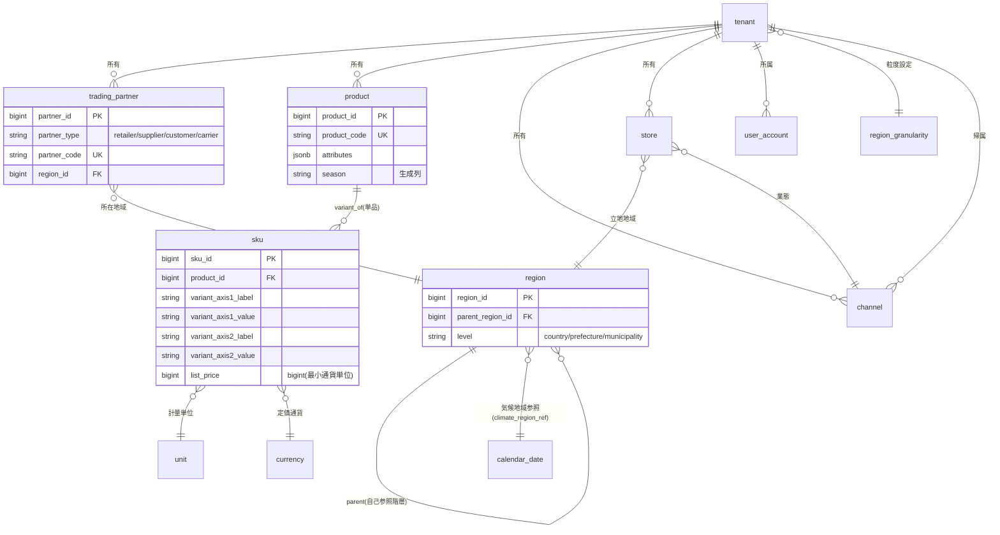
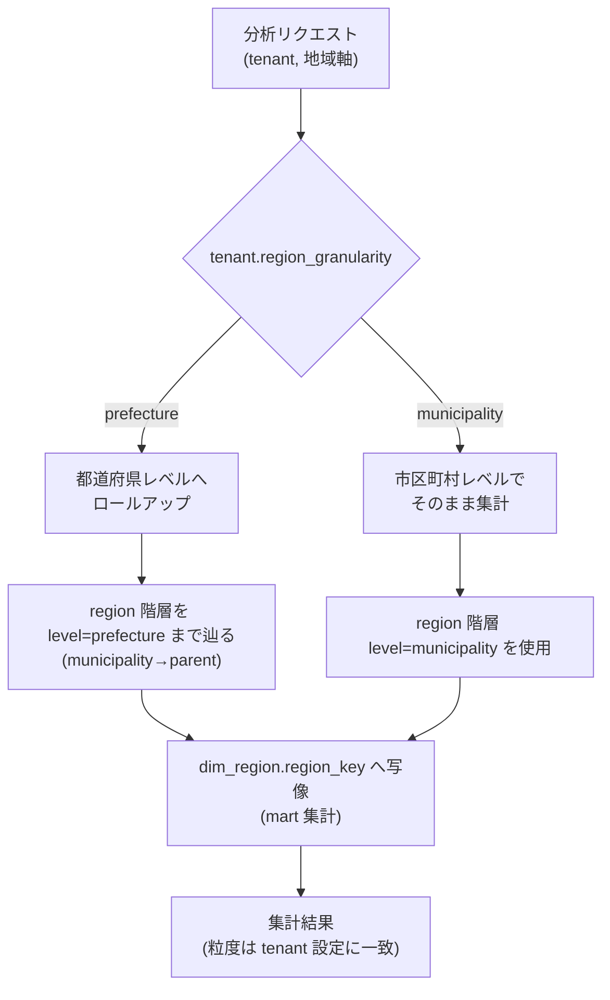
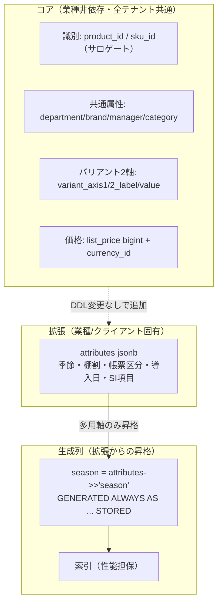

# DD-01 正準データモデル詳細設計（共通正準ドメインモデル）

> **ステータス:** Draft（レビュー前）
> **版:** v1.0
> **最終更新:** 2026-07-04
> **関連ドキュメント:**
> - ブループリント（名称SoT）: 本設計群の正準設計ブループリント v1.0（§3 業務OLTP／§4 mart／§8 命名・キー・テナント）
> - 上位: [`../basic-design/BD-01-architecture-overview.md`](../basic-design/BD-01-architecture-overview.md)、[`../basic-design/BD-02-domain-services.md`](../basic-design/BD-02-domain-services.md)、[`../basic-design/BD-03-analytics-ai-platform.md`](../basic-design/BD-03-analytics-ai-platform.md)
> - 物理スキーマ（本書が概念の正・各DBが物理の正）: [`../database/DB-01-schema-strategy.md`](../database/DB-01-schema-strategy.md)、[`../database/DB-02-operational-schema-retail.md`](../database/DB-02-operational-schema-retail.md)、[`../database/DB-03-operational-schema-maker.md`](../database/DB-03-operational-schema-maker.md)、[`../database/DB-04-operational-schema-wms.md`](../database/DB-04-operational-schema-wms.md)、[`../database/DB-05-analytics-star-schema.md`](../database/DB-05-analytics-star-schema.md)、[`../database/DB-06-mapping-metadata-schema.md`](../database/DB-06-mapping-metadata-schema.md)
> - 横断: [`../decision-log.md`](../decision-log.md)（ADR-001..015）、[`../glossary.md`](../glossary.md)
> - 継承元（prior art）: [`../../design.md`](../../design.md)、[`../../star-schema-design.md`](../../star-schema-design.md)

---

## 0. 本書の位置づけと SoT

本書は Undeux Platform（略称 UCP、系統コード `UNDX`）の**共通正準ドメインモデル（canonical data model）の概念設計の Source of Truth（SoT of Concepts）**である。DBスキーマ設計書群（`DB-02`..`DB-08`）が実装する物理テーブルは、本書が定義する概念エンティティ・関係・キー戦略・コア/拡張分離方針を写像したものでなければならない。

SoT の階層を明確にする。

| 領域 | SoT | 本書との関係 |
|---|---|---|
| エンティティ名・カラム名・次元名・スキーマ名 | 正準設計ブループリント §3/§4/§8 | 本書は名称を**不変で引用**（新名称を作らない） |
| 概念モデル（エンティティ・関係・粒度・キー戦略） | **本書（DD-01）** | 物理設計書はここを参照 |
| 物理DDL（型・インデックス・制約・パーティション） | 各 `DB-0x` | 本書は代表 DDL を提示、詳細は各DBが正 |
| データの実体（業務データ） | 各業務OLTP（`retail`/`maker`/`wms` 等）・`staging` | mart は派生キャッシュ |

本書に**ブループリントに無い要素を足す場合は「拡張提案」と明記**する。断定できない事項は §10「未決事項」に列挙する。

### 前提

- ブループリント v1.0 の名称・キー設計・マルチテナント方式（ADR-001）・SCD1（ADR-004）・金額 `bigint`（ADR-005）・汎用バリアント2軸固定（ADR-008）・jsonb+生成列（ADR-007）は確定事項として扱う。
- DB は PostgreSQL 16。生成列・RLS・`jsonb`・部分索引・BRIN が利用可能である前提。
- 記述言語は日本語、コード識別子/SQL/型名は英数字。金額は最小通貨単位の整数 `bigint`。

---

## 1. 正準モデルの狙い（共通土台＋SI 拡張）

### 1.1 課題

継承元 UndeuxSales は「単一小売（しまむら）→単一メーカー視点の週次売上参照」に最適化された単一ファクト構造だった。プラットフォーム化では、**小売（CrossRetail）・メーカー（MakerOps）・倉庫（WareFlow）の異なる業務ドメイン**と、**他社サービス連携データ**を、同一の分析軸「商品・地域・販売先」で横断集計する必要がある。業種（アパレル／食品／雑貨）やチャネル（店舗／EC）ごとに異なる属性を、その都度スキーマ変更で吸収する設計は、SI 案件ごとに DDL が分岐し保守不能になる。

### 1.2 設計目標

正準モデルは次を同時に満たす「共通土台＋拡張の受け皿」を提供する。

1. **業種非依存コア:** 商品・SKU・地域・販売先・チャネル・カレンダー・単位・通貨を、どの業種でも意味が変わらない共通属性で定義する（コア）。
2. **SI 拡張の受け皿:** 業種・クライアント固有の項目は DDL 変更なしで `attributes jsonb` に吸収し、集計多用軸のみ**生成列**へ昇格する（拡張）。→ §6、ADR-007。
3. **汎用化の3軸:**
   - 商品/SKU = **汎用バリアント2軸**（軸名＋値）で色/サイズ・容量/味等を1構造化（ADR-008）。
   - 地域 = 自己参照階層 `shared.region` で国>都道府県>市区町村を1構造化し、粒度を動的解決（ADR-003）。
   - 販売先 = `shared.trading_partner` に `partner_type` で統一（retailer/supplier/customer/carrier）。
4. **EC/店舗両対応:** `shared.channel`（`channel_type ∈ {store, ec}`）を第一級エンティティ化し、売上・在庫ファクトの分析軸に含める。
5. **SoT→mart 派生:** 全業務 OLTP を SoT、`mart_{tenant_code}` を冪等 `rebuild()` で再構築される派生キャッシュとする（ADR-009）。

### 1.3 スコープ

本書が定義するのは概念モデルである。API 契約は [`./DD-02-api-interface-design.md`](./DD-02-api-interface-design.md)、マッピング/変換の詳細は [`./DD-03-mapping-transform-engine.md`](./DD-03-mapping-transform-engine.md)、認証/RLS の詳細は [`./DD-06-security-authz-tenancy.md`](./DD-06-security-authz-tenancy.md) が担当し、本書はそれらが参照する土台に徹する。

---

## 2. コアエンティティと関係

### 2.1 正準ドメインモデル（概念 ER）

以下は共通基盤 `shared` を中核とする正準ドメインの概念関係である。物理では全業務テーブルに `tenant_id`（RLS 用論理列）と監査列（`created_at/updated_at/created_by/updated_by`）を持つが、図では省略する。`shared.region`/`unit`/`currency`/`calendar_date` は**非テナントのグローバル参照マスタ**、`product`/`sku`/`trading_partner`/`channel`/`store` は**テナント所有**である（ADR-001、§8.3）。



図の要点: (1) `tenant` が所有境界であり、商品・販売先・チャネル・店舗はテナントに従属する。(2) `product → sku` は親子（1商品に複数単品）、`sku` は単位と通貨を参照する。(3) `region` は自己参照階層で、販売先・店舗・倉庫が地域を参照する。(4) `channel` が店舗/EC を区別し、店舗は業態としてチャネルに紐づく。

### 2.2 コアエンティティ一覧（`shared` 参照マスタ）

ブループリント §3.1 の名称に厳密準拠する。

| 概念 | 正準テーブル | 分類 | 役割 |
|---|---|---|---|
| 組織/テナント | `shared.tenant` | 動的マスタ（設定系） | 契約クライアント組織。`account_type ∈ {retailer, maker, warehouse, internal}`、`region_granularity`、`mart_schema` を保持。分離の単位 |
| 利用者 | `shared.user_account` | 動的（Firebase 映像） | `role`/`account_type`/`email`。SoT はカスタムクレーム、DB はキャッシュ |
| 取引先 | `shared.trading_partner` | 動的マスタ | `partner_type` で retailer/supplier/customer/carrier を統一表現（§5） |
| 商品（親） | `shared.product` | 動的マスタ | 業種非依存コア＋`attributes jsonb`＋生成列 `season`（§3, §6） |
| 単品 | `shared.sku` | 動的マスタ | 汎用バリアント2軸＋`list_price bigint`＋`currency_id`（§3） |
| 地域 | `shared.region` | 準静的マスタ | 国>都道府県>市区町村の自己参照階層（§4） |
| チャネル | `shared.channel` | 動的マスタ | `channel_type ∈ {store, ec}`（§5） |
| 店舗 | `shared.store` | 動的マスタ | 個店。企業集約分析時は未使用可（`dim_retailer` に集約） |
| カレンダー | `shared.calendar_date` | 静的マスタ | 週=月曜、ISO 年/週、四半期/月。継承 |
| 単位 | `shared.unit` | 静的マスタ | `unit_code`/`unit_type` |
| 通貨 | `shared.currency` | 静的マスタ | `iso_code`/`minor_unit`（小数桁）/`symbol`。金額解釈の基準 |
| エラーコード | `shared.error_code` | 静的（コードが SoT） | `UNDX-{領域}-{連番}`（§9 参照） |

### 2.3 マスタの静的/動的判定と CRUD 方針

方法論「マスタは静的/動的を判断し動的マスタには CRUD を設計」に従う。

- **静的マスタ**（`unit`/`currency`/`calendar_date`／`region` の骨格）: システム提供のシードで初期化し、通常運用で CRUD しない。初期化はコード側で完結させ手動投入を残さない（開発原則1）。
- **動的マスタ**（`tenant`/`product`/`sku`/`trading_partner`/`channel`/`store`）: フル CRUD を [`./DD-02-api-interface-design.md`](./DD-02-api-interface-design.md) が定義。一覧/詳細を分離、別リソース非混在。

---

## 3. 商品／SKU の正準表現

### 3.1 親子と単位

`shared.product`（親＝商品）と `shared.sku`（単品）の2階層を正準とする。1商品は複数 SKU を持ち、SKU は `unit_code`（計量/販売単位）で識別のバリエーションを取り、`(product_id, unit_code)` を自然キー（UNIQUE）とする。SKU 固有の定価は `list_price bigint`（`currency_id` で通貨、`currency.minor_unit` で小数桁を解釈）。

### 3.2 汎用バリアント2軸の一般化（ADR-008）

業種差（アパレル=色/サイズ、食品=容量/味、雑貨=柄/入数）を、**軸名＋値の2軸固定**で吸収する。

- `variant_axis1_label` / `variant_axis1_value`
- `variant_axis2_label` / `variant_axis2_value`

軸ラベルの意味は**テナント別メタデータ**で解決する（例: テナント A では axis1=「カラー」、テナント B では axis1=「容量」）。3軸目が必要になる業種は設計見直しの対象とし、安易に軸を増やさない（ADR-008、YAGNI）。

> **拡張提案:** 軸ラベルのテナント別メタデータの物理格納先。候補は (a) `shared.tenant.attributes jsonb` にラベル辞書を持つ、(b) 専用の `shared.variant_axis_meta`（拡張提案テーブル）。本書では概念上「テナント別メタデータで解決」とのみ確定し、物理は [`../database/DB-01-schema-strategy.md`](../database/DB-01-schema-strategy.md) で決定する（§10 未決事項 Q1）。

### 3.3 識別コードの多重性

商品/SKU は複数の識別コード体系を持つ（自社品番、業態別品番、JAN/GTIN、外部システムの内部 ID 等）。正準では次のように整理する。

- **サロゲート `product_id`/`sku_id`（bigint）** をリレーションに用いる唯一のキーとする。
- **自然キー**は `shared.product` = `(tenant_id, channel_code, product_sign, product_code)`、`shared.sku` = `(product_id, unit_code)` を UNIQUE 制約に限定（リレーションには使わない、§8.2）。
- **それ以外の識別コード（JAN/外部ID 等）**は §9.2 の識別子クロスリファレンス `mapping.entity_xref`（物理は [`../database/DB-06-mapping-metadata-schema.md`](../database/DB-06-mapping-metadata-schema.md) §3.5）で多重管理する。これにより「1つの正準 SKU に複数の外部コードが対応する」多重性を、コア列を汚さず表現する。

### 3.4 階層と拡張属性

- 商品分類は `category`（業種非依存の汎用分類）をコア列に持ち、`department_code`/`department_name`/`brand`/`manager` を共通属性とする。
- 季節・棚割・帳票区分・導入日など業種固有属性は `shared.product.attributes jsonb` / `shared.sku.attributes jsonb` に格納し、集計多用の `season` のみ生成列へ昇格（§6）。

代表 DDL は §6.3 に示す。

---

## 4. 地域モデル（階層と動的粒度）

### 4.1 自己参照階層（ADR-003）

`shared.region` を **国 > 都道府県 > 市区町村** の自己参照階層で表現する。

- `parent_region_id`（自己参照 FK、国は NULL）
- `level ∈ {country, prefecture, municipality}`
- 自然キー `(country_code, region_code)`（UNIQUE）
- `climate_region_ref`: 気候地域参照（気温次元 `dim_climate` / スイッチ温度分析への橋渡し。継承）

1構造で「都道府県固定列」「市区町村固定列」を持たずに商売規模差へ対応する。

### 4.2 動的粒度解決

分析軸としての地域粒度は、テナントの `shared.tenant.region_granularity ∈ {prefecture, municipality}` で**動的に切替**える。クライアントの商売規模に応じ、大規模チェーンは市区町村、小規模は都道府県で集計する。



図の要点: 実データは最も細かい粒度（市区町村）で保持しうるが、集計時にテナント設定 `region_granularity` に従い都道府県へロールアップする。粒度切替は**設定系**であり、`region` の記録データ自体を破壊しない（開発原則2 状態保護）。粒度設定を後から `prefecture → municipality` に変更しても、下位ノードが `region` 階層に存在すれば再集計で細粒度化でき、下位互換を保つ（開発原則7）。

### 4.3 グレースフルデグラデーション

- 市区町村レコードが未整備のテナントで `region_granularity=municipality` が設定された場合、該当地域を親（都道府県）に丸めて集計を継続し、欠損は「粒度縮退」として警告する（主要フローを止めない、開発原則4）。該当エラーは `UNDX-DATA-*`（地域未存在）で通知する。

---

## 5. 販売先（customer）／チャネル（店舗/EC）モデル

### 5.1 取引先の統一（trading_partner）

「販売先」「仕入先」「配送業者」を個別テーブルに散らさず、`shared.trading_partner` に `partner_type` で統一する。

| `partner_type` | 意味 | 主な参照元 |
|---|---|---|
| `retailer` | 小売（メーカーから見た卸先/販売先） | `maker.sales_order.customer_partner_id`、`maker.delivery.customer_partner_id` |
| `supplier` | 仕入先 | `retail.purchase_order.supplier_partner_id`、`maker.purchase_order.supplier_partner_id` |
| `customer` | 販売先（汎用） | 分析上の「販売先軸」の源泉 |
| `carrier` | 配送業者 | WMS 出荷 |

自然キー `(tenant_id, partner_type, partner_code)`。所在地は `region_id` で §4 の地域階層を参照する。分析上の「販売先」は mart で `dim_customer` に射影する（§8）。

### 5.2 チャネル（店舗/EC）

`shared.channel`（`channel_type ∈ {store, ec}`）を第一級エンティティとし、店舗経営と EC を同一構造で扱う。

- `shared.store` は個店を表し、`channel_id`（業態）と `region_id`（立地）を持つ。企業集約分析では個店を持たず `dim_retailer`（企業集約次元）へ集約する（ADR-006 継承、§8）。
- 売上・在庫の OLTP（`retail.sales_transaction`/`retail.inventory_snapshot`）は `channel_id`（＋任意で `store_id`）を保持し、EC/店舗の別を分析軸 `dim_channel` として mart に持ち上げる。

### 5.3 販売先軸の一般化意図

継承元は「メーカー→単一小売」固定だったが、正準では販売先を `trading_partner(customer)` として一般化し、`fact_orders`/`fact_delivery` の分析軸 `dim_customer` に射影する。これにより「どの販売先に、どの商品を、どの地域で」という3軸分析（商品・地域・販売先）が業種横断で成立する。

---

## 6. コア／拡張の分離（共通属性＋attributes jsonb＋生成列）

### 6.1 分離の原則（ADR-007）

全ドメインで共通に問われる属性は**コア列**、業種/クライアント固有は**`attributes jsonb`**、そのうち集計・フィルタに多用する軸のみ**生成列**（`GENERATED ALWAYS AS (...) STORED`）へ昇格する。これにより SI での項目追加は原則 DDL 変更不要となり、集計性能は生成列＋索引で担保する。



図の要点: コアは全テナント共通で安定、SI 項目は `attributes jsonb` に無変更で追加でき、集計多用軸だけ生成列へ昇格して性能を確保する。矢印「DDL変更なしで追加」が SI 拡張の受け皿を示す。

### 6.2 SI 項目追加のフロー（下位互換・冪等）

1. 新規 SI 項目は `attributes` のキーとして追加（既存行は当該キー欠落＝NULL 相当で下位互換維持、開発原則7）。
2. 集計に多用するなら生成列を追加（`GENERATED ALWAYS AS (attributes->>'key') STORED`）。既存行にも自動反映され、追加は冪等（開発原則2）。
3. mart 側では該当項目を退化属性（ファクト保持）か次元属性かを判断し、[`../database/DB-05-analytics-star-schema.md`](../database/DB-05-analytics-star-schema.md) の写像へ反映する（§8）。

### 6.3 代表 DDL（`shared.product` / `shared.sku`）

コア/拡張分離・PK=サロゲート・自然キー=UNIQUE・金額 `bigint`・jsonb+生成列・索引方針を具体化する。物理の最終形は [`../database/DB-01-schema-strategy.md`](../database/DB-01-schema-strategy.md) が正。

```sql
-- 共通: 全業務テーブルは tenant_id（RLS）＋監査列を持つ
-- 商品（親）
CREATE TABLE shared.product (
    product_id       bigint GENERATED ALWAYS AS IDENTITY PRIMARY KEY,  -- サロゲートPK
    tenant_id        bigint NOT NULL,                                   -- RLS論理列（§8.3）
    channel_code     text   NOT NULL,                                  -- 業態（自然キー構成）
    product_sign     text   NOT NULL,
    product_code     text   NOT NULL,
    product_name     text   NOT NULL,
    department_code  text,
    department_name  text,
    brand            text,
    manager          text,
    category         text,                                             -- 業種非依存の汎用分類
    attributes       jsonb  NOT NULL DEFAULT '{}'::jsonb,              -- 拡張（SI項目の受け皿）
    -- 集計多用軸のみ生成列へ昇格
    season           text GENERATED ALWAYS AS (attributes->>'season') STORED,
    created_at       timestamptz NOT NULL DEFAULT now(),
    updated_at       timestamptz NOT NULL DEFAULT now(),
    created_by       bigint,
    updated_by       bigint,
    -- 自然キーは UNIQUE 限定（リレーションには使わない）
    CONSTRAINT uq_product_natural
        UNIQUE (tenant_id, channel_code, product_sign, product_code)
);
CREATE INDEX ix_product_tenant        ON shared.product (tenant_id);
CREATE INDEX ix_product_season        ON shared.product (tenant_id, season);          -- 生成列索引
CREATE INDEX ix_product_attributes    ON shared.product USING gin (attributes);       -- jsonb検索

-- 単品（SKU）: 汎用バリアント2軸＋金額bigint
CREATE TABLE shared.sku (
    sku_id             bigint GENERATED ALWAYS AS IDENTITY PRIMARY KEY,
    tenant_id          bigint NOT NULL,
    product_id         bigint NOT NULL REFERENCES shared.product (product_id),  -- サロゲートFK
    unit_code          text   NOT NULL,
    variant_axis1_label text,
    variant_axis1_value text,
    variant_axis2_label text,
    variant_axis2_value text,
    list_price         bigint,                              -- 最小通貨単位の整数（ADR-005）
    currency_id        bigint REFERENCES shared.currency (currency_id),
    image_url          text,
    attributes         jsonb  NOT NULL DEFAULT '{}'::jsonb,
    created_at         timestamptz NOT NULL DEFAULT now(),
    updated_at         timestamptz NOT NULL DEFAULT now(),
    created_by         bigint,
    updated_by         bigint,
    CONSTRAINT uq_sku_natural UNIQUE (product_id, unit_code)
);
CREATE INDEX ix_sku_product ON shared.sku (product_id);
CREATE INDEX ix_sku_variant ON shared.sku (tenant_id, variant_axis1_value, variant_axis2_value);
```

RLS ポリシー（`app.tenant_id` セッション変数で分離、§8.3）は [`./DD-06-security-authz-tenancy.md`](./DD-06-security-authz-tenancy.md) が定義する。金額は `bigint` で保持し `currency.minor_unit` で桁解釈する（`numeric`/float は使わない、ADR-005）。SCD は OLTP には適用せず、履歴が必要な mart 側で SCD1（上書き）を採る（ADR-004、§8）。

---

## 7. ドメイン別 OLTP と正準モデルの対応（retail / maker / wms）

### 7.1 対応の考え方

各ドメイン OLTP（`retail.product_master`/`maker.product_master`/`wms.sku_master`）は、業務都合の命名・粒度を持つが、**概念上は正準の `product`/`sku` へ写像可能**でなければならない。自社アプリはスタースキーマ連携前提のスキーマ定義であり、写像は恒等マッピング（`system_type='self'`, `resolved_by='auto'`）で成立する（ADR-002、[`./DD-03-mapping-transform-engine.md`](./DD-03-mapping-transform-engine.md)）。

### 7.2 商品/SKU 対応表

| 正準概念 | retail | maker | wms | 備考 |
|---|---|---|---|---|
| 商品（親） | `retail.product_master` | `maker.product_master` | （WMS は SKU 主体、親は任意） | 自然キーはドメイン別（§3.3） |
| 単品（SKU） | `retail.product_sku` | `maker.product_sku` | `wms.sku_master` | 汎用バリアント2軸を各所で継承 |
| 汎用バリアント | `variant_axis1/2`（`product_sku`） | `variant_axis1/2`（`product_sku`） | `variant_axis1/2`（`sku_master`） | 共通構造 |
| 拡張 | — | — | `wms.sku_master.attributes jsonb` | jsonb は各所で保持 |

### 7.3 取引・在庫の対応

| 正準/分析概念 | retail | maker | wms |
|---|---|---|---|
| 売上ヘッダ/明細 | `retail.sales_transaction` / `retail.sales_line` | `maker.sales_order` / `maker.sales_order_line` | （なし） |
| 発注 | `retail.purchase_order` / `_line` | `maker.purchase_order` / `_line` | （なし） |
| 生産 | （なし） | `maker.production_order` | （なし） |
| 納品 | （なし） | `maker.delivery` / `_line` | `wms.outbound` / `_line` |
| 入庫 | （なし） | （なし） | `wms.inbound` / `_line` |
| 在庫スナップショット | `retail.inventory_snapshot`（週×店/EC×SKU） | `maker.inventory_snapshot`（週×SKU） | `wms.inventory_snapshot`（週×倉庫×SKU） |
| 販売先 | — | `customer_partner_id`→`trading_partner` | `shipper_id`→`shipper`→`partner_id` |
| チャネル | `channel_id`→`channel` | （メーカーは販売先軸主） | 倉庫は `warehouse` 軸 |

### 7.4 継承元 UndeuxSales の位置づけ

小売しまむらから週次提供される「他社由来」の売上参照データは `staging`（`staging.raw_record`/`staging.import_batch`）が SoT であり、正準 OLTP ではない。継承した `sales_weekly`/`import_batch`/`m_product`/`m_product_sku` は移行期に `staging.retail_sales_weekly` 相当＋ maker テナント配下マスタとして再配置し、mart はそこから派生する（§7 SoT 宣言、ブループリント §3.3 注）。この分岐（自社直結 vs 他社ステージング）は §8 の写像で吸収する。

### 7.5 SoT→書込順序

新しいデータストア書込を追加する際は、SoT（各業務 OLTP／`staging`）への書込を先、mart 更新を後にする（開発原則6）。mart への直接書込は行わない。

---

## 8. 分析 mart コンフォームド次元への写像（DB-05 との対応）

### 8.1 写像の全体像

正準 OLTP（SoT）→ `mart_{tenant_code}`（派生）への写像を定義する。物理次元/ファクトの DDL は [`../database/DB-05-analytics-star-schema.md`](../database/DB-05-analytics-star-schema.md) が正。全次元 SCD1・サロゲート `{entity}_key`・自然キーは属性保持。mart は `rebuild()` で冪等再構築（advisory lock 直列化・`SET LOCAL statement_timeout=0`・非同期、ADR-009）。

```mermaid
graph LR
    subgraph SoT["業務OLTP / staging（SoT）"]
        P["shared.product / *.product_master"]
        S["shared.sku / *.product_sku / wms.sku_master"]
        R["shared.region"]
        TP["shared.trading_partner(customer)"]
        CH["shared.channel"]
        CD["shared.calendar_date"]
        TX["retail/maker sales_*・inventory_snapshot"]
        RAW["staging.raw_record"]
    end
    subgraph MART["mart_&#123;tenant_code&#125;（派生・SCD1）"]
        DP["dim_product"]
        DS["dim_sku"]
        DR["dim_region"]
        DC["dim_customer"]
        DCH["dim_channel"]
        DD["dim_date"]
        DRT["dim_retailer(企業集約)"]
        FSW["fact_sales_weekly / fact_orders / fact_delivery / fact_inventory_snapshot"]
    end
    P --> DP
    S --> DS
    R --> DR
    TP --> DC
    CH --> DCH
    CD --> DD
    TX --> FSW
    RAW --> FSW
    DC --> DR
    DS --> DP
    P -. 企業集約 .-> DRT
```



図の要点: 正準コアエンティティは対応するコンフォームド次元へ 1:1 に近い写像を持ち、地域粒度動的化（§4）は `dim_region` の階層＋テナント設定で吸収される。ファクトは SoT のトランザクション/スナップショットから派生する。

### 8.2 次元写像表

| 正準 OLTP | mart 次元 | サロゲート | 自然キー（属性保持） | SCD | 備考 |
|---|---|---|---|---|---|
| `shared.calendar_date` | `dim_date` | `date_key` | `the_date` | SCD1 | 週=月曜。継承 |
| `shared.region` | `dim_region` | `region_key` | `(country_code, region_code)` | SCD1 | `parent_region_key`/`level` 保持。動的粒度の核 |
| `shared.product` | `dim_product` | `product_key` | channel_code×product_sign×product_code | SCD1 | 生成列 `season`、`attributes jsonb` 継承 |
| `shared.sku` | `dim_sku` | `sku_key` | 単品コード | SCD1 | `variant_axis1/2`、`list_price`(SCD1) |
| `shared.trading_partner`(customer) | `dim_customer` | `customer_key` | partner_code | SCD1 | `partner_type`/`region_key`。新規 |
| `shared.channel` | `dim_channel` | `channel_key` | channel_code | SCD1 | `channel_type(store/ec)`。新規 |
| （企業集約） | `dim_retailer` | `retailer_key` | retailer_code | SCD1 | 個店を持たない企業集約次元。継承 |
| `shared.tenant`(maker) | `dim_vendor` | `vendor_key` | vendor_code | SCD1 | テナント境界。継承 |
| `wms.warehouse` | `dim_warehouse` | `warehouse_key` | warehouse_code | SCD1 | `region_key`/`shipper_ref`。新規 |
| （気温実測） | `dim_climate` | `climate_key` | (area_code, the_date) | SCD1（実測上書き） | 継承 |

### 8.3 ファクト写像表

| 正準 OLTP | mart ファクト | グレイン | 加算性 |
|---|---|---|---|
| `retail.sales_line` ＋ `staging`(継承 sales_weekly) | `fact_sales_weekly` | 週×小売×メーカー×**チャネル**×商品×SKU | 加算可 |
| （週次からの派生） | `fact_sales_daily` | 日×小売×**チャネル**×商品×SKU | 加算可（未実装・継承） |
| `retail/maker/wms.inventory_snapshot` | `fact_inventory_snapshot` | 週×拠点×SKU（`location_type∈{retailer,warehouse,vendor}`） | セミアディティブ（時間非加算） |
| `retail`(調達)／`maker`(受注) `*order_line` | `fact_orders` | 週×取引先×商品×SKU（`order_direction∈{purchase,sales}`） | 加算可 |
| `maker.production_order` | `fact_production` | 週×SKU | 加算可 |
| `maker.delivery_line` | `fact_delivery` | 週×販売先×SKU | 加算可 |
| `wms.inbound_line`/`outbound_line` | `fact_warehouse_movement` | 日×倉庫×SKU×方向 | 加算可 |
| `backoffice.billing_line`/`wms.shipper_billing` | `fact_billing` | 期×クライアント/荷主×metric | 加算可 |

> **チャネル軸と vendor 解決（R3）:** 売上ファクト（`fact_sales_weekly`/`fact_sales_daily`）は `dim_channel` を**グレイン参加次元**として `channel_key`（NOT NULL）を持ち、店舗（store）と EC を横断分析できる（[DB-05](../database/DB-05-analytics-star-schema.md) §4.2）。小売売上の `vendor_key` は商品マスタ（`shared.product`/`shared.sku` に紐づくメーカー）経由で解決し、解決不能時は `dim_vendor` の**不明メンバー**（`vendor_key=0`）へ射影する（NULL 許容化しない）。在庫は `location_type`＋役割別 FK（R4）、発注は `order_direction`（R5）で拠点タイプ・発注方向を退化属性として区別する。各不明軸は各次元の不明メンバー（[DB-05](../database/DB-05-analytics-star-schema.md) §3.0）へ射影して NOT NULL FK 整合を保つ。

### 8.4 冪等 rebuild と状態保護

- mart は SoT からの派生であり、`rebuild()` は何度実行しても同一結果（冪等）で、記録系を巻き戻さない（開発原則2、ADR-009）。
- **ユーザー判断（在庫アクションフラグ等）は mart 内に持たず** `public`/自然キー保持とし、mart 再構築（TRUNCATE）の影響を受けない（ADR-014、開発原則2）。明細表示時に自然キーで結合する。
- rebuild 失敗時は `UNDX-ANL-*` を付与し、補助集計（マテビュー/スナップショット）の失敗は主要参照フローを止めない（グレースフルデグラデーション、開発原則4）。

---

## 9. 識別子・キー戦略（サロゲート/自然キー/外部システム ID）

### 9.1 3層のキー

| 層 | 例 | 用途 | 制約 |
|---|---|---|---|
| サロゲート | `product_id`/`sku_id`/`region_id`（OLTP）、`*_key`（mart） | **リレーション専用**。意味を持たない | PK。bigint |
| 自然キー | `(tenant_id, channel_code, product_sign, product_code)` 等 | 冪等 UPSERT・重複防止 | UNIQUE 限定。リレーションに使わない（§8.2） |
| 外部システム ID | 他社 ERP の内部 ID、JAN/GTIN、旧 UndeuxSales の `m_product_sku` ID 等 | 連携・名寄せ | xref で多重管理 |

### 9.2 識別子クロスリファレンス `mapping.entity_xref`（物理は DB-06）

正準サロゲートと外部システム ID（JAN/GTIN、他社 ERP 内部 ID、旧 UndeuxSales の `m_product_sku` ID 等）の対応は、**外部連携の責務であるため `mapping.entity_xref` に一本化**する（R6）。本書（DD-01）は概念モデルの観点から「1つの正準エンティティに複数の外部コードが対応する多重性を、コア列を汚さず表現する名寄せレジストリ」であることを述べるに留め、**物理定義（列・自然キー・索引・RLS）の権威は [`../database/DB-06-mapping-metadata-schema.md`](../database/DB-06-mapping-metadata-schema.md) §3.5 `mapping.entity_xref`** とする（旧称 `shared.entity_xref` は用いない）。

- **役割:** 取込データ内の外部コードを、フィールドマッピング適用時に正準サロゲートID（`shared.product_id` / `shared.sku_id` / `shared.trading_partner_id` / `shared.region_id` / `wms.warehouse_id` 等）へ解決する起点（DB-06 §3.5）。
- **SoT:** 対応関係（名寄せ確定結果）の SoT は `mapping.entity_xref`。名寄せは `mapping.field_mapping`／人的解決（[`./DD-03-mapping-transform-engine.md`](./DD-03-mapping-transform-engine.md)）の出力を反映する。正準ID の実体は各正準マスタ（`shared.*`）が SoT であり、`entity_xref` はその参照解決を兼ねる（SoT→キャッシュの方向・原則6）。
- **自然キー:** `(source_system_id, entity_type, source_natural_key)` を UNIQUE とし冪等 UPSERT・重複防止に用いる（DB-06 §3.5、リレーションには使わない）。

### 9.3 エラーコードとの関係

キー/参照に関わる想定エラーは `UNDX-{領域}-{連番}` で一元管理（`shared.error_code` が SoT、`GET /api/error-codes` で公開、ブループリント §9）。本モデル領域で関係する主な領域コード:

| コード領域 | 本モデルでの発生例 |
|---|---|
| `UNDX-DATA-*` | 参照サロゲート未存在、地域ノード未整備（§4.3） |
| `UNDX-TENANT-*` | RLS 境界越え、`app.tenant_id` 未設定でのアクセス |
| `UNDX-MAP-*` | xref 名寄せ衝突、恒等マッピング不整合 |
| `UNDX-DQ-*` | 自然キー重複・必須属性欠落の品質違反 |
| `UNDX-ANL-*` | mart rebuild 失敗・写像不整合 |

### 9.4 レスポンシブ観点（担当領域の言及）

本書は概念モデルだが、これらエンティティを表示する画面（商品/SKU 一覧、地域別集計、販売先一覧）は PC=表・モバイル=カード型の可読形式で提供する（開発原則8）。特に汎用バリアント2軸（軸ラベルがテナントで変動）と地域粒度動的化は、列見出しがテナント設定で変わるため、モバイルではラベル/値ペアのカード表示が適する。UI 詳細は [`./DD-05-screen-ux-si-strategy.md`](./DD-05-screen-ux-si-strategy.md) が担当。

---

## 10. 未決事項

| # | 論点 | 現状 | 委譲先/次アクション |
|---|---|---|---|
| Q1 | 汎用バリアント軸ラベルのテナント別メタデータの物理格納先（`tenant.attributes` か専用 `variant_axis_meta` か） | 概念のみ確定（§3.2） | [`../database/DB-01-schema-strategy.md`](../database/DB-01-schema-strategy.md) で決定 |
| Q2 | `mapping.entity_xref` の正式採用（物理は DB-06 §3.5 に一本化・R6） | DB-06 §3.5 に物理定義を確定。DD-01 は概念参照（§9.2） | 正式採用時は[`../decision-log.md`](../decision-log.md) に ADR 追補 |
| Q3 | WMS の商品「親」概念の要否（`wms.sku_master` のみで親不在） | SKU 主体。親は任意（§7.2） | [`../database/DB-04-operational-schema-wms.md`](../database/DB-04-operational-schema-wms.md) |
| Q4 | 地域階層の海外展開（`country` 複数、市区町村未満の粒度）と `region_code` 体系 | 国>都道府県>市区町村の3段のみ確定（§4.1） | 拡張時に ADR-003 を改訂 |
| Q5 | `attributes jsonb` のスキーマ検証（SI 項目のキー命名規約・型検証） | 未定。現状は自由 jsonb | データ品質ルール（`mapping.data_quality_rule`, [`./DD-03-mapping-transform-engine.md`](./DD-03-mapping-transform-engine.md)）で担保する案 |
| Q6 | 通貨換算（多通貨テナントの mart 集計時レート） | `minor_unit` での桁解釈のみ確定。換算レート次元は未定 | 拡張提案候補（`dim_fx_rate`）。要 ADR |
| Q7 | `trading_partner` の名寄せ（同一販売先が複数ソースで別コード）の統合キー | xref で対応可だが運用未定（§9.2） | [`./DD-03-mapping-transform-engine.md`](./DD-03-mapping-transform-engine.md) |
| Q8 | SKU の3軸目要求が出た業種への対応方針 | 2軸固定（ADR-008）。3軸目は設計見直し | 発生時に ADR-008 再検討 |

---

> 本書は概念設計の SoT である。物理 DDL・インデックス最終形・パーティション戦略は各 `DB-0x` を正とし、名称は正準設計ブループリント v1.0 を不変で引用する。変更が必要な場合はブループリント→[`../decision-log.md`](../decision-log.md)→本書の順に改訂を波及させる（開発原則5 コードとドキュメントの一貫性）。
