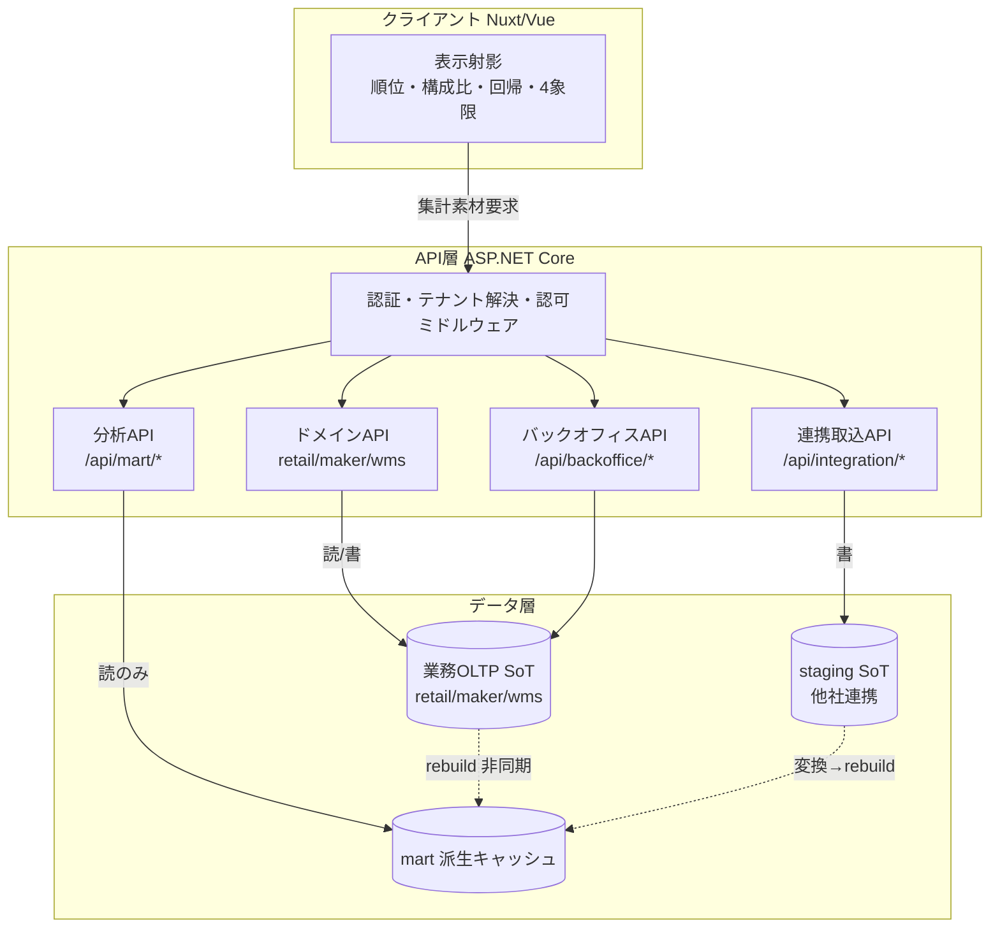
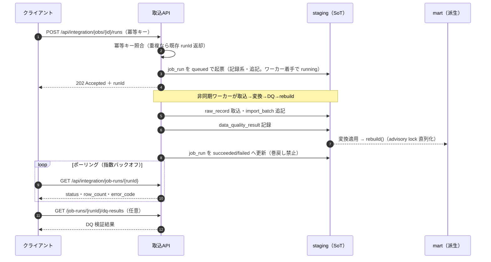
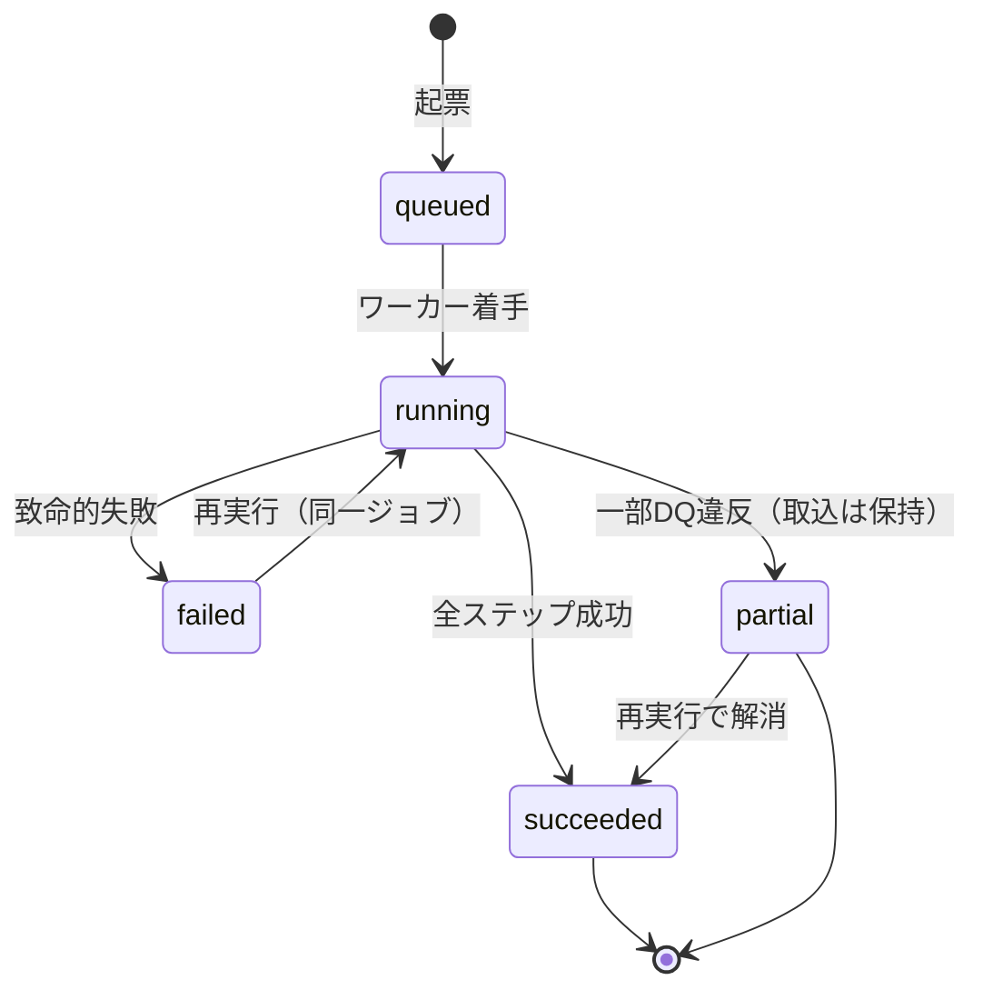

# DD-02 API/インターフェース設計詳細（ドメイン・分析・連携取込・認可・共通規約）

> **ステータス:** Draft（レビュー前）
> **版:** v1.0
> **最終更新:** 2026-07-04
> **関連ドキュメント:**
> - ブループリント（名称SoT）: 本設計群の正準設計ブループリント v1.0（§8.5 技術スタック／§9 エラーコード領域／§2 モジュール／§4 mart）
> - 概念モデル（本書の入力）: [`./DD-01-canonical-data-model.md`](./DD-01-canonical-data-model.md)
> - 連携/変換の詳細: [`./DD-03-mapping-transform-engine.md`](./DD-03-mapping-transform-engine.md)
> - AI/RAG/エージェント: [`./DD-04-ai-rag-agent-design.md`](./DD-04-ai-rag-agent-design.md)
> - 画面/UX（表示射影の担当）: [`./DD-05-screen-ux-si-strategy.md`](./DD-05-screen-ux-si-strategy.md)
> - 認証/認可/テナント分離（本書の認可の物理の正）: [`./DD-06-security-authz-tenancy.md`](./DD-06-security-authz-tenancy.md)
> - 上位: [`../basic-design/BD-02-domain-services.md`](../basic-design/BD-02-domain-services.md)、[`../basic-design/BD-06-non-functional.md`](../basic-design/BD-06-non-functional.md)
> - 物理スキーマ: [`../database/DB-05-analytics-star-schema.md`](../database/DB-05-analytics-star-schema.md)、[`../database/DB-06-mapping-metadata-schema.md`](../database/DB-06-mapping-metadata-schema.md)
> - 横断: [`../decision-log.md`](../decision-log.md)（ADR-001..015）、[`../glossary.md`](../glossary.md)
> - 継承元（prior art）: [`../../design.md`](../../design.md)（現行アプリ API 仕様§6）、[`../../star-schema-design.md`](../../star-schema-design.md)

---

## 0. 本書の位置づけと SoT

本書は Undeux Platform（略称 UCP、系統コード `UNDX`）の **API/インターフェース契約の Source of Truth（SoT of API Contracts）** である。エンドポイントのパス・メソッド・責務・入出力形状・認可要件・エラーレスポンス形状・ページング/フィルタ/ソート/冪等キー規約を本書が正とする。データの実体・キー戦略・SoT 宣言は [`./DD-01-canonical-data-model.md`](./DD-01-canonical-data-model.md) と ブループリント §7 を参照し、本書は API 層としての契約のみを定義する。

SoT の階層を明確にする。

| 領域 | SoT | 本書との関係 |
|---|---|---|
| リソース名・次元名・エラーコード | ブループリント §3/§4/§9 | 本書は名称を**不変で引用**（新名称を作らない） |
| API 契約（パス・メソッド・入出力・認可） | **本書（DD-02）** | フロント/バックエンド実装はここを参照 |
| 認可の物理実装（RLS・クレーム検証・ミドルウェア順序） | [`./DD-06`](./DD-06-security-authz-tenancy.md) | 本書は要件、DD-06 が実装の正 |
| データの実体・SoT | 各業務OLTP／`staging`／`mart` | API は SoT から読み、SoT へ書く |

ブループリントに無い要素を足す場合は「**拡張提案**」と明記する。断定できない事項は §10「未決事項」に列挙する。

### 前提

- 全 API は `/api` 配下、`https` のみ。バックエンドは C#（.NET 8 / ASP.NET Core）/ Npgsql / Dapper（ブループリント §8.5）。
- 認証は Firebase Authentication の IDトークン（JWT・Bearer）。カスタムクレーム `role` / `accountType`、および本プラットフォームで導入する `tenant`（テナント境界）を用いる（§7）。
- フロントは Nuxt 4 / Vue 3。UI はレスポンシブ必須（PC=表、モバイル=カード。ブループリント §8.5）。API は**表示に依存しない集計素材**を返し、表示射影（順位・構成比・回帰・4象限分類等）はフロントで算出する（§1・§4）。
- 継承元の現行 API 仕様（`/api/summary`・`/api/mart/*`・`/api/product-master/*` 等、[`../../design.md`](../../design.md) §6）を prior art とし、単一テナント前提だったものをマルチテナント・マルチドメインへ一般化する。互換ビュー同様、旧パスは互換維持を検討する（§9・ADR-013）。

---

## 1. API 設計原則

現行アプリ（[`../../design.md`](../../design.md) §7）とブループリント §8.5 が確立した原則を全ドメイン API に一般化して適用する。

1. **1API=1責務（癒着させない）。** 1エンドポイントは1つの業務的関心事のみを扱う。集計と更新、一覧と詳細、参照系と取込系を1本に混ぜない。
2. **一覧と詳細の分離。** 一覧（list）はページング・軽量射影を返し、詳細（get）は単一リソースの全属性を返す。CLAUDE.md の Firestore 注記と同様、list と get は認可評価・レスポンス形状が異なるため別リソースとして設計する。
3. **集約・加工の責務をクライアントに押し付けない。** サーバは JOIN・集計・在庫の最新週スナップショット解決など「1リクエストで正しく完結する集約素材」を返す。フロントで N 回叩いて突き合わせる設計にしない。
4. **表示射影はフロント。** 順位・複合スコア・構成比・累積構成比・ABC ランク・回帰係数・予測・散布図の4象限分類は、ユーザーが対話的に変える並び替え指標・重み・閾値に依存する「表示射影」である。バックエンドは**集計素材のみ**を返し、射影はフロント（`utils/ranking.ts` / `utils/regression` 等）で算出する。これによりサーバ往復なしの再ランキング/再回帰が可能になり操作の体感が軽い（現行 `/api/ranking`・`/api/analysis/*` の思想を継承。DD-05 が射影の担当）。
5. **レスポンスに別リソースを混在させない。** 商品一覧に取込ジョブ状態を埋め込む等はしない。関連は ID 参照とし、必要なら別エンドポイントで取得する。
6. **SoT→キャッシュの順序を API 境界でも守る（ブループリント §7）。** 更新系は SoT（業務OLTP／staging）へ先に書き、mart 反映は非同期 `rebuild()` に委ねる。API から mart を直接書かない。
7. **冪等性と状態保護（原則2）。** 更新系は冪等キー（§8.5）で二重実行を吸収し、記録系データ（取込履歴・対応状況・計測）を巻き戻さない。
8. **グレースフルデグラデーション（原則4）。** マスタ未解決・気候未算出などの補助データ欠落は 200 で欠落を明示（プレースホルダー/フォールバック）し、主要フローを止めない。致命的失敗のみエラーコードで 4xx/5xx を返す。



上図は API 層が「集計素材を返す境界」であり、表示射影はクライアント、mart は読み取り専用の派生キャッシュであることを示す。ドメイン API は業務OLTP（SoT）へ読み書きし、分析 API は mart のみを読む。連携取込 API は staging（他社連携の SoT）へ書き、変換と rebuild を経て mart に反映される。この責務分離が §7 の認可・§8 の共通規約の前提となる。

---

## 2. API 全体マップ（ドメイン別プレフィックス）

モジュール（ブループリント §2）に対応するプレフィックスでリソースを束ねる。全パスは `/api` 配下、`/api/health*`・`/api/error-codes` を除き Firebase IDトークン必須。

| プレフィックス | モジュール | 主なリソース | 責務 |
|---|---|---|---|
| `/api/retail/*` | MOD-RETAIL CrossRetail | `products`・`skus`・`sales-transactions`・`inventory`・`purchase-orders` | 小売の商品/売上/在庫/発注 |
| `/api/maker/*` | MOD-MAKER MakerOps | `products`・`skus`・`production-orders`・`deliveries`・`sales-orders`・`inventory` | メーカーの生産/発注/納品/売上/在庫 |
| `/api/wms/*` | MOD-WMS WareFlow | `sku-master`・`shippers`・`inbounds`・`outbounds`・`inventory`・`shipping-documents`・`shipper-billing` | 倉庫の入出庫/在庫/帳票/荷主請求 |
| `/api/mart/*` | MOD-ANALYTICS InsightMart | `summary`・`sales/trend`・`sales/breakdown`・`crosstab`・`ranking`・`inventory`・`analysis/*`・`filters` | mart 集計素材（読み取り専用） |
| `/api/integration/*` | MOD-INTEGRATION DataBridge | `sources`・`datasets`・`fields`・`mappings`・`transform-rules`・`jobs`・`job-runs`・`imports` | ソース登録/マッピング/取込/ジョブ |
| `/api/backoffice/*` | MOD-BACKOFFICE BackOffice | `contracts`・`plans`・`service-activations`・`usage`・`invoices` | 契約/稼働/計測/請求 |
| `/api/knowledge/*` | MOD-KNOWLEDGE / MOD-DSS | `documents`・`insights`・`agents`・`agent-runs` | RAG/インサイト/エージェント（詳細は DD-04） |
| `/api/shared/*` | MOD-SHARED SharedCore | `tenants`・`regions`・`partners`・`channels`・`units`・`currencies` | 共通参照マスタ |
| `/api`（共通） | 全体 | `health`・`health/ready`・`error-codes` | 稼働・エラーコード公開 |

> **一般化の指針:** 現行の単一テナント・単一小売前提の `/api/summary`・`/api/products`・`/api/crosstab` 等（[`../../design.md`](../../design.md) §6）は、分析軸が mart 由来であるため `/api/mart/*` 配下へ再配置して一般化する（§4）。旧トップレベルパスは互換のため段階移行期に別名（alias）維持を検討する（§9）。

---

## 3. ドメインAPI（小売/メーカー/倉庫の代表エンドポイント）

各ドメインは業務OLTP（SoT）に対する CRUD/トランザクション API を提供する。1リソース=1責務、一覧/詳細分離を徹底する。以下は代表例（網羅ではなく契約パターンの提示）。すべて `tenant` クレームで解決したテナントの RLS スコープ内で動作する（§7）。

### 3.1 小売（CrossRetail, `/api/retail/*`）

| メソッド | パス | 責務 | 主な入力 | 主な出力 |
|---|---|---|---|---|
| GET | `/api/retail/products` | 商品一覧 | `search`・`departments[]`・`brands[]`・`managers[]`・`page`・`pageSize`・`sort`・`order` | `product` 軽量射影の配列＋ページメタ |
| GET | `/api/retail/products/{productId}` | 商品詳細 | パス `productId` | `product`＋所属 `sku` 一覧＋画像。未登録は `UNDX-DATA-002` |
| GET | `/api/retail/products/options` | 一覧フィルタ選択肢 | — | 部門・ブランド・担当者の distinct 値 |
| GET | `/api/retail/sales-transactions` | 売上取引一覧 | `from`・`to`・`channelId`・`storeId`・`page`・`pageSize` | `sales_transaction` ヘッダ配列 |
| GET | `/api/retail/sales-transactions/{id}` | 売上取引詳細 | パス `id` | ヘッダ＋`sales_line` 明細 |
| POST | `/api/retail/sales-transactions` | 売上取引登録 | 冪等キー＋取引ヘッダ＋明細 | 作成された `sales_transaction_id` |
| GET | `/api/retail/inventory` | 在庫スナップショット参照 | `asOfDate`・`channelId`・`storeId`・`page` | `inventory_snapshot` 行（最新週基準は §4 の解決規則を準用） |
| GET | `/api/retail/purchase-orders` | 発注一覧 | `from`・`to`・`status`・`supplierPartnerId` | `purchase_order` ヘッダ配列 |
| POST | `/api/retail/purchase-orders` | 発注登録 | 冪等キー＋ヘッダ＋明細 | `purchase_order_id` |

> **責務分離の例:** 商品一覧（`products`）と在庫（`inventory`）は別リソース。現行アプリが商品マスタカードに実績（売上数量・在庫）を自然キー結合で載せていた（[`../../design.md`](../../design.md) §11.4）のは「表示のための additive な補助」であり、一覧 API 本体は商品属性のみを責務とする。実績の重い集計は `/api/mart/*` に委ねる。

### 3.2 メーカー（MakerOps, `/api/maker/*`）

| メソッド | パス | 責務 | 主な入力 | 主な出力 |
|---|---|---|---|---|
| GET | `/api/maker/products` | 商品一覧 | 共通フィルタ＋ページング | `product` 軽量射影配列 |
| GET | `/api/maker/products/{productId}` | 商品詳細 | パス `productId` | `product`＋`sku` |
| GET | `/api/maker/production-orders` | 生産指示一覧 | `from`・`to`・`status`・`productSkuId` | `production_order` 配列 |
| POST | `/api/maker/production-orders` | 生産指示登録 | 冪等キー＋指示 | `production_order_id` |
| GET | `/api/maker/deliveries` | 納品一覧 | `from`・`to`・`customerPartnerId`・`status` | `delivery` ヘッダ配列 |
| GET | `/api/maker/deliveries/{id}` | 納品詳細 | パス `id` | ヘッダ＋`delivery_line` |
| POST | `/api/maker/deliveries` | 納品登録 | 冪等キー＋ヘッダ＋明細 | `delivery_id` |
| GET | `/api/maker/sales-orders` | 受注一覧 | `from`・`to`・`customerPartnerId`・`status` | `sales_order` 配列 |
| GET | `/api/maker/inventory` | 在庫スナップショット参照 | `asOfDate`・`productSkuId` | `inventory_snapshot`（在日・消化率含む） |

### 3.3 倉庫（WareFlow, `/api/wms/*`）

| メソッド | パス | 責務 | 主な入力 | 主な出力 |
|---|---|---|---|---|
| GET | `/api/wms/sku-master` | SKU マスタ一覧 | `search`・`page`・`pageSize` | `sku_master` 配列 |
| GET | `/api/wms/shippers` | 荷主一覧 | `search`・`page` | `shipper` 配列 |
| GET | `/api/wms/inbounds` | 入庫一覧 | `from`・`to`・`shipperId`・`status` | `inbound` ヘッダ配列 |
| POST | `/api/wms/inbounds` | 入庫登録 | 冪等キー＋ヘッダ＋明細 | `inbound_id` |
| GET | `/api/wms/outbounds` | 出庫一覧 | `from`・`to`・`shipperId`・`status` | `outbound` ヘッダ配列 |
| POST | `/api/wms/outbounds` | 出庫登録 | 冪等キー＋ヘッダ＋明細 | `outbound_id` |
| GET | `/api/wms/inventory` | 倉庫在庫参照 | `warehouseId`・`asOfDate`・`skuMasterId` | `inventory_snapshot` 行 |
| POST | `/api/wms/outbounds/{id}/shipping-documents` | 出荷帳票生成（非同期可） | パス `id`＋`docType`＋冪等キー | 生成ジョブ or `rendered_uri`。生成失敗は主要フローを止めず `UNDX-WMS-*` を warning 返却（グレースフルデグラデーション） |
| GET | `/api/wms/shipper-billing` | 荷主請求参照 | `shipperId`・`period` | `shipper_billing` 行 |

> **帳票生成の非ブロッキング設計（原則4）:** 出荷帳票（`wms.shipping_document`）の生成は補助処理であり、失敗しても出庫トランザクション（SoT）自体は成立させる。帳票は再生成可能（`doc_type` 自然キーで冪等）。

---

## 4. 分析API（`/api/mart/*`）

分析 API は mart（テナント別スキーマ `mart_{tenant_code}`）を**読み取り専用**で参照する集計素材 API である。現行の `/api/summary`・`/api/crosstab`・`/api/ranking`・`/api/inventory`・`/api/analysis/*`（[`../../design.md`](../../design.md) §6）を `/api/mart/*` 配下へ一般化する。すべて「集計素材を返し、表示射影はフロント」（§1-4）。

### 4.1 代表エンドポイント

| メソッド | パス | 責務 | 主な入力 | 出力（集計素材） |
|---|---|---|---|---|
| GET | `/api/mart/filters` | フィルタ選択肢 | — | 部門・業態(`channel_code`)・季節・取込週・地域の distinct |
| GET | `/api/mart/summary` | 全社サマリー | 共通フィルタ | KPI（数量/金額/粗利＝フロー合算・商品数）＋週次トレンド |
| GET | `/api/mart/sales/trend` | 売上トレンド | `granularity=daily\|weekly`＋共通フィルタ | 期間×指標の系列 |
| GET | `/api/mart/sales/breakdown` | 集計軸別ランキング素材 | `dimension`・`metric`・`order`・`limit` | ディメンション別の指標（順位付けはフロント） |
| GET | `/api/mart/crosstab` | クロス集計マトリクス | `rowDimension`・`columnDimension`・任意 `temperatureArea` | 行×列のセル集計値（気温メトリクスは時間軸時のみ） |
| GET | `/api/mart/ranking` | ランキング分析素材 | `dimension`・任意 `compareFrom`/`compareTo`・`limit` | 主期間/比較期間の指標のみ（複合スコア・ABC・順位変動はフロント） |
| GET | `/api/mart/inventory` | 在庫・発注分析（最新週基準） | 共通フィルタ | 在庫数・在日・消化率・発注/先付（セミアディティブ＝最新週スナップショット） |
| GET | `/api/mart/inventory/actions` | 在庫アクション KPI | 共通フィルタ | KPI・前週比較・状態別件数・部門別健全性・適用閾値（`thresholds`） |
| GET | `/api/mart/inventory/items` | 在庫アクション SKU 明細 | `statuses`（未知値は無視）・`search`・ページング | SKU 明細＋経過バケット件数＋推奨アクション（語彙のみ、表示はフロント） |
| GET | `/api/mart/analysis/weekly-series` | 週次系列（散布図/重回帰素材） | `area`＋共通フィルタ | 売上フロー指標＋標準気温（回帰はフロント `utils/regression`） |
| GET | `/api/mart/analysis/markdown` | 消化率×値引き率素材 | 共通フィルタ | 型番別の消化率・値引き率・売上数量（4象限分類はフロント） |

### 4.2 フィルタ規約（分析共通）

現行の共通フィルタ（[`../../design.md`](../../design.md) §6）を次元名で一般化する。複数値は OR、異種フィルタ間は AND。

| クエリ | 意味 | 対応次元/属性 |
|---|---|---|
| `from` / `to` | 取込週レンジ（週=月曜） | `dim_date.week_monday` |
| `departments[]` | 部門 | `dim_product.department_code` |
| `channelCodes[]` | 業態（現 `businessTypes`） | `dim_channel.channel_code` / `dim_retailer.channel_code` |
| `seasons[]` | 季節（生成列） | `dim_product.season` |
| `regionCodes[]` | 地域（粒度動的） | `dim_region`（`region_granularity` に従う） |
| `stockDaysBuckets[]` | 平均在庫日数バケット `le30`/`d31to60`/`ge61` | `fact_inventory_snapshot.stock_days` |
| `temperatureArea` | 気温エリア `standard`/`cold`/`warm` | `dim_climate`（クロス集計・週次系列のみ） |

> **在庫のセミアディティブ扱い（継承）:** 在庫数・累計・在日・消化率は時点値（セミアディティブ）のため、期間内で合算せず「期間内の最新取込週スナップショット」の値を用いる。売上数量/金額/粗利はフロー値のため合算する（[`../../design.md`](../../design.md) §7 を mart 一般化）。

### 4.3 クロス集計/ランキング素材とフロント射影の切り分け

| 項目 | サーバ（`/api/mart/*` が返す素材） | フロント（表示射影） |
|---|---|---|
| ランキング | ディメンション別の主期間/比較期間の指標 | 順位・複合スコア（0..1 正規化＋加重平均）・構成比・累積・ABC ランク・順位変動・成長率 |
| クロス集計 | 行×列セルの集計値＋（時間軸時）気温メトリクス | 並べ替え・強調・TSV/HTML コピー射影 |
| 散布図/回帰 | 週次系列・型番別素材（気温・消化率・値引き率） | 単回帰/重回帰係数・決定係数・予測・4象限分類・スイッチ温度 |
| 在庫アクション | 状態別件数・SKU 明細・推奨アクション語彙・適用閾値 | 経過観察/値下げ候補等のラベル射影（`utils/skuStatus.ts`） |

この切り分けにより、ユーザーが閾値・重み・件数を対話的に変えてもサーバ往復が発生しない。集計の SoT は各ファクト（`fact_*`）。閾値等の判定定数の SoT はコード内定数で、**適用値をレスポンス（`thresholds`）に含めフロントはレスポンス値から描画**するため二重定義を作らない（現行 `InventoryHealthRules.cs` の思想を継承）。DD-05 が射影ユーティリティの担当。

---

## 5. 連携取込API（`/api/integration/*`）

DataBridge（MOD-INTEGRATION）のソース登録・マッピング・取込・ジョブ状態ポーリングを提供する。SoT は他社連携＝`staging.raw_record`／`staging.import_batch`、マッピング定義＝`mapping.*`（ブループリント §3.5・§7）。詳細な変換エンジンは [`./DD-03-mapping-transform-engine.md`](./DD-03-mapping-transform-engine.md) が担当し、本書は API 契約のみ定義する。

| メソッド | パス | 責務 | 冪等/記録系 |
|---|---|---|---|
| GET/POST | `/api/integration/sources` | ソースシステム一覧/登録 | 設定系（更新可） |
| GET/POST | `/api/integration/sources/{id}/datasets` | データセット一覧/登録 | 設定系 |
| GET | `/api/integration/datasets/{id}/fields` | ソースフィールド一覧 | 参照 |
| GET | `/api/integration/canonical-targets` | 正準ターゲット一覧（マッピング先） | 参照（SoT=ブループリント §4） |
| GET/POST/PUT | `/api/integration/mappings` | フィールドマッピング一覧/作成/更新（`resolved_by=human\|auto`） | 設定系（更新可） |
| POST | `/api/integration/mappings/{id}/transform-rules` | 変換ルール登録（normalize/lookup/expr/cast） | 設定系 |
| GET/POST | `/api/integration/jobs` | 取込ジョブ定義一覧/登録（`schedule`・`enabled`） | 設定系 |
| POST | `/api/integration/jobs/{id}/runs` | **取込/変換トリガ（非同期実行を起票）** | 冪等キー必須・記録系起票 |
| GET | `/api/integration/job-runs/{runId}` | **ジョブ状態ポーリング** | 参照（記録系・巻戻し禁止） |
| GET | `/api/integration/job-runs/{runId}/dq-results` | データ品質検証結果 | 参照（記録系） |
| GET/POST | `/api/integration/imports` | 取込バッチ履歴/CSV 取込（multipart） | 記録系・追記専用 |

### 5.1 取込ジョブの非同期ポーリング

大量行の取込・変換・mart 反映は同期完了させず、ジョブ起票→ポーリングの非同期モデルとする（現行の取込＋advisory lock 直列化・非同期 rebuild を一般化。ADR-009）。`POST .../runs` は `job_run` を **`queued`** で起票し即座に `runId` と `202 Accepted` を返す（ワーカーが着手すると `running` へ遷移）。クライアントは `GET /job-runs/{runId}` をポーリングして `succeeded`/`failed`（または `partial`）を待つ。`job_run.status` の許容値集合と初期値は `mapping.job_run`（[DB-06 §5.3](../database/DB-06-mapping-metadata-schema.md)）を SoT とし **`{queued, running, succeeded, partial, failed}`・初期 `queued`** で三書（DB-06／本書／[DD-03](./DD-03-mapping-transform-engine.md)）を一致させる（R1）。



上図の要点は、(1) トリガ API は SoT（staging）へ `job_run` を先に起票し即応答する（原則6 の SoT 先行）、(2) 冪等キーで二重トリガを吸収し既存 `runId` を返す（原則2）、(3) `job_run.status` は記録系で `failed` から勝手に巻き戻らない、(4) DQ 検証失敗など補助的な問題は `error_code`（`UNDX-DQ-*`/`UNDX-IMP-*`）で明示しつつ、部分的に取込めた分は保持する（グレースフルデグラデーション）こと。ジョブが失敗した場合の回復パスは同一ジョブの再実行（`mapping.job_run` 再起票→rebuild、ブループリント §7）。

### 5.2 ジョブ状態モデル

`mapping.job_run.status` の遷移を状態機械で定義する。ポーリング API はこの状態を返す。



`partial`（拡張提案）は、致命的でない DQ 違反があっても取込済みデータを保持し主要フローを止めない状態を表す（原則4）。`succeeded`/`failed`/`partial` は記録系のため巻き戻さず、再実行は新たな遷移として記録する。

---

## 6. バックオフィスAPI（`/api/backoffice/*`）

BackOffice（MOD-BACKOFFICE）の契約・稼働設定・使用量計測・請求を提供する。設定系（`contract`/`service_activation`）は更新可、記録系（`usage_metering`/`billing_invoice`）は巻戻し禁止（ブループリント §7）。自社運用に加えクライアントへ提供可能（テナントスコープで分離）。

| メソッド | パス | 責務 | 冪等/記録系 |
|---|---|---|---|
| GET | `/api/backoffice/plans` | プラン一覧（`module_scope`） | 参照 |
| GET/POST | `/api/backoffice/contracts` | 契約一覧/登録 | 設定系（更新可） |
| GET | `/api/backoffice/contracts/{id}` | 契約詳細 | 参照 |
| GET/PUT | `/api/backoffice/service-activations` | 稼働設定一覧/更新（`module_id`・`enabled`・`config`） | 設定系（更新可） |
| GET | `/api/backoffice/usage` | 使用量計測参照（`metric_code`・`period`） | 記録系・追記のみ・巻戻し禁止 |
| GET | `/api/backoffice/invoices` | 請求一覧 | 記録系 |
| GET | `/api/backoffice/invoices/{id}` | 請求詳細（`billing_line` 明細） | 記録系 |
| POST | `/api/backoffice/invoices/{id}/recalculate` | 期締め再計算トリガ | 冪等（期締めで再計算・追記のみ） |

> **計測と請求の状態保護（原則2）:** `usage_metering` は追記のみで、稼働設定変更や再取込で過去の計測が巻き戻ってはならない。請求は期締めで再計算するが、確定済み `billing_invoice` の改変ではなく再計算結果の記録として扱う。金額は最小通貨単位 `bigint`（`currency.minor_unit` で桁解釈、ADR-005）。

---

## 7. 認可モデル（Firebase クレーム＋テナントスコープ）

認証は Firebase Authentication の IDトークン（JWT・Bearer）。認可は多層防御（ADR-015）: (1) API 層でのカスタムクレーム検証、(2) DB 層の Row-Level Security（`tenant_id` 論理列、ブループリント §8.3）。認可の物理実装（ミドルウェア順序・RLS ポリシー）の正は [`./DD-06-security-authz-tenancy.md`](./DD-06-security-authz-tenancy.md)。本書は API 契約としての認可要件を定義する。

### 7.1 カスタムクレーム

| クレーム | 値域 | 用途 |
|---|---|---|
| `role` | `admin` / `operator` / `viewer` 等 | 操作権限（更新系の可否） |
| `accountType` | `retailer` / `maker` / `warehouse` / `internal` | 利用可能なドメイン API プレフィックスの決定 |
| `tenant`（拡張提案・新規） | `tenant_code` | テナント境界。接続時セッション変数 `app.tenant_id` を設定し RLS を効かせる |

現行アプリは単一テナント前提で `role`（`admin`）のみを取込権限に使っていた（[`../../design.md`](../../design.md) §6 認可）。マルチテナント化に伴い `accountType`（ドメイン選択）と `tenant`（RLS スコープ）を拡張する。`accountType` と API プレフィックスの不一致（例: `retailer` が `/api/maker/*` を叩く）は `UNDX-TENANT-*` で拒否する。

### 7.2 参照系と更新系

| 区分 | 対象 | 認可要件 |
|---|---|---|
| 参照系 | 各ドメイン GET、`/api/mart/*` GET、`/api/backoffice` 参照 | 認証済み＋`accountType` がプレフィックスに整合＋`tenant` スコープ内 |
| 更新系（業務トランザクション） | ドメイン POST/PUT（売上・発注・納品・入出庫） | 上記＋`role` が `operator` 以上 |
| 更新系（取込・変換） | `/api/integration/*` の POST（ジョブトリガ・取込） | 上記＋`role=admin`（取込権限。現行の取込ロール限定を継承・一般化） |
| 更新系（契約・稼働） | `/api/backoffice/*` の POST/PUT | `role=admin`＋（自社運用は `accountType=internal`） |
| 公開 | `/api/health*`・`/api/error-codes` | 認証不要 |
| 在庫アクションフラグ | `/api/mart/inventory/*` のフラグ登録（継承） | 認証ユーザー全員（売上 SoT を改変しない可逆な業務ワークフローデータ。`created_by`/`updated_by` で監査） |

> **テナント越境の防止:** クロステナント集計が必要な自社運用（`accountType=internal`）は RLS を迂回する別経路とし、通常のテナント API では他テナントデータへアクセスできない（ブループリント §8.3）。越境検出時は `UNDX-TENANT-*`。AI/エージェント経由の参照もテナント境界ガードレール越し（ADR-010、DD-04）。

---

## 8. 共通規約

### 8.1 ページング

一覧（list）は `page`（1始まり）・`pageSize`（既定20・上限100）でオフセットページング。レスポンスはデータ配列とページメタを分離する（別リソース非混在）。

```json
{
  "items": [ /* リソース配列 */ ],
  "page": 1,
  "pageSize": 20,
  "totalCount": 137
}
```

大規模素材（分析）は `totalCount` の `COUNT(DISTINCT)` を避け、`DISTINCT` サブクエリ行数で数える最適化を継承する（[`../../design.md`](../../design.md) §7、約8秒→0.25秒）。カーソルページングは大量スクロール系で拡張提案（§10）。

### 8.2 フィルタ

複数値は同名クエリの繰返し（`departments=A&departments=B`、配列表記 `departments[]` と等価）で OR、異種フィルタ間は AND。**未知の絞込値は無視**する（例: `statuses` の未知値、現行 `/api/mart/inventory/items` の挙動を継承）。日付は ISO 8601（`date` は週=月曜基準）。

### 8.3 ソート

`sort`（フィールド名）＋`order`（`asc`/`desc`）。許可フィールドはエンドポイントごとにホワイトリスト化し、範囲外は `UNDX-REQ-*`。表示上の複合スコア順など「射影に依存するソート」はフロントで行い、API は物理フィールドのソートのみ受け付ける（§1-4）。

### 8.4 冪等キー

更新系（特に POST の作成・ジョブトリガ）は `Idempotency-Key` ヘッダを受け付ける。サーバはキー＋テナントで重複を判定し、重複時は初回結果を再返却する（新規書込をしない）。取込・在庫フラグ登録は `ON CONFLICT DO NOTHING`／`DO UPDATE` の冪等 UPSERT で二重実行を吸収し、記録系（対応状況・履歴・計測）を巻き戻さない（原則2、ブループリント §8.2）。

### 8.5 エラーレスポンスと UNDX-*

全エラーは統一形状で返す。コードは `UNDX-{領域}-{連番}` 形式で一元管理（`shared.error_code`＋Core の `ErrorCodes` がコード SoT、ブループリント §9）。`GET /api/error-codes` で公開する。**エラーコードの連番割当（`UNDX-DQ-002` 等の具体番号と意味の対応）の SoT は本 `shared.error_code`／本節の表に一元化する（R8）。** 他ドキュメント（[BD-04](../basic-design/BD-04-integration-data-pipeline.md)・[DD-03](./DD-03-mapping-transform-engine.md)）の代表エラーコード表は本 SoT を参照する位置づけであり、同一番号を別意味に割当ててはならない（意味は本表に従う）。

```json
{
  "errorCode": "UNDX-TENANT-001",
  "message": "テナント境界違反：要求リソースは現在のテナントに属しません",
  "httpStatus": 403,
  "details": { "requestedTenant": "...", "field": "..." }
}
```

| 領域 | 例 | 主な用途 |
|---|---|---|
| `AUTH` | `UNDX-AUTH-001` | 認証失敗（トークン無効/期限切れ） |
| `REQ` | `UNDX-REQ-001..` | リクエスト検証（ソート範囲外・パラメータ不正） |
| `TENANT` | `UNDX-TENANT-001..` | テナント境界/RLS/`accountType` 不整合（新規） |
| `IMP` | `UNDX-IMP-001..` | 取込処理エラー |
| `MAP` | `UNDX-MAP-001..` | マッピング/変換（DataBridge、新規） |
| `DQ` | `UNDX-DQ-001..` | データ品質検証（新規） |
| `RTL`/`MKR`/`WMS` | `UNDX-RTL-001..` 等 | 各ドメイン業務エラー（新規） |
| `ANL` | `UNDX-ANL-001..` | 分析/mart（rebuild・集計、新規） |
| `BILL` | `UNDX-BILL-001..` | 契約/稼働/請求（BackOffice/荷主請求、新規） |
| `DATA`/`SYS` | `UNDX-DATA-001..` / `UNDX-SYS-001` | データ層（未登録=`DATA-002` 等）/想定外 |

> **グレースフルデグラデーション（原則4）:** 補助データの欠落（マスタ未解決・気候未算出・帳票生成失敗）はエラーで全体を止めず、200 で欠落を明示（フォールバック/プレースホルダー、`warnings[]` 添付）する。致命的失敗のみエラーコードで 4xx/5xx。想定エラーには必ずコードを付与する。

### 8.6 レスポンシブ配慮（API 側の責務）

UI のレスポンシブ（PC=表、モバイル=カード、ブループリント §8.5）はフロントの責務だが、API は**表示形態に依存しない集計素材**を返すことでこれを支える。同一エンドポイントの応答から PC の表もモバイルのカードも構築できるよう、レコードは自己完結的（必要な属性を持ち、別リクエスト前提にしない）にする。ページサイズ上限（既定20）はモバイル回線での過大ペイロードを避ける既定でもある。

---

## 9. バージョニングと下位互換

- **互換ビュー方式の継承（ADR-013）:** DB 層の互換ビューと同じ思想で、API も旧パス（現行 `/api/summary`・`/api/crosstab` 等トップレベル）を段階移行期に **alias として維持**し、内部で `/api/mart/*` へ委譲する。フロント無改修でロールバック容易。
- **バージョニング方針:** 破壊的変更は `/api/v2/*` のパスプレフィックスで導入し、旧版を並存させる（拡張提案）。非破壊な追加（フィールド追加・新オプションフィルタ）はバージョンを上げない。クライアントは未知フィールドを無視する前方互換な実装とする。
- **下位互換性の評価（原則7）:** 既存 I/F・レスポンス形状を変更する場合は影響を Grep で網羅確認し（Push 前チェック §6）、既存クライアントが壊れないことを保証する。やむを得ない変更はデータ/クライアント更新パッチを用意しオペレーターへ説明する。
- **現行完全互換の維持例:** `GET /api/mart/inventory` は現行仕様どおり無変更を維持し、アクション駆動の追加機能は別リソース（`/actions`・`/items`）として足す（現行 §7.x の設計を継承）。

---

## 10. 未決事項

1. **カーソルページング:** 大量スクロール系（取引明細・SKU 明細）でオフセットからカーソルベースへ切替えるか。現時点はオフセット既定。分析素材の `totalCount` 最適化との両立を DB-05 と要検討。
2. **`tenant` クレームの実体:** テナント境界を Firebase カスタムクレーム `tenant` で持つか、`user_account` から都度解決するか（拡張提案として本書はクレーム前提）。DD-06 で確定する。
3. **ジョブ状態 `partial` の採否:** DQ 非致命違反を `partial` 状態として持つか、`succeeded`＋`warnings` に畳むか（§5.2 は拡張提案）。DD-03 の変換エンジンと整合を要確認。
4. **バージョニング方式:** パスプレフィックス（`/api/v2`）かヘッダ（`Accept` バージョン）か。現時点はパス前提だが確定は BD-06/DD-06 と協議。
5. **リアルタイム通知:** 取込ジョブ完了をポーリングではなく Webhook/SSE で push するか。原則6 の「イベント受信＋手動回復パス」の両立を DD-03 と検討（現時点はポーリング＋再実行で回復可）。
6. **旧トップレベルパスの廃止時期:** 互換 alias（§9）をいつ deprecate するか。移行完了の判定基準とアナウンス手順が未定。
7. **`/api/backoffice/*` のクライアント提供時の認可:** バックオフィスをクライアントへ提供する際、自社運用（`internal`）とクライアント自己管理の権限差をどう表現するか（`role` の粒度追加の要否）。
