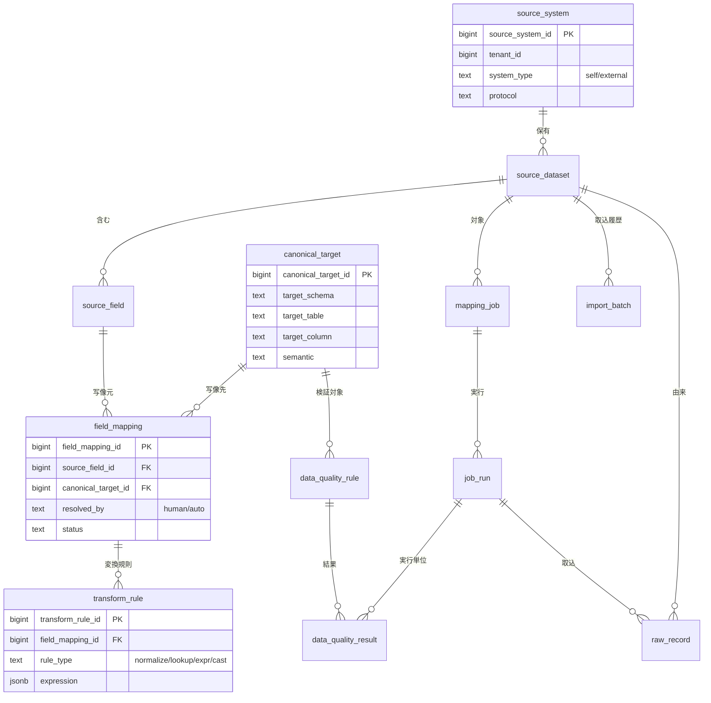
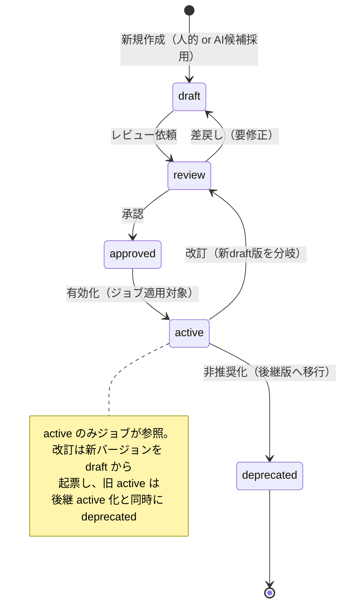
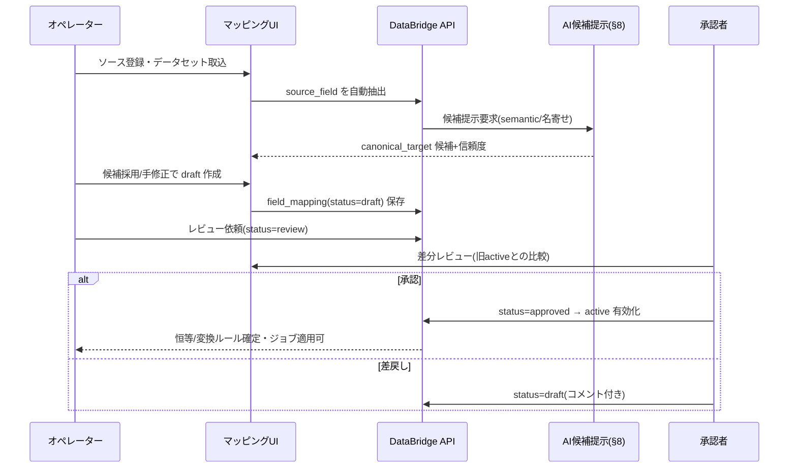
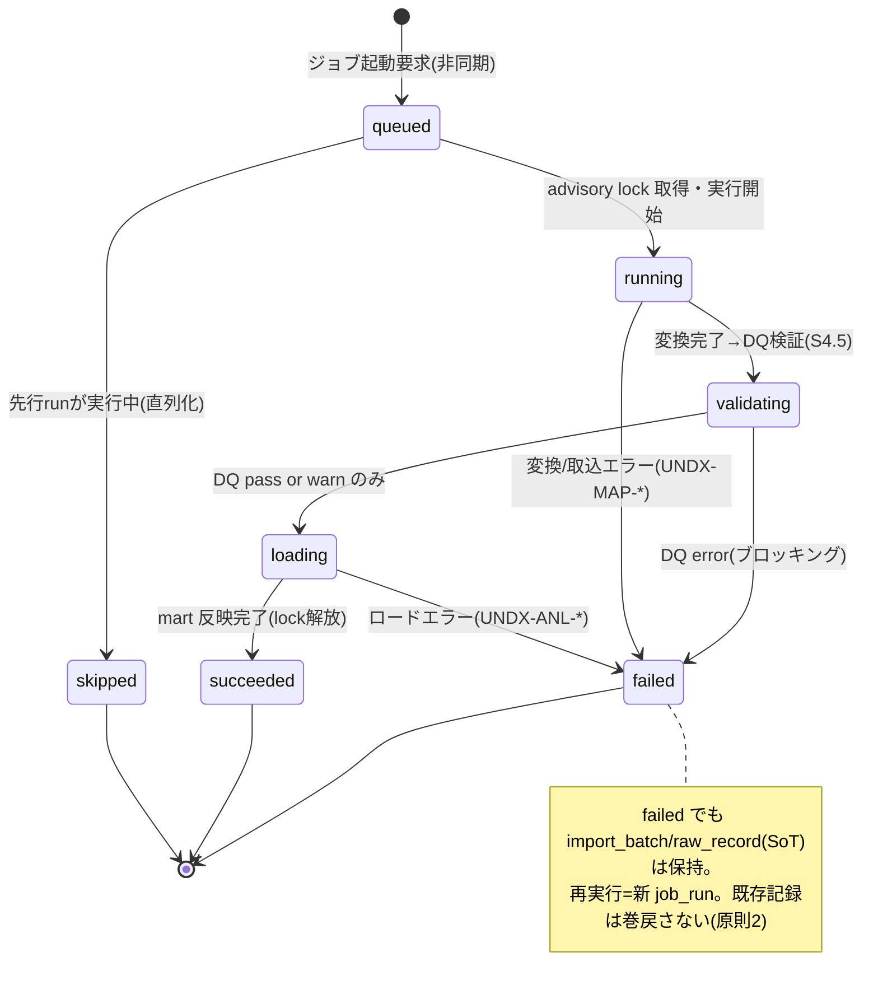

# DD-03 項目マッピング・変換エンジン詳細設計（DataBridge Transform Engine）

> **ステータス:** Draft（レビュー前）
> **版:** v1.0
> **最終更新:** 2026-07-04
> **関連ドキュメント:**
> - ブループリント（名称SoT）: 本設計群の正準設計ブループリント v1.0（§5 マッピング／変換メタモデル骨子／§3.5 `mapping`＋`staging`／§7 SoT宣言マップ／§9 エラーコード）
> - 上位: [`../basic-design/BD-04-integration-data-pipeline.md`](../basic-design/BD-04-integration-data-pipeline.md)、[`../basic-design/BD-06-non-functional.md`](../basic-design/BD-06-non-functional.md)
> - 概念モデル: [`./DD-01-canonical-data-model.md`](./DD-01-canonical-data-model.md)
> - API 契約: [`./DD-02-api-interface-design.md`](./DD-02-api-interface-design.md)
> - 認可/テナント: [`./DD-06-security-authz-tenancy.md`](./DD-06-security-authz-tenancy.md)
> - AI 補助: [`./DD-04-ai-rag-agent-design.md`](./DD-04-ai-rag-agent-design.md)
> - 物理スキーマ（本書が挙動の正・DBが物理の正）: [`../database/DB-06-mapping-metadata-schema.md`](../database/DB-06-mapping-metadata-schema.md)、[`../database/DB-05-analytics-star-schema.md`](../database/DB-05-analytics-star-schema.md)
> - 横断: [`../decision-log.md`](../decision-log.md)（ADR-002/ADR-006/ADR-009/ADR-013）、[`../glossary.md`](../glossary.md)
> - 継承元（prior art）: [`../../design.md`](../../design.md)、[`../../star-schema-design.md`](../../star-schema-design.md)

---

## 0. 本書の位置づけと SoT

本書は Undeux Platform（UCP、系統コード `UNDX`）の **DataBridge（`MOD-INTEGRATION`）における項目マッピング・変換エンジンの挙動設計の Source of Truth（SoT of Behavior）** である。ソースシステムから取り込んだデータを、人的フィールドマッピングと変換ルールを介して正準ターゲット（`mapping.canonical_target`）へ写像し、最終的にコンフォームド・スタースキーマ `mart_{tenant_code}` へロードするまでの一連の変換ロジック・ジョブ実行・データ品質検証・冪等/差分制御を規定する。

SoT の階層を明確にする。

| 領域 | SoT | 本書との関係 |
|---|---|---|
| メタモデルの名称（テーブル名・列名） | ブループリント §3.5／§5 | 本書は名称を**不変で引用**（新名称を作らない） |
| マッピング・変換エンジンの挙動（変換順序・冪等制御・DQ判定） | **本書（DD-03）** | 実装・物理設計はここを参照 |
| メタモデルの物理DDL（型・索引・制約） | [`../database/DB-06-mapping-metadata-schema.md`](../database/DB-06-mapping-metadata-schema.md) | 本書は代表 DDL を提示、詳細は DB-06 が正 |
| 他社連携データの実体 | `staging.raw_record` / `staging.import_batch` | mart は派生キャッシュ |
| 自社業務データの実体 | `retail.*` / `maker.*` / `wms.*`（OLTP） | mart は派生キャッシュ |

本書に**ブループリントに無い要素を足す場合は「拡張提案」と明記**する。断定できない事項は §9「未決事項」に列挙する。

### 前提

- ブループリント v1.0 の名称・SoT宣言（§7）・マルチテナント方式（ADR-001）・mart 冪等 `rebuild()`（ADR-009）・他社=人的/自社=恒等自動マッピング（ADR-002）・互換ビュー段階移行（ADR-013）は確定事項として扱う。
- DB は PostgreSQL 16。`advisory lock`／`jsonb`／生成列／RLS（`app.tenant_id` セッション変数）が利用可能である前提。
- 金額は最小通貨単位の整数 `bigint`（`shared.currency.minor_unit` で桁解釈）。数量は `int`、測定値の一部は `numeric`。
- 変換式（`transform_rule.expression`）は `jsonb` で宣言的に保持し、エンジン側インタプリタで評価する。任意コード実行（外部スクリプト）は本書スコープ外（拡張提案として §9 に記載）。
- 記述言語は日本語、コード識別子/SQL/型名は英数字。

---

## 1. エンジンの全体像

DataBridge 変換エンジンは、**ソース → ステージング → マッピング適用 → 変換 → mart ロード**の5段パイプラインで構成する。継承元 UndeuxSales の「取込ファイル → `sales_weekly` → mart `rebuild()`」を、複数ソース・複数正準ターゲット・人的マッピングを持つ汎用パイプラインへ一般化したものである。

各段の責務と SoT 上の位置づけを整理する。

| 段 | 名称 | 入力 | 出力 | SoT 位置づけ |
|---|---|---|---|---|
| S1 | ソース取込（Ingest） | 外部ファイル/API/自社OLTP | `staging.raw_record`（他社）／OLTP 参照（自社） | 他社連携は `raw_record` が SoT |
| S2 | ステージング（Stage） | `staging.raw_record` | 正規化前の型付きレコード（`import_batch` 単位） | 追記専用・記録系 |
| S3 | マッピング適用（Map） | `source_field` × `field_mapping` × `canonical_target` | 正準ターゲット列への項目対応付け | メタデータ（設定系） |
| S4 | 変換（Transform） | 対応付け済み値 × `transform_rule` | 正準型・正準コードへ変換した値 | 導出（純関数） |
| S5 | mart ロード（Load） | 変換済み正準レコード | `mart_{tenant_code}` の dim/fact | mart は派生キャッシュ |

> **重要（SoT → キャッシュ順序）:** S1〜S4 の結果（他社連携は `staging.raw_record`、自社は各 OLTP）が確定してから S5 で mart を再構築する。逆順（mart 先行更新）は原則6（データフロー整合性）違反である。mart は常に SoT からの派生であり、`rebuild()` によりいつでも再生成できる（ADR-009）。

### 1.1 変換パイプライン（flowchart）

下図は他社連携ソース1件が mart 反映に至るまでの標準フローである。自社直結（`system_type='self'`）は S3 が恒等マッピングに退化し、S4 の変換が最小化される（§4）。DQ 検証（S4.5）は変換後・ロード前に実行し、`severity` に応じてブロッキング/非ブロッキングを切り分ける（§6）。

```mermaid
flowchart TD
    subgraph S1[S1 ソース取込]
        SRC[source_system / source_dataset<br/>外部ファイル・API・自社OLTP] --> RAW[staging.raw_record<br/>他社連携の SoT]
    end
    subgraph S2[S2 ステージング]
        RAW --> IB[staging.import_batch<br/>取込履歴・追記専用]
    end
    subgraph S3[S3 マッピング適用]
        IB --> SF[source_field]
        SF --> FM[field_mapping<br/>human / auto]
        CT[canonical_target<br/>正準ターゲット] --> FM
    end
    subgraph S4[S4 変換]
        FM --> TR[transform_rule<br/>normalize/lookup/expr/cast]
    end
    subgraph DQ[S4.5 データ品質検証]
        TR --> DQC{data_quality_rule<br/>severity 判定}
        DQC -->|error=ブロッキング| STOP[job_run=failed<br/>UNDX-DQ-*]
        DQC -->|warn=非ブロッキング| CONT[違反記録し継続]
    end
    subgraph S5[S5 mart ロード]
        CONT --> LOAD[mart_&#123;tenant_code&#125; rebuild<br/>advisory lock 直列化]
    end
    DQC -->|pass| LOAD
    LOAD --> DONE[job_run=succeeded]
    STOP --> REC[data_quality_result / job_run<br/>記録系・巻戻し禁止]
    DONE --> REC
```



図の要点は3つ。第一に、他社連携の SoT は `staging.raw_record` であり、mart はそこからの派生に過ぎない（回復パス＝ジョブ再実行 → `rebuild()`、§7参照）。第二に、DQ 判定は変換後・ロード前の関門であり、`error` 相当のみがロードをブロックする。第三に、`job_run` と `data_quality_result` は記録系で、再実行しても過去の実行記録を巻き戻さない（原則2）。

---

## 2. マッピング定義メタモデル

マッピング定義は DB-06 が物理を持つ `mapping` スキーマのメタモデルで表現する。本書はその**意味と評価順序**を定義する。骨格はブループリント §5 の連鎖 `source_system → source_dataset → source_field →（field_mapping ← canonical_target）→ transform_rule` に厳密に従う。

### 2.1 メタモデル ER（概要）

下図はマッピング定義メタモデルの主要エンティティ関係である。定義系（ソース記述・正準ターゲット・写像・変換規則）と実行系（ジョブ・実行記録・品質規則/結果）を分けて捉える。物理の全カラム・型・索引は DB-06 が正。



図の中核は `field_mapping` で、これが「ソース1項目（`source_field`）」を「正準1列（`canonical_target`）」へ結び、その写像に対して1つ以上の `transform_rule` がぶら下がる。`resolved_by` が `human`（他社連携）か `auto`（自社直結の恒等マッピング）かでマッピングの成立方法が分岐する（§3・§4）。

### 2.2 canonical_target（正準ターゲット）

正準ターゲットは「変換後の値が最終的に着地する mart 列（および中間の正準 OLTP 列）」を指す。`(target_schema, target_table, target_column)` を自然キー（UNIQUE）とし、DD-01 が定義する概念モデルと §4 mart の dim/fact 列に対応する。

| 属性 | 意味 | 例 |
|---|---|---|
| `target_schema` | 着地スキーマ | `mart`（テンプレート）／`staging` |
| `target_table` | 着地テーブル | `fact_sales_weekly` / `dim_sku` |
| `target_column` | 着地列 | `amount` / `sale_price` / `variant_axis1_value` |
| `semantic` | 意味タグ（AI候補提示・DQ・単位解釈の基盤） | `money.minor_unit` / `code.product` / `quantity.int` / `date.week_monday` |

> `semantic` はブループリントに列挙が無いため**拡張提案**とする（§9-Q1）。金額列は `money.minor_unit`、コード列は `code.*`、週次日付は `date.week_monday` 等の意味タグを持たせ、AI マッピング候補提示（§8）と型変換（§2.4）・DQ（§6）の判定根拠に用いる。

### 2.3 field_mapping（写像）と成立状態

`field_mapping` は写像の1レコードで、`(source_field_id, canonical_target_id)` を UNIQUE とする。`status` はマッピング定義のライフサイクルを表す。この状態遷移は §3 の運用フローの中核であり、下図で規定する。



状態の意味は次のとおり。`draft` は編集可能な作業中定義、`review` は承認者レビュー待ち、`approved` は承認済みだが未適用、`active` はジョブが実際に参照する現行版、`deprecated` は後継版へ置き換えられた旧版である。**ジョブ実行が参照するのは `active` の写像のみ**。改訂時は旧 `active` を直接編集せず、新しい版を `draft` から起票して差分レビューを通す（バージョン管理は §3.4）。これにより下位互換（原則7）を保ちつつ、いつでも旧版へロールバックできる。

### 2.4 transform_rule（変換ルール）

`transform_rule` は写像に適用する変換で、`rule_type ∈ {normalize, lookup, expr, cast}` の4種。1つの `field_mapping` に複数ルールを順序付きで適用できる（`expression jsonb` 内に `seq` を持たせる）。評価順序は原則 **normalize → lookup → expr → cast**（正規化してから参照解決・式評価し、最後に正準型へキャスト）。

| rule_type | 用途 | expression（jsonb）例 | 備考 |
|---|---|---|---|
| `normalize` | コード表記揺れ正規化（前ゼロ・空白・全半角・大小文字） | `{"ops":["trim","zeropad:8","zenkaku_to_hankaku"]}` | 継承: prior art「投入時の正規化」（結合不一致＝マスタ未解決の防止） |
| `lookup` | コード変換表・マスタ参照（ソースコード→正準コード/サロゲート解決） | `{"table":"code_map","key":"src_dept","default":"UNKNOWN"}` | 参照整合の要。未解決は DQ 参照整合違反へ |
| `expr` | 算術・条件式（金額 = 数量 × 単価、区分の分岐） | `{"op":"mul","args":["quantity","unit_price"]}` | 事前計算列（`amount`/`gross_profit`）の導出 |
| `cast` | 正準型変換（文字列→`bigint` 最小通貨単位、日付→週=月曜） | `{"to":"money_minor","currency":"JPY"}` | `semantic` と整合。丸め規則を明示 |

**デフォルトとヌル処理:** 各 `field_mapping` はソース項目欠損時のデフォルト値を `transform_rule` の `default` で宣言できる。デフォルトが無く必須（DQ `required`）の場合はブロッキング違反となる（§6）。金額 `cast` は必ず `minor_unit` を明示し、丸め（`round`/`floor`）を宣言する（宣言なしは `UNDX-MAP-004` 変換式エラー）。

**型変換の正準規則（抜粋）:**
- 金額: ソースの円/小数表記 → `bigint` 最小通貨単位（`currency.minor_unit` で桁シフト）。
- 日付: 任意日付 → `date`、週次ファクトは `week_monday`（月曜起点）へ丸め（継承）。
- コード: `normalize` 後に `lookup` でサロゲート/正準コードへ解決。生の自然キーは属性として保持（DD-01・SCD1 方針）。

> **「チャネル」語の取り違え防止（R12）:** マッピング時、正準側には名前が似た2つの別概念がある。**販売経路** `dim_channel.channel_type`（`store`/`ec`。売上ファクトの `channel_key`）と、**小売業態** `dim_retailer.channel_code`（しまむら/アベイル等）である。ソース項目を写像する際はどちらの意味かを `semantic`（`channel.sales`＝販売経路／`channel.retailer`＝業態）で明示し、店舗/EC の区分（販売経路）を業態コードへ、またはその逆へ誤写像しないこと（用語集の channel 注記と整合）。

### 2.5 代表 DDL（メタモデル抜粋）

物理の正は DB-06 だが、本書のエンジン挙動を確定させるため代表 DDL を示す。PK はサロゲート `bigint`、自然キーは UNIQUE、`expression`/`params` は `jsonb`、意味タグ検索用の索引を持つ。

```sql
-- 正準ターゲット（写像先）: 自然キーは (schema, table, column)
CREATE TABLE mapping.canonical_target (
    canonical_target_id bigint GENERATED ALWAYS AS IDENTITY PRIMARY KEY,
    target_schema   text NOT NULL,
    target_table    text NOT NULL,
    target_column   text NOT NULL,
    semantic        text,                      -- 拡張提案: money.minor_unit 等の意味タグ
    created_at timestamptz NOT NULL DEFAULT now(),
    updated_at timestamptz NOT NULL DEFAULT now(),
    CONSTRAINT uq_canonical_target UNIQUE (target_schema, target_table, target_column)
);
CREATE INDEX ix_canonical_target_semantic ON mapping.canonical_target (semantic);

-- 写像（human/auto、状態機械）
CREATE TABLE mapping.field_mapping (
    field_mapping_id   bigint GENERATED ALWAYS AS IDENTITY PRIMARY KEY,
    source_field_id    bigint NOT NULL REFERENCES mapping.source_field(source_field_id),
    canonical_target_id bigint NOT NULL REFERENCES mapping.canonical_target(canonical_target_id),
    resolved_by  text NOT NULL DEFAULT 'human'
                 CHECK (resolved_by IN ('human','auto')),
    status       text NOT NULL DEFAULT 'draft'
                 CHECK (status IN ('draft','review','approved','active','deprecated')),
    version      int  NOT NULL DEFAULT 1,       -- 拡張提案: 改訂バージョン（§3.4）
    tenant_id    bigint NOT NULL,               -- RLS 論理列
    created_at timestamptz NOT NULL DEFAULT now(),
    updated_at timestamptz NOT NULL DEFAULT now(),
    created_by text, updated_by text,
    CONSTRAINT uq_field_mapping UNIQUE (source_field_id, canonical_target_id)
);
-- active な写像の一意性は (source_field_id, canonical_target_id) のペア単位（多ターゲット写像を許容・R9）
-- ＝1ソース項目を複数の正準列へ active 写像できる。基底 UNIQUE(source_field_id, canonical_target_id) と同一列で整合（DB-06 §4.1）
CREATE UNIQUE INDEX uq_field_mapping_active
    ON mapping.field_mapping (source_field_id, canonical_target_id)
    WHERE status = 'active';

-- 変換ルール（1写像に複数、seq 順に適用）
CREATE TABLE mapping.transform_rule (
    transform_rule_id bigint GENERATED ALWAYS AS IDENTITY PRIMARY KEY,
    field_mapping_id  bigint NOT NULL REFERENCES mapping.field_mapping(field_mapping_id),
    rule_type text NOT NULL CHECK (rule_type IN ('normalize','lookup','expr','cast')),
    expression jsonb NOT NULL,                  -- 宣言的変換式（seq を内包）
    created_at timestamptz NOT NULL DEFAULT now()
);
CREATE INDEX ix_transform_rule_fm ON mapping.transform_rule (field_mapping_id);
```

> `version` と `active` 部分ユニーク索引は**拡張提案**（バージョン運用と現行版一意性の担保）。ブループリント §3.5 の列に無いため §9-Q2 に記載。物理採否は DB-06 が決定する。

---

## 3. 人的マッピングの運用フロー

他社連携ソース（`system_type='external'`）は、ソース項目と正準ターゲットの対応が自明でないため、`field_mapping.resolved_by='human'` で人が解決する（ADR-002）。運用は「マッピングUI での起票 → AI候補による提案支援 → レビュー → 承認 → 有効化 → バージョン管理」の6ステップ。

### 3.1 運用フロー（sequenceDiagram）

下図はオペレーターと承認者、AI補助（§8）、DataBridge API の相互作用である。AI はあくまで候補を提示するのみで、**最終的な確定・承認は人が行う**（ADR-010 のガードレール思想）。



### 3.2 マッピングUI（レスポンシブ）

マッピングUIは左に `source_field` 一覧、右に `canonical_target` 一覧を置き、対応線と変換ルールを編集する。**PC は左右2ペインのテーブル/マトリクス表示、モバイルはソース項目ごとの縦積みカード**（1カード＝1ソース項目に、対応先・変換ルール・DQ状態・信頼度を集約）とする（原則8・レスポンシブ、`BD-06` U-2/U-5）。未解決項目・DQ違反項目はバッジで先頭にソートし、オペレーターの視線移動を減らす。

### 3.3 提案支援・レビュー・承認

- **提案支援:** `semantic` タグ一致・項目名の名寄せ（`source_field.field_name` × `canonical_target` の類似度）・`sample` 値の型推定を根拠に AI が候補を信頼度付きで提示（§8）。オペレーターは採用/棄却/手修正できる。
- **レビュー:** 承認者は旧 `active` 版との**差分**（写像先変更・変換ルール変更・デフォルト変更）を確認する。差分レビューにより下位互換影響（原則7）を評価する。
- **承認:** 承認で `approved`、有効化操作で `active`。有効化と同時に旧 `active` は `deprecated` 化する（§2.3 の状態機械）。承認・差戻しは記録系イベントとして残し、監査可能とする。

### 3.4 バージョン管理と下位互換

マッピング定義は改訂のたびに新 `version` を `draft` から起票し、旧版は `deprecated` として残置する（DROP しない）。これにより、

- **ロールバック:** 新版に問題があれば旧 `deprecated` 版を再 `active` 化して即時復旧（`rebuild()` 再実行で mart 反映）。
- **下位互換:** 正準ターゲット側の列変更は互換ビュー段階移行（ADR-013）で API 契約を保つ。マッピング変更が既存 `job_run` の再現性を壊さないよう、`job_run` は適用時点の `field_mapping.version` を記録する（拡張提案・§9-Q2）。

---

## 4. 自社アプリ直結と他社連携の差

自社アプリ（`retail`/`maker`/`wms`）は**最初からスタースキーマ連携前提のスキーマ定義**で設計されているため、正準ターゲットへの写像がほぼ恒等（identity）になる。これに対し他社連携は任意形状のため人的解決を要する。両者を同一メタモデルで扱いつつ、成立方法を `system_type` と `resolved_by` で分岐する（ADR-002）。

| 観点 | 自社直結（self） | 他社連携（external） |
|---|---|---|
| `source_system.system_type` | `self` | `external` |
| SoT | 各業務 OLTP（`retail.*`/`maker.*`/`wms.*`） | `staging.raw_record` |
| `field_mapping.resolved_by` | `auto`（恒等マッピング） | `human` |
| マッピング成立 | スキーマ定義から自動生成（人的レビュー任意） | マッピングUIで人的解決必須 |
| `transform_rule` | 最小（型は既に正準・単位既知）。主に `cast` の同一変換 | `normalize/lookup/expr/cast` フル活用 |
| ステージング経由 | 不要（OLTP を直接ソースに `rebuild()`） | 必須（`raw_record` → 変換 → mart） |
| 変換コスト | 低（DDL 準拠済み） | 高（表記揺れ・コード体系差の吸収） |

> **自社直結の恒等マッピング生成（拡張提案の運用手順）:** 自社アプリのスキーマ定義（DD-01 の正準列）から `canonical_target` を機械生成し、同名/同意味列に対して `resolved_by='auto'`・`status='active'` の恒等 `field_mapping` を自動起票する。これは原則1（手動ステップを残さない）に沿った初期化自動化であり、人的レビューはオプション。継承元 UndeuxSales の `sales_weekly` → mart `rebuild()` は、この「自社直結・恒等マッピング」の特殊ケースに相当する。

---

## 5. 変換ジョブ

変換ジョブは `mapping.mapping_job`（定義）と `mapping.job_run`（実行記録）で表す。継承元 mart `rebuild()`（advisory lock 直列化・`SET LOCAL statement_timeout=0`・非同期実行）を、複数ソース・差分/全量・ステータス管理を持つ汎用ジョブへ一般化する（ADR-009 の継承）。

### 5.1 ジョブの性質

| 性質 | 方針 | 根拠 |
|---|---|---|
| 冪等性 | 同一入力で何度実行しても mart 結果が同一。UPSERT（自然キー衝突は更新）で実現。`job_run` 記録系は巻戻さない | 原則2・ADR-009 |
| 差分/全量 | `mode ∈ {full, incremental}`。full=対象範囲を `rebuild()`、incremental=新規 `import_batch`/OLTP 差分のみ適用 | 大規模集約のタイムアウト回避 |
| 直列化 | `pg_advisory_xact_lock(tenant, target)` で同一 mart への同時 rebuild を直列化 | 継承・競合防止 |
| 非同期 | ジョブは非同期実行。API は `job_run_id` を即時返し、ステータスをポーリング/通知 | 継承（`statement_timeout=0`） |
| タイムアウト | ロード区間は `SET LOCAL statement_timeout=0` | 継承 |
| 非ブロッキング | 補助処理（DQ warn 記録・通知）の失敗はジョブ全体を止めない | 原則4・グレースフルデグラデーション |

> **`rebuild()` の一般化:** 継承元の `mart.rebuild()`（単一 SoT → 単一 mart 冪等再構築）を、`mapping_job` が「どのソース範囲を・どの mode で・どの mart へ」適用するかを持つ汎用ジョブに拡張する。自社直結ジョブは `rebuild()` をほぼそのまま呼び、他社連携ジョブは S3/S4（マッピング適用・変換）を経てから同じロード経路に合流する。**ロード経路（S5）と冪等制御は両者で共通化**する（原則3・既存パターン再利用）。

### 5.2 ジョブ実行の状態遷移

`job_run.status` は実行ライフサイクルを表す。記録系のため、再実行は新しい `job_run` 行を追記し、過去の実行記録を上書きしない（原則2）。



要点は、`skipped`（直列化により後続がスキップ）と `failed` を明示状態として持つこと、そして `validating` を独立段にして DQ 判定でロード可否を分岐することである。`failed` でも SoT（`raw_record`/`import_batch`）は保持され、修正後の再実行で回復できる（§7 回復パス）。

### 5.3 ステータス管理と API

ジョブ操作は DataBridge API（詳細は `DD-02`）で提供する想定。1API=1責務・一覧/詳細分離の原則に沿い、ジョブ定義・実行起動・実行状況取得を分離する（リソース名・契約の正は `DD-02`）。`job_run` は記録系のため、状況取得は読み取り専用で、進捗（`row_count`・段階）を返す。

---

## 6. データ品質検証（DQ）

DQ は `mapping.data_quality_rule`（規則）と `mapping.data_quality_result`（結果・記録系）で表す。変換後・mart ロード前（S4.5）に評価し、`severity` でブロッキング/非ブロッキングを切り分ける。

### 6.1 検証カテゴリと severity

| rule_type | 検証内容 | 既定 severity | 挙動 |
|---|---|---|---|
| `required` | 必須項目の非欠損（デフォルトも無い） | `error`（ブロッキング） | 該当行/ジョブを止め `UNDX-DQ-001` |
| `type` | 正準型適合（`bigint`/`date`/`int` へ cast 可能） | `error`（ブロッキング） | `UNDX-DQ-002` |
| `referential` | 参照整合（`lookup` がマスタ/正準コードを解決できる） | `error` 既定・警告降格可 | 未解決＝マスタ未解決。`UNDX-DQ-003` |
| `code_normalize` | コード表記揺れの正規化整合（前ゼロ・空白・全半角） | `warn`（非ブロッキング） | 正規化して継続し違反を記録 |
| `range/domain` | 値域・区分値の妥当性（拡張提案） | `warn` 既定 | 記録し継続 |

`severity` の切り分け原則:
- **ブロッキング（`error`）:** 正準モデルの整合を壊す違反（必須欠損・型不適合・参照未解決）。`job_run=failed` にして mart を汚さない（原則2 状態保護／原則6 データフロー整合性）。
- **非ブロッキング（`warn`）:** 補正可能・分析継続に支障が小さい違反（表記揺れ、値域外の外れ値）。**できたところまで進めて結果を報告する**グレースフルデグラデーション（原則4）。違反は `data_quality_result` に `violation_count`＋`sample jsonb` で記録し、UI にバッジ提示する。

### 6.2 コード表記揺れ正規化（継承）

継承元 prior art の「投入時の正規化（前ゼロ・空白・全半角）」を `transform_rule.normalize`（S4）と `code_normalize` DQ（S4.5）の二段で担保する。まず変換段で正規化し、その後 DQ で正規化整合を検証して、結合不一致＝マスタ未解決（参照整合違反）を未然に防ぐ。参照整合が解決できない残余は `referential` 違反として顕在化させ、人的マッピング/コード変換表（`lookup`）の追補へ差し戻す。

### 6.3 DQ 結果の記録と非巻戻し

`data_quality_result` は `job_run_id` 単位の記録系で、再実行しても過去結果を上書きしない（新 `job_run` に紐づく新結果を追記）。これにより品質推移を追跡でき、原則2（記録系の巻戻し禁止）を満たす。

---

## 7. エラーハンドリングとエラーコード（UNDX-MAP-* / UNDX-DQ-*）

エラーコードはブループリント §9 の領域割当に従い、`MAP`（マッピング/変換）と `DQ`（データ品質）を用いる。一元管理は `shared.error_code` ＋ Core の `ErrorCodes`（コードが SoT）、公開は `GET /api/error-codes`（継承）。連番は領域内 001 から採番。

| コード | 領域 | 意味 | severity/挙動 |
|---|---|---|---|
| `UNDX-MAP-001` | MAP | ソース項目に対応する `active` な `field_mapping` が無い（未マッピング） | ブロッキング（人的解決へ差戻し） |
| `UNDX-MAP-002` | MAP | `canonical_target` 未定義/不整合（写像先が存在しない） | ブロッキング |
| `UNDX-MAP-003` | MAP | `lookup` のコード変換表未解決（既定値も無い） | 参照整合へ連鎖（`UNDX-DQ-003`） |
| `UNDX-MAP-004` | MAP | 変換式エラー（式評価失敗・金額 cast の minor_unit/丸め未宣言） | ブロッキング |
| `UNDX-MAP-005` | MAP | 型変換失敗（`cast` 不能） | ブロッキング（`UNDX-DQ-002` と対） |
| `UNDX-MAP-006` | MAP | マッピング状態不正（`active` でない写像をジョブが参照） | ブロッキング |
| `UNDX-DQ-001` | DQ | 必須項目欠損 | ブロッキング |
| `UNDX-DQ-002` | DQ | 型不適合 | ブロッキング |
| `UNDX-DQ-003` | DQ | 参照整合違反（マスタ未解決） | 既定ブロッキング（規則で warn 降格可） |
| `UNDX-DQ-004` | DQ | コード表記揺れ（正規化補正済み） | 非ブロッキング（記録のみ） |
| `UNDX-DQ-005` | DQ | 値域違反（range・負の数量/金額等） | 既定ブロッキング（規則で warn 降格可） |
| `UNDX-DQ-006` | DQ | 自然キー重複（unique 違反） | ブロッキング |

> **本表が `MAP`／`DQ` 各番号の「意味」の SoT（R8）** であり、[BD-04](../basic-design/BD-04-integration-data-pipeline.md) の代表表は本表と一致させる（同一番号を別意味に用いない）。実際の連番・メッセージ・`http_status` の確定は `shared.error_code`（コードSoT）＋[DD-02 §8.5](./DD-02-api-interface-design.md) に従う。

**エラーハンドリング原則:**
- 補助処理（DQ warn 記録・通知・UI バッジ更新）の失敗はジョブ本体を止めない（原則4）。
- 致命的違反（`error`）のみ `job_run=failed` として例外扱いとし、SoT は保持したまま回復パス（再実行）へ導く。
- 全想定エラーにコードを付与し、無コードの想定外は `UNDX-SYS-001`（継承）にフォールバックする。

### 7.1 回復パス（再同期）

ブループリント §7 の SoT 宣言に沿い、回復パスを明示する。

| 障害 | SoT | 回復パス |
|---|---|---|
| 他社連携ジョブ失敗 | `staging.raw_record` / `import_batch` | 修正後にジョブ再実行（新 `job_run`）→ `rebuild()` |
| 自社直結の mart 破損/不整合 | 各業務 OLTP | `mart.rebuild()`（冪等再構築） |
| マッピング誤り | `field_mapping`（active 版） | 旧 `deprecated` 版を再 active 化 → 再実行 |

---

## 8. AI によるマッピング補助

AI はマッピングの**候補提示**に限定し、確定・承認は人が行う（ADR-002・ADR-010）。詳細な AI/RAG 構成は `DD-04` が SoT。本書は変換エンジンとの接点のみ規定する。

### 8.1 候補提示の根拠

| 根拠 | 内容 |
|---|---|
| 意味タグ一致 | `source_field` の推定意味と `canonical_target.semantic`（§2.2）の一致度 |
| 項目名の名寄せ | `field_name` と `target_column`/`semantic` の語彙類似（同義語・略語辞書、`knowledge.taxonomy_term.synonyms` 参照） |
| サンプル値型推定 | `source_field.sample` からの型/コード体系推定（金額/日付/コード列の判別） |
| ドメイン知識（RAG） | 業界/クライアント別ドメイン知識（`DD-04`・KnowledgeStore）を根拠に候補と信頼度を算出 |

### 8.2 人的最終解決の担保

- AI 候補は `field_mapping` を直接 `active` にしない。必ず `draft` として起票し、人的レビュー→承認を通す（§3 状態機械）。
- 候補には**信頼度と根拠（出典）を必須付与**（ガードレール: 根拠必須、ADR-010）。オペレーターは根拠を見て採否を判断できる。
- AI が業務データを直接書き換えることはない（書込は変換エンジンの人的承認済み定義経由のみ）。テナント境界越え参照はガードレール（RLS＋プロンプト制約）で遮断（`DD-06`）。

---

## 9. 未決事項

| # | 事項 | 影響 | 暫定方針 |
|---|---|---|---|
| Q1 | `canonical_target.semantic` の語彙体系（`money.minor_unit` 等）を正規辞書として確定するか | AI候補・DQ・型変換の判定根拠 | 拡張提案として導入。辞書は `knowledge.taxonomy_term` と連携し `DD-04`/`DB-06` で確定 |
| Q2 | `field_mapping.version` と `job_run` への適用版記録（部分ユニーク索引含む）の物理採否 | ロールバック・再現性・下位互換 | 拡張提案。DB-06 が物理を決定。ブループリント §3.5 列には未記載 |
| Q3 | `UNDX-MAP-*`/`UNDX-DQ-*` の連番・`http_status`・メッセージ確定 | エラー一元管理 | `shared.error_code`（コードSoT）＋`DD-02` で確定。本書は代表割当（暫定番号） |
| Q4 | `transform_rule.expression` の式言語仕様（宣言的DSLの演算子集合・安全性） | 変換の表現力と安全性 | 宣言的 jsonb DSL を既定。任意コード実行は不採用。DSL 仕様は別途策定（拡張提案） |
| Q5 | 他社ソースの取込プロトコル（ファイル/API/CDC）別のステージング差分検出方式 | 差分ジョブ（incremental）の精度 | `import_batch` 単位を既定。CDC/API は `BD-04` と整合して拡張 |
| Q6 | 自社直結の恒等マッピング自動生成の起動タイミング（スキーマ変更検知） | 初期化自動化（原則1） | スキーマ定義から機械生成。変更検知トリガは `BD-04`/運用で確定 |
| Q7 | DQ `range/domain`・外れ値検知の閾値管理（テナント別） | 非ブロッキング品質の運用 | `data_quality_rule.params jsonb` で保持。閾値既定値は未確定 |

> 上記未決は本書の設計判断を保留する箇所であり、確定次第ブループリント/関連 DB・DD へ波及させる（原則5・コードとドキュメントの一貫性）。
