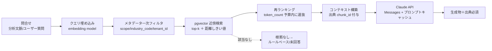
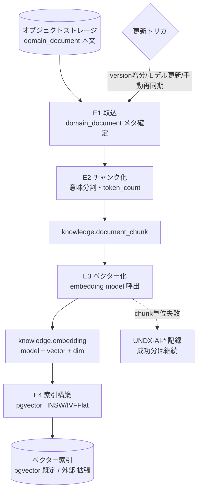
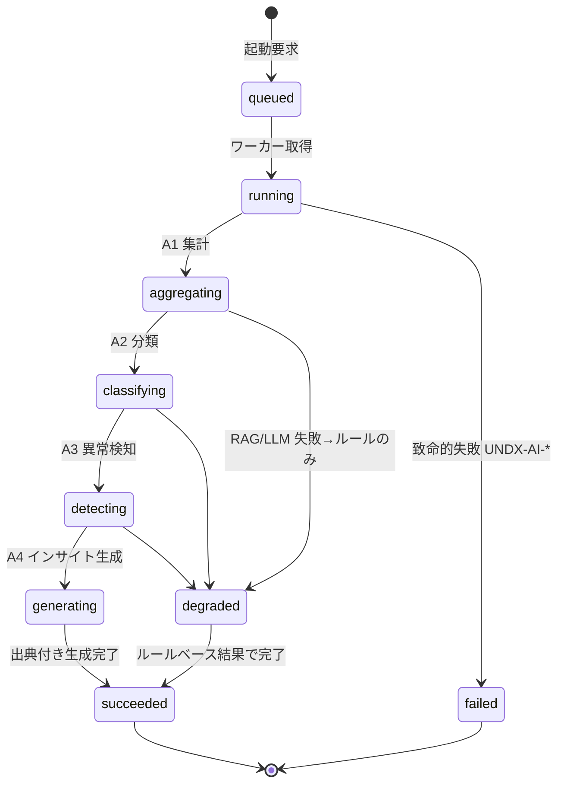
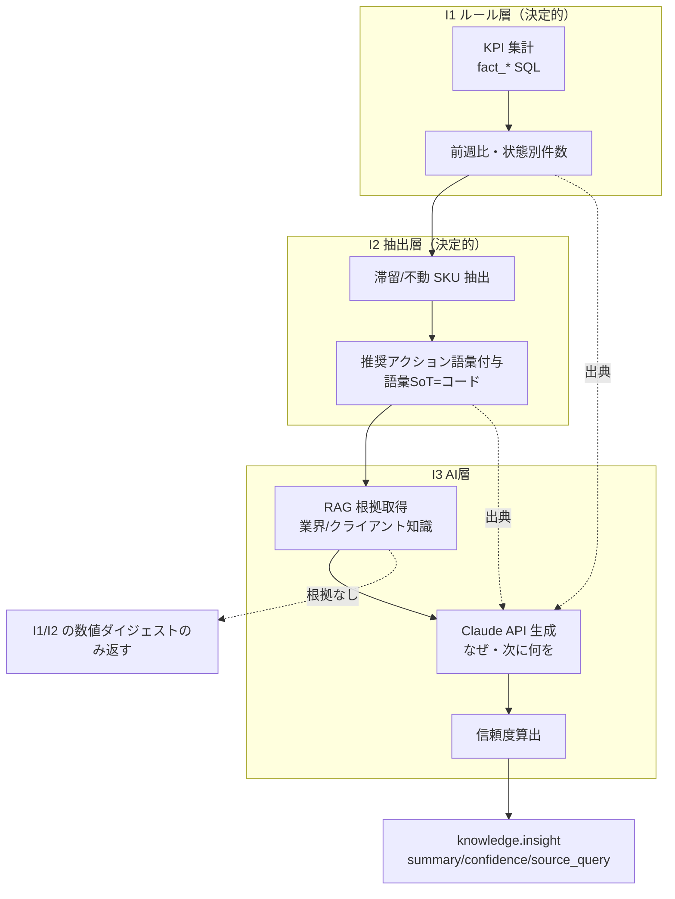
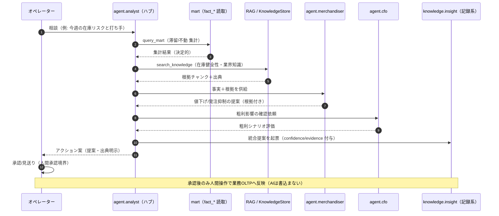

# DD-04 AI/RAG/エージェント詳細設計（KnowledgeCore ＋ VirtualCompany）

> **ステータス:** Draft（レビュー前）
> **版:** v1.0
> **最終更新:** 2026-07-04
> **関連ドキュメント:**
> - ブループリント（名称SoT）: 本設計群の正準設計ブループリント v1.0（§6 AI／RAG／エージェント構成骨子／§3.7 `knowledge` エンティティ／§7 SoT宣言マップ／§9 エラーコード領域／§11 ADR-010〜012）
> - 上位: [`../basic-design/BD-03-analytics-ai-platform.md`](../basic-design/BD-03-analytics-ai-platform.md)、[`../basic-design/BD-06-non-functional.md`](../basic-design/BD-06-non-functional.md)
> - 分析基盤（mart 参照元）: [`./DD-01-canonical-data-model.md`](./DD-01-canonical-data-model.md)、[`../database/DB-05-analytics-star-schema.md`](../database/DB-05-analytics-star-schema.md)
> - API 契約: [`./DD-02-api-interface-design.md`](./DD-02-api-interface-design.md)
> - マッピング/変換（AI補助の呼出元）: [`./DD-03-mapping-transform-engine.md`](./DD-03-mapping-transform-engine.md)
> - 認可/テナント境界: [`./DD-06-security-authz-tenancy.md`](./DD-06-security-authz-tenancy.md)
> - 物理スキーマ（本書が挙動の正・DBが物理の正）: [`../database/DB-08-knowledge-vector-snapshot-schema.md`](../database/DB-08-knowledge-vector-snapshot-schema.md)
> - 横断: [`../decision-log.md`](../decision-log.md)（ADR-010/ADR-011/ADR-012）、[`../glossary.md`](../glossary.md)
> - 継承元（prior art）: [`../../design.md`](../../design.md)、[`../../star-schema-design.md`](../../star-schema-design.md)、`.ai-native/domain-context/`

---

## 0. 本書の位置づけと SoT

本書は Undeux Platform（UCP、系統コード `UNDX`）の **KnowledgeCore（`MOD-KNOWLEDGE`）と VirtualCompany（`MOD-DSS`）における AI/RAG/エージェント挙動設計の Source of Truth（SoT of Behavior）** である。ドメイン知識ストアの構造、インデックス化/ベクター化パイプライン、分析 AI ワークフロー、インサイト生成、意思決定支援エージェント群（バーチャルカンパニー）の協調、ガードレール、コスト/監査を規定する。

本書の最上位原則は **ADR-010**（AI 組込範囲は集計/分類/インデックス/ベクター/インサイト＋エージェント支援に限定し、記録系 SoT への直接書込を許さない）である。AI は常に**派生・助言**であり、業務データ（`retail.*`/`maker.*`/`wms.*`/`staging.*`）や分析 mart（`mart_{tenant_code}`）を直接書き換えない。

SoT の階層を明確にする。

| 領域 | SoT | 本書との関係 |
|---|---|---|
| `knowledge` スキーマの名称（テーブル名・列名） | ブループリント §3.7／§6 | 本書は名称を**不変で引用**（新名称を作らない） |
| AI/RAG/エージェントの挙動（RAG 検索・チャンク・オーケストレーション・ガードレール） | **本書（DD-04）** | 実装・物理設計はここを参照 |
| `knowledge` の物理DDL（型・索引・ベクター次元・制約） | [`../database/DB-08-knowledge-vector-snapshot-schema.md`](../database/DB-08-knowledge-vector-snapshot-schema.md) | 本書は代表 DDL を提示、詳細は DB-08 が正 |
| ドメイン知識の実体（原本） | `knowledge.domain_document` ＋オブジェクトストレージ | チャンク/ベクターは派生（ADR-012） |
| 分析事実（インサイトの入力） | 各ファクト `fact_*`（SoT は各 OLTP／staging） | mart は派生キャッシュ。AI はそこを読むのみ |
| エラーコード（AI 領域） | `shared.error_code` ＋ Core の `ErrorCodes`（`UNDX-AI-*`） | 本書は代表割当（暫定番号）を提示 |

本書に**ブループリントに無い要素を足す場合は「拡張提案」と明記**する。断定できない事項は §10「未決事項」に列挙する。

### 前提

- ブループリント v1.0 の名称・SoT宣言（§7）・マルチテナント方式（ADR-001: OLTP=RLS＋論理列 / mart=スキーマ分離）・AI 組込範囲の限定（ADR-010）・ベクターストアは pgvector 既定（ADR-011）・ベクター/チャンク/インサイトは `domain_document` から再生成可（ADR-012）は確定事項として扱う。
- DB は PostgreSQL 16。`pgvector`／`jsonb`／生成列／RLS（`app.tenant_id` セッション変数）が利用可能である前提。
- **LLM は Claude API（Anthropic Messages API）を主に用いる**。具体モデル ID は環境依存として抽象化し、`config` の稼働設定（`backoffice.service_activation.config jsonb`）で解決する（ブループリント §8.5「モデルは環境依存」の方針を継承）。本書では役割別にモデルの「クラス」（高推論クラス／標準クラス／低コストクラス）で記述する。
- ベクターストアは pgvector 既定。規模により外部ベクターストアへ移行可能（ADR-011）。埋め込みベクトルの `dim`（次元数）はモデルに依存し、`knowledge.embedding.model`＋`dim` で識別する。
- 記述言語は日本語、コード識別子/SQL/型名/モデルIDは英数字。
- 金額は最小通貨単位の整数 `bigint`（`shared.currency.minor_unit` で桁解釈）。コスト集計もこの型方針に従う。

---

## 1. AI 活用の全体像とレイヤ

Undeux Platform の AI は、**「mart（事実）」と「KnowledgeStore（ドメイン知識）」の 2 系統を入力**とし、**RAG で根拠づけた集計・分類・インサイト・意思決定支援**を出力する。全出力は派生であり、記録系 SoT を書き換えない（ADR-010）。

AI 活用を 6 レイヤに分ける。

| レイヤ | 正準名（ブループリント §6） | 責務 | 実体 |
|---|---|---|---|
| L0 データ源 | mart／KnowledgeStore | AI の入力（事実＋知識） | `mart_{tenant_code}.fact_*`／`knowledge.domain_document` |
| L1 知識化 | `EmbeddingPipeline` | チャンク化・ベクター化・索引 | `knowledge.document_chunk` → `knowledge.embedding` |
| L2 検索 | RAG（Retrieval） | 業界/クライアント別知識の意味検索 | pgvector 近傍検索＋メタデータ絞込 |
| L3 分析 | `AnalyticsAgentFlow` | 集計・分類・異常検知のオーケストレーション | mart 参照＋`knowledge.agent_run` |
| L4 生成 | `InsightGenerator` | ルールベース→AI のインサイト生成 | `knowledge.insight` |
| L5 支援 | `VirtualCompany` | 役割エージェント群による意思決定支援 | `knowledge.agent_definition`（`role_code`） |
| 横断 | `Guardrail` / `SnapshotStore` | PII/テナント境界/根拠必須／静的化 | ポリシー層＋`knowledge.snapshot_manifest` |

下図は各レイヤと SoT の関係を示す。実線が主データフロー、点線が RAG による根拠付与である。AI レイヤ（L1〜L5）は L0 を**読み取り専用**で参照し、生成結果は `knowledge.*`（記録系・派生）にのみ書き込む。

```mermaid
graph TD
    subgraph L0[L0 データ源（読み取り専用）]
        MART[(mart_&#123;tenant_code&#125;<br/>fact_* / dim_*)]
        DOC[knowledge.domain_document<br/>業界/クライアント知識・原本]
    end
    subgraph AI[AI レイヤ MOD-KNOWLEDGE / MOD-DSS]
        EP[L1 EmbeddingPipeline<br/>chunk→embedding]
        RAG[L2 RAG 検索<br/>pgvector 近傍＋メタ絞込]
        AF[L3 AnalyticsAgentFlow<br/>集計/分類/異常検知]
        IG[L4 InsightGenerator<br/>ルール→AI]
        VC[L5 VirtualCompany<br/>役割エージェント群]
    end
    GR[Guardrail<br/>PII/テナント境界/根拠必須]
    SS[SnapshotStore<br/>静的化・knowledge.snapshot_manifest]

    DOC --> EP --> RAG
    MART --> AF
    RAG --> AF
    AF --> IG
    RAG -.根拠.-> IG
    IG --> VC
    RAG -.根拠.-> VC
    AF -.根拠.-> VC
    GR -.制約.-> RAG & AF & IG & VC
    IG --> SS
    VC -.人間承認境界.-> HUMAN[オペレーター承認]
```



**設計原則（本書全体に適用）:**
- **根拠必須（Grounding）:** 生成物には必ず出典（`document_chunk` 参照または `fact_*` クエリ）を付与する。出典を提示できない主張はハルシネーションとして扱い出力しない（§8）。
- **SoT → 派生の一方向:** AI は mart/domain_document を読むのみ。書込は `knowledge.*`（記録系）に限定。
- **グレースフルデグラデーション:** RAG 検索失敗・LLM タイムアウト等の補助失敗は主要フロー（分析画面表示・mart 参照）を止めない（原則4）。ルールベース結果へフォールバックする（§5）。

---

## 2. ドメイン知識ストアと RAG

### 2.1 KnowledgeStore の二層構造

`KnowledgeStore` は **industry（業界別）** と **client（クライアント別）** の二層で構成する（ブループリント §6）。`knowledge.domain_document.scope ∈ {industry, client}` で層を区別する。

| 層 | `scope` | `tenant_id` | 例 | 可視範囲 |
|---|---|---|---|---|
| 業界層 | `industry` | NULL（非テナント） | アパレル在庫健全性の業務定義、業界商慣習、季節指標 | 同一 `industry_code` の全テナントで共有 |
| クライアント層 | `client` | 非NULL（テナント所有） | 個社の運用ルール、SKU 命名慣習、独自 KPI 定義 | 当該テナントのみ（RLS で分離） |

継承元 `.ai-native/domain-context/`（`industry/apparel-inventory-health.md` 等）を業界層の初期投入とする。ただし `.ai-native/domain-context` は「特定プロジェクト＝しまむら×メーカー」の記述を含むため、**プラットフォーム化にあたり一般化**する（下記 2.2）。

### 2.2 domain-context の一般化方針

`.ai-native/domain-context/industry/apparel-inventory-health.md` は「状態の業務定義（健全/注意/滞留/不動）」「経過バケット」「推奨アクション語彙（reduce-order 等）」を持つ。これを次のように一般化して業界層へ格納する。

- **業種非依存コアの抽出:** 「消化率」「在日（stock days）」「滞留」「不動」は業種横断の在庫健全性概念。これを `taxonomy_term`（`scheme='inventory_health'`）として正規化し、業界固有の閾値（45日/60日/75%/8週）は業界別 `domain_document` の付随メタデータとして分離する（コアと拡張の分離）。
- **SoT の分離継承:** 元ドキュメントは「業務定義（何を・なぜ）は本ドキュメントが SoT、実装値（閾値・判定ロジック）はコードが SoT」の相互参照構造を持つ。プラットフォームでもこの分離を継承する。**業務定義＝`knowledge.domain_document`、実装閾値＝Core の判定ルール（`InventoryHealthRules` 相当）**。RAG が返すのは業務定義であり、閾値の数値は API レスポンスの `thresholds` 経由で取得する（AI が閾値を捏造しない）。
- **拡張提案（店舗軸の扱い）:** 元ドキュメントは「店間移動を語彙に含めない理由＝ソースに店舗軸がない」と明記する。プラットフォームでは `dim_store`/`channel` を持つテナントが存在しうるため、店舗軸データの有無を `domain_document` のメタデータで宣言し、RAG がテナントのデータ充足度に応じて提案語彙を出し分ける（**拡張提案**。詳細は §10-Q2）。

### 2.3 チャンク化とメタデータ

`domain_document` を `document_chunk`（`seq` 昇順・`token_count` 保持）に分割する。チャンク方針：

| 項目 | 方針 |
|---|---|
| 分割単位 | 見出し（Markdown H2/H3）と表を境界とする意味的分割。閾値表・語彙表は 1 表 1 チャンクを原則とする |
| 目標トークン | 200〜500 token/chunk（`token_count` を保持し、検索時のコンテキスト予算計算に使用） |
| オーバーラップ | 隣接チャンク間で 1〜2 文の重複を許容（文脈欠落防止） |
| メタデータ | `scope`／`industry_code`／`tenant_id`／`doc_code`／`version`／見出しパス／`taxonomy_term` タグ |

**メタデータ絞込（RAG の一次フィルタ）:** ベクター近傍検索の前に、必ず `scope`・`industry_code`・`tenant_id` でフィルタする。これは**テナント境界のガードレール**でもある（§8）。`client` 層は当該テナントのみ、`industry` 層は当該 `industry_code` のみを候補集合とし、越境参照を物理的に遮断する。

### 2.4 RAG 検索フロー



- **一次フィルタ→ベクター検索の順序厳守:** メタデータ絞込を先に行い、テナント/業界境界内でのみ近傍検索する。逆順（全件近傍→事後フィルタ）はテナント越境リスクとコスト増を招くため禁止。
- **距離しきい値:** 近傍距離が閾値超（＝十分に類似する知識が無い）の場合、根拠不足として生成を抑制し、ルールベースまたは「該当知識なし」を返す（グレースフルデグラデーション）。
- **出典付与:** LLM へ渡すコンテキストの各断片に `document_chunk_id` を紐づけ、生成物へ出典として転記する（根拠必須ガードレール）。

---

## 3. インデックス化・ベクター化パイプライン（EmbeddingPipeline）

### 3.1 対象データと SoT との関係

`EmbeddingPipeline` は **`knowledge.domain_document`（原本＝SoT）** を入力に、`document_chunk`（派生）→ `embedding`（派生・再生成可）を生成する（ADR-012）。mart のファクトは埋め込み対象**外**（数値事実は集計で扱い、ベクター化しない）。埋め込むのは自然言語のドメイン知識である。

| ステージ | 入力 | 出力 | SoT 位置づけ |
|---|---|---|---|
| E1 取込 | オブジェクトストレージの本文（`body_uri`） | `domain_document`（メタ）＋本文 | `domain_document` が SoT |
| E2 チャンク | `domain_document` 本文 | `document_chunk`（`seq`/`text`/`token_count`） | 派生（再生成可） |
| E3 ベクター化 | `document_chunk.text` | `embedding`（`model`/`vector`/`dim`） | 派生（再生成可・ADR-012） |
| E4 索引 | `embedding.vector` | pgvector 索引（HNSW/IVFFlat） | 派生 |

### 3.2 更新トリガと冪等性

| トリガ | 契機 | 挙動 |
|---|---|---|
| ドキュメント新規/改訂 | `domain_document.version` 増分 | 当該 doc の chunk/embedding を再生成（旧 version は保持し追跡可能に） |
| モデル更新 | 埋め込みモデル ID 変更 | `embedding.model` 別に再生成。`(document_chunk_id, model)` UNIQUE により新旧共存可 |
| 手動再同期 | オペレーター指示 / 障害復旧 | `EmbeddingPipeline` 全再実行（回復パス。ブループリント §7） |

- **冪等性（原則2）:** 再実行しても `(document_chunk_id, model)` UNIQUE により重複挿入されず UPSERT で更新。`domain_document` が SoT なので、chunk/embedding は破棄→再生成しても情報損失しない（ADR-012）。**記録系（`insight`/`agent_run`/`agent_message`）は再生成対象外**（巻戻し禁止）。
- **SoT→派生順序:** `domain_document`（SoT）確定後に chunk→embedding→索引の順で更新する。逆順は不整合の温床（原則6）。
- **非ブロッキング:** 一部 chunk の埋め込み失敗はパイプライン全体を止めず、当該 chunk を `error_code` 付きで記録し、成功分は索引へ反映する（グレースフルデグラデーション）。致命的失敗のみ `UNDX-AI-004` を投げる。

### 3.3 ベクターストア方針（ADR-011）

- **既定: pgvector**（PostgreSQL 16 内 `knowledge.embedding.vector`）。OLTP と同一 DB でトランザクション整合を取りやすく、初期構成を簡素化する。
- **スケール時: 外部ベクターストア**。`embedding.vector` を「外部参照」として保持し、`snapshot_manifest` 経由で外部インデックスと同期する（**拡張提案**。移行境界は §10-Q3）。
- **下位互換:** pgvector→外部移行時も `knowledge.embedding` のスキーマ（`(document_chunk_id, model)` キー）は不変とし、`vector` 列の格納形態（インライン/外部参照）のみ切替える。既存 `domain_document` からの再生成で復元可能（データ保護・原則7）。

### 3.4 パイプライン全体図



図の要点：`domain_document`（SoT）を起点に E1→E4 が一方向に流れ、更新トリガ（version 増分・モデル更新・手動再同期）が E1 を再起動する。chunk 単位の失敗は記録して継続し、全体を止めない。

---

## 4. 分析 AI ワークフロー（AnalyticsAgentFlow）

### 4.1 オーケストレーションの構成

`AnalyticsAgentFlow` は **集計・分類・異常検知・インサイト生成** を段階的にオーケストレーションする。各実行は `knowledge.agent_run`（記録系）で追跡し、途中の LLM 往復は `knowledge.agent_message`（`agent_run_id`, `seq`）に追記する。

| 段 | 名称 | 入力 | 手段 | 出力先 |
|---|---|---|---|---|
| A1 集計 | Aggregate | `fact_*`（mart） | SQL 集計（決定的） | 中間集計（`agent_message`） |
| A2 分類 | Classify | 集計結果＋`taxonomy_term` | ルール＋（必要時）LLM 分類 | 状態ラベル（健全/注意/滞留/不動 等） |
| A3 異常検知 | Detect | 集計・時系列 | 統計ルール（前週比・しきい値・回帰残差）＋LLM 補助 | 異常候補 |
| A4 インサイト | Insight | A1〜A3＋RAG 根拠 | `InsightGenerator`（§5） | `knowledge.insight` |

- **決定的処理を優先:** 集計（A1）・単純分類（A2 の閾値判定）は SQL/ルールで実行し、LLM に数値計算をさせない（ハルシネーション回避・コスト削減）。LLM は「分類の境界事例の判断」「異常の自然言語説明」「インサイト文生成」に限定する。
- **ツール利用（Claude API）:** LLM に mart を直接触らせず、**サーバー側で実行した集計結果をツール結果として渡す**（プログラマティックな集計→LLM は解釈に専念）。LLM が SQL を提案しても実行は AnalyticsAgentFlow 側が検証・実行する（AI は業務データを直接読み書きしない、ADR-010）。

### 4.2 異常検知の方針

| 種別 | 判定 | AI の役割 |
|---|---|---|
| しきい値逸脱 | 在日/消化率が業界閾値超（`domain_document` の閾値、コードが実装 SoT） | 逸脱の業務的意味づけ（RAG 根拠付き） |
| 前週比急変 | `fact_sales_weekly` 週次差分がσ超 | 要因仮説の提示（断定しない） |
| 回帰残差 | 散布図（消化率×値引き率）・スイッチ温度モデルの残差 | 外れ値 SKU の説明文生成 |

異常検知の統計判定は決定的に行い、AI は**説明と示唆のみ**を担う。判定ロジックの実装値は Core（`InventoryHealthRules`/`InventoryFlagRules` 相当）が SoT であり、AI が閾値を上書きしない。

### 4.3 状態遷移（agent_run のライフサイクル）



`agent_run` は記録系（巻戻し禁止・原則2）。`degraded` は補助（RAG/LLM）失敗時にルールベース結果で完了する状態で、グレースフルデグラデーションを表す。`failed` は入力欠損等の致命的失敗のみ。

---

## 5. インサイト生成（InsightGenerator）

### 5.1 ルールベース → AI の二段構え

継承元 UndeuxSales の「全社サマリー（KPI＋週次トレンド）」「今週のアクション（滞留・不動の自動抽出）」を一般化し、`InsightGenerator` として体系化する。**まずルールベースで確定した事実を土台にし、その上に AI が自然言語のインサイトを重ねる**二段構えとする。

| 段 | 名称 | 内容 | 出力 |
|---|---|---|---|
| I1 ルール層 | 全社サマリー相当 | KPI（売上/在庫/消化率）、前週比、状態別件数、部門別健全性を SQL で確定 | 数値ダイジェスト（決定的・出典＝`fact_*` クエリ） |
| I2 抽出層 | 今週のアクション相当 | 滞留/不動 SKU の自動抽出、推奨アクション語彙付与（reduce-order 等） | 対象リスト（決定的・語彙 SoT はコード） |
| I3 AI層 | インサイト文生成 | I1/I2＋RAG 根拠から「なぜ・次に何を」の自然言語示唆を生成 | `knowledge.insight`（`summary`/`confidence`/`source_query`） |

- **既存機能の一般化:** 元の「全社サマリー」は特定小売×メーカー前提だが、汎用化後は `dim_customer`/`dim_region`/`dim_product`（商品・地域・販売先の 3 軸）で任意テナントに適用する。地域粒度は `region_granularity`（都道府県/市区町村）に追随する。
- **信頼度（`confidence`）:** I3 の生成物には信頼度を必須付与する。根拠チャンク数・近傍距離・入力データ充足度から算出し、低信頼のインサイトは UI で明示する。
- **`source_query jsonb`:** インサイトの再現性のため、生成元の集計クエリ条件（期間・軸・フィルタ）を `knowledge.insight.source_query` に保持する。これにより「どの事実から導いたか」を監査可能にする。

### 5.2 インサイト生成ワークフロー



図の要点：I1→I2 は決定的に事実を固め、I3 で AI が根拠付きの示唆を重ねる。RAG が根拠を返せない場合は I3 をスキップし、ルールベースのダイジェストのみを返す（グレースフルデグラデーション）。生成物は `knowledge.insight`（記録系）に保存する。

### 5.3 代表 DDL（`knowledge.insight` 抜粋）

物理詳細は DB-08 が正だが、挙動を規定するため代表 DDL を示す。金額系メジャーは扱わないが、`source_query`（jsonb）と生成列で軸を索引化する方針を示す。

```sql
-- knowledge.insight（記録系・派生。SoT は fact_* と domain_document、insight 自体は監査記録）
CREATE TABLE knowledge.insight (
    insight_id      bigint GENERATED ALWAYS AS IDENTITY PRIMARY KEY,  -- サロゲート
    tenant_id       bigint NOT NULL,                                  -- RLS 論理列
    scope_kind      text   NOT NULL DEFAULT 'analytics',              -- analytics/agent 等
    source_query    jsonb  NOT NULL,                                  -- 生成元の集計条件（再現性）
    summary         text   NOT NULL,                                  -- 生成インサイト本文
    confidence      numeric(4,3) NOT NULL,                            -- 0.000〜1.000
    evidence        jsonb  NOT NULL DEFAULT '[]'::jsonb,              -- 出典 chunk_id / fact クエリ配列（根拠必須）
    -- jsonb からの生成列（軸での絞込・索引用）
    period_start    date GENERATED ALWAYS AS ((source_query->>'period_start')::date) STORED,
    model_ref       text GENERATED ALWAYS AS (source_query->>'model_ref') STORED,
    generated_at    timestamptz NOT NULL DEFAULT now(),
    created_at      timestamptz NOT NULL DEFAULT now(),
    updated_at      timestamptz NOT NULL DEFAULT now()
);
-- 自然キー相当（同一条件の重複生成を冪等 UPSERT で抑制する場合の候補）
CREATE UNIQUE INDEX ux_insight_dedup
    ON knowledge.insight (tenant_id, md5(source_query::text), model_ref);
CREATE INDEX ix_insight_tenant_period ON knowledge.insight (tenant_id, period_start DESC);
-- RLS（テナント境界。DD-06 と整合）
ALTER TABLE knowledge.insight ENABLE ROW LEVEL SECURITY;
```

> `evidence` が空配列のインサイトは根拠必須ガードレール違反とみなし、生成側で `UNDX-AI-002` としてブロックする（§8）。連番・型の最終確定は DB-08 に従う。

---

## 6. 意思決定支援エージェント／バーチャルカンパニー（VirtualCompany）

### 6.1 役割エージェント群

`VirtualCompany` は役割別エージェント群で意思決定を支援する（ブループリント §6）。各エージェントは `knowledge.agent_definition`（`role_code` が自然キー・`system_prompt`・`tools jsonb`）で定義する。ブループリントで確定した `role_code` を厳守する。

| `role_code` | 役割 | 主関心 | 主に参照する事実 |
|---|---|---|---|
| `agent.cmo` | マーケティング責任者 | 売上・販売先・地域戦略 | `fact_sales_weekly`/`dim_customer`/`dim_region` |
| `agent.cfo` | 財務責任者 | 粗利・請求・コスト | `fact_sales_weekly.gross_profit`/`fact_billing` |
| `agent.merchandiser` | マーチャンダイザー | 商品・在庫健全性・値下げ | `fact_inventory_snapshot`/`dim_product`/`dim_sku` |
| `agent.supply_planner` | 供給計画 | 発注・生産・納品 | `fact_orders`/`fact_production`/`fact_delivery` |
| `agent.analyst` | アナリスト | 横断集計・異常検知・根拠整理 | 全 `fact_*`＋RAG |

### 6.2 協調とツール利用

- **ハブ＆スポーク協調:** `agent.analyst` を調整役（ハブ）とし、事実の取得・RAG 根拠付けを一元化して各役割エージェントへ供給する。各役割は自分の関心領域で判断・提案し、`agent.analyst` が統合して人間向けのアクション案を編む。
- **ツール（Claude API のツール利用）:** 各エージェントに与えるツールは `agent_definition.tools jsonb` で宣言する。ツールは全て**読み取り／助言**系に限定する（ADR-010）：
  - `query_mart`（集計取得。サーバー側で検証・実行、結果をツール結果として返す）
  - `search_knowledge`（RAG 検索。テナント/業界境界内）
  - `get_thresholds`（在庫健全性等の実装閾値をコード SoT から取得）
  - `propose_action`（アクション**提案**の起票。実行はしない）
- **書込の禁止:** エージェントは `retail.*`/`maker.*`/`wms.*`/`mart_*` を書き換えるツールを持たない。提案は `knowledge.insight`／提案キューに記録するのみ。

### 6.3 人間承認境界

エージェントの出力は**すべて提案（advice）**であり、業務反映は人間（オペレーター）の承認を経る。既存の在庫アクションフラグ運用（候補→対応中→対応済/見送り、更新者記録）を継承し、**AI 提案 → 人間承認 → 業務システムへの反映**の境界を明確にする。

- AI が提案を起票（`knowledge.insight`／提案キュー、記録系）。
- オペレーターがレビュー・採否（既存フラグ運用と同じ判断記録・更新者記録）。
- 承認された提案のみが、人間の操作を通じて業務 OLTP（発注抑制・値下げ設定等）へ反映される。
- **在庫アクションフラグは `public`/自然キー保持で mart 再構築の影響を受けない**（ADR-014 継承）。AI 提案が mart rebuild で消えることはない。

### 6.4 エージェント協調シーケンス



図の要点：`agent.analyst` が事実（mart）と根拠（RAG）を集約し、役割エージェント（merchandiser/cfo）が各観点で提案、統合結果を `knowledge.insight`（記録系）へ起票する。業務反映は人間承認を必ず経る。

---

## 7. モデル選定と Claude API 活用方針

### 7.1 モデル選定（クラスで抽象化）

**具体モデル ID は環境依存**とし、稼働設定（`backoffice.service_activation.config jsonb`）で解決する。本書では役割に応じた「クラス」で規定する。実際のモデル ID（例: 高推論クラスに `claude-opus-4-8`、低コストクラスに `claude-haiku-4-5` 等）は環境の `config` にマッピングする。

| クラス | 用途 | 選定観点 |
|---|---|---|
| 高推論クラス | VirtualCompany の統合判断（`agent.analyst`）、境界事例の分類、複雑なインサイト | 推論品質優先。長い文脈（RAG 根拠＋事実）を扱う |
| 標準クラス | 通常のインサイト文生成、異常の説明 | 品質とコストの均衡 |
| 低コストクラス | 大量の単純分類、要約、マッピング候補提示（DD-03 連携） | 速度・コスト優先 |
| 埋め込みクラス | `EmbeddingPipeline` のベクター化 | `embedding.model`＋`dim` で識別。バッチ処理向き |

- **モデル抽象化の下位互換:** モデル ID を直書きせず `config` 参照とすることで、モデル更新時もスキーマ・API 契約を変えずに切替え可能（原則7）。埋め込みモデル更新時は `(document_chunk_id, model)` キーで新旧共存し再生成する（§3.2）。

### 7.2 Claude API 活用方針

Claude API（Messages API）の機能を次の方針で用いる。

| 機能 | 活用方針 |
|---|---|
| プロンプトキャッシュ | `system`（役割定義・ガードレール文）とツール定義を**安定プレフィックス**として先頭に固定し、可変部（当該テナントの事実・質問）を末尾に置く。プレフィックス一致でキャッシュヒットさせコストを削減。日付・UUID 等の可変値をプレフィックスに混ぜない |
| ツール利用 | mart 集計・RAG 検索・閾値取得を**ツール**として提供し、実行はサーバー側で検証。LLM に生 SQL を実行させない。ツール結果を文脈に戻して解釈させる |
| 適応的思考（推論深度） | 統合判断・境界事例など難度の高いタスクで推論を厚くし、単純分類では抑える。深度は用途に応じて `config` で調整（具体パラメータは環境依存） |
| 構造化出力 | インサイトの `summary`/`confidence`/`evidence` を構造化スキーマで受け取り、パース失敗を防ぐ。信頼度・出典の欠落を検出しやすくする |
| バッチ処理 | `EmbeddingPipeline` の大量ベクター化、夜間の定期インサイト再生成に用いる |

- **キャッシュ設計とテナント境界:** プロンプトキャッシュはテナント横断で共有しうる**業界層知識・役割定義まで**をプレフィックスに置き、クライアント固有知識・事実は末尾（キャッシュ境界の外）に置く。これによりコスト削減とテナント越境防止を両立する。
- **ツール結果の SoT 保護:** ツール（`query_mart` 等）は読取専用。書込ツールを一切定義しないことで、モデルが業務データを更新する経路を構造的に断つ（ADR-010）。

---

## 8. ガードレール・ハルシネーション対策・監査ログ・コスト

### 8.1 Guardrail（3 本柱）

`Guardrail` はポリシー層（RLS＋プロンプト制約＋出典必須）で構成する（ブループリント §6）。

| 柱 | 内容 | 実装 |
|---|---|---|
| テナント境界 | クライアント知識・事実の越境参照を禁止 | RAG 一次フィルタ（`tenant_id`）＋RLS（`app.tenant_id`）。多層防御（DD-06） |
| PII 保護 | 個人情報の生成物への流出防止 | 取込時の PII 検出タグ、生成前後のマスキング、プロンプト制約 |
| 根拠必須 | 出典なき主張を出力しない | `evidence` 空はブロック（`UNDX-AI-002`）。距離しきい値超は生成抑制 |

### 8.2 ハルシネーション対策

- **数値は LLM に作らせない:** 集計・KPI・件数は SQL で確定し、LLM は解釈のみ（§4.1）。閾値はコード SoT から取得（`get_thresholds`）。
- **根拠しきい値:** RAG 近傍距離が閾値超のとき生成を抑制し、ルールベース／「該当知識なし」を返す（§2.4）。
- **信頼度の明示:** `confidence` を必須付与し、低信頼を UI で明示（§5.1）。断定調を避け、要因は「仮説」として提示（§4.2）。
- **出典検証:** 生成後に `evidence` の `chunk_id` が実在・同一テナント/業界に属するかを検証。不整合は破棄。

### 8.3 監査ログ

記録系テーブルで AI の全活動を追跡可能にする（巻戻し禁止・原則2）。

| 記録 | テーブル | 内容 |
|---|---|---|
| エージェント実行 | `knowledge.agent_run` | `agent_definition_id`/`tenant_id`/`status`/開始終了 |
| 対話・ツール呼出 | `knowledge.agent_message` | `agent_run_id`/`seq`/`role`/`content`/`tool_call jsonb` |
| 生成インサイト | `knowledge.insight` | `source_query`/`summary`/`confidence`/`evidence`/`generated_at` |
| スナップショット | `knowledge.snapshot_manifest` | 静的化した生成物の由来（`source_version`/`built_at`） |

`agent_message.tool_call` にツール名・引数・結果ダイジェストを残し、「どの事実・知識から何を生成したか」を後追いできる（監査可能性の確保・ADR-010）。

### 8.4 コスト

- **型方針:** コスト集計は最小通貨単位の整数 `bigint`（`currency.minor_unit` で解釈）。使用量計測は `backoffice.usage_metering`（記録系・巻戻し禁止）へ metric（例: `ai_tokens_in`/`ai_tokens_out`/`embedding_count`）として追記し、`backoffice.billing_*` で請求へ連携（BD-05）。
- **削減策:** プロンプトキャッシュ（§7.2）、決定的処理の優先（LLM 呼出削減）、低コストクラスの適材適所、バッチ処理、スナップショット静的化（同一問合せの再生成回避）。
- **非ブロッキング:** 使用量計測（補助処理）の失敗は主要フローを止めない。計測は追記のみで、失敗時も生成結果は返す（原則4）。

### 8.5 エラーコード（`UNDX-AI-*`）

ブループリント §9 の領域 `AI` を用いる。一元管理は `shared.error_code`＋Core の `ErrorCodes`、公開は `GET /api/error-codes`（継承）。連番は 001 から採番、番号は暫定（§10-Q5）。

| コード | 意味 | 挙動 |
|---|---|---|
| `UNDX-AI-001` | LLM 呼出失敗/タイムアウト | 非ブロッキング。ルールベースへフォールバック（degraded） |
| `UNDX-AI-002` | 根拠必須違反（出典/evidence なし） | ブロッキング（生成物を出力しない） |
| `UNDX-AI-003` | テナント境界違反（越境参照検出） | ブロッキング（ガードレール。DD-06 と連鎖） |
| `UNDX-AI-004` | 埋め込み/インデックス生成失敗（致命的） | ブロッキング（chunk 単位は継続、パイプライン致命時のみ） |
| `UNDX-AI-005` | ベクター検索該当なし/距離しきい値超 | 非ブロッキング（生成抑制・ルールベース） |
| `UNDX-AI-006` | PII 検出/マスキング境界違反 | ブロッキング（生成前後で遮断） |
| `UNDX-AI-007` | コスト/レート上限超過 | 非ブロッキング（キューイング/バッチへ回送） |

> 実際の連番・メッセージ・`http_status` は `shared.error_code`（コード SoT）と DD-02 に従う。無コードの想定外は `UNDX-SYS-001`（継承）へフォールバック。

### 8.6 レスポンシブ対応

AI が生成するインサイト・アクション提案は UI に表示される。PC ではテーブル/リスト、**モバイルではカード型**で表示する（原則8）。特に「今週のインサイト」「アクション提案」は、信頼度バッジ・出典リンク・推奨アクション語彙を含むカードとしてモバイル可読性を確保する。TSV コピー（Excel 貼付）等の補助手段も継承する。

---

## 9. SoT 保護（AI は派生/助言）

本節はブループリント §7 の SoT 宣言マップのうち AI 領域を再掲・詳細化する。**AI は記録系 SoT を直接書き換えない**（ADR-010）を貫徹する。

| データ領域 | SoT | AI 側の派生/助言 | 回復パス |
|---|---|---|---|
| ドメイン知識 | `knowledge.domain_document`（＋オブジェクトストレージ） | `document_chunk`／`embedding`（派生・再生成可） | `EmbeddingPipeline` 再実行（ADR-012） |
| 分析事実 | 各 `fact_*`（SoT は OLTP/staging） | AI は読取のみ。集計結果は `agent_message` に記録 | mart `rebuild()`（AI は関与しない） |
| インサイト | `knowledge.insight`（記録系・監査記録） | 生成物。SoT は `fact_*`＋`domain_document` | `source_query` から再生成（再現性） |
| エージェント実行 | `knowledge.agent_run`/`agent_message`（記録系） | 追記のみ・巻戻し禁止 | 再実行は新 `agent_run` を起票 |
| 在庫アクションフラグ | `retail.inventory_action_flag`（public/自然キー・ADR-014） | AI は提案のみ。フラグ更新は人間承認経由 | mart 再構築の影響を受けない（原則2） |
| ベクター索引 | `knowledge.embedding`（派生） | pgvector/外部索引はキャッシュ | `domain_document` から再構築 |

**SoT 保護の要点:**
- **書込方向の一方向性:** AI の書込先は `knowledge.*`（記録系・派生）に限定。業務 OLTP・mart への書込ツールを一切定義しない（§6.2）。
- **順序（原則6）:** `domain_document`（SoT）→ chunk/embedding（派生）、`fact_*`（SoT）→ insight（派生）。逆順は禁止。
- **再現性:** `insight.source_query` と `agent_message` で「どの事実・知識から生成したか」を保持し、モデル更新後も監査・再生成できる（ADR-012）。
- **状態保護（原則2）:** 記録系（`agent_run`/`agent_message`/`insight`/`usage_metering`）は巻戻さない。設定系（`agent_definition`/`service_activation.config`）のみ更新可。

---

## 10. 未決事項

| # | 事項 | 影響 | 暫定方針 |
|---|---|---|---|
| Q1 | `taxonomy_term` の在庫健全性スキーム（`scheme='inventory_health'`）の正規語彙・多言語同義語（`synonyms jsonb`）の確定 | RAG のメタ絞込・分類精度 | 拡張提案。`.ai-native/domain-context` を種に DB-08 で確定 |
| Q2 | 店舗軸データ有無に応じた提案語彙の出し分け（店間移動の再導入可否） | インサイトの実行可能性 | 拡張提案。`domain_document` メタで宣言し、`dim_store`/`channel` 充足度で分岐（元ドキュメントの「店舗軸なし」制約を一般化） |
| Q3 | pgvector→外部ベクターストア移行の閾値（ドキュメント数/ベクトル数/レイテンシ） | スケール設計・ADR-011 の運用境界 | 拡張提案。初期 pgvector、PoC で境界を実測 |
| Q4 | 埋め込みモデルの `dim`（次元数）と距離関数（cosine/inner product/L2）の確定 | 索引方式（HNSW/IVFFlat）・精度 | 環境依存。`embedding.model`＋`dim` で識別、DB-08 が物理を決定 |
| Q5 | `UNDX-AI-*` の連番・`http_status`・メッセージ確定 | エラー一元管理 | `shared.error_code`（コード SoT）＋DD-02 で確定。本書は代表割当（暫定番号） |
| Q6 | プロンプトキャッシュのテナント境界とヒット率の実測（業界層をどこまで共有プレフィックスに置けるか） | コスト・テナント越境リスク | 拡張提案。業界層/役割定義まで共有、クライアント固有は境界外。PoC で検証 |
| Q7 | エージェント協調の上限（同時稼働エージェント数・往復回数・タスク予算） | コスト・レイテンシ・`UNDX-AI-007` | 拡張提案。`config` で上限管理、超過はバッチ回送 |
| Q8 | インサイトの重複生成抑制（`ux_insight_dedup` の粒度）と再生成トリガの確定 | 冪等性・記録系の肥大 | 拡張提案。`source_query` ハッシュ＋`model_ref` で冪等 UPSERT、DB-08 で物理確定 |
