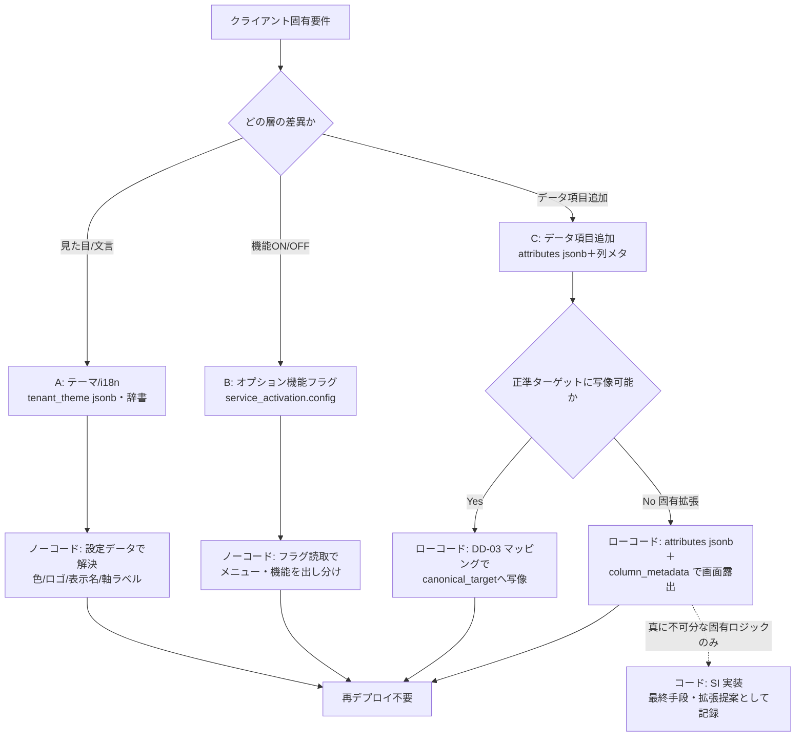
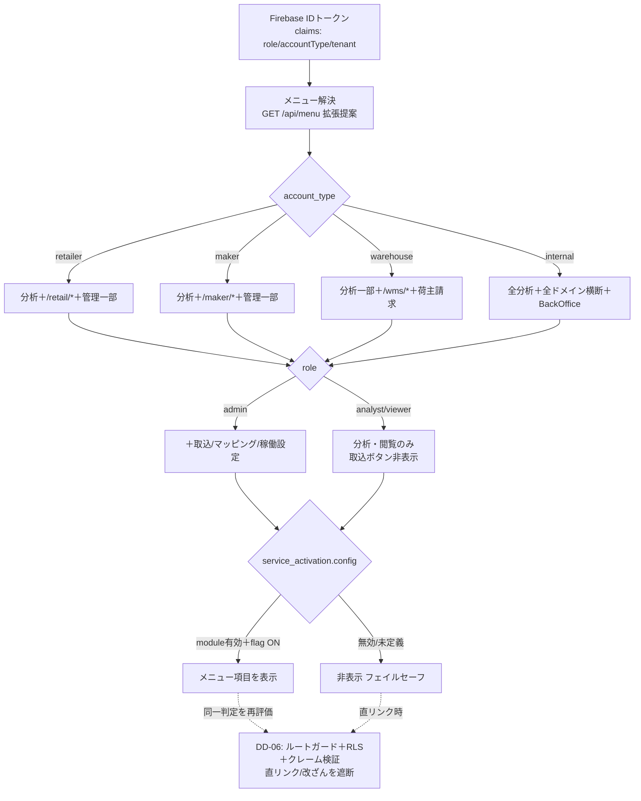

# DD-05 画面・UX・SI 戦略詳細（サイトマップ・共通UIコンポーネント・SIカスタマイズ・出し分け）

> **ステータス:** Draft（レビュー前）
> **版:** v1.0
> **最終更新:** 2026-07-04
> **関連ドキュメント:**
> - ブループリント（名称SoT）: 本設計群の正準設計ブループリント v1.0（§2 モジュール／§3 OLTP／§4 mart／§8.3 マルチテナント／§8.5 技術スタック／§9 エラーコード）
> - API 契約（表示素材の供給元・本書の入力）: [`./DD-02-api-interface-design.md`](./DD-02-api-interface-design.md)
> - 概念データモデル: [`./DD-01-canonical-data-model.md`](./DD-01-canonical-data-model.md)
> - 連携/変換（データ項目追加の実体）: [`./DD-03-mapping-transform-engine.md`](./DD-03-mapping-transform-engine.md)
> - AI/RAG/エージェント（インサイト面の埋め込み先）: [`./DD-04-ai-rag-agent-design.md`](./DD-04-ai-rag-agent-design.md)
> - 認証/認可/テナント分離（メニュー出し分けの認可の正）: [`./DD-06-security-authz-tenancy.md`](./DD-06-security-authz-tenancy.md)
> - 上位: [`../basic-design/BD-06-non-functional.md`](../basic-design/BD-06-non-functional.md)（レスポンシブ/性能/アクセシビリティ）、[`../basic-design/BD-05-backoffice.md`](../basic-design/BD-05-backoffice.md)（稼働設定）
> - 物理スキーマ（稼働設定・分析mart）: [`../database/DB-07-backoffice-schema.md`](../database/DB-07-backoffice-schema.md)、[`../database/DB-05-analytics-star-schema.md`](../database/DB-05-analytics-star-schema.md)
> - 横断: [`../decision-log.md`](../decision-log.md)（ADR-001/ADR-013/ADR-015）、[`../glossary.md`](../glossary.md)
> - 継承元（prior art）: [`../../design.md`](../../design.md)（現行 UndeuxSales の画面・フィルタ・表示射影）、[`../../star-schema-design.md`](../../star-schema-design.md)（`/mart` 分析画面）

---

## 0. 本書の位置づけと SoT

本書は Undeux Platform（略称 UCP、系統コード `UNDX`）の **画面・UX・SI カスタマイズ戦略の Source of Truth（SoT of Screen/UX Blueprint）** である。サイトマップ（画面の存在と導線）、共通 UI コンポーネントの語彙と再利用方針、SI カスタマイズ（見た目・オプション機能・データ項目追加）のノーコード/ローコード寄せ方、アカウント種別・ロールによるメニュー/ルート出し分け、レスポンシブ、アクセシビリティを本書が正とする。

本書は「画面の存在・導線・表示射影の責務境界」を定義するにとどめ、以下は各 SoT に委ねる。

| 領域 | SoT | 本書との関係 |
|---|---|---|
| 画面が呼ぶ API のパス・入出力・認可要件 | [`./DD-02`](./DD-02-api-interface-design.md) | 本書は「どの画面がどの API を素材に使うか」を参照するだけ |
| リソース名・次元名（`dim_*`/`fact_*`）・エラーコード | ブループリント §3/§4/§9 | 本書は名称を**不変で引用**し、画面固有の別名を作らない |
| 認可の物理（クレーム検証・RLS・ミドルウェア順序） | [`./DD-06`](./DD-06-security-authz-tenancy.md) | 本書はメニュー/ルートの**表示上の**出し分け要件、DD-06 が強制の正 |
| テナント別の稼働設定（有効モジュール・オプション） | `backoffice.service_activation`（ブループリント §3.6） | 本書はこの設定を読んで出し分ける「消費側」 |
| データ項目追加の実体（マッピング/変換） | [`./DD-03`](./DD-03-mapping-transform-engine.md)・`attributes jsonb` | 本書は追加項目の**画面露出**方針のみ |

ブループリントに無い画面固有の要素を足す場合は「**拡張提案**」と明記する。断定できない事項は §8「未決事項」に列挙する。

### 前提

- フロントは Nuxt 4 / Vue 3 / TypeScript / Tailwind CSS v4 / lucide / Chart.js（ブループリント §8.5）。UI はレスポンシブ必須（PC=表、モバイル=カード）。
- **表示射影はフロントで算出する**（継承）。API は表示に依存しない集計素材（`fact_*` 由来の指標）を返し、順位・複合スコア・構成比・累積構成比・ABC ランク・順位変動・成長率・回帰係数・4象限分類はフロント（`utils/ranking.ts`・`utils/regression`・`utils/skuStatus.ts` 系）が射影する（[`../../design.md`](../../design.md) §9・§11、[`./DD-02`](./DD-02-api-interface-design.md) §1）。これにより再ランキング/再回帰がサーバ往復なしで完了し操作の体感が軽い。
- 認証は Firebase Authentication。カスタムクレーム `role` / `accountType`、および本 PF で導入する `tenant`（テナント境界）を用いる（ブループリント §8.3・ADR-015）。
- 画面が扱う「分析軸の基本」は**商品・地域・販売先**（ブループリント §1）。地域粒度はテナントの `region_granularity`（`prefecture`/`municipality`）に追従してフィルタ・軸の選択肢が動的に変わる。
- 既存 UndeuxSales の UX（目的別ホーム → 分析画面群、上部固定 FilterBar、ScopeFilterTags 相当の絞込チップ、在庫アクションのフラグ運用）を**継承し一般化**する。旧ルート（`/mart/*`）は互換維持を検討する（ADR-013）。

---

## 1. 画面設計原則

本 PF の全分析画面は、**「フィルタ（対象の絞込）→ 集計単位（グレイン/軸の選択）→ 表示集計値（メジャーと表示射影）」の一方向導線**を共通言語とする。既存 UndeuxSales の分析画面が持つこの三段導線を、ドメイン（小売/メーカー/倉庫）横断の標準として一般化する。図はこの導線と責務境界（サーバ=集計素材、フロント=表示射影）を示す。

```mermaid
flowchart LR
    subgraph FE[フロント（Nuxt 4 / Vue 3）]
      F1[① フィルタ<br/>ScopeFilterTags<br/>期間/商品/地域/販売先] --> F2[② 集計単位<br/>グレイン・軸選択<br/>週/日・商品/SKU/地域/販売先]
      F2 --> F3[③ 表示集計値<br/>メジャー選択＋表示射影<br/>順位/構成比/ABC/回帰/4象限]
    end
    F1 -. クエリ(from/to/departments/regions/customers) .-> API[DD-02 API<br/>集計素材のみ返す]
    F2 -. dimension/metric/granularity .-> API
    API -->|fact_* 由来の指標| F3
    API --> MART[(mart_&#123;tenant_code&#125;<br/>SoTからの派生)]
```



図の要点。

1. **フィルタ → 集計単位 → 表示集計値の導線を崩さない。** ユーザーはまず対象を絞り（フィルタ）、次に「何を1行とするか」を選び（集計単位＝グレイン/軸）、最後に見たい数値と見せ方（メジャー＋表示射影）を選ぶ。この順序を全ドメインで固定し、画面ごとに導線を作り直さない。
2. **表示射影はフロント責務（継承の中核）。** サーバは `fact_sales_weekly`・`fact_inventory_snapshot`・`fact_orders` 等の**加算可能な集計素材**を返すにとどめる。順位・複合スコア・構成比・ABC・順位変動・成長率・回帰・スイッチ温度の象限分類は、操作で変わる「表示上の派生」であるためフロントで算出する。これは「SoT=集計値、表示=射影」思想（[`../../design.md`](../../design.md) §9.2/§10/§11）の一般化であり、**サーバ往復を減らす性能設計**でもある。
3. **フィルタ状態は URL クエリに射影して共有可能にする。** 絞込・軸・メジャーは可能な限り URL クエリへ双方向バインドし、リロード・ブックマーク・共有で再現できるようにする（継承: 共通フィルタのクエリ表現）。
4. **地域粒度はテナント設定に従属。** 地域フィルタ/軸の選択肢は `shared.tenant.region_granularity` に追従し、`dim_region` の自己参照階層（国 > 都道府県 > 市区町村）をどの `level` まで見せるかを動的に決める（ブループリント §3.0・§4.1、ADR-003）。
5. **グレースフルデグラデーション。** 補助的な表示要素（AI インサイトカード、画像サムネイル、気温オーバーレイ）が取得失敗しても、主表（DataTable）とKPIは描画を続ける。失敗はトースト＋当該カード内のプレースホルダで示し、`UNDX-*` を表示する（§7.4）。

> **API との責務分界（再掲・DD-02 の正）:** 「一覧と詳細は別 API」「レスポンスに別リソースを混在させない」（[`./DD-02`](./DD-02-api-interface-design.md)）。画面側も、一覧画面（DataTable）と詳細画面（商品/SKU/取込バッチ詳細）でルートを分け、1画面が集約・加工の責務を負い過ぎないようにする。

---

## 2. サイトマップ

画面はドメイン非依存の**共通シェル**（トップバー＋サイドナビ＋目的別ホーム）の下に、ドメイン別・目的別のドリルダウンをぶら下げる。ホーム（`/`）は現行同様「目的別メニュー」（[`../../design.md`](../../design.md) 冒頭注記）とし、そこから各分析クラスタへ入る。下図はアカウント種別横断の**論理サイトマップ**で、実際に表示されるノードは §5 の出し分けで `account_type`・`role`・`service_activation` によって間引かれる。

```mermaid
graph TD
    ROOT[/ ホーム<br/>目的別メニュー]
    ROOT --> DASH[/dashboard 全社サマリー<br/>KPI＋週次トレンド]
    ROOT --> ANALYTICS[分析クラスタ InsightMart]
    ROOT --> DOMAIN[ドメイン業務クラスタ]
    ROOT --> AI[/insights AI/インサイト<br/>KnowledgeCore/VirtualCompany]
    ROOT --> ADMIN[管理クラスタ]

    ANALYTICS --> A1[/analytics/sales 売上分析<br/>トレンド/ランキング/ブレイクダウン]
    ANALYTICS --> A2[/analytics/crosstab クロス集計]
    ANALYTICS --> A3[/analytics/inventory 在庫マネジメント<br/>滞留/不動抽出＋アクション]
    ANALYTICS --> A4[/analytics/scatter 散布図・回帰<br/>スイッチ温度/重回帰]
    ANALYTICS --> A5[/analytics/products 商品別分析]
    A5 --> A5D[/analytics/products/:productId 商品詳細]

    DOMAIN --> R[小売 CrossRetail<br/>/retail/*]
    DOMAIN --> M[メーカー MakerOps<br/>/maker/*]
    DOMAIN --> W[倉庫 WareFlow<br/>/wms/*]
    R --> R1[/retail/sales 商取引]
    R --> R2[/retail/inventory 在庫]
    M --> M1[/maker/production 生産]
    M --> M2[/maker/orders 発注/納品]
    W --> W1[/wms/inbound-outbound 入出庫]
    W --> W2[/wms/shipper-billing 荷主請求]

    ADMIN --> AD1[/admin/imports 取込バッチ<br/>DataBridge]
    ADMIN --> AD2[/admin/mapping 項目マッピング]
    ADMIN --> AD3[/admin/activation 稼働設定<br/>service_activation]
    ADMIN --> AD4[/admin/error-codes エラーコード一覧]
    ADMIN --> AD5[/admin/billing 契約/請求<br/>BackOffice]
```

サイトマップの読み方と原則。

- **クラスタは5系統。** ①全社サマリー（ダッシュボード）②分析（InsightMart：ドメイン共通の分析画面群）③ドメイン業務（小売/メーカー/倉庫の OLTP 操作）④AI/インサイト（KnowledgeCore/VirtualCompany）⑤管理（DataBridge 取込/マッピング・稼働設定・請求・エラーコード）。
- **分析クラスタはドメイン非依存で共通。** 売上・クロス集計・在庫・散布図・商品別は `mart_{tenant_code}` の `fact_*`/`dim_*` を素材とし、どの `account_type` でも同じ画面部品を使う。表示される軸（販売先/倉庫等）だけがテナントで変わる。
- **目的別ドリルダウンは「サマリー → 一覧 → 明細/詳細」の3段固定。** 例: 在庫マネジメントは `全社サマリーの在庫ダイジェスト`（`GET /api/mart/inventory/actions` 相当）→ `在庫一覧＋アクション`（`GET /api/mart/inventory/items` 相当）→ `SKU 明細/商品詳細`。一覧と詳細は別 API・別ルート（DD-02 の責務分界に整合）。
- **ドメイン業務クラスタは `account_type` に強く従属。** 小売テナントには `/retail/*` のみ、メーカーには `/maker/*` のみ、倉庫には `/wms/*` のみを出す（§5）。分析クラスタは全種別に出るが、内部の軸候補が変わる。
- **管理クラスタは `role` とモジュール稼働に従属。** 取込（`/admin/imports`）は取込権限ロール（`role=admin` 相当）必須、請求（`/admin/billing`）は `account_type=internal` またはバックオフィス提供契約テナントのみ（ブループリント §3.6・BD-05）。

---

## 3. 共通 UI コンポーネント

SI コストを下げる最大のレバーは「画面ごとに部品を作らない」ことである。分析クラスタの全画面を、下表の**共通コンポーネント語彙**の組み合わせで構成する。既存 UndeuxSales の部品（FilterBar・ランキング表・在庫アクション表・散布図）を汎化して命名を統一する。

| コンポーネント | 責務 | 素材（DD-02 API） | 再利用ポイント |
|---|---|---|---|
| `AppShell` | トップバー＋サイドナビ＋ブレッドクラム。ナビ項目は §5 の出し分け結果 | `GET /api/menu`（拡張提案） | 全画面 |
| `ScopeFilterTags` | 現在の絞込（期間/商品/地域/販売先/部門/季節）をチップ列で可視化＋個別解除。FilterBar の上位語彙 | `GET /api/filters`（選択肢） | 全分析画面で共通の絞込状態表現 |
| `DataTable` | 一覧の主表。ソート・ページング・**固定列（左端キー列＋右端メジャー列の sticky）**・行選択 | 各一覧 API（`/api/products`・`/api/ranking` 等） | ランキング/商品別/在庫一覧/取込履歴 |
| `MetricCard`（カード型） | KPI 1枚（値＋前期比＋スパークライン）。モバイル時は一覧の行がこれに畳まれる | `GET /api/summary`・`/api/mart/inventory/actions` | ダッシュボード＋モバイル代替表示 |
| `TrendChart` / `RankingChart` / `ScatterChart` / `CrosstabMatrix` | Chart.js ラッパ（折れ線/棒/散布図/ヒートマップ表）。表示射影はフロント算出値を受け取る | `/api/sales/trend`・`/api/ranking`・`/api/analysis/*`・`/api/crosstab` | 分析クラスタ全体 |
| `ActionFlagCell` | 在庫アクションのフラグ付与/対応状況変更（候補/対応中/対応済/見送り）。冪等登録 | `/api/inventory-flags/*` | 在庫マネジメント |
| `InsightPanel` | AI インサイト/エージェント提案の表示。出典必須（ガードレール） | DD-04 の insight/agent API | ダッシュボード・各分析画面のサイド |
| `ErrorBoundary` / `EmptyState` | エラー（`UNDX-*` 表示）・空データ・権限不足のグレースフル表現 | 全 API のエラー形状（DD-02） | 全画面 |

コンポーネント設計の要点。

1. **`DataTable` は固定列を第一級機能にする。** 分析表は横に広い（多メジャー×多期間）。左端の識別子列（商品名/SKU/販売先）と、比較の基準となる右端メジャー列を sticky にし、横スクロール時も文脈を失わない。列定義はスキーマ駆動（`{ key, label, align, sticky, formatter }`）とし、金額列は `formatter` で `currency.minor_unit` に基づく桁解釈を行う（金額は素材段階では `bigint` 最小通貨単位。ブループリント §8.4）。
2. **`ScopeFilterTags` は「射影された絞込状態」の単一表現。** FilterBar（入力）と結果テーブルの間に立ち、現在有効なスコープをチップで見せる。チップの語彙は `dim_*` の属性名に対応（部門=`department`、業態=`channel_code`、季節=生成列 `season`、地域=`dim_region.level`、販売先=`dim_customer`）。ブループリントに無い画面独自ラベルは作らない。
3. **表示射影値はコンポーネントに「計算済みで」渡す。** `RankingChart`/`DataTable` は順位・ABC・構成比を**受け取るだけ**で、内部で API を叩かない。算出は画面コンテナ（`utils/ranking.ts` 等）が担い、コンポーネントは純粋な表示に徹する（テスタビリティ＋再利用性）。
4. **カード型はモバイル代替の既定形。** `DataTable` は `md` ブレークポイント未満で自動的に `MetricCard` の縦積みへ切替える（§6）。この切替をコンポーネント内に閉じ込め、各画面が個別対応しない。

---

## 4. SI カスタマイズ戦略

汎用データ構造を土台に、クライアント固有事情のみを SI で反映する（共有コンテキスト「汎用化・SI 戦略」）。カスタマイズを **(A) 見た目/テーマ (B) オプション機能フラグ (C) データ項目追加** の3層に分解し、それぞれを可能な限り**ノーコード（設定データ）→ ローコード（宣言的定義）→ コード（最終手段）**の順に寄せる。原則は「DDL 変更・再デプロイなしで多くのクライアント差を吸収する」（ADR-007 の jsonb+生成列思想の UI への一般化）。



### 4.1 (A) 見た目/テーマ（ノーコード）

- **テナント別テーマは設定データ。** ロゴ・アクセントカラー・ブランド名・表示密度を `shared.tenant` 付随の `theme jsonb`（**拡張提案**: `shared.tenant.ui_theme jsonb`）に持ち、フロントは Tailwind の CSS 変数へ流し込む。コード分岐やテナント別ビルドを作らない。
- **軸ラベル・文言はテナント別辞書。** 汎用バリアント2軸（`variant_axis1/2_label`）や部門名など「業種で呼び名が変わる」語は、ブループリント §3.0 の「軸ラベルのテナント別メタデータ」を UI 辞書として読み、i18n レイヤ（`useI18n` 相当）で解決する。アパレル=色/サイズ、食品=容量/味の差はここで吸収し、`dim_sku` の物理列名は不変。
- **既定テーマからの差分のみ保持。** 未設定キーは PF 既定にフォールバック（グレースフルデグラデーション）。テーマ取得失敗時も既定テーマで描画を継続する。

### 4.2 (B) オプション機能フラグ（ノーコード）

- **機能の ON/OFF は `backoffice.service_activation.config jsonb` が SoT。** 契約プラン（`backoffice.plan.module_scope`）で有効化されたモジュールと、その `config` の機能フラグを画面が読み、メニュー項目・タブ・ボタンを出し分ける（§5）。フロントにハードコードしない。
- **設定系データなので冪等・巻き戻し禁止に整合。** `service_activation` は設定系（更新可）、`usage_metering` 等の記録系は巻き戻さない（ブループリント §7・原則2）。機能フラグ変更は既存の記録・フラグ（`inventory_action_flag`）を破壊しない。
- **フラグ未定義は「無効」にフォールバック（フェイルセーフ）。** 未知フラグを true 扱いしない。取得失敗時は「基本機能のみ」で継続し、`UNDX-BILL-*`/`UNDX-TENANT-*` をログ表示。

### 4.3 (C) データ項目追加（ローコード）

クライアント固有の有効データはオプション的に取り込む（共有コンテキスト）。追加項目は 2 経路で扱う。

1. **正準ターゲットに写像できる項目** → [`./DD-03`](./DD-03-mapping-transform-engine.md) の人的フィールドマッピングで `mapping.canonical_target`（既存 `dim_*`/`fact_*` 列）へ写像。画面は既存コンポーネントがそのまま表示するため**画面改修ゼロ**。
2. **正準に無い固有拡張項目** → `attributes jsonb`＋（必要なら）生成列で保持し（ADR-007）、**列メタデータ駆動**で画面へ露出する。`DataTable`/`ScopeFilterTags` は「表示可能な追加列カタログ」を読み、フィルタ・列・軸候補を宣言的に増やす。**拡張提案**: `mapping.canonical_target` に UI 露出メタ（`ui_label`・`ui_filterable`・`ui_sortable`・`ui_format`）を持たせ、追加項目のフィルタ/列/フォーマットを設定だけで有効化する。これにより「データ項目追加＝ローコード（マッピング＋列メタ設定）」に寄せ、コード変更を最終手段に押し下げる。
3. **下位互換の担保。** 追加項目は既存画面・既存 API 契約を壊さない additive 変更に限定する（原則7）。既存列の意味変更が避けられない場合はデータ更新パッチと互換ビュー（ADR-013）で段階移行し、旧ルート/旧レスポンス形状を維持する。

> **SI カスタマイズの SoT 整理:** テーマ=`shared.tenant.ui_theme`（拡張提案）、機能フラグ=`backoffice.service_activation.config`、項目追加=`mapping`＋`attributes jsonb`＋列メタ。いずれも**設定データが SoT**であり、フロントは消費側。SI 作業は「設定を入れる」が第一で、コードを書くのは真に不可分な固有ロジックのみ。

---

## 5. アカウント種別・ロールによるメニュー/ルート出し分け

メニューとルートの可視性は **`account_type`（種別）× `role`（権限）× `service_activation`（稼働）× `region_granularity`（地域粒度）** の合成で決まる。**表示上の出し分けは UX（本書）、強制はサーバ（DD-06 の RLS/クレーム検証）** の二層で行い、フロント出し分けは「見せない」だけで「守る」ことはしない（クライアント改ざん耐性はサーバが担保。ADR-015）。



出し分けの規則。

- **`account_type` はドメインクラスタを決める。** retailer→`/retail/*`、maker→`/maker/*`、warehouse→`/wms/*`。分析クラスタは全種別に出すが、内部の軸候補が種別で変わる（小売/メーカー=販売先=`dim_customer`・商品=`dim_product`、倉庫=倉庫=`dim_warehouse`・SKU=`dim_sku`、請求=`fact_billing`）。internal（自社）は横断集計と BackOffice を持つ（ブループリント §8.3・§4.2）。
- **`role` は操作権限を決める。** 取込（`POST /api/imports`）・マッピング編集・稼働設定は取込権限ロール（`role=admin` 相当）のみ。analyst/viewer には取込/編集ボタンとルートを出さない。閲覧専用者に破壊的操作の入口を見せない（継承: `role=admin` 必須の取込）。
- **`service_activation` は機能の有無を決める。** 契約で無効なモジュール（例: AI/インサイト未契約）はメニューごと消す。未定義フラグは非表示（フェイルセーフ）。
- **`region_granularity` は地域軸の深さを決める。** `prefecture` テナントは市区町村ドリルダウンのメニュー/軸を出さない（データも粒度に追従）。
- **二層防御（重要）。** フロントの出し分けは UX 上の最適化にすぎない。直リンク・URL 改変・トークン改ざんに対しては、Nuxt のルートミドルウェア（`middleware` は SSR でもサーバ実行される点に留意）＋サーバ側のクレーム検証・RLS が最終的に遮断する（[`./DD-06`](./DD-06-security-authz-tenancy.md)）。権限外アクセスは `UNDX-TENANT-*`/`UNDX-AUTH-*` を返し、画面は `EmptyState`（権限不足）へフォールバック。
- **`GET /api/menu`（拡張提案）。** 出し分け条件（種別×ロール×稼働×粒度）の合成をサーバが解決してメニューツリーを返す案。フロントに条件ロジックを散在させず、稼働設定変更が即メニューに反映される。未採用時は各条件をフロントで合成するが、その場合も強制は DD-06 側で二重化する。

---

## 6. レスポンシブ設計

UI はレスポンシブ必須（ブループリント §8.5、原則8、BD-06）。「PC で動く」を完了としない。PC のリスト/テーブルは、モバイルで可読なカード型へ再構成する。

| ブレークポイント | 主レイアウト | 主表（`DataTable`）の扱い | ナビ |
|---|---|---|---|
| `< md`（モバイル） | 単一カラム縦積み | **カード型**（`MetricCard`）へ自動変換。1行=1カード、キー属性＋主要メジャー＋前期比を要約 | ハンバーガー＋ドロワー |
| `md ≤ w < lg`（タブレット） | 2カラム | 主要列のみの簡易表（副次列は行展開で表示）＋固定列 sticky | 折りたたみサイドナビ |
| `≥ lg`（PC） | サイドナビ＋メイン | フル `DataTable`（多列・固定列 sticky・横スクロール） | 常時サイドナビ |

レスポンシブの要点。

- **テーブル→カードの変換は `DataTable` に内包**（§3-4）。各画面が個別にモバイル対応を書かない。カードは列定義の `mobilePriority` に従い、重要列（識別子・主メジャー・前期比・アクション）だけを見せ、残りは「詳細を開く」で展開。
- **チャートは器の幅に追従。** Chart.js は `responsive: true` ＋アスペクト比制御。散布図・クロス集計ヒートマップはモバイルでピンチズーム/横スクロールコンテナに収め、**本体ページは横スクロールさせない**。
- **`ScopeFilterTags` はモバイルで折り返し＋「フィルタ」ボトムシート。** 上部固定の FilterBar はモバイルでボトムシート化し、適用中スコープはチップで常時可視。
- **タッチ標的とセーフエリア。** 主要操作（フラグ付与、フィルタ適用）は 44px 以上のタップ領域を確保し、`env(safe-area-inset-*)` を考慮。

---

## 7. アクセシビリティ配慮

方法論 USABILITY_STANDARDS（U-2 出力の直感性 / U-5 アクセシビリティ配慮、CLAUDE.md 原則8 の補完）に沿い、以下を最低基準とする。

1. **コントラストと色依存の排除。** テーマ（§4.1）はコントラスト比 WCAG AA（本文4.5:1・大文字3:1）を満たす配色に制約。ランキングの ABC ランク・在庫アクション種別・散布図の4象限は**色のみで区別しない**（アイコン/ラベル/パターン併記）。スイッチ温度の象限も凡例テキストを必須にする。
2. **キーボード操作。** `DataTable` のソート・ページング・行選択、`ScopeFilterTags` のチップ解除、`ActionFlagCell` の状態変更は全てキーボードで到達・操作可能。フォーカスリングを可視化し、フォーカストラップ（モーダル/ボトムシート）を適切に管理。
3. **スクリーンリーダ。** チャートは `aria-label`＋データテーブル代替（`TrendChart`/`ScatterChart` は同素材の隠し表を提供）。KPI カードは値・単位・前期比を読み上げ順に構造化。ライブ更新（フィルタ適用結果）は `aria-live="polite"` で通知。
4. **エラー/空/権限の明示（`UNDX-*`）。** `ErrorBoundary`/`EmptyState` はエラーコード（`UNDX-{領域}-{連番}`）と再試行導線を提示。補助要素失敗は主表を止めない（グレースフルデグラデーション）。文言はテナント辞書（§4.1）経由で i18n 可能。
5. **画像の代替。** `dim_sku.image_url` のサムネイルには商品名の `alt` を付与。画像取得失敗はプレースホルダ＋商品名フォールバック（継承: `hinmei` フォールバック思想）。

---

## 8. 未決事項

1. **`GET /api/menu`（メニュー解決 API）採否。** 出し分け条件の合成をサーバに寄せるか、フロント合成＋DD-06 強制の二層に留めるか。採用時はレスポンス形状・キャッシュ戦略を DD-02 に追記が必要。
2. **`shared.tenant.ui_theme jsonb`（テーマ列）採否。** テーマ SoT をテナント行に持たせるか、`backoffice.service_activation.config` に同居させるか。ブループリント未定義のため拡張提案扱い。
3. **列メタデータ（`canonical_target` の UI 露出メタ）の所在。** `ui_label/ui_filterable/ui_sortable/ui_format` を `mapping.canonical_target` に持たせるか、別テーブル（`mapping.ui_column_meta` 拡張提案）に分離するか。DD-03/DB-06 と要調整。
4. **倉庫（warehouse）テナントの分析クラスタ範囲。** 倉庫は販売先/商品軸を持たない場合があり、分析クラスタのどの画面を既定表示にするか（在庫/入出庫/荷主請求中心か）未確定。
5. **旧ルート（`/mart/*`）互換の維持範囲と期限。** 互換ビュー同様に旧パスをどこまで/いつまで維持するか（ADR-013 の段階移行方針との整合）。
6. **AI インサイト面（`InsightPanel`）の常設 vs オンデマンド。** ダッシュボード常設か、各分析画面のサイドオンデマンド呼び出しか。DD-04 のコスト/レイテンシ設計と要調整。
7. **地域粒度切替時のフィルタ状態の持ち越し。** `municipality`→`prefecture` 切替時に選択済み市区町村スコープをどう畳むか（上位へロールアップ or クリア）の UX 規則。

---

> **本書のセルフチェック（Push 前）:** SoT（表示射影=フロント／設定データ=各 SoT）明示済／冪等・巻き戻し禁止（フラグ・稼働設定）言及済／下位互換（additive 項目追加・旧ルート互換）言及済／グレースフルデグラデーション（補助要素失敗で主表継続）言及済／エラーコード（`UNDX-*` 表示）言及済／レスポンシブ（PC=表・モバイル=カード）言及済。ブループリントの名称（`dim_*`/`fact_*`/`account_type`/`service_activation`/`attributes jsonb`）を不変で引用し、画面固有の新名称は拡張提案として明記した。
