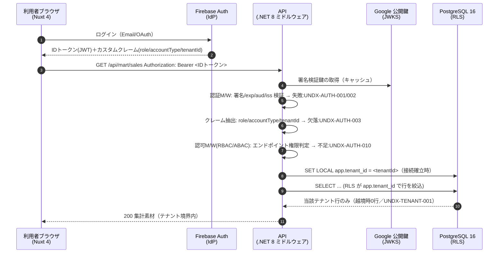

# DD-06 セキュリティ／認証・認可／テナント分離 詳細設計

> **ステータス:** Draft（レビュー前）
> **版:** v1.0
> **最終更新:** 2026-07-04
> **関連ドキュメント:**
> - ブループリント（名称SoT）: 本設計群の正準設計ブループリント v1.0（§8.3 マルチテナント方式／§8.5 認証・技術スタック／§9 エラーコード領域／§7 SoT 宣言マップ）
> - 概念モデル（テナント列・監査列の土台）: [`./DD-01-canonical-data-model.md`](./DD-01-canonical-data-model.md)
> - API 契約（認可要件の入力・本書が物理実装の正）: [`./DD-02-api-interface-design.md`](./DD-02-api-interface-design.md)
> - 連携/変換（他社取込のテナント帰属）: [`./DD-03-mapping-transform-engine.md`](./DD-03-mapping-transform-engine.md)
> - AI/RAG/エージェント（ガードレールのテナント境界）: [`./DD-04-ai-rag-agent-design.md`](./DD-04-ai-rag-agent-design.md)
> - 画面/UX（表示出し分けは本書の境界に**従属**する）: [`./DD-05-screen-ux-si-strategy.md`](./DD-05-screen-ux-si-strategy.md)
> - 上位: [`../basic-design/BD-01-architecture-overview.md`](../basic-design/BD-01-architecture-overview.md)、[`../basic-design/BD-05-backoffice.md`](../basic-design/BD-05-backoffice.md)、[`../basic-design/BD-06-non-functional.md`](../basic-design/BD-06-non-functional.md)
> - 物理スキーマ（RLS/スキーマ分離の物理の正）: `../database/DB-01-schema-strategy.md`、`../database/DB-07-backoffice-schema.md`
> - 横断: [`../decision-log.md`](../decision-log.md)（ADR-001／ADR-010／ADR-014／ADR-015）、[`../glossary.md`](../glossary.md)
> - 継承元（prior art）: [`../../design.md`](../../design.md)（現行アプリ認証・単一テナント前提）、[`../../star-schema-design.md`](../../star-schema-design.md)

---

## 0. 本書の位置づけと SoT

本書は Undeux Platform（略称 UCP、系統コード `UNDX`）の **認証・認可・テナント分離の物理実装の Source of Truth（SoT of Security Enforcement）** である。DD-02 が定義する「API の認可**要件**」（誰がどのリソースに何をできるか）を受け、本書はそれを**どの層でどう強制するか**（クレーム検証・ミドルウェア順序・RLS ポリシー・スキーマ分離・監査記録）を正として定める。

セキュリティ境界の設計方針は一貫して **多層防御（defense in depth）** である。すなわち「画面での出し分け」「API での認可判定」「接続/クエリでの強制」「DB の RLS/スキーマ分離」を独立に積層し、上位層の欠陥が単独で越境を許さない構造をとる。この方針は、現行アプリで課題として残る「**画面レベルの出し分けはセキュリティ境界ではない**」（＝フロントの表示制御は UX であって認可ではない）を §3 で恒久解消する。

### SoT の階層

| 領域 | SoT | 本書との関係 |
|---|---|---|
| ユーザーの認可属性（`role`/`accountType`/テナント境界） | **Firebase Auth のカスタムクレーム**（ブループリント §7 テナント/認証行） | `shared.user_account` はその**映像（キャッシュ）**。書込は Admin SDK → クレームが先、DB 反映が後 |
| テナントの契約実体・`mart_schema`・`region_granularity` | `shared.tenant`（ブループリント §3.1） | クレームの `tenantId` はこの `tenant_id` を指す |
| API 認可要件（エンドポイント別の許可ロール） | [`./DD-02`](./DD-02-api-interface-design.md) | 本書は**強制方法**の正。要件は DD-02 が正 |
| 行レベル分離（RLS ポリシー・`app.tenant_id`） | **本書（DD-06）** ＋ 物理は DB-01 | DD-01 は列の存在、本書はポリシー本体 |
| 分析層のスキーマ分離（`mart_{tenant_code}`） | ブループリント §8.3・ADR-001 | 本書は接続ルーティングの強制を定義 |
| エラーコード（`UNDX-AUTH-*`/`UNDX-TENANT-*`） | `shared.error_code`＋Core `ErrorCodes`（ブループリント §9） | 本書は §8 で採番・意味を確定 |

ブループリントに無い要素を足す場合は「**拡張提案**」と明記する。断定できない事項は §9「未決事項」に列挙する。

### 前提

- 認証は **Firebase Authentication**。IDトークン（JWT・Bearer）をフロント（Nuxt 4）が取得し、API（.NET 8 / ASP.NET Core）へ `Authorization: Bearer <IDトークン>` で送る（ブループリント §8.5、[`../../design.md`](../../design.md) 継承）。
- API は全て `/api` 配下・`https` のみ。転送は TLS 1.2 以上を必須とする。
- カスタムクレームは `role` / `accountType` を継承（ブループリント §8.5）。本書はこれに **`tenantId`（テナント境界）** を加える。`tenantId` をクレームに載せる方式は DD-02 未決事項 #2 を受けた**拡張提案**として本書で確定する（§1.3・§9 で根拠と代替を明記）。
- OLTP は共有テーブル＋ PostgreSQL 16 の **Row-Level Security（RLS）**、分析 mart は **スキーマ分離 `mart_{tenant_code}`** のハイブリッド（ADR-001・§8.3）。
- `shared.region`/`unit`/`currency`/`calendar_date` は**非テナントのグローバル参照マスタ**、`product`/`sku`/`trading_partner`/`channel`/`store` 等は**テナント所有**（DD-01・§8.3）。
- フロントはレスポンシブ必須（PC=表、モバイル=カード。ブループリント §8.5）。ただし表示制御は認可ではない（§3.1）。

---

## 1. 認証（Firebase Authentication）

### 1.1 認証フロー全体

認証は「フロントで IDトークン取得 → API で検証 → セッションコンテキスト確立 → RLS へ橋渡し」の一連で成立する。以下のシーケンスは、ログイン済みユーザーが保護 API を叩いてから DB の行が返るまでの全経路を示す。図中の各検証点はいずれか単独で失敗すると `UNDX-AUTH-*` / `UNDX-TENANT-*` で早期遮断され、後続の DB アクセスに到達しない（フェイルクローズ）。



- **署名検証:** Firebase の IDトークンは RS256 署名。API は Google の JWKS 公開鍵で署名・`exp`（失効）・`aud`（プロジェクトID）・`iss`（`https://securetoken.google.com/<projectId>`）を検証する。鍵は TTL 内キャッシュし、JWKS 取得失敗時も**キャッシュ済み鍵で継続**（グレースフルデグラデーション、§6）。
- **検証は必ずサーバー側:** フロントの `.client.ts` プラグイン（Nuxt）で持つトークンは UX 用であり、認可判定には使わない。SSR/クライアント双方でトークンを保持しうるが、**信頼するのは API のサーバー側検証結果のみ**（CLAUDE.md Nuxt 確認ポイント準拠）。
- Firebase User オブジェクトは Proxy traverse 安全でないため、フロントの `useState`/`ref` には plain object（uid・表示名等の必要最小限）へ変換して格納する（CLAUDE.md Vue 確認ポイント）。

### 1.2 IDトークン検証の実装位置（ミドルウェア順序）

ASP.NET Core のミドルウェアパイプラインは**登録順に実行**される（CLAUDE.md .NET 確認ポイント）。認可の空振り・順序逆転を防ぐため、順序を固定する。

| 順 | ミドルウェア | 責務 | 失敗時 |
|---|---|---|---|
| 1 | `HTTPS リダイレクト/HSTS` | 転送暗号化強制 | 平文アクセス遮断 |
| 2 | `認証（Authentication）` | IDトークン署名/exp/aud/iss 検証、クレーム抽出 | `UNDX-AUTH-001/002/003`（401） |
| 3 | `テナントコンテキスト確立` | `tenantId` から `shared.tenant` 有効性確認、`app.tenant_id` を接続に設定 | `UNDX-TENANT-002`（403）／`UNDX-AUTH-004`（テナント無効） |
| 4 | `認可（Authorization）` | RBAC/ABAC 判定（§2） | `UNDX-AUTH-010/011`（403） |
| 5 | `エンドポイント` | 業務処理（RLS 有効な接続で DB アクセス） | 各業務エラーコード |
| 6 | `監査ロギング（終端）` | アクション記録（§6） | 記録失敗は主フローを止めない（§6） |

> **重要（順序の不変条件）:** テナントコンテキスト確立（3）は認可（4）より**前**でなければならない。ABAC はテナント境界を属性に含むため、`app.tenant_id` 未確定のまま認可判定するとスコープ漏れの温床になる（原則6 の SoT→強制順序）。

### 1.3 カスタムクレーム設計

| クレーム | 型 | 意味 | 値域 | SoT |
|---|---|---|---|---|
| `role` | string | 機能ロール（RBAC の主体） | §2.1 のロール一覧 | Firebase Auth（継承） |
| `accountType` | string | 所属テナントの業種区分 | `retailer`/`maker`/`warehouse`/`internal` | `shared.tenant.account_type` を反映（継承） |
| `tenantId` | number | テナント境界（RLS/スキーマ選択の鍵） | `shared.tenant.tenant_id` | `shared.tenant`（**拡張提案**：クレーム化） |

- **`tenantId` をクレームに載せる理由（拡張提案）:** リクエスト毎に `shared.user_account` を引いてテナントを解決する方式（DD-02 未決 #2 の代替）と比べ、(a) DB 往復を削減、(b) 認証M/W の時点でテナント確定でき順序不変条件（§1.2）を満たしやすい、という利点がある。反面、テナント移動・失効の反映に**クレーム再発行の遅延**が伴う（下記）。
- **クレーム更新の SoT と順序（原則6）:** ユーザーのロール/テナント変更は **Admin SDK でクレームを先に更新**し、その結果を `shared.user_account`（`firebase_uid` を自然キーとする映像）へ反映する。逆順は不整合の温床。回復パスは「Admin SDK による再同期」（ブループリント §7 テナント/認証行）。
- **クレーム伝播ラグの緩和:** カスタムクレーム変更は既存 IDトークンには即時反映されない（トークン有効期間 ≤ 1h）。権限**縮小**（無効化・降格）は遅延が許容できないため、`shared.user_account.status`（`disabled` 等）を**サーバー側で毎リクエスト参照**し、クレームより新しい失効を即時反映する（拡張提案）。権限**拡大**は次回トークン更新での反映を許容する。
- **冪等性:** クレーム設定処理は同一値の再設定で副作用を持たない冪等操作とし、再同期（Admin SDK 一括再設定）で `user_account` 映像が復元できる。記録系（監査ログ・ジョブ履歴）はこの再同期で巻き戻らない（原則2）。

---

## 2. 認可モデル（RBAC＋ABAC）

認可は **RBAC（役割ベース）で機能操作の可否**を、**ABAC（属性ベース）でデータ範囲**を決める二層構成とする（ADR-015）。RBAC 単独ではテナント越境を防げず、ABAC 単独では機能粒度が粗くなるため、両者を積む。

### 2.1 ロール定義（RBAC）

ロールは「参照系／更新系／管理系」の操作クラスに対する許可の束として定義する。テナント種別に依存しない共通ロールを基本とし、`accountType` で利用可能モジュールが決まる（§2.3）。

| `role` | 参照系（read） | 更新系（write/業務トランザクション） | 管理系（マスタ/設定/ユーザー） | 主対象モジュール |
|---|---|---|---|---|
| `viewer` | ○（自テナント） | ×  | × | 分析（InsightMart）中心 |
| `operator` | ○ | ○（業務データ登録・更新） | ×（マスタ変更不可） | 各業務（CrossRetail/MakerOps/WareFlow） |
| `manager` | ○ | ○ | ○（商品/取引先/チャネル等マスタ、稼働設定の一部） | 業務＋分析 |
| `tenant_admin` | ○ | ○ | ○＋ユーザー管理（自テナント内のロール付与） | 全モジュール（自テナント） |
| `platform_admin`（`internal` 専用） | 横断○ | 運用操作 | プラットフォーム全体・全テナント運用 | BackOffice／運用 |

- `platform_admin` は `accountType='internal'`（自社）テナントのユーザーにのみ付与可能。**クライアントテナントのユーザーに `platform_admin` は付与できない**（§2.4 の不変条件）。
- ロール階層は包含（`tenant_admin ⊃ manager ⊃ operator ⊃ viewer` の操作許可）を基本とするが、越境権限（横断参照）は `platform_admin` のみが持つ独立軸とする。

### 2.2 操作クラス別の認可規則

| 操作クラス | 代表エンドポイント（DD-02） | RBAC 最小ロール | ABAC 制約 |
|---|---|---|---|
| 参照系 | `GET /api/mart/*`、`GET /api/{domain}/*`（一覧/詳細） | `viewer` | `row.tenant_id = app.tenant_id`（RLS）。mart は `mart_{tenant_code}` スキーマに限定 |
| 更新系 | `POST/PUT/PATCH /api/{domain}/*`（業務トランザクション） | `operator` | 書込対象行の `tenant_id` は `app.tenant_id` で強制付与（クライアント指定値は無視） |
| 管理系（マスタ） | `POST/PUT /api/{domain}/product-master` 等 | `manager` | 同上＋`shared` 参照マスタのグローバル部（region/unit/currency）は書込不可 |
| 管理系（稼働設定） | `PUT /api/backoffice/service-activation` | `tenant_admin`（自）/`platform_admin` | `service_activation` は設定系＝更新可、`usage_metering` は記録系＝更新不可（§7） |
| 管理系（ユーザー） | `POST /api/admin/users/{uid}/claims` | `tenant_admin`（自テナント内）/`platform_admin` | 付与可能ロールは自ロール以下。テナント跨ぎ付与不可 |
| 横断運用 | `POST /api/mart/rebuild`、`GET /api/backoffice/tenants` | `platform_admin` | テナント境界を跨ぐため `internal` 限定 |

- **更新系のテナント帰属強制:** 書込 API はリクエストボディの `tenant_id` を**信用せず**、`app.tenant_id`（クレーム由来）で上書きする。これによりクライアントが他テナントの `tenant_id` を詐称しても RLS の `WITH CHECK` で拒否される（§3.3）。
- **管理系（ユーザー）の権限昇格防止:** ロール付与は「自ロール以下のロールのみ付与可」を不変条件とし、`operator` が `tenant_admin` を作る等の水平/垂直昇格を封じる。

### 2.3 accountType によるモジュール可視性（ABAC の一部）

`accountType` は「そのテナントが契約しているモジュール群」を規定する属性であり、`backoffice.service_activation`（契約で有効化されたモジュール）と突合して最終的な可視モジュールを決める。

| `accountType` | 既定で利用可能モジュール | 補足 |
|---|---|---|
| `retailer` | MOD-RETAIL, MOD-ANALYTICS, MOD-INTEGRATION | 小売業務＋分析 |
| `maker` | MOD-MAKER, MOD-ANALYTICS, MOD-INTEGRATION | メーカー業務＋分析 |
| `warehouse` | MOD-WMS, MOD-ANALYTICS, MOD-INTEGRATION | 倉庫業務＋分析 |
| `internal` | 全モジュール（MOD-BACKOFFICE 含む） | 自社運用。クライアント提供時は `service_activation` で範囲限定 |

> モジュール可視性の**最終権威は `backoffice.service_activation`**（契約で有効化されたモジュール）であり、`accountType` は既定値に過ぎない。稼働設定で無効化されたモジュールの API は `UNDX-AUTH-012`（未契約/未稼働）で 403 とする。

### 2.4 認可の不変条件（監査観点のチェックリスト）

セキュリティ監査官として、以下は**破ってはならない不変条件**として明文化する。

1. どのクライアントテナントのユーザーも他テナントのデータへ read/write できない（RLS＋スキーマ分離の二重、§3）。
2. `platform_admin` はクライアントテナントに付与されない（`accountType='internal'` 限定）。
3. 更新系の `tenant_id` はクレーム由来で強制され、リクエスト値では決まらない。
4. 認可判定はサーバー側でのみ成立し、フロントの表示制御は認可の代替でない（§3.1）。
5. すべての管理系操作は監査ログに記録される（§6）。記録欠落は不変条件違反として検知対象。

---

## 3. テナント分離の実装境界

### 3.1 「画面出し分けはセキュリティ境界ではない」課題の解消

現行アプリは単一テナント前提であり、マルチテナント化にあたり「フロントでメニューやデータを出し分ける」実装に頼ると、API を直接叩かれた場合に越境する。本書はこれを**多層防御**で恒久解消する。フロントの出し分け（DD-05 の責務）は **UX 上の利便**であって、**セキュリティ境界は API 認可（§2）と DB の RLS/スキーマ分離（§3.3/§3.4）が担う**と明確に分離する。

以下のフローは、1つのデータ読取要求が越境しないために積層される4つの独立境界を示す。上位境界（画面）が仮に無効化されても、下位境界（API 認可・接続・RLS）で必ず遮断される。

```mermaid
flowchart TD
    subgraph L1["第1層: 画面（DD-05・UXのみ／境界ではない）"]
        UI[メニュー/データ出し分け<br/>=利便性。信頼しない]
    end
    subgraph L2["第2層: API 認可（DD-02要件 / 本書強制）"]
        AUTHN[認証M/W: IDトークン検証]
        AUTHZ[認可M/W: RBAC＋ABAC]
    end
    subgraph L3["第3層: 接続/クエリレベル強制"]
        CTX[テナントコンテキスト確立<br/>SET LOCAL app.tenant_id]
        ROUTE[mart 接続ルーティング<br/>mart_&#123;tenant_code&#125; 固定]
    end
    subgraph L4["第4層: DB 分離"]
        RLS[OLTP: RLS ポリシー<br/>USING/WITH CHECK]
        SCH[mart: スキーマ分離<br/>search_path 固定]
    end

    UI --> AUTHN --> AUTHZ --> CTX --> ROUTE
    CTX --> RLS
    ROUTE --> SCH
    AUTHZ -.越境試行.-> DENY[UNDX-TENANT-001/002<br/>0行 or 403]
    RLS -.WITH CHECK違反.-> DENY
    SCH -.スキーマ外参照.-> DENY
```



- **単独障害の非伝播:** 第1層（画面）を突破しても第2〜4層で遮断される。逆に第2層（認可M/W）にバグがあっても、第4層の RLS が最終防波堤として機能する。いずれかを唯一の砦にしない。

### 3.2 分離方式の対応表（ADR-001 の物理）

| データ層 | 分離方式 | 鍵 | 強制点 |
|---|---|---|---|
| OLTP（`retail`/`maker`/`wms`/`mapping`/`staging`/`backoffice`/`knowledge`） | 共有テーブル＋**RLS**（論理列 `tenant_id`） | `app.tenant_id` セッション変数 | PostgreSQL ポリシー（§3.3） |
| 分析 `mart` | **スキーマ分離** `mart_{tenant_code}` | `shared.tenant.mart_schema` | 接続 `search_path` 固定＋ロール権限（§3.4） |
| `shared` グローバル参照（region/unit/currency/calendar_date） | 非分離（全テナント共有・読取専用） | — | 書込はグローバル管理系のみ（§2.2） |
| `shared` テナント所有（product/sku/trading_partner/channel/store） | RLS（`tenant_id`） | `app.tenant_id` | §3.3 と同一 |

### 3.3 OLTP：RLS ポリシーの実装

DD-01 が定義する全業務テーブルの `tenant_id` 論理列に対し、本書が RLS ポリシーを定義する。接続確立時に `SET LOCAL app.tenant_id`（トランザクションスコープ）を設定し、参照・書込ともにポリシーで強制する。

```sql
-- 対象テーブルで RLS を有効化＆強制（テーブル所有者もバイパスさせない）
ALTER TABLE shared.product ENABLE ROW LEVEL SECURITY;
ALTER TABLE shared.product FORCE ROW LEVEL SECURITY;

-- 参照/更新の行可視性: 自テナント行のみ
CREATE POLICY p_product_tenant_isolation ON shared.product
    USING      (tenant_id = current_setting('app.tenant_id')::bigint)
    -- 書込時は tenant_id 詐称を拒否（更新系のテナント帰属強制, §2.2）
    WITH CHECK (tenant_id = current_setting('app.tenant_id')::bigint);

-- グローバル参照マスタは全テナント読取可・書込はグローバル管理ロールのみ
ALTER TABLE shared.region ENABLE ROW LEVEL SECURITY;
CREATE POLICY p_region_read_all ON shared.region
    FOR SELECT USING (true);
-- 書込ポリシーは付与せず（既定 deny）。DDL/管理系のみ別ロールで実施。
```

- **`FORCE ROW LEVEL SECURITY`** を付与し、テーブル所有者（アプリ接続ロール）にもポリシーを適用する。これがないと所有者接続で越境しうる。
- **`app.tenant_id` 未設定の扱い:** `current_setting('app.tenant_id')` が未設定だと例外送出（`current_setting(name, missing_ok=false)`）。API は接続確立時に必ず設定し、未設定アクセスは `UNDX-TENANT-002` にマップする（フェイルクローズ）。
- **`SET LOCAL`（トランザクション局所）を用いる理由:** コネクションプール（Npgsql）で接続が再利用されるため、セッション永続の `SET` は前リクエストのテナントが**残留**する重大リスクがある。必ずトランザクション内 `SET LOCAL` とし、トランザクション終了で自動リセットさせる（監査上の必須事項）。
- **list と get のルール差（CLAUDE.md Firestore 由来の一般教訓を RLS へ適用）:** RLS はクエリ（list）でも単一取得（get）でも同一 `USING` が評価されるため、Firestore のような list/get 差異は生じない。ただし**バッチ書込では `WITH CHECK` が各行に評価**される点に留意し、複数テナント混在の一括投入を設計上禁止する。

### 3.4 分析 mart：スキーマ分離の強制

mart はテナント別スキーマ `mart_{tenant_code}`（`shared.tenant.mart_schema`）に物理分離する（ADR-001）。RLS ではなくスキーマ分離を採るのは、継承資産（メーカー単位スキーマ分離）と大規模集計の分析分離を両立するため。

- **接続ルーティング:** 分析 API はテナントの `mart_schema` を解決し、`search_path` をそのスキーマ（＋グローバル参照）に**固定**する。クロススキーマ参照を DB ロール権限で禁止し、他テナントの `mart_{other}` へは文法上も到達不能にする。
- **横断集計（自社運用）:** `platform_admin`（`internal`）のみが使う横断集計は、各 `mart_{tenant_code}` を明示的に UNION する**別経路**とし、通常テナント接続とはロール・接続文字列を分離する（ブループリント §8.3「横断集計が必要な自社運用は別経路」）。
- **`rebuild()` の分離:** mart は SoT からの派生キャッシュで冪等 `rebuild()`（advisory lock 直列化・`statement_timeout=0`・非同期、ADR-009）。rebuild は対象テナントスキーマに限定し、他テナントに影響しない。記録系（`mapping.job_run` 等）は rebuild で巻き戻らない（原則2）。在庫アクションフラグ等ユーザー判断は `public`/自然キー保持で mart 再構築非依存（ADR-014）。

### 3.5 テナント帰属の検証タイミング

| タイミング | 検証内容 | 失敗コード |
|---|---|---|
| 認証直後 | `tenantId` クレームの存在 | `UNDX-AUTH-003` |
| コンテキスト確立 | `shared.tenant` に存在し `status='active'` | `UNDX-AUTH-004`／`UNDX-TENANT-002` |
| 参照/書込 | RLS `USING`/`WITH CHECK` | `UNDX-TENANT-001` |
| mart 参照 | `search_path` 外スキーマ参照 | `UNDX-TENANT-003` |

---

## 4. データ機密度と保護

### 4.1 データ分類

| 機密度 | 例 | 保護要件 |
|---|---|---|
| **極秘（Secret）** | 認証シークレット・Firebase Admin 資格情報・DB 接続情報・API 鍵 | 秘匿ストア（AWS Secrets Manager 等・拡張提案）で管理。コード/リポジトリに含めない。監査アクセス |
| **機密（Confidential）** | 取引データ（`sales_*`/`purchase_*`/`delivery_*`）、原価 `cost_price`、請求（`billing_*`）、契約（`contract`） | テナント分離＋保管/転送暗号化。原価・請求はロール制限（§2/§7） |
| **PII（個人情報）** | `user_account.email`、取引先担当者名、`created_by`/`updated_by`（操作者） | 最小権限アクセス。AI 出力ではガードレールでマスキング（§4.3/DD-04） |
| **内部（Internal）** | 商品マスタ・地域・カレンダー等の業務マスタ | テナント分離（テナント所有分）／グローバル参照は読取共有 |
| **公開（Public）** | エラーコード辞書（`GET /api/error-codes`） | 認証不要でも可（機密を含まないこと） |

### 4.2 保管時・転送時の暗号化

- **転送時（in transit）:** 全 API は `https`（TLS 1.2+）、HSTS 有効。フロント（Firebase Hosting）→ API（AWS EC2）→ DB（AWS RDS）の各ホップを TLS で保護。Npgsql の RDS 接続は `SSL Mode=Require` 以上を必須とする。
- **保管時（at rest）:** RDS の保管暗号化（KMS）、オブジェクトストレージ（帳票 `wms.shipping_document.rendered_uri`・画像・スナップショット）の SSE を有効化（拡張提案：具体的な鍵管理方式は BD-06 と協議）。
- **金額の桁と改ざん耐性:** 金額は最小通貨単位の `bigint`（ADR-005）。float 丸め誤差を排し、請求・原価の整合を保つ。改ざん検知は監査ログの追記専用性（§6）で担保。

### 4.3 秘匿分離・PII の扱い

- **原価・利益の秘匿分離:** `cost_price`/`gross_profit` は機密。参照系でもロール（少なくとも `operator` 以上・テナント方針により `manager` 限定を選択可能）で制御し、`viewer` へは原価列を返さない射影を DD-02 側の応答契約で規定する（本書は要件、応答形状は DD-02）。
- **PII 最小化:** AI/RAG（DD-04）の `KnowledgeStore`・`embedding` にはPII を原則含めない。含む場合は `Guardrail`（PII/テナント境界/出典必須、ブループリント §6）でマスキング・越境防止。エージェント出力もテナント境界を越えない（ADR-010）。
- **監査列の扱い:** `created_by`/`updated_by` は操作者の `user_id`（PII 準）で保持し、生 email は保持しない（`user_account` 経由で解決）。

---

## 5. 他社連携・外部データ取込の認可とテナント帰属

他社サービス由来データの取込（DataBridge / `staging`）は、正しいテナントへ帰属させることが越境防止の要である。`staging.raw_record` は**他社連携データの SoT**（ブループリント §3.5・§7）であり、ここでのテナント誤帰属はそのまま mart へ伝播する。

### 5.1 取込経路の認可

| 取込トリガー | 認証主体 | テナント帰属の決定 | エラーコード |
|---|---|---|---|
| 画面/API からの手動アップロード | 利用者 IDトークン（クレーム `tenantId`） | クレームの `tenantId` で帰属（利用者が指定値を上書きできない） | `UNDX-AUTH-*` |
| スケジュール実行（`mapping.mapping_job`） | サービス資格情報（テナント紐付けジョブ） | `mapping.source_system.tenant_id` → `mapping_job.tenant_id` で帰属 | `UNDX-MAP-*`／`UNDX-TENANT-004` |
| 外部システム push（Webhook・拡張提案） | 署名/APIキー検証＋ `source_system` 照合 | 認証済みソースに紐づく `tenant_id` で帰属 | `UNDX-AUTH-005`（署名不正） |

- **ソースのテナント帰属:** `mapping.source_system.tenant_id`（`system_type='self'|'external'`）が帰属の権威。取込されたレコードは `source_dataset → mapping_job → job_run` の連鎖でテナントを継承し、`staging.raw_record` 書込時に `tenant_id` を確定する。ペイロード内の自己申告テナントは信用しない。
- **人的マッピングと帰属:** 他社ソースは `field_mapping.resolved_by='human'` で正準ターゲットへ紐付ける（ブループリント §5）。マッピング作業自体も管理系操作として `manager` 以上に限定し、監査記録する。
- **イベント受信＋手動回復パスの両立（原則6）:** 外部 push（Webhook）を追加する場合は、受信ハンドラと**手動再同期パス（ジョブ再実行 `mapping.job_run` → rebuild）**の両方を用意する。取込の冪等性は `staging.import_batch`（追記専用・`(source_dataset_id, batch_key)` UNIQUE）で担保し、二重取込を防ぐ。

### 5.2 越境防止の要点

- 取込ジョブは自テナントの `source_system` のみを対象にできる（`mapping_job.tenant_id = app.tenant_id`）。他テナントのソースを指定した場合は `UNDX-TENANT-004`。
- mart への反映は対象テナントスキーマ（`mart_{tenant_code}`）に限定（§3.4）。
- 取込失敗は主フローを止めず、`job_run.error_code` に記録して部分継続（グレースフルデグラデーション、§6）。記録系（`job_run`/`import_batch`）は再実行で巻き戻さない（原則2）。

---

## 6. 監査ログ・ユーザーアクションログ

方法論の監査可観測性要件（**AS-1：重要操作の追跡可能性**）を満たすため、認証・認可・データ変更・管理操作を**追記専用（append-only）**で記録する。監査ログは記録系データであり、再実行・rebuild で**巻き戻さない**（原則2）。ブループリントに独立した監査ログテーブルは無いため、以下を**拡張提案**として定義する。

### 6.1 監査ログテーブル（拡張提案）

```sql
-- shared スキーマに全モジュール横断の監査ログを追記専用で保持
CREATE TABLE shared.audit_log (
    audit_log_id   bigint GENERATED ALWAYS AS IDENTITY PRIMARY KEY,   -- サロゲートPK
    tenant_id      bigint,                                            -- 越境検知は NULL/不一致も記録
    actor_user_id  bigint,                                            -- 操作者（user_account）
    actor_role     text,                                              -- 操作時ロール（クレームのスナップショット）
    action         text   NOT NULL,                                  -- 例: auth.login / mart.rebuild / product.update
    action_class   text   NOT NULL,                                  -- read/write/admin/auth/security
    resource       text,                                             -- 対象リソース（例: shared.product:123）
    result         text   NOT NULL,                                  -- success/denied/error
    error_code     text,                                             -- UNDX-*（拒否/失敗時）
    request_id     text,                                             -- 相関ID（1リクエスト＝1ID）
    ip_address     inet,
    detail         jsonb  NOT NULL DEFAULT '{}'::jsonb,              -- 変更差分等（PIIは最小化）
    occurred_at    timestamptz NOT NULL DEFAULT now()
);
-- 追記専用: UPDATE/DELETE を RLS/権限で禁止（監査ロールのみ SELECT）
CREATE INDEX ix_audit_tenant_time ON shared.audit_log (tenant_id, occurred_at DESC);
CREATE INDEX ix_audit_actor       ON shared.audit_log (actor_user_id, occurred_at DESC);
CREATE INDEX ix_audit_action      ON shared.audit_log (action_class, occurred_at DESC);
CREATE INDEX ix_audit_detail_gin  ON shared.audit_log USING gin (detail);      -- jsonb検索
```

- **記録対象:** ログイン/失効（`auth.*`）、認可拒否（`security.denied`）、更新系・管理系（`*.create/update/delete`）、テナント越境試行（`security.tenant_violation`）、稼働設定変更、ユーザーロール付与、mart rebuild。参照系は既定で**集約サンプリング**（機密リソースはフル記録）とし、ログ量とコストを均衡させる（拡張提案）。
- **相関:** `request_id` で API 1リクエストの認証→認可→DB 変更を横串で追跡できる。
- **越境の記録:** RLS で 0 行になったケースも `security` として記録し、`tenant_id` 不一致を検知可能にする（§2.4 不変条件5）。

### 6.2 ロギングの非ブロッキング性（グレースフルデグラデーション）

監査記録の失敗が主要業務フローを止めてはならない（原則4）。監査書込は**終端ミドルウェア**（§1.2 の6）で行い、書込失敗時はアプリログへフォールバックしつつ主レスポンスは返す。ただし**認証・認可拒否の記録欠落は監査上の重大事象**として別途アラート対象とする（記録の欠落自体を検知する）。

### 6.3 既存記録系との関係

`mapping.job_run`/`data_quality_result`/`knowledge.agent_run`/`agent_message`/`backoffice.usage_metering` は各モジュールの**業務記録系**であり本監査ログと重複しない。監査ログは横断のセキュリティ/操作記録に徹し、業務詳細は各記録系を `resource`/`detail` から参照する。

---

## 7. 請求・契約データの保護（バックオフィス）

`backoffice.*`（契約・稼働・請求）はプラットフォーム収益の根幹であり、機密＋改ざん耐性を要する。BackOffice は自社運用に加えクライアントへ提供可能（ブループリント §2）であるため、認可の粒度を明確にする。

### 7.1 設定系と記録系の保護差（原則2・原則7）

| データ | 分類 | 更新可否 | 保護 |
|---|---|---|---|
| `backoffice.contract` / `plan` | 設定系 | 更新可（`platform_admin`／提供時は制限） | 変更は監査記録。期間・プランは版管理 |
| `backoffice.service_activation` | 設定系 | 更新可（`tenant_admin`（自）/`platform_admin`） | モジュール有効化の権威（§2.3） |
| `backoffice.usage_metering` | **記録系** | **追記のみ・巻戻し禁止**（原則2） | 計測は再実行で巻き戻さない。改竄防止 |
| `backoffice.billing_invoice` / `billing_line` | 記録系（期締め） | 期締め後は不変（再計算は新版） | 金額 `bigint`。締め後の遡及変更は監査必須 |

- **請求計算の冪等性:** 請求は `usage_metering`（追記のみ）から期締めで再計算する。再計算しても確定済み請求は巻き戻らず、訂正は新レコード/新版として積む（原則2・原則7）。
- **原価/請求額の可視性:** 金額・原価はテナント跨ぎで漏らさない。BackOffice をクライアントへ提供する場合、**自社運用（`internal`）とクライアント自己管理の権限差**が課題として残る（DD-02 未決 #7 と連動、§9）。

### 7.2 テナント帰属

`backoffice.client_account.tenant_id` が請求の帰属先。`billing_invoice` は `client_account_id` 経由でテナントに紐づき、RLS（クライアント提供時）と `platform_admin` の横断参照（自社運用）を使い分ける。荷主請求 `wms.shipper_billing` は WMS テナント配下の記録系として同様に保護する。

---

## 8. エラーコード（`UNDX-AUTH-*` / `UNDX-TENANT-*`）

エラーコードは `shared.error_code` ＋ Core の `ErrorCodes`（コードが SoT）で一元管理し、`GET /api/error-codes` で公開する（ブループリント §9）。`AUTH` は継承領域、`TENANT` は新規領域（ブループリント §9）。連番は領域内 001 から採番する。想定エラーには必ずコードを付与する（原則4）。

### 8.1 `UNDX-AUTH-*`（認証・認可）

| コード | HTTP | 意味 | 発生点 |
|---|---|---|---|
| `UNDX-AUTH-001` | 401 | IDトークン署名/形式不正 | 認証M/W（§1.2） |
| `UNDX-AUTH-002` | 401 | トークン失効（`exp` 超過）/`aud`/`iss` 不一致 | 認証M/W |
| `UNDX-AUTH-003` | 401 | 必須クレーム欠落（`role`/`accountType`/`tenantId`） | クレーム抽出 |
| `UNDX-AUTH-004` | 403 | テナント無効（`shared.tenant.status≠active`） | コンテキスト確立 |
| `UNDX-AUTH-005` | 401 | 外部ソース署名/APIキー不正（Webhook 取込・拡張提案） | 取込認証（§5.1） |
| `UNDX-AUTH-006` | 401 | ユーザー無効化（`user_account.status=disabled`、失効即時反映） | 認証後チェック（§1.3） |
| `UNDX-AUTH-010` | 403 | ロール不足（RBAC 不許可） | 認可M/W（§2） |
| `UNDX-AUTH-011` | 403 | 権限昇格の試行（自ロール超のロール付与等） | 管理系（§2.2） |
| `UNDX-AUTH-012` | 403 | 未契約/未稼働モジュールへのアクセス（`service_activation`） | 認可M/W（§2.3） |

### 8.2 `UNDX-TENANT-*`（テナント境界/RLS/スコープ）

| コード | HTTP | 意味 | 発生点 |
|---|---|---|---|
| `UNDX-TENANT-001` | 403 | RLS 境界越えの参照/書込（`WITH CHECK` 違反・0行越境検知） | PostgreSQL RLS（§3.3） |
| `UNDX-TENANT-002` | 403 | `app.tenant_id` 未設定でのアクセス（フェイルクローズ） | コンテキスト確立（§3.3） |
| `UNDX-TENANT-003` | 403 | `mart_{tenant_code}` 外スキーマ参照 | mart 接続（§3.4） |
| `UNDX-TENANT-004` | 403 | 取込ジョブが他テナントのソースを指定 | DataBridge 取込（§5.2） |

> **グレースフルデグラデーション（原則4）:** 補助処理（監査書込・鍵キャッシュ更新・ラベル付与等）の失敗は主フローを止めず、フォールバックして継続する。テナント越境・認証失敗のような**セキュリティ判定は非グレースフル**（フェイルクローズ＝疑わしきは拒否）とし、コードを付与して 4xx で遮断する。両者を混同しない。

---

## 9. 未決事項

1. **`tenantId` クレーム化の最終採否:** 本書はクレーム化を拡張提案として採用（§1.3）。多テナント所属ユーザー（1人が複数テナントに属する運用）が発生した場合、クレーム単一値では表現できず `user_account` からの都度解決が必要になる。DD-02 未決 #2 と合わせて確定する。
2. **秘匿ストアの具体方式:** AWS Secrets Manager / SSM Parameter Store / 環境変数のいずれで極秘情報を管理するか（§4.1）。インフラ（EC2/RDS、将来のマネージド構成）と合わせ BD-06 と協議。
3. **保管暗号化の鍵管理:** RDS/オブジェクトストレージの KMS 鍵をテナント別に分けるか共通鍵とするか（§4.2）。テナント別鍵は分離強度が上がるが運用コスト増。
4. **原価/請求の可視ロール粒度:** `cost_price`/`gross_profit`/請求額を `viewer`/`operator`/`manager` のどこで閉じるか（§4.3/§7）。テナント方針で切替可能にするか固定するか未確定。
5. **BackOffice クライアント提供時の権限差:** 自社運用（`internal`）とクライアント自己管理での `role` 粒度追加の要否（§7.1、DD-02 未決 #7 と連動）。
6. **Webhook/外部 push 取込の認証方式:** 署名検証（HMAC）か mTLS か APIキーか（§5.1・`UNDX-AUTH-005`）。現時点はポーリング＋ジョブ再実行で回復可能なため push は拡張提案に留める。
7. **監査ログの保持期間・アーカイブ:** `shared.audit_log` の保持期間、コールドストレージ移行、参照系サンプリング率（§6.1）。法定保存・コスト・調査容易性の均衡が未定。
8. **失効即時反映の負荷:** 毎リクエストの `user_account.status` 参照（§1.3）が高トラフィックで DB 負荷になる場合のキャッシュ戦略（短TTLキャッシュ vs 常時DB）。

---

## 10. 横断原則の遵守まとめ（セキュリティ観点セルフチェック）

| 原則 | 本書での担保 |
|---|---|
| SoT（原則6） | 認可属性の SoT は Firebase クレーム、`user_account` は映像。テナントは `shared.tenant`。書込は SoT→映像の順（§1.3） |
| 冪等性・状態保護（原則2） | クレーム再設定・監査ログ・請求計測は記録系巻戻しなし（§1.3/§6/§7） |
| 下位互換・データ保護（原則7） | 単一テナント前提の現行から `tenant_id`/RLS 追加は既存データへ `tenant_id` 補完パッチが必要（§3・未決と連動） |
| グレースフルデグラデーション（原則4） | 補助処理は非ブロッキング、セキュリティ判定はフェイルクローズ（§8 注記） |
| エラーコード | `UNDX-AUTH-*`/`UNDX-TENANT-*` を採番し `shared.error_code` で一元管理（§8） |
| レスポンシブ | 認可は表示形態に非依存。PC=表/モバイル=カードいずれも同一 API・同一境界で成立し、表示制御は認可ではない（§3.1） |
| 反復レビュー（原則9） | 本書の不変条件（§2.4）を独立レビュー/監査のチェックリストとして提供 |
