# Undeux Platform 用語集（glossary）

> ステータス: ドラフト
> 版: v0.1
> 最終更新: 2026-07-04
> 関連ドキュメント: [正準設計ブループリント](./00-vision-scope.md) / [ADR（決定ログ）](./decision-log.md) / [正準データモデル](./detailed-design/DD-01-canonical-data-model.md) / [分析スタースキーマ](./database/DB-05-analytics-star-schema.md) / [マッピング/変換エンジン](./detailed-design/DD-03-mapping-transform-engine.md) / [AI/RAG/エージェント](./detailed-design/DD-04-ai-rag-agent-design.md) / 継承元: [現行アプリ設計](../design.md) / [分析mart設計](../star-schema-design.md)

本書は Undeux Platform（略称 UCP、プロダクト系統コード `UNDX`）の全設計書が共有する用語の正規定義である。ブループリント §10「用語集シード」を Source of Truth として拡張し、ドメイン用語・分析/データモデル用語・AI/データ基盤用語・プラットフォーム固有用語・略語を網羅する。名称・スキーマ名・次元名・モジュールIDはブループリントで確定したものを不変で用い、本書で別名を新設しない。ブループリントに無い要素を補う場合は「（拡張提案）」と明記する。

---

## 0. 本書の位置づけと読み方

- **SoT（用語定義）:** 本書 `glossary.md`。ただし各エンティティ・テーブル・次元の構造定義そのものの SoT はブループリントおよび各 DB 設計書であり、本書はそれらを参照する用語の索引・語釈である。用語定義と構造定義に矛盾がある場合はブループリントを優先する。
- **表記規約:** 記述言語は日本語。テーブル名・カラム名・型名・コード識別子は英数字 snake_case。分析次元は `dim_*`、ファクトは `fact_*`、業務OLTPサロゲートは `{entity}_id`、分析サロゲートは `{entity}_key`。
- **エラーコード:** 想定エラーは `UNDX-{領域}-{連番}` 形式（例 `UNDX-MAP-001`）。領域割当はブループリント §9 が SoT。本書の各用語で関連するエラー領域を併記する。

以下の関係マップは、本プラットフォームの中核概念（商品／SKU／次元／ファクト／SoT→mart 派生）の関係を1枚に俯瞰したものである。個々の語釈は後続の各節で定義する。図は語釈の補完であり代替ではない。

```mermaid
graph TD
    subgraph OLTP["業務OLTP（SoT）"]
        PM[product<br/>商品・親]
        SK[sku<br/>単品]
        TP[trading_partner<br/>取引先]
        RG[region<br/>地域階層]
        TX[sales_transaction / sales_line<br/>商取引]
    end
    subgraph STG["staging（他社連携SoT）"]
        RAW[raw_record]
    end
    subgraph MART["mart_&#123;tenant_code&#125;（派生キャッシュ）"]
        DP[dim_product]
        DS[dim_sku]
        DC[dim_customer]
        DR[dim_region]
        FS[fact_sales_weekly]
        FI[fact_inventory_snapshot]
    end

    PM -->|変換ジョブ| DP
    SK -->|variant_of| PM
    SK -->|変換ジョブ| DS
    TP -->|射影| DC
    RG -->|射影| DR
    TX -->|集約| FS
    RAW -->|人的マッピング→変換| FS
    DS -->|variant_of| DP
    FS -->|週×小売×メーカー×商品×SKU| DP
    FS --> DS
    FI --> DS
    DC --> DR
```

---

## 1. ドメイン用語（サプライチェーン／小売／メーカー／倉庫／EC）

サプライチェーン当事者と業務事象に関する語。各語の構造上の実体（テーブル・モジュール）を併記する。

| 日本語 | 英 | 定義 | 実体 / 参照 |
|---|---|---|---|
| サプライチェーン | supply chain | メーカー→倉庫→小売→EC/店舗→消費者に至る商品・在庫・受発注の連鎖。本PFの分析対象領域。 | プラットフォーム全体 |
| 小売 | retailer | 商品を最終消費者へ販売する事業者。`account_type='retailer'`。 | `MOD-RETAIL`（CrossRetail）、`shared.tenant` |
| メーカー | maker / vendor | 商品を生産・供給する事業者。テナント境界かつ分析上の `dim_vendor`。`account_type='maker'`。 | `MOD-MAKER`（MakerOps）、`dim_vendor` |
| 倉庫 | warehouse | 在庫の保管・入出庫・出荷を担う拠点/事業者。`account_type='warehouse'`。 | `MOD-WMS`（WareFlow）、`shared.warehouse` / `dim_warehouse` |
| EC | e-commerce | オンライン販売チャネル。`channel_type='ec'`（対義: `store`）。 | `shared.channel` / `dim_channel` |
| 店舗 | store | 物理販売拠点。企業集約分析時は個店を未使用にできる。 | `shared.store`、`channel_type='store'` |
| チャネル（販売経路） | channel / sales channel | **販売経路**の区分（store/ec）。`dim_channel.channel_type`。**業態（`dim_retailer.channel_code`）とは別概念**。「channel」の語だけで参照せず、販売経路か業態かを明示する（下記「⚠ channel 語の多義」注記参照・R12）。 | `shared.channel` / `dim_channel` |
| 商品（親） | product | 品番・ブランド・部門等を持つ商品の親概念。SKU の上位。 | `shared.product` / `dim_product` |
| SKU（単品） | SKU (Stock Keeping Unit) | 在庫管理最小単位。色/サイズ等のバリアントを持つ単品。 | `shared.sku` / `wms.sku_master` / `dim_sku` |
| 取引先 | trading partner | 小売/仕入先/販売先/運送業者を統一表現した相手方。`partner_type` で区別。 | `shared.trading_partner` |
| 販売先 | customer | 取引先のうち販売の相手。分析では `dim_customer` に射影。分析軸「商品・地域・販売先」の一。 | `partner_type='customer'` / `dim_customer` |
| 仕入先 | supplier | 発注/仕入の相手方。 | `partner_type='supplier'` |
| 運送業者 | carrier | 配送を担う相手方。 | `partner_type='carrier'` |
| 商取引トランザクション | commercial transaction | 売上・受発注・納品等の業務イベント。OLTP が SoT。 | `retail.sales_transaction` 他 |
| 売上 | sales | 販売実績。金額は最小通貨単位 `bigint`。 | `retail.sales_line` / `maker.sales_order_line` / `fact_sales_weekly` |
| 在庫 | inventory / stock | ある時点の保有数量。時間方向にセミアディティブ。 | `*.inventory_snapshot` / `fact_inventory_snapshot` |
| 発注 | purchase order (PO) | 仕入先への注文。 | `retail.purchase_order` / `maker.purchase_order` / `fact_orders` |
| 先付（先行手配数） | advance quantity | 発注のうち前倒し手配された数量（`advance_qty`）。 | `retail.purchase_order_line` / `fact_orders` |
| 生産 | production | メーカーの製造イベント（計画/実績数量）。 | `maker.production_order` / `fact_production` |
| 納品 | delivery | 販売先への商品引き渡し。 | `maker.delivery` / `fact_delivery` |
| 受注 | sales order | 販売先からの注文受付。 | `maker.sales_order` |
| 入庫 | inbound | 倉庫への商品受入。 | `wms.inbound` / `fact_warehouse_movement`（direction=in） |
| 出庫/出荷 | outbound / shipping | 倉庫からの払い出し・出荷。 | `wms.outbound` / `fact_warehouse_movement`（direction=out） |
| ロケーション | location | 倉庫内の棚/間口（zone/bin）。 | `wms.location` |
| 出荷帳票 | shipping document | 出荷作業用に出力する帳票。 | `wms.shipping_document` |
| 部門 | department / division | 商品の組織上の区分（部門コード/名）。 | `product.department_code/name` |
| ブランド | brand | 商品のブランド属性。 | `product.brand` / `dim_product` |
| 担当 | manager | 商品の管理担当者。 | `product.manager` |
| カテゴリ | category | 商品分類属性。 | `product.category` |
| 季節 | season | 商品の季節区分。jsonb から算出する生成列。 | `product` 生成列 `season` |

---

## 2. 分析・データモデル用語（スタースキーマ／コンフォームド次元／グレイン／SCD／加算性）

分析mart（`mart_{tenant_code}`）の設計語彙。全次元 SCD1、サロゲート `{entity}_key`、mart は SoT からの派生キャッシュである。

| 日本語 | 英 | 定義 | 参照 |
|---|---|---|---|
| スタースキーマ | star schema | 中心のファクトを複数のコンフォームド次元が取り囲む分析データモデル。 | [DB-05](./database/DB-05-analytics-star-schema.md) |
| mart（分析マート） | analytics mart | SoT から派生するスタースキーマ分析層（キャッシュ）。テナント別スキーマ分離 `mart_{tenant_code}`。 | §4 / §7 |
| コンフォームド次元 | conformed dimension | 複数ファクト/マート間で共有される標準次元（例 `dim_date`）。 | §4.1 |
| 次元 | dimension | 分析の切り口（日付/地域/商品/SKU/販売先/チャネル/小売/メーカー/倉庫/気候）。`dim_*`。 | §4.1 |
| ファクト | fact | 業務事象の測定値を持つ中心表。`fact_*`。 | §4.2 |
| メジャー | measure | ファクトの数値測定値（quantity/amount/gross_profit 等）。 | §4.2 |
| グレイン | grain | ファクト1行が表す業務事象の粒度（例 `fact_sales_weekly`=週×小売×メーカー×商品×SKU）。設計の起点。 | §4.2 |
| 加算性 | additivity | メジャーを次元方向に合計できる性質。 | §4.2 |
| 加算可 | additive | 全次元方向で合計可能（例 quantity/amount）。 | `fact_sales_weekly` |
| セミアディティブ | semi-additive | 一部次元方向のみ加算可（例 在庫は時間方向に非加算）。 | `fact_inventory_snapshot` |
| 非加算 | non-additive | いずれの方向でも単純合計が不可（例 比率）。 | 消化率/在日 |
| 退化属性 | degenerate dimension | 次元表を持たずファクトに保持する識別/区分属性（`attributes jsonb`）。 | `fact_sales_weekly.attributes` |
| SCD | Slowly Changing Dimension | 次元属性の変化履歴方針。本PFは全次元 SCD1（上書き）。 | ADR-004 |
| SCD1 | SCD Type 1 | 属性変更を履歴保持せず上書きする方式。 | §4.1 |
| サロゲートキー | surrogate key | 意味を持たない代理主キー。分析＝`{entity}_key`、OLTP＝`{entity}_id`（bigint）。 | §8.2 |
| 自然キー | natural key | 業務上の識別子。UNIQUE 制約と冪等 UPSERT に限定、リレーションには用いない。 | §8.2 |
| 企業集約次元 | enterprise-aggregated dimension | 個店を持たず企業レベルで集約した次元（`dim_retailer`）。 | §4.1 |
| 事前計算列 | pre-computed column | read 性能のため mart で非正規化保持する導出列（`amount`/`gross_profit`）。例外措置。 | §8.2 |
| 互換ビュー | compatibility view | 旧形状を保つビュー。API契約維持の段階移行手段。 | ADR-013 |
| rebuild | rebuild | mart を SoT から冪等再構築する処理（advisory lock 直列化・`SET LOCAL statement_timeout=0`・非同期）。 | ADR-009 / §7 |
| マテビュー | materialized view | 集約結果を物理保持するビュー。REFRESH で更新。 | §7 |
| 気候地域参照 | climate region ref | 商品/日付を気温エリアへ結び付ける参照（`climate_region_ref`）。 | `dim_date` / `dim_climate` |
| スイッチ温度 | switch temperature | 売上が変化する適正展開気温。散布図で可視化。 | 継承（`dim_climate` 分析） |

---

## 3. AI／データ基盤用語（RAG／ベクター化／インデックス化／エンベディング／バーチャルカンパニー）

KnowledgeCore（`MOD-KNOWLEDGE`）と VirtualCompany（`MOD-DSS`）の語彙。ベクター/チャンク/インサイトは派生であり、SoT=`knowledge.domain_document` から再生成可能である（ADR-012）。

| 日本語 | 英 | 定義 | 実体 / 参照 |
|---|---|---|---|
| RAG | Retrieval-Augmented Generation | 知識検索で LLM 生成を根拠付ける手法。 | `MOD-KNOWLEDGE` |
| ドメイン知識ストア | KnowledgeStore | 業界（industry）/クライアント（client）二層のドメイン知識蓄積。 | `knowledge.domain_document` + オブジェクトストレージ |
| チャンク | document chunk | 文書を検索単位に分割したテキスト片（派生）。 | `knowledge.document_chunk` |
| エンベディング | embedding | テキストの意味ベクトル表現。モデル別に保持、再生成可（派生）。 | `knowledge.embedding`（pgvector or 外部） |
| ベクター化 | vectorization / embedding | テキストを意味ベクトルへ変換しベクター検索可能にする処理。 | `EmbeddingPipeline` |
| インデックス化 | indexing | 検索/集計のために文書・データを索引化する処理。 | `AnalyticsAgentFlow` |
| ベクターストア | vector store | ベクトルの格納・近傍検索基盤。既定 pgvector、規模により外部。 | ADR-011 |
| エンベディングパイプライン | EmbeddingPipeline | 文書→チャンク→エンベディングの生成パイプライン。 | `document_chunk`→`embedding` |
| 分析AIワークフロー | AnalyticsAgentFlow | 集計・分類・インデックス化・ベクター化を担う AI ワークフロー。 | mart 参照 + `knowledge.agent_run` |
| インサイト | insight | 分析から生成された示唆（記録系）。 | `knowledge.insight` / `InsightGenerator` |
| バーチャルカンパニー | virtual company | 役割別 AI エージェント群で意思決定を支援する構想。 | `MOD-DSS`（VirtualCompany） |
| 役割エージェント | role agent | 役割を担う個別エージェント（`agent.cmo`/`agent.cfo`/`agent.merchandiser`/`agent.supply_planner`/`agent.analyst`）。 | `knowledge.agent_definition`（`role_code`） |
| エージェント実行 | agent run | エージェントの1回の実行セッション（記録系）。 | `knowledge.agent_run` / `agent_message` |
| ガードレール | guardrail | AI 出力の安全境界（PII 保護・テナント越境防止・出典/根拠必須）。実行系書込はガードレール越しのみ。 | `Guardrail`（RLS+プロンプト制約+出典必須）、ADR-010 |
| タクソノミ | taxonomy | 用語の分類体系（同義語含む）。 | `knowledge.taxonomy_term` |
| スナップショット | snapshot | 静的ファイル/ドキュメントDB へ書き出した性能最適化用の凍結データ。 | `SnapshotStore` / `knowledge.snapshot_manifest` |
| ドキュメントDB | document DB | 柔軟文書/スナップショット格納の非リレーショナル基盤。 | 技術スタック §8.5 |
| オブジェクトストレージ | object storage | 静的ファイル/画像/帳票の格納基盤。 | 技術スタック §8.5 |

以下は文書取込からインサイト/エージェント支援に至る AI データフローである。各段はグレースフルデグラデーションを原則とし、補助的な生成の失敗（例 一部チャンクのベクター化失敗）は主要フローを停止させず、失敗は `UNDX-AI-*` として記録して処理継続する。図はテキストの補完である。

```mermaid
flowchart LR
    DOC[domain_document<br/>SoT] --> CHK[document_chunk<br/>派生]
    CHK --> EMB[embedding<br/>派生・再生成可]
    EMB --> IDX[(ベクターストア<br/>pgvector/外部)]
    MART[(mart_&#123;tenant&#125;<br/>ファクト/次元)] --> FLOW[AnalyticsAgentFlow<br/>集計/分類]
    IDX --> RAG[RAG 検索]
    FLOW --> RAG
    RAG --> GEN[InsightGenerator]
    GEN --> INS[knowledge.insight]
    INS --> VC[VirtualCompany<br/>役割エージェント群]
    GR[Guardrail<br/>PII/テナント境界/出典必須]
    GR -.制約.-> GEN
    GR -.制約.-> VC
```

---

## 4. プラットフォーム固有用語（テナント／荷主／OTB／消化率／在日／マッピング／変換ジョブ）

本PF独自の運用・連携・課金・テナンシーに関する語。SoT→キャッシュの順序、記録系の巻き戻し禁止、非ブロッキング処理を前提とする。

| 日本語 | 英 | 定義 | 実体 / 参照 |
|---|---|---|---|
| テナント | tenant | 契約クライアント組織。分離の単位。`account_type ∈ {retailer, maker, warehouse, internal}`。 | `shared.tenant` |
| RLS | Row-Level Security | 行単位アクセス制御。OLTP を `tenant_id` で分離、接続時に `app.tenant_id` を設定。 | ADR-001 / `UNDX-TENANT-*` |
| スキーマ分離 | schema isolation | 分析 mart をテナント別スキーマ `mart_{tenant_code}` へ物理分離する方式。 | ADR-001 |
| 荷主 | shipper | 倉庫（WMS）に保管・出荷を委託する在庫の所有者。請求先。 | `wms.shipper` / `fact_billing` |
| 荷主請求 | shipper billing | 荷主への保管/出荷等の請求。 | `wms.shipper_billing` / `UNDX-BILL-*` |
| OTB | Open-To-Buy | 在庫予算枠。発注可能残額（発注計画の上限管理指標）。 | 分析指標（発注/在庫分析） |
| 消化率 | sell-through rate | 累計売上数 ÷ 累計納品数（分母0は0）。 | `*.inventory_snapshot.sell_through_rate` |
| 在日（在庫日数） | days of inventory / stock days | 在庫が売り切れるまでの平均日数。平均で集計。 | `*.inventory_snapshot.stock_days` |
| 業態 | business type / channel_code | 小売の販売形態区分（例 しまむら/アベイル）。`dim_retailer` の `channel_code`。**販売経路（`dim_channel.channel_type`）とは別概念**（下記注記参照）。 | `dim_retailer` |
| 地域粒度動的化 | dynamic region granularity | 都道府県/市区町村をクライアント規模に応じ切替える方針。 | `tenant.region_granularity`、ADR-003 |

> **⚠ 「channel」語の多義（取り違え注意・R12）:** 本PFには名前の似た2つの別概念がある。
> 1. **販売経路** — `dim_channel.channel_type ∈ {store, ec}`。売上ファクトの `channel_key`。「店舗 vs EC」の分析軸。
> 2. **小売業態** — `dim_retailer.channel_code`（しまむら/アベイル等）。企業集約次元 `dim_retailer` の属性。
>
> 両者は別概念であり、「channel」の語だけで参照しない。マッピング・分析軸選択・項目追加の際は、`semantic`（`channel.sales`＝販売経路／`channel.retailer`＝業態）で明示して取り違えを防ぐ（[DD-03](./detailed-design/DD-03-mapping-transform-engine.md) の項目マッピング注記と整合）。
| 汎用バリアント2軸 | generic variant axes | 色/サイズ・容量/味等を軸名＋値の2軸で汎用表現する構造。3軸目は設計見直し。 | `variant_axis1/2_label/value`、ADR-008 |
| コアと拡張の分離 | core/extension separation | 業種非依存コア＋`attributes jsonb` 拡張で汎用性を担保する設計。 | ADR-007 |
| ソースシステム | source system | 連携元システム。自社（self）/他社（external）。 | `mapping.source_system` |
| フィールドマッピング | field mapping | ソース項目を正準ターゲット項目へ対応付ける定義。他社=人的（`resolved_by='human'`）、自社=恒等自動（`auto`）。 | `mapping.field_mapping`、ADR-002 |
| 正準ターゲット | canonical target | マッピング先の正準スキーマ列定義。 | `mapping.canonical_target` |
| 変換ルール | transform rule | マッピング項目に適用する正規化/lookup/式/型変換。 | `mapping.transform_rule` |
| 変換ジョブ | mapping job | ソースデータセット単位の取込・変換のスケジュール実行定義。 | `mapping.mapping_job` |
| ジョブ実行 | job run | 変換ジョブの1回の実行記録（記録系・巻き戻し禁止）。失敗時 `error_code` を記録。 | `mapping.job_run` / `UNDX-MAP-*` |
| ステージング | staging | 他社連携データの生着地層（SoT）。 | `staging.raw_record` / `staging.import_batch` |
| 取込バッチ | import batch | 取込履歴（追記専用）。 | `staging.import_batch` / `UNDX-IMP-*` |
| データ品質 | data quality | 取込データの妥当性検証ルールと結果（記録系）。 | `mapping.data_quality_rule/result`、`UNDX-DQ-*` |
| 恒等マッピング | identity mapping | 自社アプリ（`system_type='self'`）が人的解決を省いて直結する自動マッピング。 | ADR-002 |
| 稼働設定 | service activation | テナント別のモジュール有効化・構成設定（設定系・更新可）。 | `backoffice.service_activation` |
| 使用量計測 | usage metering | 課金のための使用量計測（記録系・巻き戻し禁止・追記のみ）。 | `backoffice.usage_metering` |
| 契約 | contract | クライアントとの契約（プラン/期間/状態）。 | `backoffice.contract` |
| 請求 | billing / invoice | 期締めで再計算する請求。 | `backoffice.billing_invoice` / `fact_billing` |
| 生成列 | generated column | 他列/jsonb から算出し物理保存する列（集計性能担保、`GENERATED ALWAYS AS ... STORED`）。 | `product.season` 等、ADR-007 |
| 在庫アクションフラグ | inventory action flag | ユーザー判断を保持するフラグ。public/自然キー保持で mart 再構築非依存（状態保護）。 | `retail.inventory_action_flag`、ADR-014 |
| バックオフィス | BackOffice | 契約・稼働・請求を束ねるモジュール。自社運用＋クライアント提供可。 | `MOD-BACKOFFICE` |

### 4.1 SoT・冪等性・下位互換・エラーコードの担当領域観点

本用語集の担当領域（用語定義）に関わる横断観点を明示する。

- **SoT（Source of Truth）:** 各データ領域の SoT はブループリント §7 が正。本書はその宣言を語釈として参照するのみで、用語定義以外の構造的真実を新設しない。用語と構造が食い違う場合は §7 を優先する。
- **冪等性・状態保護:** 用語の追加/改訂は追記・上書きで冪等に反映でき、既存語の廃止は「非推奨」注記を残して行う（記録系の履歴を巻き戻さない）。
- **下位互換:** 既存の確定名称（テーブル名・次元名・モジュールID・エラー領域）は不変。別名・改称が必要な場合はブループリントを先に改訂し `decision-log.md` に記録してから本書へ波及させる（`glossary.md` 単独で名称を変えない）。
- **グレースフルデグラデーション:** 相互参照先ドキュメントが未整備でも、本書は用語定義として自立して機能する（リンク切れは主要な語釈参照を妨げない）。
- **エラーコード:** 本書は語釈内で関連エラー領域（`UNDX-{領域}-*`）を併記する。コード実体の SoT は `shared.error_code` ＋ Core の `ErrorCodes`（ブループリント §9）。
- **レスポンシブ:** 本書は文書であり UI を持たないため独自のレスポンシブ要件は無い。ただし本書が定義する用語（例 「消化率」「在日」）を表示する分析画面側は、PC=表・モバイル=カードのレスポンシブ表示を満たすこと（ブループリント §8.5、担当は `DD-05`）。

---

## 5. 略語一覧

| 略語 | 正式名称 | 意味 |
|---|---|---|
| UCP | Undeux (Cloud) Platform | 本プラットフォームの略称。 |
| UNDX | Undeux | プロダクト系統コード。エラーコード接頭辞。 |
| SoT | Source of Truth | データの正規の出所。 |
| SCM | Supply Chain Management | サプライチェーン管理。 |
| SKU | Stock Keeping Unit | 在庫管理最小単位（単品）。 |
| EC | Electronic Commerce | 電子商取引（オンライン販売）。 |
| WMS | Warehouse Management System | 倉庫管理システム（`MOD-WMS` WareFlow）。 |
| OLTP | Online Transaction Processing | 業務トランザクション処理層（SoT）。 |
| mart | data mart | 分析マート（派生層）。 |
| SCD | Slowly Changing Dimension | 次元の変化履歴方針（本PF=SCD1）。 |
| PK | Primary Key | 主キー（意味を持たないサロゲート）。 |
| FK | Foreign Key | 外部キー（サロゲート参照のみ）。 |
| RLS | Row-Level Security | 行単位アクセス制御。 |
| RAG | Retrieval-Augmented Generation | 検索拡張生成。 |
| PII | Personally Identifiable Information | 個人識別情報（ガードレール保護対象）。 |
| OTB | Open-To-Buy | 在庫予算枠/発注可能残額。 |
| PO | Purchase Order | 発注。 |
| SO | Sales Order | 受注（`maker.sales_order`）。 |
| KPI | Key Performance Indicator | 重要業績評価指標。 |
| DQ | Data Quality | データ品質（エラー領域 `UNDX-DQ`）。 |
| MAP | Mapping | マッピング/変換（エラー領域 `UNDX-MAP`）。 |
| SI | System Integration | システムインテグレーション（クライアント固有カスタマイズ）。 |
| DDL | Data Definition Language | データ定義言語。 |
| JWT | JSON Web Token | Firebase ID トークン形式。 |
| ADR | Architecture Decision Record | アーキテクチャ決定記録（`decision-log.md`）。 |
| MOD | Module | モジュールID接頭辞（`MOD-*`）。 |
| pgvector | PostgreSQL vector extension | PostgreSQL のベクター拡張（既定ベクターストア）。 |
| CMO/CFO | Chief Marketing/Financial Officer | 役割エージェントの役割コード（`agent.cmo`/`agent.cfo`）。 |

---

## 6. 前提

- 本書はブループリント v1.0 §10 用語集シードを唯一の起点として拡張したものであり、シードに無い用語（例 SCM/PII/SI/DDL 等の一般略語、入庫/出庫/受注等のドメイン用語）はブループリント本文の記述から語義を確定した。ブループリント本文にも根拠が無い語は追加していない。
- テーブル名・次元名・モジュールID・エラー領域はブループリントの表記を機械的に踏襲した。表記ゆれ（例 大文字/小文字）はブループリントに合わせた。
- 相互参照の相対パスは本書が `docs/platform-design/glossary.md` に置かれることを前提とした。実ファイル未作成のリンクはグレースフルデグラデーション方針によりリンク切れを許容する。

## 7. 未決事項

- **UCP の正式展開:** 略称 UCP の "C" が Cloud/Commerce いずれを指すかブループリントに明記が無く、本書では「Undeux (Cloud) Platform」と暫定表記した（要確定）。
- **OTB の格納先:** OTB は指標としてシードに定義があるが、対応する物理列/テーブルがブループリント §3/§4 に未定義。発注/在庫分析の導出指標として扱うか専用列を設けるかは `DB-05`/`DD-01` で確定要（拡張提案の要否含む）。
- **スイッチ温度の算出定義:** 語義は継承済みだが、算出式・閾値の定義箇所（分析ロジック）が未特定。`DD-04`/`DB-05` での確定待ち。
- **役割エージェントの確定セット:** `agent.cmo/cfo/merchandiser/supply_planner/analyst` 以外の役割追加余地の有無が未確定（`DD-04` 管掌）。
- **PII 判定基準:** ガードレールが保護する PII の具体的項目定義が未整備（`DD-06` セキュリティ設計で確定要）。
- **エラー領域の連番採番:** 各 `UNDX-{領域}` の具体的連番割当は本書の管掌外であり `shared.error_code`/Core `ErrorCodes` 実装で確定する。
