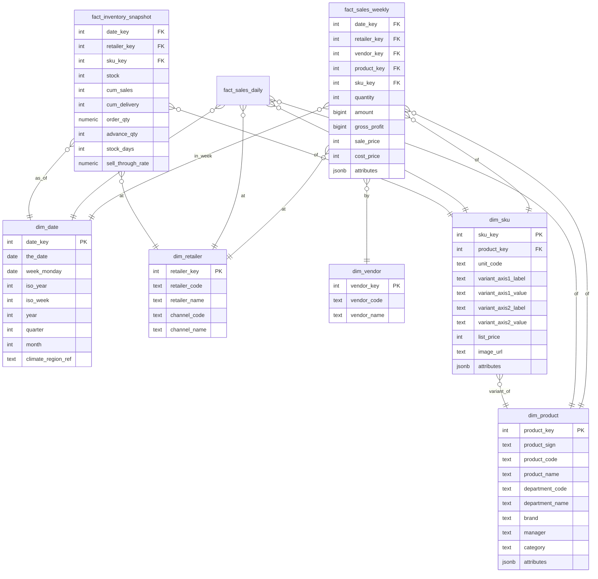
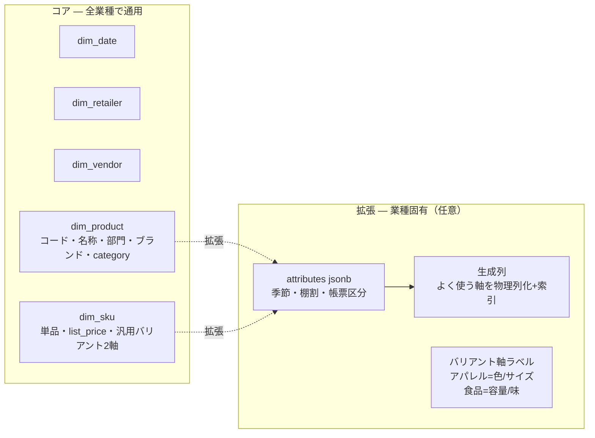
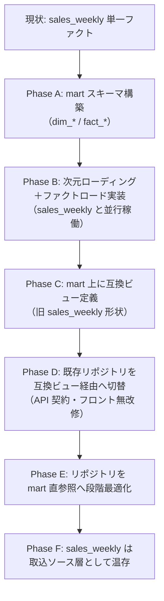

# UndeuxSales 分析DB — スタースキーマ設計（提案）

> **ステータス: 設計提案 ＋ 分析8ページのフル実装。** 本書は壁打ちで確定した設計方針をまとめた成果物。
> `mart` スキーマ（週次売上ファクト＋**在庫スナップショットファクト**＋**気温次元**）と、それに基づく
> **分析8ページのスタースキーマ版**（`/mart` 配下）＋ mart API 一式を実装済み。
> 日次派生ファクト・互換ビュー・テナント別スキーマ分離・集約マテビューは後続（§14 実装状況）。

## 0. 本書の位置づけ

- **現行設計（`design.md`）との関係:** 現行は単一ファクト `sales_weekly`（ワイドな週次スナップショット）。
  本書は**分析用途に最適化したディメンショナルモデル（スタースキーマ）**への再設計案であり、`design.md` を
  即時に置き換えるものではない。移行は §10 の段階移行で行い、互換ビューにより既存 API 契約を維持する。
- **設計の前提（オペレーター合意済み）:** 既存データに固執せず、**他の小売・他のメーカー（食品・雑貨など
  他カテゴリ含む）でも通用する汎用構造**を目指す。
- **SoT 宣言:** 取込済み売上データの SoT は引き続き取込ファイル／`import_batch`。分析 mart は SoT から
  導出される派生（キャッシュ）。本書の設計はこの方向（SoT → mart）を守る。

---

## 1. 設計方針（壁打ち確定事項）

| # | 論点 | 確定 | 根拠 |
|---|------|------|------|
| 1 | ファクトのグレイン | **週次 × SKU × 小売 × メーカー** | 業務上、週次粒度で十分 |
| 2 | 日次データ | **日次派生ファクト `fact_sales_daily`** を別途持つ | 曜日別パターン分析の互換維持。SoT は週次（派生） |
| 3 | 店舗軸 | **企業レベル集約**（個店 `dim_store` は持たない） | 受け入れ先小売は当面企業集約。部門は商品階層でドリルダウン |
| 4 | ファクト分割 | フロー（売上）と **ストック（在庫スナップショット）を分離** | 加算性の違い。「最新週基準」ロジックを一元化 |
| 5 | SKU 固有属性 | **汎用バリアント2軸**（軸名＋値） | アパレル=色/サイズ、食品=容量/味…を1構造で吸収 |
| 6 | 価格の履歴 | **SCD1（上書き）**。定価は `dim_sku` 単一列 | 定価はほぼ不変・過去台帳なし・運用は移行後を正 → SCD2 は過剰 |
| 7 | 業種固有属性 | **`attributes jsonb` ＋ 主要軸は生成列** | 季節・棚割・帳票区分等を業種非依存に吸収。集計性能は生成列で担保 |
| 8 | マルチテナント | **メーカー単位でスキーマ分離** | テナント間の論理/運用分離 |
| 9 | 移行方式 | **互換ビューで段階移行**（mart 上に旧形状ビュー） | API 契約維持・フロント無改修・ロールバック容易 |

### 値引き率・粗利の正確性（重要な切り分け）

| 価格 | 現状の出自 | 履歴 | 配置 | 結果 |
|------|-----------|:----:|------|------|
| 実売価 `baika` | `sales_weekly`（週次） | あり | **ファクト測定値** | 全期間正確 |
| 原価 `genka` | `sales_weekly`（週次） | あり | **ファクト測定値** | 全期間正確 |
| 定価 `list_price` | 商品マスタ（現在値） | なし | **`dim_sku` 単一列（SCD1）** | 移行後を正として正確 |

- **粗利・売上金額は全期間正確**（`baika`・`genka` とも週次履歴があるため）。
- **値引き率** `= 1 − baika ÷ list_price` は、定価がほぼ不変かつ運用が移行後に始まるため、SCD1 で要件を満たす。
- 値下げ動向は実売価 `baika`（週次測定値）で捕捉され、定価の履歴保持は不要。

---

## 2. データモデル全体像

---

## 3. ファクトテーブル定義

ディメンショナルモデリングの3類型に従い、加算性で分割する。

### 3.1 `fact_sales_weekly`（トランザクション/週次フロー・加算可能）

**グレイン:** 1行 = ある取込週 × 1小売 × 1メーカー × 1SKU の売上。

| 列 | 由来 | 説明 |
|----|------|------|
| `date_key` | `import_date` | `dim_date` への FK（週=月曜） |
| `retailer_key` | `customer_code`/`gyotai_code` | `dim_retailer` への FK |
| `vendor_key` | テナント | `dim_vendor` への FK（スキーマ分離下では単一値・省略可） |
| `product_key` | 業態×記号×品番 | `dim_product` への FK |
| `sku_key` | 単品 | `dim_sku` への FK |
| `quantity` | `toshu_uriage_count1..7` の合計 | 週合計売上数量 |
| `amount` | `quantity × baika` | 売上金額（事前計算・bigint） |
| `gross_profit` | `quantity × (baika − genka)` | 粗利（事前計算・bigint） |
| `sale_price` | `baika` | 実売価（週次測定値） |
| `cost_price` | `genka` | 原価（週次測定値） |
| `attributes` | `kisetsu`/`tanawari1/2`/`chohyo_kubun_name`/`donyu_date` | 業種固有・退化属性（jsonb） |
| `import_batch_id`, `ingested_at` | — | 監査列 |

### 3.2 `fact_sales_daily`（日次派生・曜日別分析用）

**グレイン:** 1行 = ある実日付 × 1小売 × 1SKU の売上数量。

- **SoT は週次取込**（`toshu_uriage_count{n}` の曜日展開による派生）。
- 実日付 = `import_date − 8 + day_index`（`day_index 1..7` = 前週 月〜日。`WeekCalendar` と一致）。
- 列: `date_key, retailer_key, product_key, sku_key, day_of_week, quantity`。
- **行数は週次の約7倍**になるため、よく使う集約は**マテリアライズドビュー**で先行集計する（§11）。

### 3.3 `fact_inventory_snapshot`（ピリオディック・スナップショット・セミアディティブ）

**グレイン:** 1行 = ある取込週 × 1小売 × 1SKU の在庫時点値。

| 列 | 由来 | 加算性 |
|----|------|--------|
| `stock` | `zaikosu` | 時間方向に非加算／SKU・小売方向に加算可 |
| `cum_sales` | `ruikei_uriage_count` | 累計（時点値） |
| `cum_delivery` | `ruikei_nohin_count` | 累計（時点値） |
| `order_qty` | `hatchu_count` | 発注数 |
| `advance_qty` | `sakizuke_count` | 先付数 |
| `stock_days` | `zainiti` | 在日（平均で集計） |
| `sell_through_rate` | `cum_sales ÷ cum_delivery` | 消化率（派生・分母0は0） |

> このファクト分離により、現状約20箇所に散在する「期間内最新 `import_date` で取得」ロジックが
> **本テーブル参照に一元化**される（最大の保守性改善）。

---

## 4. ディメンション定義

すべて**サロゲートキー（代理キー）**を主キーとし、ナチュラルキー（ソースコード）は属性として保持する。
履歴方式は全次元 **SCD1（上書き）**（§6）。

### 4.1 `dim_date`（静的）
`date_key, the_date, week_monday, iso_year, iso_week, year, quarter, month, month_name, climate_region_ref`
- 週=月曜（取込週）。年/四半期/月は時間軸クロス集計に使用。
- `climate_region_ref`: 気候地域参照（標準/寒冷/温暖）。気温そのものは地域×期間で別管理（§12、`ClimateModel` の DB 化先）。

### 4.2 `dim_retailer`（小売・企業集約）
`retailer_key, retailer_code, retailer_name, channel_code, channel_name`
- `channel_*` は業態（しまむら/アベイル等）。企業集約のため retailer に内包する1階層（雪片化を避ける）。
- 旧 `customer_code` はメーカーに振り出された取引先コード。本軸に対応。

### 4.3 `dim_vendor`（メーカー＝テナント境界）
`vendor_key, vendor_code, vendor_name`
- スキーマ分離下では各スキーマ内で実質単一行。横断集計が必要になった場合に備え次元として定義しておく。

### 4.4 `dim_product`（商品の親・SCD1）
`product_key, [自然キー: channel_code × product_sign × product_code], product_name, department_code, department_name, brand, manager, category, attributes jsonb`
- 自然キー = 業態 × 商品記号 × 品番。**部門ドリルダウンは本次元の `department_*`** で実現。
- `category`: 業種非依存の汎用商品分類。`attributes`: 季節など業種固有（生成列 `season` を派生）。

### 4.5 `dim_sku`（SKU・SCD1）
`sku_key, product_key, unit_code, variant_axis1_label, variant_axis1_value, variant_axis2_label, variant_axis2_value, list_price, image_url, attributes jsonb`
- 自然キー = 単品コード。`variant_axis1/2` で色/サイズ（他業種は容量/味等）を汎用化。
- `list_price`: 定価（現在値・SCD1）。値引き率の分母。

---

## 5. 汎用化設計（コア／拡張の分離）

「食品・雑貨など他カテゴリのメーカーでも通用する」ため、**コア次元を業種非依存に保ち、業種固有は拡張で吸収**する。

### 5.1 汎用バリアント2軸
- `variant_axis{n}_label`（軸名）＋ `variant_axis{n}_value`（値）。テナント別メタデータで軸ラベルを解決。
- **制約:** 2軸固定。3軸目（例「丈」）が必要になった場合は設計見直しが必要（現行データは2軸で充足）。

### 5.2 拡張属性（jsonb + 生成列）
- 季節・棚割・帳票区分などは `attributes jsonb` に格納。**業種追加で DDL 変更不要**。
- 集計・フィルタに多用する軸（例: 季節）は**生成列**（`GENERATED ALWAYS AS (attributes->>'season') STORED`）＋インデックスで性能を担保。

---

## 6. SCD（Slowly Changing Dimension）方針

**全次元 SCD1（上書き）を採用する。**

| 判断材料 | 内容 |
|---------|------|
| 定価の変動頻度 | ほとんど変わらない（値下げは実売価 `baika` の変動で月スパン） |
| 過去の定価台帳 | 無し（遡及ロード不可） |
| 運用開始時点 | 運用前。移行後を正とする（過去精度を問わない） |

- 上記より、価格・名称の履歴を保持する **SCD2 は過剰設計**と判断（YAGNI）。
- 取込側で**時点結合（point-in-time join）・バージョニングが不要**になり、移行コストが下がる。
- 将来、定価が頻繁に動く業態を扱う必要が生じた場合は、その時点で SCD2 化する。

---

## 7. マルチテナント（スキーマ分離）

- **メーカー（テナント）ごとに PostgreSQL スキーマを分離**する。
- 接続時に `search_path` をテナントスキーマへ設定。`SchemaInitializer` / `NpgsqlConnectionFactory` を
  テナント対応に改修する（§9）。
- マイグレーションは全テナントスキーマへ適用する運用が必要。
- 全テナント横断の集計は原則行わない（製品の性質上不要）。自社運用の全体 KPI が必要な場合は別経路を設ける。

---

## 8. 新旧マッピング（全件）

現行 `sales_weekly`（37列）＋商品マスタ → スター構造の対応表。

| 現行の列 | 意味 | スター配置 | 種別 |
|---------|------|-----------|------|
| `import_date` | 取込日(月曜) | `dim_date.week_monday` | 次元キー |
| `customer_code` | 取引先(単一) | `dim_retailer`（企業集約で実質固定） | 次元/退化 |
| `gyotai_code` | 業態 | `dim_retailer.channel_code` | 次元 |
| `department` | 部門 | `dim_product.department_code` | 次元属性 |
| `hinban_code` | 品番 | `dim_product.product_code`（自然キー） | 次元 |
| `shohin_kigou` | 商品記号 | `dim_product.product_sign`（自然キー） | 次元 |
| `hinmei` | 品名 | `dim_product.product_name` | 次元属性 |
| `tanpin_code` | 単品 | `dim_sku.unit_code`（自然キー） | 次元 |
| `color` | カラー | `dim_sku.variant_axis1_value`（label="カラー"） | 汎用バリアント |
| `size` | サイズ | `dim_sku.variant_axis2_value`（label="サイズ"） | 汎用バリアント |
| `sales_price`（マスタ） | 定価 | `dim_sku.list_price` | 次元属性 |
| `brand`/`manager`/`division`（マスタ） | ブランド/担当/部門 | `dim_product` 属性 | 次元 |
| 画像（マスタ） | SKU画像 | `dim_sku.image_url` | 次元 |
| `baika` | 実売価 | `fact_*.sale_price`（週次測定値） | ファクト測定値 |
| `genka` | 原価 | `fact_*.cost_price`（週次測定値） | ファクト測定値 |
| `toshu_uriage_count1..7` | 曜日別売上数量 | `fact_sales_daily.quantity`（展開）／週次は `quantity` 合計 | メジャー |
| `zaikosu` | 在庫数 | `fact_inventory_snapshot.stock` | メジャー(セミ加算) |
| `ruikei_uriage_count` | 累計売上数 | `fact_inventory_snapshot.cum_sales` | メジャー(セミ加算) |
| `ruikei_nohin_count` | 累計納品数 | `fact_inventory_snapshot.cum_delivery` | メジャー(セミ加算) |
| `hatchu_count` | 発注数 | `fact_inventory_snapshot.order_qty` | メジャー |
| `sakizuke_count` | 先付数 | `fact_inventory_snapshot.advance_qty` | メジャー |
| `zainiti` | 在日 | `fact_inventory_snapshot.stock_days` | メジャー(セミ加算) |
| `kisetsu` | 季節 | `attributes jsonb`（生成列 `season`） | 拡張 |
| `tanawari1`/`tanawari2` | 棚割 | `attributes jsonb` | 拡張 |
| `chohyo_kubun_name` | 帳票区分名 | `fact_sales_weekly.attributes`（退化） | 退化 |
| `donyu_date` | 導入日 | `dim_sku.attributes` or 退化 | 退化 |
| `uriage_count_zenshu`/`_2`/`_3`/`_4shumae` | ラグ列 | **廃止**（未使用＋`dim_date` の window で算出可） | 廃止 |
| `created_at`/`updated_at` | ソース時刻 | 監査列 | 監査 |

> **投入時の正規化:** コード値の表記揺れ（前ゼロ・空白）は次元ローディング前に正規化する（結合不一致＝マスタ未解決を防ぐ）。

---

## 9. 既存機能への影響・再設計マップ

| 既存実装（ファイル） | 現状 | 移行後 | 区分 |
|--------------------|------|--------|------|
| `SalesImportService.RefreshMastersAsync` | ステージングから `DISTINCT` でコードマスタ自動導出 | 次元ローディング（FK解決）。**SCD1ゆえ時点結合不要** | 作り直し |
| `MySqlDumpReader`(37列固定) / `SalesCsvReader`(列名固定) | しまむら固有フォーマット直結 | フォーマットアダプタ（小売別マッピング） | 作り直し |
| 最新週スナップショット（約20箇所: `SalesAnalyticsRepository` 在庫/商品一覧, `ProductMasterRepository`, `ProductAnalyticsRepository`） | `MAX(import_date)` + WHERE/FILTER/LATERAL | `fact_inventory_snapshot` 参照に一元化 | 改善 |
| `SalesAnalyticsRepository.QueryDailyTrendAsync`(日次7列展開) | `CROSS JOIN LATERAL VALUES` ＋ `import_date−8+day_index` | `fact_sales_daily` 直参照 | 書換 |
| `SalesMetricSql`（数量×売価・×(売価−原価)） | C# で式を組み立て SQL 埋め込み | ファクトの事前計算列（`amount`/`gross_profit`） | 書換 |
| `SalesQueryFilter`/`SalesFilterSql`・`CrosstabDimension`（11カテゴリ+3時間軸） | `sw` の列に直結 | 次元 JOIN ＋ jsonb 生成列 | 書換 |
| 商品マスタ自然キー JOIN（業態×記号×品番＋単品） | 3〜4列の複合キー結合 | `dim_product`/`dim_sku` のサロゲート FK | 簡素化 |
| 値引き率（`AnalysisRepository`: `baika` vs `sales_price`） | マスタ現在定価基準 | `baika`(ファクト) ÷ `list_price`(dim_sku)。移行後を正 | 整合 |
| **API 契約（`QueryModels`）** | — | **互換ビューで維持。フロント無改修** | 互換 |
| `customer_code` 単一値前提の機能除外（`FilterOptions`/`ProductAnalyticsKpi`/重回帰の「エリア別在庫配分」） | 取引先軸を除外 | 企業集約方針を維持（個店なし）。将来店舗軸を足す余地は残す | 据置 |

---

## 10. 移行戦略（互換ビューで段階移行）

`sales_weekly`（取込ソース層）を温存しつつ、下流に分析 mart を構築し、**互換ビューで API 契約を保ったまま**段階移行する。

| Phase | 内容 | ロールバック |
|-------|------|-------------|
| A | mart スキーマ（次元・ファクト・インデックス）を作成 | スキーマ DROP（既存に影響なし） |
| B | 取込から次元・ファクトをロードする経路を追加（既存取込と並走） | 新経路を停止（既存取込は無傷） |
| C | mart 上に旧 `sales_weekly` 形状の互換ビューを定義 | ビュー DROP |
| D | 既存リポジトリの参照先を互換ビューへ向ける | 参照先を旧 `sales_weekly` に戻す（即時） |
| E | クエリを mart 直参照へ順次置換（性能最適化） | 当該クエリのみ互換ビューに戻す |
| F | `sales_weekly` を取込ソース層として残置 | — |

- **下位互換:** 各 Phase で旧経路を残し、互換ビューを旧 `sales_weekly` へ向け直せば即時ロールバック可能。
- **二重保守期間**（Phase D〜E）の管理が必要。

---

## 11. パフォーマンス考慮

- **集約マテビュー:** `fact_sales_daily`（週次の約7倍）と、頻出のクロス集計（部門別・週次トレンド等）は
  マテリアライズドビューで先行集計する。
- **インデックス:** 各ファクトの FK 群、`dim_date` への BRIN（日付昇順の性質を活用）、jsonb 生成列のインデックス。
- **事前計算列:** `amount`/`gross_profit` をファクトに持ち、実行時の式評価を排除。
- **互換ビューの性能 PoC（必須）:** クロス集計・商品一覧で現状速度（サマリー実測約0.3秒等）を
  維持できるか、移行着手前に検証する。

---

## 12. 残課題（実装フェーズで対応）

- [ ] 互換ビューのパフォーマンス PoC（クロス集計・商品一覧）
- [ ] `fact_sales_daily` の集約マテビュー設計
- [ ] スキーマ分離のマイグレーション運用（`search_path` / `SchemaInitializer` / `NpgsqlConnectionFactory` 改修）
- [ ] 気温（`ClimateModel`）の DB 化方式（`dim_date.climate_region_ref` ＋ 気候テーブル）
- [ ] バリアント軸ラベルのテナント別メタデータ（色/サイズ ↔ 容量/味の解決）
- [ ] 新旧マッピングの投入時正規化ルールの確定（前ゼロ・空白除去）
- [ ] フォーマットアダプタの I/F 設計（小売別の列マッピング定義）

---

## 13. 意思決定ログ（壁打ち経緯）

| 決定 | 選択 | 検討した代替 | 決め手 |
|------|------|-------------|--------|
| グレイン | 週次 × SKU × 小売 × メーカー | 日次×店舗×SKU | 業務上週次で十分。店舗は企業集約 |
| 日次トレンド | 日次派生ファクトに分離 | 週次に曜日7メジャー温存／曜日別廃止 | 曜日別分析を正規化で保持 |
| SKU 固有属性 | 汎用バリアント2軸 | jsonb / 業種別拡張テーブル | 単純さと集計性のバランス |
| 価格履歴 | SCD1 | SCD2 / SCD2スキーマ・1版運用 | 定価ほぼ不変・台帳なし・移行後を正 → SCD2 は過剰 |
| 業種固有属性 | jsonb + 生成列 | ジャンク次元 / nullable列 | 食品・雑貨拡張の柔軟性＋集計性能 |
| テナント分離 | スキーマ分離 | 単一DB+RLS / DB分離 | 論理・運用分離のバランス |
| 移行方式 | 互換ビュー段階移行 | mart別構築 / ビッグバン | API契約維持・ロールバック容易 |

> **CLAUDE.md 原則との整合:** 互換ビュー＝下位互換（原則7）、`sales_weekly` 温存＝SoT 保護（原則6）、
> jsonb＝汎用性、SCD1＝過剰設計の回避（YAGNI）。

---

## 14. 実装状況（分析9ページ フル対応）

「DB＝新スキーマ新設／API＝既存に追加／画面＝新ページ新設（既存は不変）」の方針で、
分析8ページのスタースキーマ版を end-to-end で実装した。後追いで**部門分析（`/mart/department`）**を
追加し（既存の `summary`/`breakdown`/`crosstab` API を再利用。新規 API・新規スキーマは不要）、分析画面は計9ページとなった。

### 実装済み

| 層 | 内容 | 主なファイル |
|----|------|------------|
| DB | `mart` スキーマ：`dim_date`/`dim_retailer`/`dim_product`/`dim_sku`（**`attributes jsonb` に導入日 `donyu` を保持**）、ファクト `fact_sales_weekly`／**`fact_inventory_snapshot`**、**`dim_climate`（気温日次・エリア別）**、`build_info`、再構築関数 `mart.rebuild()`（売上＋在庫を構築。気温は sales 非依存で対象外。代表行選択は決定的 tie-break — dim_product は `import_date DESC, id DESC`、dim_sku は `import_date DESC, donyu_date DESC, id DESC`） | `db/schema.sql` |
| 気温投入 | `db/climate_daily.csv`（東京/札幌/那覇）を DataLoader が `mart.dim_climate` へ投入（毎起動で冪等な TRUNCATE+COPY、**非ブロッキング**：失敗してもデプロイを止めない。CSV 未配置時はスキップ） | `DataLoader/Program.cs`・`Core/Parsing/ClimateCsvReader.cs` |
| API | `GET /api/mart/{status,summary,breakdown,inventory,products,crosstab,ranking,weekly-series,markdown,introductions,introduction-options}`、**`GET /api/mart/inventory/{actions,items}`（在庫アクション分析: 滞留=在庫日数60日超×消化率75%未満・不動=直近8週出荷ゼロの自動抽出。閾値 SoT は `InventoryHealthRules`、不動判定は直近26週限定の last_sold 方式＝ウィンドウ関数・フルスキャン回避、在庫金額は同一グレイン1:1の `fact_sales_weekly.cost_price` 結合、明細は自然キー返却）**、`POST /api/mart/rebuild`（認証ユーザー・**非同期**：即時応答＋`status` ポーリング） | `MartController.cs`・`MartAnalyticsRepository.cs`・`MartIntroductionQuery.cs`・`MartInventoryActionModels.cs`・`QueryModels.cs`・`InventoryHealthRules.cs` |
| 共有ロジック | クロス集計マトリクス組立・ランキング組立を sales 系と共有（プレゼンテーション非依存の抽出。重複排除＝DRY）。在日バケット述語は `StockDaysSql` で sales 系（`zainiti`）と mart 系（`stock_days`）が共有 | `CrosstabMatrixBuilder.cs`・`RankingBuilder.cs`・`SalesQueryFilter.cs` |
| 画面 | `/mart`（全社サマリー）・`/mart/sales`・**`/mart/products`（一覧=画像カード／`/mart/products/{id}`=商品詳細分析）**・`/mart/inventory`（在庫マネジメント: ページ内4タブ＝ダッシュボード/在庫一覧/滞留/不動、`?tab=` 同期）・`/mart/crosstab`（クロス集計。各ページに散在していたクロス集計を集約する正）・**`/mart/department`（部門分析。部門軸の内訳＋部門×任意軸のクロス集計）**・`/mart/ranking`・`/mart/scatter`・`/mart/simulation`・`/mart/introductions`（商品導入管理）。**プロトタイプ段階の旧分析ページは廃止し、本群が分析画面の正**（`/` はホーム＝目的別メニューで、各ページへはカテゴリのタブで遷移。「（スタースキーマ）」の画面表記も廃止）。mart 未構築時はガード表示。集計軸・メトリクスのカタログは `utils/crosstabCatalog.ts` を SoT として共有 | `frontend/app/pages/mart/**/*.vue`・`utils/navigation.ts`・`utils/crosstabCatalog.ts`・`composables/useMart.ts`・`components/MartNotBuiltNotice.vue`・`types/api.ts` |

- **グレイン:** 売上・在庫とも 週×小売×SKU。売上は数量・金額・粗利を事前計算列で保持。在庫は時点値（在庫数・累計売上/納品・発注・先付）＋在日（平均集計）。
- **在庫スナップショット:** 「期間内最新取込週で在庫取得」ロジックを `fact_inventory_snapshot` 参照に一元化（設計 §3.3）。全社サマリーKPIに在庫数・消化率を追加。
- **気温:** `mart.dim_climate`（実測。CSV由来）を売上週の範囲 [週月曜−7, 週月曜−1] で集計し、完全週（7日）が揃う週は実測、未カバー週は標準気候（`ClimateModel` 平年値）へフォールバック。散布図・重回帰の説明変数に用いる。
- **mart フィルタ:** 期間・部門・業態・季節・品番・**商品記号（shohinKigos。業態×記号×品番の自然キーで単一商品へ絞る商品詳細分析用）**に加え、**棚割1**（`dim_product.attributes->>'tanawari1'`。SCD1＝最新取込週の値）と**平均在庫日数（在日）バケット**（同一グレインの `fact_inventory_snapshot.stock_days` を EXISTS 参照。sales 系の週次行 `zainiti` フィルタと同一意味論）に対応。
- **週次系列・散布図素材の拡張:** `weekly-series` は週ごとの店頭在庫・在日・消化率を、`markdown` は型番ごとの季節・店頭在庫・平均在庫日数を併せて返す（売上分析の複合チャート「週次売上推移グラフ」・週次明細・型番別明細の素材）。sales 系 `/api/analysis/*` も同一契約。
- **商品導入管理:** 導入日（`sales_weekly.donyu_date`、YYYYMMDD 文字列。`'0'`・`'00000000'`・非8桁は未設定扱い）を `dim_sku.attributes->>'donyu'` に保持し（文字列比較＝日付順。型変換失敗で再構築が止まるリスクを回避）、商品単位の導入一覧・導入時期/導入日 From-To・業態（タグ・複数選択）・部門・ブランド・服種（品番CD）・担当者・キーワードのフィルタを提供する。**商品の導入日の定義**＝「各SKUの現在値（SCD1: 最新取込行の導入日）のうち商品内で最小」。同一SKUが複数の導入日を持つ場合、過去の導入履歴ではなく現在値を採用する（SCD1の設計判断）。
- **商品詳細分析（/mart/products/{id}）:** 一覧は商品マスタと同じ画像カード表現（`ProductMasterCard` / `ProductMasterFilters` を再利用。対象はマスタ登録商品）。詳細は「画像・基本情報・サマリー・SKU情報・週次売上推移グラフ（売上数量/売上金額=折れ線、店頭在庫=棒、気温=折れ線）」で構成。クロス集計は各ページに埋め込まず専用ページ `/mart/crosstab` に集約し、商品詳細からは当該商品の業態×品番（品番3桁）を共有フィルタへ引き継いでドリルダウンする（共有フィルタに商品記号軸が無いためスコープは品番3桁単位）。マスタ属性は `/api/product-master/{id}`、集計は商品の自然キーを businessTypes/shohinKigos/hinbans に渡した `/api/mart/*` から取得する。
- **条件設定の導線:** 各分析ページは「フィルタ → 集計単位 → 表示集計値」の順に設定コントロールを配置する（操作者の思考順序に一致させる）。
- **対応軸の差分（設計上の制約）:** mart は帳票区分・棚割を**集計軸（ディメンション）としては**保持しないため、クロス集計／ランキングの対応軸は**サブセット**（帳票区分・棚割1/2を除く。棚割1は上記のとおり**フィルタとしては**対応）。フロントは対応軸のみ提示し、API も未対応軸には 400 を返す。日次トレンドは `fact_sales_daily` 未実装のため mart 売上分析は週次のみ。**倉庫在庫**はソース（売上参照DB）に店頭/倉庫の在庫区分が無いため対象外（`zaikosu` は店頭在庫として扱う。design.md §11.4 と同一の判断）。
- **再構築:** `sales_weekly` ＋ 商品マスタから `mart.rebuild()` で全再構築（冪等・advisory lock で直列化）。商品マスタの自然キー重複は `DISTINCT ON`（`updated_at` 最新）で1件に絞り、一意制約違反を回避。
- **単一走査での2ファクト構築:** 売上ファクトと在庫スナップショットはグレイン（週×小売×SKU）と次元結合が同一で測定値だけが異なる。そこで `sales_weekly`（約160万行）の走査・次元結合・GROUP BY を **1回だけ**行い（CTE `agg`）、データ変更CTEで両ファクトへ流し込む（`agg` は複数参照のため1回マテリアライズ）。在庫追加による二重走査で再構築が従来比2倍となりコマンドタイムアウト（旧600秒）を超えた問題への対処であり、再構築時間を約半減する。
- **非同期実行・タイムアウトしない設計:** 約160万行規模の集約は共有 `nginx-proxy` のタイムアウト（約60秒）を超えるため、`POST /api/mart/rebuild` は実行権を取得して即応答し、本体は HTTP リクエストから切り離したバックグラウンドタスクで実行する。状態は `build_info.status`（idle/running/completed/failed）で管理し、フロントは `GET /api/mart/status` をポーリングする。再構築は有界（有限テーブルの集約で必ず終了）・advisory lock で直列化・status で状態管理されるため、**クライアント側コマンドタイムアウトは 0（無制限）**、加えて `mart.rebuild()` 内で **`SET LOCAL statement_timeout = 0`**（サーバ側 statement_timeout の無効化）とし、データ量に依らず再構築がタイムアウトしないことを保証する。45 分以上滞留した `running`（プロセス異常終了で取り残された状態）は stale とみなし再実行を許可する。
- **既存への影響:** なし（`sales_weekly` も既存API・既存ページも不変。mart は別スキーマ・別ルートの追加系統）。共有ビルダー抽出は sales 系の挙動を変えない純粋リファクタ（既存統合テストで担保）。

### 未実装（後続イテレーション）

- `fact_sales_daily`（曜日別・日次トレンドの mart 対応）／集約マテビュー
- 互換ビュー（既存APIの mart 移行）／テナント別スキーマ分離
- 取込フックでの自動再構築（現状は手動 `POST /api/mart/rebuild`）
- 帳票区分・棚割を**集計軸として**扱う場合の mart 拡張（退化属性として fact に保持 or jsonb 化。
  棚割1・在日の**フィルタ**は対応済み）

> **既存 mart データへの注意（下位互換）:** `dim_sku.attributes`（導入日 `donyu`）は本改修で追加した列のため、
> 改修前に構築済みの mart には導入日が入っていない。デプロイ後に `POST /api/mart/rebuild`（全社サマリー画面の
> 「mart を再構築」）を1回実行すると反映される（商品導入管理画面にも同旨の案内を表示する）。
> mart は派生キャッシュであり、再構築で取込済みデータ・取込履歴が巻き戻ることはない。
