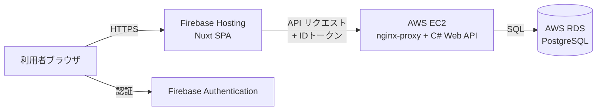

# インフラ・デプロイ

UndeuxSales 売上参照スイートのデプロイ構成。

## 構成概要

| 層 | 配置先 | 内容 |
|----|--------|------|
| フロントエンド | Firebase Hosting | Nuxt SPA（静的ファイル） |
| 認証 | Firebase Authentication | メール/パスワード認証・IDトークン発行 |
| API | AWS EC2 | C# (ASP.NET Core) Web API（EC2 上の既存 nginx-proxy 経由で自動HTTPS公開） |
| データベース | AWS RDS for PostgreSQL | 売上参照データ |

## デプロイ

デプロイは **GitHub Actions** で自動化されている。

| ワークフロー | 対象 | 内容 |
|-------------|------|------|
| `deploy` | 両方 | **通常運用のパイプライン**。事前検証 → テストゲート（単体・結合・シナリオ）→ バックエンド → フロントエンド → 結果レポート。テストが1つでも失敗するとデプロイを中断（下記2つを再利用呼び出し） |
| `deploy-frontend` | Firebase Hosting | Nuxt SPA をビルドし配信（緊急時の個別デプロイ用。テストゲートを迂回） |
| `deploy-backend` | AWS EC2 | API をビルドし起動、初期データを投入（緊急時の個別デプロイ用。テストゲートを迂回） |

デプロイ本体（`deploy-backend` / `deploy-frontend`）は共通の concurrency グループ（`deploy`）でキューイングされ、同時実行されない（親の `deploy` パイプラインはデッドロック回避のためグループを持たない）。
待機できるのは1件のみで、待機中にさらに投入すると**待機中の run が新しい run に置き換わる**
（実行中の run はキャンセルされない）。

設定値はすべて GitHub リポジトリシークレットで管理する。

➡ **初回セットアップとデプロイの全手順は [`deploy-guide.md`](./deploy-guide.md) を参照**
（Windows PowerShell コマンドベース）。

- EC2 上の構成・手動運用コマンド: [`aws/README.md`](./aws/README.md)
- ローカル実行（docker compose）: リポジトリルートの `README.md`

## 認証と取込権限

- Firebase コンソールで Authentication を有効化し、「メール/パスワード」プロバイダを有効にする。
  利用者アカウントを登録する。
- **取込権限:** 週次CSV取込（`POST /api/imports`、データ更新操作）は、カスタムクレーム
  `role=admin` を持つ利用者に限定される。管理者アカウントには Firebase Admin SDK で
  クレームを付与する（例: `admin.auth().setCustomUserClaims(uid, { role: 'admin' })`）。
  クレーム未付与の利用者は参照のみ可能（取込は 403 となる）。

## 設定値の対応

| シークレット | フロントエンド（ビルド時） | API（実行時） |
|-------------|------------------------|--------------|
| `FIREBASE_PROJECT_ID` | `NUXT_PUBLIC_FIREBASE_PROJECT_ID` | `Firebase__ProjectId` |
| `API_DOMAIN` | `NUXT_PUBLIC_API_BASE_URL`（`https://` 付与） | — |
| `FRONTEND_ORIGIN` | — | `Cors__AllowedOrigins__0` |
| `RDS_CONNECTION_STRING` | — | `ConnectionStrings__Default` |
