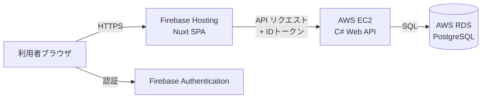

# インフラ・デプロイ雛形

UndeuxSales 売上参照スイートのデプロイ構成。

## 構成概要



| 層 | 配置先 | 内容 |
|----|--------|------|
| フロントエンド | Firebase Hosting | Nuxt SPA（静的ファイル） |
| 認証 | Firebase Authentication | メール/パスワード認証・IDトークン発行 |
| API | AWS EC2 | C# (ASP.NET Core) Web API |
| データベース | AWS RDS for PostgreSQL | 売上参照データ |

## デプロイ手順

### 1. フロントエンド（Firebase Hosting）

リポジトリルートに `firebase.json` と `.firebaserc`（`.firebaserc.example` を複製しプロジェクトIDを設定）を用意し、以下を実行する。

```bash
# フロントエンドを静的生成（API/Firebase 設定をビルド時に埋め込む）
cd frontend
NUXT_PUBLIC_API_BASE_URL=https://<API のドメイン> \
NUXT_PUBLIC_FIREBASE_API_KEY=<APIキー> \
NUXT_PUBLIC_FIREBASE_AUTH_DOMAIN=<authDomain> \
NUXT_PUBLIC_FIREBASE_PROJECT_ID=<projectId> \
  npm run generate
cd ..

# デプロイ
firebase deploy --only hosting
```

### 2. 認証（Firebase Authentication）

- Firebase コンソールで Authentication を有効化し、「メール/パスワード」プロバイダを有効にする。
- 利用者アカウントを登録する。
- API 側の環境変数 `Firebase__ProjectId` に同じプロジェクトIDを設定する（IDトークン検証に使用）。
- **取込権限:** 週次CSV取込（`POST /api/imports`、データ更新操作）は、カスタムクレーム
  `role=admin` を持つ利用者に限定される。管理者アカウントには Firebase Admin SDK で
  クレームを付与する（例: `admin.auth().setCustomUserClaims(uid, { role: 'admin' })`）。
  クレーム未付与の利用者は参照のみ可能（取込は 403 となる）。

### 3. API・データベース（AWS）

`aws/README.md` を参照。

## 設定値の対応

| 設定 | フロントエンド | API |
|------|--------------|-----|
| Firebase プロジェクトID | `NUXT_PUBLIC_FIREBASE_PROJECT_ID` | `Firebase__ProjectId` |
| API ベースURL | `NUXT_PUBLIC_API_BASE_URL` | — |
| フロントエンドのオリジン | — | `Cors__AllowedOrigins__0` |
| DB 接続文字列 | — | `ConnectionStrings__Default` |
